<div align="center">

# Universidad Peruana De Ciencias Aplicadas
## Ingeniería de Software  
## NRC: 3479
## 1ASI0572 - Desarrollo de Soluciones IOT


# "Informe de Trabajo Final"
## Docente: Angel Augusto Velasquez Nuñez  
## Startup: MetaSoft  
## Producto: SafeCar

## Relación de integrantes:

**Hardie Alfonso Holguin Gamarra — U202220250**  
**Javier Kenyi Mendoza Solis — U201824550**  
**Gustavo Jandroel Aguirre Rodríguez — U202124162**  
**Javier Sharvel Irigoyen Matos — U20221D156**  
**Gonzalo Andre Zavala Quedena — U202113656**  
**Anaely Zarely Burga Loarte — U202118264**

</div>

<hr>

## Registro de Versiones del Informe

<table>
    <thead>
        <tr>
            <th>Versión</th>
            <th>Fecha</th>
            <th>Autor</th>
            <th>Descripción de Modificación</th>
        </tr>
    </thead>
    <tbody>
        <!-- Fila 1-->
        <tr>
            <td>1.0</td>
            <td>03/09/2025</td>
            <td>Janover Gonzalo Saldaña Vela</td>
            <td>Facilitación y documentación inicial del taller de Event Storming, identificando los principales eventos y contextos del sistema.</td>
        </tr>
        <!-- Fila 2-->
        <tr>
            <td>1.1</td>
            <td>04/09/2025</td>
            <td>Hardie Alfonso Holguin Gamarra</td>
            <td>Participación activa en el mapeo de eventos clave y propuesta de mejoras en la segmentación de contextos.</td>
        </tr>
        <!-- Fila 3-->
        <tr>
            <td>1.2</td>
            <td>05/09/2025</td>
            <td>Gonzalo Andre Zavala Quedena</td>
            <td>Colaboración en la identificación de eventos y refinamiento de los límites de contexto durante el Event Storming.</td>
        </tr>
        <!-- Fila 4-->
        <tr>
            <td>1.3</td>
            <td>06/09/2025</td>
            <td>Javier Kenyi Mendoza Solis</td>
            <td>Aporte de ideas para la definición de eventos y sugerencias para la integración de los contextos descubiertos.</td>
        </tr>
        <!-- Fila 5-->
        <tr>
            <td>1.4</td>
            <td>07/09/2025</td>
            <td>Gustavo Jandroel Aguirre Rodríguez</td>
            <td>Apoyo en la organización visual del taller y registro de los eventos principales identificados.</td>
        </tr>
        <!-- Fila 6-->
        <tr>
            <td>1.5</td>
            <td>08/09/2025</td>
            <td>Javier Sharvel Irigoyen Matos</td>
            <td>Colaboración en la priorización de eventos y discusión sobre posibles mejoras en los flujos del sistema.</td>
        </tr>
        <!-- Fila 7-->
        <tr>
            <td>1.6</td>
            <td>09/09/2025</td>
            <td>Anaely</td>
            <td>Participación en la lluvia de ideas y aporte en la definición de eventos relevantes para el sistema.</td>
        </tr>
        <!-- Fila 8-->
        <tr>
            <td>1.7</td>
            <td>10/09/2025</td>
            <td>Janover Gonzalo Saldaña Vela</td>
            <td>Modelado de flujos de mensajes entre dominios y elaboración de los primeros Bounded Context Canvases.</td>
        </tr>
        <!-- Fila 9-->
        <tr>
            <td>1.8</td>
            <td>11/09/2025</td>
            <td>Hardie Alfonso Holguin Gamarra</td>
            <td>Refinamiento de los flujos de mensajes y validación de la coherencia entre los contextos definidos.</td>
        </tr>
        <!-- Fila 10-->
        <tr>
            <td>1.9</td>
            <td>12/09/2025</td>
            <td>Gonzalo Andre Zavala Quedena</td>
            <td>Apoyo en la documentación de los flujos de mensajes y revisión de los Bounded Context Canvases.</td>
        </tr>
        <!-- Fila 11-->
        <tr>
            <td>1.10</td>
            <td>13/09/2025</td>
            <td>Javier Kenyi Mendoza Solis</td>
            <td>Discusión y ajuste de los límites de contexto, asegurando la correcta separación de responsabilidades.</td>
        </tr>
        <!-- Fila 12-->
        <tr>
            <td>1.11</td>
            <td>13/09/2025</td>
            <td>Gustavo Jandroel Aguirre Rodríguez</td>
            <td>Validación de los modelos de contexto y sugerencias para optimizar la comunicación entre dominios.</td>
        </tr>
        <!-- Fila 13-->
        <tr>
            <td>1.12</td>
            <td>13/09/2025</td>
            <td>Javier Sharvel Irigoyen Matos</td>
            <td>Colaboración en la revisión final de los Bounded Context Canvases y aportes en la documentación.</td>
        </tr>
        <!-- Fila 14-->
        <tr>
            <td>1.13</td>
            <td>13/09/2025</td>
            <td>Anaely</td>
            <td>Participación en la consolidación de los contextos y revisión de los flujos de mensajes.</td>
        </tr>
        <!-- Fila 15-->
        <tr>
            <td>1.14</td>
            <td>13/09/2025</td>
            <td>Janover Gonzalo Saldaña Vela</td>
            <td>Coordinación del taller de Big Picture EventStorming y desarrollo del glosario de lenguaje ubicuo.</td>
        </tr>
        <!-- Fila 16-->
        <tr>
            <td>1.15</td>
            <td>13/09/2025</td>
            <td>Hardie Alfonso Holguin Gamarra</td>
            <td>Colaboración en la definición de términos clave y validación del lenguaje ubicuo con el equipo.</td>
        </tr>
        <!-- Fila 17-->
        <tr>
            <td>1.16</td>
            <td>13/09/2025</td>
            <td>Gonzalo Andre Zavala Quedena</td>
            <td>Apoyo en la elaboración del glosario y discusión sobre la alineación conceptual del equipo.</td>
        </tr>
        <!-- Fila 18-->
        <tr>
            <td>1.17</td>
            <td>13/09/2025</td>
            <td>Javier Kenyi Mendoza Solis</td>
            <td>Revisión y aportes en la definición de términos y conceptos del lenguaje ubicuo.</td>
        </tr>
        <!-- Fila 19-->
        <tr>
            <td>1.18</td>
            <td>13/09/2025</td>
            <td>Gustavo Jandroel Aguirre Rodríguez</td>
            <td>Participación en la validación del lenguaje ubicuo y sugerencias para su aplicación en el proyecto.</td>
        </tr>
        <!-- Fila 20-->
        <tr>
            <td>1.19</td>
            <td>13/09/2025</td>
            <td>Javier Sharvel Irigoyen Matos</td>
            <td>Colaboración en la integración del lenguaje ubicuo en la documentación del proyecto.</td>
        </tr>
        <!-- Fila 21-->
        <tr>
            <td>1.20</td>
            <td>13/09/2025</td>
            <td>Anaely</td>
            <td>Apoyo en la revisión final del glosario y aportes en la comunicación del equipo.</td>
        </tr>
        <!-- Fila 22-->
        <tr>
            <td>1.21</td>
            <td>13/09/2025</td>
            <td>Gonzalo Andre Zavala Quedena</td>
            <td>Redacción y estructuración completa del Capítulo I, incluyendo perfiles y segmentos objetivo.</td>
        </tr>
        <!-- Fila 23-->
        <tr>
            <td>1.22</td>
            <td>13/09/2025</td>
            <td>Gonzalo Andre Zavala Quedena</td>
            <td>Elaboración de User Personas para el Capítulo III, detallando arquetipos y necesidades de usuarios.</td>
        </tr>
        <!-- Fila 24-->
        <tr>
            <td>1.23</td>
            <td>13/09/2025</td>
            <td>Hardie Alfonso Holguin Gamarra</td>
            <td>Definición de problemáticas y supuestos en el proceso Lean UX, aportando ideas para el canvas.</td>
        </tr>
        <!-- Fila 25-->
        <tr>
            <td>1.24</td>
            <td>13/09/2025</td>
            <td>Javier Kenyi Mendoza Solis</td>
            <td>Análisis de competidores y redacción del apartado de estrategias frente a la competencia.</td>
        </tr>
        <!-- Fila 26-->
        <tr>
            <td>1.25</td>
            <td>13/09/2025</td>
            <td>Gonzalo Andre Zavala Quedena</td>
            <td>Diseño de la guía de entrevistas para la recolección de información de usuarios.</td>
        </tr>
        <!-- Fila 27-->
        <tr>
            <td>1.26</td>
            <td>13/09/2025</td>
            <td>Hardie Alfonso Holguin Gamarra</td>
            <td>Registro y sistematización de las entrevistas realizadas a usuarios clave.</td>
        </tr>
        <!-- Fila 28-->
        <tr>
            <td>1.27</td>
            <td>13/09/2025</td>
            <td>Javier Kenyi Mendoza Solis</td>
            <td>Documentación de hallazgos y aprendizajes obtenidos en las entrevistas con usuarios.</td>
        </tr>
        <!-- Fila 29-->
        <tr>
            <td>1.28</td>
            <td>13/09/2025</td>
            <td>Javier Sharvel Irigoyen Matos</td>
            <td>Colaboración en el registro y análisis de entrevistas, aportando perspectivas adicionales.</td>
        </tr>
        <!-- Fila 30-->
        <tr>
            <td>1.29</td>
            <td>13/09/2025</td>
            <td>Anaely</td>
            <td>Desarrollo de segmentos objetivo y apoyo en la elaboración del empathy mapping.</td>
        </tr>
        <!-- Fila 31-->
        <tr>
            <td>1.30</td>
            <td>15/09/2025</td>
            <td>Gonzalo Andre Zavala Quedena</td>
            <td>Elaboración de los diagramas de arquitectura de software a nivel de contenedores y contexto, asegurando claridad en la visión del sistema.</td>
        </tr>
        <!-- Fila 32-->
        <tr>
            <td>1.31</td>
            <td>15/09/2025</td>
            <td>Gustavo Jandroel Aguirre Rodríguez</td>
            <td>Desarrollo del diagrama de landscape del sistema, integrando los principales componentes tecnológicos.</td>
        </tr>
        <!-- Fila 33-->
        <tr>
            <td>1.32</td>
            <td>13/09/2025</td>
            <td>Hardie Alfonso Holguin Gamarra</td>
            <td>Diseño y documentación del Impact Mapping para alinear objetivos y funcionalidades del sistema.</td>
        </tr>
        <!-- Fila 34-->
        <tr>
            <td>1.33</td>
            <td>13/09/2025</td>
            <td>Janover Gonzalo Saldaña Vela</td>
            <td>Coordinación y consolidación del Product Backlog, integrando los aportes de todo el equipo.</td>
        </tr>
        <!-- Fila 35-->
        <tr>
            <td>2.0</td>
            <td></td>
            <td></td>
            <td></td>
        </tr>
    </tbody>
</table>

## Project Report Collaboration Insights

**URL del repositorio para el reporte del proyecto:** Enlace al repositorio: </br>
https://github.com/MetaSoft-IOT/upc-pre-202520-1asi0572-3479-MetaSoft-report

<p align="justify">
Github Collaboration Insights proporciona un cronograma que muestra las principales ramas y los procesos de fusión que han ocurrido. Todas las ramas se han generado siguiendo los principios de GitFlow, lo que garantiza una organización efectiva al utilizar un sistema de control de versiones.
</p>

* Janover Gonzalo Saldaña Vela (JanoverSaldana)
* Hardie Alfonso Holguin Gamarra (HOLGUINUPC)
* Javier Kenyi Mendoza Solis (Kenyi-Mendoza-Solis)
* Gustavo Jandroel Aguirre Rodríguez  (Jandroel)
* Javier Sharvel Irigoyen Matos (sharvel-irigoyen)
* Anaely Burga (userxx1000)

Se dividieron las siguientes ramas para la colaboración en el proyecto:

* master
* chapter-I
* chapter-II
* chapter-III
* chapter-IV
* chapter-V
* develop
* annexes
* release-v1.0

### ENTREGABLE TRABAJO PARCIAL (TB2)

**Gráficos de colaboración de los integrantes del equipo**

<p align="justify">
A continuación se presentan los gráficos de colaboración de los integrantes del equipo en el
repositorio de nuestro segundo sprint. Estos gráficos ofrecen una representación visual de la cantidad
de contribuciones realizadas por cada miembro del equipo, junto con la fecha en que se llevaron a
cabo. Además, se presenta información sobre la cantidad de líneas de código que se han modificado
en cada uno de los commits.
</p>

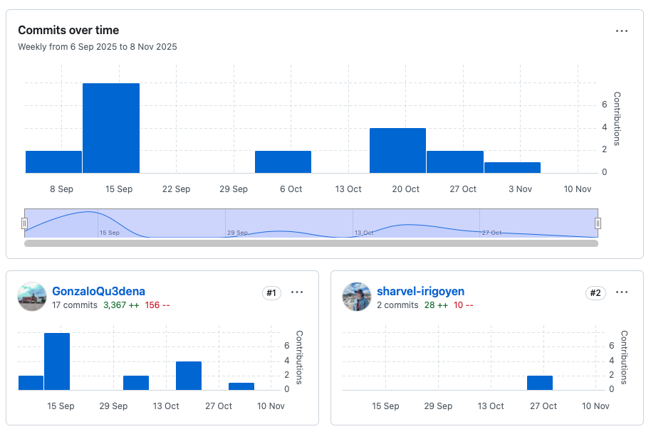

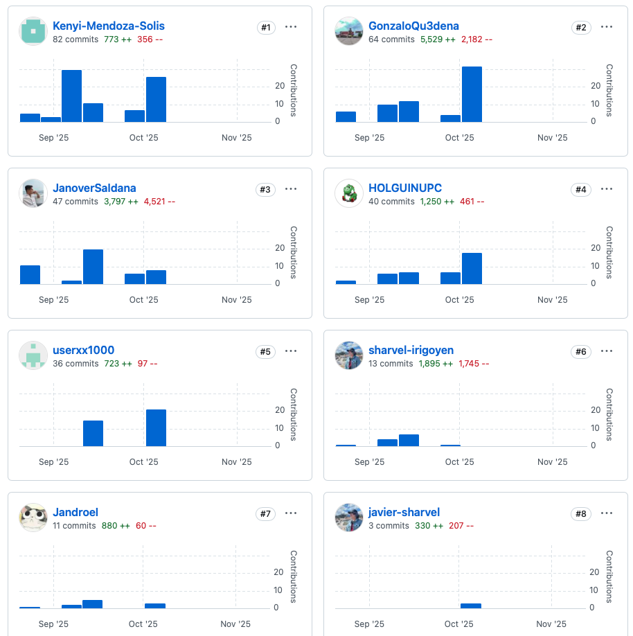

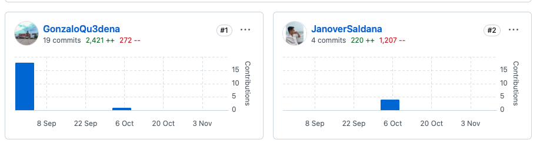


## Tabla de Contenido

### [Capítulo I: Introducción](docs/capitulo-I.md)
**1.1. Startup Profile**  
1.1.1. Descripción de la Startup  
1.1.2. Perfiles de integrantes del equipo  
**1.2. Solution Profile**  
1.2.1. Antecedentes y problemática  
1.2.2. Lean UX Process  
 1.2.2.1. Lean UX Problem Statements  
 1.2.2.2. Lean UX Assumptions  
 1.2.2.3. Lean UX Hypothesis Statements  
 1.2.2.4. Lean UX Canvas  
**1.3. Segmentos objetivo**

### **Capítulo II: Requirements Elicitation & Analysis**
**2.1. Competidores**  
2.1.1. Análisis competitivo  
2.1.2. Estrategias y tácticas frente a competidores  
**2.2. Entrevistas**  
2.2.1. Diseño de entrevistas  
2.2.2. Registro de entrevistas  
2.2.3. Análisis de entrevistas  
**2.3. Needfinding**  
2.3.1. User Personas  
2.3.2. User Task Matrix  
2.3.3. User Journey Mapping  
2.3.4. Empathy Mapping  
**2.4. Big Picture EventStorming**  
**2.5. Ubiquitous Language**

### **Capítulo III: Requirements Specification**
**3.1. User Stories**  
**3.2. Impact Mapping**  
**3.3. Product Backlog**

### **Capítulo IV: Solution Software Design**
**4.1. Strategic-Level Domain-Driven Design**  
4.1.1. Design-Level EventStorming  
 4.1.1.1. Candidate Context Discovery  
 4.1.1.2. Domain Message Flows Modeling  
 4.1.1.3. Bounded Context Canvases  
4.1.2. Context Mapping  
4.1.3. Software Architecture  
 4.1.3.1. Software Architecture System Landscape Diagram  
 4.1.3.2. Software Architecture Context Level Diagrams  
 4.1.3.3. Software Architecture Container Level Diagrams  
 4.1.3.4. Software Architecture Deployment Diagrams  
**4.2. Tactical-Level Domain-Driven Design**  
4.2.X. Bounded Context: \<Bounded Context Name\>  
 4.2.X.1. Domain Layer  
 4.2.X.2. Interface Layer  
 4.2.X.3. Application Layer  
 4.2.X.4. Infrastructure Layer  
 4.2.X.5. Bounded Context Software Architecture Component Level Diagrams  
 4.2.X.6. Bounded Context Software Architecture Code Level Diagrams  
  4.2.X.6.1. Bounded Context Domain Layer Class Diagrams  
  4.2.X.6.2. Bounded Context Database Design Diagram  

### **Capítulo V: Solution UI/UX Design**
**5.1. Style Guidelines**  
5.1.1. General Style Guidelines  
5.1.2. Web, Mobile and IoT Style Guidelines  
**5.2. Information Architecture**  
5.2.1. Organization Systems  
5.2.2. Labeling Systems  
5.2.3. SEO Tags and Meta Tags  
5.2.4. Searching Systems  
5.2.5. Navigation Systems  
**5.3. Landing Page UI Design**  
5.3.1. Landing Page Wireframe  
5.3.2. Landing Page Mock-up  
**5.4. Applications UX/UI Design**  
5.4.1. Applications Wireframes  
5.4.2. Applications Wireflow Diagrams  
5.4.3. Applications Mock-ups  
5.4.4. Applications User Flow Diagrams  
**5.5. Applications Prototyping**

### **Capítulo VI: Product Implementation, Validation & Deployment**
**6.1. Software Configuration Management**  
6.1.1. Software Development Environment Configuration  
6.1.2. Source Code Management  
6.1.3. Source Code Style Guide & Conventions  
6.1.4. Software Deployment Configuration  
**6.2. Landing Page, Services & Applications Implementation**  
6.2.X. Sprint n  
 6.2.X.1. Sprint Planning n  
 6.2.X.2. Aspect Leaders and Collaborators  
 6.2.X.3. Sprint Backlog n  
 6.2.X.4. Development Evidence for Sprint Review  
 6.2.X.5. Testing Suite Evidence for Sprint Review  
 6.2.X.6. Execution Evidence for Sprint Review  
 6.2.X.7. Services Documentation Evidence for Sprint Review  
 6.2.X.8. Software Deployment Evidence for Sprint Review  
 6.2.X.9. Team Collaboration Insights during Sprint  
**6.3. Validation Interviews**  
6.3.1. Diseño de Entrevistas  
6.3.2. Registro de Entrevistas  
6.3.3. Evaluaciones según heurísticas  
**6.4. Video About-the-Product**

### **Secciones Finales**
**Conclusiones**  
**Conclusiones y recomendaciones**  
**Video About-the-Team**  
**Bibliografía**  
**Anexos**


## Student Outcome
<p align="justify">
La capacidad de funcionar efectivamente en un equipo cuyos miembros juntos proporcionan liderazgo, crean un entorno de colaboración e inclusivo, establecen objetivos, planifican tareas y cumplen objetivos. En el siguiente cuadro se describe las acciones realizadas y enunciados de conclusiones por parte del grupo, que permiten sustentar el haber alcanzado el logro del <b>ABET – EAC - Student Outcome 5.</b>
</p>

<table>
<thead>
<tr>
    <th style="text-align: center; width: 20%;"><strong>Criterio Específico</strong></th>
    <th style="text-align: center; width: 60%;"><strong>Acciones Realizadas</strong></th>
    <th style="text-align: center; width: 20%;"><strong>Conclusiones</strong></th>
</tr>
</thead>
<tbody>
<!-- ======================================= Criterio Específico 01 ======================================= -->
<tr>
    <td style="text-align: center; vertical-align: top;"><strong>Trabaja en equipo para proporcionar liderazgo en forma conjunta</strong></td>
    <td style="text-align: left; padding: 15px;">
        <!-- TB1 Section -->
        <div style="margin-bottom: 20px;">
            <h4 style="color: #2c3e50; margin-bottom: 10px;">Entregable TB1</h4>
            <p align="justify"><strong>Janover Gonzalo Saldaña Vela:</strong> Me encargué de la facilitación y documentación inicial del taller de Event Storming, identificando los principales eventos y contextos del sistema SafeCar. Posteriormente, dirigí el modelado de flujos de mensajes entre dominios y la elaboración de los primeros Bounded Context Canvases, asegurando la coherencia conceptual del proyecto. Además, coordiné el taller de Big Picture EventStorming y desarrollé el glosario de lenguaje ubicuo, estableciendo una terminología común para el equipo. Finalmente, consolidé el Product Backlog integrando los aportes de todos los miembros, garantizando la alineación entre los requisitos del usuario y la arquitectura del sistema.</p>
            <p align="justify"><strong>Hardie Alfonso Holguin Gamarra:</strong> Realicé y ejecuté la entrevista del segmento talleres, documentando las respuestas del entrevistado y a partir de esta información elaboré la User Persona correspondiente y definí sus User Stories, asegurando la representación precisa de sus necesidades. Asimismo, participé en la construcción del Capítulo IV, III y II, y la sección Bounded Context Device Management, donde adapté y consolidé los contextos delimitados en base a SafeCar. Con estas actividades aseguré la coherencia entre los hallazgos de usuario y el diseño estratégico del sistema, contribuyendo al entendimiento del dominio como en la arquitectura planteada.</p>
            <p align="justify"><strong>Javier Kenyi Mendoza Solis:</strong> Realicé y ejecuté la entrevista del segmento conductor con vehículo propio, documentando las respuestas del entrevistado y a partir de esta información elaboré la User Persona correspondiente y definí sus User Stories, asegurando la representación precisa de sus necesidades. Asimismo, participé en la construcción del Capítulo IV, desarrollando la sección Domain Message Flows Modeling, donde diseñé los flujos de mensajes de dominio para reflejar los procesos centrales de solicitud y gestión de mantenimientos, y la sección Bounded Context Canvases, donde adapté y consolidé los contextos delimitados de SafeCar. Con estas actividades aseguré la coherencia entre los hallazgos de usuario y el diseño estratégico del sistema, contribuyendo al entendimiento del dominio como en la arquitectura planteada.</p>
            <p align="justify"><strong>Gustavo Jandroel Aguirre Rodríguez:</strong> Realicé y ejecuté la entrevista a un conductor con vehículo propio, sistematizando sus respuestas para identificar patrones de uso y necesidades relevantes. También participé activamente en el Big Picture Event Storming, donde contribuí a la identificación de eventos clave y a la definición colaborativa de los procesos centrales. Posteriormente, desarrollé el Ubiquitous Language, asegurando una terminología común entre el equipo y los dominios modelados. Además, elaboré los Bounded Context Canvases correspondientes a Workshop Operations y Admin and Billing, garantizando la correcta delimitación de responsabilidades y flujos en dichos contextos. Con estas actividades, aporté al liderazgo compartido del equipo, asegurando la coherencia entre la información recopilada, la visión estratégica y la arquitectura planteada.</p>
            <p align="justify"><strong>Javier Sharvel Irigoyen Matos:</strong> Me encargué de la elaboración de los 9 <em>Bounded Context Canvases</em> del sistema SafeCar y diseñé en detalle el bounded context de <em>Driver Engagement</em>. Realicé entrevistas a conductores para levantar necesidades y comportamientos clave; a partir de ello, redacté historias de usuario con criterios de aceptación orientados a la gestión de citas (programación, reprogramación, confirmación y cierre), asegurando trazabilidad con el lenguaje ubicuo y el <em>context mapping</em>. Trabajé en equipo para proporcionar liderazgo de forma conjunta, facilitando decisiones arquitectónicas y la integración entre dominios, y garantizando la coherencia funcional con los objetivos del negocio.</p>
            <p align="justify"><strong>Gonzalo Andre Zavala Quedena:</strong> Me encargué de la identificación y refinamiento de eventos, la documentación de los flujos de mensajes, la revisión y consolidación de los Bounded Context Canvases, la redacción y estructuración completa del Capítulo I (incluyendo perfiles y segmentos objetivo), la elaboración de User Personas para el Capítulo III, el diseño de la guía de entrevistas para usuarios y la elaboración de los diagramas de arquitectura de software a nivel de contenedores y contexto, asegurando claridad y cohesión en la visión del sistema.</p>
        </div>
        <!-- TP Section -->
        <div style="margin-bottom: 20px;">
            <h4 style="color: #2c3e50; margin-bottom: 10px;">Entregable TP</h4>
            <p align="justify"><strong>Janover Gonzalo Saldaña Vela:</strong> Me encargué del desarrollo del Capítulo VI "Product Implementation, Validation & Deployment", coordinando la implementación del Software Configuration Management y la documentación completa del Sprint 1. Dirigí la planificación del primer sprint, establecí la matriz de responsabilidades (LACX) para los aspectos del proyecto, y coordiné el Sprint Backlog con 49 tareas distribuidas entre los miembros del equipo. Además, me encargué de la implementación de los sistemas de autenticación y gestión de usuarios en la aplicación web durante el Sprint 1, asegurando la integración coherente entre los módulos de seguridad, historial de servicios y solicitudes de mantenimiento, estableciendo las bases técnicas para el desarrollo colaborativo del sistema SafeCar.</p>
            <p align="justify"><strong>Hardie Alfonso Holguin Gamarra:</strong> Colaboré significativamente en el desarrollo del Capítulo V "Solution UI/UX Design", apoyando en la definición de elementos de seguridad y autenticación dentro de los wireframes y mockups del sistema SafeCar. Trabajé en conjunto con otros miembros del equipo en la creación de flujos de usuario relacionados con el login, registro y gestión de perfiles, asegurando que los aspectos de seguridad estuvieran bien integrados en la experiencia de usuario. Además, contribuí en la revisión y validación de los style guidelines y patrones de diseño propuestos por el equipo, aportando perspectivas sobre usabilidad y accesibilidad que complementaron el trabajo de diseño durante el Sprint 1.</p>
            <p align="justify"><strong>Javier Kenyi Mendoza Solis:</strong> Me encargué del desarrollo de componentes clave del Capítulo V "Solution UI/UX Design", contribuyendo al diseño de la arquitectura de información y los sistemas de navegación de SafeCar. Participé activamente en la definición de wireframes y mockups para las aplicaciones, asegurando la coherencia visual y funcional entre los diferentes módulos del sistema. Además, aporté al refinamiento de las guidelines de estilo y la documentación de patrones de diseño, estableciendo estándares claros para la experiencia de usuario que facilitaron la implementación posterior en el Sprint 1, garantizando la alineación entre el diseño propuesto y las funcionalidades desarrolladas.</p>
            <p align="justify"><strong>Gustavo Jandroel Aguirre Rodríguez:</strong> Me encargué del desarrollo de elementos fundamentales del Capítulo V "Solution UI/UX Design", enfocándome en la creación de wireframes, mockups y prototipos para la Landing Page y aplicaciones del sistema SafeCar. Dirigí la definición de los style guidelines generales y específicos para web, estableciendo la paleta de colores, tipografía y componentes reutilizables que aseguran consistencia visual. Además, coordiné las correcciones del Capítulo III, refinando el registro y análisis de entrevistas para mejorar la calidad de los insights de usuario, lo que permitió validar y ajustar las decisiones de diseño tomadas, garantizando que la experiencia de usuario propuesta responda efectivamente a las necesidades identificadas en la investigación.</p>
            <p align="justify"><strong>Javier Sharvel Irigoyen Matos:</strong> Me encargué del desarrollo integral del Capítulo V "Solution UI/UX Design", coordinando la creación de wireframes, wireflow diagrams y mockups para todas las aplicaciones del sistema SafeCar. Dirigí el diseño de los user flow diagrams que mapean las interacciones clave de conductores y talleres, asegurando flujos intuitivos para la gestión de citas y servicios de mantenimiento. Además, me encargué del proceso de applications prototyping, creando prototipos interactivos que validan la experiencia de usuario propuesta y facilitan la comunicación de requisitos al equipo de desarrollo. Mi trabajo estableció los fundamentos visuales y de interacción que guiaron la implementación del Sprint 1, garantizando coherencia entre el diseño conceptual y la implementación técnica.</p>
            <p align="justify"><strong>Gonzalo Andre Zavala Quedena:</strong> Me encargué del desarrollo técnico del Capítulo VI "Product Implementation, Validation & Deployment", coordinando la configuración completa del entorno de desarrollo y la implementación del Software Configuration Management. Dirigí la definición de las convenciones de código, el workflow de GitFlow, y la configuración de despliegue para todos los productos de SafeCar (Landing Page, Backend y WebApp). Además, me encargué de la implementación técnica del primer Sprint, coordinando el desarrollo de la Landing Page con soporte de internacionalización, sistemas de navegación responsivos, y la integración de componentes Vue.js con Options API durante el Sprint 1. Mi trabajo técnico aseguró la coherencia entre la arquitectura propuesta, las prácticas de desarrollo establecidas y la implementación funcional del sistema SafeCar en su primera iteración.</p>
            <p align="justify"><strong>Anaely Zarely Burga Loarte:</strong> Contribuí significativamente al desarrollo del Capítulo V "Solution UI/UX Design", apoyando activamente en la creación de los style guidelines y la arquitectura de información del sistema SafeCar. Participé en el diseño de sistemas de organización y etiquetado que facilitan la navegabilidad y usabilidad de las aplicaciones, colaborando en el establecimiento de estándares claros para la presentación de contenido. Además, aporté al desarrollo de elementos de diseño para la Landing Page, contribuyendo con wireframes y mockups que definen la estructura visual y funcional de la página de inicio, asegurando que la propuesta de valor de SafeCar se comunique efectivamente a los usuarios potenciales y estableciendo bases sólidas para la implementación posterior del Sprint 1.</p>
        </div>
        <!-- TB2 Section -->
        <div style="margin-bottom: 20px;">
            <h4 style="color: #2c3e50; margin-bottom: 10px;">Entregable TB2</h4>
            <p align="justify"><strong>Janover Gonzalo Saldaña Vela:</strong> Coordiné y lideré la planificación del Sprint 2, definiendo el alcance principal centrado en el Bounded Context <em>Workshop Operations & Telemetry Processing (WorkshopOps)</em>. Diseñé el flujo de ingesta y normalización de telemetría, establecí los eventos canónicos que deben publicarse (p. ej. <em>TelemetryReceived</em>, <em>WorkOrderCreated</em>, <em>AlertRaised</em>) y coordiné la integración entre WorkshopOps y los BCs consumidores (Insights y Alerts). Supervisé la priorización del backlog y validé las historias que habilitan la asignación automática de órdenes y la trazabilidad entre lectura de telemetría y orden de trabajo.</p>
            <p align="justify"><strong>Hardie Alfonso Holguin Gamarra:</strong> Implementé pruebas de integración para la ingestión de dispositivos IoT y la validación de mensajes de telemetría. Definí y probé reglas de normalización y enriquecimiento (geocodificación básica, conversión de unidades, detección de alertas por umbrales) y aseguré que cada lectura se asocie correctamente con el vehículo y conductor. Además, documenté las contract tests para el canal de mensajería y participé en la definición de los endpoints de telemetría del backend de WorkshopOps.</p>
            <p align="justify"><strong>Javier Kenyi Mendoza Solis:</strong> Desarrollé y refiné los componentes de interfaz relacionados con la gestión del taller: panel de programación de citas, vista de órdenes de trabajo y dashboard de telemetría en tiempo real. Implementé formularios y validaciones para la creación y reasignación de órdenes, y trabajé en la visualización inicial de señales de telemetría (eventos críticos, última ubicación, estado del vehículo) para facilitar la toma de decisiones operativas en el taller.</p>
            <p align="justify"><strong>Gustavo Jandroel Aguirre Rodríguez:</strong> Implementé las entidades del dominio y el esquema de persistencia necesarios para WorkshopOps: modelos de <em>WorkOrder</em>, <em>BayAssignment</em>, <em>TelemetryRecord</em> y relaciones con <em>Vehicle</em> y <em>Driver</em>. Diseñé las migraciones y queries para búsquedas eficientes por VIN y por ventana temporal, y desarrollé los servicios que correlacionan telemetría con órdenes de trabajo y generan eventos para los consumidores downstream.</p>
            <p align="justify"><strong>Javier Sharvel Irigoyen Matos:</strong> Elaboré y detallé las historias de usuario y criterios de aceptación para las funcionalidades clave de WorkshopOps: programación automatizada de citas basada en telemetría, notificaciones por alertas detectadas y cierre de órdenes con evidencias telemétricas. También revisé y afiné el Bounded Context Canvas de WorkshopOps y ayudé a priorizar las reglas de negocio que habilitan la automatización operativa del taller.</p>
            <p align="justify"><strong>Gonzalo Andre Zavala Quedena:</strong> Me encargué de la integración técnica entre servicios: diseñé y desplegué la instancia del microservicio de WorkshopOps en contenedores, configuré la canalización mínima para ingestión (broker + topic) y coordiné las pruebas end-to-end con el pipeline de CI. Además, documenté el contrato API y los esquemas de mensajes que permitan a Insights y Alerts consumir el flujo canónico de telemetría procesada.</p>
            <p align="justify"><strong>Anaely Zarely Burga Loarte:</strong> Contribuí al diseño UX del dashboard operativo del taller, definiendo la presentación de indicadores clave (órdenes abiertas, alertas críticas, tiempo promedio de servicio) y las visualizaciones de telemetría (líneas de tiempo, mapa de ubicación). Preparé mockups y rutas de usuario que facilitaron las validaciones con usuarios finales del taller durante la revisión del Sprint 2.</p>
        </div>
    </td>
    <td style="text-align: left; vertical-align: top; padding: 15px;">
        <div style="margin-bottom: 15px;">
            <h5 style="color: #e74c3c; margin-bottom: 8px;">TB1:</h5>
            <p align="justify">Durante el desarrollo del TB1, el equipo demostró una colaboración efectiva, distribuyendo roles y responsabilidades de manera equitativa. Destacó la gestión de versiones, la integración de aportes y la planificación conjunta, lo que permitió mantener la coherencia y calidad del entregable. El liderazgo compartido, la comunicación constante y la organización de tareas fueron claves para alcanzar los objetivos propuestos.
        </div>
        <div style="margin-bottom: 15px;">
            <h5 style="color: #e74c3c; margin-bottom: 8px;">TP:</h5>
            <p align="justify">Durante el desarrollo del TP, el equipo consolidó su capacidad de liderazgo compartido, destacando en la implementación técnica del Capítulo VI y el diseño integral del Capítulo V. La coordinación entre el diseño UX/UI y la implementación técnica demostró madurez en la gestión de proyectos, mientras que la distribución equilibrada de responsabilidades entre configuration management, sprint planning, y desarrollo de interfaces aseguró la calidad y coherencia del sistema SafeCar implementado.</p>
        </div>
        <div style="margin-bottom: 15px;">
            <h5 style="color: #e74c3c; margin-bottom: 8px;">TB2:</h5>
            <p align="justify">En Sprint 2 el equipo demostró capacidad de integrar componentes IoT, backend y aplicaciones cliente (Web y Mobile) para entregar un flujo operativo completo en WorkshopOps. Se validaron pipelines de ingestión de telemetría, contratos de mensajería y la integración entre Backend → Web/Mobile → Insights/Alerts, cumpliendo los objetivos planeados y preparando la plataforma para iteraciones de análisis y automatización.</p>
        </div>
    </td>
</tr>
<!-- ======================================= Criterio Específico 02 ======================================= -->
<tr>
    <td style="text-align: center; vertical-align: top;"><strong>Crea un entorno colaborativo e inclusivo, establece metas planifica tareas y cumple objetivos.</strong></td>
    <td style="text-align: left; padding: 15px;">
        <!-- TB1 Section -->
        <div style="margin-bottom: 20px;">
            <h4 style="color: #2c3e50; margin-bottom: 10px;">Entregable TB1</h4>
            <p align="justify"><strong>Janover Gonzalo Saldaña Vela:</strong> Promoví un entorno colaborativo e inclusivo mediante la facilitación de talleres de Event Storming, donde aseguré la participación activa de todos los miembros del equipo. Establecí metas claras para cada fase del proyecto, planifiqué las tareas de modelado de dominios y flujos de mensajes, y cumplí los objetivos de documentación y consolidación del Product Backlog. Mi liderazgo en la coordinación del Big Picture EventStorming y el desarrollo del lenguaje ubicuo facilitó la comunicación efectiva entre los miembros, creando un marco común de entendimiento que fortaleció la cohesión del equipo.</p>
            <p align="justify"><strong>Hardie Alfonso Holguin Gamarra:</strong> Colaboré activamente en el desarrollo del Bounded Context Security del Capítulo IV, trabajando en conjunto con el equipo para definir los aspectos de seguridad y autenticación del sistema SafeCar. Participé en la elaboración de los Domain Message Flows relacionados con la gestión de identidad y control de acceso, asegurando la integración coherente con otros contextos delimitados. Además, apoyé en la validación y revisión de los Bounded Context Canvases de otros miembros del equipo, contribuyendo con perspectivas adicionales sobre la arquitectura del sistema y facilitando la alineación conceptual entre todos los contextos definidos.</p>
            <p align="justify"><strong>Javier Kenyi Mendoza Solis:</strong> Asumí un rol central en la recopilación, análisis y transformación de información clave, garantizando la alineación entre las necesidades de los usuarios y el diseño del sistema. Contribuí activamente a la construcción de entregables estratégicos, promoviendo la claridad conceptual, la coherencia metodológica y la calidad en la documentación generada, fortaleciendo así la visión y el avance del proyecto SafeCar.</p>
            <p align="justify"><strong>Gustavo Jandroel Aguirre Rodríguez:</strong> Promoví un entorno colaborativo mediante la conducción de entrevistas y la integración de los hallazgos al trabajo grupal. Mi participación en el Big Picture Event Storming impulsó la discusión y alineación del equipo, lo que permitió una comprensión conjunta de los eventos que estructuran el dominio. Asimismo, al desarrollar el Ubiquitous Language, facilité un marco terminológico claro que fortaleció la comunicación y evitó ambigüedades entre los miembros. Finalmente, al elaborar los Bounded Contexts de Workshop Operations y Admin and Billing, contribuí a la planificación ordenada de tareas y a la definición precisa de objetivos en dichos módulos, asegurando la calidad y consistencia del avance del proyecto SafeCar.</p>
            <p align="justify"><strong>Javier Sharvel Irigoyen Matos:</strong> Creé un entorno colaborativo e inclusivo facilitando espacios de trabajo donde todas las voces fueron consideradas; establecí metas claras por iteración (definir 9 <em>Bounded Context Canvases</em>, profundizar <em>Driver Engagement</em>, y cerrar historias de usuario con criterios de aceptación para la gestión de citas) y planifiqué las tareas de modelado, entrevistas a conductores, redacción de historias y validación del lenguaje ubicuo. Coordiné en conjunto con el equipo la priorización y los entregables, removiendo bloqueos y promoviendo acuerdos; como resultado, cumplimos los objetivos trazados: canvases consistentes, un BC de Driver Engagement listo para implementación y un set de historias alineadas al <em>context mapping</em> y a las necesidades reales de programación/reprogramación/confirmación de citas.</p>
            <p align="justify"><strong>Gonzalo Andre Zavala Quedena:</strong> Asumí un rol central en la planificación, coordinación y ejecución de tareas clave, promoviendo la colaboración y comunicación entre los miembros. Me encargué de la integración de aportes, la estructuración de entregables, la elaboración de perfiles y segmentos objetivo, la documentación de procesos y la generación de artefactos fundamentales para el avance del equipo, asegurando el cumplimiento de los objetivos y la calidad del trabajo final.</p>
        </div>
        <!-- TP Section -->
        <div style="margin-bottom: 20px;">
            <h4 style="color: #2c3e50; margin-bottom: 10px;">Entregable TP</h4>
            <p align="justify"><strong>Janover Gonzalo Saldaña Vela:</strong> Creé un entorno colaborativo e inclusivo durante el desarrollo del Capítulo VI, estableciendo métodos de trabajo claros y facilitando la comunicación efectiva entre todos los miembros del equipo. Planifiqué las tareas del Sprint 1 de manera detallada, distribuyendo 49 tareas específicas entre los colaboradores según sus fortalezas y estableciendo la matriz LACX para garantizar responsabilidades claras. Cumplí objetivos ambiciosos al coordinar la implementación completa de los sistemas de autenticación, registro y gestión de perfiles de usuario, asegurando que cada módulo funcionara de manera integrada y que el equipo mantuviera un ritmo de desarrollo consistente y de alta calidad.</p>
            <p align="justify"><strong>Hardie Alfonso Holguin Gamarra:</strong> Contribuí a crear un entorno colaborativo durante el desarrollo del Capítulo V, participando activamente en sesiones de trabajo grupales y facilitando la comunicación entre los miembros del equipo de diseño. Apoyé en la planificación sistemática de tareas relacionadas con la seguridad y autenticación del sistema, estableciendo metas claras para la integración de elementos de seguridad en la experiencia de usuario. Cumplí objetivos específicos al colaborar en la validación de wireframes y mockups, asegurando que los flujos de autenticación y registro fueran intuitivos y seguros, contribuyendo así al establecimiento de bases sólidas para la implementación del Sprint 1 y facilitando el trabajo colaborativo efectivo entre las áreas de diseño y desarrollo.</p>
            <p align="justify"><strong>Javier Kenyi Mendoza Solis:</strong> Creé un ambiente de trabajo inclusivo durante el desarrollo del Capítulo V, promoviendo la participación activa de todos los miembros en las decisiones de diseño y estableciendo procesos colaborativos para la revisión de wireframes y mockups. Planifiqué las tareas de arquitectura de información de manera sistemática, definiendo entregables específicos para sistemas de navegación, organización y búsqueda que faciliten la usabilidad del sistema SafeCar. Cumplí objetivos de diseño establecidos al entregar documentación completa de patrones de interacción y guidelines que sirvieron como base sólida para la implementación técnica del Sprint 1, asegurando coherencia entre la experiencia de usuario diseñada y la funcionalidad implementada.</p>
            <p align="justify"><strong>Gustavo Jandroel Aguirre Rodríguez:</strong> Promoví un entorno colaborativo e inclusivo durante el desarrollo del Capítulo V, facilitando sesiones de trabajo donde todos los miembros pudieron contribuir con ideas y feedback sobre los diseños propuestos. Establecí metas claras para la creación de wireframes, mockups y style guidelines, planificando iteraciones de diseño que permitieron refinar progresivamente la propuesta visual de SafeCar. Además, al coordinar las correcciones del Capítulo III, creé un marco de trabajo sistemático para mejorar la calidad de las entrevistas y análisis de usuario. Cumplí objetivos ambiciosos al entregar un sistema de diseño coherente y funcional, junto con insights de usuario refinados que validaron las decisiones tomadas, asegurando que el producto final responda efectivamente a las necesidades identificadas.</p>
            <p align="justify"><strong>Javier Sharvel Irigoyen Matos:</strong> Creé un entorno colaborativo e inclusivo durante el desarrollo integral del Capítulo V, facilitando talleres de diseño donde todos los miembros del equipo pudieron contribuir con perspectivas valiosas sobre la experiencia de usuario. Establecí metas específicas y medibles para cada fase del diseño: wireframes detallados, wireflow diagrams completos, mockups de alta fidelidad y prototipos interactivos funcionales. Planifiqué las tareas de prototipado de manera iterativa, asegurando ciclos de feedback constantes que mejoraran la calidad del diseño. Cumplí objetivos complejos al entregar prototipos interactivos completamente funcionales que validaron los flujos de usuario para gestión de citas y servicios, proporcionando al equipo de desarrollo especificaciones claras y probadas que facilitaron la implementación exitosa del Sprint 1.</p>
            <p align="justify"><strong>Gonzalo Andre Zavala Quedena:</strong> Creé un entorno colaborativo e inclusivo durante el desarrollo del Capítulo VI, estableciendo estándares de trabajo claros y facilitando la integración de aportes de todos los miembros del equipo en la configuración técnica del proyecto. Planifiqué meticulosamente las tareas de Software Configuration Management, definiendo objetivos específicos para la configuración del entorno de desarrollo, implementación de GitFlow, y establecimiento de convenciones de código que aseguraran la calidad y mantenibilidad del sistema. Cumplí objetivos técnicos complejos al coordinar la implementación exitosa del Sprint 1, integrando tecnologías como Vue.js con Options API, sistemas de internacionalización, y configuración de despliegue, mientras mantenía la coherencia entre todos los productos de SafeCar y facilitaba el trabajo colaborativo efectivo del equipo de desarrollo.</p>
            <p align="justify"><strong>Anaely Zarely Burga Loarte:</strong> Contribuí activamente a crear un entorno colaborativo e inclusivo durante el desarrollo del Capítulo V, participando equitativamente en las decisiones de diseño y apoyando en el establecimiento de procesos de retroalimentación constructiva. Colaboré en la planificación de las tareas de style guidelines y arquitectura de información de manera sistemática, apoyando en las metas establecidas para sistemas de organización, etiquetado y presentación de contenido que mejoren la experiencia de usuario. Cumplí objetivos de diseño asignados al contribuir con wireframes y mockups para la Landing Page, junto con elementos de sistemas de información que facilitaron la navegación intuitiva del sistema SafeCar durante el Sprint 1, asegurando que la propuesta de valor se comunique efectivamente y estableciendo bases sólidas para el desarrollo posterior del equipo.</p>
        </div>
        <!-- TB2 Section -->
        <div style="margin-bottom: 20px;">
            <h4 style="color: #2c3e50; margin-bottom: 10px;">Entregable TB2</h4>
            <p align="justify"><em>Resumen:</em> En Sprint 2 además de profundizar WorkshopOps, se avanzó en la implementación de la Web Application, Mobile Application y el Backend necesario para la ingestión y consumo de telemetría; estas piezas permiten exponer datos operativos, notificaciones y acciones automáticas a usuarios (talleres y conductores).</p>
            <p align="justify"><strong>Janover Gonzalo Saldaña Vela:</strong> Dirigí la planificación del Sprint 2, definiendo metas claras, criterios de aceptación y entregables asociados a WorkshopOps. Organicé las ceremonias (planning, daily y review), asigné tareas críticas y facilité la comunicación entre backend, frontend y QA para asegurar entregas alineadas a los objetivos del sprint. Validé integraciones entre Backend y Web/Mobile para la entrega de datos en tiempo real.</p>
            <p align="justify"><strong>Hardie Alfonso Holguin Gamarra:</strong> Coordiné las pruebas de integración con dispositivos y validaciones de seguridad para telemetría, documenté casos de prueba y lideré sesiones de testing con el resto del equipo para eliminar bloqueos. Trabajé con el Backend para asegurar que los mensajes de telemetría fueran seguros y fiables, y probé la correcta entrega de notificaciones a la Mobile Application.</p>
            <p align="justify"><strong>Javier Kenyi Mendoza Solis:</strong> Organicé las tareas de UI/UX vinculadas a WorkshopOps en el sprint backlog, entregué componentes iterativos del dashboard para la Web Application y adaptaciones para la Mobile Application. Facilité sesiones de feedback con usuarios representativos del taller y entregué la versión para la demo de sprint.</p>
            <p align="justify"><strong>Gustavo Jandroel Aguirre Rodríguez:</strong> Planifiqué e implementé las tareas de modelado de datos y optimización de consultas para soportar la carga de telemetría. Desarrollé servicios backend que exponen APIs consumidas por la Web y Mobile App y coordiné pruebas de rendimiento en entornos de staging.</p>
            <p align="justify"><strong>Javier Sharvel Irigoyen Matos:</strong> Organicé y distribuí historias y criterios de aceptación para el equipo, lideré la priorización colaborativa durante el planning y verifiqué que cada historia tuviera pruebas asociadas y evidencia para la demo de sprint. Aseguré que las historias contemplaran entregas para Web, Mobile y Backend.</p>
            <p align="justify"><strong>Gonzalo Andre Zavala Quedena:</strong> Gestioné las tareas de despliegue y la integración continua mínima requerida para las pruebas end-to-end del Sprint 2. Desplegué artefactos del Backend y configuré entornos de staging para la Web y Mobile backends, garantizando la trazabilidad y reproducibilidad de las pruebas.</p>
            <p align="justify"><strong>Anaely Zarely Burga Loarte:</strong> Coordiné la validación de usabilidad del dashboard con usuarios finales, recopilé feedback y prioricé correcciones de UX para la siguiente iteración. Colaboré en la adaptación de pantallas a la Mobile Application y en guías de uso para la demostración del sprint.</p>
        </div>
    </td>
    <td style="text-align: left; vertical-align: top; padding: 15px;">
        <div style="margin-bottom: 15px;">
            <h5 style="color: #e74c3c; margin-bottom: 8px;">TB1:</h5>
            <p align="justify">Durante el desarrollo del TB1, el equipo demostró una colaboración efectiva, distribuyendo roles y responsabilidades de manera equitativa. Destacó la gestión de versiones, la integración de aportes y la planificación conjunta, lo que permitió mantener la coherencia y calidad del entregable. El liderazgo compartido, la comunicación constante y la organización de tareas fueron claves para alcanzar los objetivos propuestos.</p>
        </div>
        <div style="margin-bottom: 15px;">
            <h5 style="color: #e74c3c; margin-bottom: 8px;">TP:</h5>
            <p align="justify">Durante el desarrollo del TP, el equipo demostró excelencia en la creación de entornos colaborativos e inclusivos, destacando en la planificación sistemática de tareas complejas y el cumplimiento exitoso de objetivos ambiciosos. La integración efectiva entre el diseño UX/UI del Capítulo V y la implementación técnica del Capítulo VI evidenció la madurez del equipo en gestión de proyectos multidisciplinarios. La distribución equilibrada de responsabilidades, los procesos de feedback iterativo y la coordinación entre diferentes áreas de expertise resultaron en entregables de alta calidad que establecieron bases sólidas para el sistema SafeCar.</p>
        </div>
        <div style="margin-bottom: 15px;">
            <h5 style="color: #e74c3c; margin-bottom: 8px;">TB2:</h5>
            <p align="justify">Durante el desarrollo del TB2, equipo alcanzó los objetivos propuestos para WorkshopOps y la integración con Web/Mobile/Backend: se validaron pipelines de ingesta y normalización de telemetría, contratos de mensajería y despliegues en staging, y se presentó una demo funcional que evidenció la trazabilidad entre lecturas IoT y órdenes de trabajo. La coordinación entre disciplinas mejoró la calidad de la integración y dejó la plataforma lista para avanzar hacia Insights y automatización avanzada.</p>
        </div>
    </td>
</tr>
</tbody>
</table>

# Capítulo I: Introducción

## 1.1. Startup Profile
### 1.1.1. Descripción de la Startup

<p align="justify"> <b>MetaSoft</b> es una startup tecnológica dedicada a crear soluciones digitales inteligentes que integran plataformas web e IoT. Su propósito es acompañar a empresas y organizaciones en sus procesos de transformación digital, desarrollando herramientas capaces de transformar datos en conocimiento estratégico para optimizar procesos, anticipar necesidades y promover la sostenibilidad. </p>

<b>Misión</b>

<p align="justify"> Transformar datos en conocimiento útil y accionable, ofreciendo soluciones innovadoras que impulsen la eficiencia, potencien la toma de decisiones y generen valor real para profesionales, empresas y usuarios finales. </p>

<b>Visión</b>

<p align="justify"> Ser reconocida como una startup líder en el desarrollo de soluciones digitales basadas en plataformas web e IoT, destacando por su capacidad de generar impacto positivo en diferentes sectores y contribuir a la construcción de una sociedad más conectada, inteligente y sostenible. </p>

### 1.1.2. Perfiles de integrantes del equipo

<div>
  <div>
    <table border="1" style="margin: auto; border-collapse: collapse; width: 100%; text-align: center;">
      <thead style="background-color: #f2f2f2;">
        <tr>
          <td><strong>Foto</strong></td>
          <td><strong>Nombre y Apellido</strong></td>
          <td><strong>Carrera</strong></td>
          <td><strong>Acerca de mí</strong></td>
          <td><strong>Habilidades</strong></td>
        </tr>
      </thead>
      <tbody>
        <tr>
          <td>
            
          </td>
          <td><strong>Gonzalo Andre Quedena</strong></td>
          <td>Ingeniería de Software</td>
          <td align="justify">
            Estudiante de Ingeniería de Software en la Universidad Peruana de Ciencias Aplicadas (UPC),
            con una profunda pasión por la tecnología y un firme compromiso con el aprendizaje continuo.
            Me especializo en el desarrollo de aplicaciones modernas, seguras y escalables, integrando
            frameworks y herramientas que impulsan la innovación en el campo del software.
            Busco constantemente nuevos retos que fortalezcan mis habilidades técnicas y mi crecimiento profesional.
          </td>
          <td style="text-align: center;">
            <!-- Languages -->
            <p><strong>Lenguajes</strong></p>
            
            
            
            
            
            
            
            <!-- Frameworks -->
            <p><strong>Frameworks</strong></p>
            
            
            
            <!-- Tools -->
            <p><strong>Otros</strong></p>
            
            
            
            
          </td>
        </tr>
        <tr>
          <td>
            
          </td>
          <td><strong>Hardie Holguin Gamarra</strong></td>
          <td>Ingeniería de Software</td>
          <td align="justify">
            Estudiante de Ingeniería de Software en la Universidad Peruana de Ciencias Aplicadas (UPC), con una sólida orientación hacia la tecnología y el aprendizaje continuo. Cuento con experiencia en el desarrollo de aplicaciones modernas, seguras y escalables, integrando frameworks y herramientas que permiten optimizar procesos y fomentar la innovación. Me caracterizo por asumir nuevos desafíos que potencien tanto mi crecimiento profesional como el perfeccionamiento de mis habilidades técnicas.
          </td>
          <td style="text-align: center;">
            <!-- Languages -->
            <p><strong>Lenguajes</strong></p>
            
            
            
            
            
            
            
            <!-- Frameworks -->
            <p><strong>Frameworks</strong></p>
            
            
            
            <!-- Tools -->
            <p><strong>Otros</strong></p>
            
            
            
            
          </td>
        </tr>
        <tr>
          <td>
            
          </td>
          <td><strong>Javier Kenyi Mendoza Solis</strong></td>
          <td>Ingeniería de Software</td>
          <td align="justify">
            Soy estudiante de Ingeniería de Software en la UPC, con práctica en la construcción de aplicaciones modernas que priorizan la seguridad, la adaptabilidad y la experiencia de usuario. Mi conocimiento en frameworks actuales y metodologías ágiles me permite abordar proyectos de manera estructurada y eficiente. Me caracterizo por una mentalidad analítica y rigurosa, enfocada en entregar software de calidad que responda a las necesidades reales de empresas y usuarios.
          </td>
          <td style="text-align: center;">
            <!-- Languages -->
            <p><strong>Lenguajes</strong></p>
            
            
            
            
            
            
            
            <!-- Frameworks -->
            <p><strong>Frameworks</strong></p>
            
            
            
            <!-- Tools -->
            <p><strong>Otros</strong></p>
            
            
            
            
          </td>
        </tr>
        <tr>
          <td>
            
          </td>
          <td><strong>Janover Gonzalo Saldaña Vela</strong></td>
          <td>Ingeniería de Software</td>
          <td align="justify">
            Estudiante de Ingeniería de Software en la Universidad Peruana de Ciencias Aplicadas (UPC), con enfoque en el desarrollo de aplicaciones confiables, adaptables y centradas en el usuario. Cuento con experiencia práctica en frameworks modernos y herramientas que potencian la productividad, así como en el uso de metodologías ágiles para la gestión de proyectos. Me defino por mi disciplina, mentalidad analítica y deseo de aportar soluciones tecnológicas que respondan a las necesidades de las personas y organizaciones.
          </td>
          <td style="text-align: center;">
            <!-- Languages -->
            <p><strong>Lenguajes</strong></p>
            
            
            
            
            
            
            
            <!-- Frameworks -->
            <p><strong>Frameworks</strong></p>
            
            
            
            <!-- Tools -->
            <p><strong>Otros</strong></p>
            
            
            
            
          </td>
        </tr>
        <tr>
          <td>
            
          </td>
          <td><strong>Javier Sharvel Irigoyen Matos</strong></td>
          <td>Ingeniería de Software</td>
          <td align="justify">
            Soy egresado de la carrera de Física por la Pontificia Universidad Católica del Perú (PUCP) y actualmente curso el noveno ciclo de Ingeniería de Software en la Universidad Peruana de Ciencias Aplicadas (UPC). Desde siempre me ha apasionado la ciencia y la tecnología, así como el desarrollo de aplicaciones que automaticen procesos con el apoyo de la inteligencia artificial. Me considero una persona optimista, responsable y autodidacta, cualidades que me impulsan a seguir aprendiendo constantemente y a buscar soluciones innovadoras que generen un impacto positivo.
          </td>
          <td style="text-align: center;">
            <!-- Languages -->
            <p><strong>Lenguajes</strong></p>
            
            
            
            
            
            
            
            
            <!-- Frameworks -->
            <p><strong>Frameworks</strong></p>
            
            
            
            
            
            <!-- Tools -->
            <p><strong>Otros</strong></p>
            
            
            
            
          </td>
        </tr>
        <tr>
          <td>
            
          </td>
          <td><strong>Gustavo Jandroel Aguirre Rodríguez</strong></td>
          <td>Ingeniería de Software</td>
          <td align="justify">
            Mi nombre es Gustavo Jandroel Aguirre Rodríguez y soy estudiante de Ingeniería de Software mi aporte principal al equipo radica en mis conocimientos en planificación y diseño de software. Durante mi formación, he trabajado en varios proyectos con diferentes tecnologías. Espero aplicar mis habilidades en este proyecto y colaborar con el equipo para alcanzar nuestros objetivos.
          </td>
          <td style="text-align: center;">
            <!-- Languages -->
            <p><strong>Lenguajes</strong></p>
            
            
            
            
            
            
            
            <!-- Frameworks -->
            <p><strong>Frameworks</strong></p>
            
            
            
            <!-- Tools -->
            <p><strong>Otros</strong></p>
            
            
            
            
          </td>
        </tr>
        <tr>
          <td>
            
          </td>
          <td>
			  <strong>Anaely Burga Loarte</strong>
		  </td>
          <td>Ingeniería de Software</td>
          <td align="justify">
          Soy una persona con experiencia en el manejo de metodologías ágiles como SCRUM y conocimientos en la gestión de bases de datos SQL. Cuento con habilidades de comunicación, atención al detalle y busco aportar soluciones lógicas para el proyecto.
          </td>
          <td style="text-align: center;">
            <!-- Languages -->
            <p><strong>Lenguajes</strong></p>
            
            
            
            
            
            
            
            <!-- Frameworks -->
            <p><strong>Frameworks</strong></p>
            
            
            
            <!-- Tools -->
            <p><strong>Otros</strong></p>
            
            
            
            
          </td>
        </tr>
      </tbody>
    </table>
  </div>
</div>

## 1.2. Solution Profile
### 1.2.1 Antecedentes y problemática

<b style="color: #8c8c8cff;">Antecedentes</b>
<p align="justify">
En la realidad actual, gran parte de los conductores recurre al mantenimiento reactivo, lo que implica intervenciones urgentes que aumentan significativamente los costos, generan demoras imprevistas y elevan los riesgos de accidentes. Según estudios del ámbito industrial, el coste del mantenimiento reactivo puede ser entre 3 y 9 veces mayor que el de mantener un programa preventivo estructurado. Además, se ha estimado un retorno sobre la inversión de hasta el 545 % para estrategias preventivas, y una reducción múltiple de costos frente a arreglos de emergencia (ClickMaintain Fleet, 2024; SimplyFleet, 2025).
</p>

<b style="color: #8c8c8cff;">Problem Statement (5W’s y 2H’s)</b>

<b>What (¿Cuál es el problema?)</b>
<p align="justify">
Los conductores carecen de herramientas que les brinden información confiable y en tiempo real sobre el estado de sus vehículos. Esto genera mantenimientos tardíos, fallas imprevistas y mayor gasto en reparaciones.
</p>

<b>Where (¿Dónde surge el problema?)</b>
<p align="justify">
El problema aparece tanto en el uso cotidiano de vehículos particulares como en flotas empresariales y servicios de movilidad, donde la falta de control preventivo impacta en los costos y en la seguridad.
</p>

<b>Why (¿Por qué no se resuelve actualmente?)</b>
<p align="justify">
La mayoría de talleres carecen de integración tecnológica IoT, los vehículos más antiguos no cuentan con sistemas de autodiagnóstico modernos y los conductores tienden a posponer revisiones por desconocimiento o falta de alertas.
</p>

<b>When (¿Cuándo ocurre el problema?)</b>
<p align="justify">
Sucede de manera constante: al ignorar alertas tempranas, al no llevar un registro histórico de mantenimientos o cuando el vehículo presenta fallos inesperados en plena operación.
</p>

<b>Who (¿Quiénes están involucrados?)</b>
<p align="justify">
Conductores particulares, dueños de flotas, mecánicos y aseguradoras que deben enfrentar los altos costos de reparaciones imprevistas y accidentes por fallas técnicas.
</p>

<b>How (¿Cómo se maneja actualmente?)</b>
<p align="justify">
Con métodos tradicionales: visitas periódicas al taller, revisiones manuales, aplicaciones no integradas o simplemente esperando a que el vehículo falle.
</p>

<b>How Much (¿Cuánto cuesta este problema?)</b>
<p align="justify">
El mantenimiento correctivo puede ser entre <b>30% y 50% más costoso</b> que el preventivo (ResearchGate, 2023). Asimismo, por cada dólar invertido en mantenimiento preventivo se pueden ahorrar hasta 5 dólares en costos posteriores (UpKeep, 2022). En el caso de las flotas, las averías no planificadas generan pérdidas millonarias en logística y transporte (PMC, 2022).
</p>

### 1.2.2 Lean UX Process.
#### 1.2.2.1. Lean UX Problem Statements.

<b>Domain</b>
<p align="justify">
El proyecto se enmarca en el <b>mantenimiento vehicular inteligente con IoT</b>, dentro del sector automotriz y tecnológico. SafeCar integra sensores y analítica de datos para transformar procesos de diagnóstico y prevención en automóviles, aplicando tecnología accesible tanto para conductores como para talleres mecánicos.
</p>

<b>Customer Segments</b>
<ul>
  <li align="justify">
    <b>Conductores particulares:</b> buscan reducir costos de mantenimiento, evitar fallas inesperadas y aumentar la seguridad de su vehículo.
  </li>
  <li align="justify">
    <b>Flotas pequeñas (ej. taxis, delivery, transporte urbano menor):</b> requieren optimizar mantenimientos preventivos para evitar interrupciones de servicio.
  </li>
  <li align="justify">
    <b>Talleres mecánicos independientes y medianos:</b> necesitan reportes automáticos y datos históricos de vehículos para reducir tiempos de diagnóstico y fidelizar clientes.
  </li>
</ul>

<b>Pain Points</b>
<ul>
  <li>Conductores sin información clara sobre el estado real de su vehículo.</li>
  <li>Costos elevados por reparaciones correctivas.</li>
  <li>Diagnósticos manuales en talleres que consumen tiempo y no cuentan con un historial detallado.</li>
  <li>Falta de integración tecnológica accesible en talleres pequeños y medianos.</li>
</ul>

<b>Gap (Brecha actual)</b>
<ul>
  <li>La mayoría de aplicaciones actuales de diagnóstico automotriz requieren vehículos modernos con sistemas avanzados (OBD-II), lo que excluye a gran parte del parque automotor en Latinoamérica.</li>
  <li>Los talleres independientes carecen de herramientas digitales avanzadas, dependiendo aún de revisiones manuales.</li>
  <li>No existe una solución local que combine IoT + plataforma web/móvil para unir directamente a conductores y talleres en tiempo real.</li>
</ul>

<b>Visión / Strategy</b>

<ul>
  <li style="list-style-type: none;">
    <b style="color: #8c8c8cff;">Visión</b>
    <ul>
      <li>Convertir a SafeCar en la plataforma líder de mantenimiento vehicular preventivo en Latinoamérica.</li>
    </ul>
  </li>
  <li style="list-style-type: none;">
    <b style="color: #8c8c8cff;">Estrategia</b>
    <ul>
      <li>Implementar un dispositivo IoT accesible para cualquier tipo de vehículo.</li>
      <li>Ofrecer una aplicación móvil que notifique a conductores sobre mantenimientos preventivos.</li>r
      <li>Desarrollar un panel web especializado para talleres con reportes automáticos de diagnóstico.</li>
      <li>Adoptar un modelo de suscripción mensual con planes diferenciados para conductores y talleres.</li>
    </ul>
  </li>
</ul>

<b>Initial Segment</b>
El segmento inicial de lanzamiento estará compuesto por:
<ul>
  <li><b>Conductores particulares urbanos de entre 25 y 45 años</b>, con autos de uso personal o familiar.</li>
  <li><b>Talleres mecánicos medianos</b> en zonas urbanas, interesados en modernizar sus procesos y atraer más clientes ofreciendo diagnósticos rápidos y confiables.</li>
</ul>

#### 1.2.2.2. Lean UX Assumptions.

<b>Business Assumptions</b>
<ol>
  <li align="justify">
    Existe un mercado en crecimiento de soluciones IoT aplicadas al mantenimiento vehicular.
  </li>
  <li align="justify">
    Los conductores y talleres están dispuestos a invertir en herramientas tecnológicas que reduzcan costos y mejoren la eficiencia.
  </li>
  <li align="justify">
    Una aplicación móvil con interfaz intuitiva aumentará la adopción.
  </li>
  <li align="justify">
    El uso de analítica predictiva será un valor diferencial frente a la competencia.
  </li>
</ol>

<b>User Assumptions</b>

<ol>
  <li>Los conductores desean alertas claras y personalizadas.</li>
  <li>Los mecánicos requieren historiales y reportes automáticos.</li>
  <li>Los usuarios valoran la reducción de costos en mantenimiento.</li>
  <li>Prefieren aplicaciones móviles accesibles y fáciles de usar.</li>
</ol>

<b>Business Outcome Assumptions</b>
<ol>
  <li>La implementación de SafeCar generará un aumento en la retención de clientes para talleres mecánicos.</li>
  <li>Los talleres verán un incremento en la eficiencia operativa al utilizar herramientas digitales.</li>
  <li>SafeCar permitirá a los talleres acceder a nuevos segmentos de mercado, como conductores de vehículos más antiguos.</li>
</ol>

<b>User Outcome Assumptions</b>
<ol>
  <li>Los conductores se sentirán más seguros y confiados al recibir alertas tempranas.</li>
  <li>Los talleres mejorarán la precisión y rapidez en sus diagnósticos.</li>
  <li>Los usuarios ahorrarán tiempo y dinero al migrar de mantenimiento reactivo a preventivo.</li>
</ol>

#### 1.2.2.3. Lean UX Hypothesis Statements.

<b>Hipótesis 1</b>
<p align="justify">
<b>Creemos que</b> los conductores adoptarán SafeCar si les ofrecemos una solución que les brinde alertas preventivas en tiempo real sobre el estado de su vehículo.
</p>

<p align="justify">
<b>Sabremos que</b> hemos tenido éxito cuando al menos el 70% de los conductores activos registren y consulten el historial de mantenimientos en la plataforma durante el primer mes de uso.
</p>

<b>Hipótesis 2</b>
<p align="justify">
<b>Creemos que</b> los talleres mecánicos verán valor en SafeCar si la plataforma les permite acceder a reportes automáticos e históricos del vehículo para mejorar el diagnóstico.
</p>

<p align="justify">
<b>Sabremos que</b> hemos tenido éxito cuando al menos el 60% de talleres reduzcan en un 25–30% el tiempo promedio de diagnóstico.
</p>

<b>Hipótesis 3</b>
<p align="justify">
<b>Creemos que</b> una interfaz intuitiva y accesible incrementará la tasa de adopción de SafeCar tanto en conductores como en talleres.
</p>

<p align="justify">
<b>Sabremos que</b> hemos tenido éxito cuando más del 80% de los usuarios consideren la aplicación fácil de usar en las primeras dos semanas.
</p>

<b>Hipótesis 4</b>
<p align="justify">
<b>Creemos que</b> los usuarios estarán dispuestos a pagar una suscripción premium si la plataforma ofrece funcionalidades avanzadas como reportes detallados, notificaciones inteligentes y acceso a historial completo.
</p>

<p align="justify">
<b>Sabremos que</b> hemos tenido éxito cuando al menos el 30% de los usuarios activos pasen a una suscripción premium en los primeros seis meses.
</p>

<b>Hipótesis 5</b>
<p align="justify">
<b>Creemos que</b> un soporte técnico accesible y programas de capacitación para talleres reducirán las barreras de adopción tecnológica.
</p>

<p align="justify">
<b>Sabremos que</b> hemos tenido éxito cuando la tasa de abandono se reduzca en un 15% durante el primer año.
</p>

#### 1.2.2.4. Lean UX Canvas.

A través del enfoque Lean UX, exploramos cómo validar nuestras suposiciones clave, reducir riesgos y diseñar una solución que realmente resuelva los problemas más importantes de nuestros usuarios.

<table style="width: 50%; border-collapse: collapse;">
    <tr>
        <td style="border: 1px solid black; text-align: justify; padding: 8px;">
            <span><strong>¿Cuál es el problema de negocio que estamos resolviendo?</strong></span>
            <p align="justify">
                Conductores y talleres enfrentan altos costos de mantenimiento reactivo, fallas inesperadas y diagnósticos lentos debido a la falta de soluciones tecnológicas accesibles y preventivas.
            </p>
        </td>
        <td style="border: 1px solid black; text-align: justify; padding: 8px;" rowspan="2">
            <span><strong>¿Qué soluciones ofrecemos para lograr este resultado?</strong></span>
            <p align="justify">
                SafeCar brinda una plataforma de mantenimiento preventivo basada en IoT que recopila datos en tiempo real del vehículo, genera alertas automáticas para conductores y provee reportes de diagnóstico para talleres.
            </p>
        </td>
        <td style="border: 1px solid black; text-align: justify; padding: 8px;">
            <span><strong>¿Cómo medimos el éxito?</strong></span>
            <p align="justify">
                Alcanzar un 70% de adopción en conductores y talleres en el primer año, reducir en un 30% las averías inesperadas y en un 25% el tiempo de diagnóstico en talleres, con un índice de satisfacción del cliente (CSAT) mayor al 90%.
            </p>
        </td>
    </tr>
    <tr>
        <td style="border: 1px solid black; text-align: justify; padding: 8px;">
          <span><strong>¿Quiénes son nuestros usuarios?</strong></span>
          <p>Nuestros usuarios incluyen:</p>
          <ul style="list-style-type: none; padding-left: 0;">
            <li><strong>Conductores particulares</strong> que buscan seguridad vial, reducción de costos imprevistos y confianza en el estado de su vehículo.</li>
            <li><strong>Talleres mecánicos independientes y medianos</strong> que necesitan agilizar diagnósticos, fidelizar clientes y optimizar sus procesos de mantenimiento.</li>
          </ul>
        </td>
        <td style="border: 1px solid black; text-align: justify; padding: 8px;">
            <span><strong>¿Qué esperamos que logren los usuarios?</strong></span>
            <p>Esperamos que nuestros usuarios logren:</p>
            <p align="justify">
                <b>Conductores:</b> Reducir averías imprevistas y ahorrar en reparaciones. <br>
                <b>Talleres:</b> Agilizar el diagnóstico de fallas y mejorar la experiencia del cliente mediante reportes automáticos.
            </p>
        </td>
    </tr>
    <tr>
        <td style="border: 1px solid black; text-align: justify; padding: 8px;">
          <p align="justify"><em>Si</em> los conductores reciben alertas preventivas, <em>entonces</em> reducirán las averías inesperadas en un 30%.</p>
          <p align="justify"><em>Si</em> los talleres acceden a reportes automáticos, <em>entonces</em> disminuirán en un 25% el tiempo de diagnóstico.</p>
          <p align="justify"><em>Si</em> la plataforma es intuitiva, <em>entonces</em> más del 80% de los usuarios la considerarán fácil de usar en las primeras semanas.</p>
          <p align="justify"><em>Si</em> se ofrecen funciones premium, <em>entonces</em> al menos el 30% de los usuarios estarán dispuestos a suscribirse.</p>
          <p align="justify"><em>Si</em> se brinda soporte técnico accesible, <em>entonces</em> la tasa de abandono se reducirá en un 15% el primer año.</p>
        </td>
        <td style="border: 1px solid black; text-align: justify; padding: 8px;">
            <span><strong>¿Qué es lo más importante que debemos aprender primero?</strong></span>
            <p align="justify">
                Validar si los conductores realmente consideran útiles las alertas preventivas y confirmar con talleres que los reportes automáticos son relevantes para mejorar su productividad.
            </p>
        </td>
        <td style="border: 1px solid black; text-align: justify; padding: 8px;">
            <span><strong>¿Cuál es la menor cantidad de trabajo que necesitamos hacer para aprender lo siguiente más importante?</strong></span>
            <p align="justify">
                Desarrollar un prototipo mínimo con alertas básicas para conductores y un reporte inicial para talleres, probarlo en un grupo piloto y recopilar feedback antes de escalar el desarrollo.
            </p>
        </td>
    </tr>
</table>


## 1.3. Segmentos objetivo.

Para que SafeCar logre un impacto significativo y una adopción efectiva en el mercado, es fundamental identificar con claridad los segmentos de usuarios a los que está dirigida la solución. A continuación, se describen los perfiles detallados de nuestros usuarios objetivo.

<table style="width:100%; border-collapse: collapse; text-align: center;">
  <thead style="background-color: #f2f2f2;">
    <tr>
      <th style="border: 1px solid black; padding: 8px;">Tipo de usuario</th>
      <th style="border: 1px solid black; padding: 8px;">Geográfico</th>
      <th style="border: 1px solid black; padding: 8px;">Psicográfico</th>
      <th style="border: 1px solid black; padding: 8px;">Demográfico</th>
    </tr>
  </thead>
  <tbody>
    <tr>
      <td style="border: 1px solid black; padding: 8px;"><strong>Conductores particulares (incluye taxis y delivery)</strong></td>
      <td style="border: 1px solid black; padding: 8px;" align="justify">
        Principalmente en zonas urbanas y metropolitanas del Perú, donde la densidad vehicular y la demanda de movilidad (taxis, apps de delivery y transporte ligero) es alta.
      </td>
      <td style="border: 1px solid black; padding: 8px;" align="justify">
        Priorizan la seguridad, la reducción de gastos imprevistos y el aumento de ingresos evitando tiempos de inactividad.
        Valoran aplicaciones móviles que les brinden control preventivo del vehículo.
      </td>
      <td style="border: 1px solid black; padding: 8px;" align="justify">
        <ul>
          <li><strong>Edad:</strong> 20 a 55 años</li>
          <li><strong>Educación:</strong> Variable; desde formación técnica hasta universitaria</li>
          <li><strong>Ocupación:</strong> Conductores de taxi, apps de movilidad, delivery o trabajadores con vehículo propio</li>
        </ul>
        <p><em>Sustento:</em> En Perú, solo el <strong>11.64 %</strong> de hogares posee un vehículo (AAP – INEI, 2023), lo que evidencia un mercado concentrado en zonas urbanas. Además, el sector de movilidad urbana y delivery crece a tasas superiores al <strong>10 %</strong> anual (Statista, 2023).</p>
      </td>
    </tr>
    <tr>
      <td style="border: 1px solid black; padding: 8px;"><strong>Talleres mecánicos independientes y medianos</strong></td>
      <td style="border: 1px solid black; padding: 8px;" align="justify">
        Localizados en áreas urbanas y periféricas del Perú, con alta concentración vehicular y demanda creciente de servicios de reparación y mantenimiento.
      </td>
      <td style="border: 1px solid black; padding: 8px;" align="justify">
        Se enfocan en mejorar la rapidez y precisión de sus diagnósticos, fidelizar clientes y competir mediante la adopción de soluciones digitales accesibles.
      </td>
      <td style="border: 1px solid black; padding: 8px;" align="justify">
        <ul>
          <li><strong>Edad:</strong> 30 a 60 años</li>
          <li><strong>Educación:</strong> Técnicos y profesionales en mecánica automotriz</li>
          <li><strong>Ocupación:</strong> Propietarios de talleres independientes, mecánicos certificados y asistentes técnicos</li>
        </ul>
        <p><em>Sustento:</em> En Perú existen alrededor de <strong>78,000 talleres mecánicos</strong>, de los cuales unos <strong>38,000</strong> se concentran en Lima, muchos con baja adopción tecnológica (AAP, 2021; TechSenati, 2022).</p>
      </td>
    </tr>
  </tbody>
</table>

# Capítulo II: Requirements Elicitation & Analysis

## 2.1. Competidores

<p align="justify">
Después de realizar una investigación de mercado, hemos identificado tres competidores que ofrecen soluciones relacionadas con el mantenimiento vehicular y la gestión de talleres. Estas plataformas presentan características similares o alternativas a las que propone SafeCar para el mantenimiento preventivo y la conexión entre conductores y talleres. Los principales competidores son:
</p>

<table style="width:100%; border-collapse:collapse;">
    <tr>
        <td style="width:120px; vertical-align:center; text-align:center;">
            
        </td>
        <td style="vertical-align:top;">
            <b>1. AutoDoc Perú</b><br/>
            <p align="justify">
                AutoDoc es una aplicación que conecta a conductores con talleres mecánicos afiliados. Permite reservar citas en línea, cotizar servicios básicos y acceder a promociones dentro de su red de talleres. Es utilizada principalmente en Lima y ciudades principales, enfocándose en simplificar la experiencia de los usuarios al momento de encontrar un taller disponible.
            </p>
        </td>
    </tr>
    <tr>
        <td style="width:120px; vertical-align:center; text-align:center;">
            
        </td>
        <td style="vertical-align:top;">
            <b>2. Drivana (LatAm)</b><br/>
            <p align="justify">
                Drivana es una plataforma presente en distintos países de Latinoamérica que ofrece recordatorios de mantenimiento, reservas de servicios y acceso a talleres aliados. Su propuesta está dirigida tanto a conductores individuales como a pequeñas flotas, destacando por su alcance regional y su enfoque en la experiencia digital del usuario.
            </p>
        </td>
    </tr>
    <tr>
        <td style="width:120px; vertical-align:center; text-align:center;">
	
        </td>
        <td style="vertical-align:top;">
            <b>3. Dispositivos OBD-II genéricos con apps móviles.</b><br/>
            <p align="justify">
                En el mercado existen múltiples dispositivos OBD-II de bajo costo que se conectan al puerto del vehículo y funcionan con aplicaciones móviles como Torque o Car Scanner. Estos ofrecen diagnósticos básicos (códigos de error, consumo de combustible, RPM), pero carecen de reportes avanzados, historial del vehículo o integración con talleres.
            </p>
        </td>
    </tr>
</table>

### 2.1.1. Análisis competitivo

<table>
  <tr>
  <th colspan="7" valign="top" align="justify"><b>Competitive Analysis Landscape</b></th>
  </tr>
  <tr>
    <td colspan="2" rowspan="2" align="justify">¿Por qué llevar a cabo este análisis?</td>
    <td colspan="5" align="justify">
      Escriba en el recuadro la pregunta que busca responder o el objetivo de este análisis.
    </td>
  </tr>
  <tr>
  <td colspan="5" align="justify">
  Este análisis nos permite comprender mejor el mercado actual de mantenimiento vehicular en el Perú y Latinoamérica, evaluando las plataformas y dispositivos que ya ofrecen soluciones relacionadas con el diagnóstico y la gestión de servicios automotrices. Analizamos a los competidores directos e indirectos para identificar oportunidades en las que SafeCar pueda diferenciarse y posicionarse como una solución integral de mantenimiento preventivo.
  </td>
  </tr>
  <tr>
  <td colspan="3" align="justify">¿Por qué llevar acabo este análisis?</td>
  <td colspan="1" valign="top" style="font-weight: bold;" align="justify">
      SafeCar
      <div style="margin-top: 10px;" align="center">
        
      </div>
    </td>
  <td colspan="1" valign="top" style="font-weight: bold;" align="justify">
    Drivana (LatAm)
    <div style="margin-top: 20px;" align="center">
       
        </div>
    </td>
  <td colspan="1" valign="top" style="font-weight: bold;" align="justify">
      OBD-II genéricos + apps
      <div style="margin-top: 10px;" align="center">
        
            </div>
      </td>
  <td colspan="1" valign="top" style="font-weight: bold;" align="justify">
      AutoDoc Perú
      <br>
      <div style="text-align: center; margin-top: 10px;">
         
      </div>
    </td>
  </tr>
  <tr>
  <td colspan="1" rowspan="2" align="center"><p>Perfil</p></td>
  <td colspan="2" align="center">Overview</td>
  <td colspan="1" valign="top" align="justify">Plataforma IoT con dispositivo propio, alertas preventivas y reportes automáticos para talleres y conductores.</td>
  <td colspan="1" valign="top" align="justify">Plataforma regional con recordatorios de mantenimiento y reservas en talleres aliados.</td>
  <td colspan="1" valign="top" align="justify">Dispositivos físicos que se conectan al puerto OBD-II y apps móviles como Torque o Car Scanner para diagnóstico básico.</td>
  <td colspan="1" valign="top" align="justify">App peruana que conecta a conductores con talleres afiliados, ofreciendo reservas y cotización básica.</td>
  </tr>
  <tr>
  <td colspan="2" align="center">Ventaja competitiva</td>
  <td colspan="1" valign="top" align="justify">Diferenciación con dispositivo IoT accesible para cualquier vehículo + reportes predictivos + integración directa conductor–taller.</td>
  <td colspan="1" valign="top" align="justify">Bajo costo y compatibilidad con autos modernos (post 2005).</td>
  <td colspan="1" valign="top" align="justify">Alcance regional, buena experiencia de usuario en la app.</td>
  <td colspan="1" valign="top" align="justify">Red local de talleres, facilidad de reservas rápidas.</td>
  </tr>
  <tr>
  <td colspan="1" rowspan="2" align="center"><p>Perfil de Marketing</p></td>
  <td colspan="2" align="center">Mercado objetivo</td>
  <td colspan="1" valign="top" align="justify">Conductores particulares (incluye taxis y delivery) + talleres mecánicos independientes y medianos.</td>
  <td colspan="1" valign="top" align="justify">Conductores de autos modernos con puerto OBD-II.</td>
  <td colspan="1" valign="top" align="justify">Conductores urbanos y pequeñas flotas en LatAm.</td>
  <td colspan="1" valign="top" align="justify">Conductores en Lima y ciudades principales.</td>
  </tr>
  <tr>
  <td colspan="2" align="center">Estrategias de marketing</td>
  <td colspan="1" valign="top" align="justify">Estrategia mixta: B2C (conductores) + B2B (talleres), alianzas estratégicas y campañas digitales.</td>
  <td colspan="1" valign="top" align="justify">Marketing digital fuerte (B2C) y expansión regional.</td>
  <td colspan="1" valign="top" align="justify">Marketing orgánico (foros, ventas online).</td>
  <td colspan="1" valign="top" align="justify">Convenios con talleres, promociones locales.</td>
  </tr>
  <tr>
  <td colspan="1" rowspan="3" align="center"><p>Perfil de Producto</p></td>
  <td colspan="2" align="center">Productos & Servicios</td>
  <td colspan="1" valign="top" align="justify">Dispositivo IoT + App móvil + Panel web para talleres, historial digital, alertas predictivas.</td>
  <td colspan="1" valign="top" align="justify">App móvil con recordatorios y descuentos en talleres.</td>
  <td colspan="1" valign="top" align="justify">Lectura de fallos, consumo de combustible, RPM.</td>
  <td colspan="1" valign="top" align="justify">Agenda de citas, cotización de servicios básicos.</td>
  </tr>
 <tr>
   <td colspan="2" align="center">Precios & Costos</td>
   <td colspan="1" valign="top" align="justify">
     Suscripción mensual accesible para conductores y talleres.
   </td>
   <td colspan="1" valign="top" align="justify">
        Freemium con servicios premium.
     </td>
   <td colspan="1" valign="top" align="justify">Dispositivos desde USD 20–50, apps gratuitas o de pago único.</td>
   <td colspan="1" valign="top" align="justify">
        Freemium con comisiones a talleres.
   </td>
</tr>

  <tr>
    <td colspan="2" align="center">Canales de distribución (Web y/o Móvil)</td>
    <td colspan="1" valign="top" align="justify">Canal de distribución digital web.</td>
    <td colspan="1" valign="top" align="justify">Accesible vía Web y a través de aplicaciones móviles</td>
    <td colspan="1" valign="top" align="justify">Ofrece acceso tanto a través de la Web como en dispositivos móviles</td>
    <td colspan="1" valign="top" align="justify">Disponible en plataformas Web y móvil</td>
  </tr>
</table>

### 2.1.2. Estrategias y tácticas frente a competidores

<table>
<tr>
    <td colspan="1" rowspan="5" align="center"><p>Análisis SWOT</p></td>
    <td colspan="6">Realice esto para su startup y sus competidores. Sus fortalezas deberían apoyar sus oportunidades y contribuir a lo que ustedes definen como su posible ventaja competitiva.</td>
  </tr>
  <tr>
    <td colspan="2">Fortalezas</td>
    <td colspan="1" valign="top" align="justify">
    <ul>
      <li>Dispositivo IoT accesible incluso para autos sin OBD-II.</li>
      <li>Alertas predictivas y personalizadas para conductores.</li>
      <li>Reportes automáticos que optimizan el diagnóstico en talleres.</li>
      <li>Integra conductor + taller en un mismo ecosistema.</li>
    </ul>
    </td>
    <td colspan="1" valign="top" align="justify">
    <ul>
      <li>Dispositivo IoT accesible incluso para autos sin OBD-II.</li>
      <li>Alertas predictivas y personalizadas para conductores.</li>
      <li>Reportes automáticos que optimizan el diagnóstico en talleres.</li>
      <li>Integra conductor + taller en un mismo ecosistema.</li>
    </ul>
    </td>
    <td colspan="1" valign="top" align="justify">
    <ul>
      <li>Bajo costo de adquisición (USD 20–50).</li>
      <li>Compatibilidad amplia con vehículos modernos (post 2005).</li>
      <li>Fácil acceso en marketplaces globales.</li>
    </ul>
    </td>
    <td colspan="1" valign="top" align="justify">
    <ul>
      <li>Red local de talleres afiliados que genera confianza inicial.</li>
      <li>Simplicidad en el proceso de reservas y cotizaciones.</li>
      <li>Adaptado a la realidad peruana.</li>
    </ul>
    </td>
  </tr>
  <tr>
    <td colspan="2">Debilidades</td>
    <td colspan="1" valign="top" align="justify">
    <ul>
      <li>Nueva marca con poca visibilidad en el mercado.</li>
      <li>Necesidad de educar al usuario sobre los beneficios del mantenimiento preventivo.</li>
      <li>Requiere inversión inicial en dispositivo + suscripción.</li>
    </ul>
    </td>
    <td colspan="1" valign="top" align="justify">
    <ul>
      <li>Gran dependencia de convenios regionales.</li>
      <li>Falta de personalización para usuarios peruanos.</li>
      <li>Riesgo de dispersión de foco por operar en varios mercados.</li>
    </ul>
    </td>
    <td colspan="1" valign="top" align="justify">
    <ul>
      <li>Diagnósticos básicos sin valor predictivo.</li>
      <li>No almacena historial del vehículo.</li>
      <li>No integra comunicación con talleres.</li>
      <li>Funcionalidad limitada a lo que la app interpreta.</li>
    </ul>
    </td>
    <td colspan="1" valign="top" align="justify">
    <ul>
      <li>Cobertura limitada a ciudades grandes como Lima.</li>
      <li>Dependencia de talleres afiliados (no todos los mecánicos forman parte).</li>
      <li>Sin integración tecnológica avanzada (IoT o analítica).</li>
    </ul>
    </td>
  </tr>
  <tr>
    <td colspan="2">Oportunidades</td>
    <td colspan="1" valign="top" align="justify">
    <ul>
      <li>Posicionarse como pionero en mantenimiento preventivo inteligente en Perú.</li>
      <li>Alianzas con talleres medianos que carecen de digitalización.</li>
      <li>Crecimiento del mercado de taxis/delivery urbano que demanda menos fallas y más control.</li>
      <li>Potencial de escalabilidad regional en LatAm.</li>
    </ul>
    </td>
    <td colspan="1" valign="top" align="justify">
    <ul>
      <li>Evolucionar hacia soluciones más completas con apps avanzadas.</li>
      <li>Integrarse con plataformas de movilidad (Uber, Cabify).</li>
    </ul>
    </td>
    <td colspan="1" valign="top" align="justify">
    <ul>
      <li>Incorporar funciones de IoT y data analytics.</li>
      <li>Expansión hacia flotas corporativas.</li>
      <li>Posibilidad de alianzas con aseguradoras en LatAm.</li>
    </ul>
    </td>
    <td colspan="1" valign="top" align="justify">
    <ul>
      <li>Expandir su cobertura a más provincias.</li>
      <li>Ofrecer analítica básica de mantenimiento.</li>
      <li>Integrar talleres con sistemas digitales.</li>
    </ul>
    </td>
  </tr>
  <tr>
    <td colspan="2">Amenazas</td>
    <td colspan="1" valign="top" align="justify">
    <ul>
      <li>Rápida imitación de funcionalidades por grandes competidores.</li>
      <li>Posible rechazo del mercado si el costo del dispositivo es percibido como elevado.</li>
      <li>Riesgo de que aseguradoras o fabricantes de autos desarrollen soluciones similares.</li>
    </ul>
    </td>
    <td colspan="1" valign="top" align="justify">
    <ul>
      <li>Nuevos actores con propuestas más completas.</li>
      <li>Rápida saturación del mercado de apps de movilidad.</li>
      <li>Quedar obsoletos frente a plataformas IoT con diagnósticos predictivos.</li>
      <li>Limitaciones en autos más antiguos sin OBD-II.</li>
    </ul>
    </td>
    <td colspan="1" valign="top" align="justify">
    <ul>
      <li>Nuevos actores con propuestas más completas.</li>
      <li>Rápida saturación del mercado de apps de movilidad.</li>
    </ul>
    </td>
    <td colspan="1" valign="top" align="justify">
    <ul>
      <li>Entrada de competidores internacionales con mayor inversión.</li>
      <li>Desconfianza inicial del usuario frente a nuevas apps.</li>
    </ul>
    </td>
  </tr>
</table>

# **Estrategias y Tácticas frente a Competidores – SafeCar**

**Estrategia de diferenciación tecnológica**

SafeCar busca posicionarse como una solución integral e inteligente de mantenimiento vehicular al incorporar dispositivos IoT accesibles incluso para autos sin puerto OBD-II, combinados con alertas predictivas y personalizadas.
A diferencia de competidores como Drivana o los OBD-II genéricos, SafeCar ofrece una integración completa entre conductor, vehículo y taller, brindando diagnósticos automáticos y reportes en tiempo real que optimizan la atención mecánica.

**Tácticas**

Desarrollar algoritmos de mantenimiento predictivo basados en el uso del vehículo y su historial.

Crear reportes automáticos que se compartan directamente con los talleres afiliados.

Integrar la aplicación móvil y la web en un mismo ecosistema conductor–taller para mejorar la experiencia del usuario.

**Estrategia de enfoque de nicho en mantenimiento preventivo**

SafeCar se enfoca en el nicho de conductores urbanos y flotas pequeñas que buscan evitar fallas y reducir costos mediante mantenimiento preventivo.
Mientras Drivana apunta a flotas corporativas grandes y los OBD-II genéricos solo ofrecen datos básicos, SafeCar adapta su propuesta a la realidad peruana, ofreciendo precios accesibles, simplicidad y soporte local.

**Tácticas**

Dirigir campañas hacia conductores de taxis, delivery y autos personales en Lima y principales provincias.

Ofrecer paquetes especiales para talleres medianos que aún no están digitalizados.

Crear una interfaz sencilla y educativa que explique los beneficios del mantenimiento preventivo.

**Estrategia de escalabilidad y fácil adopción**

SafeCar apuesta por una infraestructura fácil de instalar y escalar regionalmente sin necesidad de personal técnico especializado. El dispositivo puede configurarse en minutos, reduciendo las barreras de entrada para nuevos usuarios y talleres.

**Tácticas**

Diseñar guías visuales y videos breves sobre instalación y configuración del dispositivo IoT.

Implementar soporte remoto y asistencia técnica automatizada desde la app.

Aprovechar marketplaces y alianzas con talleres locales para distribución masiva a bajo costo.

**Estrategia de posicionamiento y educación del mercado**

Ante la baja cultura de mantenimiento preventivo en Perú, SafeCar prioriza una estrategia de educación y confianza. La marca busca ser reconocida como pionera en tecnología de diagnóstico inteligente accesible.

**Tácticas**

Crear contenido educativo en redes sociales, blogs y webinars sobre la importancia del mantenimiento predictivo.

Publicar casos de éxito de talleres afiliados y usuarios satisfechos.

Colaborar con aseguradoras y asociaciones automotrices para promover la prevención y seguridad vehicular.

## 2.2. Entrevistas

### 2.2.1. Diseño de entrevistas

El diseño de entrevistas se estructura en dos bloques principales:

<ol>
  <li><b>Preguntas generales</b> (para ambos segmentos).</li>
  <li><b>Preguntas específicas</b> para cada segmento (conductores y talleres).</li>
</ol>

<p align="justify">
Este diseño sigue buenas prácticas, buscando recopilar datos demográficos (edad, género, ocupación, zona de residencia), información contextual (hábitos, uso de tecnología, preferencias de comunicación), y percepciones clave (objetivos, frustraciones, necesidades, disposición a pagar).
</p>

<b>Preguntas generales (para todos los entrevistados)</b>

<ol>
  <li>¿Cuál es su nombre y edad?</li>
  <li>¿Cuál es su ocupación principal?</li>
  <li>¿En qué distrito o zona de la ciudad vive o trabaja usualmente?</li>
  <li>¿Cuántos años de experiencia tiene como conductor/taller en este sector?</li>
  <li>¿Qué medios digitales suele utilizar con más frecuencia (WhatsApp, apps móviles, redes sociales)?</li>
  <li>¿Está familiarizado con soluciones digitales para el mantenimiento de vehículos?</li>
</ol>

<b>Segmento 1: Conductores particulares (incluye taxis y delivery)</b>

<ol>
  <li>¿Con qué frecuencia lleva su vehículo a mantenimiento preventivo?</li>
  <li>¿Qué problemas ha tenido con el mantenimiento de su vehículo en el último año (averías, altos costos, falta de tiempo)?</li>
  <li>¿Cómo suele enterarse de que su vehículo necesita mantenimiento (luces del tablero, ruidos, taller, experiencia propia)?</li>
  <li>¿Ha utilizado antes algún dispositivo o aplicación para monitorear el estado de su vehículo? ¿Cuál fue su experiencia?</li>
  <li>¿Cuánto gastó aproximadamente en mantenimientos y reparaciones el último año?</li>
  <li>
  ¿Qué valoraría más en una aplicación como SafeCar?
    <ul>
      <li>Alertas preventivas.</li>
      <li>Reporte de historial digital.</li>
      <li>Recomendaciones personalizadas.</li>
      <li>Conexión directa con talleres.</li>
    </ul>
  </li>
  <li>¿Qué tan dispuesto estaría a pagar una suscripción mensual para tener alertas predictivas y acceso a talleres de confianza?</li>
  <li>¿Qué canales digitales prefiere para recibir notificaciones de mantenimiento (app, WhatsApp, email)?</li>
  <li>¿Qué le genera mayor frustración al tratar con talleres actualmente?</li>
  <li>Si pudiera pedir una funcionalidad ideal en una app como SafeCar, ¿cuál sería?</li>
</ol>

<b>Segmento 2: Talleres mecánicos independientes y medianos</b>

<ol>
  <li>¿Cuáles son los principales retos que enfrenta su taller al atender clientes?</li>
  <li>¿Cómo diagnostican actualmente los problemas de los vehículos que reciben?</li>
  <li>¿Cuánto tiempo promedio le toma a un mecánico identificar una falla?</li>
  <li>¿Lleva un registro digital o manual del historial de mantenimientos de los clientes?</li>
  <li>¿Ha utilizado alguna herramienta digital para optimizar procesos del taller? ¿Cuál fue su experiencia?</li>
  <li>
  ¿Qué valoraría más de una plataforma como SafeCar?
    <ul>
      <li>Acceso al historial del vehículo.</li>
      <li>Reportes automáticos.</li>
      <li>Recordatorios de citas para clientes.</li>
      <li>Integración con apps de comunicación.</li>
    </ul>
  </li>
  <li>¿Qué tan dispuesto estaría a pagar una suscripción mensual que le ayude a reducir tiempos de diagnóstico?</li>
  <li>¿Cuál es su principal canal de comunicación con los clientes (teléfono, WhatsApp, app)?</li>
  <li>¿Cuáles son las quejas más comunes que recibe de los clientes en su taller?</li>
  <li>¿Qué tipo de soporte tecnológico considera necesario para modernizar su taller?</li>
</ol>

### 2.2.2. Registro de entrevistas

<b>Segmento: Conductores</b>

<b>Entrevista 1</b>

<ul>
  <li><strong>Nombre:</strong> Katy Gutierrez</li>
  <li><strong>Edad:</strong> 23 años</li>
  <li><strong>Ocupación:</strong> Usa carro particular </li>
  <li><strong>Distrito:</strong> Lince </li>
  <li><strong>URL del video:</strong> <a href="https://shorturl.at/D6sqC" target="_blank">https://shorturl.at/D6sqC</a></li>
  <li><strong>Duración:</strong> 04:19</li>
<li><strong>Inicio de la entrevista:</strong> 4:28 min - 8:47 min</li>
  <div style="margin-top: 20px;" align="center">
                
        </div>

</ul>
<p align="justify">
<strong>Resumen:</strong> Kathy Gutiérrez es una ingeniera de 23 años residente de Lince, con un perfil pragmático y ocupado. Es una usuaria intensiva de smartphones y aplicaciones como WhatsApp, Facebook y servicios de taxi para optimizar su tiempo, pero mantiene un enfoque tradicional para el cuidado de su auto, dependiendo exclusivamente de su "mecánico de confianza" en lugar de herramientas digitales. Para futuras notificaciones, prefiere canales directos como WhatsApp o alertas de una aplicación nativa. Su comportamiento de mantenimiento es reactivo: lo realiza cada 8-9 meses solo cuando aparecen "ruidos extraños" o luces de advertencia. Sus frustraciones clave son el alto costo anual (4,000-5,000 soles), la falta de tiempo por su trabajo y una profunda desconfianza hacia los talleres. Por ello, busca una solución que le ofrezca control y predicción. Su funcionalidad ideal es una alerta que anticipe qué pieza específica está por fallar y su costo estimado, permitiéndole planificar sus finanzas y no perder días de trabajo. Está dispuesta a pagar una suscripción de 20 a 30 soles mensuales como una inversión para evitar gastos imprevistos y mayores.
</p>

<hr>

<b>Entrevista 2</b>

<ul>
  <li><strong>Nombre:</strong> Orlando</li>
  <li><strong>Edad:</strong> 23</l>
  <li><strong>Ocupación:</strong> Desarrollador de software/Conductor</li>
  <li><strong>Distrito:</strong> La molina</li>
  <li><strong>URL del video:</strong> <a href="[URL]" target="_blank">https://shorturl.at/D6sqC</a></li>
  <li><strong>Duración:</strong> 4:16 min</li>
  <li><strong>Inicio de la entrevista:</strong> 0:06 min - 4:22 min</li>
  <li><strong>Screenshot:</strong></li>
</ul>

<div style="margin-top: 10px;" align="center">
  
</div>
<p align="justify">
<strong>Resumen:</strong>Orlando Roca es un desarrollador de software y estudiante de 23 años que vive y trabaja en La Molina, con un perfil práctico y reservado. Con 5 años de experiencia conduciendo, es un usuario activo de WhatsApp e Instagram, y prefiere estos mismos canales (mensajería móvil y WhatsApp) para recibir notificaciones. A pesar de su afinidad con la tecnología, Orlando no tiene experiencia previa con aplicaciones dedicadas al monitoreo o mantenimiento de vehículos. Su enfoque actual para el mantenimiento es principalmente reactivo; aunque realiza revisiones preventivas tres veces al año, actúa ante señales evidentes como llantas bajas o frenos ruidosos. Su mayor frustración con los talleres es la desconfianza, específicamente el temor a que intenten "pasarse de vivos" y cobrarle de más. A raíz de problemas como pinchazos por baches que le han costado alrededor de 500 soles, Orlando valora una solución digital que le ofrezca alertas tempranas para mantenimientos preventivos y un historial de precios para asegurar costos justos. Declara estar muy dispuesto a pagar una suscripción mensual por un servicio con estas características.
</p>

<hr>

<b>Entrevista 3</b>

<ul>
  <li><strong>Nombre:</strong> James Matta</li>
  <li><strong>Edad:</strong> 26</li>
  <li><strong>Ocupación:</strong> Taxista</li>
  <li><strong>Distrito:</strong> Lima</li>
  <li><strong>URL del video:</strong> <a href="https://shorturl.at/D6sqC" target="_blank">https://shorturl.at/D6sqC</a></li>
  <li><strong>Duración:</strong> 6:25 min</li>
  <li><strong>Inicio de la entrevista:</strong> 8:47 min - 14:59 min</li>
  <li><strong>Screenshot:</strong></li>
</ul>

<div style="margin-top: 10px;" align="center">
  
</div>
<p align="justify">
<strong>Resumen:</strong> James, 26 años, conductor que combina taxi y delivery, realiza mantenimiento preventivo cada 5,000 km o cada 3 meses, aunque a veces se retrasa por carga de trabajo; el último año afrontó una falla de bomba de agua que lo dejó parado, costos elevados y pérdida de tiempo para coordinar citas. Suele detectar necesidades por kilometraje, ruidos o luces del tablero, y probó un OBD2 con app tipo Torque, útil pero inestable y poco claro con los códigos. Estimó un gasto anual de S/3,200 a S/3,500. En una app como SafeCar valora primero alertas preventivas basadas en uso real, luego conexión con talleres de confianza, recomendaciones personalizadas e historial digital. Pagaría S/15 a S/25 mensuales si obtiene ahorros, descuentos y prioridad. Prefiere avisos urgentes por WhatsApp, notificaciones en la app y un correo mensual. Le frustra la poca transparencia en presupuestos, las demoras sin aviso y explicaciones técnicas confusas. Su “función ideal” sería lectura OBD2 con predicción de fallas, cotización inmediata en talleres cercanos, agenda y seguimiento en tiempo real, almacenamiento de facturas/garantías y recordatorios de SOAT y revisión técnica; usa Chrome en el móvil, a veces Firefox en laptop, y Android (Xiaomi) con doble SIM.
</p>

<hr>

<b>Segmento: Talleres mecánicos</b>

<b>Entrevista 1</b>

<ul>
  <li><strong>Nombre del taller:</strong> Mecangroup</li>
  <li><strong>Representante:</strong> Abel Holguín / Supervisor</li>
  <li><strong>Años de operación:</strong> 27 años</li>
  <li><strong>Distrito:</strong> La Victoria</li>
  <li><strong>URL del video:</strong> <a href="https://shorturl.at/D6sqC" target="_blank">https://shorturl.at/loU4y</a></li>
  <li><strong>Duración:</strong> 03:09 min</li>
  <li><strong>Inicio de la entrevista:</strong> 8:47 min - 14:59 min</li>
  <li><strong>Screenshot:</strong></li>
</ul>

<div style="margin-top: 10px;" align="center">
  
</div>
<p align="justify">
<strong>Resumen:</strong> Abel Holguín, es un supervisor de taller  de 59 años con 27 años de experiencia en el sector, de perfil metodico. Está trabajando en la zona de Santa Catalina, La Victoria. Su taller ya integra tecnología en sus operaciones diarias: utiliza escáneres y computadoras para diagnosticar vehículos modernos (un proceso que toma en promedio 15-20 minutos) y mantiene un historial digital de cada vehículo accesible por número de placa. Para la gestión de clientes, su principal canal de comunicación y agendamiento de citas es WhatsApp.
El principal reto que enfrenta Abel es la brecha de conocimiento de su personal frente a la modernización de los vehículos; insiste en que se necesita capacitación constante en electrónica y software para poder atenderlos eficientemente. Esta necesidad de agilidad se conecta con la queja más común de sus clientes: las demoras en el servicio. Al buscar modernizar su taller, Abel considera que el soporte tecnológico más importante es la capacitación electrónica para sus técnicos. Se mostró interesado en una plataforma que ofrezca "reportes automáticos" y confirmó que estaría dispuesto a pagar una suscripción mensual si esta ayuda a mejorar el taller, por ejemplo, reduciendo los tiempos de diagnóstico.
</p>

<hr>

<b>Entrevista 2</b>

<ul>
  <li><strong>Nombre del taller:</strong> Eurocars</li>
  <li><strong>Representante:</strong> Germán Figeroa</li>
  <li><strong>Años de operación:</strong> 15 años</li>
  <li><strong>Distrito:</strong> Los Olivos</li>
  <li><strong>URL del video:</strong> <a href="https://shorturl.at/D6sqC" target="_blank">https://shorturl.at/D6sqC</a></li>
  <li><strong>Duración:</strong> 08:19 min</li>
  <li><strong>Inicio de la entrevista:</strong> 29:14 min - 37:30 min</li>
  <li><strong>Screenshot:</strong></li>
</ul>

<div style="margin-top: 10px;" align="center">
  
</div>
<p align="justify">
<strong>Resumen:</strong> Germán Figueroa, dueño de un taller mediano en Los Olivos, con perfil adaptable y paciente. Vive con el “día a día” del oficio: fallas intermitentes que quitan tiempo, clientes que no llegan a la cita y la eterna búsqueda del historial del auto. Se apoya sobre todo en WhatsApp Business, algo de Facebook/Instagram y planillas en Google Sheets, pero siente que todo está disperso. Lo que más valora de una solución como SafeCar es tener el historial por placa/VIN con fotos, repuestos y diagnósticos en un solo lugar, reportes que le avisen qué autos están por mantener y recordatorios por WhatsApp para reducir ausencias. Si realmente le ahorra 1–2 horas diarias, pagaría S/200–S/300 al mes; mejor aún si integra WhatsApp, facturación y catálogo de repuestos, y trae soporte inicial para su equipo. Sueña con alertas claras (“crítica”, “atención”, “preventiva”) que muestren evidencia simple —“batería baja”, “temperatura anormal” para confirmar la cita rápidamente y recibir el auto ya con el camino marcado: menos adivinanzas, más confianza y eficiencia.
</p>

<hr>

<b>Entrevista 3</b>

<ul>
  <li><strong>Nombre del taller:</strong> Lizzo </li>
  <li><strong>Representante:</strong> Jean Franco Quintana Carpo - Supervisor del taller</li>
  <li><strong>Años de operación:</strong> 7 años</li>
  <li><strong>Distrito:</strong> San Martin de Porres </li>
  <li><strong>URL del video:</strong> <a href="https://shorturl.at/D6sqC" target="_blank">
    https://shorturl.at/D6sqC
  </a></li>
  <li><strong>Duración:</strong> 10:39 min</li>
  <li><strong>Inicio de la entrevista:</strong> 18:34 min - 29:14 min</li>
  <li><strong>Screenshot:</strong></li>
</ul>

<div style="margin-top: 10px;" align="center">
  
</div>

<p align="justify">
<strong>Resumen:</strong> La persona entrevistada es Jean Franco Quintana Carpo, de 26 años, mecánico practico y enérgico con 6–7 años de experiencia que actualmente supervisa a ocho técnicos y se encarga de asignar trabajos, realizar diagnósticos complejos, pruebas de ruta y apoyar en la comunicación técnica con clientes. Trabaja en un taller especializado mayormente en Chevrolet, donde toda la comunicación interna se gestiona vía WhatsApp mediante fotos y videos como evidencias, sistema que él mismo propuso. Aunque cuentan con herramientas como escáner y osciloscopio, los diagnósticos varían entre 30 minutos y 2 días según la complejidad, y pronto implementarán el sistema Sigma para agilizar la consulta de historiales.  Se apoya sobre todo en WhatsApp. Entre los principales retos destacan la falta de un especialista en electrónica, la carencia de diagramas eléctricos actualizados, la negativa a invertir en el programa oficial de Chevrolet, las dificultades para digitalizar procesos en taller y las quejas de clientes por demoras en la entrega de información. Pese a ello, ve con optimismo herramientas como Sigma, siempre que sean prácticas y fáciles de usar en el piso de trabajo.
</p>

### 2.2.3. Análisis de entrevistas

**Conductores**

Los conductores entrevistados son también usuarios frecuentes de herramientas digitales y aplicaciones móviles, lo que les permite reconocer el valor de soluciones tecnológicas prácticas. Aunque no utilizan actualmente plataformas para el mantenimiento vehicular, valoran la posibilidad de recibir información en tiempo real sobre el estado del auto y notificaciones automáticas que les permitan anticiparse a las fallas.

Identifican como principales problemáticas la falta de control sobre los diagnósticos mecánicos, la desconfianza hacia los talleres y la dificultad para planificar gastos imprevistos. Por ello, ven como una gran oportunidad integrar un sistema que brinde alertas predictivas y reportes claros, ayudándoles a tomar decisiones informadas sobre el cuidado de su vehículo.

Coinciden en que una solución ideal debe ser fácil de usar, confiable y accesible, permitiendo gestionar mantenimientos sin depender de la intuición o del criterio de terceros. Además, destacan el valor de canales de comunicación directos como WhatsApp que simplifiquen el seguimiento y fortalezcan la transparencia en cada servicio.

<div style="margin-top: 20px;" align="center">
                
        </div>

**Talleres mecánicos**

Los talleres entrevistados presentan distintos niveles de digitalización, pero comparten el interés por modernizar su gestión y reducir los tiempos de diagnóstico. Utilizan herramientas como escáneres, planillas digitales y canales como WhatsApp Business para coordinar con clientes, aunque reconocen que la información suele estar dispersa entre varios sistemas.

Entre las principales problemáticas identificadas se encuentran la falta de capacitación en electrónica y software, la demora en los diagnósticos y la dificultad para mantener un historial completo de cada vehículo. Los tres coinciden en que la integración de tecnología puede mejorar la eficiencia operativa y la comunicación con los clientes, siempre que sea fácil de usar y adaptable al ritmo de trabajo del taller.

Ven en SafeCar una herramienta de apoyo técnico y organizacional, capaz de centralizar datos, generar reportes automáticos y enviar recordatorios preventivos que reduzcan las ausencias o retrasos en las citas. También valoran la posibilidad de recibir alertas automáticas sobre fallas críticas o recurrentes, mejorando así la planificación del servicio y la confianza del cliente.

En conjunto, los talleres consideran que una solución como SafeCar puede aumentar la productividad, optimizar recursos y profesionalizar la atención, siempre que incluya capacitación, soporte inicial y compatibilidad con los canales de comunicación que ya utilizan.

<div style="margin-top: 20px;" align="center">
                
        </div>

## 2.3. Needfinding

### 2.3.1. User Personas

<p align="justify">
Las User Personas permiten representar arquetipos basados en los segmentos objetivo de <strong>SafeCar</strong>. Han sido elaboradas a partir del análisis de entrevistas y del estudio de competidores, reflejando las características, necesidades, motivaciones y frustraciones más relevantes de los usuarios. Estas fichas son esenciales para guiar el diseño de las funcionalidades de la plataforma, asegurando que las soluciones estén alineadas con las expectativas tanto de los conductores como de los talleres mecánicos.
</p>

<b>Segmento: Conductores</b>

<p align="justify"> Este segmento representa a los conductores de vehículos particulares que pueden usar su auto tanto para fines personales como laborales. Incluye a quienes trabajan en taxi (por aplicativo o tradicional), en servicios de delivery o simplemente utilizan su automóvil como medio de transporte propio y familiar. En todos los casos, el vehículo es un recurso vital cuya disponibilidad impacta en su economía o bienestar. Sus principales preocupaciones giran en torno a la reducción de gastos inesperados, la seguridad en carretera y la facilidad de acceder a talleres confiables. Valoran especialmente soluciones digitales simples que les ayuden a anticipar fallas, recibir recordatorios de mantenimiento y prolongar la vida útil de su vehículo. </p>

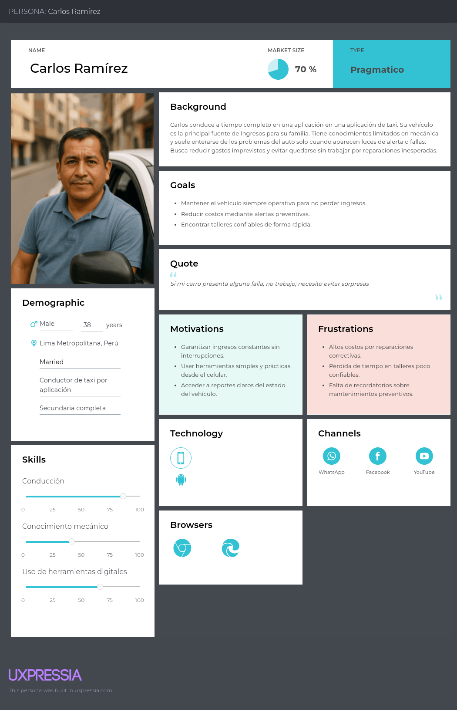


<br/><b>Segmento: Talleres mecánicos</b>

<p align="justify"> Este segmento corresponde a propietarios y trabajadores de talleres mecánicos independientes o de tamaño mediano. Son profesionales con experiencia práctica en diagnóstico y reparación de vehículos, pero que en muchos casos carecen de soluciones digitales para agilizar sus procesos. Su principal desafío es optimizar el tiempo de diagnóstico, fidelizar a los clientes y adaptarse a nuevas tecnologías que les permitan mejorar la eficiencia de su negocio. </p>

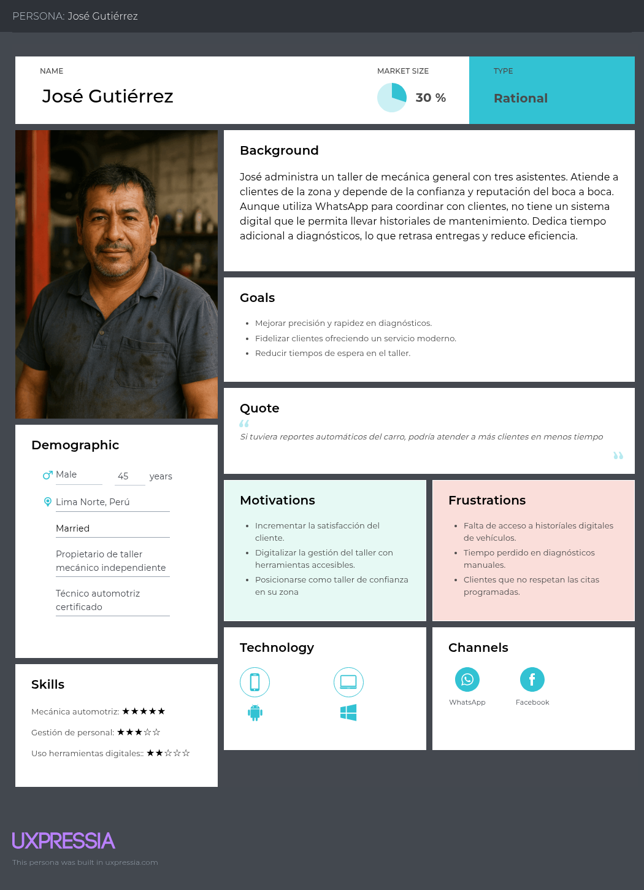

### 2.3.2. User Task Matrix

<p align="justify"> En esta sección se presenta la <strong>User Task Matrix</strong>, que concentra las tareas que los <em>User Personas</em> realizan para cumplir sus objetivos. Para el caso de <strong>SafeCar</strong>, se consideran los dos segmentos principales: <strong>conductores particulares</strong> (incluyendo uso personal, taxi y delivery) y <strong>talleres mecánicos independientes o medianos</strong>. Las tareas aquí descritas se realizan independientemente de la existencia de una solución tecnológica, ya que corresponden a actividades que ambos segmentos deben ejecutar en su día a día. </p>

<table style="width:100%; border-collapse:collapse; font-family:Arial, sans-serif;">
    <thead>
      <tr>
        <th rowspan="2" style="border:1px solid #ddd; padding:8px; text-align:left;">Task</th>
        <th colspan="2" style="border:1px solid #ddd; padding:8px;">Conductor Particular (Taxi/Delivery/Personal)</th>
        <th colspan="2" style="border:1px solid #ddd; padding:8px;">Taller Mecánico Independiente/Mediano</th>
      </tr>
      <tr>
        <th style="border:1px solid #ddd; padding:8px;">Frequency</th>
        <th style="border:1px solid #ddd; padding:8px;">Importance</th>
        <th style="border:1px solid #ddd; padding:8px;">Frequency</th>
        <th style="border:1px solid #ddd; padding:8px;">Importance</th>
      </tr>
    </thead>
    <tbody>
      <tr>
        <td style="border:1px solid #ddd; padding:8px;">Revisar estado general del vehículo (luces, llantas, niveles)</td>
        <td style="border:1px solid #ddd; padding:8px;">High</td>
        <td style="border:1px solid #ddd; padding:8px;">High</td>
        <td style="border:1px solid #ddd; padding:8px;">Medium</td>
        <td style="border:1px solid #ddd; padding:8px;">High</td>
      </tr>
      <tr>
        <td style="border:1px solid #ddd; padding:8px;">Llevar el vehículo a mantenimiento preventivo</td>
        <td style="border:1px solid #ddd; padding:8px;">Medium</td>
        <td style="border:1px solid #ddd; padding:8px;">High</td>
        <td style="border:1px solid #ddd; padding:8px;">High</td>
        <td style="border:1px solid #ddd; padding:8px;">High</td>
      </tr>
      <tr>
        <td style="border:1px solid #ddd; padding:8px;">Atender reparaciones correctivas (fallas inesperadas)</td>
        <td style="border:1px solid #ddd; padding:8px;">Low</td>
        <td style="border:1px solid #ddd; padding:8px;">High</td>
        <td style="border:1px solid #ddd; padding:8px;">Medium</td>
        <td style="border:1px solid #ddd; padding:8px;">High</td>
      </tr>
      <tr>
        <td style="border:1px solid #ddd; padding:8px;">Coordinar citas o comunicación con talleres</td>
        <td style="border:1px solid #ddd; padding:8px;">Medium</td>
        <td style="border:1px solid #ddd; padding:8px;">High</td>
        <td style="border:1px solid #ddd; padding:8px;">High</td>
        <td style="border:1px solid #ddd; padding:8px;">High</td>
      </tr>
      <tr>
        <td style="border:1px solid #ddd; padding:8px;">Registrar gastos de mantenimiento y reparaciones</td>
        <td style="border:1px solid #ddd; padding:8px;">Medium</td>
        <td style="border:1px solid #ddd; padding:8px;">High</td>
        <td style="border:1px solid #ddd; padding:8px;">Medium</td>
        <td style="border:1px solid #ddd; padding:8px;">High</td>
      </tr>
      <tr>
        <td style="border:1px solid #ddd; padding:8px;">Conducir de manera eficiente para reducir desgaste</td>
        <td style="border:1px solid #ddd; padding:8px;">High</td>
        <td style="border:1px solid #ddd; padding:8px;">Medium</td>
        <td style="border:1px solid #ddd; padding:8px;">—</td>
        <td style="border:1px solid #ddd; padding:8px;">—</td>
      </tr>
      <tr>
        <td style="border:1px solid #ddd; padding:8px;">Diagnosticar fallas de vehículos recibidos</td>
        <td style="border:1px solid #ddd; padding:8px;">—</td>
        <td style="border:1px solid #ddd; padding:8px;">—</td>
        <td style="border:1px solid #ddd; padding:8px;">High</td>
        <td style="border:1px solid #ddd; padding:8px;">High</td>
      </tr>
      <tr>
        <td style="border:1px solid #ddd; padding:8px;">Supervisar tiempos de reparación y entrega</td>
        <td style="border:1px solid #ddd; padding:8px;">—</td>
        <td style="border:1px solid #ddd; padding:8px;">—</td>
        <td style="border:1px solid #ddd; padding:8px;">High</td>
        <td style="border:1px solid #ddd; padding:8px;">High</td>
      </tr>
      <tr>
        <td style="border:1px solid #ddd; padding:8px;">Gestionar relación con clientes (conductores)</td>
        <td style="border:1px solid #ddd; padding:8px;">—</td>
        <td style="border:1px solid #ddd; padding:8px;">—</td>
        <td style="border:1px solid #ddd; padding:8px;">High</td>
        <td style="border:1px solid #ddd; padding:8px;">High</td>
      </tr>
      <tr>
        <td style="border:1px solid #ddd; padding:8px;">Mantener historial de vehículos atendidos</td>
        <td style="border:1px solid #ddd; padding:8px;">Low</td>
        <td style="border:1px solid #ddd; padding:8px;">Medium</td>
        <td style="border:1px solid #ddd; padding:8px;">Medium</td>
        <td style="border:1px solid #ddd; padding:8px;">High</td>
      </tr>
    </tbody>
</table>

<strong>Explicación</strong>

<p align="justify">
    Para los <strong>conductores particulares</strong>, las tareas con mayor frecuencia e importancia son
    <em>revisar el estado general del vehículo</em> y <em>realizar mantenimiento preventivo</em>, ya que impactan directamente en su
    continuidad operativa y en la reducción de costos imprevistos. Las <em>reparaciones correctivas</em> ocurren con menor
    frecuencia, pero son de alta importancia por su costo e impacto.
  </p>
<p align="justify">
  En los <strong>talleres mecánicos</strong>, las tareas críticas son <em>diagnosticar fallas</em>, <em>supervisar tiempos de reparación</em> y
  <em>gestionar la relación con clientes</em>, todas de alta frecuencia e importancia por su efecto en eficiencia y satisfacción.
  El <em>historial de vehículos</em> no siempre se lleva con alta frecuencia, pero tiene alta importancia para mejorar calidad y confianza.
</p>
<p align="justify">
  Como coincidencias, ambos segmentos asignan alta importancia a la <em>coordinación y comunicación</em> para agendar servicios y
  al <em>registro</em> (de gastos o mantenimientos), aunque con enfoques distintos: control de costos personales en conductores y
  optimización operativa en talleres.
</p>

### 2.3.3. User Journey Mapping
<p align="justify"> Los <em>User Journey Maps</em> ilustran el recorrido completo de los usuarios objetivo de <strong>SafeCar</strong> en la situación actual (<em>As-Is</em>), es decir, sin contar aún con la implementación de la solución propuesta. Este mapeo recoge las principales <strong>acciones, metas, emociones y problemas</strong> que experimentan los conductores particulares (incluyendo uso personal, taxi y delivery) y los talleres mecánicos independientes/medianos, desde el primer contacto con la necesidad de un servicio de mantenimiento hasta la resolución del problema o abandono del servicio. </p>

<strong>User Journey Map - Conductor particular(personal, taxi y delivery)</strong>
<p align="justify"> El journey del conductor comienza cuando detecta señales de problemas en su vehículo (luces en el tablero, ruidos extraños o fallas inesperadas). A partir de allí, pasa por etapas como la búsqueda de un taller, la coordinación de una cita, el tiempo de espera por diagnóstico y reparación, y finalmente la entrega del vehículo. Durante este proceso, las emociones del conductor oscilan entre la <em>ansiedad</em> por los costos imprevistos, la <em>frustración</em> por los tiempos de espera y la <em>incertidumbre</em> respecto a la confiabilidad del taller, con pocos momentos de satisfacción. Este recorrido muestra claras oportunidades de mejora en la anticipación de fallas, en la transparencia de los costos y en la confiabilidad del servicio. </p>

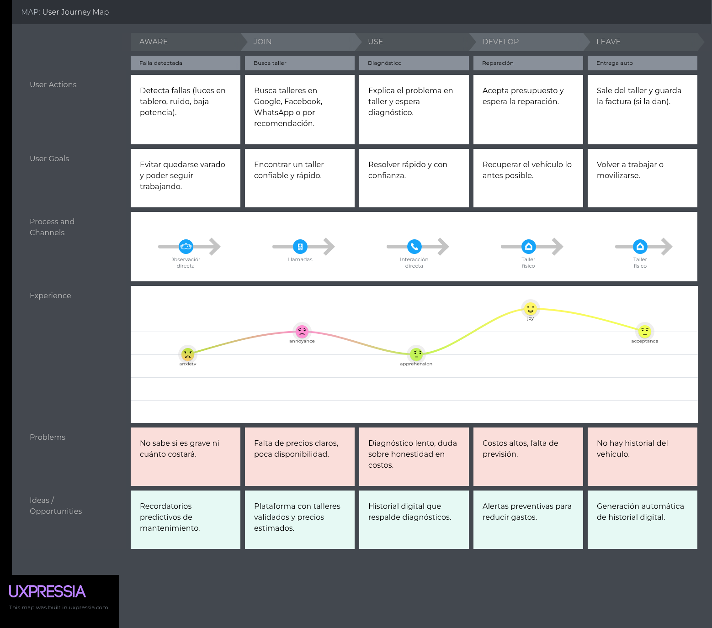


<br/><strong>User Journey Map - Taller mecánico independiente/mediano</strong>
<p align="justify"> En el caso de los talleres mecánicos, el journey se inicia cuando reciben un vehículo sin información previa o historial digital del mismo. Esto genera un proceso más largo y dependiente de inspecciones manuales, pruebas de manejo o escaneo básico. El mecánico debe diagnosticar la falla, comunicarla al cliente, esperar su aprobación y recién proceder a la reparación. Las emociones predominantes en el taller van desde la <em>presión</em> por entregar el vehículo en el menor tiempo posible, hasta la <em>frustración</em> por la falta de datos y la desconfianza de algunos clientes frente a los diagnósticos. Las oportunidades detectadas in◊cluyen la posibilidad de acceder a reportes digitales de fallas, contar con historiales de mantenimiento previos y reducir los tiempos de diagnóstico. </p>

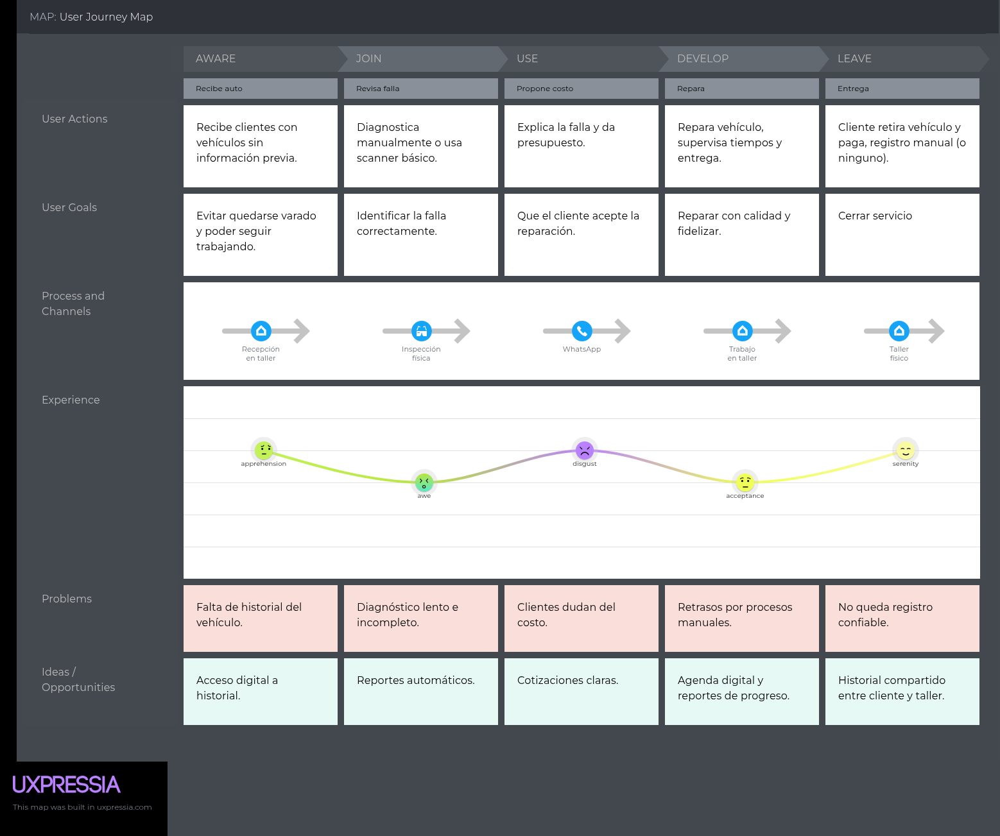

### 2.3.4. Empathy Mapping
<p align="justify"> Los <em>Empathy Maps</em> permiten profundizar en la comprensión de los <strong>User Personas</strong> definidos para SafeCar, capturando no solo sus acciones y necesidades, sino también sus percepciones, emociones, frustraciones y expectativas. En esta sección se presentan los mapas elaborados en la herramienta indicada, vinculados a cada uno de los segmentos objetivo (Conductores Particulares y Talleres Mecánicos). </p>

<strong>Empathy Mapping - Conductor particular(personal, taxi y delivery)</strong>
<p align="justify"> Este mapa refleja el día a día de los conductores que utilizan su vehículo como recurso principal, ya sea para uso personal, trabajo en taxi o delivery. Sus emociones y decisiones giran en torno a la necesidad de mantener el automóvil siempre operativo, ya que cualquier avería implica costos elevados y pérdida de ingresos. A través del empathy map se evidencian sus motivaciones, frustraciones y lo que dicen, ven, piensan y escuchan en relación al mantenimiento de sus vehículos. </p>
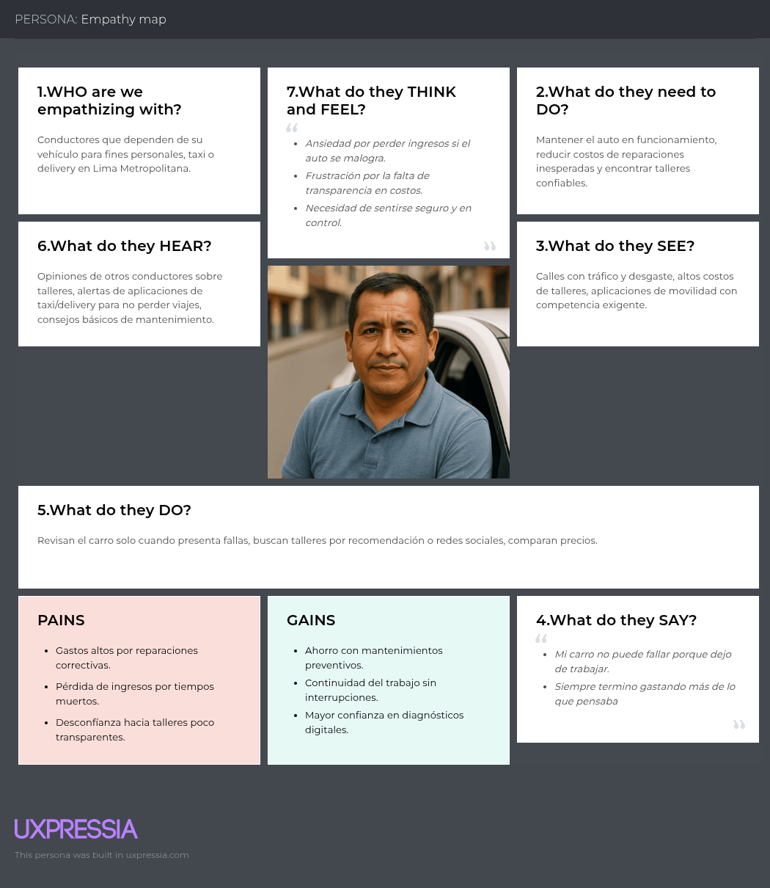

<br/><strong>Empathy Mapping - Taller mecánico independiente/mediano</strong>
<p align="justify"> Este mapa refleja el día a día de los conductores que utilizan su vehículo como recurso principal, ya sea para uso personal, trabajo en taxi o delivery. Sus emociones y decisiones giran en torno a la necesidad de mantener el automóvil siempre operativo, ya que cualquier avería implica costos elevados y pérdida de ingresos. A través del empathy map se evidencian sus motivaciones, frustraciones y lo que dicen, ven, piensan y escuchan en relación al mantenimiento de sus vehículos. </p>
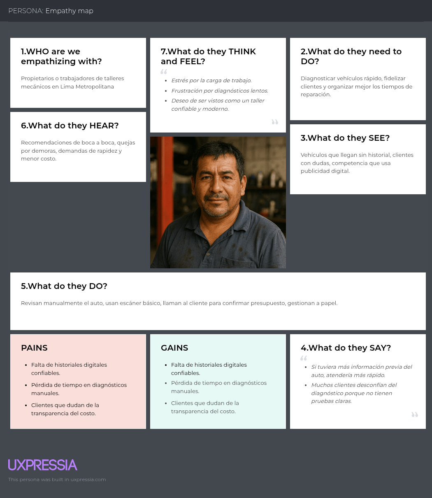

## 2.4. Big Picture EventStorming

<p align="justify">
El <strong>Big Picture EventStorming</strong> es una técnica de modelado colaborativo que permite visualizar los procesos de negocio a través de la identificación cronológica de eventos del dominio. En el contexto de <strong>SafeCar</strong>, esta metodología resulta fundamental para mapear el ecosistema completo de mantenimiento vehicular, desde la detección de problemas hasta la resolución en talleres.
</p>

Enlace de acceso a Miro (EventStorming): <a href="https://miro.com/app/board/uXjVJItKYhM=/?share_link_id=862788472423" target="_blank">https://miro.com/app/board/uXjVJItKYhM=/?share_link_id=862788472423</a>


#### Step 1: Unstructured Exploration

<p align="justify">
Este paso consiste en identificar todos los eventos del dominio de manera libre y sin orden específico. Los participantes generan eventos en formato pasado ("algo pasó") para capturar toda la actividad relevante del ecosistema SafeCar.
</p>

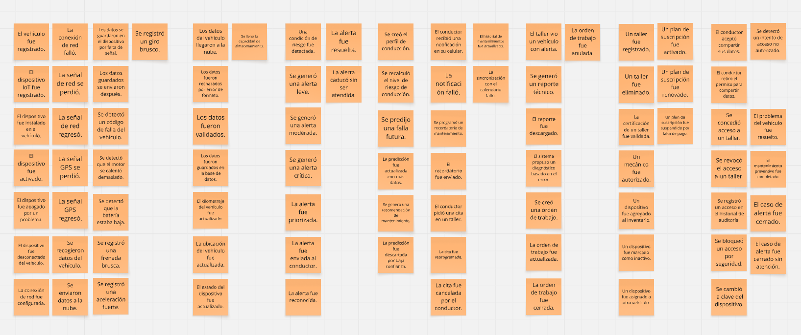

#### Step 2: Timelines

<p align="justify">
Se organizan los eventos identificados en orden cronológico para crear flujos de trabajo coherentes. Este paso establece la secuencia temporal de los procesos de mantenimiento vehicular.
</p>

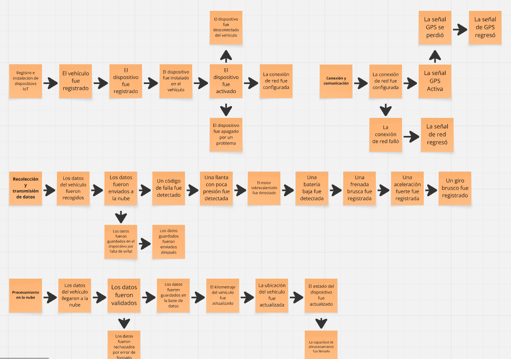

#### Step 3: Paint Points

<p align="justify">
Se identifican los puntos problemáticos o fricciones en el proceso actual. Estos representan oportunidades de mejora que SafeCar puede abordar con su solución tecnológica.
</p>

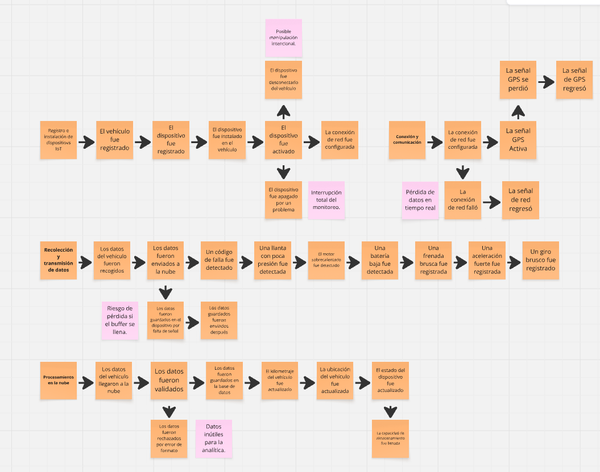

#### Step 4: Pivotal Points

<p align="justify">
Se marcan los eventos críticos que determinan el éxito o fracaso del proceso. Son los momentos clave donde las decisiones tienen mayor impacto en el resultado.
</p>

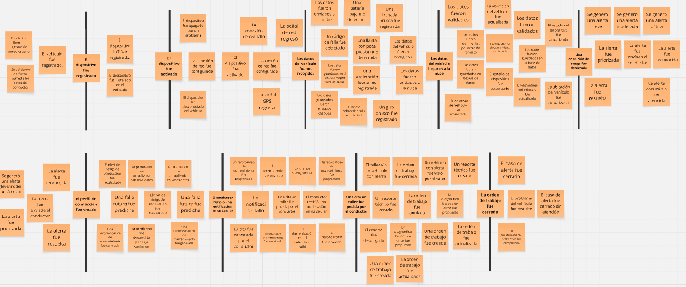

#### Step 5: Commands

<p align="justify">
Se definen las acciones o comandos que desencadenan los eventos del sistema. Representan las intenciones de usuarios y sistemas que inician procesos específicos.
</p>

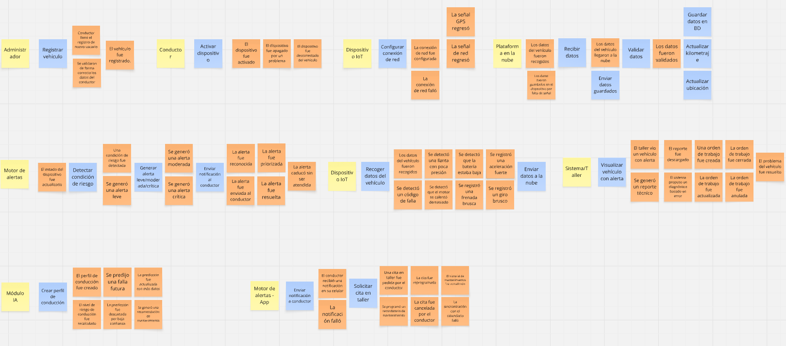

#### Step 6: Policies

<p align="justify">
Se establecen las reglas de negocio que determinan cuándo y cómo se ejecutan procesos automáticos. Son las políticas que gobiernan el comportamiento del sistema.
</p>

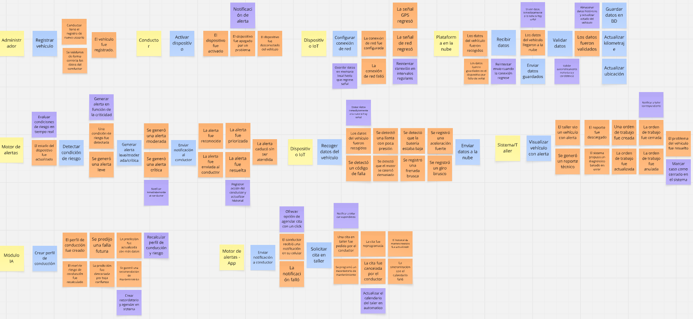

#### Step 7: Read Models

<p align="justify">
Se identifican las vistas de información que los usuarios necesitan para tomar decisiones. Son las representaciones de datos que consume la interfaz de usuario.
</p>

#### Step 8: External Systems

<p align="justify">
Se mapean los sistemas externos con los que SafeCar debe integrarse. Incluye APIs, servicios de terceros y sistemas existentes necesarios para el funcionamiento completo.
</p>

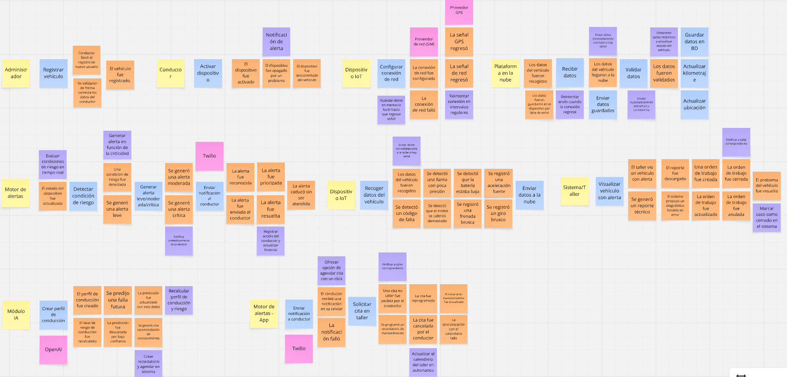

#### Step 9: Aggregates

<p align="justify">
Se definen las entidades de dominio que encapsulan comportamientos y datos relacionados. Son los objetos principales del negocio que mantienen consistencia interna.
</p>

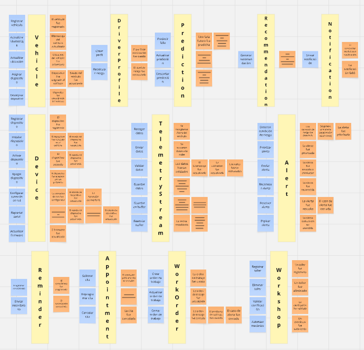

#### Step 10: Bounded Contexts

<p align="justify">
Se establecen los contextos delimitados que agrupan funcionalidades relacionadas. Define las fronteras claras entre diferentes áreas de responsabilidad del sistema.
</p>

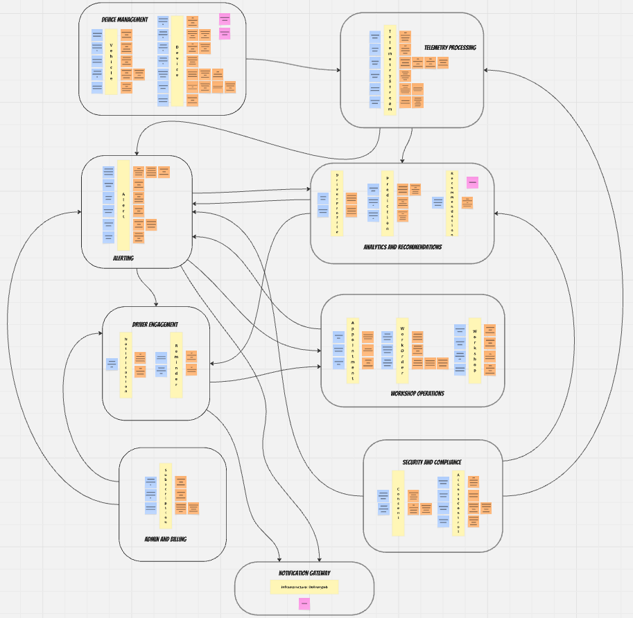

## 2.5. Ubiquitous Language

<p align="justify">
El <strong>Ubiquitous Language</strong> (Lenguaje Ubicuo) es un conjunto de términos y conceptos compartidos entre todos los miembros del equipo de desarrollo y los expertos del dominio. Este lenguaje común elimina ambigüedades y asegura que todos los participantes del proyecto SafeCar tengan la misma comprensión de los conceptos clave del negocio. A continuación se presenta el glosario de términos fundamentales para el dominio de mantenimiento vehicular IoT.
</p>

### Ubiquitous Language — SafeCar

#### 1. Vehículo y componentes
• **Vehicle (Vehículo)**: Unidad automotriz identificada por placa y características (marca, modelo, año) sobre la que se realizan diagnósticos, mantenimientos y reparaciones.
• **Odometer (Odómetro)**: Indicador acumulado de kilómetros recorridos por el vehículo.
• **Powertrain (Tren motriz)**: Conjunto de elementos que transmiten potencia (motor, transmisión y ejes).
• **Engine (Motor)**: Conjunto mecánico que genera potencia para el movimiento del vehículo.
• **Battery (Batería)**: Fuente de energía eléctrica para arranque y sistemas auxiliares.
• **Cooling System (Sistema de enfriamiento)**: Circuito (radiador, bomba, termostato) que mantiene la temperatura operativa del motor.
• **Brake System (Sistema de frenos)**: Conjunto (discos, pastillas, líquido) que permite desaceleración y detención segura.
• **Tire (Neumático/Llanta)**: Elemento de contacto con la calzada; su presión y desgaste impactan seguridad y consumo.
• **Suspension (Suspensión)**: Conjunto que absorbe irregularidades del camino y mantiene estabilidad.
• **Steering (Dirección)**: Sistema que permite orientar las ruedas y controlar la trayectoria.
• **Exhaust System (Sistema de escape)**: Conduce y trata gases producto de la combustión.
• **Fuel System (Sistema de combustible)**: Almacena y suministra combustible al motor.
• **OBD-II**: On-Board Diagnostics II para lectura de parámetros y códigos de falla (DTC: Diagnostic Trouble Codes).
• **Telematics Device (Dispositivo telemático/IoT)**: Equipo instalado en el vehículo que captura datos operativos y de uso.

#### 2. Uso y condiciones de operación
• **Trip (Viaje/Trayecto)**: Desplazamiento continuo del vehículo entre dos momentos de encendido y apagado.
• **Driving Habit (Hábito de conducción)**: Patrón de manejo observado (aceleraciones fuertes, frenadas bruscas, giros violentos).
• **Harsh Braking (Frenada brusca)**: Evento de desaceleración súbita que supera un umbral definido.
• **Harsh Acceleration (Aceleración fuerte)**: Evento de incremento rápido de velocidad que supera un umbral.
• **Harsh Cornering (Giro brusco)**: Cambio violento de dirección que excede un umbral de aceleración lateral.

#### 3. Diagnóstico y códigos
• **Diagnostic Trouble Code – DTC (Código de falla)**: Código estándar que indica una anomalía detectada por el vehículo.
• **Active DTC (DTC activo)**: Falla presente actualmente.
• **Stored DTC (DTC almacenado)**: Falla registrada históricamente, no presente al momento.
• **Health Check (Chequeo de salud)**: Evaluación general del estado del vehículo basada en lecturas y umbrales.
• **Inspection (Inspección)**: Revisión visual o instrumental de componentes según una pauta definida.
• **Technical Report (Reporte técnico)**: Documento que resume hallazgos, diagnósticos y acciones recomendadas.

#### 4. Mantenimiento y servicios
• **Preventive Maintenance (Mantenimiento preventivo)**: Intervenciones programadas para evitar fallas (por tiempo o kilometraje).
• **Corrective Maintenance (Mantenimiento correctivo)**: Reparación una vez ocurrida una falla.
• **Service Interval (Intervalo de servicio)**: Frecuencia recomendada para realizar un mantenimiento (p.ej., cada 10 000 km o 6 meses).
• **Oil Change (Cambio de aceite)**: Sustitución de aceite y, normalmente, del filtro correspondiente.
• **Filter Replacement (Cambio de filtro)**: Sustitución de filtros (aceite, aire, combustible, cabina).
• **Brake Service (Servicio de frenos)**: Revisión/sustitución de pastillas, discos, líquido y purgado.
• **Tire Rotation (Rotación de neumáticos)**: Cambio de posición de neumáticos para distribuir desgaste.
• **Tire Replacement (Cambio de neumáticos)**: Sustitución cuando hay desgaste, daño o antigüedad.
• **Wheel Alignment (Alineación)**: Ajuste de ángulos de dirección para estabilidad y desgaste homogéneo.
• **Wheel Balancing (Balanceo)**: Corrección de desbalances para evitar vibraciones.
• **Coolant Flush (Cambio de refrigerante)**: Renovación del fluido del sistema de enfriamiento.
• **Battery Test (Prueba de batería)**: Verificación de capacidad de arranque y estado de carga.

#### 5. Alertas y recomendaciones
• **Condition (Condición)**: Situación detectada que requiere evaluación (p.ej., presión baja).
• **Alert (Alerta)**: Aviso al conductor o taller por condición de riesgo o atención requerida.
• **Severity (Severidad)**: Nivel de criticidad de una alerta (leve, moderada, crítica).
• **Priority (Prioridad)**: Orden de atención sugerido según severidad y contexto.
• **Recommendation (Recomendación)**: Sugerencia de mantenimiento o acción preventiva.
• **Reminder (Recordatorio)**: Aviso programado para un servicio futuro por fecha o kilometraje.
• **Risk Score (Puntaje de riesgo)**: Valor que sintetiza el nivel de riesgo operativo derivado de hábitos y estado del vehículo.
• **Driving Profile (Perfil de conducción)**: Clasificación del estilo de manejo (seguro, económico, riesgoso) según hábitos.

#### 6. Relación con el taller
• **Workshop (Taller)**: Centro autorizado que presta servicios de mantenimiento y reparación.
• **Mechanic (Mecánico)**: Profesional que realiza diagnósticos, mantenimientos y reparaciones.
• **Service Advisor (Asesor de servicio)**: Persona que recibe al cliente, acuerda trabajos y comunica avances.
• **Appointment (Cita)**: Reserva de fecha y hora para atención del vehículo en el taller.
• **Check-in (Recepción)**: Registro de llegada del vehículo para iniciar el proceso en taller.
• **Work Order – WO (Orden de trabajo)**: Documento operativo que detalla los trabajos autorizados, insumos y tiempos.
• **Estimate (Presupuesto)**: Propuesta económica previa a la ejecución, con ítems y costos.
• **Customer Approval (Aprobación del cliente)**: Autorización expresa para ejecutar el trabajo y costos asociados.
• **Parts (Repuestos)**: Componentes o consumibles necesarios para la intervención.
• **Service Status (Estado del servicio)**: Etapas del proceso en taller (en recepción, en diagnóstico, en reparación, finalizado).
• **Delivery (Entrega)**: Devolución del vehículo al cliente tras finalizar el servicio.

#### 7. Garantía, calidad y cumplimiento
• **Quality Check (Control de calidad)**: Verificación final de trabajos antes de la entrega.
• **Service History (Historial de mantenimiento)**: Registro cronológico de servicios realizados a un vehículo.
• **Inspection Report (Informe de inspección)**: Resultado documentado de una inspección oficial o interna.

#### 8. Planes y relación comercial
• **Membership Plan (Plan de membresía)**: Paquete de beneficios y condiciones que habilita el uso de servicios SafeCar.
• **Coverage (Cobertura)**: Alcance de servicios y límites incluidos en el plan o garantía.
• **Service Package (Paquete de servicio)**: Conjunto de servicios preventivos ofrecidos a precio preferente.
• **Customer (Cliente/Conductor)**: Persona titular del vehículo que solicita y paga servicios.
• **Consent (Consentimiento)**: Autorización del cliente para compartir datos de su vehículo con un taller.
• **Service Policy (Política de servicio)**: Reglas del taller sobre citas, cancelaciones, tiempos y garantías.

#### 9. Medición y métricas de operación
• **Mileage/Kilometrage (Kilometraje)**: Distancia total recorrida por el vehículo en odómetro.
• **Operating Hours (Horas de operación)**: Tiempo acumulado de motor encendido.
• **Fuel Economy (Consumo de combustible)**: Rendimiento de combustible por distancia (p.ej., km/L).
• **Wear Indicator (Indicador de desgaste)**: Señal que sugiere proximidad a recambio de pieza o servicio.
• **Service Due (Servicio pendiente)**: Mantenimiento que corresponde por fecha o kilometraje alcanzado.
• **Overheat (Sobrecalentamiento)**: Condición de temperatura del motor por encima de límites seguros.
• **Low Pressure (Presión baja)**: Presión de neumáticos por debajo del umbral recomendado.

# Capítulo III: Requirements Specification

## 3.1. User Stories

<p align="justify"> En esta sección se definen los <em>Epics</em> y <em>User Stories</em> correspondientes a los requisitos identificados para el desarrollo de <strong>SafeCar</strong>. Cada historia se describe considerando el rol del usuario, la funcionalidad requerida y el valor esperado, junto con un conjunto de <strong>Criterios de Aceptación</strong> redactados bajo la estructura <em>Given–When–Then</em> (Gherkin), asegurando claridad, verificabilidad y alineación con la metodología de <em>Behavior-Driven Development (BDD)</em>. </p> <p align="justify"> El conjunto de historias incluye las funcionalidades clave de los distintos componentes del ecosistema SafeCar: la <strong>Landing Page</strong>, la <strong>Aplicación Web</strong>, la <strong>Aplicación Móvil</strong>, el <strong>Backend</strong> desarrollado en <strong>Java + Spring Boot</strong>, y el <strong>Dispositivo IoT</strong>. Asimismo, se han considerado <em>Technical Stories</em> para aquellos features que no tienen interacción directa con los usuarios finales, tales como las integraciones y APIs de soporte. </p> <p align="justify"> Todas las historias se presentan en un único cuadro consolidado, con una línea dedicada a cada Epic o User Story. Esto permite mantener la trazabilidad y asegurar la cobertura de los requisitos de negocio, experiencia de usuario y necesidades técnicas del sistema. </p>

<!-- INICIO: Tabla de User Stories (Epic/Story) -->
<!-- Descripción: Tabla para registrar historias de usuario con Epic/Story ID, título, descripción, criterios de aceptación y relación con Epic. -->
<table border="1" width="100%" style="border-collapse: collapse;">
	<thead>
		<tr>
			<th><!-- Columna 01 --> Epic / Story ID</th>
			<th><!-- Columna 02 --> Título</th>
			<th><!-- Columna 03 --> Descripción</th>
			<th><!-- Columna 04 --> Criterios de Aceptación</th>
			<th><!-- Columna 05 --> Relacionado con (Epic ID)</th>
		</tr>
	</thead>
	<tbody>
		<!--EPIC 01-->
		<tr>
			<td>
				<b>E01</b>
			</td>
			<td>Landing Page</td>
			<td align="justify">
				<b>Como</b> visitante <b>quiero</b> entender que ofrece SafeCar y acceder desde la web <b>para</b> tomar una decisión informada.
			</td>
			<td></td>
			<td></td>
		</tr>
		<!--USER STORY 01-->
		<tr>
			<td>
				US101
			</td>
			<td>
				Barra de navegación en landing page por secciones
			</td>
			<td align="justify">
				<b>Como</b> visitante, <b>quiero</b> desplazarme entre las secciones de la página <b>para</b> encontrar rapidamente la informacion que necesito, sin perder tiempo.
			</td>
			<td >
				<p><strong>Escenario 1: Accede a Inicio</strong><br/>
					<b>Dado</b> que el visitante está en la landing<br/> 
					<b>Cuando</b> selecciona la opción “Inicio”<br/> 
					<b>Entonces</b> visualiza la sección de presentación del producto
				</p>
				<p><strong>Escenario 2: Accede a Características</strong><br/>
					<b>Dado</b> que el visitante está en la landing<br/>
					<b>Cuando</b> selecciona la opción “Características”<br/>
					<b>Entonces</b> visualiza la sección que resume el valor y funciones de SafeCar
				</p>
				<p><strong>Escenario 3: Accede a Planes</strong><br/>
					<b>Dado</b> que el visitante está en la landing<br/>
					<b>Cuando</b> selecciona la opción “Planes”<br/>
					<b>Entonces</b> visualiza la sección con los planes disponibles
				</p>
				<p><strong>Escenario 4: Accede a Testimonios</strong><br/>
					<b>Dado</b> que el visitante está en la landing<br/>
					<b>Cuando</b> selecciona “Testimonios”<br/>
					<b>Entonces</b> visualiza la sección con opiniones de usuarios
				</p>
				<p><strong>Escenario 5: Accede a Contacto</strong><br/>
					<b>Dado</b> que el visitante está en la landing<br/>
					<b>Cuando</b> selecciona “Contacto”<br/>
					<b>Entonces</b> visualiza el formulario para enviar un mensaje
				</p>
			</td>
			<td>
			E01
			</td>
		</tr>
		<!--USER STORY 02-->
		<tr>
			<td>
				US102
			</td>
			<td>
				Acceso visible a la aplicación
			</td>
			<td align="justify">
				<b>Como</b> visitante, <b>quiero</b> un acceso visible hacia la aplicación<b>para</b> continuar con el uso del servicio cuando lo decida.
			</td>
			<td>
				<p><strong>Escenario 1: Acceso desde presentación</strong><br/>
					<b>Dado</b> que el visitante está en la sección de presentación<br/>
					<b>Cuando</b> activa el acceso directo a la aplicación<br/>
					<b>Entonces</b> el sistema lo dirige a la URL pública de la aplicación
				</p>
				<p><strong>Escenario 2: Acceso disponible en todo momento</strong><br/>
					<b>Dado</b> que el visitante navega por cualquier sección<br/>
					<b>Cuando</b> decide continuar al producto<br/>
					<b>Entonces</b> encuentra un acceso visible hacia la aplicacion
				</p>
				<p><strong>Escenario 3: Acceso rastreable</strong><br/>
					<b>Dado</b> que el visitante usa el acceso a la aplicación<br/>
					<b>Cuando</b> se realiza la redirección<br/>
					<b>Entonces</b> el sistema registra el evento de salida hacia la aplicación
				</p>
			</td>
			<td>
			E01
			</td>
		</tr>
		<!--USER STORY 03-->
		<tr>
			<td>
				US103
			</td>
			<td>
				Cambio de idioma en landing page (ES/EN)
			</td>
			<td>
				<b>Como</b> visitante, <b>quiero</b> cambiar el idioma de la página <b>para</b> leer la información en el idioma que prefiera.
			</td>
			<td>
				<p><strong>Escenario 1: Cambia a idioma de preferencia</strong><br/>
					<b>Dado</b> que el visitante está viendo la página en un idioma<br/>
					<b>Cuando</b> elige otro idioma<br/>
					<b>Entonces</b> todos el contenido visible se muestran en el idioma elegido
				</p>
				<p><strong>Escenario 2: Persistencia de idioma</strong><br/>
					<b>Dado</b> que el visitante seleccionó un idioma<br/>
					<b>Cuando</b> recarga la página, cierra y vuelve a abrir el navegador o navega a otra URL de la aplicación<br/>
					<b>Entonces</b> la interfaz de la aplicación se carga inmediatamente en el idioma elegido
				</p>
			</td>
			<td>
				E01
			</td>
		</tr>
		<!--USER STORY 04-->
		<tr>
			<td>US104</td>
			<td>Visualización de planes y precios</td>
			<td align="justify">
				<b>Como</b> visitante, <b>quiero</b> ver claramente los planes y precios de SafeCar <b>para</b> evaluar cuál se ajusta mejor a mis necesidades.
			</td>
			<td>
				<p><strong>Escenario 1: Muestra planes</strong><br/>
					<b>Dado</b> que el visitante accede a la sección de planes<br/>
					<b>Cuando</b> visualiza la información<br/>
					<b>Entonces</b> encuentra al menos un plan con beneficios y precio
				</p>
				<p><strong>Escenario 2: Comparación simple</strong><br/>
					<b>Dado</b> que hay más de un plan<br/>
					<b>Cuando</b> el visitante revisa sus beneficios<br/>
					<b>Entonces</b> puede distinguir diferencias de valor entre planes
				</p>
				<p><strong>Escenario 3: Intención de selección</strong><br/>
					<b>Dado</b> que el visitante está en la sección de planes<br/>
					<b>Cuando</b> indica interés en un plan<br/>
					<b>Entonces</b> el sistema registra el interés para análisis
				</p>
				<p><strong>Escenario 4: CTA visible por plan</strong><br/>
					<b>Dado</b> que el visitante revisa la sección de planes<br/>
					<b>Cuando</b> observa cada tarjeta de plan<br/>
					<b>Entonces</b> cada plan muestra un botón claro de “Empezar” o “Más detalles”
				</p>
			</td>
			<td>E01</td>
		</tr>
		<!--USER STORY 05-->
		<tr>
			<td>US105</td>
			<td>Lectura de testimonios</td>
			<td align="justify">
				<b>Como</b> visitante, <b>quiero</b> leer opiniones de usuarios sobre SafeCar <b>para</b> confiar en la plataforma antes de registrarme.
			</td>
			<td>
				<p><strong>Escenario 1: Muestra testimonios</strong><br/>
					<b>Dado</b> que el visitante accede a la sección de testimonios<br/>
					<b>Cuando</b> visualiza la información<br/>
					<b>Entonces</b> encuentra opiniones con nombre y fecha o contexto
				</p>
				<p><strong>Escenario 2: Cantidad mínima</strong><br/>
					<b>Dado</b> que el visitante revisa la sección<br/>
					<b>Cuando</b> se muestran testimonios<br/>
					<b>Entonces</b> hay al menos dos opiniones visibles
				</p>
			</td>
			<td>
				E01
			</td>
		</tr>
		<!--USER STORY 06-->
		<tr>
			<td>US106</td>
			<td>Sección “Acerca de” con explicación y video</td>
			<td align="justify">
				<b>Como</b> visitante, <b>quiero</b> entender la misión y visión de SafeCar <b>para</b> confiar en la plataforma antes de registrarme.
			</td>
			<td>
				<p><strong>Escenario 1: Contenido informativo</strong><br/>
					<b>Dado</b> que el visitante accede a la sección “Acerca de”<br/>
					<b>Cuando</b> lee el contenido<br/>
					<b>Entonces</b> comprende el propósito general y beneficios del producto
				</p>
				<p><strong>Escenario 2: Reproducción de video</strong><br/>
					<b>Dado</b> que el video está disponible<br/>
					<b>Cuando</b> el visitante inicia la reproducción<br/>
					<b>Entonces</b> el video se muestra correctamente en el dispositivo
				</p>
			</td>
			<td>
				E01
			</td>
		</tr>
		<!--USER STORY 07-->
		<tr>
			<td>US107</td>
			<td>Sección “Nuestro equipo”</td>
			<td align="justify">
				<b>Como</b> visitante, <b>quiero</b> conocer al equipo detrás de SafeCar <b>para</b> aumentar mi confianza en el proyecto.
			</td>
			<td>
				<p><strong>Escenario 1: Presencia de equipo</strong><br/>
				<b>Dado</b> que el visitante accede a la sección "Nuestro equipo"<br/>
				<b>Cuando</b> visualiza la información<br/>
				<b>Entonces</b> encuentra al menos un bloque que presenta al equipo o sus roles
				</p>
			</td>
			<td>
				E01
			</td>
		</tr>
		<!--USER STORY 08-->
		<tr>
			<td>US108</td>
			<td>
				Sección "Formulario de contacto"
			</td>
			<td align="justify">
				<b>Como</b> visitante, <b>quiero</b> enviar mis datos de contacto y un mensaje <b>para</b> recibir más información o resolver dudas.
			</td>
			<td>
				<p><strong>Escenario 1: Envío válido</strong><br/>
				<b>Dado</b> que el visitante completa sus credenciales válidas<br/>
				<b>Cuando</b> envía el formulario<br/>
				<b>Entonces</b> el sistema registra la solicitud y muestra confirmación de envío
				</p>
				<p><strong>Escenario 2: Validación de campos</strong><br/>
				<b>Dado</b> que el visitante deja campos requeridos vacíos o con formato inválido<br/>
				<b>Cuando</b> intenta enviar<br/>
				<b>Entonces</b> el sistema indica qué corregir sin perder la información ingresada
				</p>
			</td>
			<td>
				E01
			</td>
		</tr>
		<!--USER STORY 09-->
		<tr>
			<td>US109</td>
			<td>Redes sociales en el pie de página</td>
			<td align="justify">
				<b>Como</b> visitante <b>quiero</b> acceder a las redes sociales oficiales desde el pie de página <b>para</b> seguir las novedades de SafeCar.
			</td>
			<td>
				<p><strong>Escenario 1: Acceso a redes</strong><br/>
				<b>Dado</b> que el visitante está en el pie de página<br/>
				<b>Cuando</b> selecciona una red social<br/>
				<b>Entonces</b> el sistema redirije al visitante a la página oficial correspondiente
			</p>
			</td>
			<td>
				E01
			</td>
		</tr>
		<!--USER STORY 10-->
		<tr>
			<td>US110</td>
			<td>
				Visualización correcta en distintos dispositivos
			</td>
			<td align="justify">
				<b>Como</b> visitante, <b>deseo</b> que la página se vea bien en cualquier dispositivo <b>para</b> acceder cómodamente desde cualquier lugar.
			</td>
			<td>
				<p><strong>Escenario 1: Visualización de la página en teléfono</strong><br/>
				<b>Dado</b> que el visitante usa un teléfono<br/>
				<b>Cuando</b> navega por cualquier sección<br/>
				<b>Entonces</b> el contenido se muestra legible
				</p>
				<p><strong>Escenario 2: Visualización de la página en computadora</strong><br/>
				<b>Dado</b> que el visitante usa una computadora<br/>
				<b>Cuando</b> navega por cualquier sección<br/>
				<b>Entonces</b> el contenido se muestra legible
				</p>
				<p><strong>Escenario 3: Visualización de la página en tablet</strong><br/>
				<b>Dado</b> que el visitante usa una tablet<br/>
				<b>Cuando</b> navega por cualquier sección<br/>
				<b>Entonces</b> el contenido se muestra legible
				</p>
			</td>
			<td>
				E01
			</td>
		</tr>
		<!--USER STORY 11-->
		<tr>
			<td>US111</td>
			<td>
				Carga rápida y accesible
			</td>
			<td align="justify">
				<b>Como</b> visitante, <b>deseo</b> que la landing page cargue rápido y sea fácil de navegar <b>para</b> no frustrarme ni abandonar el sitio.
			</td>
			<td>
				<p><strong>Escenario 1: Tiempo de carga</strong><br/>
					<b>Dado</b> que el visitante accede al landing page<br/>
					<b>Cuando</b> solicita la carga del mismo<br/>
					<b>Entonces</b> la landing page se carga en un tiempo aceptable, permitiendo una experiencia fluida</p>
				<p><strong>Escenario 2: Navegación con teclado</strong><br/>
					<b>Dado</b> que el visitante usa teclado para navegar en la landing page<br/>
					<b>Cuando</b> recorre los enlaces y elementos interactivos<br/>
					<b>Entonces</b> puede alcanzar y activar los elementos principales sin dificultades
				</p>
			 	<p><strong>Escenario 3: Textos alternativos</strong><br/>
					<b>Dado</b> que existen imágenes informativas<br/>
					<b>Cuando</b> el visitante utiliza lectores de pantalla<br/>
					<b>Entonces</b> encuentra textos alternativos significativos
				</p>
			</td>
			<td>
				E01
			</td>
		</tr>
		<!--EPIC 02-->
		<tr>
			<td><b>E02</b></td>
			<td>Autenticación y Cuentas</td>
			<td align="justify">
				<b>Como</b> usuario de SafeCar (conductor o mecánico), <b>deseo</b> gestionar mi acceso y mis datos de cuenta <b>para</b> usar de forma segura las funciones de la app y mantener mi información actualizada.
			</td>
			<td></td>
			<td></td>
		</tr>
		<!--USER STORY 12-->
		<tr>
			<td>US201</td>
			<td>Iniciar sesión con credenciales</td>
			<td align="justify">
				<b>Como</b> usuario registrado, <b>deseo</b> iniciar sesión con mis credenciales <b>para</b> acceder a mis datos de cuenta y funcionalidades.
			</td>
			<td>
				<p><strong>Escenario 1: Credenciales válidas</strong><br/>
				<b>Dado</b> que el usuario tiene una cuenta activa<br/>
				<b>Cuando</b> proporciona credenciales correctas<br/>
				<b>Entonces</b> el sistema le concede acceso a su cuenta</p>
				<p><strong>Escenario 2: Credenciales inválidas</strong><br/>
				<b>Dado</b> que el usuario intenta autenticarse<br/>
				<b>Cuando</b> las credenciales son incorrectas<br/>
				<b>Entonces</b> el sistema rechaza el acceso e informa el error</p>
				<p><strong>Escenario 3: Cuenta bloqueada</strong><br/>
				<b>Dado</b> que el usuario tiene la cuenta bloqueada<br/>
				<b>Cuando</b> intenta autenticarse<br/>
				<b>Entonces</b> el sistema deniega el acceso e informa el estado de la cuenta</p>
			</td>
			<td>E02</td>
		</tr>
		<!--USER STORY 13-->
		<tr>
			<td>US202</td>
			<td>Registro de cuenta</td>
			<td align="justify">
				<b>Como</b> nuevo usuario, <b>deseo</b> registrarme con mis datos básicos <b>para</b> crear una cuenta en SafeCar y comenzar a usar la aplicación.
			</td>
			<td>
				<p><strong>Escenario 1: Registro exitoso</strong><br/>
				<b>Dado</b> que el usuario proporciona información válida<br/>
				<b>Cuando</b> envía la solicitud de registro<br/>
				<b>Entonces</b> el sistema crea la cuenta y la deja disponible para autenticación</p>
				<p><strong>Escenario 2: Datos inválidos</strong><br/>
				<b>Dado</b> que el usuario introduce datos con formato incorrecto o incompleto<br/>
				<b>Cuando</b> solicita el registro<br/>
				<b>Entonces</b> el sistema rechaza la creación e informa el error</p>
				<p><strong>Escenario 3: Email ya existente</strong><br/>
				<b>Dado</b> que el correo ya existe en el sistema<br/>
				<b>Cuando</b> el usuario intenta registrarse<br/>
				<b>Entonces</b> el sistema rechaza la solicitud e informa que ya está registrado</p>
			</td>
			<td>E02</td>
		</tr>
		<!--USER STORY 14-->
		<tr>
			<td>US203</td>
			<td>Recuperar contraseña</td>
			<td align="justify">
				<b>Como</b> usuario, <b>deseo</b> restablecer mi contraseña a través de un enlace temporal <b>para</b> recuperar el acceso a mi cuenta registrada.
			</td>
			<td>
				<p><strong>Escenario 1: Solicitud válida</strong><br/>
				<b>Dado</b> que el usuario indica un correo existente<br/>
				<b>Cuando</b> solicita restablecer su contraseña<br/>
				<b>Entonces</b> el sistema genera un enlace temporal y lo envía al correo registrado</p>
				<p><strong>Escenario 2: Restablecimiento exitoso</strong><br/>
				<b>Dado</b> que el usuario recibe un enlace temporal vigente<br/>
				<b>Cuando</b> define una nueva contraseña válida<br/>
				<b>Entonces</b> el sistema actualiza la contraseña y habilita el inicio de sesión</p>
				<p><strong>Escenario 3: Enlace vencido</strong><br/>
				<b>Dado</b> que el usuario intenta usar un enlace temporal expirado<br/>
				<b>Cuando</b> solicita el restablecimiento<br/>
				<b>Entonces</b> el sistema deniega el acceso y ofrece generar uno nuevo</p>
			</td>
			<td>E02</td>
		</tr>
		<!--USER STORY 15-->
		<tr>
			<td>US204</td>
			<td>Cerrar sesión</td>
			<td align="justify">
				<b>Como</b> usuario autenticado, <b>deseo</b> cerrar sesión de manera segura <b>para</b> proteger mi cuenta.
			</td>
			<td>
				<p><strong>Escenario 1: Cierre manual</strong><br/>
				<b>Dado</b> que el usuario está autenticado<br/>
				<b>Cuando</b> solicita cerrar la sesión<br/>
				<b>Entonces</b> el sistema invalida la sesión y revoca el acceso</p>
				<p><strong>Escenario 2: Expiración por inactividad</strong><br/>
				<b>Dado</b> que el usuario no interactúa durante el tiempo configurado<br/>
				<b>Cuando</b> intenta acceder a una función protegida<br/>
				<b>Entonces</b> el sistema exige autenticación nuevamente</p>
			</td>
			<td>E02</td>
		</tr>
		<!--USER STORY 16-->
		<tr>
			<td>US205</td>
			<td>Mantener sesión iniciada</td>
			<td align="justify">
				<b>Como</b> usuario frecuente, <b>deseo</b> mantener mi sesión activa en mis dispositivos de confianza <b>para</b> evitar inicios repetidos.
			</td>
			<td>
				<p><strong>Escenario 1: Activación</strong><br/>
				<b>Dado</b> que el usuario solicita mantener su sesión iniciada<br/>
				<b>Cuando</b> la autenticación es correcta<br/>
				<b>Entonces</b> el sistema conserva la sesión activa según la política definida</p>
				<p><strong>Escenario 2: Cierre elimina persistencia</strong><br/>
				<b>Dado</b> que el usuario tiene sesión persistida<br/>
				<b>Cuando</b> solicita cerrar sesión<br/>
				<b>Entonces</b> el sistema invalida cualquier persistencia activa</p>
				<p><strong>Escenario 3: Sesión en dispositivo no confiable</strong><br/>
				<b>Dado</b> que el usuario no activa la persistencia<br/>
				<b>Cuando</b> finaliza la sesión<br/>
				<b>Entonces</b> el sistema no conserva acceso en ese dispositivo</p>
			</td>
			<td>E02</td>
		</tr>
		<!--USER STORY 17-->
		<tr>
			<td>US206</td>
			<td>Editar perfil</td>
			<td align="justify">
				<b>Como</b> usuario <b>deseo</b> modificar mis credenciales básicas de perfil <b>para</b> mantener mi información al día.
			</td>
			<td>
				<p><strong>Escenario 1: Actualización válida</strong><br/>
				<b>Dado</b> que el usuario está autenticado<br/>
				<b>Cuando</b> modifica datos válidos de su perfil<br/>
				<b>Entonces</b> el sistema guarda los cambios y actualiza la información</p>
				<p><strong>Escenario 2: Datos inválidos</strong><br/>
				<b>Dado</b> que el usuario introduce información en un formato incorrecto<br/>
				<b>Cuando</b> intenta actualizar el perfil<br/>
				<b>Entonces</b> el sistema rechaza los cambios e informa el error</p>
				<p><strong>Escenario 3: Datos obligatorios</strong><br/>
				<b>Dado</b> que el usuario elimina información obligatoria<br/>
				<b>Cuando</b> intenta guardar los cambios<br/>
				<b>Entonces</b> el sistema rechaza la acción y solicita completar los campos requeridos</p>
			</td>
			<td>E02</td>
		</tr>
		<!--EPIC 03-->
		<tr>
			<td><b>E03</b></td>
			<td>Diagnóstico y alertas (Aplicación Móvil)</td>
			<td align="justify">
				<b>Como</b> conductor, <b>deseo</b> recibir en mi móvil diagnósticos IoT y alertas preventivas <b>para</b> anticipar fallas y reducir averías imprevistas.
			</td>
			<td></td>
			<td></td>
		</tr>
		<!--USER STORY 18-->
		<tr>
			<td>US301</td>
			<td>Recepción de alertas en tiempo real</td>
			<td align="justify">
				<b>Como</b> conductor, <b>deseo</b> recibir alertas en el móvil cuando el sistema detecta problemas <b>para</b> actuar de inmediato y evitar daños mayores.
			</td>
			<td>
				<p><strong>Escenario 1: Alerta por falla detectada</strong><br/>
				<b>Dado</b> que un sensor detecta una anomalía<br/>
				<b>Cuando</b> se envía la alerta<br/>
				<b>Entonces</b> el conductor la recibe en su aplicación móvil en tiempo real</p>
				<p><strong>Escenario 2: Alerta preventiva de frenos</strong><br/>
				<b>Dado</b> que el sistema calcula un desgaste crítico en los frenos<br/>
				<b>Cuando</b> se alcanza el umbral de alcance de seguridad establecido<br/>
				<b>Entonces</b> la aplicación envía una notificación preventiva al conductor</p>
			</td>
			<td>E03</td>
		</tr>
		<!--USER STORY 19-->
		<tr>
			<td>US302</td>
			<td>Reporte de alertas</td>
			<td align="justify">
				<b>Como</b> conductor, <b>deseo</b> revisar el reporte de alertas recibidas <b>para</b> entender patrones de fallas y planificar mantenimientos.
			</td>
			<td>
				<p><strong>Escenario 1: Consulta de reportes</strong><br/>
				<b>Dado</b> que el conductor está autenticado<br/>
				<b>Cuando</b> accede al reporte de alertas<br/>
				<b>Entonces</b> la aplicación muestra una lista de notificaciones previas con fecha y tipo</p>
				<p><strong>Escenario 2: Persistencia de reportes</strong><br/>
				<b>Dado</b> que el conductor cierra sesión o reinstala la aplicación<br/>
				<b>Cuando</b> inicia sesión de nuevo<br/>
				<b>Entonces</b> el reporte de alertas permanece disponible en su cuenta</p>
				<p><strong>Escenario 3: Persistencia temporal de reportes</strong><br/>
				<b>Dado</b> que han pasado 30 días desde la generación de un reporte de alerta<br/>
				<b>Cuando</b> la aplicación ejecuta la limpieza automática<br/>
				<b>Entonces</b> los reportes antiguos se eliminan del almacenamiento local para liberar espacio y mantener la seguridad</p>
				<p><strong>Escenario 4: Información sobre persistencia temporal</strong><br/>
				<b>Dado</b> que el conductor accede por primera vez al reporte de alertas<br/>
				<b>Cuando</b> visualiza la interfaz<br/>
				<b>Entonces</b> se muestra una nota informativa indicando que los reportes se conservan por 30 días por motivos de seguridad y optimización de almacenamiento</p>
			</td>
			<td>E03</td>
		</tr>
		<!--USER STORY 20-->
		<tr>
			<td>US303</td>
			<td>Configuración de notificaciones</td>
			<td align="justify">
				<b>Como</b> conductor, <b>deseo</b> definir mis preferencias de notificaciones <b>para</b> recibir solo las alertas relevantes en la aplicación móvil.
			</td>
			<td>
				<p><strong>Escenario 1: Activación selectiva</strong><br/>
				<b>Dado</b> que el conductor gestiona sus preferencias<br/>
				<b>Cuando</b> activa o desactiva un tipo de alerta<br/>
				<b>Entonces</b> el sistema aplica la configuración en adelante</p>
				<p><strong>Escenario 2: Persistencia de configuración</strong><br/>
				<b>Dado</b> que el conductor guarda sus preferencias<br/>
				<b>Cuando</b> inicia sesión desde otro dispositivo<br/>
				<b>Entonces</b> las notificaciones se comportan según lo configurado</p>
			</td>
			<td>E03</td>
		</tr>
		<!--USER STORY-->
		<tr>
			<td>US304</td>
			<td>Visualización de diagnóstico del vehículo</td>
			<td align="justify">
				<b>Como</b> conductor <b>deseo</b> ver en la aplicación el diagnóstico de mi vehículo <b>para</b> conocer su estado actual y tomar decisiones rápidas.
			</td>
			<td>
				<p><strong>Escenario 1: Diagnóstico disponible</strong><br/>
				<b>Dado</b> que el vehículo está conectado<br/>
				<b>Cuando</b> el conductor abre la vista de diagnóstico<br/>
				<b>Entonces</b> el sistema muestra los indicadores básicos (ej. estado de batería, frenos, llantas)</p>
				<p><strong>Escenario 2: Datos no disponibles</strong><br/>
				<b>Dado</b> que no hay datos de sensores<br/>
				<b>Cuando</b> el conductor consulta el diagnóstico<br/>
				<b>Entonces</b> el sistema informa que no hay datos recientes</p>
			</td>
			<td>E03</td>
		</tr>
		<!--EPIC 04-->
		<tr>
			<td><b>E04</b></td>
			<td>Gestión de mantenimientos (Aplicación Móvil)</td>
			<td align="justify">
				<b>Como</b> conductor, <b>deseo</b> gestionar mantenimientos desde mi móvil <b>para</b> organizar mis visitas a talleres y llevar control de mis gastos.
			</td>
			<td></td>
			<td></td>
		</tr>
		<!--USER STORY 24-->
		<tr>
			<td>US401</td>
			<td>Consulta de historial de mantenimientos</td>
			<td align="justify">
				<b>Como</b> conductor, <b>deseo</b> ver el historial de mantenimientos en la aplicación <b>para</b> analizar la frecuencia y costos de mis reparaciones.
			</td>
			<td>
				<p><strong>Escenario 1: Visualización correcta</strong><br/>
				<b>Dado</b> que existen registros de mantenimiento<br/>
				<b>Cuando</b> el usuario accede al historial<br/>
				<b>Entonces</b> el sistema muestra una lista con fecha, tipo de servicio y costo</p>
				<p><strong>Escenario 2: Sin registros</strong><br/>
				<b>Dado</b> que no existen mantenimientos previos<br/>
				<b>Cuando</b> el usuario accede al historial<br/>
				<b>Entonces</b> el sistema informa que no hay registros aún</p>
			</td>
			<td>E04</td>
		</tr>
		<!--USER STORY 25-->
		<tr>
			<td>US402</td>
			<td>Recordatorios de mantenimiento</td>
			<td align="justify">
				<b>Como</b> conductor, <b>deseo</b> recibir recordatorios de próximos mantenimientos <b>para</b> no olvidar servicios importantes de mi vehículo.
			</td>
			<td>
				<p><strong>Escenario 1: Recordatorio programado</strong><br/>
				<b>Dado</b> que el sistema tiene una fecha estimada de mantenimiento<br/>
				<b>Cuando</b> se cumple el plazo<br/>
				<b>Entonces</b> la aplicación envía un recordatorio al usuario</p>
				<p><strong>Escenario 2: Recordatorio por kilometraje</strong><br/>
				<b>Dado</b> que el sistema registra el kilometraje<br/>
				<b>Cuando</b> se alcanza el límite configurado<br/>
				<b>Entonces</b> la aplicación genera un recordatorio al conductor</p>
			</td>
			<td>E04</td>
		</tr>
		<!--EPIC 05-->
		<tr>
			<td><b>E05</b></td>
			<td>Technical – Backend e Integraciones</td>
			<td align="justify">
				<b>Como</b> Developer <b>deseo</b> implementar y asegurar los servicios backend y sus integraciones <b>Para</b> soportar ingestión de datos IoT, autenticación, alertas y trazabilidad del sistema.
			</td>
			<td></td>
			<td></td>
		</tr>
		<!--TECHNICAL STORY 01-->
		<tr>
			<td>US501</td>
			<td>Ingestión de telemetría IoT</td>
			<td>
				<b>Como</b> Developer <b>deseo</b> exponer un endpoint para recibir telemetría del dispositivo IoT con validación de esquema y persistencia confiable <b>Para</b> disponibilizar datos para diagnóstico y alertas.
			</td>
			<td>
				<p><strong>Escenario 1: Mensaje válido</strong><br/>
				<b>Dado</b> que el servicio recibe un payload con esquema válido<br/>
				<b>Cuando</b> procesa la solicitud<br/>
				<b>Entonces</b> almacena el registro de telemetría y retorna estado de éxito</p>
				<p><strong>Escenario 2: Mensaje inválido</strong><br/>
				<b>Dado</b> que el servicio recibe un payload que no cumple el esquema<br/>
				<b>Cuando</b> valida la solicitud<br/>
				<b>Entonces</b> rechaza el mensaje y retorna estado de error con causa técnica</p>
				<p><strong>Escenario 3: Encolado para alertas</strong><br/>
				<b>Dado</b> que el registro se almacena correctamente<br/>
				<b>Cuando</b> finaliza el procesamiento<br/>
				<b>Entonces</b> el servicio publica un evento en la cola de análisis para el motor de alertas</p>
			</td>
			<td>E05</td>
		</tr>
		<!--TECHNICAL STORY 02-->
		<tr>
			<td>US502</td>
			<td>Motor de alertas y reglas</td>
			<td>
				<b>Como</b> Developer <b>deseo</b> implementar un componente que evalúa reglas sobre eventos de telemetría <b>Para</b> generar alertas preventivas y críticas de forma confiable.
			</td>
			<td>
				<p><strong>Escenario 1: Generación de alerta</strong><br/>
				<b>Dado</b> que el motor recibe un evento con umbral superado<br/>
				<b>Cuando</b> evalúa las reglas configuradas<br/>
				<b>Entonces</b> crea una alerta con severidad y causa técnica</p>
				<p><strong>Escenario 2: Idempotencia</strong><br/>
				<b>Dado</b> que el mismo evento se procesa más de una vez<br/>
				<b>Cuando</b> el motor identifica duplicidad<br/>
				<b>Entonces</b> no crea alertas duplicadas y registra la deduplicación</p>
				<p><strong>Escenario 3: Emisión a notificaciones</strong><br/>
				<b>Dado</b> que una alerta queda en estado creado<br/>
				<b>Cuando</b> se publica al canal de notificaciones<br/>
				<b>Entonces</b> el sistema emite el mensaje a la plataforma de mensajería configurada</p>
			</td>
			<td>E05</td>
		</tr>
		<!--TECHNICAL STORY 03-->
		<tr>
			<td>US503</td>
			<td>Autenticación JWT y control de acceso</td>
			<td>
				<b>Como</b> Developer <b>deseo</b> proveer autenticación basada en JWT con expiración y roles <b>Para</b> proteger las APIs de web y móvil y aplicar autorización por recursos.
			</td>
			<td>
				<p><strong>Escenario 1: Emisión de token</strong><br/>
				<b>Dado</b> que el servicio valida credenciales correctas<br/>
				<b>Cuando</b> completa la autenticación<br/>
				<b>Entonces</b> emite un token JWT con expiración y claims de rol</p>
				<p><strong>Escenario 2: Acceso autorizado</strong><br/>
				<b>Dado</b> que la solicitud incluye un token válido con rol adecuado<br/>
				<b>Cuando</b> accede a un recurso protegido<br/>
				<b>Entonces</b> el sistema concede el acceso</p>
				<p><strong>Escenario 3: Acceso denegado</strong><br/>
				<b>Dado</b> que la solicitud carece de token o el rol no cumple la política<br/>
				<b>Cuando</b> intenta acceder a un recurso protegido<br/>
				<b>Entonces</b> el sistema deniega el acceso y registra el intento</p>
			</td>
			<td>E05</td>
		</tr>
		<!--TECHNICAL STORY 04-->
		<tr>
			<td>US504</td>
			<td>Auditoría y trazabilidad</td>
			<td>
				<b>Como</b> Developer <b>deseo</b> registrar eventos de auditoría con correlación de solicitudes <b>Para</b> disponer de trazabilidad de acciones críticas y facilitar el diagnóstico de incidentes.
			</td>
			<td>
				<p><strong>Escenario 1: Registro de acciones críticas</strong><br/>
				<b>Dado</b> que el sistema ejecuta una acción sensible (alta, edición o eliminación de recursos)<br/>
				<b>Cuando</b> finaliza la operación<br/>
				<b>Entonces</b> registra un evento de auditoría con identificadores de usuario, recurso y resultado</p>
				<p><strong>Escenario 2: Correlation-ID</strong><br/>
				<b>Dado</b> que una solicitud entra al sistema<br/>
				<b>Cuando</b> atraviesa servicios internos<br/>
				<b>Entonces</b> cada servicio propaga un identificador de correlación y registra los eventos con ese identificador</p>
				<p><strong>Escenario 3: Retención y consulta</strong><br/>
				<b>Dado</b> que existen eventos de auditoría almacenados<br/>
				<b>Cuando</b> se solicita una consulta por rango de fechas y tipo de evento<br/>
				<b>Entonces</b> el sistema devuelve los registros correspondientes según la política de retención</p>
			</td>
			<td>E05</td>
		</tr>
    <!--EPIC 06-->
    <tr>
    	<td><b>E06</b></td>
    	<td>Gestión de Citas del Taller (Aplicación Web)</td>
    	<td align="justify">
    		<b>Como</b> mecánico de taller, <b>deseo</b> gestionar la agenda de citas <b>para</b> organizar la atención y evitar choques de horario.
    	</td>
    	<td></td>
    	<td></td>
    </tr>
    <!--STORY 01-->
    <tr>
    	<td>US601</td>
    	<td>Ver agenda por día y semana</td>
    	<td align="justify">
    		<b>Como</b> mecánico de taller, <b>deseo</b> visualizar la agenda en vista diaria y semanal <b>para</b> organizar el trabajo del equipo.
    	</td>
    	<td>
    		<p><strong>Escenario 1: Vista diaria por defecto</strong><br/>
    		<b>Dado</b> que ingreso a la sección “Citas”<br/>
    		<b>Cuando</b> se carga la pantalla<br/>
    		<b>Entonces</b> veo la agenda del día actual</p>
    		<p><strong>Escenario 2: Cambiar a vista semanal</strong><br/>
    		<b>Dado</b> que estoy en la sección de citas<br/>
    		<b>Cuando</b> selecciono “Semana”<br/>
    		<b>Entonces</b> se muestran las citas de la semana en curso</p>
    		<p><strong>Escenario 3: Búsqueda simple</strong><br/>
    		<b>Dado</b> que necesito ubicar una cita<br/>
    		<b>Cuando</b> busco por cliente o placa<br/>
    		<b>Entonces</b> la lista se filtra con los resultados coincidentes</p>
    	</td>
    	<td>E06</td>
    </tr>
    <!--STORY 02-->
    <tr>
    	<td>US602</td>
    	<td>Crear cita manual</td>
    	<td align="justify">
    		<b>Como</b> mecánico de taller, <b>deseo</b> registrar manualmente una cita para un cliente <b>para</b> agender la visita correctamente.
    	</td>
    	<td>
    		<p><strong>Escenario 1: Creación válida</strong><br/>
    		<b>Dado</b> que completo los campos de datos del cliente obligatorios<br/>
    		<b>Cuando</b> presiono “Guardar”<br/>
    		<b>Entonces</b> la cita se crea en estado “Solicitada”</p>
    		<p><strong>Escenario 2: Validación de campos obligatorios</strong><br/>
    		<b>Dado</b> que falta un campo de dato del cliente requerido<br/>
    		<b>Cuando</b> intento guardar<br/>
    		<b>Entonces</b> la aplicación indica qué campo debo completar</p>
    		<p><strong>Escenario 3: Conflicto básico</strong><br/>
    		<b>Dado</b> que ya existe una cita para el mismo vehículo en el mismo horario<br/>
    		<b>Cuando</b> intento guardar<br/>
    		<b>Entonces</b> no se crea y se muestra un aviso "Conflicto de horarios"</p>
    	</td>
    	<td>E06</td>
    </tr>
    <!--STORY 03-->
    <tr>
    	<td>US603</td>
    	<td>Aprobar cita </td>
    	<td align="justify">
    		<b>Como</b> mecánico de taller, <b>deseo</b> aprobar una cita solicitada <b>para</b> confirmarla con el cliente.
    	</td>
    	<td>
    		<p><strong>Escenario 1: Aprobación de cita</strong><br/>
    		Dado una cita en estado “Solicitada”<br/>
    		<b>Cuando</b> presiono “Aprobar”<br/>
    		<b>Entonces</b> la cita cambia a estado “Aprobada”</p>
    		<p><strong>Escenario 2: Registro de auditoría simple</strong><br/>
    		<b>Dado</b> que apruebo una cita<br/>
    		<b>Cuando</b> se actualiza el estado<br/>
    		<b>Entonces</b> queda registrada la fecha y el usuario que aprobó</p>
    		<p><strong>Escenario 3: Idempotencia básica</strong><br/>
    		<b>Dado</b> que una cita ya está “Aprobada”<br/>
    		<b>Cuando</b> intento volver a aprobarla<br/>
    		<b>Entonces</b> el sistema no realiza cambios y muestra que ya estaba aprobada</p>
    	</td>
    	<td>E06</td>
    </tr>
    <!--STORY 04-->
    <tr>
    	<td>US604</td>
    	<td>Reprogramar cita</td>
    	<td align="justify">
    		<b>Como</b> mecánico de taller, <b>deseo</b> reprogramar una cita ya aprobada <b>para</b> moverla a otra fecha y hora disponible.
    	</td>
    	<td>
    		<p><strong>Escenario 1: Reprogramación de cita</strong><br/>
    		Dado una cita “Aprobada”<br/>
    		<b>Cuando</b> selecciono nueva fecha/hora disponible y guardo.<br/>
    		<b>Entonces</b> la cita se reprograma con el nuevo horario</p>
    		<p><strong>Escenario 2: Motivo de reprogramación</strong><br/>
			<b>Dado</b> que se reprogramo una cita<br/>
			<b>Cuando</b> confirmo el cambio<br/>
			<b>Entonces</b> la aplicación solicita al mecánico ingresar el motivo de la reprogramación</p>
    		<p><strong>Escenario 3: Conflicto de horario</strong><br/>
    		<b>Dado</b> que el nuevo horario coincide con uno ya ocupado<br/>
    		<b>Cuando</b> intento guardar<br/>
    		<b>Entonces</b> no procede y se muestra un aviso de conflicto</p>
    	</td>
    	<td>E06</td>
    </tr>
    <!--STORY 05-->
    <tr>
    	<td>US605</td>
    	<td>Rechazar o cancelar cita</td>
    	<td align="justify">
    		<b>Como</b> mecánico de taller, <b>deseo</b> rechazar o cancelar citas <b>para</b> liberar espacios en la agenda.
    	</td>
    	<td>
    		<p><strong>Escenario 1: Rechazo de cita solicitada</strong><br/>
    		Dado una cita en estado “Solicitada”<br/>
    		<b>Cuando</b> presiono “Rechazar”<br/>
    		<b>Entonces</b> la cita pasa a “Rechazada” y se solicita un motivo</p>
    		<p><strong>Escenario 2: Cancelación de aprobada</strong><br/>
    		Dado una cita en estado “Aprobada”<br/>
    		<b>Cuando</b> presiono “Cancelar”<br/>
    		<b>Entonces</b> la cita pasa a “Cancelada” y queda registrado el motivo</p>
    	</td>
    	<td>E06</td>
    </tr>
    <!--STORY 06-->
    <tr>
    	<td>US606</td>
    	<td>Check-in de llegada</td>
    	<td align="justify">
    		<b>Como</b> mecánico de taller, <b>deseo</b> marcar el check-in del vehículo a su llegada <b>para</b> iniciar la atención a tiempo.
    	</td>
    	<td>
    		<p><strong>Escenario 1: Marcar llegada</strong><br/>
    		Dado una cita “Aprobada”<br/>
    		<b>Cuando</b> marco “Llegó al taller”<br/>
    		<b>Entonces</b> la cita cambia a “En recepción” y se registra la hora</p>
    		<p><strong>Escenario 2: No presentado</strong><br/>
    		<b>Dado</b> que el cliente no llega<br/>
    		<b>Cuando</b> pasan 15 minutos después de la hora programada<br/>
    		<b>Entonces</b> la cita se marca como “No presentado”</p>
    	</td>
    	<td>E06</td>
    </tr>
    <!--STORY 07-->
    <tr>
    	<td>US607</td>
    	<td>Notas internas en la cita</td>
    	<td align="justify">
    		<b>Como</b> mecánico de taller, <b>deseo</b> agregar notas internas a la cita <b>para</b> compartir observaciones con el equipo.
    	</td>
    	<td>
    		<p><strong>Escenario 1: Agregar nota</strong><br/>
    		Dado una cita existente<br/>
    		<b>Cuando</b> agrego una nota y guardo<br/>
    		<b>Entonces</b> se registra la nota con fecha y autor</p>
    		<p><strong>Escenario 2: Ver registro de notas</strong><br/>
    		<b>Dado</b> que otro mecánico abre la cita<br/>
    		<b>Cuando</b> accede a “Notas”<br/>
    		<b>Entonces</b> visualiza el registro de notas en orden cronológico</p>
    	</td>
    	<td>E06</td>
    </tr>
    <!--STORY 08-->
    <tr>
    	<td>US608</td>
    	<td>Filtros por estado y fecha</td>
    	<td align="justify">
    		<b>Como</b> mecánico de taller, <b>deseo</b> filtrar la lista de citas por estado y rango de fechas <b>para</b> enfocarme en lo pendiente.
    	</td>
    	<td>
    		<p><strong>Escenario 1: Filtrar por estado</strong><br/>
    		<b>Dado</b> que filtro citas por estado (Solicitada, Aprobada, Cancelada, No presentado)<br/>
    		<b>Cuando</b> aplico el filtro<br/>
    		<b>Entonces</b> solo se muestran las citas del estado seleccionado</p>
    		<p><strong>Escenario 2: Filtrar por rango de fecha</strong><br/>
    		<b>Dado</b> que filtro en un rango de fechas<br/>
    		<b>Cuando</b> aplico el filtro<br/>
    		<b>Entonces</b> se listan las citas dentro de ese periodo de tiempo</p>
    	</td>
    	<td>E06</td>
    </tr>
    <!--STORY 09-->
    <tr>
    	<td>US609</td>
    	<td>Contadores rápidos por estado</td>
    	<td align="justify">
    		<b>Como</b> mecánico de taller, <b>deseo</b> ver totales del día por estado de cita <b>para</b> tener una vista rápida de la carga.
    	</td>
    	<td>
    		<p><strong>Escenario 1: Totales del día</strong><br/>
    		Dado la vista de agenda<br/>
    		<b>Cuando</b> se carga la pantalla<br/>
    		<b>Entonces</b> se muestran contadores del día por estado (Solicitadas, Aprobadas, Canceladas, No presentado)</p>
    		<p><strong>Escenario 2: Cambio de fecha</strong><br/>
    		<b>Dado</b> que navego a otra fecha<br/>
    		<b>Cuando</b> la selecciono<br/>
    		<b>Entonces</b> los contadores se recalculan para la nueva fecha</p>
    	</td>
    	<td>E06</td>
    </tr>
		<!--EPIC 07-->
    <tr>
    	<td><b>E07</b></td>
    	<td>Gestión de Vehículos</td>
    	<td align="justify">
    		<b>Como</b> conductor, <b>deseo</b> registrar y administrar mis vehículos <b>para</b> asociarlos a diagnósticos y mantenimientos.
    	</td>
    	<td></td>
    	<td></td>
    </tr>
		<!--USER STORY 01-->
		<tr>
			<td>US701</td>
			<td>Registrar vehículo</td>
			<td align="justify">
				<b>Como</b> conductor, <b>deseo</b> registrar mis vehículos <b>para</b> asociarlos a diagnósticos y mantenimientos.
			</td>
			<td>
				<p><strong>Escenario 1: Registro válido</strong><br/>
				<b>Dado</b> que el usuario está autenticado<br/>
				<b>Cuando</b> proporciona datos válidos de un vehículo<br/>
				<b>Entonces</b> la aplicación guarda el vehículo y lo muestra en su lista</p>
				<p><strong>Escenario 2: Placa duplicada</strong><br/>
				<b>Dado</b> que ya existe un vehículo con la misma placa<br/>
				<b>Cuando</b> el usuario intenta registrarlo<br/>
				<b>Entonces</b> el sistema rechaza la acción e informa la duplicidad</p>
			</td>
			<td>E07</td>
		</tr>
		<!--USER STORY 02-->
		<tr>
			<td>US702</td>
			<td>Editar y eliminar vehículo</td>
			<td align="justify">
				<b>Como</b> conductor, <b>deseo</b> editar la información de mis vehículos o eliminarlos <b>para</b> mantener mi registro actualizado
			</td>
			<td>
				<p><strong>Escenario 1: Edición válida</strong><br/>
				<b>Dado</b> que el vehículo está registrado
				<b>Cuando</b> el usuario edita datos válidos
				<b>Entonces</b> la aplicación actualiza la información
				</p>
				<p><strong>Escenario 2: Eliminación exitosa</strong><br/>
				<b>Dado</b> que el vehículo está registrado
				<b>Cuando</b> el usuario selecciona un registro y elimina
				<b>Entonces</b> desaparece de la lista y se desasocia de futuras citas o diagnósticos
			</td>
			<td>E07</td>
		</tr>
		<!--USER STORY 03-->
		<tr>
			<td>US703</td>
			<td>Listar vehículos</td>
			<td align="justify">
				<b>Como</b> conductor, <b>deseo</b> ver una lista de mis vehículos registrados <b>para</b> seleccionar con cuál trabajar.
			</td>
			<td>
				<p><strong>Escenario 1: Lista disponible</strong><br/>
				<b>Dado</b> que el usuario tiene vehículos registrados
				<b>Cuando</b> accede a la sección “Mis vehículos”
				<b>Entonces</b> la aplicación muestra todos sus vehículos con placa, marca y modelo
				</p>
				<p><strong>Escenario 2: Sin vehículos</strong><br/>
				<b>Dado</b> que el usuario no tiene vehículos registrados
				<b>Cuando</b> entra a la sección “Mis vehículos”
				<b>Entonces</b> la aplicación muestra un mensaje invitando a registrar el primer vehículo
				</p>
			</td>
			<td>E07</td>
		</tr>
		<!--USER STORY 04-->
		<tr>
			<td>US704</td>
			<td>Asociar IoT device a vehículo</td>
			<td align="justify">
				<b>Como</b> conductor, <b>deseo</b> vincular el dispositivo IoT a un vehículo específico <b>para</b> que los diagnósticos y alertas correspondan al auto correcto.
			</td>
			<td>
				<p><strong>Escenario 1: Asociación válida</strong><br/>
				<b>Dado</b> que el usuario tiene un vehículo registrado y un IoT activo
				<b>Cuando</b> introduce el código de dispositivo válido
				<b>Entonces</b> el sistema vincula el IoT a ese vehículo
				</p>
				<p><strong>Escenario 2: Dispositivo ya asociado</strong><br/>
				<b>Dado</b> que un IoT ya está vinculado a otro vehículo
				<b>Cuando</b> el usuario intenta asociarlo de nuevo
				<b>Entonces</b> el sistema rechaza la acción e informa el conflicto
				</p>
			</td>
			<td>E07</td>
		</tr>
    <!--EPIC 08-->
    <tr>
      <td><b>E08</b></td>
      <td>Citas con Taller Asignado (Aplicación Móvil)</td>
      <<td align="justify">
        <b>Como</b> conductor, <b>deseo</b> solicitar y gestionar citas únicamente con mi taller asignado <b>para</b> recibir atención sin ver ni elegir otros talleres.
      </td>
      <td></td>
      <td></td>
    </tr>
    <!--STORY 01-->
    <tr>
      <td>US801</td>
      <td>Ver taller asignado y disponibilidad</td>
      <td align="justify">
        <b>Como</b> conductor, <b>deseo</b> ver mi taller asignado y sus horarios disponibles <b>para</b> elegir una fecha y hora.
      </td>
      <td>
        <p><strong>Escenario 1: Solo se muestra el taller asignado</strong><br/>
        <b>Dado</b> que ingreso a “Citas”<br/>
        <b>Cuando</b> abro “Mi taller”<br/>
        <b>Entonces</b> veo únicamente el taller asignado (nombre, dirección y teléfono)</p>
        <p><strong>Escenario 2: Ver horarios disponibles</strong><br/>
        <b>Dado</b> que el taller publicó cupos<br/>
        <b>Cuando</b> selecciono una fecha del calendario<br/>
        <b>Entonces</b> se muestran los horarios disponibles de ese día</p>
        <p><strong>Escenario 3: Sin disponibilidad</strong><br/>
        <b>Dado</b> que no hay cupos para la fecha elegida<br/>
        <b>Cuando</b> consulto los horarios<br/>
        <b>Entonces</b> veo el mensaje “Sin horarios disponibles” y la opción de elegir otra fecha</p>
      </td>
      <td>E08</td>
    </tr>
    <!--STORY 02-->
    <tr>
      <td>US802</td>
      <td>Solicitar nueva cita</td>
      <td align="justify">
        <b>Como</b> conductor, <b>deseo</b> solicitar una cita <b>para</b> agendar la atención en mi taller asignado.
      </td>
      <td>
        <p><strong>Escenario 1: Solicitud válida</strong><br/>
        <b>Dado</b> que elijo un horario disponible y un tipo de servicio<br/>
        <b>Cuando</b> confirmo la solicitud<br/>
        <b>Entonces</b> se crea la cita en estado “Solicitada”</p>
        <p><strong>Escenario 2: Validación de obligatorios</strong><br/>
        <b>Dado</b> que no completo un campo requerido (fecha, hora o servicio)<br/>
        <b>Cuando</b> intento enviar la solicitud<br/>
        <b>Entonces</b> la app indica qué campo debo completar</p>
        <p><strong>Escenario 3: Confirmación en pantalla</strong><br/>
        <b>Dado</b> que la cita fue creada<br/>
        <b>Cuando</b> regreso al listado<br/>
        <b>Entonces</b> veo la nueva cita con estado “Solicitada”</p>
      </td>
      <td>E08</td>
    </tr>
    <!--STORY 03-->
    <tr>
      <td>US803</td>
      <td>Ver estado y detalle de la cita</td>
      <td align="justify">
        <b>Como</b> conductor, <b>deseo</b> consultar el estado y detalles de mi cita <b>para</b> mantenerme informado.
      </td>
      <td>
        <p><strong>Escenario 1: Estados visibles</strong><br/>
        <b>Dado</b> que tengo citas creadas<br/>
        <b>Cuando</b> abro “Mis citas”<br/>
        <b>Entonces</b> cada cita muestra su estado (Solicitada, Aprobada, Reprogramada, Cancelada)</p>
        <p><strong>Escenario 2: Ver detalle</strong><br/>
        <b>Dado</b> que selecciono una cita<br/>
        <b>Cuando</b> abro su detalle<br/>
        <b>Entonces</b> veo fecha, hora, servicio y notas</p>
        <p><strong>Escenario 3: Actualización manual</strong><br/>
        <b>Dado</b> que deseo refrescar la información<br/>
        <b>Cuando</b> deslizo para actualizar<br/>
        <b>Entonces</b> se recarga el estado actual desde el servidor</p>
      </td>
      <td>E08</td>
    </tr>
    <!--STORY 04-->
    <tr>
      <td>US804</td>
      <td>Solicitar reprogramación</td>
      <td align="justify">
        <b>Como</b> conductor, <b>deseo</b> proponer un nuevo horario para mi cita aprobada <b>para</b> ajustarla a mi disponibilidad.
      </td>
      <td>
        <p><strong>Escenario 1: Enviar solicitud de cambio</strong><br/>
        Dado una cita en estado “Aprobada”<br/>
        <b>Cuando</b> pido reprogramar y elijo un nuevo horario<br/>
        <b>Entonces</b> la cita queda en “Reprogramación solicitada”</p>
        <p><strong>Escenario 2: Confirmación del taller</strong><br/>
        <b>Dado</b> que envié la solicitud<br/>
        <b>Cuando</b> el taller acepta el nuevo horario<br/>
        <b>Entonces</b> la cita vuelve a “Aprobada” con la nueva fecha y hora</p>
        <p><strong>Escenario 3: Horario no disponible</strong><br/>
        <b>Dado</b> que el horario propuesto no está disponible<br/>
        <b>Cuando</b> el taller responde<br/>
        <b>Entonces</b> recibo un aviso y puedo elegir otra opción</p>
      </td>
      <td>E08</td>
    </tr>
    <!--STORY 05-->
    <tr>
      <td>US805</td>
      <td>Cancelar cita</td>
      <td align="justify">
        <b>Como</b> conductor, <b>deseo</b> poder cancelar una cita <b>para</b> liberar el horario si no podré asistir.
      </td>
      <td>
        <p><strong>Escenario 1: Cancelación con confirmación</strong><br/>
        Dado una cita activa (Solicitada o Aprobada)<br/>
        <b>Cuando</b> toco “Cancelar” y confirmo<br/>
        <b>Entonces</b> la cita cambia a estado “Cancelada”</p>
        <p><strong>Escenario 2: Motivo opcional</strong><br/>
        <b>Dado</b> que estoy cancelando<br/>
        <b>Cuando</b> aparece el campo de motivo<br/>
        <b>Entonces</b> puedo agregarlo y quedará registrado</p>
        <p><strong>Escenario 3: Aviso informativo</strong><br/>
        <b>Dado</b> que faltan pocas horas para la cita<br/>
        <b>Cuando</b> intento cancelarla<br/>
        <b>Entonces</b> veo un aviso informativo sobre posibles penalidades definidas por el taller</p>
      </td>
      <td>E08</td>
    </tr>
    <!--STORY 06-->
    <tr>
      <td>US806</td>
      <td>Recordatorios de cita</td>
      <td align="justify">
        <b>Como</b> conductor, <b>deseo</b> recibir recordatorios antes de mi cita <b>para</b> no olvidarla.
      </td>
      <td>
        <p><strong>Escenario 1: Recordatorio automático</strong><br/>
        Dado una cita en estado “Aprobada”<br/>
        <b>Cuando</b> falte 24h y 1h<br/>
        <b>Entonces</b> recibo un recordatorio en la app (si las notificaciones están activas)</p>
        <p><strong>Escenario 2: Silenciar recordatorios</strong><br/>
        <b>Dado</b> que prefiero no recibir avisos<br/>
        <b>Cuando</b> desactivo los recordatorios en ajustes<br/>
        <b>Entonces</b> la app no envía nuevos recordatorios para futuras citas</p>
      </td>
      <td>E08</td>
    </tr>
    <!--STORY 07-->
    <tr>
      <td>US807</td>
      <td>Adjuntar fotos y notas a la cita</td>
      <td align="justify">
        <b>Como</b> conductor, <b>deseo</b> adjuntar fotos y una nota al solicitar o editar la cita <b>Para</b> describir el problema del vehículo.
      </td>
      <td>
        <p><strong>Escenario 1: Adjuntar archivos</strong><br/>
        <b>Dado</b> que estoy creando o editando una cita<br/>
        <b>Cuando</b> agrego hasta 3 fotos y una nota<br/>
        <b>Entonces</b> la solicitud se guarda con esos adjuntos</p>
        <p><strong>Escenario 2: Visualizar adjuntos</strong><br/>
        <b>Dado</b> que la cita tiene adjuntos<br/>
        <b>Cuando</b> abro el detalle<br/>
        <b>Entonces</b> puedo ver las fotos y leer la nota enviada</p>
      </td>
      <td>E08</td>
    </tr>
	<tr>
    <!--EPIC 09-->
  <td><b>E09</b></td>
  <td>Flujo de Trabajo del Servicio (Aplicación Web)</td>
  <td align="justify">
    <b>Como</b> mecánico de taller, <b>deseo</b> gestionar el ciclo de vida de una orden de servicio,
    desde el diagnóstico hasta la entrega del vehículo <b>para</b> mantener un registro claro del trabajo y notificar al cliente sobre cada etapa.
  </td>
  <td></td>
  <td></td>
</tr>

<tr>
  <td>US901</td>
  <td>Iniciar Orden de Servicio y Diagnóstico</td>
  <td align="justify">
    <b>Como</b> mecánico de taller, <b>deseo</b> cambiar el estado de una cita a "En Diagnóstico"
    cuando el vehículo ingresa al taller <b>para</b> iniciar formalmente la orden de servicio.
  </td>
  <td>
    <p><strong>Escenario 1: Iniciar diagnóstico</strong><br/>
    <b>Dado</b> que una cita está en estado "En recepción"<br/>
    <b>Cuando</b> presiono "Iniciar Diagnóstico"<br/>
    <b>Entonces</b> la orden de servicio cambia a "En Diagnóstico" y se registra la hora de inicio</p>
    <p><strong>Escenario 2: Asignar mecánico</strong><br/>
    <b>Dado</b> que se inicia el diagnóstico<br/>
    <b>Cuando</b> el sistema no tiene un mecánico asignado<br/>
    <b>Entonces</b> solicita seleccionar al mecánico responsable del diagnóstico</p>
  </td>
  <td>E09</td>
</tr>

<tr>
  <td>US902</td>
  <td>Registrar Hallazgos y Generar Presupuesto</td>
  <td align="justify">
    <b>Como</b> mecánico de taller, <b>deseo</b> registrar los hallazgos del diagnóstico y crear un presupuesto detallado
    <b>para</b> enviarlo a aprobación del cliente.
  </td>
  <td>
    <p><strong>Escenario 1: Creación de presupuesto</strong><br/>
    <b>Dado</b> que la orden está "En Diagnóstico"<br/>
    <b>Cuando</b> agrego ítems (servicios y repuestos) con sus costos<br/>
    <b>Entonces</b> se genera un presupuesto preliminar asociado a la orden</p>
    <p><strong>Escenario 2: Envío al cliente</strong><br/>
    <b>Dado</b> que el presupuesto está listo<br/>
    <b>Cuando</b> presiono "Enviar a Cliente"<br/>
    <b>Entonces</b> la orden cambia a "Pendiente Aprobación Presupuesto" y el cliente recibe una notificación</p>
    <p><strong>Escenario 3: Presupuesto rechazado</strong><br/>
    <b>Dado</b> que el cliente rechaza el presupuesto<br/>
    <b>Cuando</b> el sistema recibe la notificación<br/>
    <b>Entonces</b> la orden cambia a "Presupuesto Rechazado" y el taller es notificado</p>
  </td>
  <td>E09</td>
</tr>

<tr>
  <td>US903</td>
  <td>Registrar Progreso de Reparación</td>
  <td align="justify">
    <b>Como</b> mecánico de taller, <b>deseo</b> marcar la orden como "En Reparación" una vez que el presupuesto es aprobado <b>para</b> indicar que el trabajo activo ha comenzado.
  </td>
  <td>
    <p><strong>Escenario 1: Iniciar reparación</strong><br/>
    <b>Dado</b> que una orden está en "Pendiente Aprobación Presupuesto"<br/>
    <b>Cuando</b> el cliente aprueba el presupuesto<br/>
    <b>Entonces</b> la orden cambia automáticamente a "En Reparación"</p>
    <p><strong>Escenario 2: Notificar retraso</strong><br/>
    <b>Dado</b> que la orden está "En Reparación"<br/>
    <b>Cuando</b> surge un imprevisto<br/>
    <b>Entonces</b> puedo enviar una notificación de "Retraso" al cliente con un motivo</p>
  </td>
  <td>E09</td>
</tr>

<tr>
  <td>US904</td>
  <td>Finalizar Servicio y Generar Reporte</td>
  <td align="justify">
    <b>Como</b> mecánico de taller, <b>deseo</b> finalizar la orden de servicio y generar un reporte técnico
    <b>para</b> documentar el trabajo realizado y notificar que el vehículo está listo.
  </td>
  <td>
    <p><strong>Escenario 1: Completar reparación</strong><br/>
    <b>Dado</b> que la orden está "En Reparación"<br/>
    <b>Cuando</b> presiono "Finalizar Reparación"<br/>
    <b>Entonces</b> la orden cambia a "Servicio Finalizado / Pendiente de Entrega"</p>
    <p><strong>Escenario 2: Generar reporte técnico</strong><br/>
    <b>Dado</b> que el servicio ha finalizado<br/>
    <b>Cuando</b> completo los campos del reporte (trabajos realizados, recomendaciones)<br/>
    <b>Entonces</b> se genera un documento final que se adjunta al historial digital del vehículo y se notifica al cliente</p>
  </td>
  <td>E09</td>
</tr>
<!--EPIC 10-->
<tr>
  <td><b>E10</b></td>
  <td>Estado y Diagnóstico del Vehículo (Aplicación Móvil)</td>
  <td align="justify">
    <b>Como</b> conductor, <b>deseo</b> visualizar en mi aplicación móvil los datos recopilados por el dispositivo IoT <b>para</b> conocer el estado de salud de mi vehículo y mis hábitos de conducción.
  </td>
  <td></td>
  <td></td>
</tr>

<tr>
  <td>US1001</td>
  <td>Dashboard de Estado del Vehículo</td>
  <td align="justify">
    <b>Como</b> conductor, <b>deseo</b> ver un dashboard principal con los indicadores clave de mi vehículo
    <b>Para</b> tener un resumen rápido de su estado.
  </td>
  <td>
    <p><strong>Escenario 1: Ver indicadores principales</strong><br/>
    <b>Dado</b> que abro la sección de mi vehículo<br/>
    <b>Cuando</b> se carga el dashboard<br/>
    <b>Entonces</b> veo el estado general de la batería, la presión de los neumáticos y el kilometraje actual</p>
    <p><strong>Escenario 2: Datos no actualizados</strong><br/>
    <b>Dado</b> que el dispositivo IoT no ha sincronizado recientemente<br/>
    <b>Cuando</b> veo el dashboard<br/>
    <b>Entonces</b> se muestra la fecha y hora de la última actualización de los datos</p>
  </td>
  <td>E10</td>
</tr>

<tr>
  <td>US1002</td>
  <td>Historial de Alertas y Fallas</td>
  <td align="justify">
    <b>Como</b> conductor <b>deseo</b> consultar un historial de todas las alertas y fallas detectadas por el sistema
    <b>Para</b> entender patrones y discutirlo con el mecánico.
  </td>
  <td>
    <p><strong>Escenario 1: Ver lista de alertas</strong><br/>
    <b>Dado</b> que el sistema ha generado alertas<br/>
    <b>Cuando</b> accedo a la sección "Historial de Alertas"<br/>
    <b>Entonces</b> veo una lista cronológica de todas las alertas (ej. "Presión de neumáticos baja",
    "Batería degradada", "Vibración anómala")</p>
    <p><strong>Escenario 2: Ver detalle de una alerta</strong><br/>
    <b>Dado</b> que selecciono una alerta del historial<br/>
    <b>Cuando</b> se abre el detalle<br/>
    <b>Entonces</b> veo la fecha, hora, una descripción del problema y recomendaciones básicas</p>
  </td>
  <td>E10</td>
</tr>

<tr>
  <td>US1003</td>
  <td>Análisis de Hábitos de Conducción</td>
  <td align="justify">
    <b>Como</b> conductor, <b>deseo</b> ver un reporte sobre mis hábitos de conducción
    <b>para</b> identificar áreas de mejora y conducir de forma más segura y eficiente.
  </td>
  <td>
    <p><strong>Escenario 1: Resumen de conducción</strong><br/>
    <b>Dado</b> que el dispositivo ha recopilado datos de viaje<br/>
    <b>Cuando</b> accedo a "Mis Hábitos de Conducción"<br/>
    <b>Entonces</b> veo un resumen o puntaje basado en eventos como aceleraciones bruscas, giros bruscos y excesos de velocidad</p>
    <p><strong>Escenario 2: Filtrar por periodo</strong><br/>
    <b>Dado</b> que quiero analizar mi comportamiento<br/>
    <b>Cuando</b> selecciono un periodo de tiempo (ej. última semana, último mes)<br/>
    <b>Entonces</b> los datos y el puntaje se actualizan para reflejar ese periodo</p>
  </td>
  <td>E10</td>
</tr>

<!--EPIC 11-->
<tr>
    <td><b>E11</b></td>
    <td>Autenticación y Gestión de Usuarios</td>
    <td align="justify">
        <b>Como</b> backend developer, <b>quiero</b> desarrollar un sistema de autenticación confiable que permita registrar, identificar y gestionar usuarios (conductores y mecánicos) <b>para</b> garantizar el acceso seguro y adecuado a las funciones del sistema SAFECar aplicando políticas de seguridad, cifrado de contraseñas y control de roles.
    </td>
    <td></td>
    <td></td>
</tr>
<!--TECHNICAL STORY 01-->
<tr>
    <td>TS1101</td>
    <td>API de Registro y Login Seguro</td>
    <td align="justify">
        <b>Como</b> backend developer, <b>quiero</b> implementar endpoints para registrar y autenticar usuarios utilizando tokens JWT <b>para</b> asegurar la validación de credenciales y el almacenamiento seguro de contraseñas.
    </td>
    <td>
        <p><strong>Escenario 01: Registro exitoso del usuario</strong><br/>
        <b>Dado</b> que un usuario completa el formulario de registro con datos válidos (correo, contraseña, nombre y rol)<br/>
        <b>Cuando</b> el sistema recibe la solicitud POST /auth/register<br/>
        <b>Entonces</b> crea el usuario, cifra la contraseña con algoritmo seguro, guarda la información en la base de datos y devuelve una respuesta 201 Created con el token JWT y los datos del perfil</p>
        <p><strong>Escenario 02: Error por correo electrónico duplicado</strong><br/>
        <b>Dado</b> que un usuario intenta registrarse con un correo ya existente<br/>
        <b>Cuando</b> el sistema valida la solicitud<br/>
        <b>Entonces</b> devuelve una respuesta 409 Conflict con un mensaje indicando que el correo ya está registrado y no crea una nueva cuenta</p>
    </td>
    <td>E11</td>
</tr>
<!--TECHNICAL STORY 02-->
<tr>
    <td>TS1102</td>
    <td>Control de Roles y Permisos (RBAC)</td>
    <td align="justify">
        <b>Como</b> backend developer, <b>quiero</b> desarrollar un sistema de control de acceso basado en roles (RBAC) <b>para</b> restringir el uso de endpoints según el tipo de usuario, garantizando la protección de recursos sensibles.
    </td>
    <td>
        <p><strong>Escenario 01: Acceso autorizado según rol</strong><br/>
        <b>Dado</b> que un usuario con rol mecánico inicia sesión con un token JWT válido<br/>
        <b>Cuando</b> intenta acceder a un endpoint restringido al rol mecánico<br/>
        <b>Entonces</b> el sistema valida su rol y permite el acceso devolviendo 200 OK</p>
        <p><strong>Escenario 02: Intento de acceso no autorizado</strong><br/>
        <b>Dado</b> que un usuario con rol conductor intenta acceder a un endpoint reservado para mecánicos<br/>
        <b>Cuando</b> el sistema verifica el token<br/>
        <b>Entonces</b> devuelve un código 403 Forbidden con un mensaje claro indicando "No tiene permisos para acceder a este recurso"</p>
    </td>
    <td>E11</td>
</tr>
<!--TECHNICAL STORY 03-->
<tr>
    <td>TS1103</td>
    <td>Recuperación de Contraseña con Verificación por Correo</td>
    <td align="justify">
        <b>Como</b> backend developer, <b>quiero</b> implementar un mecanismo que permita restablecer contraseñas a través de un código de verificación enviado al correo registrado del usuario <b>para</b> garantizar un proceso seguro y sin intervención manual.
    </td>
    <td>
        <p><strong>Escenario 01: Recuperación de contraseña exitosa</strong><br/>
        <b>Dado</b> que un usuario olvida su contraseña e ingresa su correo válido en el formulario de recuperación<br/>
        <b>Cuando</b> el sistema recibe la solicitud POST /auth/forgot-password<br/>
        <b>Entonces</b> envía un código de verificación al correo del usuario y permite registrar una nueva contraseña tras validarlo</p>
        <p><strong>Escenario 02: Correo no registrado</strong><br/>
        <b>Dado</b> que un usuario ingresa un correo que no existe en la base de datos<br/>
        <b>Cuando</b> el sistema intenta enviar el código<br/>
        <b>Entonces</b> devuelve una respuesta 404 Not Found indicando que no existe ningún usuario asociado a ese correo</p>
    </td>
    <td>E11</td>
</tr>
<!--TECHNICAL STORY 04-->
<tr>
    <td>TS1104</td>
    <td>Mantenimiento y Cierre Seguro de Sesión</td>
    <td align="justify">
        <b>Como</b> backend developer, <b>quiero</b> implementar un sistema que mantenga las sesiones activas mediante tokens de actualización (refresh tokens) y permita el cierre de sesión manual y automático <b>para</b> proteger las cuentas de accesos no autorizados.
    </td>
    <td>
        <p><strong>Escenario 01: Renovación de sesión activa</strong><br/>
        <b>Dado</b> que el token de sesión ha expirado<br/>
        <b>Cuando</b> el cliente envía una solicitud con un refresh token válido<br/>
        <b>Entonces</b> el sistema genera un nuevo token JWT y lo devuelve en la respuesta, manteniendo la sesión activa sin necesidad de volver a iniciar sesión</p>
        <p><strong>Escenario 02: Cierre manual de sesión</strong><br/>
        <b>Dado</b> que un usuario decide cerrar sesión<br/>
        <b>Cuando</b> realiza una solicitud POST /auth/logout<br/>
        <b>Entonces</b> el sistema invalida los tokens activos y devuelve un mensaje confirmando el cierre de sesión exitoso</p>
    </td>
    <td>E11</td>
</tr>
<!--TECHNICAL STORY 05-->
<tr>
    <td>TS1105</td>
    <td>Políticas de Validación de Contraseñas</td>
    <td align="justify">
        <b>Como</b> backend developer, <b>quiero</b> aplicar políticas de validación de contraseñas (mínimo de caracteres, uso de mayúsculas, números y símbolos) <b>para</b> asegurar que las credenciales sean seguras y cumplan con los estándares definidos.
    </td>
    <td>
        <p><strong>Escenario 01: Contraseña válida</strong><br/>
        <b>Dado</b> que un usuario ingresa una contraseña con los requisitos mínimos de seguridad<br/>
        <b>Cuando</b> el sistema la valida<br/>
        <b>Entonces</b> permite continuar con el registro o cambio de contraseña</p>
        <p><strong>Escenario 02: Contraseña débil</strong><br/>
        <b>Dado</b> que la contraseña ingresada no cumple con los criterios establecidos<br/>
        <b>Cuando</b> el sistema la evalúa<br/>
        <b>Entonces</b> devuelve un error 400 Bad Request con un mensaje indicando las reglas que deben cumplirse</p>
    </td>
    <td>E11</td>
</tr>
<!--TECHNICAL STORY 06-->
<tr>
    <td>TS1106</td>
    <td>Auditoría de Intentos de Autenticación</td>
    <td align="justify">
        <b>Como</b> backend developer, <b>quiero</b> registrar los intentos de autenticación exitosos y fallidos, incluyendo dirección IP, usuario y timestamp <b>para</b> disponer de trazabilidad ante posibles intentos de acceso no autorizados.
    </td>
    <td>
        <p><strong>Escenario 01: Registro de intento exitoso</strong><br/>
        <b>Dado</b> que un usuario inicia sesión correctamente<br/>
        <b>Cuando</b> el sistema valida las credenciales<br/>
        <b>Entonces</b> registra el intento exitoso con los datos de auditoría en el log del sistema</p>
        <p><strong>Escenario 02: Intento fallido por credenciales incorrectas</strong><br/>
        <b>Dado</b> que un usuario ingresa una contraseña errónea<br/>
        <b>Cuando</b> el sistema rechaza la solicitud<br/>
        <b>Entonces</b> registra el intento fallido con la hora exacta y la IP de origen</p>
    </td>
    <td>E11</td>
</tr>

<!--EPIC 12-->
<tr>
    <td><b>E12</b></td>
    <td>Gestión de Vehículos e Integración IoT</td>
    <td align="justify">
        <b>Como</b> backend developer, <b>quiero</b> diseñar e implementar los servicios que permitan registrar vehículos, asociarlos con dispositivos IoT (OBD-II) y procesar los datos que estos envían <b>para</b> que SAFECar pueda monitorear el estado del vehículo en tiempo real y detectar anomalías mecánicas de forma preventiva.
    </td>
    <td></td>
    <td></td>
</tr>
<!--TECHNICAL STORY 01-->
<tr>
    <td>TS1201</td>
    <td>API de Registro de Vehículos</td>
    <td align="justify">
        <b>Como</b> backend developer, <b>quiero</b> crear un endpoint que permita a los conductores registrar sus vehículos <b>para</b> mantener un inventario estructurado y trazable dentro del sistema, almacenando información como marca, modelo, año, tipo de combustible y número de placa.
    </td>
    <td>
        <p><strong>Escenario 01: Registro exitoso del vehículo</strong><br/>
        <b>Dado</b> que un conductor envía un formulario con datos válidos (marca, modelo, año, tipo de combustible, placa)<br/>
        <b>Cuando</b> el sistema recibe la solicitud POST /vehicles/register<br/>
        <b>Entonces</b> valida la información, almacena el vehículo en la base de datos y devuelve una respuesta 201 Created con el identificador único del vehículo</p>
        <p><strong>Escenario 02: Error por datos incompletos</strong><br/>
        <b>Dado</b> que el conductor omite campos obligatorios como el número de placa o el tipo de combustible<br/>
        <b>Cuando</b> el sistema intenta registrar la información<br/>
        <b>Entonces</b> devuelve un error 400 Bad Request con un mensaje indicando los campos faltantes</p>
    </td>
    <td>E12</td>
</tr>
<!--TECHNICAL STORY 02-->
<tr>
    <td>TS1202</td>
    <td>Emparejamiento con Dispositivo IoT (OBD-II)</td>
    <td align="justify">
        <b>Como</b> backend developer, <b>quiero</b> crear un servicio que permita vincular un vehículo con un dispositivo IoT (OBD-II) <b>para</b> habilitar la recepción de datos en tiempo real de dicho vehículo, verificando su número de serie único y disponibilidad.
    </td>
    <td>
        <p><strong>Escenario 01: Emparejamiento exitoso</strong><br/>
        <b>Dado</b> que el vehículo y el dispositivo IoT existen y no están vinculados<br/>
        <b>Cuando</b> se ejecuta la solicitud POST /vehicles/{id}/pair-device con el número de serie del OBD-II<br/>
        <b>Entonces</b> el sistema crea la relación y devuelve una respuesta 200 OK con el estado "Vinculado correctamente"</p>
        <p><strong>Escenario 02: Dispositivo ya vinculado</strong><br/>
        <b>Dado</b> que el número de serie del dispositivo IoT ya se encuentra asociado a otro vehículo<br/>
        <b>Cuando</b> se intenta realizar la vinculación<br/>
        <b>Entonces</b> el sistema devuelve un código 409 Conflict con el mensaje "El dispositivo ya está emparejado con otro vehículo"</p>
    </td>
    <td>E12</td>
</tr>
<!--TECHNICAL STORY 03-->
<tr>
    <td>TS1203</td>
    <td>Recepción de Datos IoT en Tiempo Real</td>
    <td align="justify">
        <b>Como</b> backend developer, <b>quiero</b> implementar un endpoint que reciba los datos que envían los dispositivos IoT <b>para</b> garantizar integridad y consistencia, validando y almacenando con su respectivo sello de tiempo datos como temperatura, velocidad, voltaje, nivel de combustible o RPM.
    </td>
    <td>
        <p><strong>Escenario 01: Recepción correcta de datos IoT</strong><br/>
        <b>Dado</b> que un dispositivo IoT envía datos válidos en formato JSON<br/>
        <b>Cuando</b> el sistema recibe la solicitud POST /iot/data<br/>
        <b>Entonces</b> valida el formato, guarda los datos junto con la fecha y hora del envío, y devuelve un 200 OK con confirmación de registro</p>
        <p><strong>Escenario 02: Error por formato incorrecto</strong><br/>
        <b>Dado</b> que el JSON enviado por el dispositivo contiene errores de estructura o tipos de datos<br/>
        <b>Cuando</b> el sistema intenta procesar la información<br/>
        <b>Entonces</b> devuelve un 400 Bad Request y un mensaje "Formato de datos inválido"</p>
    </td>
    <td>E12</td>
</tr>
<!--TECHNICAL STORY 04-->
<tr>
    <td>TS1204</td>
    <td>Procesamiento de Códigos de Falla (DTC)</td>
    <td align="justify">
        <b>Como</b> backend developer, <b>quiero</b> diseñar un servicio que procese los códigos de falla (DTC) enviados por los dispositivos IoT y los traduzca a descripciones legibles según el estándar OBD-II <b>para</b> facilitar su interpretación en la interfaz del usuario.
    </td>
    <td>
        <p><strong>Escenario 01: Decodificación exitosa</strong><br/>
        <b>Dado</b> que el dispositivo IoT envía un código DTC válido (por ejemplo, P0171)<br/>
        <b>Cuando</b> el sistema consulta su base de datos de códigos<br/>
        <b>Entonces</b> devuelve la descripción correspondiente "Mezcla pobre – Banco 1" y la almacena en el historial del vehículo</p>
        <p><strong>Escenario 02: Código desconocido</strong><br/>
        <b>Dado</b> que el sistema recibe un código que no figura en la base de datos de referencia<br/>
        <b>Cuando</b> intenta decodificarlo<br/>
        <b>Entonces</b> devuelve un 422 Unprocessable Entity con el mensaje "Código no reconocido"</p>
    </td>
    <td>E12</td>
</tr>
<!--TECHNICAL STORY 05-->
<tr>
    <td>TS1205</td>
    <td>Generación Automática de Alertas IoT</td>
    <td align="justify">
        <b>Como</b> backend developer, <b>quiero</b> desarrollar un proceso que analice los datos IoT en tiempo real y genere alertas automáticas cuando se detecten valores críticos o fuera del rango normal <b>para</b> advertir al conductor o mecánico.
    </td>
    <td>
        <p><strong>Escenario 01: Alerta generada correctamente</strong><br/>
        <b>Dado</b> que el sensor de temperatura supera el valor crítico establecido (por ejemplo, 120°C)<br/>
        <b>Cuando</b> el sistema evalúa la lectura<br/>
        <b>Entonces</b> genera una alerta de tipo "Sobrecalentamiento del motor" y la registra con su nivel de severidad</p>
        <p><strong>Escenario 02: Lectura anómala descartada</strong><br/>
        <b>Dado</b> que se recibe una lectura con un salto atípico o inconsistente<br/>
        <b>Cuando</b> el sistema aplica las reglas de validación<br/>
        <b>Entonces</b> descarta la alerta y la registra como "Lectura no confiable" en los logs técnicos</p>
    </td>
    <td>E12</td>
</tr>
<!--TECHNICAL STORY 06-->
<tr>
    <td>TS1206</td>
    <td>Sincronización Automática de Datos de Dispositivos IoT</td>
    <td align="justify">
        <b>Como</b> backend developer, <b>quiero</b> implementar un proceso que sincronice los datos almacenados localmente en los dispositivos IoT cuando estos recuperan conexión <b>para</b> evitar pérdida de información y mantener actualizado el historial técnico del vehículo.
    </td>
    <td>
        <p><strong>Escenario 01: Sincronización correcta tras reconexión</strong><br/>
        <b>Dado</b> que un dispositivo estuvo sin conexión y luego envía datos pendientes<br/>
        <b>Cuando</b> el sistema recibe los paquetes de información<br/>
        <b>Entonces</b> los almacena en orden cronológico y actualiza el historial del vehículo</p>
        <p><strong>Escenario 02: Duplicación detectada</strong><br/>
        <b>Dado</b> que algunos registros enviados ya existen en la base de datos<br/>
        <b>Cuando</b> el sistema compara los identificadores de lectura<br/>
        <b>Entonces</b> evita duplicar los datos y guarda únicamente los nuevos registros</p>
    </td>
    <td>E12</td>
</tr>
<!--TECHNICAL STORY 07-->
<tr>
    <td>TS1207</td>
    <td>Monitoreo del Estado del Dispositivo IoT</td>
    <td align="justify">
        <b>Como</b> backend developer, <b>quiero</b> crear un servicio que supervise la conectividad y estado de cada dispositivo IoT <b>para</b> mejorar la trazabilidad y soporte técnico, registrando desconexiones, reconexiones o fallas de hardware.
    </td>
    <td>
        <p><strong>Escenario 01: Estado de conexión actualizado</strong><br/>
        <b>Dado</b> que un dispositivo se desconecta o vuelve a conectarse<br/>
        <b>Cuando</b> el sistema detecta el evento<br/>
        <b>Entonces</b> actualiza el estado del dispositivo a "Desconectado" o "Activo" en la base de datos</p>
        <p><strong>Escenario 02: Falla prolongada sin datos</strong><br/>
        <b>Dado</b> que un dispositivo no ha enviado datos durante más de 30 minutos<br/>
        <b>Cuando</b> el sistema ejecuta el proceso de monitoreo<br/>
        <b>Entonces</b> genera una alerta técnica interna indicando posible falla del sensor o pérdida de comunicación</p>
    </td>
    <td>E12</td>
</tr>

<!--EPIC 13-->
<tr>
    <td><b>E13</b></td>
    <td>Mantenimiento y Servicios</td>
    <td align="justify">
        <b>Como</b> backend developer, <b>quiero</b> implementar los servicios que gestionen el ciclo completo de mantenimiento vehicular —desde la programación de citas hasta la generación del reporte técnico final— <b>para</b> conectar a conductores y mecánicos en un flujo automatizado, seguro y trazable dentro de SAFECar.
    </td>
    <td></td>
    <td></td>
</tr>
<!--TECHNICAL STORY 01-->
<tr>
    <td>TS1301</td>
    <td>API para Registro y Gestión de Citas</td>
    <td align="justify">
        <b>Como</b> backend developer, <b>quiero</b> desarrollar un endpoint que permita a los conductores registrar, consultar, modificar o cancelar citas de mantenimiento con los mecánicos disponibles <b>para</b> garantizar la validación de horarios y disponibilidad.
    </td>
    <td>
        <p><strong>Escenario 01: Cita registrada correctamente</strong><br/>
        <b>Dado</b> que un conductor envía una solicitud POST /appointments con datos válidos (fecha, hora, tipo de servicio, taller)<br/>
        <b>Cuando</b> el sistema valida la disponibilidad del mecánico<br/>
        <b>Entonces</b> registra la cita, devuelve un 201 Created con el identificador de la cita y envía una notificación de confirmación</p>
        <p><strong>Escenario 02: Horario no disponible</strong><br/>
        <b>Dado</b> que un conductor selecciona un horario que ya está ocupado<br/>
        <b>Cuando</b> el sistema procesa la solicitud<br/>
        <b>Entonces</b> devuelve un 409 Conflict con el mensaje "El horario seleccionado no está disponible"</p>
    </td>
    <td>E13</td>
</tr>
<!--TECHNICAL STORY 02-->
<tr>
    <td>TS1302</td>
    <td>Gestión del Estado del Servicio</td>
    <td align="justify">
        <b>Como</b> backend developer, <b>quiero</b> implementar un sistema que permita actualizar el estado de cada servicio (pendiente, en curso, finalizado, cancelado) <b>para</b> que los mecánicos puedan reflejar el progreso de cada atención de manera estructurada.
    </td>
    <td>
        <p><strong>Escenario 01: Actualización exitosa del estado</strong><br/>
        <b>Dado</b> que el mecánico envía una solicitud PUT /services/{id}/status con el nuevo estado "En curso"<br/>
        <b>Cuando</b> el sistema valida el ID del servicio y el cambio permitido<br/>
        <b>Entonces</b> actualiza el estado y devuelve una respuesta 200 OK</p>
        <p><strong>Escenario 02: Cambio no permitido</strong><br/>
        <b>Dado</b> que un mecánico intenta cambiar un servicio "Finalizado" a "Pendiente"<br/>
        <b>Cuando</b> el sistema valida el flujo<br/>
        <b>Entonces</b> devuelve un 400 Bad Request con el mensaje "El cambio de estado no está permitido"</p>
    </td>
    <td>E13</td>
</tr>
<!--TECHNICAL STORY 03-->
<tr>
    <td>TS1303</td>
    <td>Registro del Diagnóstico Técnico</td>
    <td align="justify">
        <b>Como</b> backend developer, <b>quiero</b> crear un endpoint que permita registrar diagnósticos técnicos realizados por el mecánico <b>para</b> construir un historial técnico completo, combinando observaciones propias con los datos IoT del vehículo.
    </td>
    <td>
        <p><strong>Escenario 01: Diagnóstico guardado correctamente</strong><br/>
        <b>Dado</b> que el mecánico envía un JSON válido con observaciones, códigos DTC y valores de sensores<br/>
        <b>Cuando</b> el sistema recibe la solicitud POST /diagnostics<br/>
        <b>Entonces</b> almacena la información, la asocia al vehículo y devuelve un 201 Created</p>
        <p><strong>Escenario 02: JSON incompleto</strong><br/>
        <b>Dado</b> que faltan campos obligatorios como vehicleId o observaciones<br/>
        <b>Cuando</b> el sistema intenta registrar el diagnóstico<br/>
        <b>Entonces</b> devuelve un 400 Bad Request con el mensaje "Campos obligatorios faltantes"</p>
    </td>
    <td>E13</td>
</tr>
<!--TECHNICAL STORY 04-->
<tr>
    <td>TS1304</td>
    <td>Generación de Presupuestos Digitales</td>
    <td align="justify">
        <b>Como</b> backend developer, <b>quiero</b> desarrollar un servicio que genere presupuestos automáticos basados en los diagnósticos técnicos <b>para</b> facilitar la aprobación del conductor, integrando repuestos, costos de mano de obra y tiempos estimados.
    </td>
    <td>
        <p><strong>Escenario 01: Presupuesto generado exitosamente</strong><br/>
        <b>Dado</b> que existe un diagnóstico técnico con datos completos<br/>
        <b>Cuando</b> el sistema ejecuta el cálculo del presupuesto<br/>
        <b>Entonces</b> genera un documento con el detalle de costos, lo asocia al servicio y devuelve 200 OK</p>
        <p><strong>Escenario 02: Falta de información para el cálculo</strong><br/>
        <b>Dado</b> que un diagnóstico no tiene valores de tiempo o costo definidos<br/>
        <b>Cuando</b> el sistema intenta generar el presupuesto<br/>
        <b>Entonces</b> devuelve un 422 Unprocessable Entity con el mensaje "Faltan datos para calcular el presupuesto"</p>
    </td>
    <td>E13</td>
</tr>
<!--TECHNICAL STORY 05-->
<tr>
    <td>TS1305</td>
    <td>Aprobación o Rechazo de Presupuestos</td>
    <td align="justify">
        <b>Como</b> backend developer, <b>quiero</b> permitir que los conductores aprueben o rechacen los presupuestos generados <b>para</b> registrar su decisión en el historial del servicio.
    </td>
    <td>
        <p><strong>Escenario 01: Presupuesto aprobado correctamente</strong><br/>
        <b>Dado</b> que el conductor revisa un presupuesto pendiente<br/>
        <b>Cuando</b> envía una solicitud PATCH /budgets/{id}/approve<br/>
        <b>Entonces</b> el sistema cambia el estado a "Aprobado" y notifica al mecánico</p>
        <p><strong>Escenario 02: Presupuesto rechazado</strong><br/>
        <b>Dado</b> que el conductor decide no aceptar el presupuesto<br/>
        <b>Cuando</b> realiza la solicitud PATCH /budgets/{id}/reject<br/>
        <b>Entonces</b> el sistema marca el presupuesto como "Rechazado" y actualiza el registro</p>
    </td>
    <td>E13</td>
</tr>
<!--TECHNICAL STORY 06-->
<tr>
    <td>TS1306</td>
    <td>Registro de Evidencias del Servicio</td>
    <td align="justify">
        <b>Como</b> backend developer, <b>quiero</b> desarrollar un módulo que permita a los mecánicos adjuntar evidencias multimedia (fotos, videos, notas) durante el proceso de mantenimiento <b>para</b> sustentar las acciones realizadas.
    </td>
    <td>
        <p><strong>Escenario 01: Evidencia registrada exitosamente</strong><br/>
        <b>Dado</b> que el mecánico sube una foto o video válido asociado a un servicio<br/>
        <b>Cuando</b> el sistema recibe el archivo<br/>
        <b>Entonces</b> lo almacena en el servidor o bucket correspondiente y devuelve 201 Created</p>
        <p><strong>Escenario 02: Archivo no válido</strong><br/>
        <b>Dado</b> que el archivo excede el tamaño permitido o tiene un formato no admitido<br/>
        <b>Cuando</b> se intenta subir<br/>
        <b>Entonces</b> el sistema devuelve 415 Unsupported Media Type</p>
    </td>
    <td>E13</td>
</tr>
<!--TECHNICAL STORY 07-->
<tr>
    <td>TS1307</td>
    <td>Cierre y Reporte Final del Servicio</td>
    <td align="justify">
        <b>Como</b> backend developer, <b>quiero</b> generar un reporte técnico final al cerrar un servicio <b>para</b> mantener trazabilidad documental, consolidando diagnósticos, presupuestos, evidencias y observaciones finales.
    </td>
    <td>
        <p><strong>Escenario 01: Cierre correcto y generación de reporte</strong><br/>
        <b>Dado</b> que un servicio se encuentra con diagnóstico y presupuesto aprobados<br/>
        <b>Cuando</b> el mecánico marca el servicio como "Finalizado"<br/>
        <b>Entonces</b> el sistema genera un reporte en formato PDF con toda la información y devuelve 200 OK</p>
        <p><strong>Escenario 02: Información incompleta para el cierre</strong><br/>
        <b>Dado</b> que el servicio no tiene diagnóstico o presupuesto<br/>
        <b>Cuando</b> el sistema intenta generar el reporte<br/>
        <b>Entonces</b> devuelve un 400 Bad Request con el mensaje "El servicio no tiene datos suficientes para ser cerrado"</p>
    </td>
    <td>E13</td>
</tr>

<!--EPIC 14-->
<tr>
    <td><b>E14</b></td>
    <td>Alertas y Notificaciones</td>
    <td align="justify">
        <b>Como</b> backend developer, <b>quiero</b> implementar el sistema de alertas y notificaciones automáticas que permita comunicar de forma oportuna al conductor y al mecánico cualquier evento relevante <b>para</b> garantizar la entrega confiable por múltiples canales, como fallas detectadas por sensores, recordatorios de mantenimiento o cambios en el estado de un servicio.
    </td>
    <td></td>
    <td></td>
</tr>
<!--TECHNICAL STORY 01-->
<tr>
    <td>TS1401</td>
    <td>API para Generación de Alertas IoT</td>
    <td align="justify">
        <b>Como</b> backend developer, <b>quiero</b> desarrollar un servicio que detecte y genere alertas automáticas a partir de datos enviados por los dispositivos IoT del vehículo <b>para</b> avisar en tiempo real al usuario ante cualquier anomalía como temperatura, voltaje, fallas, etc.
    </td>
    <td>
        <p><strong>Escenario 01: Alerta generada correctamente</strong><br/>
        <b>Dado</b> que el dispositivo IoT envía datos que superan los umbrales críticos de temperatura<br/>
        <b>Cuando</b> el sistema procesa el paquete de datos y valida el valor<br/>
        <b>Entonces</b> crea una alerta con tipo, severidad, descripción y marca temporal, enviándola al conductor asociado</p>
        <p><strong>Escenario 02: Datos inválidos o incompletos</strong><br/>
        <b>Dado</b> que el dispositivo IoT envía un registro con campos vacíos o valores nulos<br/>
        <b>Cuando</b> el sistema intenta procesarlo<br/>
        <b>Entonces</b> devuelve un error 400 Bad Request y registra el evento en los logs sin generar la alerta</p>
    </td>
    <td>E14</td>
</tr>
<!--TECHNICAL STORY 02-->
<tr>
    <td>TS1402</td>
    <td>Notificaciones Multicanal (Push, Correo, SMS)</td>
    <td align="justify">
        <b>Como</b> backend developer, <b>quiero</b> integrar una capa de comunicación multicanal que envíe notificaciones push, correos electrónicos o mensajes SMS según el tipo de alerta y las preferencias configuradas por el usuario <b>para</b> garantizar que reciba la información sin importar el canal.
    </td>
    <td>
        <p><strong>Escenario 01: Envío exitoso por canal configurado</strong><br/>
        <b>Dado</b> que se genera una alerta crítica para un conductor<br/>
        <b>Cuando</b> el sistema evalúa sus preferencias de notificación<br/>
        <b>Entonces</b> envía el mensaje por los canales activos (push y correo) y registra el estado como "Enviado"</p>
        <p><strong>Escenario 02: Falla en un canal de envío</strong><br/>
        <b>Dado</b> que el envío por correo electrónico falla por error del proveedor<br/>
        <b>Cuando</b> el sistema recibe la notificación de error<br/>
        <b>Entonces</b> reintenta por canal alternativo (SMS) y actualiza el estado a "Reenviado"</p>
    </td>
    <td>E14</td>
</tr>
<!--TECHNICAL STORY 03-->
<tr>
    <td>TS1403</td>
    <td>Recordatorios Automáticos de Mantenimiento</td>
    <td align="justify">
        <b>Como</b> backend developer, <b>quiero</b> implementar un sistema de recordatorios automáticos que notifique a los conductores cuando se acerque la fecha o el kilometraje de mantenimiento preventivo <b>para</b> que puedan agendar sus citas a tiempo.
    </td>
    <td>
        <p><strong>Escenario 01: Envío automático de recordatorio</strong><br/>
        <b>Dado</b> que el vehículo ha recorrido el 90% del kilometraje recomendado para mantenimiento<br/>
        <b>Cuando</b> el sistema ejecuta la tarea programada diaria<br/>
        <b>Entonces</b> genera una notificación tipo "Recordatorio de mantenimiento" y la envía al conductor</p>
        <p><strong>Escenario 02: Conductor con recordatorios desactivados</strong><br/>
        <b>Dado</b> que un conductor desactivó la opción de recibir recordatorios<br/>
        <b>Cuando</b> el sistema detecta que se cumple el criterio de envío<br/>
        <b>Entonces</b> omite la notificación y solo registra el evento en la bitácora de recordatorios</p>
    </td>
    <td>E14</td>
</tr>
<!--TECHNICAL STORY 04-->
<tr>
    <td>TS1404</td>
    <td>Historial Centralizado de Alertas</td>
    <td align="justify">
        <b>Como</b> backend developer, <b>quiero</b> implementar una API que permita listar, filtrar y marcar alertas y notificaciones como leídas o no leídas <b>para</b> que los usuarios puedan gestionar su historial desde la aplicación móvil o web.
    </td>
    <td>
        <p><strong>Escenario 01: Consulta de alertas exitosamente</strong><br/>
        <b>Dado</b> que el usuario accede a su panel de alertas<br/>
        <b>Cuando</b> realiza una solicitud GET /alerts con su userId<br/>
        <b>Entonces</b> el sistema devuelve una lista paginada con las alertas ordenadas por fecha y estado</p>
        <p><strong>Escenario 02: Intento de acceso no autorizado</strong><br/>
        <b>Dado</b> que un usuario intenta consultar alertas pertenecientes a otro perfil<br/>
        <b>Cuando</b> el sistema valida los permisos<br/>
        <b>Entonces</b> responde con un 403 Forbidden y mensaje "No tiene permiso para acceder a esta información"</p>
    </td>
    <td>E14</td>
</tr>
<!--TECHNICAL STORY 05-->
<tr>
    <td>TS1405</td>
    <td>Configuración de Preferencias de Notificación</td>
    <td align="justify">
        <b>Como</b> backend developer, <b>quiero</b> construir un servicio que permita a cada usuario configurar los tipos de notificaciones que desea recibir (por canal y tipo de evento) <b>para</b> mejorar la personalización y evitar saturación informativa.
    </td>
    <td>
        <p><strong>Escenario 01: Preferencias actualizadas correctamente</strong><br/>
        <b>Dado</b> que el usuario modifica sus opciones de notificación<br/>
        <b>Cuando</b> envía una solicitud PUT /notification-settings<br/>
        <b>Entonces</b> el sistema guarda las nuevas preferencias y responde con 200 OK</p>
        <p><strong>Escenario 02: Datos de configuración inválidos</strong><br/>
        <b>Dado</b> que el usuario envía un formato de configuración con valores no permitidos<br/>
        <b>Cuando</b> el sistema valida los datos<br/>
        <b>Entonces</b> responde con 400 Bad Request e indica el campo incorrecto</p>
    </td>
    <td>E14</td>
</tr>

<!--EPIC 15-->
<tr>
    <td><b>E15</b></td>
    <td>Reportes y Analítica</td>
    <td align="justify">
        <b>Como</b> backend developer, <b>quiero</b> desarrollar servicios que permitan generar, consolidar y exponer información técnica y estadística sobre vehículos, mantenimientos, alertas y desempeño general del sistema <b>para</b> que conductores y mecánicos puedan visualizar indicadores relevantes y descargar reportes personalizados que faciliten la toma de decisiones.
    </td>
    <td></td>
    <td></td>
</tr>
<!--TECHNICAL STORY 01-->
<tr>
    <td>TS1501</td>
    <td>API de Consolidación de Datos Vehiculares</td>
    <td align="justify">
        <b>Como</b> backend developer, <b>quiero</b> construir un servicio que recopile y consolide los datos técnicos del vehículo provenientes de diferentes fuentes del sistema <b>para</b> ofrecer información centralizada que sirva de base para los reportes, incluyendo kilometraje, consumo de combustible, temperatura y fallas registradas.
    </td>
    <td>
        <p><strong>Escenario 01: Consolidación exitosa de datos</strong><br/>
        <b>Dado</b> que el sistema posee registros actualizados en los módulos de IoT, mantenimiento y diagnósticos<br/>
        <b>Cuando</b> se ejecuta la rutina de consolidación de datos<br/>
        <b>Entonces</b> el sistema unifica la información, la almacena en una tabla analítica y genera un resumen por vehículo con fecha y fuente de actualización</p>
        <p><strong>Escenario 02: Falla en la obtención de datos parciales</strong><br/>
        <b>Dado</b> que uno de los módulos no responde a la solicitud de datos<br/>
        <b>Cuando</b> se intenta consolidar la información<br/>
        <b>Entonces</b> el sistema omite temporalmente ese bloque, registra el error en logs y continúa el proceso con los datos disponibles, manteniendo la consistencia del registro</p>
    </td>
    <td>E15</td>
</tr>
<!--TECHNICAL STORY 02-->
<tr>
    <td>TS1502</td>
    <td>API para Generación de Reportes Técnicos en PDF</td>
    <td align="justify">
        <b>Como</b> backend developer, <b>quiero</b> implementar una API que genere reportes técnicos descargables en formato PDF <b>para</b> que los conductores y mecánicos puedan obtener documentación completa de los servicios realizados, integrando información de mantenimientos, diagnósticos, consumo y kilometraje.
    </td>
    <td>
        <p><strong>Escenario 01: Generación exitosa de reporte</strong><br/>
        <b>Dado</b> que el usuario solicita un reporte técnico desde la aplicación<br/>
        <b>Cuando</b> el sistema recibe los parámetros de fecha y tipo de información<br/>
        <b>Entonces</b> genera un PDF con los datos solicitados y devuelve la ruta de descarga</p>
        <p><strong>Escenario 02: Parámetros inválidos o sin datos</strong><br/>
        <b>Dado</b> que el usuario solicita un rango de fechas donde no existen registros<br/>
        <b>Cuando</b> el sistema intenta generar el reporte<br/>
        <b>Entonces</b> responde con un mensaje informativo "No se encontraron datos para el período seleccionado" y no crea el archivo</p>
    </td>
    <td>E15</td>
</tr>
<!--TECHNICAL STORY 03-->
<tr>
    <td>TS1503</td>
    <td>API de Métricas de Rendimiento y Consumo</td>
    <td align="justify">
        <b>Como</b> backend developer, <b>quiero</b> desarrollar una API que calcule métricas de rendimiento (consumo por km, horas de motor, alertas críticas por periodo) <b>para</b> que se puedan visualizar en un dashboard los indicadores de desempeño del vehículo y del taller.
    </td>
    <td>
        <p><strong>Escenario 01: Cálculo de métricas exitoso</strong><br/>
        <b>Dado</b> que los registros de consumo y kilometraje están actualizados<br/>
        <b>Cuando</b> el sistema ejecuta el cálculo de rendimiento<br/>
        <b>Entonces</b> devuelve las métricas con formato JSON incluyendo promedios, variaciones y alertas asociadas</p>
        <p><strong>Escenario 02: Error por datos inconsistentes</strong><br/>
        <b>Dado</b> que los datos de kilometraje contienen valores anómalos o negativos<br/>
        <b>Cuando</b> se intenta calcular el rendimiento<br/>
        <b>Entonces</b> el sistema detiene la operación, marca el registro como inválido y registra el incidente en la bitácora de análisis</p>
    </td>
    <td>E15</td>
</tr>
<!--TECHNICAL STORY 04-->
<tr>
    <td>TS1504</td>
    <td>Panel de Analítica para Talleres y Conductores</td>
    <td align="justify">
        <b>Como</b> backend developer, <b>quiero</b> crear un endpoint que provea información consolidada para los paneles de analítica de conductores y mecánicos <b>para</b> mostrar indicadores clave de productividad, tiempo promedio de atención, alertas más frecuentes y nivel de satisfacción general.
    </td>
    <td>
        <p><strong>Escenario 01: Consulta de indicadores exitosa</strong><br/>
        <b>Dado</b> que el usuario autenticado solicita el panel de analítica<br/>
        <b>Cuando</b> el sistema valida su rol (conductor o mecánico)<br/>
        <b>Entonces</b> responde con los indicadores correspondientes al tipo de usuario y periodo actual</p>
        <p><strong>Escenario 02: Intento de acceso sin autorización</strong><br/>
        <b>Dado</b> que un usuario intenta acceder a indicadores de otro rol<br/>
        <b>Cuando</b> el sistema valida los permisos<br/>
        <b>Entonces</b> responde con un código 403 Forbidden y mensaje "Acceso no autorizado al panel solicitado"</p>
    </td>
    <td>E15</td>
</tr>
<!--TECHNICAL STORY 05-->
<tr>
    <td>TS1505</td>
    <td>Exportación de Datos en Formato CSV</td>
    <td align="justify">
        <b>Como</b> backend developer, <b>quiero</b> implementar una funcionalidad que permita exportar los datos de reportes y métricas en formato CSV <b>para</b> que los usuarios puedan realizar análisis adicionales o importar la información en otras herramientas.
    </td>
    <td>
        <p><strong>Escenario 01: Exportación correcta</strong><br/>
        <b>Dado</b> que el usuario solicita la exportación de sus métricas<br/>
        <b>Cuando</b> el sistema genera el archivo CSV<br/>
        <b>Entonces</b> devuelve un enlace de descarga temporal con fecha de expiración y registro en auditoría</p>
        <p><strong>Escenario 02: Error por volumen excesivo de datos</strong><br/>
        <b>Dado</b> que la consulta supera el límite permitido (por ejemplo, 100.000 registros)<br/>
        <b>Cuando</b> se ejecuta la exportación<br/>
        <b>Entonces</b> el sistema divide el resultado en varios archivos o devuelve un mensaje indicando que debe aplicarse un filtro por fechas</p>
    </td>
    <td>E15</td>
</tr>

<!--EPIC 16-->
<tr>
    <td><b>E16</b></td>
    <td>Inteligencia Artificial (IA)</td>
    <td align="justify">
        <b>Como</b> backend developer, <b>quiero</b> diseñar e implementar servicios de inteligencia artificial que analicen los datos de conducción y telemetría recopilados por los dispositivos IoT <b>para</b> predecir posibles fallas, generar recomendaciones de mantenimiento preventivo y calcular el puntaje de conducción de cada usuario, mejorando así la eficiencia y seguridad vehicular.
    </td>
    <td></td>
    <td></td>
</tr>
<!--TECHNICAL STORY 01-->
<tr>
    <td>TS1601</td>
    <td>Motor de Análisis de Patrones de Conducción</td>
    <td align="justify">
        <b>Como</b> backend developer, <b>quiero</b> desarrollar un servicio que analice las variables de aceleración, frenado y velocidad del vehículo <b>para</b> identificar patrones de conducción riesgosa o eficiente y ofrecer retroalimentación útil al conductor.
    </td>
    <td>
        <p><strong>Escenario 01: Detección de conducción riesgosa</strong><br/>
        <b>Dado</b> que el sistema recibe datos de telemetría continua (aceleración, frenado, giros)<br/>
        <b>Cuando</b> el motor de análisis detecta desviaciones frecuentes respecto a parámetros seguros<br/>
        <b>Entonces</b> genera un registro de comportamiento "riesgoso" con fecha, tipo de patrón y nivel de severidad</p>
        <p><strong>Escenario 02: Falta de datos suficientes</strong><br/>
        <b>Dado</b> que los datos recibidos del IoT son incompletos o contienen inconsistencias<br/>
        <b>Cuando</b> el sistema intenta procesar la información<br/>
        <b>Entonces</b> devuelve un mensaje de error y registra la causa en el log técnico sin generar alertas falsas</p>
    </td>
    <td>E16</td>
</tr>
<!--TECHNICAL STORY 02-->
<tr>
    <td>TS1602</td>
    <td>API de Cálculo de Driving Score</td>
    <td align="justify">
        <b>Como</b> backend developer, <b>quiero</b> implementar una API que calcule un índice de conducción ("Driving Score") basado en métricas como velocidad promedio, aceleraciones bruscas, alertas generadas y cumplimiento de mantenimiento <b>para</b> que los conductores puedan visualizar su desempeño de manera cuantitativa.
    </td>
    <td>
        <p><strong>Escenario 01: Cálculo exitoso del puntaje</strong><br/>
        <b>Dado</b> que el sistema posee los registros recientes de telemetría<br/>
        <b>Cuando</b> se ejecuta el cálculo del Driving Score<br/>
        <b>Entonces</b> genera un valor ponderado entre 0 y 100, con detalles por categoría (seguridad, consumo, mantenimiento)</p>
        <p><strong>Escenario 02: Datos insuficientes para cálculo</strong><br/>
        <b>Dado</b> que el conductor no tiene registros de conducción suficientes<br/>
        <b>Cuando</b> se solicita el cálculo del puntaje<br/>
        <b>Entonces</b> el sistema devuelve un mensaje informativo "No hay suficientes datos para calcular el Driving Score"</p>
    </td>
    <td>E16</td>
</tr>
<!--TECHNICAL STORY 03-->
<tr>
    <td>TS1603</td>
    <td>Motor de Predicción de Fallas Mecánicas</td>
    <td align="justify">
        <b>Como</b> backend developer, <b>quiero</b> desarrollar un motor predictivo que utilice modelos de aprendizaje automático para anticipar posibles fallas en componentes del vehículo <b>para</b> ayudar a prevenir averías mayores a partir de la telemetría y el historial de mantenimiento.
    </td>
    <td>
        <p><strong>Escenario 01: Predicción de falla con alta probabilidad</strong><br/>
        <b>Dado</b> que el modelo analiza los registros históricos de temperatura, consumo y códigos DTC<br/>
        <b>Cuando</b> identifica patrones que coinciden con fallas conocidas<br/>
        <b>Entonces</b> genera una alerta de "falla potencial" indicando componente afectado, nivel de confianza y ventana de tiempo estimada</p>
        <p><strong>Escenario 02: Modelo sin entrenamiento suficiente</strong><br/>
        <b>Dado</b> que no existen suficientes registros históricos o el modelo no está actualizado<br/>
        <b>Cuando</b> se intenta ejecutar la predicción<br/>
        <b>Entonces</b> el sistema devuelve un mensaje de "modelo en entrenamiento" y no genera predicciones hasta su reentrenamiento</p>
    </td>
    <td>E16</td>
</tr>
<!--TECHNICAL STORY 04-->
<tr>
    <td>TS1604</td>
    <td>API de Reentrenamiento del Modelo Predictivo</td>
    <td align="justify">
        <b>Como</b> backend developer, <b>quiero</b> diseñar un endpoint seguro que permita el reentrenamiento periódico del modelo predictivo de fallas <b>para</b> mejorar la precisión y adaptabilidad del sistema a nuevos contextos de uso, usando nuevos registros de mantenimiento y datos IoT.
    </td>
    <td>
        <p><strong>Escenario 01: Reentrenamiento completado con éxito</strong><br/>
        <b>Dado</b> que existen nuevos datos etiquetados de fallas confirmadas<br/>
        <b>Cuando</b> el sistema ejecuta el proceso de reentrenamiento<br/>
        <b>Entonces</b> actualiza los parámetros del modelo y registra su versión y precisión alcanzada</p>
        <p><strong>Escenario 02: Fallo en el proceso de reentrenamiento</strong><br/>
        <b>Dado</b> que uno de los conjuntos de datos está dañado o contiene valores nulos<br/>
        <b>Cuando</b> se inicia el proceso de reentrenamiento<br/>
        <b>Entonces</b> el sistema detiene la ejecución, genera una alerta técnica y mantiene la versión anterior del modelo</p>
    </td>
    <td>E16</td>
</tr>
<!--TECHNICAL STORY 05-->
<tr>
    <td>TS1605</td>
    <td>Generación de Recomendaciones de Mantenimiento Preventivo</td>
    <td align="justify">
        <b>Como</b> backend developer, <b>quiero</b> que el sistema genere recomendaciones automáticas de mantenimiento preventivo a partir de las predicciones del modelo de IA y el uso del vehículo <b>para</b> reducir riesgos y optimizar la vida útil de los componentes.
    </td>
    <td>
        <p><strong>Escenario 01: Recomendación generada correctamente</strong><br/>
        <b>Dado</b> que se detecta una tendencia anómala en la temperatura del motor<br/>
        <b>Cuando</b> el sistema correlaciona esa información con el historial del vehículo<br/>
        <b>Entonces</b> genera una recomendación "Revisar sistema de refrigeración" y la asocia al perfil del conductor</p>
        <p><strong>Escenario 02: Error en la correlación de datos</strong><br/>
        <b>Dado</b> que la información de sensores llega desincronizada o duplicada<br/>
        <b>Cuando</b> el sistema intenta generar la recomendación<br/>
        <b>Entonces</b> cancela la operación y registra un evento técnico para revisión manual</p>
    </td>
    <td>E16</td>
</tr>
<!--TECHNICAL STORY 06-->
<tr>
    <td>TS1606</td>
    <td>API de Historial de Análisis e IA</td>
    <td align="justify">
        <b>Como</b> backend developer, <b>quiero</b> crear una API que almacene los resultados de los análisis y predicciones generadas por la IA <b>para</b> que tanto los conductores como los mecánicos puedan consultar el historial de evaluaciones y predicciones anteriores.
    </td>
    <td>
        <p><strong>Escenario 01: Consulta exitosa del historial</strong><br/>
        <b>Dado</b> que el usuario solicita las predicciones anteriores<br/>
        <b>Cuando</b> el sistema valida sus credenciales<br/>
        <b>Entonces</b> devuelve un listado con la fecha del análisis, tipo de predicción y nivel de confianza</p>
        <p><strong>Escenario 02: Intento de acceso sin autorización</strong><br/>
        <b>Dado</b> que un usuario intenta acceder al historial de otro vehículo<br/>
        <b>Cuando</b> el sistema verifica la identidad<br/>
        <b>Entonces</b> devuelve un 403 Forbidden y registra el intento en los logs de seguridad</p>
    </td>
    <td>E16</td>
</tr>

  </tbody>
</table>

## 3.2. Impact Mapping

**Segmento CONDUCTORES**

Este diagrama permite visualizar cómo los impactos esperados se materializan en entregables concretos, asegurando que las historias de usuario desarrolladas estén alineadas con las metas de negocio y las necesidades reales de los conductores.

En este caso, el mapa se centra en los conductores particulares como usuarios principales de la aplicación, quienes buscan mantener un control preventivo sobre el estado de su vehículo, reducir gastos imprevistos y recibir alertas oportunas que les permitan actuar con anticipación teniendo como objetivo de negocio principal reducir en un 40 % las fallas vehiculares imprevistas y aumentar en un 35 % la planificación preventiva de mantenimientos durante el primer año, mediante la integración de tecnología IoT, diagnósticos predictivos, historial digital y conexión directa con talleres afiliados.

<div align="center" style="margin-top: 20px;">
  
</div>
		

**Segmento TALLER MECANICO**

Para este caso, el mapa se centra en los talleres afiliados como principales usuarios del sistema, quienes buscan mejorar la organización de sus procesos, disminuir los tiempos de diagnóstico y fortalecer la comunicación directa con los conductores.
El objetivo de negocio principal consiste en reducir en un 40 % los fallos mecánicos inesperados y aumentar en un 30 % la eficiencia operativa de los talleres afiliados durante el primer año, a través de la implementación de tecnología IoT, diagnósticos predictivos y una conexión digital continua entre conductores y talleres.

<div align="center" style="margin-top: 20px;">
  
</div>


## 3.3. Product Backlog

<!-- INICIO: Tabla de product backlog -->
<!-- Descripción: Tabla para registrar historias de usuario con # Orden, User Story ID, título, descripción y story points. -->
<table border="1" width="100%" style="border-collapse: collapse;">
	<thead>
		<tr>
			<th># Orden</th>
			<th>User Story Id</th>
			<th>Título</th>
			<th>Descripción</th>
			<th>Story Points (1 / 2 / 3 / 5 / 8)</th>
		</tr>
	</thead>
	<tbody>
		<!-- PRIORIDAD ALTA: Autenticación y Gestión de Usuarios -->
		<tr>
			<td>1</td>
			<td>US201</td>
			<td>Iniciar sesión con credenciales</td>
			<td>Como usuario registrado deseo iniciar sesión con mis credenciales para acceder a mis datos y funcionalidades.</td>
			<td>2</td>
		</tr>
		<tr>
			<td>2</td>
			<td>US202</td>
			<td>Registro de cuenta</td>
			<td>Como nuevo usuario deseo registrarme con mis datos básicos para crear una cuenta en SafeCar y comenzar a usar el sistema.</td>
			<td>3</td>
		</tr>
		<tr>
			<td>3</td>
			<td>US203</td>
			<td>Recuperar contraseña</td>
			<td>Como usuario deseo restablecer mi contraseña a través de un enlace temporal para recuperar el acceso cuando lo olvido.</td>
			<td>3</td>
		</tr>
		<tr>
			<td>4</td>
			<td>US204</td>
			<td>Cerrar sesión</td>
			<td>Como usuario autenticado deseo cerrar sesión de manera segura para proteger mi cuenta cuando termino de usar el sistema.</td>
			<td>1</td>
		</tr>
		<tr>
			<td>5</td>
			<td>US205</td>
			<td>Mantener sesión iniciada</td>
			<td>Como usuario frecuente deseo mantener mi sesión activa en mis dispositivos de confianza para evitar inicios repetidos.</td>
			<td>2</td>
		</tr>
		<tr>
			<td>6</td>
			<td>US206</td>
			<td>Editar perfil</td>
			<td>Como usuario deseo modificar mis credenciales básicas de perfil para mantener mi información al día.</td>
			<td>2</td>
		</tr>
		<!-- PRIORIDAD ALTA: Funcionalidades Core de Diagnóstico -->
		<tr>
			<td>7</td>
			<td>US301</td>
			<td>Recepción de alertas en tiempo real</td>
			<td>Como conductor deseo recibir alertas en el móvil cuando el sistema detecta problemas para actuar de inmediato y evitar daños mayores.</td>
			<td>5</td>
		</tr>
		<tr>
			<td>8</td>
			<td>US302</td>
			<td>Reporte de alertas</td>
			<td>Como conductor deseo revisar el reporte de alertas recibidas para entender patrones de fallas y planificar mantenimientos.</td>
			<td>3</td>
		</tr>
		<tr>
			<td>9</td>
			<td>US303</td>
			<td>Configuración de notificaciones</td>
			<td>Como conductor deseo definir mis preferencias de notificaciones para recibir solo las alertas relevantes en la aplicación móvil.</td>
			<td>2</td>
		</tr>
		<tr>
			<td>10</td>
			<td>US304</td>
			<td>Visualización de diagnóstico del vehículo</td>
			<td>Como conductor deseo ver en la aplicación el diagnóstico de mi vehículo para conocer su estado actual y tomar decisiones rápidas.</td>
			<td>5</td>
		</tr>
		<!-- PRIORIDAD ALTA: Gestión de Mantenimientos -->
		<tr>
			<td>11</td>
			<td>US401</td>
			<td>Consulta de historial de mantenimientos</td>
			<td>Como conductor deseo ver el historial de mantenimientos en la aplicación para analizar la frecuencia y costos de mis reparaciones.</td>
			<td>2</td>
		</tr>
		<tr>
			<td>12</td>
			<td>US402</td>
			<td>Recordatorios de mantenimiento</td>
			<td>Como conductor deseo recibir recordatorios de próximos mantenimientos para no olvidar servicios importantes de mi vehículo.</td>
			<td>3</td>
		</tr>
		<!-- PRIORIDAD MEDIA: Gestión de Citas del Taller (Aplicación Web) -->
		<tr>
			<td>13</td>
			<td>US601</td>
			<td>Ver agenda por día y semana</td>
			<td>Como mecánico de taller deseo visualizar la agenda en vista diaria y semanal para organizar el trabajo del equipo.</td>
			<td>3</td>
		</tr>
		<tr>
			<td>14</td>
			<td>US602</td>
			<td>Crear cita manual</td>
			<td>Como mecánico de taller deseo registrar manualmente una cita para un cliente para agendar la visita correctamente.</td>
			<td>3</td>
		</tr>
		<tr>
			<td>15</td>
			<td>US603</td>
			<td>Aprobar cita</td>
			<td>Como mecánico de taller deseo aprobar una cita solicitada para confirmarla con el cliente.</td>
			<td>2</td>
		</tr>
		<tr>
			<td>16</td>
			<td>US604</td>
			<td>Reprogramar cita</td>
			<td>Como mecánico de taller deseo reprogramar una cita ya aprobada para moverla a otra fecha y hora disponible.</td>
			<td>3</td>
		</tr>
		<tr>
			<td>17</td>
			<td>US605</td>
			<td>Rechazar o cancelar cita</td>
			<td>Como mecánico de taller deseo rechazar o cancelar citas para liberar espacios en la agenda.</td>
			<td>2</td>
		</tr>
		<tr>
			<td>18</td>
			<td>US606</td>
			<td>Check-in de llegada</td>
			<td>Como mecánico de taller deseo marcar el check-in del vehículo a su llegada para iniciar la atención a tiempo.</td>
			<td>2</td>
		</tr>
		<tr>
			<td>19</td>
			<td>US607</td>
			<td>Notas internas en la cita</td>
			<td>Como mecánico de taller deseo agregar notas internas a la cita para compartir observaciones con el equipo.</td>
			<td>2</td>
		</tr>
		<tr>
			<td>20</td>
			<td>US608</td>
			<td>Filtros por estado y fecha</td>
			<td>Como mecánico de taller deseo filtrar la lista de citas por estado y rango de fechas para enfocarme en lo pendiente.</td>
			<td>2</td>
		</tr>
		<tr>
			<td>21</td>
			<td>US609</td>
			<td>Contadores rápidos por estado</td>
			<td>Como mecánico de taller deseo ver totales del día por estado de cita para tener una vista rápida de la carga.</td>
			<td>2</td>
		</tr>
		<!-- PRIORIDAD MEDIA: Gestión de Vehículos -->
		<tr>
			<td>22</td>
			<td>US701</td>
			<td>Registrar vehículo</td>
			<td>Como conductor deseo registrar mis vehículos para asociarlos a diagnósticos y mantenimientos.</td>
			<td>3</td>
		</tr>
		<tr>
			<td>23</td>
			<td>US702</td>
			<td>Editar y eliminar vehículo</td>
			<td>Como conductor deseo editar la información de mis vehículos o eliminarlos para mantener mi registro actualizado.</td>
			<td>2</td>
		</tr>
		<tr>
			<td>24</td>
			<td>US703</td>
			<td>Listar vehículos</td>
			<td>Como conductor deseo ver una lista de mis vehículos registrados para seleccionar con cuál trabajar.</td>
			<td>2</td>
		</tr>
		<tr>
			<td>25</td>
			<td>US704</td>
			<td>Asociar IoT device a vehículo</td>
			<td>Como conductor deseo vincular el dispositivo IoT a un vehículo específico para que los diagnósticos y alertas correspondan al auto correcto.</td>
			<td>3</td>
		</tr>
		<!-- PRIORIDAD MEDIA-BAJA: Landing Page -->
		<tr>
			<td>26</td>
			<td>US101</td>
			<td>Barra de navegación en landing page por secciones</td>
			<td>Como visitante deseo desplazarme entre las secciones de la página para encontrar la información que necesito sin perder tiempo.</td>
			<td>2</td>
		</tr>
		<tr>
			<td>27</td>
			<td>US102</td>
			<td>Acceso visible a la aplicación</td>
			<td>Como visitante deseo un acceso visible hacia la aplicación para continuar con el uso del servicio cuando lo decida.</td>
			<td>1</td>
		</tr>
		<tr>
			<td>28</td>
			<td>US103</td>
			<td>Cambio de idioma en landing page (ES/EN)</td>
			<td>Como visitante deseo cambiar el idioma de la página para leer la información en el idioma que prefiera.</td>
			<td>3</td>
		</tr>
		<tr>
			<td>29</td>
			<td>US104</td>
			<td>Visualización de planes y precios</td>
			<td>Como visitante deseo ver claramente los planes y precios de SafeCar para evaluar cuál se ajusta mejor a mis necesidades.</td>
			<td>2</td>
		</tr>
		<tr>
			<td>30</td>
			<td>US105</td>
			<td>Lectura de testimonios</td>
			<td>Como visitante deseo leer opiniones de usuarios sobre SafeCar para confiar en la plataforma antes de registrarme.</td>
			<td>1</td>
		</tr>
		<tr>
			<td>31</td>
			<td>US106</td>
			<td>Sección "Acerca de" con explicación y video</td>
			<td>Como visitante deseo entender la misión y visión de SafeCar para confiar en la plataforma antes de registrarme.</td>
			<td>2</td>
		</tr>
		<tr>
			<td>32</td>
			<td>US107</td>
			<td>Sección "Nuestro equipo"</td>
			<td>Como visitante deseo conocer al equipo detrás de SafeCar para aumentar mi confianza en el proyecto.</td>
			<td>1</td>
		</tr>
		<tr>
			<td>33</td>
			<td>US108</td>
			<td>Sección "Formulario de contacto"</td>
			<td>Como visitante deseo enviar mis datos de contacto y un mensaje para recibir más información o resolver dudas.</td>
			<td>2</td>
		</tr>
		<tr>
			<td>34</td>
			<td>US109</td>
			<td>Redes sociales en el pie de página</td>
			<td>Como visitante deseo acceder a las redes sociales oficiales desde el pie de página para seguir las novedades de SafeCar.</td>
			<td>1</td>
		</tr>
		<tr>
			<td>35</td>
			<td>US110</td>
			<td>Visualización correcta en distintos dispositivos</td>
			<td>Como visitante deseo que la página se vea bien en cualquier dispositivo para acceder cómodamente desde cualquier lugar.</td>
			<td>3</td>
		</tr>
		<tr>
			<td>36</td>
			<td>US111</td>
			<td>Carga rápida y accesible</td>
			<td>Como visitante deseo que la landing page cargue rápido y sea fácil de navegar para no frustrarme ni abandonar el sitio.</td>
			<td>2</td>
		</tr>
		<!-- PRIORIDAD MEDIA: Citas con Taller Asignado (Aplicación Móvil) -->
		<tr>
			<td>37</td>
			<td>US801</td>
			<td>Ver taller asignado y disponibilidad</td>
			<td>Como conductor deseo ver mi taller asignado y sus horarios disponibles para elegir una fecha y hora.</td>
			<td>3</td>
		</tr>
		<tr>
			<td>38</td>
			<td>US802</td>
			<td>Solicitar nueva cita</td>
			<td>Como conductor deseo solicitar una cita para agendar la atención en mi taller asignado.</td>
			<td>3</td>
		</tr>
		<tr>
			<td>39</td>
			<td>US803</td>
			<td>Ver estado y detalle de la cita</td>
			<td>Como conductor deseo consultar el estado y detalles de mi cita para mantenerme informado.</td>
			<td>2</td>
		</tr>
		<tr>
			<td>40</td>
			<td>US804</td>
			<td>Solicitar reprogramación</td>
			<td>Como conductor deseo proponer un nuevo horario para mi cita aprobada para ajustarla a mi disponibilidad.</td>
			<td>3</td>
		</tr>
		<tr>
			<td>41</td>
			<td>US805</td>
			<td>Cancelar cita</td>
			<td>Como conductor deseo poder cancelar una cita para liberar el horario si no podré asistir.</td>
			<td>2</td>
		</tr>
		<tr>
			<td>42</td>
			<td>US806</td>
			<td>Recordatorios de cita</td>
			<td>Como conductor deseo recibir recordatorios antes de mi cita para no olvidarla.</td>
			<td>2</td>
		</tr>
		<tr>
			<td>43</td>
			<td>US807</td>
			<td>Adjuntar fotos y notas a la cita</td>
			<td>Como conductor deseo adjuntar fotos y una nota al solicitar o editar la cita para describir el problema del vehículo.</td>
			<td>2</td>
		</tr>
		<!-- PRIORIDAD MEDIA: Flujo de Trabajo del Servicio (Aplicación Web) -->
		<tr>
			<td>44</td>
			<td>US901</td>
			<td>Iniciar Orden de Servicio y Diagnóstico</td>
			<td>Como mecánico de taller deseo cambiar el estado de una cita a "En Diagnóstico" cuando el vehículo ingresa al taller para iniciar formalmente la orden de servicio.</td>
			<td>3</td>
		</tr>
		<tr>
			<td>45</td>
			<td>US902</td>
			<td>Registrar Hallazgos y Generar Presupuesto</td>
			<td>Como mecánico de taller deseo registrar los hallazgos del diagnóstico y crear un presupuesto detallado para enviarlo a aprobación del cliente.</td>
			<td>5</td>
		</tr>
		<tr>
			<td>46</td>
			<td>US903</td>
			<td>Registrar Progreso de Reparación</td>
			<td>Como mecánico de taller deseo marcar la orden como "En Reparación" una vez que el presupuesto es aprobado para indicar que el trabajo activo ha comenzado.</td>
			<td>2</td>
		</tr>
		<tr>
			<td>47</td>
			<td>US904</td>
			<td>Finalizar Servicio y Generar Reporte</td>
			<td>Como mecánico de taller deseo finalizar la orden de servicio y generar un reporte técnico para documentar el trabajo realizado y notificar que el vehículo está listo.</td>
			<td>3</td>
		</tr>
		<!-- PRIORIDAD MEDIA-BAJA: Estado y Diagnóstico del Vehículo (Dashboard) -->
		<tr>
			<td>48</td>
			<td>US1001</td>
			<td>Dashboard de Estado del Vehículo</td>
			<td>Como conductor deseo ver un dashboard principal con los indicadores clave de mi vehículo para tener un resumen rápido de su estado.</td>
			<td>5</td>
		</tr>
		<tr>
			<td>49</td>
			<td>US1002</td>
			<td>Historial de Alertas y Fallas</td>
			<td>Como conductor deseo consultar un historial de todas las alertas y fallas detectadas por el sistema para entender patrones y discutirlo con el mecánico.</td>
			<td>3</td>
		</tr>
		<tr>
			<td>50</td>
			<td>US1003</td>
			<td>Análisis de Hábitos de Conducción</td>
			<td>Como conductor deseo ver un reporte sobre mis hábitos de conducción para identificar áreas de mejora y conducir de forma más segura y eficiente.</td>
			<td>3</td>
		</tr>
	</tbody>
</table>
<!-- FIN: Tabla de User Stories -->


## Product Backlog de *SafeCar*

El **Product Backlog de SafeCar** es una lista priorizada de funcionalidades clave, organizada en un tablero Agile con la **Visión** general y tres niveles de planificación: *Product Backlog*, *Sprint 1* y *Sprint 2*.  
El foco principal está en el **conductor**, su **seguridad** y el **diagnóstico inteligente del vehículo**.

---

### Enfoques Principales

- **Alertas y Diagnóstico (Product Backlog):**  
  Funcionalidades críticas para recibir alertas en tiempo real, consultar historial, ajustar preferencias de notificación y acceder al diagnóstico del vehículo.

- **Gestión de Cuenta (Sprint 1):**  
  Incluye login, registro, actualización de credenciales y cierre de sesión seguro.

- **Usabilidad (Sprint 2):**  
  Mejora la experiencia de usuario con un dashboard de resumen y la opción de mantener sesión activa.

---


# Capítulo IV: Solution Software Design

## 4.1. Strategic-Level Domain-Driven Design

### 4.1.1. Design-Level EventStorming

El <b>EventStorming</b> permite visualizar cómo diferentes usuarios interactúan con el sistema y qué eventos son generados, sirviendo como base para el diseño de módulos, definición de responsabilidades y validación de requerimientos funcionales.


#### 4.1.1.1 Candidate Context Discovery

En esta seccion se identifican los módulos o subdominios funcionales dentro de la solución SafeCar, agrupando los eventos, comandos y usuarios por áreas de responsabilidad.


#### 4.1.1.2 Domain Message Flows Modeling

El Usuario utiliza la app/web de SafeCar para recibir datos de sensores IoT relacionados con su vehículo. El sistema Maintenance Management recibe los datos, los procesa y verifica con Vehicle & Sensor Management la necesidad de mantenimiento (consultando la información recopilada por el IoT).

Si se confirma una condición crítica, se genera una alerta de mantenimiento (evento “Maintenance Alert Created”), la cual se envía al Notification System. Este sistema notifica al usuario en la app/web y, en caso necesario, también avisa al taller asignado para coordinar la atención preventiva.


#### 4.1.1.3 Bounded Context Canvases

Maintenance Management


Vehicle Management


Service Catalog Management


IoT Monitoring


Headquarter Management


Device Management

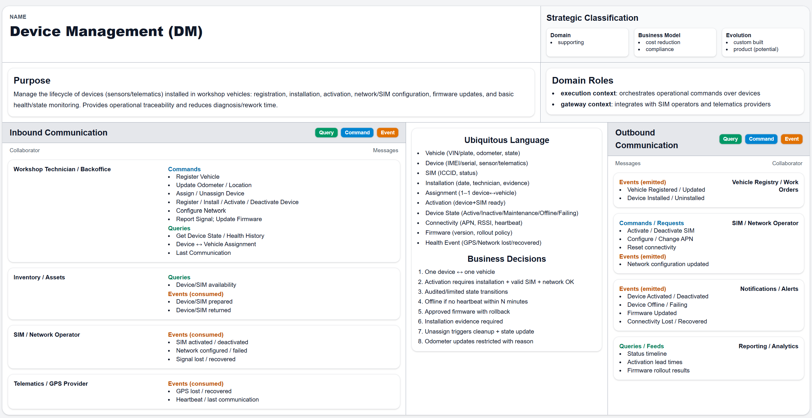

Telemetry Processing


Analytics & Recommendations

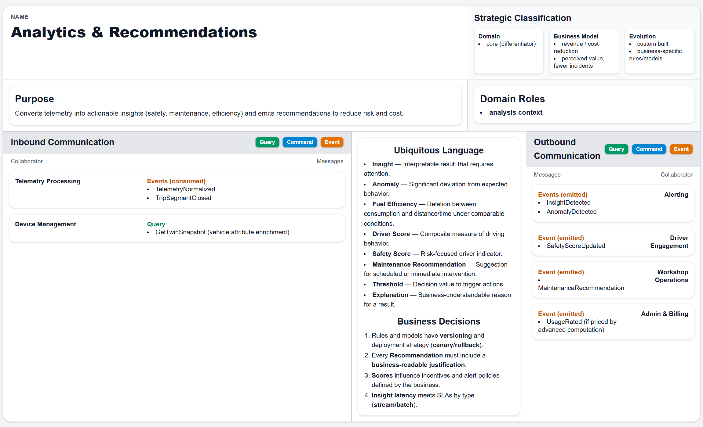

Alerting

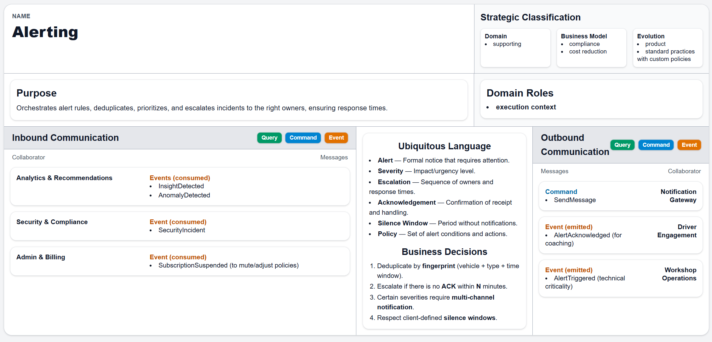

Driver Engagement

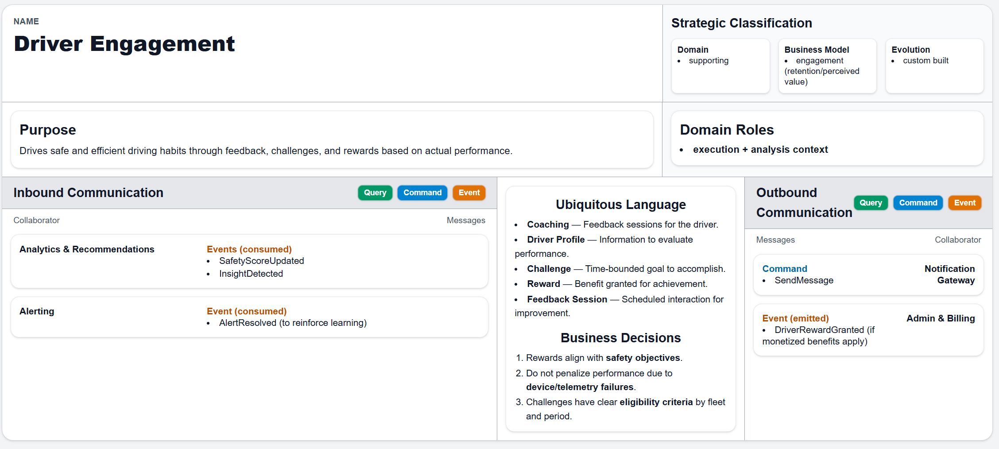

Workshop Operations

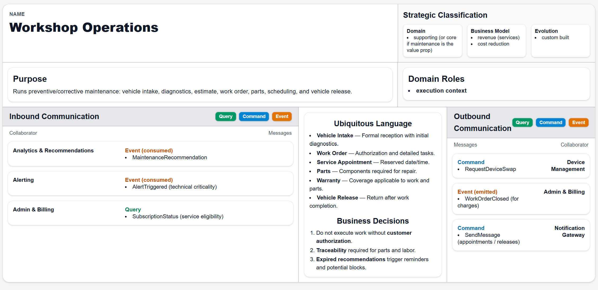

Admin & Billing

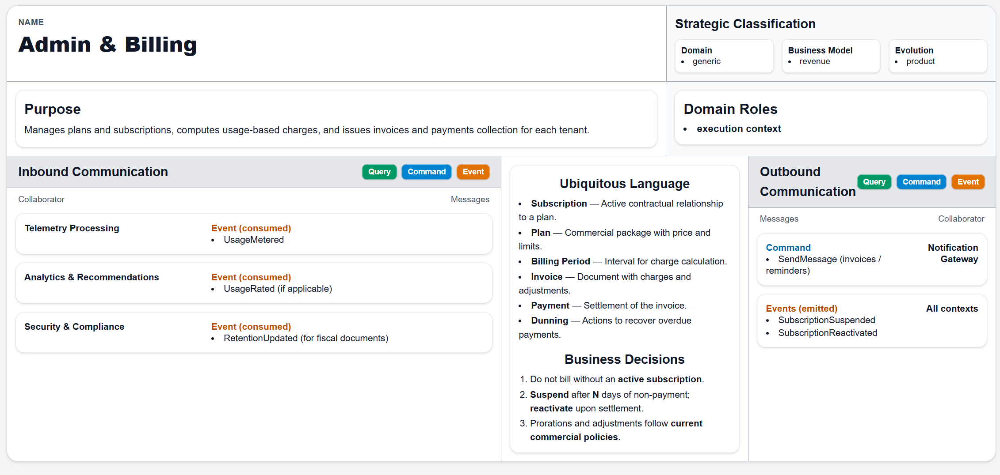

Security & Compliance

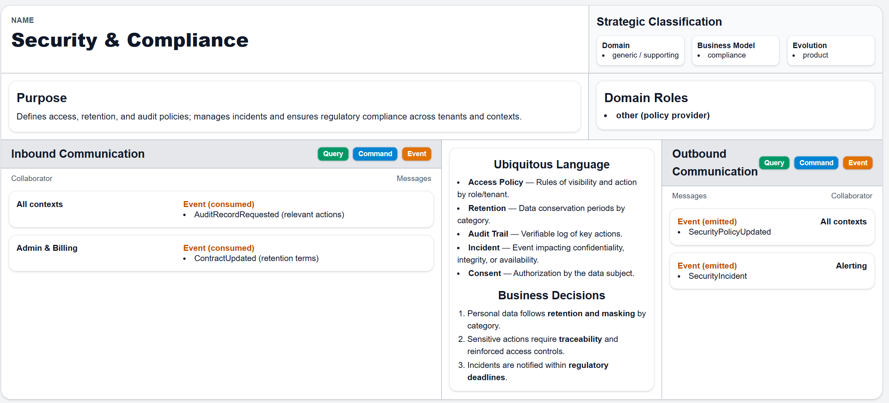

Notification Gateway

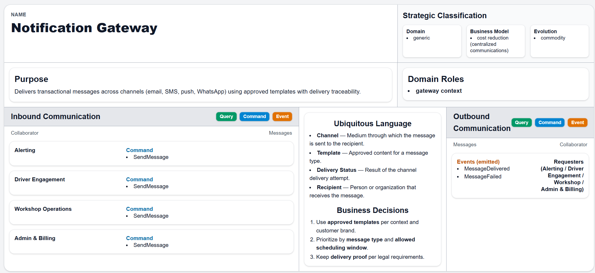


### 4.1.2. Context Mapping

Se describe las relaciones estructurales entre los **Bounded Contexts** de la plataforma, los **patrones DDD** aplicados y los **contratos** (eventos/APIs) que conectan los contextos.


<table>
  <caption>Relaciones clave entre Bounded Contexts y patrones DDD</caption>
  <thead>
    <tr>
      <th>Desde</th>
      <th>Hacia</th>
      <th>Propósito</th>
      <th>Patrón DDD</th>
      <th>Contrato</th>
      <th>Mensajes / Consultas</th>
      <th>SLA / Notas</th>
    </tr>
  </thead>
  <tbody>
    <tr>
      <td>Device Management</td>
      <td>Telemetry Processing</td>
      <td>Propagar alta/estado de dispositivo</td>
      <td>Published Language (+ Conformist en TP)</td>
      <td>Eventos</td>
      <td><code>DeviceProvisioned</code>, <code>DeviceAssigned</code>, <code>DeviceDecommissioned</code></td>
      <td>Entrega eventual ≤ 1 min</td>
    </tr>
    <tr>
      <td>Telemetry Processing</td>
      <td>Analytics &amp; Recommendations</td>
      <td>Alimentar analítica con datos normalizados</td>
      <td>Customer/Supplier</td>
      <td>Eventos</td>
      <td><code>TelemetryNormalized</code>, <code>TripSegmentClosed</code></td>
      <td>p95 ≤ 5 s; pérdida &lt; 0.1%</td>
    </tr>
    <tr>
      <td>Telemetry Processing</td>
      <td>Admin &amp; Billing</td>
      <td>Medición de uso para facturación</td>
      <td>Customer/Supplier</td>
      <td>Evento</td>
      <td><code>UsageMetered</code></td>
      <td>Corte diario 23:59 UTC</td>
    </tr>
    <tr>
      <td>Analytics &amp; Recommendations</td>
      <td>Alerting</td>
      <td>Disparar alertas según insights</td>
      <td>Published Language</td>
      <td>Eventos</td>
      <td><code>InsightDetected</code>, <code>AnomalyDetected</code></td>
      <td>Entrega ≤ 10 s</td>
    </tr>
    <tr>
      <td>Analytics &amp; Recommendations</td>
      <td>Driver Engagement</td>
      <td>Actualizar puntaje de conductor</td>
      <td>Conformist</td>
      <td>Evento</td>
      <td><code>SafetyScoreUpdated</code></td>
      <td>Consistencia eventual</td>
    </tr>
    <tr>
      <td>Analytics &amp; Recommendations</td>
      <td>Workshop Operations</td>
      <td>Recomendar mantenimientos</td>
      <td>Published Language</td>
      <td>Evento</td>
      <td><code>MaintenanceRecommendation</code></td>
      <td>Ventana de programación configurable</td>
    </tr>
    <tr>
      <td>Alerting</td>
      <td>Notification Gateway</td>
      <td>Enviar mensajes transaccionales</td>
      <td>Open-Host Service</td>
      <td>API / Comando</td>
      <td><code>SendMessage(tenant, template, channel, payload)</code></td>
      <td>Tasa de entrega ≥ 99%</td>
    </tr>
    <tr>
      <td>Driver Engagement</td>
      <td>Notification Gateway</td>
      <td>Enviar coaching/campañas</td>
      <td>Open-Host Service</td>
      <td>API / Comando</td>
      <td><code>SendMessage(...)</code></td>
      <td>Respeta ventanas de silencio</td>
    </tr>
    <tr>
      <td>Workshop Operations</td>
      <td>Device Management</td>
      <td>Solicitar cambio de dispositivo</td>
      <td>Open-Host Service</td>
      <td>API / Comando</td>
      <td><code>RequestDeviceSwap(vehicle, oldDevice, newDevice)</code></td>
      <td>Idempotencia por <code>requestId</code></td>
    </tr>
    <tr>
      <td>Workshop Operations</td>
      <td>Admin &amp; Billing</td>
      <td>Generar cargos por servicio</td>
      <td>Published Language</td>
      <td>Evento</td>
      <td><code>WorkOrderClosed</code></td>
      <td>Corte semanal</td>
    </tr>
    <tr>
      <td>Admin &amp; Billing</td>
      <td>(DM / AL / DE / WO)</td>
      <td>Señalar suspensión/reactivación de servicio</td>
      <td>Published Language</td>
      <td>Eventos</td>
      <td><code>SubscriptionSuspended</code>, <code>SubscriptionReactivated</code></td>
      <td>Efecto ≤ 1 min</td>
    </tr>
    <tr>
      <td>Security &amp; Compliance</td>
      <td>Todos</td>
      <td>Publicar/actualizar políticas y auditar</td>
      <td>Policy Provider (+ Published Language)</td>
      <td>Evento</td>
      <td><code>SecurityPolicyUpdated</code>, <code>AuditRecord</code></td>
      <td>Retención y acceso por tenant</td>
    </tr>
  </tbody>
</table>


## Decisiones y supuestos

- **Driver Score** vive en **Analytics** y se **publica** a Driver Engagement (`SafetyScoreUpdated`) para evitar duplicación de cálculo.
- **Elegibilidad de servicio** depende de **Admin & Billing** y se comunica por eventos (`SubscriptionSuspended/Reactived`), no con consultas síncronas en el camino crítico.
- **Notification Gateway** es un **OHS** común; centraliza plantillas y trazabilidad de entrega.
- **Security & Compliance** actúa como **Policy Provider** y emite `SecurityPolicyUpdated`; cada contexto aplica retención y acceso de acuerdo a su categoría de datos.
- Todos los eventos se **versionan** (`type`, `version`, `occurredAt`, `tenantId`, `entityId`) y se implementa **Outbox + DLQ** para entrega fiable.

---

## Riesgos y mitigaciones (resumen)

- **Tormenta de alertas** → *Throttling*, deduplicación, prioridades por severidad/tenant.
- **Late data** en telemetría → ventanas de tolerancia por negocio, reprocesos controlados.
- **Inconsistencias de elegibilidad** → event-sourcing de `SubscriptionStatus` + reconciliación diaria.
- **Lock-in analítico** → contratos de PL claros y gobernanza de versiones; evitar Shared Kernel salvo taxonomías muy estables.

---

## Glosario de patrones

- **Published Language (PL)**: el upstream publica un idioma/contrato estable (eventos o API) que downstreams consumen.
- **Conformist (CF)**: el downstream adopta el modelo del upstream para ir rápido (menos protección).
- **Customer/Supplier (CS)**: relación con expectativas y **SLA** claros entre consumidor y proveedor.
- **Open‑Host Service (OHS)**: API pública y estable que varios contextos pueden usar sin coordinaciones especiales.
- **Policy Provider (PP)**: contexto que define y emite políticas transversales (acceso, retención, auditoría).


### 4.1.3. Software Architecture
<p align="justify">
La arquitectura de software de <b>SafeCar</b> se ha diseñado aplicando el modelo <b>C4</b>, lo que permite representar de manera jerárquica y clara los distintos niveles de abstracción del sistema: desde la visión general hasta los detalles de implementación y despliegue. Este enfoque asegura que todos los involucrados comprendan cómo se organiza la solución y cómo interactúan sus diferentes componentes.
</p>

#### 4.1.3.1. Software Architecture System Landscape Diagram
<p align="justify">
Este diagrama ilustra el panorama general del ecosistema en el que se ubica SafeCar. Representa al sistema dentro de su contexto, mostrando los principales actores (conductores, mecánicos) y los sistemas externos con los que interactúa.
</p>

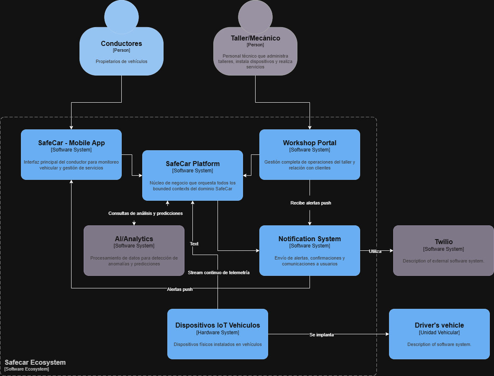

<br/>**Explicación:**
<p align="justify">
SafeCar se posiciona como una plataforma IoT de mantenimiento vehicular inteligente que conecta a conductores con mecánicos. El sistema recibe datos desde el dispositivo instalado en el vehículo y genera reportes accesibles para los mecánicos. También se comunica con servicios externos como sistemas de notificaciones para brindar un ecosistema completo.
</p>

#### 4.1.3.2. Software Architecture Context Level Diagrams
<p align="justify"> 
El <b>Context Diagram</b> 
representa la solución de software como una caja central que encapsula sus límites funcionales, mostrando a su alrededor a los diferentes actores y sistemas externos con los que interactúa. Este nivel del modelo C4 permite visualizar de forma global cómo la plataforma se integra en su entorno, identificando quiénes son los usuarios principales, qué tipo de información intercambian y qué servicios externos son necesarios para su funcionamiento. Asimismo, este diagrama facilita la comprensión del propósito del sistema dentro del ecosistema tecnológico, ayudando a los interesados (stakeholders) a entender el alcance, las dependencias y los flujos de comunicación sin necesidad de entrar en detalles técnicos de implementación. 
</p>

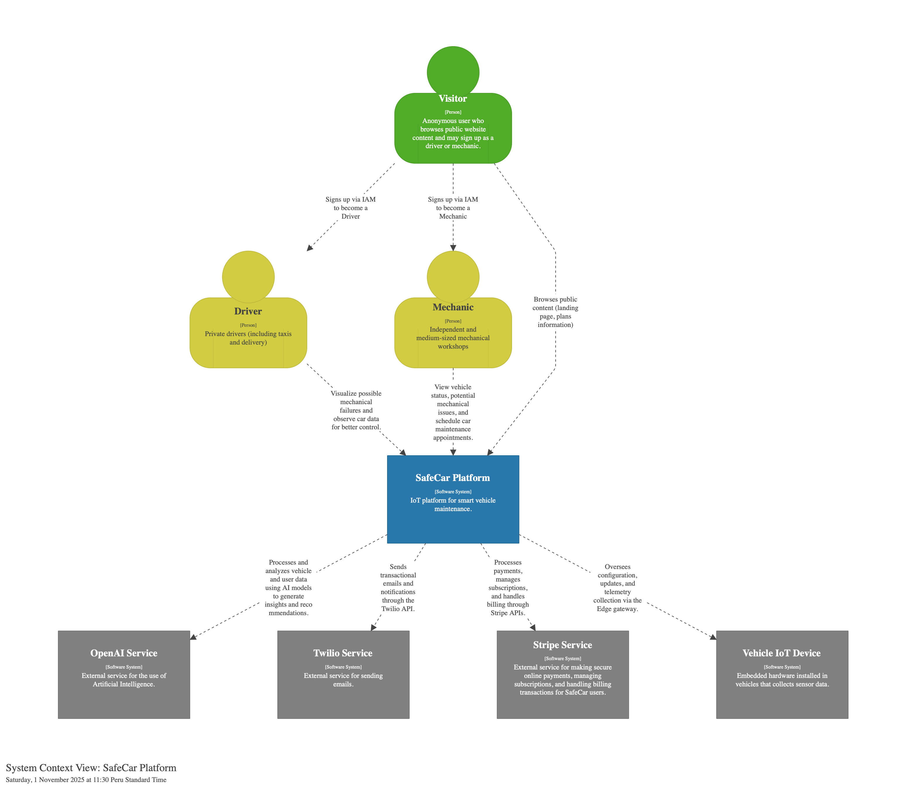

<br/>**Explicación del diagrama:**

<table border="1" cellspacing="0" cellpadding="8">
  <thead>
    <tr style="background-color:#808080;">
      <th>Element</th>
      <th>Type</th>
      <th>Description / Purpose</th>
      <th>Interactions (Relations)</th>
    </tr>
  </thead>
  <tbody>
    <tr>
      <td><strong>Visitor</strong></td>
      <td>Person</td>
      <td>Anonymous user who browses public website content (landing pages, plan info) and can sign up as a Driver or Mechanic.</td>
      <td>
        - Signs up via IAM to become a <strong>Driver</strong> or <strong>Mechanic</strong>.<br>
        - Browses public content through the SafeCar Platform.
      </td>
    </tr>
    <tr>
      <td><strong>Driver</strong></td>
      <td>Person</td>
      <td>Private driver (including taxis and delivery drivers). Uses SafeCar to monitor vehicle status and performance.</td>
      <td>
        - Visualizes potential mechanical failures and receives alerts and insights from the platform.
      </td>
    </tr>
    <tr>
      <td><strong>Mechanic</strong></td>
      <td>Person</td>
      <td>Independent or medium-sized workshop user. Uses SafeCar to manage maintenance and vehicle diagnostics.</td>
      <td>
        - Views vehicle status, identifies potential issues, and schedules maintenance appointments through the platform.
      </td>
    </tr>
    <tr>
      <td><strong>SafeCar Platform</strong></td>
      <td>Software System</td>
      <td>Core IoT platform for smart vehicle maintenance. Central hub that connects users, devices, and external services.</td>
      <td>
        - Receives telemetry data from <strong>Vehicle IoT Devices</strong>.<br>
        - Integrates with <strong>OpenAI</strong>, <strong>Twilio</strong>, and <strong>Stripe</strong> services.<br>
        - Provides web and mobile access to Drivers and Mechanics.
      </td>
    </tr>
    <tr>
      <td><strong>OpenAI Service</strong></td>
      <td>External Software System</td>
      <td>AI-based external service used for data processing and insight generation.</td>
      <td>
        - SafeCar Platform uses AI models to analyze data and generate predictive insights and recommendations.
      </td>
    </tr>
    <tr>
      <td><strong>Twilio Service</strong></td>
      <td>External Software System</td>
      <td>Communication platform for sending transactional emails and notifications.</td>
      <td>
        - SafeCar Platform sends transactional emails and notifications through the <strong>Twilio API</strong> (e.g., alerts, confirmations).
      </td>
    </tr>
    <tr>
      <td><strong>Stripe Service</strong></td>
      <td>External Software System</td>
      <td>Secure online payment service for handling subscriptions and billing.</td>
      <td>
        - SafeCar Platform processes payments, manages subscriptions, and handles billing transactions through <strong>Stripe APIs</strong>.<br>
        - Receives webhooks for payment and subscription events.
      </td>
    </tr>
    <tr>
      <td><strong>Vehicle IoT Device</strong></td>
      <td>External Hardware System</td>
      <td>Embedded hardware installed in vehicles that captures sensor data (OBD-II, GPS, IMU) and receives OTA updates.</td>
      <td>
        - SafeCar Platform manages provisioning, configuration, and firmware updates.<br>
        - Collects telemetry and diagnostic data through the <strong>Edge Gateway</strong>.
      </td>
    </tr>
  </tbody>
</table>

<br/>**Resumen del flujo de información:**

<table border="1" cellspacing="0" cellpadding="8">
  <thead>
    <tr style="background-color:#808080;">
      <th>From → To</th>
      <th>Description</th>
    </tr>
  </thead>
  <tbody>
    <tr>
      <td>Visitor → SafeCar Platform</td>
      <td>Browses public information and signs up as Driver or Mechanic.</td>
    </tr>
    <tr>
      <td>Driver → SafeCar Platform</td>
      <td>Views telemetry, alerts, and AI-generated insights.</td>
    </tr>
    <tr>
      <td>Mechanic → SafeCar Platform</td>
      <td>Monitors vehicles and schedules maintenance tasks.</td>
    </tr>
    <tr>
      <td>SafeCar Platform → OpenAI Service</td>
      <td>Sends operational data for AI processing and insight generation.</td>
    </tr>
    <tr>
      <td>SafeCar Platform → Twilio Service</td>
      <td>Sends transactional and notification emails to users.</td>
    </tr>
    <tr>
      <td>SafeCar Platform → Stripe Service</td>
      <td>Handles secure payments, subscriptions, and billing transactions.</td>
    </tr>
    <tr>
      <td>SafeCar Platform ↔ Vehicle IoT Device</td>
      <td>Manages configuration, commands, and OTA updates; receives telemetry data via the Edge gateway.</td>
    </tr>
  </tbody>
</table>

#### 4.1.3.2. Software Architecture Container Level Diagrams
<p align="justify"> 
El <b>Container Diagram</b> detalla la estructura interna de la solución mostrada en el diagrama de contexto, descomponiendo el sistema principal en los distintos contenedores de software que lo conforman. Cada contenedor representa una aplicación o componente ejecutable independiente —como aplicaciones web, móviles, bases de datos o servicios— que, en conjunto, colaboran para ofrecer las funcionalidades de la plataforma <b>SafeCar</b>. <br><br> Este nivel permite comprender cómo se distribuyen las responsabilidades dentro del sistema, qué tecnologías se emplean en cada parte, y cómo se comunican los contenedores entre sí o con sistemas externos. Además, facilita la identificación de puntos de integración, dependencias tecnológicas y canales de comunicación entre la interfaz de usuario, la lógica de negocio y las capas de persistencia o servicios de terceros. <br><br> En este diagrama se pueden observar los principales contenedores que conforman la plataforma —como el <b>SafeCar Website</b>, la <b>Web Application</b>, la <b>Single Page Application (SPA)</b>, el <b>Backend</b>, el <b>Mobile App</b>, el <b>Edge Gateway</b> y las respectivas bases de datos— junto con sus interacciones con los actores del sistema y con los servicios externos de inteligencia artificial, notificaciones, pagos y dispositivos IoT. De esta manera, se ofrece una visión integral de la arquitectura lógica y tecnológica que sustenta la operación de SafeCar. 
</p>

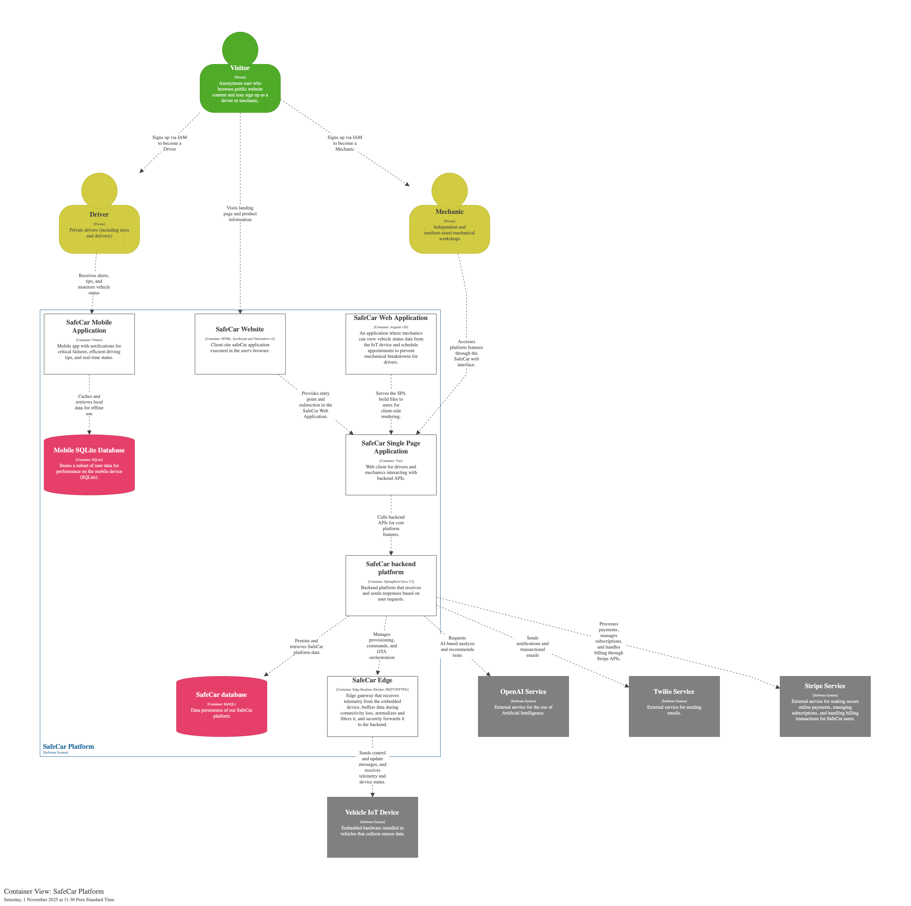

<br/>**Explicación del diagrama:**

<table border="1" cellspacing="0" cellpadding="8">
  <thead>
    <tr style="background-color:#808080;">
      <th>Element</th>
      <th>Type</th>
      <th>Description / Purpose</th>
      <th>Interactions (Relations)</th>
    </tr>
  </thead>
  <tbody>
    <!-- People -->
    <tr>
      <td><strong>Visitor</strong></td>
      <td>Person</td>
      <td>Anonymous user who browses public content on the SafeCar Website and can register to become a Driver or Mechanic.</td>
      <td>
        - Visits the <strong>SafeCar Website</strong> to explore plans and product information.<br>
        - Registers through the IAM module to access the platform.
      </td>
    </tr>
    <tr>
      <td><strong>Driver</strong></td>
      <td>Person</td>
      <td>Private driver (including taxis and delivery). Uses the mobile app or SPA to monitor vehicle telemetry and receive alerts.</td>
      <td>
        - Interacts with the <strong>SafeCar Mobile App</strong> and <strong>SPA</strong>.<br>
        - Receives alerts, driving tips, and real-time vehicle data.
      </td>
    </tr>
    <tr>
      <td><strong>Mechanic</strong></td>
      <td>Person</td>
      <td>Independent or medium-sized workshop user who manages vehicle diagnostics and maintenance through the SafeCar Web Application.</td>
      <td>
        - Accesses the <strong>Web Application</strong> to view telemetry, create work orders, and schedule maintenance appointments.
      </td>
    </tr>
    <!-- Containers -->
    <tr>
      <td><strong>SafeCar Website</strong></td>
      <td>Container</td>
      <td>Public-facing site that presents information about SafeCar’s services, plans, and features to attract new users.</td>
      <td>
        - Visited by the <strong>Visitor</strong>.<br>
        - Redirects registered users to the <strong>SPA</strong> for authentication and platform access.
      </td>
    </tr>
    <tr>
      <td><strong>SafeCar Web Application</strong></td>
      <td>Container</td>
      <td>Web application used by mechanics to visualize vehicle telemetry, manage appointments, and monitor diagnostic data.</td>
      <td>
        - Communicates with the <strong>SPA</strong> to display data.<br>
        - Uses APIs exposed by the <strong>Backend Platform</strong>.
      </td>
    </tr>
    <tr>
      <td><strong>SafeCar Single Page Application (SPA)</strong></td>
      <td>Container</td>
      <td>Client-side web interface for both Drivers and Mechanics. Provides a responsive and dynamic user experience.</td>
      <td>
        - Served by the <strong>Web Application</strong> or <strong>Website</strong>.<br>
        - Communicates with the <strong>Backend Platform</strong> via REST APIs.
      </td>
    </tr>
    <tr>
      <td><strong>SafeCar Mobile Application</strong></td>
      <td>Container</td>
      <td>Cross-platform mobile application for Drivers to monitor vehicle health, receive alerts, and view driving performance.</td>
      <td>
        - Reads and stores local data in the <strong>Mobile SQLite Database</strong>.<br>
        - Communicates with the <strong>Backend Platform</strong> via APIs.
      </td>
    </tr>
    <tr>
      <td><strong>Mobile SQLite Database</strong></td>
      <td>Container</td>
      <td>Local database within the mobile device used to cache essential data for offline use and improve performance.</td>
      <td>
        - Used by the <strong>Mobile Application</strong> for local persistence.
      </td>
    </tr>
    <tr>
      <td><strong>SafeCar Backend Platform</strong></td>
      <td>Container</td>
      <td>Core service layer that manages business logic, API endpoints, and integration with bounded contexts (IAM, Payments, Devices, etc.).</td>
      <td>
        - Communicates with the <strong>SPA</strong> and <strong>Mobile App</strong>.<br>
        - Persists data in the <strong>SafeCar Database</strong>.<br>
        - Integrates with <strong>OpenAI</strong>, <strong>Twilio</strong>, <strong>Stripe</strong>, and the <strong>Edge</strong>.
      </td>
    </tr>
    <tr>
      <td><strong>SafeCar Database</strong></td>
      <td>Container</td>
      <td>Central data persistence system for user data, subscriptions, vehicle telemetry, and other operational records.</td>
      <td>
        - Used by the <strong>Backend Platform</strong> for CRUD operations and long-term storage.
      </td>
    </tr>
    <tr>
      <td><strong>SafeCar Edge</strong></td>
      <td>Container</td>
      <td>Edge gateway that receives telemetry from embedded vehicle devices, buffers and normalizes data, and forwards it securely to the backend. Also handles provisioning, commands, and OTA updates.</td>
      <td>
        - Exchanges data with the <strong>Vehicle IoT Device</strong>.<br>
        - Sends normalized telemetry to the <strong>Backend Platform</strong>.<br>
        - Receives OTA and provisioning commands from the <strong>Backend Platform</strong>.
      </td>
    </tr>
    <!-- External Systems -->
    <tr>
      <td><strong>Vehicle IoT Device</strong></td>
      <td>External Hardware System</td>
      <td>Embedded hardware installed in vehicles that captures real-time sensor data and receives OTA commands.</td>
      <td>
        - Sends telemetry to the <strong>SafeCar Edge</strong>.<br>
        - Receives configuration, commands, and firmware updates (OTA) from the Edge.
      </td>
    </tr>
    <tr>
      <td><strong>OpenAI Service</strong></td>
      <td>External Software System</td>
      <td>AI-powered service used to analyze vehicle data and generate intelligent insights and recommendations.</td>
      <td>
        - The <strong>Backend Platform</strong> sends data for processing and receives predictive analytics and recommendations.
      </td>
    </tr>
    <tr>
      <td><strong>Twilio Service</strong></td>
      <td>External Software System</td>
      <td>Communication service that handles the delivery of emails and notifications.</td>
      <td>
        - The <strong>Backend Platform</strong> sends transactional emails and notifications via the <strong>Twilio API</strong>.
      </td>
    </tr>
    <tr>
      <td><strong>Stripe Service</strong></td>
      <td>External Software System</td>
      <td>Payment gateway that manages subscriptions, billing, and online transactions for SafeCar users.</td>
      <td>
        - The <strong>Backend Platform</strong> processes payments through <strong>Stripe APIs</strong>.<br>
        - <strong>Stripe</strong> sends webhooks for billing and subscription events.
      </td>
    </tr>
  </tbody>
</table>

#### 4.1.3.3. Software Architecture Deployment Diagrams
<p align="justify">
Los <b>Deployment Diagrams</b> representan la arquitectura física de despliegue de la plataforma SafeCar, mostrando cómo los contenedores de software se distribuyen en la infraestructura tecnológica. Este nivel de detalle es esencial para comprender los aspectos operacionales del sistema, incluyendo la configuración de servidores, bases de datos, servicios en la nube y las conexiones de red entre los diferentes nodos de la infraestructura.
</p>


<p align="justify">
En SafeCar, el despliegue se ha diseñado considerando escalabilidad, disponibilidad y seguridad. La arquitectura aprovecha tanto infraestructura local como servicios en la nube para garantizar un rendimiento óptimo y la capacidad de manejar el crecimiento de usuarios y dispositivos IoT conectados.
</p>

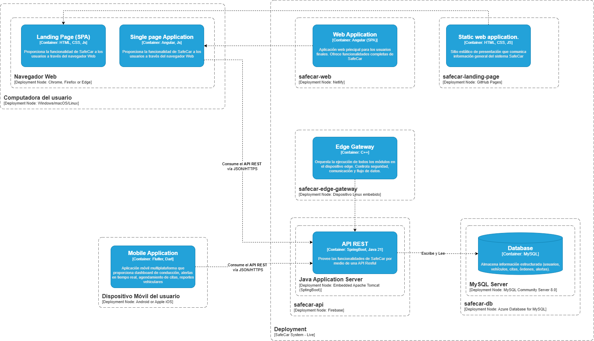


## 4.2. Tactical-Level Domain-Driven Design

### 4.2.1. Bounded Context: Workshop Operations & Telemetry Processing

<b>Propósito del BC</b>
<p align="justify">
El <b>Workshop Operations & Telemetry Processing BC</b> tiene como propósito integrar la gestión operativa de los talleres mecánicos con el procesamiento continuo de la telemetría vehicular proveniente de los dispositivos IoT instalados en los vehículos.
Este contexto actúa como el núcleo operativo del ecosistema SafeCar, ya que conecta directamente los datos generados por los conductores con las actividades internas del taller, permitiendo una administración dinámica y basada en información en tiempo real.
</p>

<b>Objetivos Clave</b>
<p align="justify">
El <b>Workshop Operations & Telemetry Processing (WorkshopOps)</b> persigue como objetivo principal la integración entre la operación interna del taller y el procesamiento inteligente de la telemetría proveniente de los vehículos conectados. 
Este contexto busca garantizar una trazabilidad completa entre los datos capturados por los dispositivos IoT y las actividades de mantenimiento o diagnóstico realizadas en el taller.
</p>

<p align="justify">
Entre sus objetivos fundamentales se encuentra la capacidad de asociar con precisión cada lectura de telemetría al vehículo y conductor correspondientes, 
lo que permite un análisis contextualizado y confiable de la información. 
Asimismo, busca unificar la gestión de agendas de servicio, órdenes de trabajo y asignación de recursos humanos con los datos operativos del vehículo en tiempo real. 
El BC también habilita la ingesta, procesamiento y normalización de flujos de datos —como velocidad, ubicación, alertas o fallas mecánicas— a través de mecanismos de <i>stream processing</i>, 
asegurando que la información sea consistente y útil para el resto de la plataforma. 
Finalmente, WorkshopOps publica un flujo de datos enriquecido y canónico que alimenta directamente a otros Bounded Contexts, 
principalmente <b>Analytics & Recommendations (Insights)</b> y <b>Communication (Alerts)</b>, 
permitiendo la automatización de las operaciones de taller y la detección temprana de fallas vehiculares basadas en información procesada en tiempo real.
</p>

<b>Rol Estratégico en la Plataforma</b>
<p align="justify">
El rol estratégico de <b>WorkshopOps</b> dentro del ecosistema <b>SafeCar</b> radica en ser el punto de convergencia entre el mundo físico —representado por los vehículos y talleres— 
y el entorno digital de la plataforma. 
Este Bounded Context actúa como el eje central que conecta la telemetría con las operaciones, garantizando que cada dato proveniente del vehículo tenga un impacto directo en la planificación, diagnóstico y ejecución de los servicios del taller.
</p>

<p align="justify">
Gracias a su integración con los demás BCs, WorkshopOps asegura una sincronización constante entre la actividad del vehículo y la operación del taller, 
ofreciendo un flujo de datos confiable, limpio y estandarizado que impulsa la analítica predictiva y los mecanismos de comunicación proactiva. 
Además, representa un pilar fundamental en la transformación digital del sector automotriz, 
convirtiendo los talleres tradicionales en verdaderos <b>Smart Workshops</b>, 
donde las decisiones se toman a partir de datos precisos y procesos automatizados.
</p>

#### 4.2.1.1. Domain Layer

**Propósito del BC**
Gestionar el ciclo de vida completo de los dispositivos IoT, desde su registro y configuración inicial hasta su asignación a un vehículo y eventual desactivación. Este BC es la fuente de verdad sobre qué dispositivo está instalado en qué vehículo.

<b>A) Agregado y Entidades (diccionario)</b>

- **Aggregate Root: `Device`**
  - **Propósito:** Encapsular toda la información, estado y reglas de negocio de un dispositivo IoT.
  - **Invariantes:**
    - Un `serialNumber` es único y no puede cambiar una vez registrado.
    - Un dispositivo solo puede ser asignado a un vehículo a la vez (`vehicleId`).
    - Un dispositivo debe estar en estado `ACTIVE` para ser asignado.
    - El estado (`status`) debe seguir un ciclo de vida válido (ej. no se puede pasar de `MAINTENANCE` a `ASSIGNED` directamente).
  - **Atributos:**
    - `deviceId: UUID`
    - `serialNumber: String`
    - `model: String`
    - `firmwareVersion: FirmwareVersion`
    - `status: DeviceStatus`
    - `vehicleId: Optional<UUID>`
  - **Métodos:**
    - `assignToVehicle(vehicleId: UUID): void`
    - `unassignFromVehicle(): void`
    - `updateFirmware(newVersion: FirmwareVersion): void`
    - `activate(): void`
    - `deactivate(): void`
    - `placeInMaintenance(): void`

<b>B) Value Objects (records/enums)</b>

- **`FirmwareVersion` (record):** `major: int`, `minor: int`, `patch: int` (encapsula la lógica de comparación de versiones).
- **`DeviceStatus` (enum):** `REGISTERED`, `ACTIVE`, `INACTIVE`, `MAINTENANCE`, `EOL` (End-of-Life).

<b>C) Servicios de Dominio (interfaces)</b>

- **`DeviceProvisioner`** → `provision(device: Device): ProvisioningResult`
- **`SerialNumberUniquenessChecker`** → `isUnique(serialNumber: String): boolean`

> Implementaciones concretas de estos servicios residen en la capa de Infraestructura.

<b>D) Repositorios (puertos del dominio)</b>

- **`DeviceRepository`**
  - `save(device: Device): Device`
  - `findByDeviceId(deviceId: UUID): Optional<Device>`
  - `findBySerialNumber(serialNumber: String): Optional<Device>`
  - `findByVehicleId(vehicleId: UUID): Optional<Device>`

<b>E) Commands & Queries (records en dominio)</b>

**Commands**
- `RegisterDeviceCommand(serialNumber: String, model: String, initialFirmwareVersion: FirmwareVersion)`
- `AssignDeviceToVehicleCommand(deviceId: UUID, vehicleId: UUID)`
- `UnassignDeviceFromVehicleCommand(deviceId: UUID)`
- `UpdateDeviceFirmwareCommand(deviceId: UUID, newFirmwareVersion: FirmwareVersion)`
- `DeactivateDeviceCommand(deviceId: UUID)`

**Queries**
- `GetDeviceByDeviceIdQuery(deviceId: UUID)`
- `GetDeviceByVehicleIdQuery(vehicleId: UUID)`
- `GetAllDevicesQuery(page: int, size: int)`

<b>F) Domain Events </b>

- `DeviceRegisteredEvent` (deviceId, serialNumber, occurredOn)
- `DeviceAssignedToVehicleEvent` (deviceId, vehicleId, occurredOn)
- `DeviceUnassignedFromVehicleEvent` (deviceId, vehicleId, occurredOn)
- `DeviceFirmwareUpdatedEvent` (deviceId, oldVersion, newVersion, occurredOn)
- `DeviceStatusChangedEvent` (deviceId, oldStatus, newStatus, occurredOn)

<b>G) Facade (contrato entre BCs)</b>

- **Interface en dominio:** `ExternalVehicleContextFacade`
  - **Propósito:** Consultar información del BC de Flota de Vehículos sin acoplamiento directo.
  - **Métodos ejemplo:**
    - `existsVehicle(vehicleId: UUID): boolean`

<b>H) Excepciones de Dominio</b>

- `DeviceNotFoundException`
- `SerialNumberAlreadyExistsException`
- `DeviceAlreadyAssignedException`
- `InvalidDeviceStatusTransitionException`

---
#### 4.2.1.2. Interface Layer
<b>A) Controladores (REST Controllers)</b>

1) **`DeviceController`**
- **Responsabilidad:** Exponer endpoints para la gestión completa del ciclo de vida de los dispositivos.
- **Dependencias:** `DeviceCommandService`, `DeviceQueryService`, `DeviceResourceFromEntityAssembler`.
- **Rutas:**
  - `POST /api/v1/devices` – registrar un nuevo dispositivo.
    - **Request:** `RegisterDeviceResource`
    - **Command:** `RegisterDeviceCommand`
    - **Response:** `DeviceResource`
  - `PUT /api/v1/devices/{deviceId}/assignment` – asignar un dispositivo a un vehículo.
    - **Request:** `AssignDeviceResource`
    - **Command:** `AssignDeviceToVehicleCommand`
    - **Response:** `DeviceResource`
  - `DELETE /api/v1/devices/{deviceId}/assignment` – desasignar un dispositivo.
    - **Command:** `UnassignDeviceFromVehicleCommand`
    - **Response:** `204 No Content`
  - `PATCH /api/v1/devices/{deviceId}/firmware` – actualizar la versión del firmware.
    - **Request:** `UpdateFirmwareResource`
    - **Command:** `UpdateDeviceFirmwareCommand`
    - **Response:** `DeviceResource`
  - `GET /api/v1/devices/{deviceId}` – obtener un dispositivo por su ID.
    - **Query:** `GetDeviceByDeviceIdQuery`
    - **Response:** `DeviceResource`
  - `GET /api/v1/devices?vehicleId={vehicleId}` – obtener un dispositivo por el ID del vehículo.
    - **Query:** `GetDeviceByVehicleIdQuery`
    - **Response:** `DeviceResource`

---

<b>B) Resources (DTOs de entrada/salida)</b>

Ubicación: `interfaces/resources`

**Requests**
- `RegisterDeviceResource { serialNumber: string, model: string, initialFirmwareVersion: string }`
- `AssignDeviceResource { vehicleId: string }`
- `UpdateFirmwareResource { newFirmwareVersion: string }`

**Responses**
- `DeviceResource { deviceId: string, serialNumber: string, model: string, firmwareVersion: string, status: string, vehicleId: string | null }`

> **Validaciones** (Bean Validation): `@NotNull`, `@NotBlank`, `@Pattern` para `serialNumber` y `firmwareVersion`.

---

<b>C) Assemblers (mapeadores)</b>

Ubicación: `interfaces/transform`

- **`DeviceResourceFromEntityAssembler`**
  - `toResource(Device domain): DeviceResource`
  - `toDomain(RegisterDeviceResource r): RegisterDeviceCommand`
  - `toDomain(AssignDeviceResource r, UUID deviceId): AssignDeviceToVehicleCommand`
  - `toDomain(UpdateFirmwareResource r, UUID deviceId): UpdateDeviceFirmwareCommand`

---

<b>D) Manejo de errores y contrato</b>

- Respuestas de error estandarizadas (`Problem+JSON`):
  - `400` Bad Request (validación de DTO).
  - `404` Not Found (`DeviceNotFoundException`).
  - `409` Conflict (`SerialNumberAlreadyExistsException`, `DeviceAlreadyAssignedException`).
- Versionado de API: prefijo `/api/v1` y *content negotiation* (`application/json`).

---
#### 4.2.1.3. Application Layer

<b>A) Command Services (implementaciones)</b>

1) **`DeviceCommandServiceImpl`** (`application/internal/commandservices`)
- **register(cmd: RegisterDeviceCommand): Device**
  1. Verifica unicidad usando `SerialNumberUniquenessChecker.isUnique`. Si no, lanza `SerialNumberAlreadyExistsException`.
  2. Crea una nueva instancia del agregado `Device`.
  3. Opcional: Invoca `DeviceProvisioner.provision(device)` para registrarlo en el Hub IoT.
  4. Persiste con `deviceRepository.save(..)` y publica `DeviceRegisteredEvent`.
- **assignToVehicle(cmd: AssignDeviceToVehicleCommand): Device**
  1. Carga el `Device` por `deviceId`.
  2. Verifica si el vehículo existe usando `ExternalVehicleContextFacade.existsVehicle`.
  3. Invoca `device.assignToVehicle(cmd.vehicleId)`. El agregado valida sus invariantes (ej. estado `ACTIVE`).
  4. Persiste los cambios y publica `DeviceAssignedToVehicleEvent`.

<b>B) Query Services (implementaciones)</b>

1) **`DeviceQueryServiceImpl`**
- **handle(q: GetDeviceByDeviceIdQuery): Optional<Device>** → `deviceRepository.findByDeviceId(..)`
- **handle(q: GetDeviceByVehicleIdQuery): Optional<Device>** → `deviceRepository.findByVehicleId(..)`

<b>C) Event Handlers</b>

Ubicación: `application/internal/eventhandlers`

- **`NotifyTelemetryOnAssignmentHandler`**
  - **Escucha:** `DeviceAssignedToVehicleEvent`
  - **Acción:** Publica un evento de integración para notificar al BC de *Telemetry Processing* que debe empezar a escuchar datos de este dispositivo para el vehículo asociado.
- **`AuditDeviceLifecycleHandler`**
  - **Escucha:** `DeviceRegisteredEvent`, `DeviceStatusChangedEvent`, `DeviceAssignedToVehicleEvent`.
  - **Acción:** Escribe un registro de auditoría en un log o tabla separada para trazabilidad.

<b>D) Outbound Services / ACL (Facade entre BCs)</b>

Ubicación: `application/outboundservices/acl`

- **Interface en dominio:** `ExternalVehicleContextFacade`
- **Implementación (ACL):** **`ExternalVehicleContextService`**
  - **existsVehicle(vehicleId: UUID): boolean** — Llama a un endpoint del BC *Vehicle Fleet Management* para validar que el vehículo existe.
  - **Manejo de fallos:** *timeouts*, *circuit breaker*, *fallback*.

---
#### 4.2.1.4. Infrastructure Layer

<b>A) Persistencia (JPA / MySQL)</b>

**Entidades JPA (solo para persistencia):**
- `DeviceEntity` ↔ tabla `devices`

**Repositorios Spring Data (infra):**
- `DeviceJpaRepository extends JpaRepository<DeviceEntity, Long>`
  - `Optional<DeviceEntity> findByDeviceId(UUID deviceId)`
  - `Optional<DeviceEntity> findBySerialNumber(String serialNumber)`
  - `Optional<DeviceEntity> findByVehicleId(UUID vehicleId)`

**Adaptadores que implementan puertos del dominio:**
- `DeviceRepositoryImpl implements DeviceRepository`
  - Usa `DeviceJpaRepository` + *mappers* para convertir **Entity ↔ Aggregate**.

**Mappers (infra/persistence/mapping):**
- `DeviceMapper`
  - `toEntity(Device)` / `toAggregate(DeviceEntity)`

<b>B) Integración con servicios externos</b>

**Cliente IoT Hub (infra/external/iot):**
- `AzureIoTHubClientImpl implements DeviceProvisioner`
  - HTTP con SDK de Azure IoT Hub.
  - *Configuración:* `IOTHUB_CONNECTION_STRING` (en `infrastructure/config`).
  - *Resiliencia:* *timeouts*, *retry*, *circuit breaker* (Resilience4j).

<b>C) Publicación de eventos</b>

**Adaptador:** `DomainEventPublisherImpl` (infra/events)
- Implementa puerto `DomainEventPublisher`.
- Usa `ApplicationEventPublisher` (Spring) para despachar eventos dentro de la misma transacción.

<b>D) Configuración & migraciones</b>

- **Config:** `PersistenceConfig`, `AzureIoTHubConfig`.
- **Migraciones:** `db/migration` (Flyway/Liquibase) con DDL para la tabla `devices`.
- **Observabilidad:** *logging* con `X-Request-Id`, métricas para `AzureIoTHubClientImpl`.

---
#### 4.2.1.5. Bounded Context Software Architecture Component Level Diagrams

<b>A) Componentes y responsabilidades</b>

- **Device Management Facade**
  - **Capa:** Application (coordinación de casos de uso del BC).
  - **Responsabilidad:** Orquesta `CommandServices`/`QueryServices` y centraliza políticas transversales.
- **Device Component**
  - **Capa:** Application + Domain
  - **Responsabilidad:** Gestionar el agregado `Device`, aplicando las reglas de negocio e invariantes.
  - **Interfaces dominio usadas:** `DeviceRepository`, `DeviceProvisioner`, `SerialNumberUniquenessChecker`.
- **Device Repository**
  - **Capa:** Infrastructure (persistencia)
  - **Responsabilidad:** Adaptador de acceso a datos para el agregado `Device`.
  - **Tecnología:** Spring Data JPA sobre MySQL.
- **IoT Hub Client**
  - **Capa:** Infrastructure (cliente externo)
  - **Responsabilidad:** Implementa `DeviceProvisioner`. Se comunica con la plataforma IoT externa.
- **External Vehicle Context Service (ACL)**
  - **Capa:** Application/outboundservices/acl
  - **Responsabilidad:** Implementa `ExternalVehicleContextFacade` para obtener datos del BC de Flota de Vehículos de forma segura.

<b>B) Relaciones (resumen)</b>

- `Device Management Facade → Device Component`
- `Device Component → Device Repository` (→ MySQL)
- `Device Component → IoT Hub Client` (→ Azure/AWS IoT Hub)
- `Device Component → External Vehicle Context Service` (→ Vehicle Fleet BC)
- `Device Component → Domain Event Publisher`

<b>C) Mapeo a <b>nomenclaturas</b> y <b>paquetes</b></b>

- **Application/internal/commandservices**
  - `DeviceCommandServiceImpl`
- **Application/internal/queryservices**
  - `DeviceQueryServiceImpl`
- **Application/outboundservices/acl**
  - `ExternalVehicleContextService`
- **Interfaces/resources**
  - `RegisterDeviceResource`, `AssignDeviceResource`, etc.
- **Interfaces/transform (assemblers)**
  - `DeviceResourceFromEntityAssembler`
- **Infrastructure/persistence/jpa**
  - `DeviceRepositoryImpl`
- **Infrastructure/external/iot**
  - `AzureIoTHubClientImpl`
- **Infrastructure/events**
  - `DomainEventPublisherImpl`

<br/>


---
#### 4.2.1.6. Bounded Context Software Architecture Code Level Diagrams

#### 4.2.1.6.1. Bounded Context Domain Layer Class Diagrams
<p align="justify">
El diagrama de clases ilustra el modelo de dominio del BC Device Management. Define el agregado `Device` como la pieza central, sus Value Objects asociados como `FirmwareVersion` y la enumeración `DeviceStatus`. También especifica los contratos (interfaces) que el dominio expone para la persistencia (`DeviceRepository`), servicios de dominio (`DeviceProvisioner`) y comunicación inter-BC (`ExternalVehicleContextFacade`), manteniendo el núcleo de negocio agnóstico a la implementación tecnológica.
</p>


<b>2) Agregado y VOs</b>
- **Device (Aggregate Root)**
  - Responsable de mantener su estado consistente a través de métodos como `assignToVehicle(...)` y `updateFirmware(...)`.
  - **Relaciones:**
    - `Device --> FirmwareVersion` («has a»): Usa el VO para representar la versión del firmware.
    - `Device --> DeviceStatus` («has a»): Usa el enum para gestionar su estado en el ciclo de vida.

<b>3) Puertos (Interfaces)</b>
- **`DeviceRepository`**: Define las operaciones de persistencia requeridas por el dominio. Su implementación en Infraestructura usará JPA.
- **`DeviceProvisioner`**: Abstrae la lógica de provisionamiento en una plataforma IoT externa. Permite cambiar de proveedor (ej. de Azure a AWS) sin alterar el dominio.
- **`ExternalVehicleContextFacade`**: Contrato para interactuar con el BC de Vehículos. Su implementación (ACL) en Application se encargará de la comunicación real (ej. REST).

<b>4) Eventos de Dominio</b>
- Se modelan como clases simples que contienen los datos relevantes del suceso.
- Una relación «about» los vincula con el agregado `Device` para indicar el sujeto del evento.

---
#### 4.2.1.6.2. Bounded Context Database Design Diagram

<b>1) Visión general</b>
<p align="justify">
El siguiente esquema de base de datos para MySQL soporta la persistencia del agregado `Device`. Está optimizado para consultas comunes, como buscar un dispositivo por su ID de serie o por el vehículo al que está asignado, y asegura la unicidad de los identificadores clave.
</p>


<b>2) Tablas principales</b>
- **devices**
  - Representa la raíz de agregado `Device`.
  - Atributos clave:
    - `id` (BIGINT, PK): Clave primaria técnica.
    - `device_id` (BINARY(16), UUID): Clave de negocio, única en la tabla.
    - `serial_number` (VARCHAR): Número de serie, debe ser único.
    - `model` (VARCHAR): Modelo del dispositivo.
    - `firmware_version` (VARCHAR): Versión actual del firmware.
    - `status` (VARCHAR): Estado del ciclo de vida del dispositivo.
    - `vehicle_id` (BINARY(16), UUID, NULLABLE): ID del vehículo al que está asignado.
    - `created_at`, `updated_at`: Control de auditoría.
  - **Constraints:** `UNIQUE(device_id)`, `UNIQUE(serial_number)`.

<b>3) Relaciones y cardinalidades</b>
- No existen relaciones con clave foránea (FK) a otras tablas de otros BCs para mantener un bajo acoplamiento a nivel de base de datos.
- La relación `Device 1 -- 0..1 Vehicle` es lógica y se mantiene a través del campo `vehicle_id`, que es gestionado por la capa de aplicación.

<b>4) Índices y constraints</b>
- **Índice Único en `device_id`** para garantizar la unicidad y acelerar las búsquedas por el identificador de negocio.
- **Índice Único en `serial_number`** para evitar registros duplicados y optimizar las búsquedas por este campo.
- **Índice en `vehicle_id`** para encontrar rápidamente el dispositivo asignado a un vehículo concreto.

<b>5) Decisiones de diseño</b>
- **Desacoplamiento de Base de Datos:** La ausencia de una FK a una tabla `vehicles` es una decisión consciente para que el BC sea autónomo y no dependa del esquema de otro BC. La integridad referencial se garantiza en la capa de Aplicación a través del `ExternalVehicleContextFacade`.
- **UUID como `BINARY(16)`:** Se utiliza el tipo de dato binario para almacenar UUIDs, lo cual es más eficiente en espacio y rendimiento de indexación que un `VARCHAR(36)`.
- **Estado como `VARCHAR`**: En lugar de un `ENUM` nativo de MySQL, se usa `VARCHAR` para facilitar la adición de nuevos estados en el futuro sin necesidad de una migración de esquema (`ALTER TABLE`).


### 4.2.2. Bounded Context: Communication
- Motor de Reglas y Gestión de Incidentes Críticos.
- Responsable de evaluar la criticidad de los datos entrantes (telemetría/insights), aplicar deduplicación y supresión (invariante: prevenir la “Tormenta de Alertas”), y gestionar el ciclo de vida de la alerta hasta su resolución.

#### 4.2.2.1. Domain Layer

| Concepto                   | Detalles Robustos de DDD Táctico                                                                                                                                                    |
| -------------------------- | ----------------------------------------------------------------------------------------------------------------------------------------------------------------------------------- |
| **Aggregate Root**         | `Alert (ID: AlertId)`.<br>Encapsula contexto, estado transaccional e historial de gestión.<br>**Invariante:** transición de estado debe seguir `CREATED → ACKNOWLEDGED → RESOLVED`. |
| **Entidades**              | - `AlertRule`: entidad inmutable que representa el criterio que dispara la alerta.<br>- `AlertHistoryEntry`: detalle inmutable de las acciones tomadas.                             |
| **Value Objects**          | - `SuppressionKey`: VO usado para deduplicar (`vehicleId + ruleId + severity`).<br>- `AlertContext`: JSON inmutable con los datos que violaron la regla.                            |
| **Servicios de Dominio**   | - **AlertDeduplicator:** `getExistingAlert(incoming: AlertRule): Optional<Alert>`.<br>- **EscalationPolicyMatcher:** determina si notificar al conductor, mecánico o ambos.         |
| **Repositorios (Puertos)** | - `AlertRepository`: persiste el agregado `Alert`.<br>- `AlertRuleRepository`: acceso a la configuración de reglas.                                                                 |
| **Domain Events**          | - `MaintenanceAlertCreatedEvent`: indica que una alerta es real, única y accionable.<br>- `AlertEscalatedEvent`: notifica si no se reconoce a tiempo.                               |
| **Facade (ACL)**           | **ExternalNotificationFacade:** API del BC *Notification Gateway* (`sendMessage(NotificationCommand)`).                                                                             |

#### 4.2.2.2. Interface Layer

| **Componente**                  | **Rol y Detalles Robustos**                                                                                                                                                                                                                                                                                                                                       |
| ------------------------------- | ----------------------------------------------------------------------------------------------------------------------------------------------------------------------------------------------------------------------------------------------------------------------------------------------------------------------------------------------------------------- |
| **Inbound Alert Listener**      | Entrada **asíncrona** (Kafka/Event Hubs Consumer). Consume `TelemetryNormalizedEvent` y `InsightDetectedEvent`. <br> 🔹 **Responsabilidad Clave:** Deserializar el evento y transformarlo directamente en el input necesario para el `RuleEvaluationHandler` (payload que contiene `VehicleId` y `ContextData`).                                                  |
| **Alert Management Controller** | Entrada **síncrona** (REST API). Expone endpoints para la gestión externa del ciclo de vida de la alerta por parte de operadores o sistemas downstream. <br> 🔹 **Endpoints Críticos:** <br> `PATCH /api/v1/alerts/{alertId}/status` (para transiciones a `ACKNOWLEDGED` o `RESOLVED`). <br> `GET /api/v1/alerts/active?vehicleId=...` (consultas de Read Model). |
| **Resources (DTOs)**            | - `AlertContextResource`: transporta datos del evento al `RuleEvaluationHandler`. <br> - `UpdateAlertStatusResource`: entrada PATCH que contiene `newStatus` y `userId`. <br> - `AlertResource`: DTO optimizado para lectura (Query).                                                                                                                             |
| **Assemblers (Mappers)**        | - `AlertResourceFromEntityAssembler`: mapea el agregado `Alert` y sus VOs a `AlertResource`. <br> - `AlertCommandAssembler`: mapea `UpdateAlertStatusResource` a los comandos de dominio (`AcknowledgeAlertCommand`, `ResolveAlertCommand`).                                                                                                                      |
| **Contrato y Errores**          | Basado en **Problem Details for HTTP APIs (RFC 7807)**. <br> 🔸 **Códigos de estado:** <br> `409 Conflict` → `InvalidStatusTransitionException` (intentar resolver una alerta ya resuelta). <br> `404 Not Found` → `AlertNotFoundException`. <br> `503 Service Unavailable` → Motor de reglas inoperativo.                                                        |


#### 4.2.2.3. Application Layer

| Componente          | Detalles Robustos                                                                                                                                                                                                                                          |
| ------------------- | ---------------------------------------------------------------------------------------------------------------------------------------------------------------------------------------------------------------------------------------------------------- |
| **Command Service** | `AlertCreationServiceImpl`:<br>1. Deduplica (`AlertDeduplicator`).<br>2. Si es nueva, crea `Alert` y persiste transaccionalmente.<br>3. Publica `MaintenanceAlertCreatedEvent`.                                                                            |
| **Event Handler**   | - `RuleEvaluationHandler`: escucha eventos entrantes, evalúa reglas y despacha `CreateAlertCommand`.<br>- `NotificationTriggerHandler`: escucha `MaintenanceAlertCreatedEvent`, llama a `EscalationPolicyMatcher` y luego a `ExternalNotificationService`. |
| **ACL (Outbound)**  | **ExternalNotificationService:** implementa `ExternalNotificationFacade`. Traduce modelo `Alert` → `SendMessageCommand`.                                                                                                                                   |

#### 4.2.2.4. Infrastructure Layer

- A) Componentes clave y responsabilidades

| **Componente**                          | **Capa**         | **Responsabilidad principal**                                                        |
| --------------------------------------- | ---------------- | ------------------------------------------------------------------------------------ |
| **Inbound Alert Listener**              | *Interface*      | Consume eventos de telemetría/insights y los transforma para evaluación de reglas.   |
| **Alert Management Controller**         | *Interface*      | API REST para gestionar el ciclo de vida de alertas (*ACK*, *RESOLVE*).              |
| **Rule Evaluation Handler**             | *Application*    | Ejecuta reglas y despacha el comando de creación de alerta.                          |
| **Alert Creation Service**              | *Application*    | Gestiona deduplicación, persistencia del agregado alerta y publicación de eventos.   |
| **Notification Trigger Handler**        | *Application*    | Responde a alertas creadas, aplica política de escalamiento y envía notificaciones.  |
| **External Notification Service (ACL)** | *Outbound*       | Convierte el modelo **Alert** a comandos de notificación para el BC externo.         |
| **Alert Deduplicator**                  | *Domain*         | Lógica para buscar alertas activas o recientes usando *suppression key*.             |
| **Escalation Policy Matcher**           | *Domain*         | Decide canal/destino de notificación según la regla de alerta.                       |
| **Alert Repository Impl**               | *Infrastructure* | Persiste alertas e historial. Implementa patrón *Outbox* para publicación confiable. |
| **Alert Rule Engine Impl**              | *Infrastructure* | Motor de reglas dinámicas (por ejemplo, **Drools / MVEL**).                          |
| **Transactional Event Publisher**       | *Infrastructure* | Publica eventos de dominio mediante el patrón *Outbox*.                              |

- B) Relaciones esenciales

Telemetry BC → Inbound Alert Listener → Rule Evaluation Handler

Rule Evaluation Handler → Alert Rule Engine Impl → Alert Creation Service

Alert Creation Service → Alert Deduplicator, Alert Repository Impl, Transactional Event Publisher

Notification Trigger Handler → Escalation Policy Matcher → External Notification Service → Notification Gateway BC

Alert Management Controller → Alert Creation Service / Alert Repository Impl

- C) Paquetes sugeridos

| **Ruta del paquete**         | **Componentes incluidos**                         |
| ---------------------------- | ------------------------------------------------- |
| `interfaces/inbound`         | InboundAlertListener                              |
| `interfaces/rest`            | AlertManagementController                         |
| `application/handlers`       | RuleEvaluationHandler, NotificationTriggerHandler |
| `application/services`       | AlertCreationService                              |
| `application/outbound/acl`   | ExternalNotificationService                       |
| `domain/services`            | AlertDeduplicator, EscalationPolicyMatcher        |
| `infrastructure/persistence` | AlertRepositoryImpl                               |
| `infrastructure/rules`       | AlertRuleEngineImpl                               |
| `infrastructure/events`      | TransactionalEventPublisher                       |

3

#### 4.2.2.5. Bounded Context Software Architecture Component Level Diagrams

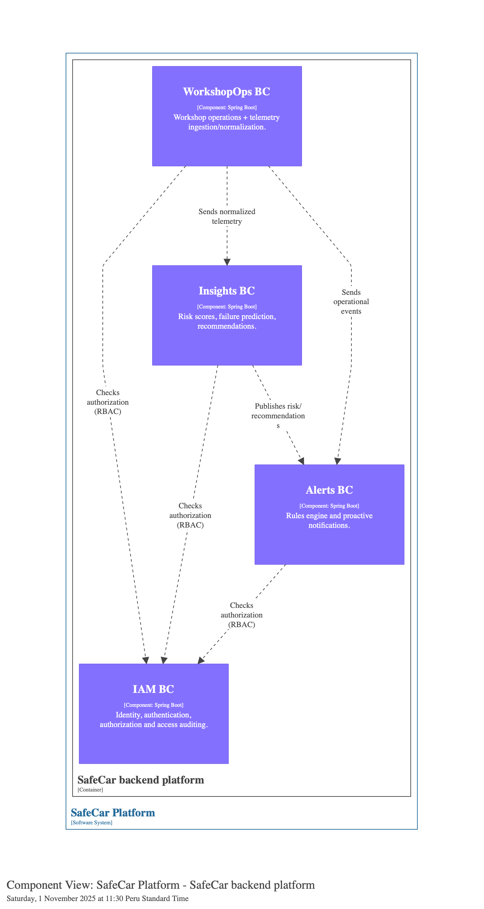

#### 4.2.2.6. Bounded Context Software Architecture Code Level Diagrams

#### 4.2.2.6.1. Bounded Context Domain Layer Class Diagrams

El siguiente diagrama representa el **núcleo de negocio** del *Bounded Context Alerting & Management*, encargado de la **detección, deduplicación y gestión del ciclo de vida de alertas** generadas a partir de los datos de telemetría.
Muestra **agregados**, **entidades**, **objetos de valor**, **servicios de dominio**, **repositorios** y **eventos** que estructuran la lógica de negocio del contexto.

#### Agregado y Entidades

**Alert (Aggregate Root)**
- **Descripción:** Representa una alerta con su ciclo de vida completo (CREATED → ACKNOWLEDGED → RESOLVED).
- **Atributos clave:** `alertId`, `vehicleId`, `ruleId`, `status`, `severity`, `createdAt`, `updatedAt`.
- **Comportamientos:** Cambiar estado, registrar histórico, deduplicar instancias.
- **Relaciones:**
  - Composición con `AlertHistoryEntry` (registra cambios de estado).
  - Asociación con `AlertRule` (define la causa).
  - Usa `SuppressionKey` para deduplicación.

**AlertRule**
- **Descripción:** Define las condiciones bajo las cuales se dispara una alerta.
- **Atributos clave:** `alertRuleId`, `name`, `conditionDefinition`, `severity`, `isActive`.

**AlertHistoryEntry**
- **Descripción:** Registro inmutable del historial de cambios de estado y acciones sobre una alerta.
- **Atributos clave:** `historyId`, `alertId`, `timestamp`, `oldStatus`, `newStatus`, `actionUserId`.


#### Value Objects

Encapsulan identificadores y valores inmutables del dominio:
- `AlertId`
- `AlertRuleId`
- `SuppressionKey` → combina `vehicleId`, `ruleId` y `severity` para prevenir duplicados.
- `AlertStatus` → enum: CREATED | ACKNOWLEDGED | RESOLVED.
- `Severity` → enum: LOW | MEDIUM | HIGH | CRITICAL.

#### Repositorios

Interfaces que definen los puertos de acceso y persistencia:
- `AlertRepository`
  - **Operaciones:** `save(Alert)`, `findById(AlertId)`, `findActiveBySuppressionKey(SuppressionKey)`.
- `AlertRuleRepository`
  - **Operaciones:** `findById(AlertRuleId)`, `findAllActive()`.


##### 4.2.2.6.2. Bounded Context Database Design Diagram

El modelo de base de datos del **Bounded Context Alerting** define las tablas responsables del ciclo de vida de las alertas generadas por las reglas de negocio.
Sus entidades principales son:

- **Alert**: representa una alerta activa o resuelta, con estado, severidad y relación con un vehículo.
- **AlertRule**: define las condiciones y severidad de las reglas que disparan alertas.
- **AlertHistoryEntry**: registra el historial de cambios de estado de cada alerta.
- **SuppressionKey**: evita la duplicación de alertas similares mediante una clave de deduplicación.

Este modelo soporta la trazabilidad y gestión completa de las alertas dentro del sistema.


### 4.2.3. Bounded Context: Analytics and Recommendations

#### 4.2.3.1. Domain Layer

**Propósito del BC**
Calcular riesgo del conductor, predecir fallas probables y generar recomendaciones de mantenimiento, garantizando invariantes y evitando invasión de dominio entre BCs.

<b>A) Agregado y Entidades (diccionario)</b>

- **Aggregate Root: `DriverProfile`**
  **Propósito:** concentrar reglas y estado del conductor (riesgo, predicciones, recomendaciones).
  **Invariantes:**
  - `RiskScore.value ∈ [0, 1]`
  - `PredictionConfidence.value ∈ [0, 1]`
  - `Recommendation` es inmutable.
  **Atributos:**
  - `driverId: UUID`
  - `riskScore: RiskScore`
  - `drivingStats: DrivingStats`
  - `predictions: List<Prediction>`
  - `recommendations: List<Recommendation>`
  **Métodos:**
  - `recalculateRisk(stats: DrivingStats): void`
  - `addPrediction(prediction: Prediction): void`
  - `addRecommendation(recommendation: Recommendation): void`

- **`Prediction`**
  **Propósito:** registrar una falla probable.
  **Atributos:** `id: UUID`, `predictedFault: String`, `confidence: PredictionConfidence`, `timestamp: LocalDateTime`
  **Métodos:** `updateConfidence(newConfidence: PredictionConfidence)`, `discard()`

- **`Recommendation`**
  **Propósito:** acción de mantenimiento sugerida (inmutable).
  **Atributos:** `id: UUID`, `recommendationText: String`, `timestamp: LocalDateTime`

<b>B) Value Objects (records/enums)</b>

- **`RiskScore` (record):** `value: float` (0..1)
- **`DrivingStats` (record):** `avgSpeed: float`, `harshAccelerations: int`, `harshBrakes: int`
- **`PredictionConfidence` (record):** `value: float` (0..1)
- **`RiskBand` (enum):** `LOW`, `MEDIUM`, `HIGH`

<b>C) Servicios de Dominio (interfaces)</b>

- **`RiskCalculator`** → `calculate(stats: DrivingStats): RiskScore`
- **`PredictionEngine`** → `predict(profile: DriverProfile): Prediction`
- **`RecommendationGenerator`** → `generate(profile: DriverProfile, prediction: Prediction): Recommendation`

> Implementaciones concretas fuera del dominio (Application/Infrastructure).

<b>D) Repositorios (puertos del dominio)</b>

- **`DriverProfileRepository`**
  - `save(profile: DriverProfile): DriverProfile`
  - `findByDriverId(driverId: UUID): Optional<DriverProfile>`

- **`PredictionRepository`**
  - `save(prediction: Prediction): Prediction`
  - `findById(id: UUID): Optional<Prediction>`
  - `findAllByDriverId(driverId: UUID): List<Prediction>`

- **`RecommendationRepository`**
  - `save(recommendation: Recommendation): Recommendation`
  - `findAllByDriverId(driverId: UUID): List<Recommendation>`

<b>E) Commands & Queries (records en dominio)</b>

**Commands**
- `CreateDriverProfileCommand(driverId: UUID, initialStats: DrivingStats)`
- `RecalculateRiskCommand(driverId: UUID, stats: DrivingStats)`
- `PredictFailureCommand(driverId: UUID)`
- `UpdatePredictionConfidenceCommand(predictionId: UUID, confidence: PredictionConfidence)`
- `DiscardPredictionCommand(predictionId: UUID)`
- `GenerateRecommendationCommand(driverId: UUID, predictionId: UUID)`

**Queries**
- `GetDriverProfileByDriverIdQuery(driverId: UUID)`
- `GetAllPredictionsByDriverIdQuery(driverId: UUID)`
- `GetAllRecommendationsByDriverIdQuery(driverId: UUID)`

> Las **implementaciones** de orquestación para estos comandos/consultas estarán en *Application* como `*CommandServiceImpl` / `*QueryServiceImpl` (p. ej., `PredictionCommandServiceImpl`), mientras que las **interfaces** de servicios se declaran en `domain/services`.

<b>F) Domain Events </b>

- `DriverRiskRecalculatedEvent` (driverId, oldRisk, newRisk, occurredOn)
- `PredictionCreatedEvent` (predictionId, driverId, occurredOn)
- `RecommendationGeneratedEvent` (recommendationId, driverId, occurredOn)

<b>G) Facade (contrato entre BCs)</b>

- **Interface en dominio:** `ExternalDriverContextFacade`
  **Propósito:** leer datos publicados por otros BCs sin invasión de dominio.
  **Métodos ejemplo:**
  - `fetchLatestDrivingStats(driverId: UUID): DrivingStats`
  - `existsDriver(driverId: UUID): boolean`

> La **implementación** vivirá en *Application/outboundservices/acl* con la nomenclatura: `ExternalDriverContextService` (análoga a tu ejemplo `ExternalProfileService`).

<b>H) Excepciones de Dominio</b>

- `DriverProfileNotFoundException`
- `InvalidRiskScoreException`
- `PredictionNotFoundException`

#### 4.2.3.2. Interface Layer
<b>A) Controladores (REST Controllers)</b>

1) **`DriverProfileController`**
- **Responsabilidad:** endpoints para crear perfil y recalcular riesgo.
- **Dependencias:** `DriverProfileCommandService`, `DriverProfileQueryService`, `DriverProfileResourceFromEntityAssembler`.
- **Rutas:**
  - `POST /api/v1/analytics/driver-profiles` – crear perfil
    - **Request:** `CreateDriverProfileResource`
    - **Command:** `CreateDriverProfileCommand`
    - **Response:** `DriverProfileResource`
  - `PUT /api/v1/analytics/driver-profiles/{driverId}/risk` – recalcular riesgo
    - **Request:** `RecalculateRiskResource`
    - **Command:** `RecalculateRiskCommand`
    - **Response:** `DriverProfileResource`
  - `GET /api/v1/analytics/driver-profiles/{driverId}` – obtener perfil
    - **Query:** `GetDriverProfileByDriverIdQuery`
    - **Response:** `DriverProfileResource`

2) **`PredictionController`**
- **Responsabilidad:** endpoints de gestión de predicciones.
- **Dependencias:** `PredictionCommandService`, `PredictionQueryService`, `PredictionResourceFromEntityAssembler`.
- **Rutas:**
  - `POST /api/v1/analytics/predictions` – predecir falla
    - **Request:** `PredictFailureResource`
    - **Command:** `PredictFailureCommand`
    - **Response:** `PredictionResource`
  - `PATCH /api/v1/analytics/predictions/{predictionId}/confidence` – actualizar confianza
    - **Request:** `UpdatePredictionConfidenceResource`
    - **Command:** `UpdatePredictionConfidenceCommand`
    - **Response:** `PredictionResource`
  - `DELETE /api/v1/analytics/predictions/{predictionId}` – descartar
    - **Command:** `DiscardPredictionCommand`
  - `GET /api/v1/analytics/predictions?driverId={driverId}` – listar por conductor
    - **Query:** `GetAllPredictionsByDriverIdQuery`
    - **Response:** `PredictionSummaryResource[]`

3) **`RecommendationController`**
- **Responsabilidad:** generación y consulta de recomendaciones.
- **Dependencias:** `RecommendationCommandService`, `RecommendationQueryService`, `RecommendationResourceFromEntityAssembler`.
- **Rutas:**
  - `POST /api/v1/analytics/recommendations` – generar recomendación
    - **Request:** `GenerateRecommendationResource`
    - **Command:** `GenerateRecommendationCommand`
    - **Response:** `RecommendationResource`
  - `GET /api/v1/analytics/recommendations?driverId={driverId}` – listar por conductor
    - **Query:** `GetAllRecommendationsByDriverIdQuery`
    - **Response:** `RecommendationResource[]`

---

<b>B) Resources (DTOs de entrada/salida)</b>

Ubicación: `interfaces/resources`

**Requests**
- `CreateDriverProfileResource { driverId: string, initialStats: DrivingStatsResource }`
- `RecalculateRiskResource { stats: DrivingStatsResource }`
- `PredictFailureResource { driverId: string }`
- `UpdatePredictionConfidenceResource { confidence: number }`
- `GenerateRecommendationResource { driverId: string, predictionId: string }`

**Responses**
- `DriverProfileResource { driverId: string, riskScore: number, riskBand: string, drivingStats: DrivingStatsResource, predictions: PredictionSummaryResource[], recommendations: RecommendationResource[] }`
- `PredictionResource { id: string, driverId: string, predictedFault: string, confidence: number, timestamp: string }`
- `PredictionSummaryResource { id: string, predictedFault: string, confidence: number, timestamp: string }`
- `RecommendationResource { id: string, driverId: string, recommendationText: string, timestamp: string }`
- `DrivingStatsResource { avgSpeed: number, harshAccelerations: number, harshBrakes: number }`

> **Validaciones** (Bean Validation):
> `@NotNull`, `@PositiveOrZero`, `@DecimalMin("0.0") @DecimalMax("1.0")` para `confidence` y `riskScore`.

---

<b>C) Assemblers (mapeadores)</b>

Ubicación: `interfaces/transform`

- **`DriverProfileResourceFromEntityAssembler`**
  - `toResource(DriverProfile domain): DriverProfileResource`
  - `toDomain(CreateDriverProfileResource r): CreateDriverProfileCommand`
  - `toDomain(RecalculateRiskResource r, UUID driverId): RecalculateRiskCommand`

- **`PredictionResourceFromEntityAssembler`**
  - `toResource(Prediction domain): PredictionResource`
  - `toDomain(PredictFailureResource r): PredictFailureCommand`
  - `toDomain(UpdatePredictionConfidenceResource r, UUID predictionId): UpdatePredictionConfidenceCommand`

- **`RecommendationResourceFromEntityAssembler`**
  - `toResource(Recommendation domain): RecommendationResource`
  - `toDomain(GenerateRecommendationResource r): GenerateRecommendationCommand`

> Los *Assemblers* son **puentes** entre DTOs y el modelo del dominio (records/commands/queries).
> Los *Controller* **no** construyen entidades/commands manualmente; delegan al *Assembler*.

---

<b>D) Manejo de errores y contrato</b>

- Respuestas de error estandarizadas (`Problem+JSON`):
  - `400` errores de validación.
  - `404` (`DriverProfileNotFoundException`, `PredictionNotFoundException`).
  - `422` reglas de negocio (p. ej., `InvalidRiskScoreException`).
  - `500` errores no controlados.
- Correlación de peticiones: encabezado `X-Request-Id`.
- Versionado de API: prefijo `/api/v1` y *content negotiation* (`application/json`).


#### 4.2.3.3. Application Layer

<b>A) Command Services (implementaciones)</b>

1) **`DriverProfileCommandServiceImpl`** (`application/internal/commandservices`)
- **create(cmd: CreateDriverProfileCommand): DriverProfile**
  1. Verifica existencia de conductor vía `ExternalDriverContextService.existsDriver`.
  2. Construye `DriverProfile` con `initialStats`.
  3. Calcula `riskScore` usando `RiskCalculator`.
  4. `driverProfileRepository.save(..)` y publica `DriverRiskRecalculatedEvent`.
- **recalculateRisk(cmd: RecalculateRiskCommand): RiskScore**
  1. Carga perfil por `driverId`.
  2. Si `stats` es `null`, consulta `ExternalDriverContextService.fetchLatestDrivingStats`.
  3. Invoca `driverProfile.recalculateRisk(stats)` y persiste.
  4. Publica `DriverRiskRecalculatedEvent` y retorna nuevo `RiskScore`.

2) **`PredictionCommandServiceImpl`**
- **predict(cmd: PredictFailureCommand): Prediction**
  1. Carga `DriverProfile`.
  2. Usa `PredictionEngine.predict(profile)`.
  3. `predictionRepository.save(..)`, asocia al perfil y publica `PredictionCreatedEvent`.
- **updateConfidence(cmd: UpdatePredictionConfidenceCommand): Prediction**
  1. Carga predicción; ejecuta `updateConfidence`.
  2. Persiste cambios.
- **discard(cmd: DiscardPredictionCommand): void**
  1. Carga predicción; ejecuta `discard()` y persiste.

3) **`RecommendationCommandServiceImpl`**
- **generate(cmd: GenerateRecommendationCommand): Recommendation**
  1. Carga `DriverProfile` y `Prediction`.
  2. Usa `RecommendationGenerator` (puede delegar a `OpenAiClient` vía infraestructura).
  3. Guarda `Recommendation` en `recommendationRepository`.
  4. Publica `RecommendationGeneratedEvent`.

> **Nota:** los *CommandServiceImpl* dependen de **interfaces de dominio**: `DriverProfileRepository`, `PredictionRepository`, `RecommendationRepository`, `RiskCalculator`, `PredictionEngine`, `RecommendationGenerator` y del **Facade** `ExternalDriverContextFacade` (implementado aquí como ACL).

<b>B) Query Services (implementaciones)</b>

1) **`DriverProfileQueryServiceImpl`**
- **handle(q: GetDriverProfileByDriverIdQuery): Optional<DriverProfile>** → lectura consistente desde `DriverProfileRepository`.

2) **`PredictionQueryServiceImpl`**
- **handle(q: GetAllPredictionsByDriverIdQuery): List<Prediction>**

3) **`RecommendationQueryServiceImpl`**
- **handle(q: GetAllRecommendationsByDriverIdQuery): List<Recommendation>**

> **Optimización opcional:** proyecciones/DTOs de lectura o *read models* si se requiere performance.

<b>C) Event Handlers</b>

Ubicación: `application/internal/eventhandlers`

- **`NotifyHighRiskEventHandler`**
  - **Escucha:** `DriverRiskRecalculatedEvent`
  - **Acción:** si `RiskBand` es `HIGH`, delega a infraestructura (TwilioClient/Email) para notificar.
- **`AutoGenerateRecommendationOnPredictionHandler`**
  - **Escucha:** `PredictionCreatedEvent`
  - **Acción:** invoca `RecommendationCommandService.generate(..)` para crear recomendación automática.
- **`AuditRecommendationGeneratedHandler`**
  - **Escucha:** `RecommendationGeneratedEvent`
  - **Acción:** registra auditoría (tabla/log).

> **Publicación de eventos:** los *CommandServiceImpl* publican eventos de dominio mediante un `DomainEventPublisher` (puerto) con implementación en infraestructura o usando *ApplicationEventPublisher* de Spring.

<b>D) Outbound Services / ACL (Facade entre BCs)</b>

Ubicación: `application/outboundservices/acl`

- **Interface en dominio:** `ExternalDriverContextFacade`
- **Implementación (ACL):** **`ExternalDriverContextService`**
  - **existsDriver(driverId: UUID): boolean** — consulta segura al BC *Driver Engagement* (o IAM) mediante API interna.
  - **fetchLatestDrivingStats(driverId: UUID): DrivingStats** — obtiene agregados de telemetría del BC *Telemetry Processing* sin acoplar modelos (traduce DTO externo → `DrivingStats`).
  - **Manejo de fallos:** *timeouts*, *circuit breaker*, *fallback* (retornar `Optional<DrivingStats>`).

> Esta capa evita invasión de dominio traduciendo contratos externos a **Value Objects** del dominio.

#### 4.2.3.4. Infrastructure Layer

<b>A) Persistencia (JPA / MySQL)</b>

**Entidades JPA (solo para persistencia):**
- `DriverProfileEntity` ↔ tabla `driver_profiles`
- `PredictionEntity` ↔ tabla `predictions`
- `RecommendationEntity` ↔ tabla `recommendations`

**Repositorios Spring Data (infra):**
- `DriverProfileJpaRepository extends JpaRepository<DriverProfileEntity, Long>`
  - `Optional<DriverProfileEntity> findByDriverId(UUID driverId)`
- `PredictionJpaRepository extends JpaRepository<PredictionEntity, Long>`
  - `List<PredictionEntity> findAllByDriverId(UUID driverId)`
- `RecommendationJpaRepository extends JpaRepository<RecommendationEntity, Long>`
  - `List<RecommendationEntity> findAllByDriverId(UUID driverId)`

**Adaptadores que implementan puertos del dominio:**
- `DriverProfileRepositoryImpl implements DriverProfileRepository`
  - Usa `DriverProfileJpaRepository` + *mappers* para convertir **Entity ↔ Aggregate**.
- `PredictionRepositoryImpl implements PredictionRepository`
- `RecommendationRepositoryImpl implements RecommendationRepository`

**Mappers (infra/persistence/mapping):**
- `DriverProfileMapper`
  - `toEntity(DriverProfile)` / `toAggregate(DriverProfileEntity)`
- `PredictionMapper`
- `RecommendationMapper`

**Transaccionalidad y consistencia:**
- Métodos de `*RepositoryImpl` son invocados dentro de transacciones iniciadas en *Application* (`@Transactional`).
- Estrategia de *optimistic locking* opcional vía `@Version` en entidades.

<b>B) Integración con servicios externos</b>

**Cliente OpenAI (infra/external/openai):**
- `OpenAiClientImpl implements OpenAiClient`
  - HTTP con `WebClient` o `RestTemplate`.
  - *Configuración:* `OPENAI_BASE_URL`, `OPENAI_API_KEY` (en `infrastructure/config`).
  - *Resiliencia:* *timeouts*, *retry*, *circuit breaker* (Resilience4j).
  - *Responsabilidad:* construir prompts y mapear respuesta → texto para `RecommendationGenerator`.

**Cliente de notificaciones (opcional para eventos de alto riesgo):**
- `TwilioEmailClientImpl`
  - Enviar correo/SMS cuando lo dispare un *EventHandler*.
  - Variables seguras vía `TWILIO_ACCOUNT_SID`, `TWILIO_TOKEN`.

<b>C) Publicación de eventos</b>

**Adaptador:** `DomainEventPublisherImpl` (infra/events)
- Implementa puerto `DomainEventPublisher` (de aplicación o dominio).
- Usa `ApplicationEventPublisher` (Spring) o una cola si se requiere (ej. RabbitMQ en futuro).
- Serializa eventos (`DriverRiskRecalculatedEvent`, `PredictionCreatedEvent`, `RecommendationGeneratedEvent`) para auditoría.

<b>D) Configuración & migraciones</b>

- **Config:** `OpenAiClientConfig`, `PersistenceConfig` (nombres de paquetes, `JpaRepositories`, `EntityScan`).
- **Migraciones:** `db/migration` (Flyway/Liquibase) con DDL para `driver_profiles`, `predictions`, `recommendations`.
- **Observabilidad:** *logging* con `X-Request-Id`, métricas para `OpenAiClientImpl` (latencia, errores).


#### 4.2.3.5. Bounded Context Software Architecture Component Level Diagrams

<b>A) Componentes y responsabilidades</b>

- **Analytics Facade**
  - **Capa:** Application (coordinación de casos de uso del BC).
  - **Responsabilidad:** Punto de entrada interno del BC; orquesta *CommandServices*/*QueryServices* y centraliza políticas transversales (transacciones, logging, trazas).
  - **Depende de:** `DriverProfileCommandServiceImpl`, `PredictionCommandServiceImpl`, `RecommendationCommandServiceImpl`.

- **Driver Profile Component**
  - **Capa:** Application + Domain
  - **Responsabilidad:** Crear/actualizar `DriverProfile`, recalcular riesgo usando `RiskCalculator`.
  - **Interfaces dominio usadas:** `DriverProfileCommandService`/`DriverProfileQueryService`, `DriverProfileRepository`, `RiskCalculator`.
  - **Infra usada:** `DriverProfileRepositoryImpl` (JPA).

- **Prediction Component**
  - **Capa:** Application + Domain
  - **Responsabilidad:** Ejecutar predicciones con `PredictionEngine`; actualizar confianza; descartar.
  - **Interfaces dominio usadas:** `PredictionCommandService`/`PredictionQueryService`, `PredictionRepository`, `PredictionEngine`.
  - **Infra usada:** `PredictionRepositoryImpl` (JPA).

- **Recommendation Component**
  - **Capa:** Application + Domain
  - **Responsabilidad:** Generar recomendaciones con `RecommendationGenerator` (puede delegar en OpenAI a través del cliente infra).
  - **Interfaces dominio usadas:** `RecommendationCommandService`/`RecommendationQueryService`, `RecommendationRepository`, `RecommendationGenerator`.
  - **Infra usada:** `RecommendationRepositoryImpl` (JPA), `OpenAiClientImpl`.

- **Analytics Repository** *(ver refactor abajo)*
  - **Capa:** Infrastructure (persistencia)
  - **Responsabilidad:** Adaptador de acceso a datos para los agregados del BC.
  - **Tecnología:** Spring Data JPA sobre MySQL.

- **OpenAI Client**
  - **Capa:** Infrastructure (cliente HTTP externo)
  - **Responsabilidad:** Invocar al **OpenAI Service** para generar texto de recomendaciones; resiliencia (timeouts/retry/circuit-breaker).
  - **Tecnología:** Spring WebClient/RestTemplate.

- **(Sugerido) External Driver Context Service (ACL/Facade)**
  - **Capa:** Application/outboundservices/acl
  - **Responsabilidad:** Implementa `ExternalDriverContextFacade` para obtener `DrivingStats` y validar existencia de conductor desde otros BCs sin invadir dominio.
  - **Tecnología:** HTTP client interno/feign.

- **(Sugerido) Domain Event Publisher**
  - **Capa:** Infrastructure (events)
  - **Responsabilidad:** Publicación de `DriverRiskRecalculatedEvent`, `PredictionCreatedEvent`, `RecommendationGeneratedEvent`.
  - **Tecnología:** Spring Application Events (o broker futuro).

- **(Opcional) Twilio Email/SMS Client**
  - **Capa:** Infrastructure (external/notifications)
  - **Responsabilidad:** Enviar notificaciones cuando un *EventHandler* lo requiera.

<b>B) Relaciones (resumen)</b>

- `Analytics Facade → Driver Profile Component | Prediction Component | Recommendation Component`
- `Driver Profile Component → DriverProfileRepository` (→ MySQL)
- `Prediction Component → PredictionRepository` (→ MySQL)
- `Recommendation Component → RecommendationRepository` (→ MySQL)
- `Recommendation Component → OpenAI Client → OpenAI Service`
- `Driver Profile Component → (ACL) External Driver Context Service`
- `*Component → Domain Event Publisher` (publica eventos de dominio)

<b>C) Mapeo a <b>nomenclaturas</b> y <b>paquetes</b></b>

- **Application/internal/commandservices**
  - `DriverProfileCommandServiceImpl`, `PredictionCommandServiceImpl`, `RecommendationCommandServiceImpl`
- **Application/internal/queryservices**
  - `DriverProfileQueryServiceImpl`, `PredictionQueryServiceImpl`, `RecommendationQueryServiceImpl`
- **Application/outboundservices/acl**
  - `ExternalDriverContextService` *(impl de `ExternalDriverContextFacade`)*
- **Interfaces/resources**
  - `CreateDriverProfileResource`, `PredictFailureResource`, `GenerateRecommendationResource`, etc.
- **Interfaces/transform (assemblers)**
  - `DriverProfileResourceFromEntityAssembler`, `PredictionResourceFromEntityAssembler`, `RecommendationResourceFromEntityAssembler`
- **Infrastructure/persistence/jpa**
  - `DriverProfileRepositoryImpl`, `PredictionRepositoryImpl`, `RecommendationRepositoryImpl`
- **Infrastructure/external/openai**
  - `OpenAiClientImpl`
- **Infrastructure/events**
  - `DomainEventPublisherImpl`

<br/>


#### 4.2.3.6. Bounded Context Software Architecture Code Level Diagrams

#### 4.2.3.6.1. Bounded Context Domain Layer Class Diagrams
<p align="justify">
El diagrama modela el núcleo de negocio del BC Analytics & Recommendations dentro del monolito. Muestra entidades/agregado, value objects, interfaces (servicios de dominio, repositorios y façade inter-BC), la enumeración de riesgo y los eventos de dominio, con atributos/métodos y alcance (+ público, − privado), así como direcciones y multiplicidades en las relaciones.
</p>

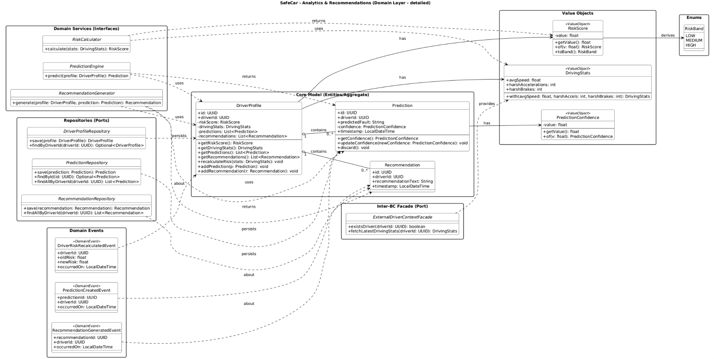

<b>2) Agregado y entidades (Core Model)</b>
- **DriverProfile (Aggregate Root)**
  Representa el estado analítico del conductor. Mantiene las invariantes y la consistencia de su grafo:
  - Atributos clave: `driverId` (+), `riskScore` (−, `RiskScore`), `drivingStats` (−, `DrivingStats`), colecciones (−) de `Prediction` y `Recommendation`.
  - Comportamientos: `recalculateRisk(...)`, `addPrediction(...)`, `addRecommendation(...)`.
  - **Relaciones:**
    - `DriverProfile "1" o-- "0..*" Prediction` y `Recommendation`: composición («contains») porque las vidas de predicciones/recomendaciones dependen del perfil.
    - `DriverProfile --> RiskScore` y `DrivingStats`: asociación de «tiene» («has»).

- **Prediction**
  Describe una **falla probable** estimada.
  - Atributos: `predictedFault` (+), `confidence` (−, `PredictionConfidence`), `timestamp` (+).
  - Métodos: `updateConfidence(newConfidence)`, `discard()`.
  - **Relación:** `Prediction --> PredictionConfidence` («has»).

- **Recommendation**
  Acción de **mantenimiento sugerida** (inmutable en dominio).
  - Atributos: `recommendationText` (+), `timestamp` (+).
  - No expone mutadores de negocio.

<b>3) Value Objects y Enum</b>
- **RiskScore**, **DrivingStats**, **PredictionConfidence** (<<ValueObject>>): encapsulan valores y validaciones de rango/consistencia; exponen `getValue()`/`of(...)` o métodos equivalentes.
- **RiskBand (enum)**: `LOW | MEDIUM | HIGH`.
  - **Relación:** `RiskScore --> RiskBand` («derives») para mapear un puntaje numérico a una banda de riesgo.

<b>4) Servicios de Dominio (Interfaces)</b>
- **RiskCalculator**: `calculate(DrivingStats): RiskScore`. Implementa reglas puras para riesgo.
- **PredictionEngine**: `predict(DriverProfile): Prediction`. Aplica heurísticas/modelos (sin acoplarse a infra).
- **RecommendationGenerator**: `generate(DriverProfile, Prediction): Recommendation`. Orquesta reglas de mantenimiento; su implementación puede delegar fuera del dominio (p. ej., cliente OpenAI en Infraestructura).
- **Relaciones:** flechas **de uso** («uses», «returns») muestran dirección desde el servicio hacia los tipos que consume/produce.

<b>5) Puertos de persistencia (Repositories)</b>
Interfaces **del dominio**:
- `DriverProfileRepository`, `PredictionRepository`, `RecommendationRepository`.
- Métodos públicos (+) especifican las **operaciones permitidas** sobre agregados/entidades.
- **Relaciones:** `Repository ..> Entity` con etiqueta «persists»; la implementación concreta vive en **Infrastructure** (adaptadores JPA) y no se muestra aquí para mantener el dominio **puro**.

<b>6) Façade inter-BC (Puerto)</b>
- **ExternalDriverContextFacade**: contrato para consultar datos de otros bounded contexts sin invadir el modelo (p. ej., `fetchLatestDrivingStats(driverId)`).
- **Relación:** `Facade ..> DrivingStats` («provides»), indicando que entrega VO del dominio; las traducciones DTO-externo → VO ocurren en la **ACL** de *Application*.

<b>7) Eventos de Dominio</b>
- `DriverRiskRecalculatedEvent`, `PredictionCreatedEvent`, `RecommendationGeneratedEvent`.
- **Relaciones «about»** hacia `DriverProfile`, `Prediction` o `Recommendation` dejan claro **sobre qué entidad** versa el evento.
- Se publican desde *Application* (CommandServiceImpl) por un **publisher** de infraestructura; aquí solo se modela el **contrato**.

<b>8) Multiplicidades y calificaciones</b>
- **Composición**: `1 — 0..*` entre `DriverProfile` y `Prediction/Recommendation` para reflejar propiedad y ciclo de vida ligado.
- **Asociaciones dirigidas**: flechas señalan **quién usa a quién** (servicios → tipos, repositorios → entidades, façade → VO).
- **Etiquetas** («contains», «has», «uses», «returns», «persists», «derives», «about») califican la **intención** de cada relación.

<b>9) Visibilidad (scope)</b>
- **Atributos privados (−)** en VO/entidades cuando se requiere invariantes (`RiskScore.value`, `Prediction.confidence`).
- **Operaciones públicas (+)** para comportamiento del agregado/entidades (`recalculateRisk`, `updateConfidence`) y para contratos (`interfaces`).
- Esto comunica explícitamente qué **se puede** y **qué no se puede** modificar desde fuera del agregado.

<b>10) Trazabilidad con las capas</b>
- **Domain**: todo lo mostrado (entidades, VO, repos, servicios, façade, eventos) son **contratos o modelos puros**.
- **Application/Infrastructure**: implementan **cómo** (CommandServiceImpl, RepositoryImpl JPA, OpenAI/Twilio clients, publisher), pero no alteran este modelo.

<b>11) Por qué este diseño cumple DDD en monolito</b>
- **Reglas de negocio** encapsuladas en el agregado/servicios.
- **Dependencias hacia adentro** (UI → Application → Domain) y puertos para infra (repos/façade), manteniendo bajo acoplamiento.
- **Expansión futura**: el monolito puede extraer este BC a un microservicio manteniendo estos **puertos** intactos.

##### 4.2.3.6.2. Bounded Context Database Design Diagram

<b>1) Visión general</b>
<p align="justify">
El esquema relacional define cómo se almacenan los objetos del dominio *Analytics & Recommendations* en **MySQL**. Se ha diseñado para mantener la integridad referencial, permitir consultas eficientes y soportar la evolución del modelo sin comprometer las reglas del dominio.
</p>


<b>2) Tablas principales</b>
- **driver_profiles**
  - Representa la raíz de agregado `DriverProfile`.
  - Atributos clave:
    - `driver_id`: UUID del conductor, único en la tabla.
    - `risk_score`: valor actual de riesgo normalizado.
    - `driving_stats`: columna JSON para métricas agregadas de conducción (flexibilidad ante cambios de atributos).
    - `created_at`, `updated_at`: control de auditoría.
  - **Constraint:** `UNIQUE(driver_id)` asegura que cada conductor tenga un único perfil.

- **predictions**
  - Representa instancias de `Prediction`.
  - Atributos clave:
    - `driver_profile_id`: FK → `driver_profiles.id` para asegurar pertenencia al perfil.
    - `driver_id`: redundancia para acelerar consultas directas por conductor.
    - `predicted_fault`, `confidence`, `timestamp`.
  - **Índices:** combinados en `(driver_id, timestamp)` para consultas de historial en orden temporal.

- **recommendations**
  - Representa instancias de `Recommendation`.
  - Atributos clave:
    - `driver_profile_id`: FK → `driver_profiles.id`.
    - `driver_id`: redundancia para consultas.
    - `recommendation_text`, `timestamp`.
  - **Índices:** similares a `predictions` para optimizar consultas por conductor y fecha.

<b>3) Relaciones y cardinalidades</b>
- **driver_profiles 1 — N predictions**
  Cada perfil puede tener múltiples predicciones asociadas.
- **driver_profiles 1 — N recommendations**
  Cada perfil puede tener múltiples recomendaciones asociadas.
- **Restricciones ON DELETE RESTRICT**
  Evitan eliminar perfiles con predicciones/recomendaciones, garantizando la trazabilidad histórica.

<b>4) Índices y constraints</b>
- **Índices en `driver_id` y `timestamp`** optimizan consultas frecuentes (ej. “todas las predicciones del último mes para un conductor”).
- **Foreign Keys con ON UPDATE CASCADE** aseguran consistencia si cambia el `id` del perfil (raro, pero soportado).
- **Columnas JSON en `driving_stats`** permiten flexibilidad en las métricas sin necesidad de alterar el esquema frecuentemente.

<b>5) Decisiones de diseño</b>
- **Normalización:** entidades principales (`DriverProfile`, `Prediction`, `Recommendation`) en tablas separadas.
- **Desnormalización controlada:** duplicación de `driver_id` en `predictions` y `recommendations` para queries rápidas sin `JOIN`.
- **Escalabilidad:** uso de índices compuestos (`driver_id, timestamp`) y JSON para evitar migraciones disruptivas.
- **Trazabilidad:** no se borran predicciones/recomendaciones automáticamente; se mantiene historial completo.

<b>6) Alineación con el dominio</b>
- Las tablas corresponden directamente a las entidades del dominio.
- Los value objects (`RiskScore`, `DrivingStats`, `PredictionConfidence`) se almacenan como tipos primitivos (`DECIMAL`, `JSON`) en columnas específicas.
- Los eventos de dominio no se materializan en tablas propias, pero pueden ser persistidos en una tabla de **event store** aparte si se requiere.


### 4.2.4. Bounded Context: Subscription & Payments

#### 4.2.4.1. Domain Layer

**Propósito del BC**
Administrar **planes, suscripciones, facturación y pagos** para conductores y talleres; integrar con **pasarela de pagos** e impuestos.

**A) Agregados y Entidades**

- **Aggregate Root: `Plan`**
  `planId`, `name`, `features: Set<FeatureFlag>`, `price: Money`, `billingCycle: BillingCycle (MONTHLY|YEARLY)`, `currency`, `active`.

- **Aggregate Root: `Subscription`**
  `subscriptionId`, `accountId`, `planId`, `status: SubscriptionStatus (ACTIVE|PAST_DUE|CANCELLED)`, `startDate`, `currentPeriodEnd`, `paymentMethodRef`, `trialEndsAt?`.
  **Reglas:** prorrateo al cambiar de plan; no cobrar fuera de ciclo.

- **Aggregate Root: `Invoice`**
  `invoiceId`, `accountId`, `periodStart`, `periodEnd`, `lines: List<InvoiceLine>`, `subtotal: Money`, `taxes: Money`, `total: Money`, `status: InvoiceStatus (OPEN|PAID|VOID|FAILED)`.

- **Entidad: `Payment`**
  `paymentId`, `invoiceId`, `amount: Money`, `provider: PaymentProvider`, `providerRef`, `status: PaymentStatus (PENDING|SUCCEEDED|FAILED|REFUNDED)`.

- **Entidad: `Account`**
  `accountId`, `type (DRIVER|WORKSHOP)`, `email`, `taxId?`, `billingAddress?`.

**B) Value Objects**
`Money`, `Percentage`, `BillingCycle`, `TaxRate`, `Coupon(code, percentOff?)`, `PaymentMethodToken`.

**C) Servicios de Dominio**
- `BillingService` → `generateInvoice(subscriptionId, period): Invoice`
- `ProrationService` → `prorate(oldPlan, newPlan, remainingDays): Money`
- `TaxService` → `applyTaxes(subtotal, country): Money`
- `PaymentProcessor` (puerto) → `charge(invoiceId, amount, token): PaymentResult`

**D) Repositorios (puertos)**
`PlanRepository`, `SubscriptionRepository`, `InvoiceRepository`, `PaymentRepository`, `AccountRepository`.

**E) Commands & Queries**
**Commands:** `CreatePlan`, `CreateSubscription`, `ChangePlan`, `CancelSubscription`, `GenerateInvoice`, `ChargeInvoice`, `RefundPayment`.
**Queries:** `GetActiveSubscriptionByAccount`, `ListInvoicesByAccount`, `GetInvoiceDetails`, `GetPlans`.

**F) Domain Events**
`SubscriptionCreated`, `SubscriptionCancelled`, `InvoiceGenerated`, `PaymentSucceeded`, `PaymentFailed`, `PaymentRefunded`.

**G) Facades**
- `ExternalIAMFacade` → validar identidad/correo.
- **BillingFacade (expuesto a otros BCs):** `openInvoiceFor(workOrderId, amount)` para *Workshop Operations*.

**H) Excepciones**
`InvalidPlanException`, `SubscriptionNotActiveException`, `InvoiceAlreadyPaidException`, `PaymentGatewayException`.


#### 4.2.4.2. Interface Layer

**A) REST Controllers**

1) **`PlansController`**
- `POST /api/v1/billing/plans` → `CreatePlan`
- `GET  /api/v1/billing/plans` → `GetPlans`

2) **`SubscriptionsController`**
- `POST /api/v1/billing/subscriptions` → `CreateSubscription`
- `PUT  /api/v1/billing/subscriptions/{id}/change-plan` → `ChangePlan`
- `DELETE /api/v1/billing/subscriptions/{id}` → `CancelSubscription`
- `GET  /api/v1/billing/subscriptions/active?accountId=` → `GetActiveSubscriptionByAccount`

3) **`InvoicesController`**
- `POST /api/v1/billing/invoices` → `GenerateInvoice`
- `POST /api/v1/billing/invoices/{id}/charge` → `ChargeInvoice`
- `POST /api/v1/billing/invoices/{id}/refund` → `RefundPayment`
- `GET  /api/v1/billing/invoices?accountId=` → `ListInvoicesByAccount`
- `GET  /api/v1/billing/invoices/{id}` → `GetInvoiceDetails`

**B) DTOs**
`PlanResource`, `CreatePlanResource`,
`CreateSubscriptionResource(accountId, planId, paymentMethodToken)`,
`ChangePlanResource(newPlanId)`,
`InvoiceResource(id, total, status, periodStart, periodEnd, lines[])`,
`ChargeInvoiceResource(paymentMethodToken)`.

**C) Assemblers**
`PlanResourceAssembler`, `SubscriptionResourceAssembler`, `InvoiceResourceAssembler`.

**D) Errores (contrato)**
`400` validación, `402` *Payment Required*, `404`, `409` conflictos, `422` reglas (prorrateo/estado).


#### 4.2.4.3. Application Layer

**Command Services**
- `PlanCommandService` → alta/edición de planes.
- `SubscriptionCommandService` → create/change/cancel (incluye prorrateo).
- `InvoicingCommandService` → `generate`, `charge`, `refund` (usa `PaymentProcessor`).

**Query Services**
`SubscriptionQueryService`, `InvoiceQueryService`, `PlanQueryService`.

**Event Handlers**
- `OnWorkOrderCompleted` (desde *Workshop Operations*): `GenerateInvoice(accountId, amount)` y luego `ChargeInvoice`.
- `OnPaymentSucceeded` → marcar factura como `PAID`, emitir recibo.
- `OnPaymentFailed` → marcar `PAST_DUE`, notificar.

**ACL / Outbound**
- `StripePaymentProcessor` o `MercadoPagoPaymentProcessor` (impl de `PaymentProcessor`) con *timeouts/retry/circuit-breaker*.
- (Opc.) `TaxServiceClient`.


#### 4.2.4.4. Infrastructure Layer

**Persistencia (JPA/MySQL)**
- `plans(id, name, price_amount, currency, billing_cycle, active)`
- `accounts(id, type, email, tax_id, billing_address_json)`
- `subscriptions(id, account_id FK, plan_id FK, status, start_date, current_period_end, payment_method_ref, trial_ends_at)`
- `invoices(id, account_id FK, period_start, period_end, subtotal_amount, tax_amount, total_amount, currency, status, created_at)`
- `invoice_lines(id, invoice_id FK, description, quantity, unit_price_amount, currency)`
- `payments(id, invoice_id FK, amount, currency, provider, provider_ref, status, created_at)`
Repos Spring Data + adaptadores `*RepositoryImpl`. Índices: `account_id`, `status`, `created_at`.

**Integraciones**
Cliente `Stripe/MercadoPago`; secretos en vault; (opc.) webhook receiver para `payment_intent.succeeded/failed`.


#### 4.2.4.5. Bounded Context Software Architecture Component Level Diagrams

**Componentes (y responsabilidades):**
- **Plans Component** — catálogo de planes.
- **Subscriptions Component** — altas/cambios/bajas, prorrateo.
- **Invoicing Component** — generación y estado de facturas.
- **Payments Component** — cargos y reembolsos (usa `PaymentProcessor`).
- **Persistence Adapter** — JPA MySQL.
- **Payment Gateway Adapter** — Stripe/MercadoPago (ACL).
- **Billing API** — controladores REST.

##### 4.2.1.6. Bounded Context Software Architecture Code Level Diagrams
- Este diagrama presenta la arquitectura de alto nivel del backend de la plataforma SafeCar, organizada en tres Contextos Delimitados (BC), un patrón común en la arquitectura de Microservicios y Domain-Driven Design (DDD). Los tres componentes están implementados utilizando Spring Boot y están agrupados en un único "Contenedor" llamado "SafeCar backend platform".

- IAM BC (Identity, Authentication, Authorization): Su responsabilidad principal es la gestión de la identidad del usuario, la autenticación, la autorización mediante RBAC (Control de Acceso Basado en Roles) y la auditoría de acceso. Recibe peticiones de autorización del WorkshopOps BC.

- Payments BC: Este componente se encarga de la gestión integral de Planes, Suscripciones y Facturación. Está diseñado para integrarse con Stripe para procesar los pagos. Su flujo requiere consultar al IAM BC para verificar el estado actual de la suscripción de un usuario.

- WorkshopOps BC: Gestiona las operaciones del taller (Workshop operations) y la ingesta y normalización de datos de telemetría. Para funcionar, este servicio consulta al Payments BC para determinar el plan y los límites aplicables al usuario, y también consulta al IAM BC para verificar la autorización (RBAC) necesaria para sus operaciones.

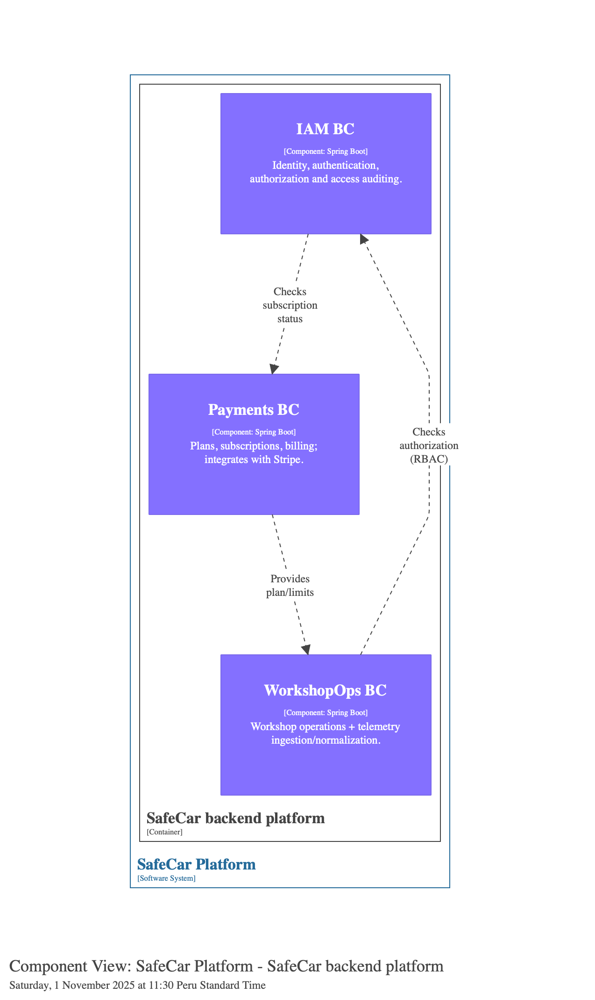

#### 4.2.1.6.1. Bounded Context Domain Layer Class Diagrams
- Este diagrama ilustra el esquema de la base de datos relacional para manejar la información de usuarios, roles y el estado de las suscripciones. El diseño sigue un patrón modular que separa la gestión de la autenticación de la lógica de negocio de las suscripciones.

- Tablas de Autenticación y Autorización: La tabla users almacena la información de autenticación del usuario (id, email, password). La tabla roles define los roles del sistema (name). La relación de muchos a muchos (N:M) entre usuarios y roles se implementa mediante la tabla pivote user_roles, que gestiona el Control de Acceso Basado en Roles (RBAC).

- Tabla de Suscripciones: La tabla subscriptions contiene los detalles de la suscripción de cada usuario. Incluye campos esenciales como user_id (clave foránea), plan_type y status. El campo stripe_subscription_id es crítico, ya que proporciona la referencia externa necesaria para la integración y comunicación con el procesador de pagos Stripe. Las relaciones son: un usuario puede tener muchas suscripciones (1:N), aunque se espera una activa por sistema.

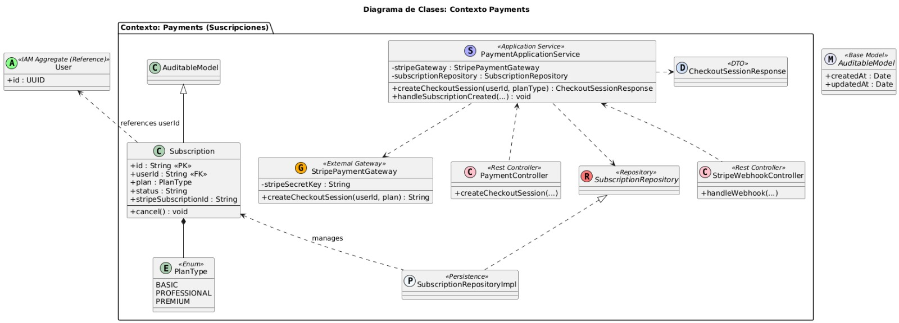


#### 4.2.1.6.2. Bounded Context Database Design Diagram

- Este diagrama UML detalla la estructura interna del componente Payments BC, centrándose en el dominio de las Suscripciones y la interacción con Stripe.

- Dominio y Persistencia: La clase central es Subscription (el Agregado de Dominio), que representa el estado de la suscripción del usuario, incluyendo el plan y la referencia externa a Stripe. El SubscriptionRepository define la interfaz para acceder y almacenar estas entidades, cuya implementación concreta es SubscriptionRepositoryImpl (la capa de persistencia).

- Integración Externa: El componente StripePaymentGateway (un Gateway Externo) encapsula toda la comunicación con la API de Stripe, abstrayendo la lógica externa del resto del sistema.

- Lógica de Negocio y Coordinación: El PaymentApplicationService actúa como el coordinador principal de la lógica de negocio. Utiliza el StripePaymentGateway para iniciar sesiones de pago y el SubscriptionRepository para persistir los cambios.

- Puntos de Entrada (APIs): El PaymentController expone el endpoint REST para que los clientes inicien el proceso de suscripción creando una checkout session. El StripeWebhookController es el punto de entrada asíncrono, manejando las llamadas entrantes (webhooks) de Stripe para actualizar el estado de la suscripción después de que un pago se haya completado o haya fallado. El flujo de pago principal inicia en el PaymentController y termina de forma asíncrona en el StripeWebhookController.

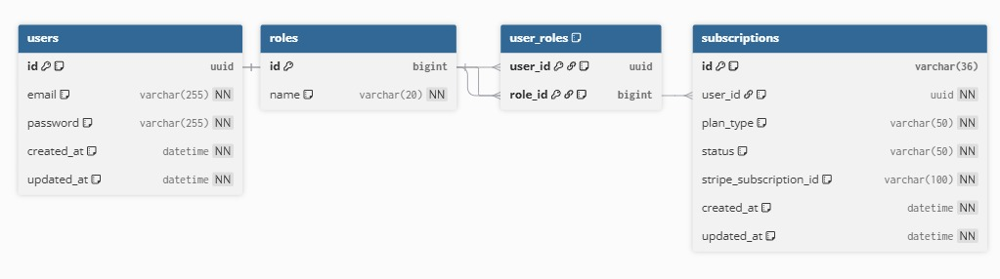


#### 4.2.4.6. Bounded Context Software Architecture Code Level Diagrams

#### 4.2.4.6.1. Bounded Context Domain Layer Class Diagrams

Incluir: `Plan`, `Subscription`, `Invoice` (con `InvoiceLine`), `Payment`, VOs (`Money`, `Percentage`, `BillingCycle`, `TaxRate`), servicios (`BillingService`, `ProrationService`, `TaxService`, `PaymentProcessor`), repos y eventos (`InvoiceGenerated`, `PaymentSucceeded`, `PaymentFailed`).

##### 4.2.4.6.2. Bounded Context Database Design Diagram

Relaciones:
- `accounts 1—N subscriptions`
- `subscriptions 1—N invoices`
- `invoices 1—N invoice_lines`
- `invoices 1—N payments`
Índices por `account_id`, `status`, `(period_start, period_end)`; FKs con `ON UPDATE CASCADE`, `ON DELETE RESTRICT`.

# Capítulo V: Solution UI/UX Design
## 5.1. Style Guidelines
### 5.1.1. General Style Guidelines
Aquí documentaremos las decisiones transversales de la identidad visual y del lenguaje de marca:

<b>Colors</b></br>
<p align="justify">
Para la elección de los colores representativos para los productos, escogimos investigar la reacción que causaría en los usuarios durante el uso de la aplicación o landing page. En este proyecto, se decidió utilizar los colores negro y rojo, con esto creamos la paleta de colores característica de LawConnect. Con estos colores esperamos transmitir un sentido de modernidad y calidez. En este caso, escogimos negro para tener una base sólida, también, transmite un aire de confianza, que es justamente lo que esperamos con hacer por la importancia de la aplicación en la vida de nuestros usuarios; así, también tiene un toque de elegancia y seriedad. Además, utilizamos rojo suave para que transmita energía, algo que llama bastante la atención de los usuarios. Por eso es que será utilizado en las llamadas de acción, botones y puntos clave de la aplicación. En sí, buscamos que haya un balance y armonía visual en el diseño de los productos y lo logramos con ambos colores.
</p>

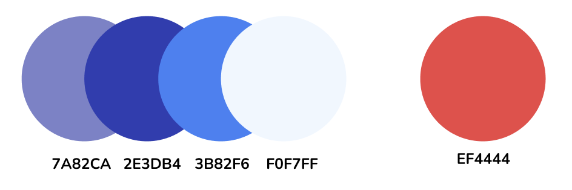

<b>Typography</b></br>
<p align="justify">
Familia(s), jerarquía tipográfica (display, títulos, cuerpos), escala modular y line-height para lectura cómoda.Spacing & Grid: unidad base (4/8 px), columnas y gutters para desktop/tablet/móvil, y reglas de alineación.
</p>
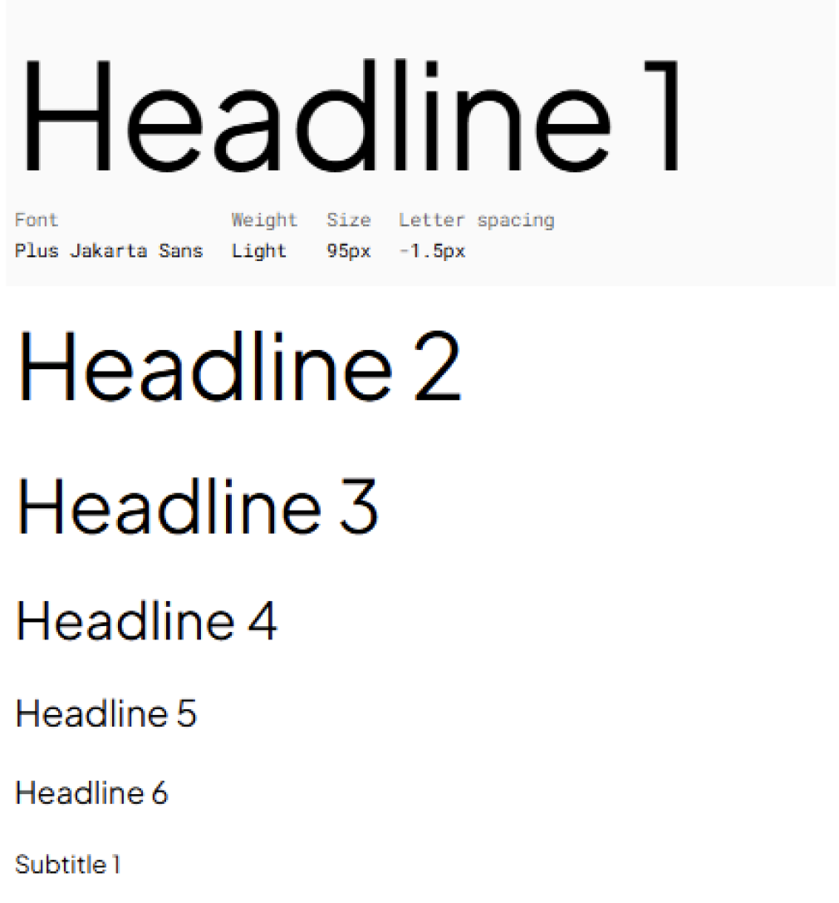

### 5.1.2. Web, Mobile and IoT Style Guidelines

##### **Spacing**

El spacing a utilizar se presentará en los siguientes puntos, estos variarán dependiendo del lenguaje o sistema operativo utilizado.
De esta manera, permitimos que la información se vea ordenada.

##### **Para Landing Page**

- **Button padding:**
  - Vertical: `12px`
  - Horizontal: `24px`

- **Input fields:**
  - Altura: `48px`
  - Espacio entre campos: `16px`

- **Margin entre secciones:** `64px`
- **Height entre textos:** `30px`

##### **Para Android**

- **Button padding:**
  - Vertical: `12dp`
  - Horizontal: `18dp`

- **Input fields:**
  - Altura: `40dp`
  - Espacio entre campos: `16dp`

- **Margin entre secciones:**
  - Principales: `32dp` a `38dp`
  - Internas: `16dp`

- **Spacing entre textos:**
  - Título y subtítulos: `16dp`
  - Párrafos: `12dp`

##### **Para iOS**

- **Button padding:** `12pt` (vertical), `20pt` (horizontal)
- **Input fields:** `56pt` (altura), `16pt` (espacio entre campos)
- **Margin entre secciones:**
  - Principales: `32pt` a `38pt`
  - Internas: `16pt`
- **Spacing entre textos:**
  - Título y subtítulo: `16pt`
  - Párrafos: `12pt`

<b>Dimensions</b></br>
<p align="justify">
Se prefirió usar un tono ligeramente formal, y amigable; pero, de igual manera, se mantiene el respeto hacia los usuarios. Con SafeCar, preferimos utilizar un lenguaje más serio debido a la importancia de los temas que se tratan.
</p>

## 5.2. Information Architecture
### 5.2.1. Organization Systems

##### **Organización Visual**

En SafeCar, se aplicó una **jerarquía visual** que permite a los usuarios —principalmente **conductores particulares** y **mecánicos de taller**— navegar de forma intuitiva y comprender la información según su nivel de prioridad.

El diseño establece una clara distinción entre los elementos informativos y los interactivos, utilizando **tamaños y pesos tipográficos diferentes** para guiar la atención del usuario.
Por ejemplo, los títulos de las secciones principales como *“Panel de Control”*, *“Mis Vehículos”* o *“Órdenes de Servicio”* utilizan un tamaño de letra mayor y color de alto contraste, mientras que los subtítulos o descripciones presentan un estilo más liviano para mantener jerarquía y legibilidad.

Este principio se refuerza con un diseño de **organización secuencial**, que orienta a los conductores a seguir un flujo paso a paso —desde el registro del vehículo hasta la solicitud y confirmación del mantenimiento—, y a los mecánicos a **gestionar eficientemente sus órdenes de trabajo**, desde la verificación inicial hasta el cierre del servicio.
Gracias a esta estructura, la plataforma asegura una **experiencia fluida y predecible** para ambos segmentos.

##### **Esquema de Categorización**

SafeCar adopta un modelo híbrido de categorización que facilita el acceso rápido a la información según el tipo de tarea o perfil de usuario:

- **Alfabético:**
  Utilizado principalmente en los listados de servicios y piezas del vehículo (p. ej., *Aceite*, *Batería*, *Frenos*, *Motor*).
  Esto permite a los mecánicos encontrar rápidamente los componentes específicos que deben revisar o reemplazar, y a los conductores identificar el servicio que necesitan solicitar.

- **Por tópico:**
  Empleado para agrupar información técnica según la categoría del mantenimiento (por ejemplo: *Preventivo*, *Correctivo*, *Diagnóstico*).
  Esta organización facilita al conductor entender la naturaleza del servicio y al mecánico ubicar los procedimientos asociados.

- **Cronológico:**
  Aplicado en la sección *“Historial de Mantenimientos”*, donde las órdenes se presentan desde la más reciente hasta la más antigua.
  Esto permite a los conductores visualizar la evolución del estado de su vehículo y a los mecánicos revisar intervenciones previas antes de ejecutar un nuevo servicio.

- **Por audiencia:**
  Dado que SafeCar atiende a **dos segmentos principales**, se ha personalizado la interfaz y la disposición de la información:
  - **Conductores Particulares:** visualizan recordatorios, próximos servicios, recomendaciones y diagnósticos simplificados en un lenguaje claro y accesible.
  - **Mecánicos de Taller:** acceden a vistas detalladas de órdenes, listas de chequeo, reportes técnicos y métricas de desempeño del vehículo.


### 5.2.2. Labeling Systems

Para el sistema de etiquetas en SafeCar, se estableció una estrategia enfocada en **claridad, consistencia y reconocimiento inmediato**, utilizando íconos y textos breves que permiten a los **conductores particulares** y **mecánicos de taller** comprender rápidamente la función de cada elemento dentro de la interfaz.

##### **Etiquetas para la Landing Page**

En la página principal de SafeCar, se definieron etiquetas cortas y directas que reflejan las secciones clave de la navegación superior (header), alineadas a la arquitectura de información general del sitio:

- "Home"
- "Features" *(Características)*
- "Plans" *(Planes)*
- "Testimonials" *(Testimonios)*
- "Contact" *(Contáctanos)*
- "Free Trial" *(Prueba Gratis)*
- 🌐 Selector de idioma *(ícono de globo terráqueo para alternar entre inglés y español)*

Estas etiquetas buscan mantener una **estructura simple y accesible**, permitiendo que el visitante comprenda la oferta de la plataforma y acceda fácilmente a la aplicación web o móvil.


##### **Etiquetas para la Aplicación Móvil**

En la aplicación móvil de SafeCar, tanto en Android como en iOS, se utilizan etiquetas funcionales y consistentes que acompañan las principales acciones de los usuarios.
El objetivo es mantener una comunicación **breve, directa y contextual**, evitando redundancias y maximizando la comprensión.

- "Guardar" *(para registrar un nuevo mantenimiento o diagnóstico)*
- "Cancelar" *(para descartar o retroceder acciones)*
- "Agendar Servicio" *(creación de cita para mantenimiento o revisión técnica)*
- "Mis Vehículos" *(listado de autos registrados por el conductor)*
- "Historial" *(seguimiento de servicios anteriores)*
- "Revisar Caso" *(consulta de diagnósticos o reparaciones en curso)*
- "Confirmar Servicio" *(acción de aprobación del mecánico o conductor)*
- "Reportar Fallo" *(creación de un nuevo incidente técnico)*

Cada etiqueta fue seleccionada con base en su **frecuencia de uso y contexto funcional**, manteniendo un tono neutral y orientado a la acción, favoreciendo la **rapidez en la toma de decisiones dentro de la aplicación**.

##### **Lineamientos Generales**

- Las etiquetas no deben superar las **dos palabras**.
- Se prioriza el **lenguaje funcional** sobre el técnico.
- Se evita el uso de abreviaturas o jerga especializada.
- El texto se mantiene en **Mayúscula Inicial** para una mejor legibilidad.
- Los íconos se acompañan de texto únicamente cuando la acción no sea evidente.

Este sistema garantiza que las interfaces de SafeCar sean **claras, consistentes y accesibles** para ambos segmentos principales: **conductores** y **mecánicos**, optimizando la comunicación visual y la usabilidad general de la plataforma.

### 5.2.3. SEO Tags and Meta Tags

### **5.2.3. SEO Tags and Meta Tags**

<p>
Para los <b>SEO Tags</b> y <b>Meta Tags</b> se implementaron palabras clave que incrementan la visibilidad de <b>SafeCar</b> en los motores de búsqueda, alineadas a su propuesta de valor: conectar a conductores particulares con mecánicos de taller calificados, optimizando el mantenimiento vehicular mediante tecnología e IoT.
</p>

##### **Landing Page**

```html
<head>
  <meta charset="UTF-8" />
  <meta name="viewport" content="width=device-width, initial-scale=1.0" />
  <title>SafeCar — Mantenimiento Automotriz Inteligente</title>
  <meta
    name="description"
    content="SafeCar conecta conductores con mecánicos de confianza para mantener su vehículo en óptimas condiciones. Agenda, monitorea y gestiona tus mantenimientos desde una sola plataforma."
  />
  <meta
    name="keywords"
    content="mantenimiento automotriz, mecánicos en línea, taller digital, IoT automotriz, diagnóstico vehicular, SafeCar, revisión técnica, plataforma de mantenimiento"
  />
  <meta name="author" content="SafeCar Team" />
  <link href="./src/styles/output.css" rel="stylesheet" />
</head>
```

<p align="justify">
Con estos Tags, la Landing Page de SafeCar mejora su posicionamiento en buscadores (SEO), permitiendo aparecer entre los primeros resultados al buscar servicios relacionados con mantenimiento vehicular, talleres automotrices o diagnósticos digitales.
</p>

### 5.2.4. Searching Systems

<p align="justify">
En esta ocasión, la landing page no contará con una barra de búsqueda, solo tendrá disponibles secciones claras, y botones "call to action" para llevarlos a la aplicación móvil. En el caso de la aplicación móvil, sería en dos perfiles de usuario:
</p>

<ul>
  <li><strong>El mecánico de taller</strong> tendrá la opción de buscar entre las órdenes de servicio asignadas, para encontrarlas con mayor facilidad. Por ejemplo, puede buscar por el nombre del cliente, número de placa del vehículo, o tipo de mantenimiento, y le aparecerán las órdenes relacionadas.</li>
  <li><strong>El conductor particular</strong> tendrá la opción de buscar entre sus vehículos registrados y su historial de mantenimientos. Por ejemplo, si recuerda una palabra clave sobre un servicio anterior o el nombre del taller, inmediatamente aparecerá la lista de resultados filtrados.</li>
</ul>

### 5.2.5. Navigation Systems
<p align="justify">
Para el sistema de navegación hemos preferido mantener una navegación jerárquica para la landing page, en donde "Prueba Gratis" e "Iniciar Sesión" son los principales "call to action"; también, escogimos distintos patrones conocidos de Mobile UI. A continuación se va a explicar cómo será el funcionamiento de cada uno en la aplicación móvil:
</p>

<ul align="justify">
  <li><strong>Content-based Navigation:</strong> Una implementación de este tipo de navegación sería que, a partir de la tarjeta del mecánico de taller, el conductor pueda tocarla y pasar al perfil del mecánico (que cuenta con su información de contacto, servicios ofrecidos y calificaciones); otra situación es cuando el mecánico desea ver más información de una orden de servicio y toca la tarjeta de la misma.</li>

  <li><strong>Morphing Controls:</strong> En este caso, lo usaremos para el botón de "agendar servicio", este pasará a ser el de "guardar servicio" y, finalmente, "confirmar mecánico" (a partir del matchmaking). El botón evoluciona según el estado del proceso de agendamiento.</li>

  <li><strong>"Sticky" Fixed Navigation:</strong> Se considera usar un menú inferior fijo que cuente con botones de "Dashboard", "Mis Vehículos", "Órdenes de Servicio" y "Historial".</li>

  <li><strong>Vertical Navigation:</strong> Usaremos este tipo de navegación para que los usuarios visualicen la lista de vehículos registrados, órdenes de servicio activas y historial de mantenimientos.</li>

  <li><strong>Popovers:</strong> Se utilizarán las ventanas emergentes en distintos casos:
    <ul>
      <li>Asegurarse de si el conductor quiere cancelar la solicitud de servicio.</li>
      <li>Si quiere marcar el servicio como completado, lo cual implicaría que el mantenimiento fue realizado exitosamente.</li>
      <li>Si está seguro de que adjuntó toda la información necesaria del vehículo para el diagnóstico.</li>
      <li>Si está seguro de aceptar o rechazar el mecánico sugerido por la aplicación mediante el sistema de matchmaking.</li>
      <li>Confirmación antes de reportar una falla o problema técnico.</li>
    </ul>
  </li>

  <li><strong>Sidebars:</strong> En este caso, usaremos el "menú hamburguesa", que anida "Mi Perfil", "Configuración", "Soporte Técnico" y "Cerrar Sesión".</li>
</ul>

## 5.3. Landing Page UI Design
La Landing Page de SafeCar busca explicar la propuesta de valor (monitoreo inteligente del vehículo) y conducir a la conversión primaria: CTA en hero (Discover SafeCar) y acceso a contacto.
- Jerarquía visual: encabezado claro, hero con título–subtítulo–CTA, bloques de valor (beneficios), planes con precios, testimonios, contacto, sobre la app y equipo; cierre con footer.

- Trayecto de conversión: cada sección incorpora micro‑CTAs o continuidad hacia Discover SafeCar; el plan intermedio se destaca (principio de asymmetrical emphasis).

- Diseño inclusivo: tipografía legible ≥ 16px en cuerpo, blancos generosos, objetivos táctiles ≥ 44×44 px, lenguaje claro y bilingüe.

- Consistencia con el Design System: grilla base 8 px, espaciados documentados (12/16/24/64), componentes reutilizables (Button, Card, Input, Badge, Navbar), y estados interactivos.

- Responsive first: los bloques se apilan en mobile manteniendo prioridad semántica.

- SEO & semántica: títulos H1/H2 jerárquicos, descripciones claras y meta tags definidos

### 5.3.1. Landing Page Wireframe
## 5.3.1.1 Propósito del wireframe

Estandarizar estructura, jerarquía y recorrido sin distraer con estilo visual. Se usó una paleta gris (fills/strokes) y figuras básicas para imágenes.

## 5.3.1.2 Estructura Desktop

- Header: logotipo, navegación (Home, Features, About the App, Plans, Testimonials, Contact, Team) y selector de idioma

- Hero: contenedor visual 16:9 con overlay; título, subtítulo, CTA primario.

- Benefits: 3 tarjetas simétricas

- About the App: bloque informativo con texto a la izquierda y apoyo visual a la derecha (2 columnas).

- Plans: 3 tarjetas; el plan Premium central se resalta (stroke + sombra) para favorecer la elección.

- Testimonials: cuadrícula 2×2 de reseñas con avatar, nombre y fecha.

- Contact: formulario de 3 campos y botón; identidad de marca a la izquierda.

- Our Team: bloque visual inferior.

- Footer: navegación secundaria, RRSS y T&C.

Principios aplicados (wireframe)

- Jerarquía por tamaño/peso y espaciado;

- Consistencia: patrones de Card/Input/Button;

- Espacio: márgenes de sección ~64 px y baseline 8 px;

- Lectura escaneable: líneas de 60–75 caracteres aprox.;

- Accesibilidad: objetivos mínimos 44×44, foco visible, etiquetas claras.

<p align="center">
  
</p>

## 5.3.1.3 Estructura Mobile

- Navbar simplificada con menú hamburguesa; el CTA principal vive en el hero ("Discover SafeCar").

- Hero apilado (título, copywriting, CTA) con imagen responsiva.

- Benefits: tarjetas a 1 columna; espacios internos 16 px.

- Plans: tarjetas apiladas; el plan sugerido conserva realce (borde/ombreado).

- Testimonials: lista vertical; se prioriza legibilidad (tamaños ≥ 14–16 px).

- Contact: inputs de 48–56 px de alto, separación 16 px; botón prominente.

- Secciones finales apiladas; footer compacto con navegación mínima.

<p align="center">
  
</p>

### 5.3.2. Landing Page Mock-up

## 5.3.2.1 Mock‑up Desktop

Estructura y estilo aplicados:

- Header con logotipo, navegación (Home, Features, About the App, Plans, Testimonials, Contact, Team) y selector.

- Hero con imagen de fondo y overlay; H1 “Drive Smart, Travel Safe”, párrafo descriptivo y botón “Discover SafeCar”.

- Benefits en grilla 3×1 con tarjetas (icono, título, texto), superficies blancas con sombra sutil.

- About the App en layout 2 columnas (texto a la izquierda, imagen a la derecha) para variar el ritmo visual.

- SafeCar Plans con 3 tarjetas (Basic y dos Premium en la maqueta), la central resaltada con borde/acento rojo.

- Customer Testimonials en grilla 2×2 con avatar, nombre, fecha y rating.

- Contact en 2 columnas: identidad de marca a la izquierda; formulario (Name, Email, Message) a la derecha; botón ancho.

- Our Team como bloque visual de cierre.

- Footer con navegación secundaria, RRSS y T&C.

Principios evidenciados:

jerarquía tipográfica clara; consistencia de componentes (Card, Button, Input); espaciado estandarizado (64 px entre secciones); visibilidad; objetivos 44×44.


<p align="center">
  
</p>

## 5.3.2.2 Mock‑up Mobile

Estructura y estilo adaptados:

- Navbar con logo + menú hamburguesa.

- Hero apilado (título, texto,  CTA “Discover SafeCar”) con imagen responsiva.

- Benefits en tarjetas verticales con padding 16 px y borde suave.

- About the App: texto arriba, imagen abajo (orden semántico conservado).

- Plans apilados; el plan central conserva el énfasis (borde/acento); checks legibles ≥14–16 px.

- Testimonials como lista vertical; avatares e íconos reducidos de forma proporcional.

- Contact: inputs de 48–56 px; separación entre campos 16 px; botón de ancho completo.

- Our Team: imagen a una columna con margen superior.

- Footer compacto con enlaces esenciales y RRSS.

Principios evidenciados:

Lectura escaneable, blancos generosos, contenido alineado al container; accesibilidad táctil; orden lógico de tabulación; tipografía con line‑height 1.5.

<p align="center">
  
</p>


## 5.4. Applications UX/UI Design

### 5.4.1. Applications Wireframes
- Estos wireframes presentan la estructura y el flujo de la plataforma de MetaSoft, que busca transformar datos en conocimiento estratégico a través de soluciones web e IoT. Las pantallas están diseñadas para guiar a los usuarios a través de un proceso claro y eficiente, desde el inicio de sesión hasta la gestión detallada de información, cumpliendo con la visión de la startup de generar un impacto positivo y ser un líder en soluciones digitales.

##### Login
- Este wireframe representa la pantalla de inicio de sesión, el punto de entrada a la plataforma. La interfaz es limpia y profesional, con un área destacada a la izquierda para la marca "Tracker Mobility" y su eslogan, reforzando la identidad de la empresa. A la derecha, se encuentra un formulario simple para ingresar el correo electrónico y la contraseña. Incluye opciones para recuperar la contraseña y registrarse, lo que facilita el acceso de usuarios nuevos y recurrentes. El diseño minimalista asegura una experiencia de usuario sin distracciones, enfocada en un rápido acceso.

<p align="center">
  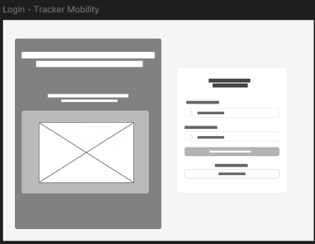
</p>

- El diseño está dividido: la izquierda es un espacio destacado para la marca (identidad), y la derecha contiene el formulario de login (correo y contraseña), junto con opciones para recuperar contraseña y registro.

- Es un diseño limpio y minimalista enfocado en el acceso rápido y eficiente a la plataforma.

##### Register
- La pantalla de registro para SafeCar muestra un formulario dividido en secciones para una inscripción organizada y eficiente. Los campos están agrupados lógicamente en "Información personal" y "Información del vehículo", lo que facilita que el usuario complete la información necesaria de manera secuencial. Este enfoque por bloques reduce la carga cognitiva y hace que el proceso de registro, que puede ser tedioso, se sienta más manejable y directo. El botón de "Completar Registro" al final cierra el proceso.

<p align="center">
  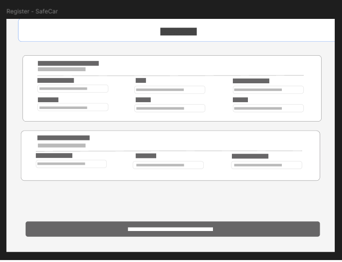
</p>

- Muestra un formulario de registro extenso que está organizado en bloques temáticos (e.g., Información Personal, Información del Vehículo) para ser secuencial y fácil de completar. Termina con el botón "Completar Registro".

##### Dashboard
- Este wireframe muestra el diseño del panel de control o dashboard. Representa el centro de comando de la plataforma, donde los usuarios pueden obtener una visión general y estratégica de sus datos. Aunque la pantalla está vacía en el wireframe, su propósito es ser un espacio dinámico que presentará resúmenes, gráficos y métricas clave. La estructura de navegación lateral (con íconos para "Reportes", "Verificadores", etc.) es constante, lo que garantiza una transición fluida entre las diferentes secciones y reafirma la coherencia de la plataforma.

<p align="center">
  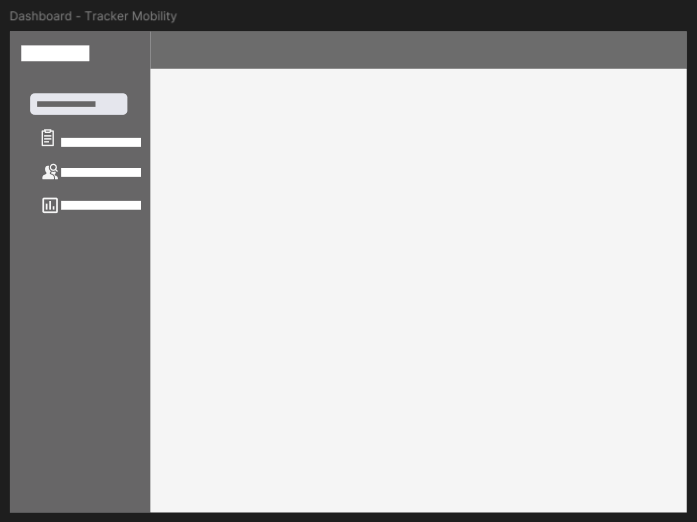
</p>

- Se compone de una barra de navegación lateral con iconos y un gran espacio central vacío reservado para mostrar gráficos, resúmenes y métricas estratégicas. Su objetivo es dar una visión general coherente de los datos.

##### Solicitudes
- La vista de Solicitudes es una interfaz para la gestión y supervisión de peticiones. Presenta una tabla con diversas columnas que permiten a los usuarios ver y gestionar las solicitudes de manera organizada. La funcionalidad de búsqueda, los filtros por fecha y los botones para "Eliminar" y "Exportar" demuestran la capacidad de la plataforma para procesar grandes cantidades de datos de forma eficiente, cumpliendo con la misión de transformar datos en conocimiento útil.

<p align="center">
  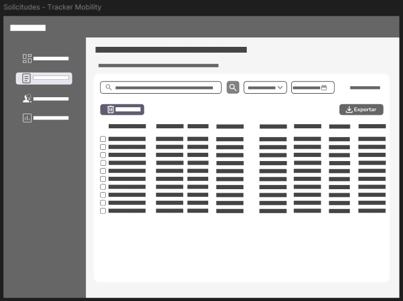
</p>

- El wireframe "Solicitudes - Tracker Mobility" es una interfaz de gestión de peticiones.

- Consiste en una tabla de datos con filtros, búsqueda y opción de exportar, para ver y gestionar solicitudes masivas de forma organizada y eficiente.

##### Detalle de orden
- Este wireframe de Detalle de orden muestra una vista exhaustiva de una solicitud específica. La información se presenta en bloques o tarjetas que detallan desde la información general y la dirección de entrega hasta los documentos adjuntos. El diseño permite un análisis minucioso y la capacidad de editar la información, con campos para texto, fechas y menús desplegables. Este nivel de detalle es clave para la eficiencia operativa, una de las prioridades de la misión de la startup.

<p align="center">
  
</p>

- El wireframe "Detalle de orden - Tracker Mobility" ofrece una vista exhaustiva de una solicitud o pedido específico.

- La información está organizada en bloques o tarjetas lógicas, con campos para texto, fechas y menús desplegables, permitiendo un análisis minucioso y la edición de la información. Su enfoque es la eficiencia operativa.

##### Verificadores
- La sección de Verificadores muestra dos vistas complementarias: una vista de tabla y una vista detallada.

- Vista de tabla: Un listado claro de los verificadores, con capacidad de búsqueda, filtrado y acciones como añadir o eliminar. Esta vista está optimizada para la gestión masiva de personal.

- Vista detallada: Al seleccionar un verificador, se accede a su perfil, que incluye opciones para editar la información y secciones colapsables para datos adicionales. Este diseño se enfoca en la gestión individualizada del personal, lo que potencia la eficiencia de los procesos.

<p align="center">
  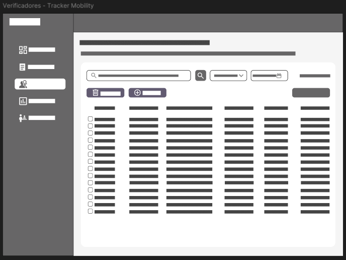
</p>

- El wireframe "Verificadores - Tracker Mobility" presenta la Vista de Tabla, optimizada para la gestión masiva de personal. Incluye una gran tabla con capacidad de búsqueda, filtrado y acciones (añadir, eliminar) para administrar un listado claro de todos los verificadores.


<p align="center">
  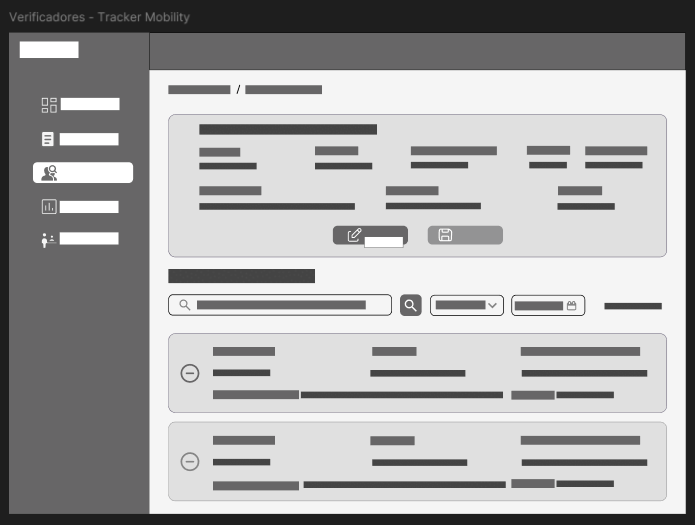
</p>

- Este wireframe muestra la Vista Detallada de un verificador específico. Al seleccionar a alguien de la lista, se accede a su perfil individual. Presenta la información en bloques editables en la parte superior y secciones colapsables con datos adicionales en la parte inferior, enfocándose en la gestión individualizada del personal.


##### Reportes
- La sección de Reportes también se presenta con dos vistas, una general y una detallada, que ilustran la capacidad de la plataforma para manejar y presentar datos complejos.

- Vista de tabla: Es un listado de reportes, similar a las vistas de solicitudes y verificadores, con filtros y botones de acción. Facilita la navegación rápida y la gestión de múltiples reportes.

- Vista detallada: Un wireframe complejo y extenso que muestra la información completa de un reporte. Con múltiples secciones para texto, tablas y espacios para imágenes, esta pantalla es el núcleo de la promesa de MetaSoft de transformar datos en conocimiento, permitiendo un análisis profundo y la toma de decisiones informada.

<p align="center">
  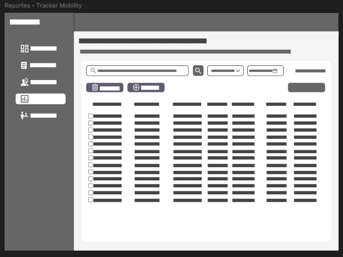
</p>

- El wireframe "Reportes - Tracker Mobility" muestra la Vista de Listado principal. Es una interfaz de gestión tabular con filtros, búsqueda y botones de acción (como añadir o ver detalles), diseñada para visualizar y administrar de forma masiva y eficiente todos los reportes generados.

<p align="center">
  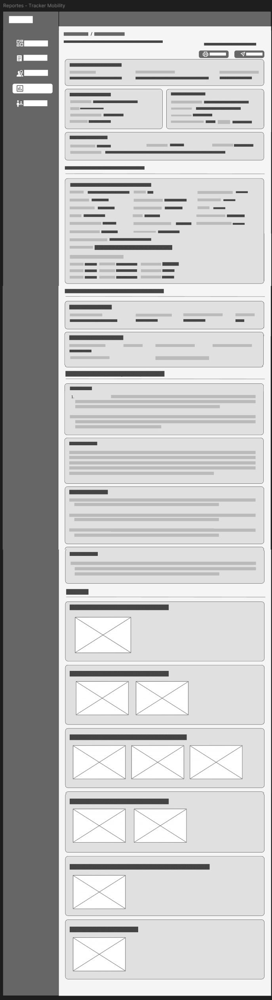
</p>

- Este wireframe de Reporte muestra una vista de detalle muy extensa y vertical. La información está segmentada en numerosos bloques y secciones que contienen texto, campos, y grandes espacios reservados para imágenes o gráficos (indicados con las "X"). Esta vista permite un análisis exhaustivo y minucioso de un reporte individual.

### 5.4.2. Applications Wireflow Diagrams

Los diagramas de Wireflow elaborados para SafeCar muestran de forma visual cómo se conectan las distintas pantallas de la aplicación, combinando el diseño de la interfaz con el recorrido de navegación del usuario. Estos flujos ilustran las principales acciones que realizan tanto los conductores como los talleres, permitiendo evaluar la usabilidad del sistema y garantizar una experiencia coherente e intuitiva en todo momento.

<div align="center" style="margin-top: 20px;">
</div>

 **Wireflow – Taller mecanico (Web)**

El diagrama de wireflow para el segmento de talleres mecánicos en SafeCar representa de manera detallada el flujo de interacción del usuario desde el proceso de inicio de sesión o registro hasta la gestión de sus operaciones dentro del sistema. Este recorrido comienza cuando el mecánico accede a la plataforma, donde puede iniciar sesión con sus credenciales o, en caso de ser un nuevo usuario, crear una cuenta específica para talleres afiliados. Una vez registrado, el sistema lo redirige automáticamente al tablero principal (dashboard).

<div align="center" style="margin-top: 20px;"></div>

Desde este tablero, el usuario visualiza una interfaz central que agrupa las herramientas esenciales para la gestión diaria del taller, divididas en tres módulos principales: Solicitudes, Reportes y Verificadores.


<div align="center" style="margin-top: 20px;"></div>

En la sección Solicitudes, el mecánico accede a una lista organizada de las citas solicitadas por los conductores, incluyendo información clave como nombre del cliente, tipo de servicio, modelo y color del vehículo, fecha y hora de la cita, además del estado actual de la solicitud. Desde esta pantalla también puede aceptar, reprogramar o rechazar citas según la disponibilidad del taller.

<div align="center" style="margin-top: 20px;">  </div>

En el módulo de Reportes, el usuario puede revisar el historial de mantenimientos y diagnósticos realizados, generar nuevos reportes técnicos o actualizar los ya existentes. Este apartado está diseñado para optimizar el seguimiento de los trabajos efectuados y permitir la trazabilidad de los servicios ofrecidos, mejorando la transparencia con los clientes.

<div align="center" style="margin-top: 20px;"> </div>

Por último, la sección de Verificadores integra los datos enviados por los dispositivos IoT, mostrando métricas en tiempo real sobre el estado de los vehículos. Aquí, el mecánico puede validar las lecturas del sistema, registrar observaciones o crear alertas preventivas que se enviarán directamente al conductor.

<div align="center" style="margin-top: 20px;">
</div>

 **Wireflow – Conductor (Web)**

El diagrama de wireflow para el segmento de conductores en SafeCar, al igual que en el caso de los talleres mecánicos, incluye el flujo completo desde el inicio de sesión o registro hasta la gestión de las principales funciones del sistema. El recorrido comienza cuando el conductor accede a la plataforma, donde puede ingresar con sus credenciales o crear una cuenta personal si es un nuevo usuario. Una vez autenticado, el sistema lo dirige automáticamente a su panel principal (dashboard), donde se centralizan las herramientas clave para la gestión de su vehículo y el seguimiento de mantenimientos.

<div align="center" style="margin-top: 20px;">
</div>

### 5.4.3. Applications Mock-ups

#### Web Application Mock-ups
Cada uno de los siguientes prototipos resalta los aspectos esenciales de la interacción con el usuario y los componentes del diseño de la interfaz, con especial atención al diseño inclusivo y a la organización de la información. El sistema de diseño se ha implementado de forma uniforme en todas las pantallas para garantizar una experiencia de usuario coherente.


#### Pantalla de Login

<p align="center">
  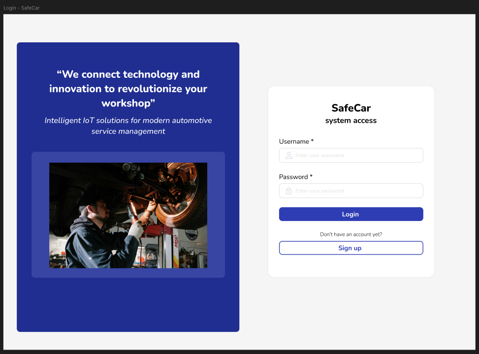
</p>

Interfaz de acceso al sistema SafeCar, dividida en dos secciones:
- Panel izquierdo: muestra un mensaje motivacional e imagen alusiva al entorno automotriz, reforzando la identidad del sistema.
- Panel derecho: contiene el formulario de inicio de sesión con campos claros y botones destacados para Login y Sign up.

El diseño utiliza una paleta azul y blanca, enfocada en la claridad, accesibilidad y profesionalismo, ofreciendo una experiencia de usuario limpia y moderna.


#### Pantalla de Registro de Taller

<p align="center">
  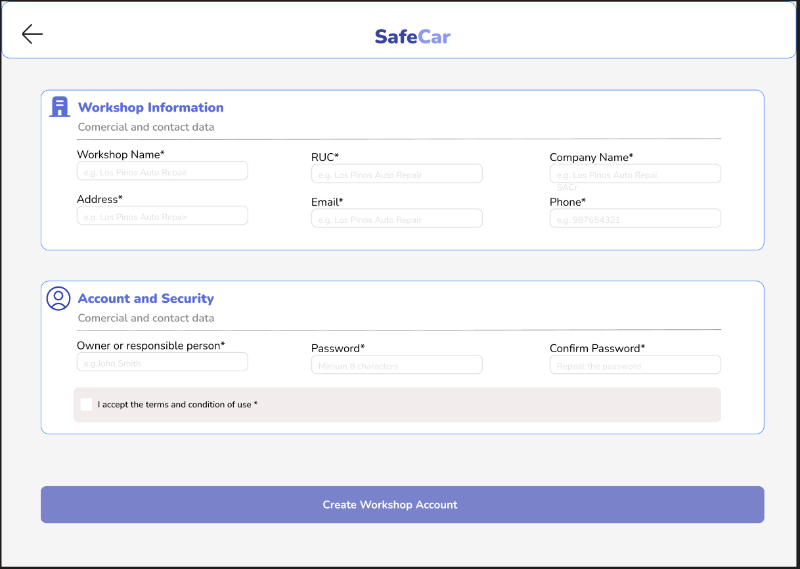
</p>

Formulario de registro para crear una cuenta de taller en SafeCar.
Incluye secciones diferenciadas para información comercial y de seguridad, con campos claros para datos como nombre del taller, RUC, dirección, correo y teléfono.

El diseño mantiene una estructura limpia y ordenada, utilizando tonos azules y grises suaves para guiar la vista y destacar el botón principal de acción "Create Workshop Account".


#### Pantalla de Gestión de Solicitudes de Servicio

<p align="center">
  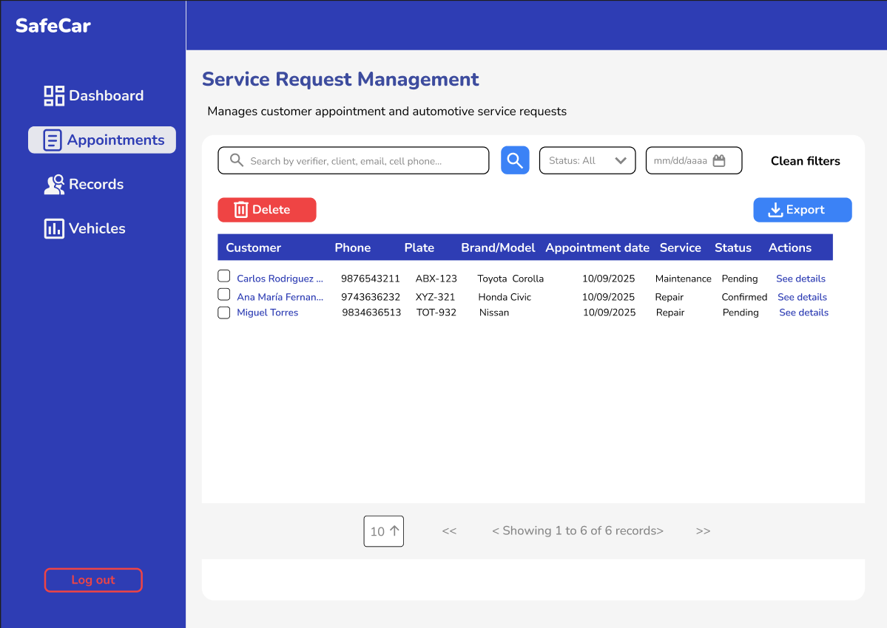
</p>

Interfaz que permite administrar citas y solicitudes de servicio automotriz de los clientes.
Presenta una tabla con información clave como nombre, teléfono, placa, marca, tipo de servicio y estado.

Incluye funciones de búsqueda, filtrado, eliminación y exportación de datos, además de un menú lateral con accesos rápidos.
El diseño prioriza la organización y legibilidad mediante el uso de tonos azules, botones contrastantes y jerarquía visual clara.


#### Pantalla de Historial de Servicios

<p align="center">
  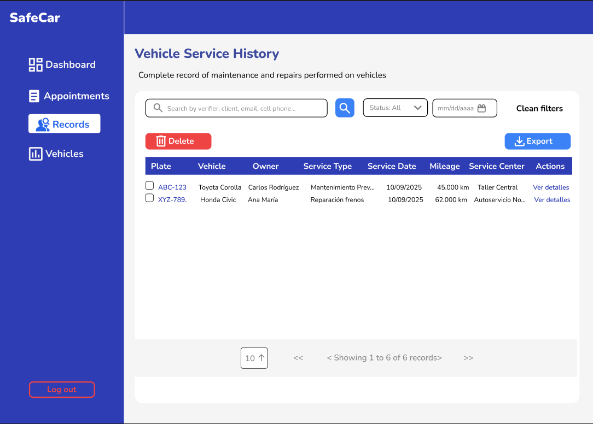
</p>

Muestra el registro completo de mantenimientos y reparaciones realizados a los vehículos.
Incluye una tabla con datos como placa, modelo, propietario, tipo de servicio, fecha, kilometraje y taller.

Cuenta con funciones de búsqueda, filtrado y exportación, permitiendo una gestión eficiente del historial.
El diseño mantiene coherencia visual con el resto del sistema mediante el uso de tonos azules, íconos y botones consistentes.


#### Pantalla de Detalle de Cita

<p align="center">
  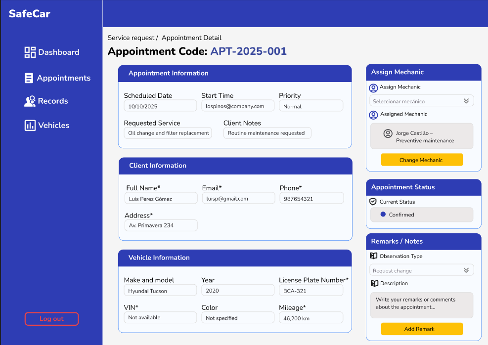
</p>

Permite visualizar y gestionar la información completa de una solicitud de servicio.
Muestra datos del cliente, vehículo y servicio solicitado, junto con el estado de la cita y el mecánico asignado.

Incluye campos para observaciones y opciones para cambiar el técnico responsable.
El diseño utiliza tarjetas organizadas y colores contrastantes para resaltar secciones clave, manteniendo la coherencia visual del sistema SafeCar.


### 5.4.4. Applications User Flow Diagrams

## **5.5. Applications Prototyping**

####  Web Application Prototyping


El prototipo web de SafeCar fue desarrollado en Figma con el propósito de validar la navegación, la organización de los elementos y la experiencia del usuario dentro del sistema.
La interfaz se diseñó con un enfoque funcional y minimalista, facilitando el acceso a las principales secciones: gestión de talleres, solicitudes de servicio, reportes y vehículos.

El flujo de navegación permite al usuario desplazarse de forma fluida entre las distintas pantallas, manteniendo una estructura clara y coherente.
Se empleó una paleta de colores basada en tonos azules y blancos, que transmite profesionalismo y resalta las acciones principales.

**Criterios de diseño e interacción:**
- Navegación lateral fija con accesos directos a los módulos del sistema.
- Formularios bien estructurados y mensajes claros para las acciones del usuario.
- Consistencia visual en todos los componentes de la interfaz.
- Priorización de la legibilidad y simplicidad en cada pantalla.

**Simulación de navegación:**
El prototipo muestra los principales flujos de la aplicación, incluyendo:
- Inicio de sesión y registro de talleres.
- Gestión de citas y solicitudes de servicio.
- Asignación de mecánicos y actualización de estados.
- Visualización del historial de servicios y vehículos.

El uso de Figma permitió validar la estructura de navegación y el diseño visual antes de la implementación final del sistema web.

<p align="center">
  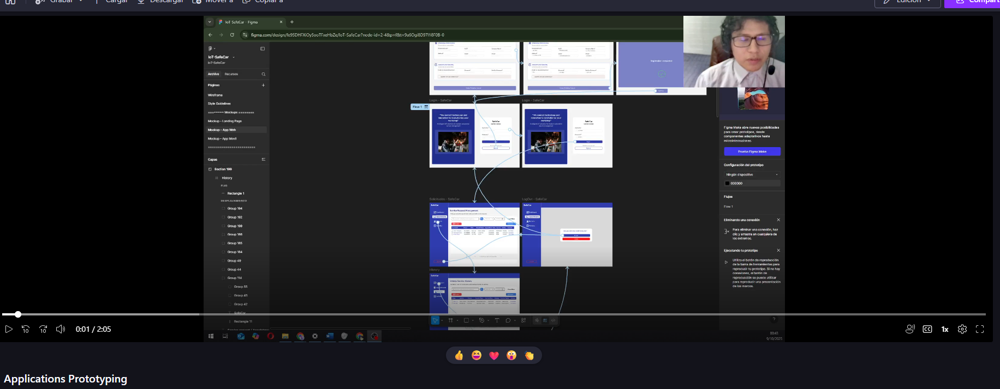
</p>

Link: [Prototipo Web App](https://upcedupe-my.sharepoint.com/:v:/g/personal/u202124162_upc_edu_pe/Ee1cZiLNP_dJjL1prSmIih4B1u6ixglswnGvMM2Vo6pt6g?e=NhgeQJ&nav=eyJyZWZlcnJhbEluZm8iOnsicmVmZXJyYWxBcHAiOiJTdHJlYW1XZWJBcHAiLCJyZWZlcnJhbFZpZXciOiJTaGFyZURpYWxvZy1MaW5rIiwicmVmZXJyYWxBcHBQbGF0Zm9ybSI6IldlYiIsInJlZmVycmFsTW9kZSI6InZpZXcifX0%3D)


# Capítulo VI: Product Implementation, Validation & Deployment

## 6.1. Software Configuration Management

<p align="justify">
En esta sección el equipo MetaSoft establece las decisiones y convenciones fundamentales que permitirán mantener la consistencia durante todo el ciclo de vida del proyecto SafeCar. Se definen los estándares para la gestión del código fuente, configuración del entorno de desarrollo y despliegue de la solución, asegurando que todos los miembros del equipo trabajen bajo las mismas especificaciones y buenas prácticas de la industria.
</p>

### 6.1.1. Software Development Environment Configuration

<p align="justify">
En esta sección el equipo especifica, describe e indica los nombres de productos, el propósito de uso en el proyecto, la ruta de referencia (para software basado en modelos SaaS) o ruta de descarga (para productos que se ejecutan en el computador del miembro del equipo) de cada uno de los productos de software que deben utilizar los miembros del equipo para colaborar en el ciclo de vida de los productos digitales que forman la solución SafeCar. Se consideran todas las actividades de Project Management, Requirements Management, Product UX/UI Design, Software Development, Software Deployment y Software Documentation.
</p>

A continuación se detalla el **entorno de desarrollo** para SafeCar, indicando producto, propósito y ruta de acceso (SaaS o descarga). Todo el equipo debe instalar/usar estas herramientas para garantizar consistencia.

<table width="100%">
  <thead>
    <tr>
      <th>Categoría</th>
      <th>Producto</th>
      <th>Propósito en el proyecto</th>
      <th>Tipo</th>
      <th>Ruta de referencia / Descarga</th>
    </tr>
  </thead>
  <tbody>
    <tr>
      <td>Project Management</td>
      <td>Trello</td>
      <td>Gestión de backlog, Sprints, board Kanban, Definition of Done</td>
      <td>SaaS</td>
      <td><a href="https://trello.com/" target="_blank" rel="noopener noreferrer">https://trello.com/</a></td>
    </tr>
    <tr>
      <td>Requirements</td>
      <td>Google Docs / Sheets</td>
      <td>Redacción de requisitos, matrices, trazabilidad</td>
      <td>SaaS</td>
      <td><a href="https://docs.google.com/" target="_blank" rel="noopener noreferrer">https://docs.google.com/</a></td>
    </tr>
    <tr>
      <td>UX/UI Design</td>
      <td>Figma</td>
      <td>Wireframes, mockups, prototipos, handoff</td>
      <td>SaaS</td>
      <td><a href="https://www.figma.com/" target="_blank" rel="noopener noreferrer">https://www.figma.com/</a></td>
    </tr>
    <tr>
      <td>Repos &amp; CI</td>
      <td>GitHub</td>
      <td>Repositorios, PRs, Issues</td>
      <td>SaaS</td>
      <td><a href="https://github.com/" target="_blank" rel="noopener noreferrer">https://github.com/</a></td>
    </tr>
    <tr>
      <td>Editor</td>
      <td>Visual Studio Code</td>
      <td>Editor principal (HTML, JS, Tailwind, Vue)</td>
      <td>Desktop</td>
      <td><a href="https://code.visualstudio.com/" target="_blank" rel="noopener noreferrer">https://code.visualstudio.com/</a></td>
    </tr>
    <tr>
      <td>API Testing</td>
      <td>Postman</td>
      <td>Colecciones para pruebas de endpoints</td>
      <td>Desktop/SaaS</td>
      <td><a href="https://www.postman.com/" target="_blank" rel="noopener noreferrer">https://www.postman.com/</a></td>
    </tr>
    <tr>
      <td>Frontend Tooling</td>
      <td>Node.js (LTS) &amp; npm</td>
      <td>Construcción, scripts, Vue CLI, Vite</td>
      <td>Desktop</td>
      <td><a href="https://nodejs.org/" target="_blank" rel="noopener noreferrer">https://nodejs.org/</a></td>
    </tr>
    <tr>
      <td>CSS Framework</td>
      <td>Tailwind CSS</td>
      <td>Estilos utility-first de la Landing Page y WebApp</td>
      <td>NPM</td>
      <td><a href="https://tailwindcss.com/" target="_blank" rel="noopener noreferrer">https://tailwindcss.com/</a></td>
    </tr>
    <tr>
      <td>Navegadores</td>
      <td>Chrome / Edge</td>
      <td>Pruebas y DevTools</td>
      <td>Desktop</td>
      <td><a href="https://www.google.com/chrome/" target="_blank" rel="noopener noreferrer">https://www.google.com/chrome/</a></td>
    </tr>
    <tr>
      <td>Software Documentation</td>
      <td>Markdown</td>
      <td>Documentación técnica, README, guías de contribución</td>
      <td>Texto plano</td>
      <td><a href="https://daringfireball.net/projects/markdown/" target="_blank" rel="noopener noreferrer">https://daringfireball.net/projects/markdown/</a></td>
    </tr>
    <tr>
      <td>Comunicación</td>
      <td>Google Meet</td>
      <td>Reuniones de sincronización</td>
      <td>SaaS</td>
      <td><a href="https://meet.google.com/" target="_blank" rel="noopener noreferrer">https://meet.google.com/</a></td>
    </tr>
  </tbody>
</table>

**Extensiones VS Code recomendadas**: ESLint, Prettier, Tailwind CSS IntelliSense, Vue Language Features (Volar), GitHub Pull Requests & Issues.

### 6.1.2. Source Code Management

<p align="justify">
En esta sección el equipo establece los medios y esquema de organización que aplicará para el seguimiento de modificaciones utilizando GitHub como plataforma y sistema de control de versiones. Se incluyen los URLs de los repositorios para cada producto: Landing Page, Web Services y Frontend Web Applications. Cada repositorio contiene el código fuente del proyecto y la documentación técnica correspondiente.
</p>

Los repositorios de código fuente del proyecto SafeCar se encuentran organizados en la organización GitHub **MetaSoft‑IoT**:

<table width="100%">
  <thead>
    <tr>
      <th>Producto</th>
      <th>Tecnologías</th>
      <th>Repositorio GitHub</th>
    </tr>
  </thead>
  <tbody>
    <tr>
      <td>Landing Page</td>
      <td>HTML + Tailwind CSS</td>
      <td><a href="https://github.com/MetaSoft-IOT/safecar-landing-page" target="_blank" rel="noopener noreferrer">upc-pre-202520-1asi0572-3479-MetaSoft-Landing</a></td>
    </tr>
    <tr>
      <td>Backend</td>
      <td>Spring Boot + Java</td>
      <td><a href="https://github.com/MetaSoft-IOT/safecar-backend" target="_blank" rel="noopener noreferrer">upc-pre-202520-1asi0572-3479-MetaSoft-Backend</a></td>
    </tr>
    <tr>
      <td>Web Application</td>
      <td>Vue.js + JavaScript</td>
      <td><a href="https://github.com/MetaSoft-IOT/upc-1asi0572-2520-3479-iot-safecar-web-application-frontend" target="_blank" rel="noopener noreferrer">upc-pre-202520-1asi0572-3479-MetaSoft-WebApp</a></td>
    </tr>
  </tbody>
</table>

> **Nota (Sprint 1):** Durante el **primer sprint** todo el trabajo se realizó **directamente en `main`** (hotfixes incluidos), con revisiones por PR y QA manual, a fin de acelerar el baseline (landing + skeleton web). A partir del **Sprint 2** se activará **GitFlow completo** para aislar desarrollo y lanzamientos.

**Implementación de GitFlow Workflow**

El equipo implementa GitFlow como workflow de control de versiones siguiendo el modelo de Vincent Driessen:

- **Ramas principales**: 
  - `main` (producción): Contiene el código estable y listo para producción
  - `develop` (integración): Rama de desarrollo donde se integran todas las features

- **Ramas de soporte**: 
  - `feature/<scope-resumen>`: Para desarrollo de nuevas funcionalidades
  - `release/<version>`: Para preparación de nuevas versiones
  - `hotfix/<ticket|short>`: Para correcciones urgentes en producción

- **Convenciones de nombres**:
  - Features: `feature/i18n-toggle`, `feature/navbar-accessibility`, `feature/user-authentication`
  - Releases: `release/1.1.0`, `release/2.0.0`
  - Hotfixes: `hotfix/fix-lang-selector-null`, `hotfix/security-patch`

**Reglas de PR**
- Base: `develop` (o `main` solo para `hotfix/*`).
- Requisitos: build OK, lint OK, ≥1 reviewer, squash & merge.
- Commits: seguir **Conventional Commits**.

**Versionado semántico (SemVer)**
- Formato: `MAJOR.MINOR.PATCH` (ej.: `v1.0.0`).
- Tag en Git: cada release estable en `main` debe etiquetarse (`v1.0.0`).

**Conventional Commits (ejemplos)**
```
feat(i18n): add language toggle button in header
fix(nav): prevent anchor jump on mobile menu toggle
docs(readme): add deployment steps for GitHub Pages
refactor(ui): extract card component for pricing plans
chore(ci): add actions/setup-node to build workflow
```

### 6.1.3. Source Code Style Guide & Coding Conventions

<p align="justify">
En esta sección el equipo explica e indica las referencias que adoptará para nombrar elementos y programar en los lenguajes utilizados en la solución SafeCar (HTML, CSS, JavaScript, TypeScript, Java, así como Gherkin para los archivos .feature). Para todos los lenguajes se aplica la nomenclatura en inglés, adoptando convenciones estándares para coding que garanticen la legibilidad, mantenibilidad y consistencia del código a lo largo del proyecto.
</p>

**Idioma**: todo el **código, nombres y comentarios** en **inglés**.

**HTML**
- Semántico (`<header>`, `<nav>`, `<section>`, `<footer>`), indentación 2 espacios.
- Atributos de accesibilidad: `alt`, `aria-*`, `role` cuando aplique.
- Clases en **kebab-case**.

**CSS – TailwindCSS**
- Enfoque **utility‑first**; evitar CSS custom excepto tokens globales.
- Orden sugerido en atributos de clase: display/layout → spacing → sizing → typography → color → effects → responsive.
- Reutilización vía **component classes** o `@apply` solo si es necesario.

**JavaScript (ES6+)**
- `const`/`let`, arrow functions, template literals; evitar variables globales.
- **Naming**: camelCase para funciones/variables; PascalCase para constructores.
- Guía: [Google JavaScript Style Guide].

**JavaScript / Vue**
- Guía: [Vue 3 Style Guide]. Nombres de archivos en kebab-case: `user-profile.vue`.
- Componentes en PascalCase; Options API utilizada; validación de props con PropTypes cuando sea necesario.

**Java / Spring Boot**
- Guía: [Google Java Style Guide]. Paquetes en `lowercase`, clases en PascalCase.
- Capas: `api` (controllers), `application`, `domain`, `infrastructure` (Clean Architecture/DDD alineado a bounded contexts).

**Gherkin (.feature)**
- Estructura: `Feature`, `Scenario`, `Given/When/Then`; pasos en inglés, claros y testables.

**Lint & Format**
- **ESLint + Prettier** para JS; hooks con **Husky** (pre-commit: `lint --fix` y `format`).

_Referencias:_ HTML Style Guide and Coding Conventions; Google HTML/CSS Style Guide; Vue 3 Style Guide; Google Java Style Guide; Google JavaScript Style Guide; Spring Boot Features; Gherkin Conventions for Readable Specifications.

### 6.1.4. Software Deployment Configuration

<p align="justify">
En esta sección el equipo especifica la configuración del despliegue de la solución SafeCar, incluyendo los pasos necesarios para que, a partir de los repositorios de código fuente, se pueda lograr el despliegue o publicación satisfactorio de cada uno de los productos digitales en la solución (Landing Page, Web Services, Web Applications). La estrategia de despliegue garantiza la disponibilidad, escalabilidad y mantenibilidad de todos los componentes del sistema.
</p>

**Landing Page (GitHub Pages)**
1) `main` actualizado con `/dist` (según build local) o con fuentes estáticas.
2) En **Settings → Pages**: Source = `Deploy from a branch` utilizando rama `main`.
3) **Despliegue**: archivos estáticos se publican automáticamente desde la rama principal.
4) Verificación: URL pública activa + chequeo de recursos (`/assets/*`).

**Web Application Vue (configuración para despliegue futuro)**
- **Estrategia**: contenedores Docker con despliegue manual gestionado.
- **Build**: `npm run build` (Vite) → `docker build -t safecar-web:$(git rev-parse --short HEAD) .`
- **Env (placeholders)**: `VITE_API_BASE_URL`, `VITE_AUTH_ISSUER`, `VITE_SENTRY_DSN`.
- **Staging**: deploy automático al hacer merge a `develop`.
- **Producción**: release desde `release/*` → tag SemVer → deploy a `main`.

**Web Services (Spring Boot)**
- **Estrategia**: contenedores Docker + deployment en cloud provider.
- **Build**: `mvn clean package` → `docker build -t safecar-api:$(git rev-parse --short HEAD) .`
- **Env**: `SPRING_PROFILES_ACTIVE`, `DATABASE_URL`, `JWT_SECRET`.

**Checklist de despliegue (general)**
- [ ] Variables de entorno definidas y almacenadas como **GitHub Secrets**.
- [ ] Pipeline con jobs: `build` → `security-scan` → `deploy`.
- [ ] Verificación tras el deploy (status 200, assets, i18n, navegación básica).

> **Nota**: La Landing Page utiliza **TailwindCSS** y está **desplegada en GitHub Pages**. La aplicación web Vue utiliza **Vite** como build tool y **Options API** para la estructura de componentes. Los Web Services Spring Boot siguen arquitectura de capas con controladores REST. La configuración completa se implementará según los entornos definidos.

## 6.2. Landing Page, Services & Applications Implementation

### 6.2.1. Sprint 1
#### 6.2.1.1. Sprint Planning 1

<p align="justify">
El Sprint 1 marca el inicio del proceso de desarrollo del proyecto, estableciendo las bases fundamentales y los flujos de trabajo del equipo. Durante este primer ciclo se valida la arquitectura propuesta y se implementan las funcionalidades core que servirán como cimiento para las iteraciones posteriores del desarrollo.
</p>

<table width="100%">
    <tr>
        <th>Sprint #</th>
        <th>Sprint 1</th>
    </tr>
    <tr>
        <td colspan="2">Sprint Planning Background</td>
        <td></td>
    </tr>
    <tr>
        <td>Date</td>
        <td>2025-09-16</td>
    </tr>
    <tr>
        <td>Time</td>
        <td>08:38 AM</td>
    </tr>
    <tr>
        <td>Location</td>
        <td>
        La reunión fue llevada a cabo de manera virtual mediante la plataforma de Google Meet
        </td>
    </tr>
    <tr>
        <td>Prepared By</td>
        <td>
        Zavala Quedena, Gonzalo Andre
        </td>
    </tr>
    <tr>
        <td>Attendees (to planning meeting)</td>
        <td>
        Saldaña Vela, Janover Gonzalo / Holguin Gamarra, Hardie Alfonso / Mendoza Solis, Javier Kenyi / Aguirre Rodríguez, Gustavo Jandroel / Irigoyen Matos, Javier Sharvel / Zavala Quedena, Gonzalo Andre / Burga Loarte, Anaely Zarely
        </td>
    </tr>
    <tr>
      <td>Sprint - Review Summary</td>
      <td align="justify">
          Este es el primer Sprint del proyecto, por lo que no existe un Sprint anterior para revisar. El equipo se encuentra en la fase inicial de desarrollo, estableciendo las bases del producto y definiendo los procesos de trabajo colaborativo.
      </td>
    </tr>
    <tr>
      <td>Sprint - Retrospective Summary</td>
      <td align="justify">
        Al ser el primer Sprint del proyecto, no existe una retrospectiva previa para analizar. Sin embargo, el equipo estableció los fundamentos para futuras retrospectivas: se acordó implementar reuniones de retrospectiva al final de cada sprint, se definieron los canales de comunicación para feedback continuo, y se establecieron las métricas básicas de seguimiento. El equipo también acordó las herramientas de colaboración (GitHub, Google Meet, Trello) y las prácticas de desarrollo que servirán como baseline para evaluar mejoras en sprints posteriores.
      </td>
    </tr>
    <tr>
        <td colspan="2">Sprint Goal & User Stories</td>
        <td></td>
    </tr>
    <tr>
        <td>Sprint 1 Goal</td>
        <td align="justify">
        Nuestro enfoque está en ofrecer una primera versión completamente funcional del entorno visual e interactivo de SafeCar, que incluye la landing page y los principales módulos de la aplicación web: historial de servicio, solicitud de servicio mecánico, e interfaces de inicio de sesión y registro. 
        <br><br>
        Creemos que esto permite validar la experiencia integral del usuario (conductores y mecánicos de taller) y la coherencia de los flujos principales del sistema, incluso utilizando datos simulados mientras se desarrolla la integración con el backend.
        <br><br>
        Esto se confirmará cuando los usuarios puedan navegar por la landing page, registrarse o iniciar sesión, y gestionar solicitudes e historiales de servicio con una interacción fluida y coherente en el entorno de pruebas.
        </td>
    </tr>
    <tr>
       <td>Sprint 1 Velocity</td>
        <td align="justify">
        Se establece una velocidad inicial de 23 Story Points, correspondiente a la capacidad total comprometida por el equipo durante la planificación del Sprint 1. Esta métrica servirá como referencia base para medir el rendimiento y ajustar la capacidad del equipo en los siguientes Sprints.
        </td>
    </tr>
    <tr>
        <td>Sum of Story Points</td>
        <td>23</td>
    </tr>
</table>


#### 6.2.1.2. Aspect Leaders and Collaborators

<p align="justify">
Durante el Sprint 1, el equipo organizó el trabajo en ocho aspectos principales que abarcan el desarrollo de la Landing Page y las funcionalidades core de la aplicación web. La matriz de liderazgo y colaboración (LACX) define claramente las responsabilidades de cada miembro, designando líderes (L) y colaboradores (C) para cada aspecto, facilitando la coordinación efectiva del trabajo durante el sprint.
</p>

<table width="100%">
    <tr>
        <th>Team Member (Last Name, First Name)</th>
        <th>GitHub Username</th>
        <th>A1 – Landing Navigation & CTA (L) / Collaborator (C)</th>
        <th>A2 – Internationalization & Locale (L) / Collaborator (C)</th>
        <th>A3 – Pricing Plans & Accessibility (L) / Collaborator (C)</th>
        <th>A4 – Social Links & Footer (L) / Collaborator (C)</th>
        <th>A5 – Responsive Design (L) / Collaborator (C)</th>
        <th>A6 – Security & Identity Management (L) / Collaborator (C)</th>
        <th>A7 – Service History Management (L) / Collaborator (C)</th>
        <th>A8 – Service Request Management (L) / Collaborator (C)</th>
    </tr>
    <tr>
        <td>Janover Gonzalo Saldaña Vela</td>
        <td>JanoverSaldana</td>
        <td>-</td>
        <td>-</td>
        <td>-</td>
        <td>-</td>
        <td>-</td>
        <td>A6 – Security & Identity Management (L)</td>
        <td>A7 – Service History Management (L)</td>
        <td>A8 – Service Request Management (L)</td>
    </tr>
    <tr>
        <td>Hardie Alfonso Holguin Gamarra</td>
        <td>HOLGUINUPC</td>
        <td>A1 – Landing Navigation & CTA (C)</td>
        <td>A2 – Internationalization & Locale (C)</td>
        <td>A3 – Pricing Plans & Accessibility (C)</td>
        <td>-</td>
        <td>A5 – Responsive Design (C)</td>
        <td>A6 – Security & Identity Management (C)</td>
        <td>-</td>
        <td>-</td>
    </tr>
    <tr>
        <td>Javier Kenyi Mendoza Solis</td>
        <td>Kenyi-Mendoza-Solis</td>
        <td>A1 – Landing Navigation & CTA (C)</td>
        <td>A2 – Internationalization & Locale (C)</td>
        <td>-</td>
        <td>-</td>
        <td>A5 – Responsive Design (C)</td>
        <td>A6 – Security & Identity Management (C)</td>
        <td>-</td>
        <td>-</td>
    </tr>
    <tr>
        <td>Gustavo Jandroel Aguirre Rodríguez</td>
        <td>Jandroel</td>
        <td>A1 – Landing Navigation & CTA (C)</td>
        <td>-</td>
        <td>A3 – Pricing Plans & Accessibility (C)</td>
        <td>A4 – Social Links & Footer (L)</td>
        <td>A5 – Responsive Design (C)</td>
        <td>-</td>
        <td>-</td>
        <td>-</td>
    </tr>
    <tr>
        <td>Javier Sharvel Irigoyen Matos</td>
        <td>sharvel-irigoyen</td>
        <td>A1 – Landing Navigation & CTA (C)</td>
        <td>A2 – Internationalization & Locale (C)</td>
        <td>-</td>
        <td>A4 – Social Links & Footer (C)</td>
        <td>-</td>
        <td>A6 – Security & Identity Management (C)</td>
        <td>-</td>
        <td>-</td>
    </tr>
    <tr>
        <td>Gonzalo Andre Zavala Quedena</td>
        <td>GonzaloQu3dena</td>
        <td>A1 – Landing Navigation & CTA (L)</td>
        <td>A2 – Internationalization & Locale (L)</td>
        <td>A3 – Pricing Plans & Accessibility (L)</td>
        <td>-</td>
        <td>A5 – Responsive Design (L)</td>
        <td>-</td>
        <td>-</td>
        <td>-</td>
    </tr>
    <tr>
        <td>Anaely Zarely Burga Loarte</td>
        <td>userxx1000</td>
        <td>A1 – Landing Navigation & CTA (C)</td>
        <td>A2 – Internationalization & Locale (C)</td>
        <td>A3 – Pricing Plans & Accessibility (C)</td>
        <td>A4 – Social Links & Footer (C)</td>
        <td>-</td>
        <td>-</td>
        <td>-</td>
        <td>-</td>
    </tr>
</table>

#### 6.2.1.3. Sprint Backlog 1

<p align="justify">
En esta sección se presenta el Sprint Backlog definido para el primer sprint, detallando las historias de usuario seleccionadas y el desglose de tareas técnicas necesarias para su implementación, junto con las asignaciones y estimaciones correspondientes.
</p>

<table width="100%">
    <tr>
        <th colspan="2">Sprint #</th>
        <th colspan="6">Sprint 1</th>
    </tr>
    <tr>
        <td colspan="2">User Story</td>
        <td colspan="6">Work-Item / Task</td>
    </tr>
    <tr>
        <td>Id</td>
        <td>Title</td>
        <td>Id</td>
        <td>Title</td>
        <td>Description</td>
        <td>Estimation (Hours)</td>
        <td>Assigned To</td>
        <td>Status (To-do / In-Process / To-Review / Done)</td>
    </tr>
    <tr>
        <td rowspan="6">US101</td>
        <td rowspan="6">Como visitante deseo desplazarme entre las secciones de la landing page para encontrar la información sobre de SafeCar de forma rápida</td>
        <td>T1</td>
        <td rowspan="6">Navegación mediante el navbar de la Landing Page</td>
        <td>
            Implementar navbar opciones de redirección a las secciones (home, features, plans, testimonials y contact) de la Landing Page
        </td>
        <td>1</td>
        <td>Gonzalo Quedena</td>
        <td>Done</td>
    </tr>
    <tr>
        <td>T2</td>
        <td>
            Redirección a sección "Features" desde el navbar de la Landing Page
        </td>
        <td>1</td>
        <td>Gonzalo Quedena</td>
        <td>Done</td>
    </tr>
    <tr>
        <td>T3</td>
        <td>
           Redirección a sección "Hero" al hacer click en opción "home" desde el navbar de la Landing Page
        </td>
        <td>1</td>
        <td>Gonzalo Quedena</td>
        <td>Done</td>
    </tr>
    <tr>
        <td>T4</td>
        <td>
            Redirección a sección "Testimonials" al hacer click en la opción "testimonials"  desde el navbar de la Landing Page
        </td>
        <td>1</td>
        <td>Gonzalo Quedena</td>
        <td>Done</td>
    </tr>
    <tr>
        <td>T5</td>
        <td>
            Redirección a sección "Contact" al hacer click en la opción "contact" desde el navbar de la Landing Page
        </td>
        <td>1</td>
        <td>Gonzalo Quedena</td>
        <td>Done</td>
    </tr>
    <tr>
        <td>T6</td>
        <td>
            Redirección a sección "Plans" al hacer click en la opción "plans" desde el navbar de la Landing Page
        </td>
        <td>1</td>
        <td>Gonzalo Quedena</td>
        <td>Done</td>
    </tr>
    <tr>
        <td rowspan="2">US102</td>
        <td rowspan="2">Como visitante deseo un acceso visible hacia la aplicación para continuar con el uso del servicio cuando lo decida</td>
        <td>T7</td>
        <td rowspan="2">Implementación del botón call-to-action de la Landing Page</td>
        <td>
            Implementar UI del botón call-to-action en sección Hero de Landing Page
        </td>
        <td>1</td>
        <td>Gonzalo Quedena</td>
        <td>Done</td>
    </tr>
    <tr>
        <td>T8</td>
        <td>
            Implementación de la redirección del botón call-to-action en la Landing Page
        </td>
        <td>1</td>
        <td>Gonzalo Quedena</td>
        <td>Done</td>
    </tr>
    <tr>
        <td rowspan="5">US103</td>
        <td rowspan="5">Como visitante deseo cambiar el idioma de la página para leer la información en el idioma que prefiera</td>
        <td>T9</td>
        <td rowspan="5">Soporte de internacionalización de la Landing Page</td>
        <td>
            Configurar archivo de internacionalización (i18n) para la Landing Page con texto en idioma Español
        </td>
        <td>1</td>
        <td>Gonzalo Quedena</td>
        <td>Done</td>
    </tr>
    <tr>
        <td>T10</td>
        <td>
            Configurar archivo de internacionalización (i18n) para la Landing Page con texto en idioma Inglés
        </td>
        <td>1</td>
        <td>Gonzalo Quedena</td>
        <td>Done</td>
    </tr>
    <tr>
        <td>T11</td>
        <td>
            Guardar la preferencia de idioma (en localStorage o cookies) para mantener persistencia en la Landing Page
        </td>
        <td>1</td>
        <td>Gonzalo Quedena</td>
        <td>Done</td>
    </tr>
    <tr>
        <td>T12</td>
        <td>
            Implementar selector de idioma para posterior (i18n)
        </td>
        <td>1</td>
        <td>Gonzalo Quedena</td>
        <td>Done</td>
    </tr>
    <tr>
        <td>T13</td>
        <td>
           Implementación de internacionalización (i18n)
        </td>
        <td>1</td>
        <td>Gonzalo Quedena</td>
        <td>Done</td>
    </tr>
    <tr>
        <td rowspan="7">US104</td>
        <td rowspan="7">Como visitante deseo ver claramente los planes y precios de SafeCar para evaluar cuál se ajusta mejor a mis necesidades</td>
        <td>T14</td>
        <td rowspan="7">Accesibilidad a Planes de la Landing Page</td>
        <td>
            Implementar UI de sección de Planes con plan Estándar en Landing Page
        </td>
        <td>1</td>
        <td>Gonzalo Quedena</td>
        <td>Done</td>
    </tr>
    <tr>
        <td>T15</td>
        <td>
           Implementar UI de sección de Planes con plan Premium en Landing Page
        </td>
        <td>1</td>
        <td>Gonzalo Quedena</td>
        <td>Done</td>
    </tr>
    <tr>
        <td>T16</td>
        <td>
          Implementar UI de sección de Planes con plan Básico en Landing Page
        </td>
        <td>1</td>
        <td>Gonzalo Quedena</td>
        <td>Done</td>
    </tr>
    <tr>
        <td>T17</td>
        <td>
           Implementar accesibilidad de secciones de la Landing Page mediante etiquetas alternativas.
        </td>
        <td>1</td>
        <td>Gonzalo Quedena</td>
        <td>Done</td>
    </tr>
    <tr>
        <td>T18</td>
        <td>
           Implementar accesibilidad de secciones de la Landing Page mediante lectura por lectores de pantalla
        </td>
        <td>1</td>
        <td>Gonzalo Quedena</td>
        <td>Done</td>
    </tr>
    <tr>
        <td>T19</td>
        <td>
            Redireccionar al proceso de compra luego de click en "Select" de algún plan mostrado en sección "Plans" de la Landing Page
        </td>
        <td>1</td>
        <td>Gonzalo Quedena</td>
        <td>Done</td>
    </tr>
    <tr>
        <td>T20</td>
        <td>
            Botones por plan "Select" en la UI de la Landing page
        </td>
        <td>1</td>
        <td>Gonzalo Quedena</td>
        <td>Done</td>
    </tr>
    <tr>
        <td rowspan="2">US109</td>
        <td rowspan="2">Como visitante deseo acceder a las redes sociales oficiales desde el pie de página para seguir las novedades de SafeCar</td>
        <td>T21</td>
        <td rowspan="2">Accesibilidad redes sociales de SafeCar desde Landing Page</td>
        <td>
            Implementar redirección a las redes oficiales de SafeCar (Facebook, Instagram,  X)
        </td>
        <td>1</td>
        <td>Gonzalo Quedena</td>
        <td>Done</td>
    </tr>
    <tr>
        <td>T22</td>
        <td>
            Implementar redirección de redes sociales en una nueva pestaña
        </td>
        <td>1</td>
        <td>Gonzalo Quedena</td>
        <td>Done</td>
    </tr>
    <tr>
        <td rowspan="2">US110</td>
        <td rowspan="2">Como visitante deseo que la página se vea bien en cualquier dispositivo para acceder cómodamente desde cualquier lugar</td>
        <td>T23</td>
        <td rowspan="2">Responsividad de la Landing Page</td>
        <td>
            Implementación responsive de la Landing Page
        </td>
        <td>2</td>
        <td>Gonzalo Quedena</td>
        <td>Done</td>
    </tr>
    <tr>
        <td>T24</td>
        <td>
            Implementación responsive de la aplicación web
        </td>
        <td>2</td>
        <td>Gonzalo Quedena</td>
        <td>Done</td>
    </tr>
    <tr>
        <td rowspan="6">US201</td>
        <td rowspan="6">Como usuario registrado deseo iniciar sesión con mis credenciales para acceder a mis datos y funcionalidades</td>
        <td>T25</td>
        <td rowspan="6">Inicio de sesión de usuario en la Aplicación Web</td>
        <td>
           UI para el SignIn del usuario con los campos (email + password)
        </td>
        <td>2</td>
        <td>Janover Saldaña</td>
        <td>Done</td>
    </tr>
    <tr>
        <td>T26</td>
        <td>
           Mostrar mensaje de éxito (Datos correctamente ingresados) en UI de SignIn de la Aplicación Web
        </td>
        <td>2</td>
        <td>Janover Saldaña</td>
        <td>Done</td>
    </tr>
    <tr>
        <td>T27</td>
        <td>
           Redireccionar UI "Home" de la Aplicación Web luego del SignIn del usuario
        </td>
        <td>1</td>
        <td>Janover Saldaña</td>
        <td>Done</td>
    </tr>
    <tr>
        <td>T28</td>
        <td>
           Mostrar mensaje de error (Contraseña inválida del usuario existente) en UI de SignIn de la Aplicación Web
        </td>
        <td>2</td>
        <td>Janover Saldaña</td>
        <td>Done</td>
    </tr>
    <tr>
        <td>T29</td>
        <td>
           Servidor valida credenciales de email y contraseña para SignIn
        </td>
        <td>2</td>
        <td>Gonzalo Quedena</td>
        <td>Done</td>
    </tr>
    <tr>
        <td>T30</td>
        <td>
           Mostrar mensaje de error (Usuario no registrado con ese correo) en UI de SignIn
        </td>
        <td>2</td>
        <td>Janover Saldaña</td>
        <td>Done</td>
    </tr>
    <tr>
        <td rowspan="9">US202</td>
        <td rowspan="9">Como nuevo usuario deseo registrarme con mis datos básicos para crear una cuenta en SafeCar y comenzar a usar el sistema</td>
        <td>T31</td>
        <td rowspan="9">Registro de usuario en la Aplicación Web</td>
        <td>
           UI para el SignUp de usuario  (Nombres, Apellidos, Correo, Teléfono, Contraseña)
        </td>
        <td>3</td>
        <td>Janover Saldaña</td>
        <td>Done</td>
    </tr>
    <tr>
        <td>T32</td>
        <td>
           Mostrar mensajes de error de validación de los campos nombre, apellidos, teléfono
        </td>
        <td>2</td>
        <td>Janover Saldaña</td>
        <td>Done</td>
    </tr>
    <tr>
        <td>T33</td>
        <td>
           Mostrar mensajes de error (email existente / formato inválido) en UI para SignUp
        </td>
        <td>2</td>
        <td>Janover Saldaña</td>
        <td>Done</td>
    </tr>
    <tr>
        <td>T34</td>
        <td>
           Mostrar mensajes de error (Requerimientos de contraseña inválida) en UI de SignUp
        </td>
        <td>2</td>
        <td>Janover Saldaña</td>
        <td>Done</td>
    </tr>
    <tr>
        <td>T35</td>
        <td>
           Servidor valida campo nombre y apellido que solo sean caracteres y máximo 50 caracteres cada uno
        </td>
        <td>2</td>
        <td>Gonzalo Quedena</td>
        <td>Done</td>
    </tr>
    <tr>
        <td>T36</td>
        <td>
           Mostrar mensaje de éxito al registrarse (Se registró correctamente) y redirección a SignIn
        </td>
        <td>2</td>
        <td>Janover Saldaña</td>
        <td>Done</td>
    </tr>
     <tr>
        <td>T37</td>
        <td>
           Servidor valida contraseña de usuario segura (+8 caracteres, >= 1 simbolo)
        </td>
        <td>1</td>
        <td>Gonzalo Quedena</td>
        <td>Done</td>
    </tr>
    <tr>
        <td>T38</td>
        <td>
           Servidor verifica unicidad de email al momento de realizar SignUp
        </td>
        <td>1</td>
        <td>Gonzalo Quedena</td>
        <td>Done</td>
    </tr>
    <tr>
        <td>T39</td>
        <td>
           Servidor valida teléfono de usuario (solo dígitos, máx. 9)
        </td>
        <td>1</td>
        <td>Gonzalo Quedena</td>
        <td>Done</td>
    </tr>
    <tr>
        <td rowspan="4">US204</td>
        <td rowspan="4">Como usuario autenticado deseo cerrar sesión de manera segura para proteger mi cuenta cuando termino de usar el sistema</td>
        <td>T40</td>
        <td rowspan="4">Cierre de sesión de usuario en la Aplicación Web</td>
        <td>
          Botón de "Sign Out" en la UI del perfil de usuario y cierre de sesión
        </td>
        <td>3</td>
        <td>Janover Saldaña</td>
        <td>Done</td>
    </tr>
    <tr>
        <td>T41</td>
        <td>
           Redirección a la UI de SignIn luego de hacer SignOut
        </td>
        <td>1</td>
        <td>Janover Saldaña</td>
        <td>Done</td>
    </tr>
    <tr>
        <td>T42</td>
        <td>
           Mostrar mensaje de confirmación en la UI después de cerrar sesión
        </td>
        <td>2</td>
        <td>Janover Saldaña</td>
        <td>Done</td>
    </tr>
    <tr>
        <td>T43</td>
        <td>
           Eliminar token de autenticación en LocalStorage para que el usuario no acceda después de cerrar sesión
        </td>
        <td>3</td>
        <td>Gonzalo Quedena</td>
        <td>Done</td>
    </tr>
    <tr>
        <td rowspan="6">US206</td>
        <td rowspan="6">Como usuario deseo modificar mis credenciales básicas de perfil para mantener mi información al día</td>
        <td>T44</td>
        <td rowspan="6"></td>
        <td>
          Servidor guarda cambios de credenciales modificadas del perfil y UI muestra mensaje de confirmación
        </td>
        <td>3</td>
        <td>Gonzalo Quedena</td>
        <td>Done</td>
    </tr>
    <tr>
        <td>T45</td>
        <td>
           Ver nombre, teléfono, entre otros datos personales desde UI luego de edición
        </td>
        <td>2</td>
        <td>Gonzalo Quedena</td>
        <td>Done</td>
    </tr>
    <tr>
        <td>T46</td>
        <td>
           Botón "Editar" para los campos nombre, teléfono (campos obligatorios) desde la Aplicación Web
        </td>
        <td>2</td>
        <td>Gonzalo Quedena</td>
        <td>Done</td>
    </tr>
    <tr>
        <td>T47</td>
        <td>
            Implementar UI de formulario en Aplicación Web para edición de credenciales (nombre, apellido, correo, contraseña, etc)
        </td>
        <td>2</td>
        <td>Gonzalo Quedena</td>
        <td>Done</td>
    </tr>
    <tr>
        <td>T48</td>
        <td>
            Mostrar mensaje de error cuando los datos editados no cumplan con el formato (teléfono, correo o nombre inválido) en la UI de la Aplicación Web
        </td>
        <td>2</td>
        <td>Gonzalo Quedena</td>
        <td>Done</td>
    </tr>
    <tr>
        <td>T49</td>
        <td>
            Mostrar mensajes de confirmación o error en la UI de Aplicación Web según el resultado de la actualización
        </td>
        <td>2</td>
        <td>Gonzalo Quedena</td>
        <td>Done</td>
    </tr>
</table>


### Sprint 1 — *SafeCar*

El **Sprint 1** del proyecto **SafeCar** se centró en establecer las bases de la experiencia de usuario (UX) y las funcionalidades iniciales de acceso, priorizando la usabilidad y el flujo de autenticación del sistema.

---


#### 6.2.1.4. Development Evidence for Sprint Review

<p align="justify">
Durante el Sprint 1, el equipo realizó avances significativos en la implementación de los productos de la solución SafeCar, abarcando tanto la Landing Page como las funcionalidades principales de la aplicación web. Los principales logros incluyen la implementación completa de la navegación y componentes de la Landing Page, el desarrollo de los sistemas de autenticación y registro de usuarios, y la creación de las interfaces para la gestión de perfiles. La tabla a continuación presenta el registro detallado de commits realizados en cada repositorio, documentando el progreso de desarrollo y las contribuciones de cada miembro del equipo durante este primer sprint.
</p>

<table width="100%">
  <tr>
    <th>Repository</th>
    <th>Branch</th>
    <th>Commit Id</th>
    <th>Commit Message</th>
    <th>Commit Message Body</th>
    <th>Commit on (Date)</th>
  </tr>

  <!-- Commits by GonzaloQu3dena -->
  <tr>
    <td>SafeCar-landingPage</td>
    <td>main</td>
    <td>a91c7de</td>
    <td>Initial commit</td>
    <td>Commit inicial del proyecto SafeCar Landing Page.</td>
    <td>31/08/2025</td>
  </tr>
  <tr>
    <td>SafeCar-landingPage</td>
    <td>main</td>
    <td>c4e18fa</td>
    <td>chore: initial commit</td>
    <td>Configuración inicial del repositorio, estructura base y dependencias iniciales.</td>
    <td>01/09/2025</td>
  </tr>
  <tr>
    <td>SafeCar-landingPage</td>
    <td>main</td>
    <td>e72b1c9</td>
    <td>chore(img): add safecar logo</td>
    <td>Se agrega el logotipo de SafeCar como recurso de imagen.</td>
    <td>01/09/2025</td>
  </tr>
  <tr>
    <td>SafeCar-landingPage</td>
    <td>main</td>
    <td>f29a63b</td>
    <td>build(css): compile Tailwind v4 in GH Actions</td>
    <td>Configura compilación automática de TailwindCSS v4 en GitHub Actions.</td>
    <td>01/09/2025</td>
  </tr>
  <tr>
    <td>SafeCar-landingPage</td>
    <td>main</td>
    <td>bd81f5a</td>
    <td>chore: update npm scripts for tailwind workflow</td>
    <td>Actualiza scripts npm para integrar el flujo de trabajo con Tailwind.</td>
    <td>01/09/2025</td>
  </tr>
  <tr>
    <td>SafeCar-landingPage</td>
    <td>main</td>
    <td>9ce4d22</td>
    <td>refactor(nav-menu): move menu logic to clean up the HTML</td>
    <td>Refactoriza la lógica del menú de navegación para mejorar la organización del código HTML.</td>
    <td>01/09/2025</td>
  </tr>
  <tr>
    <td>SafeCar-landingPage</td>
    <td>main</td>
    <td>b6d9a4c</td>
    <td>feat(index): add i18n implementation</td>
    <td>Se implementa la internacionalización (i18n) en la página principal.</td>
    <td>01/09/2025</td>
  </tr>
  <tr>
    <td>SafeCar-landingPage</td>
    <td>main</td>
    <td>d45a2b7</td>
    <td>feat(i18n): add i18n resources</td>
    <td>Se agregan los recursos de traducción para i18n (archivos de idioma).</td>
    <td>01/09/2025</td>
  </tr>
  <tr>
    <td>SafeCar-landingPage</td>
    <td>main</td>
    <td>e91c8fe</td>
    <td>refactor(index): set default language to English</td>
    <td>Define el inglés como idioma predeterminado del sitio.</td>
    <td>01/09/2025</td>
  </tr>
  <tr>
    <td>SafeCar-landingPage</td>
    <td>main</td>
    <td>f71b6c4</td>
    <td>feat(index): add footer and link sections</td>
    <td>Agrega el footer y las secciones de enlaces al sitio principal.</td>
    <td>01/09/2025</td>
  </tr>
  <tr>
    <td>SafeCar-landingPage</td>
    <td>main</td>
    <td>c28a1fd</td>
    <td>feat(index): add section about the team</td>
    <td>Implementa la sección “Sobre el equipo” en la landing page.</td>
    <td>01/09/2025</td>
  </tr>
  <tr>
    <td>SafeCar-landingPage</td>
    <td>main</td>
    <td>d57e3b2</td>
    <td>feat(index): add section about the app</td>
    <td>Agrega la sección informativa sobre la aplicación SafeCar.</td>
    <td>01/09/2025</td>
  </tr>
  <tr>
    <td>SafeCar-landingPage</td>
    <td>main</td>
    <td>e62d9f8</td>
    <td>feat(index): add contact section</td>
    <td>Implementa la sección de contacto con formulario y enlaces.</td>
    <td>01/09/2025</td>
  </tr>
  <tr>
    <td>SafeCar-landingPage</td>
    <td>main</td>
    <td>f93a5dc</td>
    <td>feat(index): add plans and testimonials section</td>
    <td>Agrega las secciones de planes y testimonios a la landing page.</td>
    <td>01/09/2025</td>
  </tr>
  <tr>
    <td>SafeCar-landingPage</td>
    <td>main</td>
    <td>a12e48b</td>
    <td>feat(index): add benefits section</td>
    <td>Agrega la sección de beneficios destacados de la aplicación.</td>
    <td>01/09/2025</td>
  </tr>
  <tr>
    <td>SafeCar-landingPage</td>
    <td>main</td>
    <td>b71d2a9</td>
    <td>feat(index): add header and hero sections</td>
    <td>Implementa el encabezado y la sección hero principal del sitio.</td>
    <td>01/09/2025</td>
  </tr>
  <tr>
    <td>SafeCar-landingPage</td>
    <td>main</td>
    <td>c84f1e3</td>
    <td>style: add Nunito font and custom theme colors to tailwind config</td>
    <td>Agrega la fuente Nunito y define colores personalizados en Tailwind.</td>
    <td>01/09/2025</td>
  </tr>
  <tr>
    <td>SafeCar-landingPage</td>
    <td>main</td>
    <td>d19b3f5</td>
    <td>chore: add burger and close svg resources</td>
    <td>Se añaden los íconos SVG de menú hamburguesa y cierre.</td>
    <td>01/09/2025</td>
  </tr>

  <!-- Commits by JanoverSaldana -->
  <tr>
    <td>SafeCar-frontend</td>
    <td>main</td>
    <td>e23f7c1</td>
    <td>feat(favicon): remove old favicon and add new icon asset</td>
    <td>Se elimina el favicon anterior y se agrega un nuevo ícono representativo de SafeCar.</td>
    <td>08/10/2025</td>
  </tr>
  <tr>
    <td>SafeCar-frontend</td>
    <td>main</td>
    <td>f91a3b7</td>
    <td>feat(router): add route for vehicle detail management component</td>
    <td>Se agrega una nueva ruta al router para el componente de gestión de detalles del vehículo.</td>
    <td>08/10/2025</td>
  </tr>
  <tr>
    <td>SafeCar-frontend</td>
    <td>main</td>
    <td>a56e2d4</td>
    <td>feat(vehicle-api): add methods for create, update, delete, and telemetry retrieval</td>
    <td>Implementa los métodos CRUD y de obtención de telemetría en VehicleApiService.</td>
    <td>08/10/2025</td>
  </tr>
  <tr>
    <td>SafeCar-frontend</td>
    <td>main</td>
    <td>b37f9a8</td>
    <td>fix(iot-device): update signal strength and data frequency parameter descriptions</td>
    <td>Actualiza las descripciones de los parámetros de intensidad de señal y frecuencia de datos.</td>
    <td>08/10/2025</td>
  </tr>
  <tr>
    <td>SafeCar-frontend</td>
    <td>main</td>
    <td>c44d8f6</td>
    <td>feat(vehicle-management): add localization for vehicle management</td>
    <td>Se añaden traducciones y localización completa del módulo de gestión de vehículos.</td>
    <td>08/10/2025</td>
  </tr>
  <tr>
    <td>SafeCar-frontend</td>
    <td>main</td>
    <td>d82c7a9</td>
    <td>feat(main): add PrimeVue Message and TabView components</td>
    <td>Agrega componentes Message y TabView, además del registro del Tooltip directive en PrimeVue.</td>
    <td>08/10/2025</td>
  </tr>
  <tr>
    <td>SafeCar-frontend</td>
    <td>main</td>
    <td>e99b5d3</td>
    <td>feat(vehicle-detail): enhance vehicle detail component</td>
    <td>Mejora la UI y el manejo de datos del componente de detalles del vehículo.</td>
    <td>08/10/2025</td>
  </tr>
  <tr>
    <td>SafeCar-frontend</td>
    <td>main</td>
    <td>f12e4a7</td>
    <td>feat(vehicle-analytics-detail): refactor analytics detail component</td>
    <td>Refactoriza el componente de detalle analítico para mejorar rendimiento y estructura visual.</td>
    <td>08/10/2025</td>
  </tr>
  <tr>
    <td>SafeCar-frontend</td>
    <td>main</td>
    <td>a64d3b5</td>
    <td>feat(vehicle-telemetry-detail): refactor telemetry detail component</td>
    <td>Mejora el componente de detalle de telemetría con UI optimizada y mejor gestión de datos.</td>
    <td>08/10/2025</td>
  </tr>
  <tr>
    <td>SafeCar-frontend</td>
    <td>main</td>
    <td>b19a6e8</td>
    <td>feat(vehicle-detail-management): implement vehicle detail management with tabbed interface</td>
    <td>Implementa el módulo de gestión de detalle de vehículos con interfaz tabulada y conexión API.</td>
    <td>08/10/2025</td>
  </tr>
  <tr>
    <td>SafeCar-frontend</td>
    <td>main</td>
    <td>c75e1d9</td>
    <td>feat(vehicle-management): enhance vehicle management component</td>
    <td>Agrega filtros avanzados y mejora la manipulación de datos del componente de gestión vehicular.</td>
    <td>08/10/2025</td>
  </tr>
  <tr>
    <td>SafeCar-frontend</td>
    <td>main</td>
    <td>d13f9a4</td>
    <td>feat(service-history): add initial service history component</td>
    <td>Se agrega el componente y servicio inicial de historial de mantenimiento.</td>
    <td>08/10/2025</td>
  </tr>
</table>


#### 6.2.1.5. Testing Suite Evidence for Sprint Review

<p align="justify">
Esta sección documenta las pruebas automatizadas del sprint, incluyendo Unit Tests para componentes individuales, Integration Tests para la comunicación entre módulos, y Acceptance Tests BDD con archivos .feature en Gherkin que validen las User Stories implementadas.
</p>

<p align="justify">
Durante el Sprint 1, el desarrollo se concentró en establecer la arquitectura fundamental y las funcionalidades principales de SafeCar, por lo que <strong>no se implementaron pruebas automatizadas</strong>. Esta decisión permitió al equipo enfocar recursos en crear un producto base funcional que los stakeholders pudieran evaluar, dejando la suite de testing para iteraciones posteriores donde el sistema esté más consolidado.
</p>

<p align="justify">
La implementación de pruebas automatizadas está planificada para el Sprint 2, cuando se establecerá una estrategia integral de testing que asegure la calidad del código y la validación continua de los requisitos del sistema.
</p>


#### 6.2.1.6. Execution Evidence for Sprint Review

<p align="justify">
El Sprint 1 logró establecer la base funcional completa del proyecto SafeCar, implementando una Landing Page responsive con soporte bilingüe (español/inglés) y los módulos principales de la aplicación web. Se desarrollaron funcionalidades integrales desde la autenticación de usuarios hasta la gestión avanzada de vehículos con capacidades IoT.
</p>

<p align="justify">
Las vistas implementadas abarcan login y registro de usuarios, gestión de citas de mantenimiento con detalles, seguimiento del historial de reparaciones vehiculares, y un sistema completo de gestión de vehículos que incluye telemetría en tiempo real, análisis de datos operacionales e información de dispositivos IoT integrados.
</p>

<p align="justify">
A continuación se presentan capturas de pantalla de las principales vistas desarrolladas, demostrando la calidad visual y funcional lograda en cada componente del sistema.
</p>

**Principales vistas implementadas:**

- **Landing Page:** Página principal with navegación, secciones informativas, planes y contacto

  <div align="center">
    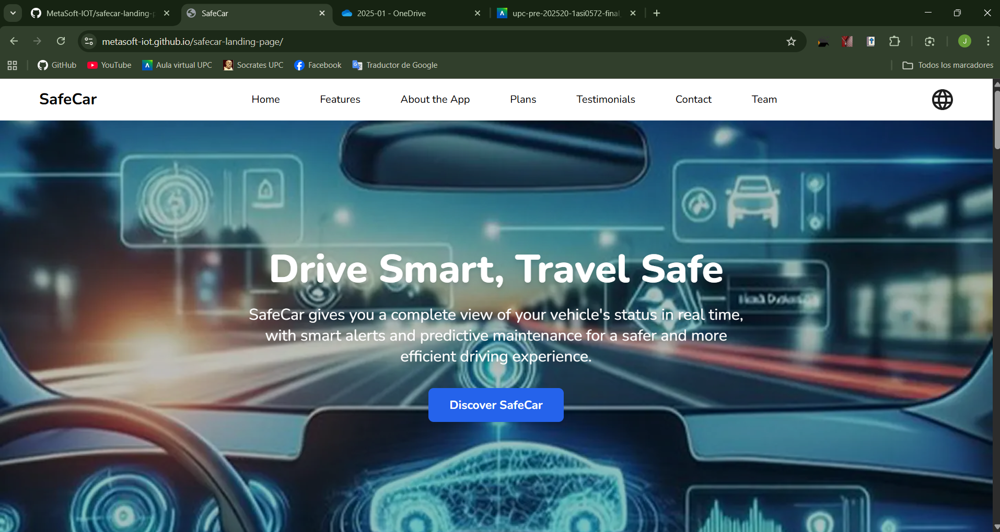
    <p><em>Figura 1: Sección Hero de la Landing Page con navegación principal y call-to-action</em></p>
  </div>

  <div align="center">
    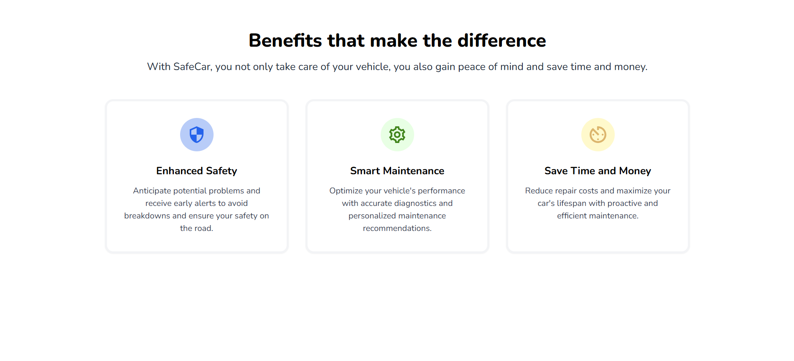
    <p><em>Figura 2: Sección de beneficios destacando las características principales del sistema</em></p>
  </div>

  <div align="center">
    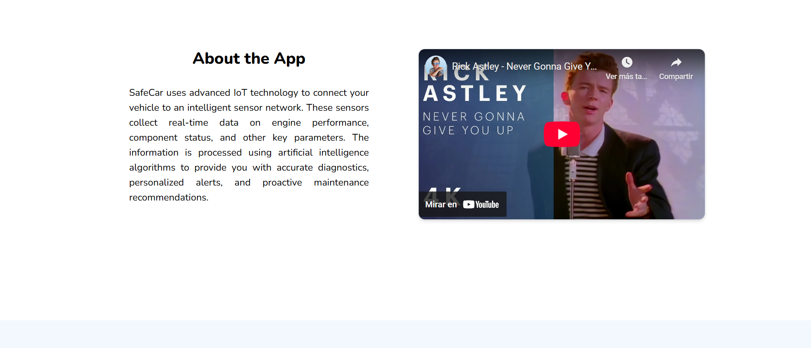
    <p><em>Figura 3: Sección informativa sobre la aplicación SafeCar</em></p>
  </div>

  <div align="center">
    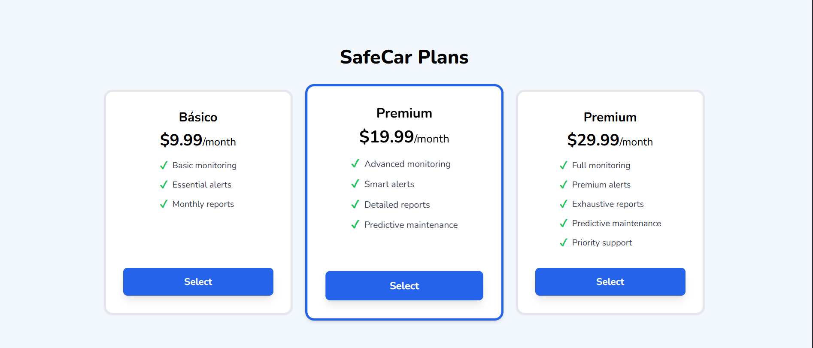
    <p><em>Figura 4: Sección de planes y precios con opciones de suscripción</em></p>
  </div>

  <div align="center">
    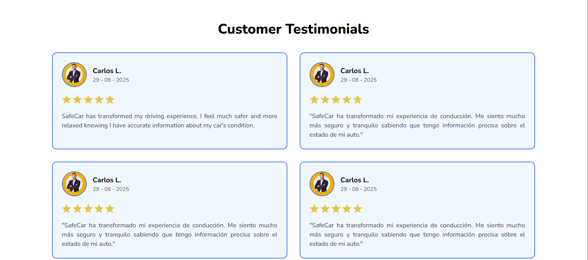
    <p><em>Figura 5: Sección de testimonios de usuarios</em></p>
  </div>

  <div align="center">
    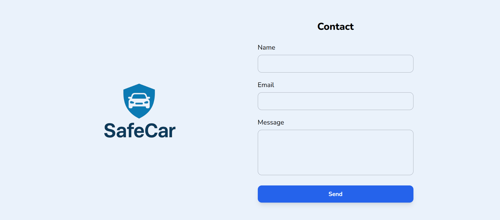
    <p><em>Figura 6: Sección de contacto con formulario y información de contacto</em></p>
  </div>

  <div align="center">
    
    <p><em>Figura 7: Sección sobre el equipo de desarrollo MetaSoft</em></p>
  </div>

- **Autenticación:** Formularios de login y registro de usuarios

  <div align="center">
    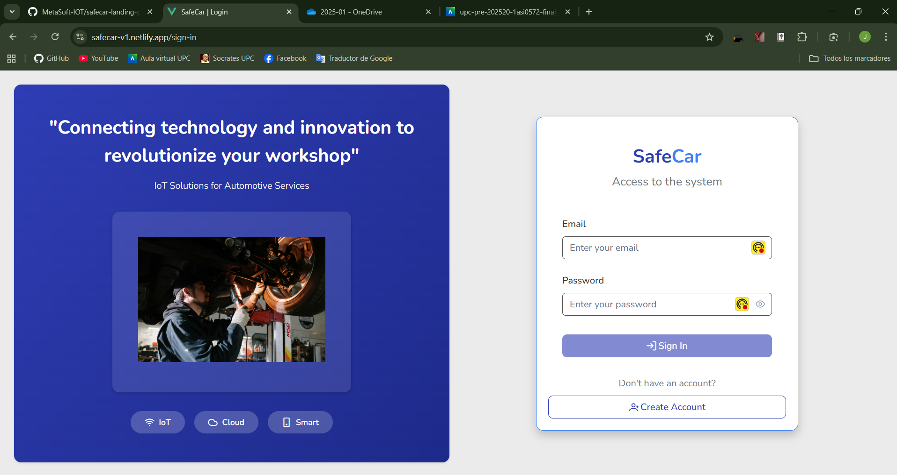
    <p><em>Figura 8: Interfaz de inicio de sesión de la aplicación web SafeCar</em></p>
  </div>

  <div align="center">
    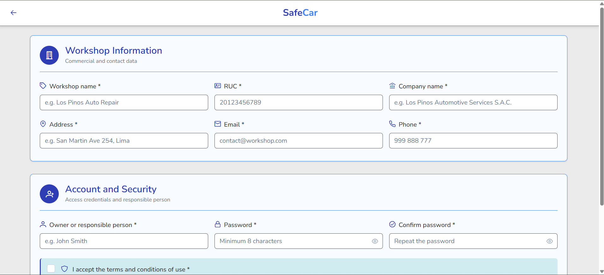
    <p><em>Figura 9: Interfaz de registro de usuarios de la aplicación web SafeCar</em></p>
  </div>

- **Gestión de Citas:** Interfaces para programación, visualización y detalles de citas de mantenimiento

  <div align="center">
    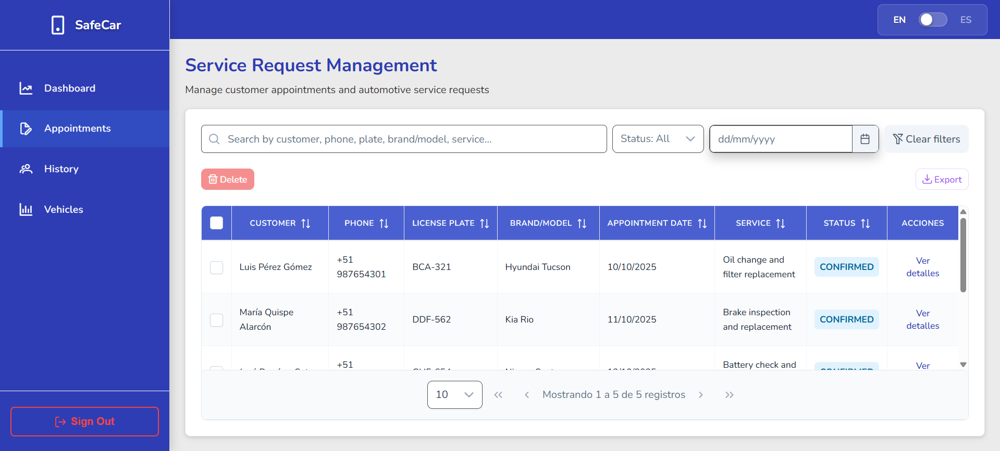
    <p><em>Figura 10: Módulo de gestión de citas de mantenimiento</em></p>
  </div>

  <div align="center">
    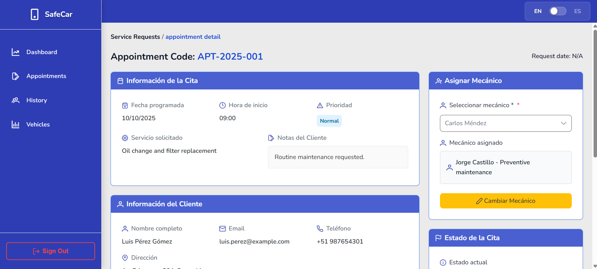
    <p><em>Figura 11: Vista detallada de cita de mantenimiento</em></p>
  </div>

- **Historial de Reparaciones:** Módulo de seguimiento y consulta del historial vehicular

  <div align="center">
    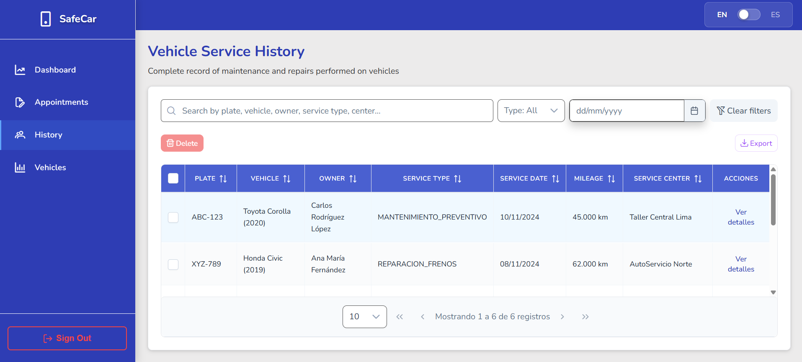
    <p><em>Figura 12: Módulo de historial de reparaciones vehiculares</em></p>
  </div>

- **Gestión de Vehículos:** Panel principal de administración de vehículos

  <div align="center">
    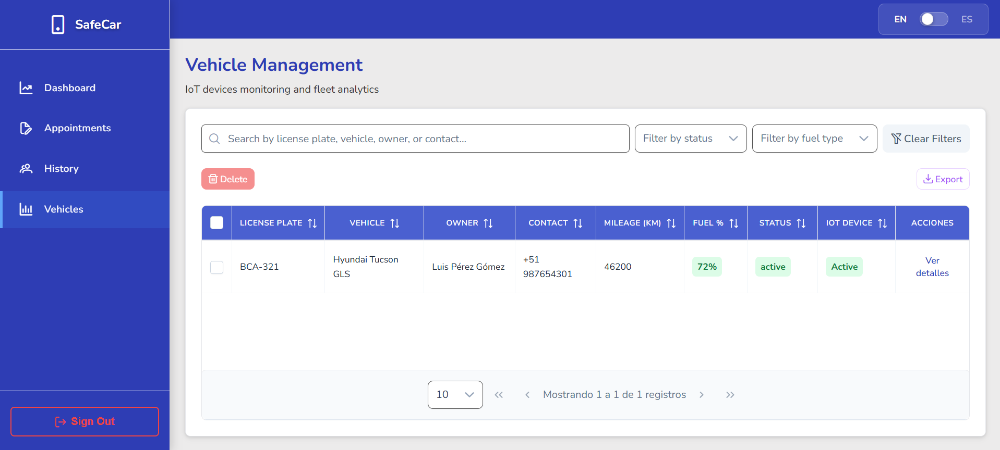
    <p><em>Figura 13: Panel de gestión de vehículos</em></p>
  </div>

  <div align="center">
    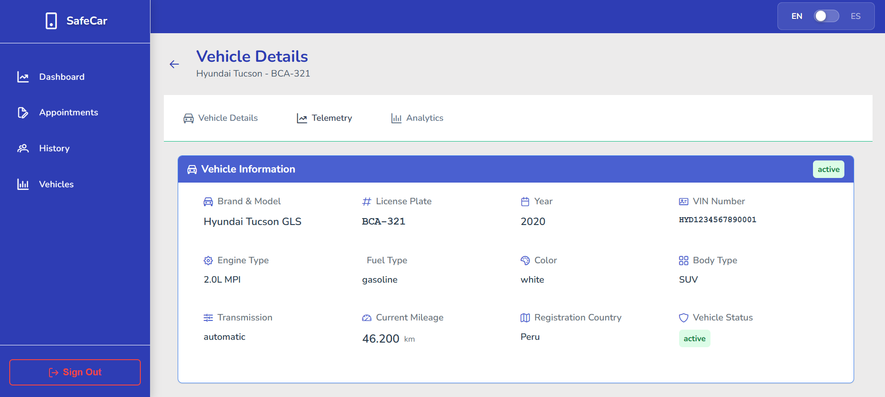
    <p><em>Figura 14: Vista detallada de vehículo con información completa</em></p>
  </div>

- **Telemetría Vehicular:** Visualización en tiempo real de datos del vehículo

  <div align="center">
    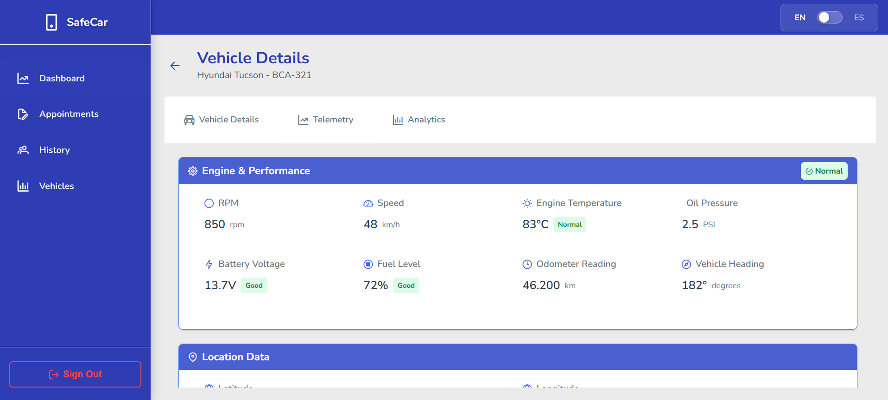
    <p><em>Figura 15: Dashboard de telemetría vehicular en tiempo real</em></p>
  </div>

- **Análisis de Datos:** Dashboard con métricas y análisis operacionales

  <div align="center">
    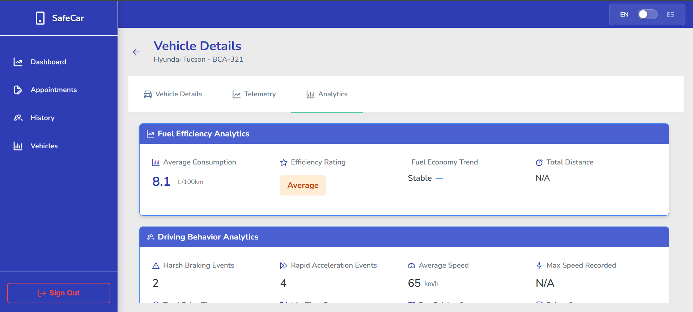
    <p><em>Figura 16: Dashboard de análisis de datos operacionales</em></p>
  </div>

- **Dashboard en Desarrollo:** Panel principal de la aplicación web

  <div align="center">
    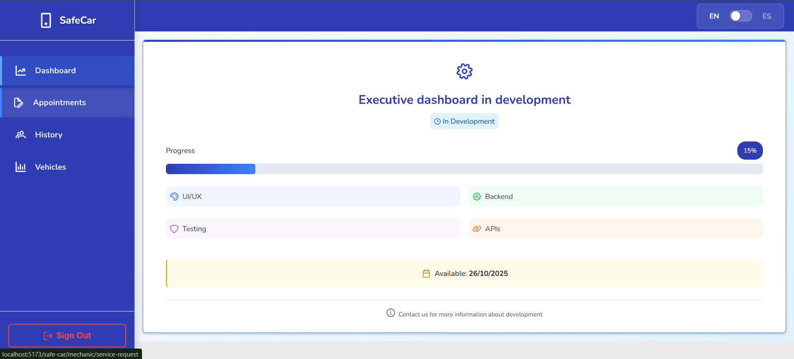
    <p><em>Figura 17: Dashboard principal en desarrollo de la aplicación web</em></p>
  </div>

<p align="justify">
<strong>Video demostrativo:</strong> Para una comprensión integral del trabajo realizado, se ha preparado un video que ilustra la navegación completa a través de las funcionalidades implementadas, mostrando los flujos de usuario desde la Landing Page hasta las principales operaciones dentro de la aplicación web.
</p>

<div align="center">
  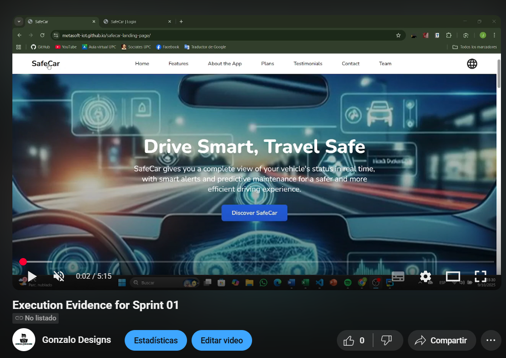
  <p><em>Figura 18: Vista previa del video demostrativo del Sprint 1 mostrando las funcionalidades implementadas</em></p>
</div>

**Enlace al video de demostración:** [https://youtu.be/bzoLGLyBfWk](https://youtu.be/bzoLGLyBfWk)

#### 6.2.1.7. Services Documentation Evidence for Sprint Review

<p align="justify">
Durante el Sprint 1, el desarrollo se enfocó en la implementación y despliegue de dos componentes principales: la Landing Page y la aplicación web. En términos de servicios web, se establecieron los endpoints básicos necesarios para soportar estas dos aplicaciones, priorizando la funcionalidad esencial para demostrar la viabilidad del sistema SafeCar.
</p>

<p align="justify">
Los logros alcanzados incluyen la configuración de endpoints que permiten el acceso directo a la Landing Page y a la aplicación web, estableciendo la infraestructura base para la navegación entre ambos componentes del sistema. Esta aproximación permite a los usuarios acceder seamlessly desde la presentación del producto hasta las funcionalidades principales de la aplicación.
</p>

**Endpoints implementados durante el Sprint 1:**

<table width="100%">
  <thead>
    <tr>
      <th>Componente</th>
      <th>Verbo HTTP</th>
      <th>Sintaxis de Llamada</th>
      <th>Descripción</th>
      <th>Ejemplo de Response</th>
      <th>Estado</th>
    </tr>
  </thead>
  <tbody>
    <tr>
      <td>Landing Page</td>
      <td>GET</td>
      <td>https://metasoft-iot.github.io/safecar-landing-page/</td>
      <td>
        Sitio Web principal (Landing Page)<br>
      </td>
      <td>
        HTML completo de la Landing Page<br>
        con soporte i18n y navegación<br>
        responsiva
      </td>
      <td>Desplegado</td>
    </tr>
    <tr>
      <td>Web Application</td>
      <td>GET</td>
      <td>https://safecar-v1.netlify.app/</td>
      <td>
        Aplicación web principal de SafeCar<br>
        Redirige a login si no autenticado
      </td>
      <td>
        SPA (Single Page Application)<br>
        con rutas internas para:<br>
        /login, /register, /dashboard,<br>
        /vehicles, /appointments
      </td>
      <td>Desplegado</td>
    </tr>
  </tbody>
</table>


**Repositorios:**
- **URL del repositorio Landing Page:** [https://github.com/MetaSoft-IOT/safecar-landing-page](https://github.com/MetaSoft-IOT/safecar-landing-page)
- **URL del repositorio Web Application:** [https://github.com/MetaSoft-IOT/upc-pre-202520-1asi0572-3479-SafeCar-Frontend](https://github.com/MetaSoft-IOT/upc-pre-202520-1asi0572-3479-SafeCar-Frontend)


#### 6.2.1.8. Software Deployment Evidence for Sprint Review

<p align="justify">
El despliegue durante el Sprint 1 materializó el trabajo desarrollado en productos accesibles para usuarios reales. La estrategia se centró en utilizar plataformas reconocidas por su confiabilidad, permitiendo concentrar esfuerzos en la calidad del producto más que en la complejidad de infraestructura.
</p>

<p align="justify">
Se desplegaron ambos componentes en plataformas específicas según sus características: GitHub Pages para la Landing Page (sitio estático) y Netlify para la aplicación web Vue.js (SPA con routing dinámico). GitHub Pages proporcionó integración directa con el repositorio, HTTPS automático y CDN global, mientras que Netlify ofreció capacidades avanzadas para aplicaciones JavaScript modernas, incluyendo manejo apropiado del Vue Router y preview deployments.
</p>

**Evidencias de Despliegue**

**Landing Page - GitHub Pages:**

<div align="center">
  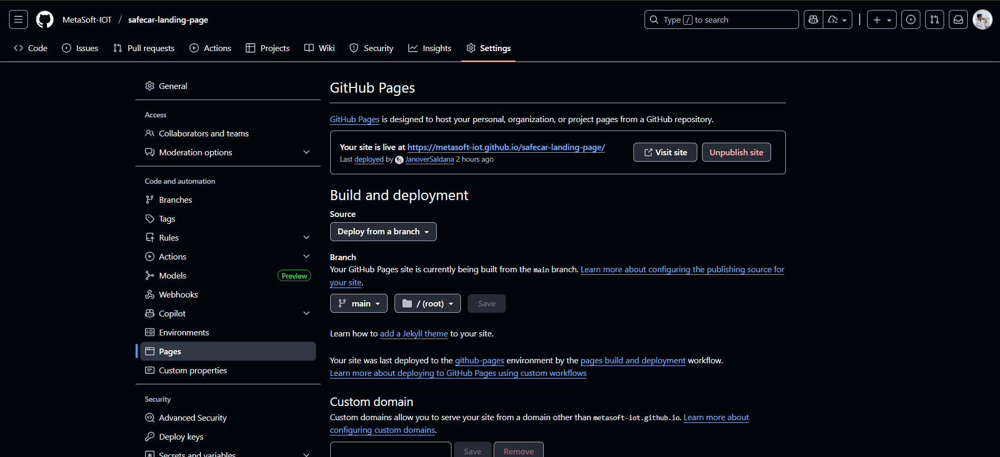
</div>

**Aplicación Web - Netlify:**

<div align="center">
  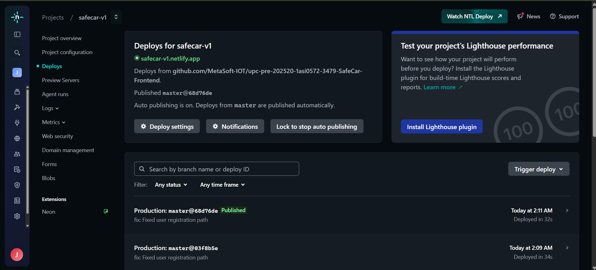
</div>


<p align="justify">
El despliegue exitoso establece una base sólida para el desarrollo continuo, con integración automatizada que permitirá futuras actualizaciones sin fricción, manteniendo el enfoque del equipo en el desarrollo de nuevas funcionalidades. Las evidencias visuales del proceso y las URLs de acceso se encuentran documentadas en la correspondiente sección de Services Documentation.
</p>


#### 6.2.1.9. Team Collaboration Insights during Sprint

<p align="justify">
Durante el Sprint 1, el equipo MetaSoft implementó una estrategia de colaboración distribuida, coordinando el desarrollo de tres productos principales: Landing Page (liderada por Gonzalo Zavala), aplicación web (liderada por Janover Saldaña), e infraestructura de despliegue (coordinación conjunta). Esta metodología garantizó la participación activa de todos los miembros en múltiples áreas, distribuyendo el conocimiento del proyecto y fortaleciendo la capacidad colectiva del equipo.
</p>

**Analíticos de Colaboración en GitHub**

<p align="justify">
Los datos extraídos de GitHub proporcionan una perspectiva cuantitativa de la colaboración del equipo, revelando patrones de contribución, frecuencia de commits, y distribución del trabajo a lo largo del sprint. Los analíticos de Pulse y Contributors de ambos repositorios confirman la participación equilibrada de todos los miembros y demuestran la efectividad de la metodología de trabajo colaborativo adoptada.
</p>

**Repositorio Landing Page - Analíticos de Pulse y Contributors**

**GitHub Pulse - Actividad del Repositorio:**

<figure align="center">
  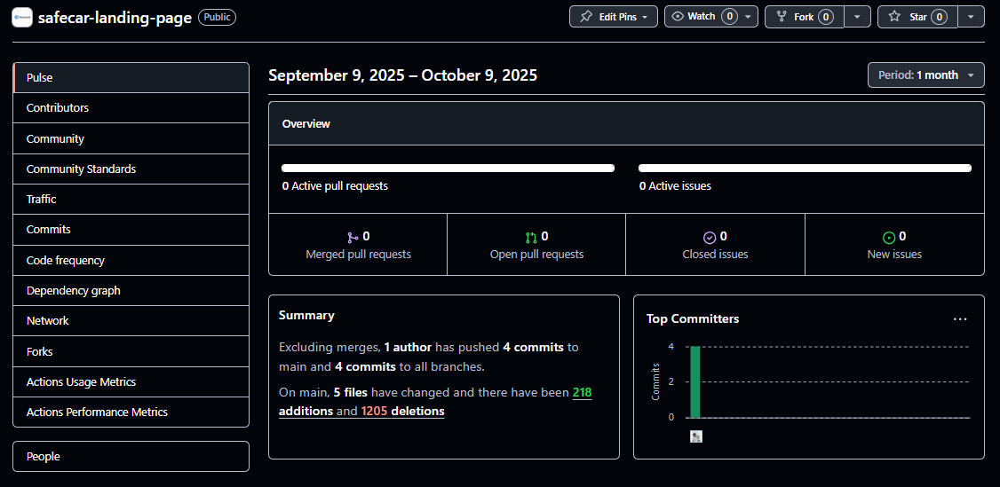
  <figcaption><strong>Figura 20.</strong> Analíticos de Pulse del repositorio Landing Page mostrando la actividad de commits, pull requests y colaboradores durante el Sprint 1.</figcaption>
</figure>

**Contributors - Participación del Equipo:**

<figure align="center">
  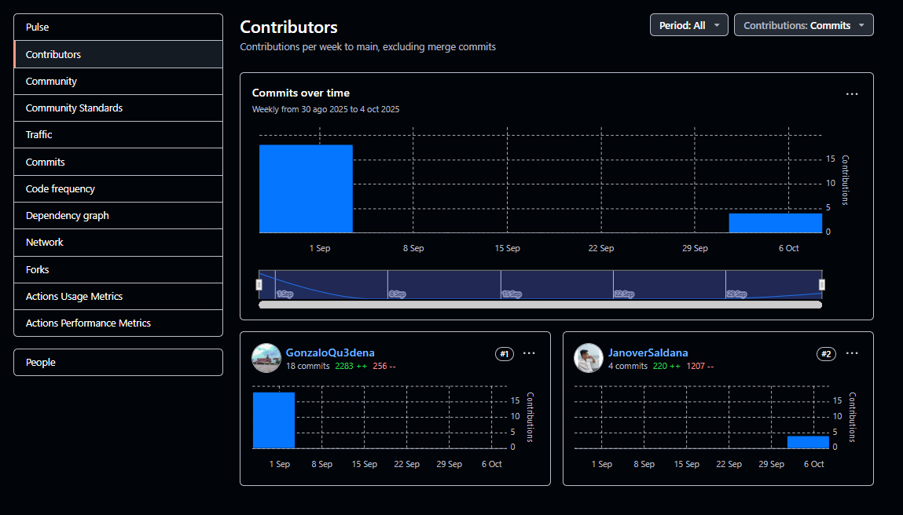
  <figcaption><strong>Figura 21.</strong> Analíticos de Contributors del repositorio Landing Page detallando las contribuciones individuales por miembro del equipo, incluyendo commits y líneas de código modificadas.</figcaption>
</figure>

**Repositorio Web Application - Analíticos de Pulse y Contributors**

**GitHub Pulse - Actividad del Repositorio:**

<figure align="center">
  
  <figcaption><strong>Figura 22.</strong> Analíticos de Pulse del repositorio Web Application mostrando la frecuencia de actividad, distribución temporal de commits y participación activa del equipo durante el sprint.</figcaption>
</figure>

**Contributors - Participación del Equipo:**

<figure align="center">
  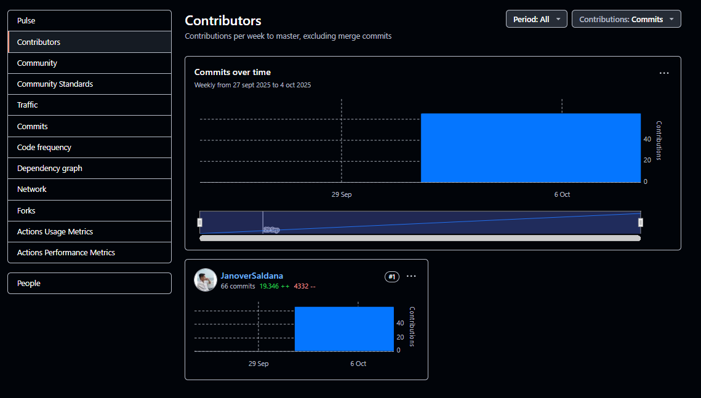
  <figcaption><strong>Figura 23.</strong> Analíticos de Contributors del repositorio Web Application evidenciando las contribuciones específicas de cada miembro, incluyendo commits realizados y volumen de código desarrollado.</figcaption>
</figure>

**Insights Específicos por Repositorio:**

- **Landing Page:** Los analíticos muestran liderazgo claro de Gonzalo Quedena con contribuciones sustanciales, respaldado por participación activa de todo el equipo en diferentes componentes de la interfaz y funcionalidades.

- **Web Application:** La actividad de commits evidencia el liderazgo técnico de Janover Saldaña en la implementación de sistemas complejos, con colaboración significativa del equipo en componentes de autenticación y gestión de datos.</p>

**Lecciones Aprendidas y Proyecciones:**

Los analíticos también revelan oportunidades de mejora para futuros sprints, particularmente en términos de balancear mejor la carga de trabajo entre todos los miembros y establecer puntos de sincronización más frecuentes para componentes que requieren integración estrecha. La experiencia positiva del Sprint 1 establece una base sólida para escalar la colaboración en iteraciones futuras con mayor complejidad técnica.

### Herramientas y Procesos de Colaboración

**Plataformas Utilizadas:**
- **GitHub:** Control de versiones, seguimiento de issues, y revisión de código
- **Google Meet:** Reuniones de sincronización y planificación
- **Trello:** Gestión del backlog y seguimiento de tareas
- **Visual Studio Code:** Desarrollo colaborativo con extensiones de integración

### 6.2.2. Sprint 2
#### 6.2.2.1. Sprint Planning 2

<p align="justify">
El Sprint 2 representa una evolución significativa del proyecto SafeCar, enfocándose en el refinamiento y expansión de las funcionalidades establecidas durante el Sprint 1. Este ciclo se centra en implementar correcciones críticas basadas en el feedback del Sprint Review, expandir la cobertura de segmentos objetivo, y avanzar hacia un ecosistema completo que incluye backend y aplicación móvil. La iteración busca consolidar la experiencia de usuario y establecer la infraestructura necesaria para escalar el sistema hacia una solución integral de gestión vehicular.
</p>

<table width="100%">
    <tr>
        <th>Sprint #</th>
        <th>Sprint 2</th>
    </tr>
    <tr>
        <td colspan="2">Sprint Planning Background</td>
        <td></td>
    </tr>
    <tr>
        <td>Date</td>
        <td>2025-10-14</td>
    </tr>
    <tr>
        <td>Time</td>
        <td>09:15 AM</td>
    </tr>
    <tr>
        <td>Location</td>
        <td align="justify">
        La reunión de planificación del Sprint 2 fue realizada de manera presencial en las instalaciones de UPC, con participación híbrida mediante Google Meet para miembros remotos
        </td>
    </tr>
    <tr>
        <td>Prepared By</td>
        <td>
        Saldaña Vela, Janover Gonzalo
        </td>
    </tr>
    <tr>
        <td>Attendees (to planning meeting)</td>
        <td>
        Saldaña Vela, Janover Gonzalo / Holguin Gamarra, Hardie Alfonso / Mendoza Solis, Javier Kenyi / Aguirre Rodríguez, Gustavo Jandroel / Irigoyen Matos, Javier Sharvel / Zavala Quedena, Gonzalo Andre / Burga Loarte, Anaely Zarely
        </td>
    </tr>
    <tr>
      <td>Sprint 1 - Review Summary</td>
      <td align="justify">
        El Sprint 1 consiguió desplegar la Web de Negocio (landing page) y la Aplicación Web con las funcionalidades core de gestión vehicular, lo que permitió validar los flujos principales de UX e interacción (registro, inicio de sesión, navegación y pantallas clave). No se integró backend durante esta iteración; los flujos funcionan con datos locales o simulados. A nivel de producto se entregó una landing bilingüe y responsive, navegación y secciones informativas; la Web App incluye UI para registro, login, gestión de vehículos, órdenes de servicio y agendamiento básico. El equipo resaltó como puntos fuertes la velocidad para alcanzar un baseline visual sólido y la claridad en la arquitectura inicial; como riesgos identificados señalaron el trabajo directo en main, concentración de commits en pocos miembros, y la ausencia de pruebas automatizadas. El Product Owner valoró positivamente la calidad visual y la validación temprana de la experiencia, pero pidió mayor integración entre componentes (backend), mejor segmentación de la landing para usuarios/mecánicos, correcciones de localización y terminología (p. ej. "History" → "Service Orders"), y priorizar pruebas y despliegues controlados. Las acciones acordadas fueron activar GitFlow y protección de ramas, definir Definition of Done que incluya revisión de código y tests, planificar la integración de backend en el próximo sprint y redistribuir capacidad para balancear la carga de trabajo.
      </td>
    </tr> <tr>
        <td>Sprint 1 - Retrospective Summary</td>
        <td align="justify">
          <p>Durante el primer sprint solo se logró el despliegue de la Landing Page y de la aplicación web con las funciones core de negocio sin integrar la autenticación, trabajando con datos locales y sin consumos de servicios externos; esto permitió validar visualmente la interfaz y los flujos básicos, sin embargo la forma de trabajo mostró debilidades que impactaron la ejecución, especialmente la organización del tiempo ya que varios integrantes atendieron otros desarrollos paralelos provocando retrasos y reasignaciones, el trabajo directo en <code>main</code> en lugar de usar ramas de feature generó conflictos y hotfixes que consumieron tiempo de revisión, y la fricción al integrar cambios; como mejoras accionables proponemos adoptar GitFlow y proteger las ramas principales con PRs obligatorios y plantilla de revisión, definir la capacidad realista de cada integrante y registrar la disponibilidad en el board para evitar solapamientos, establecer un daily de 15 minutos enfocado en bloqueos con un facilitador de sprint que haga seguimiento, introducir una Definition of Done que incluya revisión de código y programar una retrospectiva formal al cierre del Sprint 2 con responsables asignados para cada acción y métricas de verificación.</p>
        </td>
    </tr>
    <tr>
        <td colspan="2">Sprint Goal & User Stories</td>
        <td></td>
    </tr>
    <tr>
        <td>Sprint 2 Goal</td>
        <td align="justify">
          <strong>Nuestro enfoque está en</strong> habilitar que conductores y mecánicos gestionen sus cuentas, vehículos y mantenimientos dentro del ecosistema SafeCar, incorporando el registro, inicio de sesión, actualización de perfil, vinculación de vehículos, recepción de alertas en tiempo real y programación de citas, además de ampliar las capacidades para que el equipo de desarrollo pueda integrar estas funcionalidades en las aplicaciones web y móvil mediante los servicios implementados.
          <br><br>
          <strong>Creemos que esto permite</strong> ofrecer a los conductores una experiencia más fluida para mantener actualizada la información de sus vehículos, recibir notificaciones oportunas y solicitar mantenimiento sin depender de intermediarios, mientras que los mecánicos obtienen una mejor organización de su carga de trabajo, confirmación de citas y acceso a datos operacionales reales. Asimismo, brinda al equipo de desarrollo oportunidades para implementar más funcionalidades relacionadas con cuentas, vehículos y citas sobre una base consistente.
          <br><br>
          <strong>Esto se confirmará cuando</strong> los usuarios puedan registrarse e iniciar sesión en no más de tres pasos, vincular su vehículo al sistema en menos de dos minutos y gestionar o modificar citas en no más de cinco interacciones; y cuando el equipo de desarrollo pueda implementar nuevas funcionalidades utilizando los servicios desarrollados sin requerir intervención adicional del backend, logrando flujos principales con una tasa de éxito superior al 90% y una disponibilidad mínima del 95% durante el sprint.
        </td>
    </tr>
    <tr>
       <td>Sprint 2 Velocity</td>
        <td align="justify">
        Basándose en el rendimiento del Sprint 1 (23 Story Points completados), el equipo establece una velocidad objetivo de 86 Story Points para el Sprint 2. Este incremento del 274% refleja la expansión significativa del alcance del proyecto hacia múltiples plataformas (web, móvil, backend), la mayor experiencia del equipo, y la infraestructura establecida durante el primer sprint. Esta métrica permitirá evaluar la capacidad real del equipo en un contexto de desarrollo más complejo y multidimensional.
        </td>
    </tr>
    <tr>
        <td>Sum of Story Points</td>
        <td>86</td>
    </tr>
</table>

#### 6.2.2.2. Aspect Leaders and Collaborators

<p align="justify">
Para el Sprint 2, el equipo organizó el trabajo bajo un enfoque de Domain-Driven Design, donde cada Bounded Context se implementa siguiendo los principios de autonomía de dominio y especialización técnica. La matriz de liderazgo y colaboración (LACX) define claramente las responsabilidades por Bounded Context, asegurando que cada contexto acotado mantenga su integridad conceptual mientras permite la colaboración efectiva entre miembros del equipo.
</p>

<table width="100%">
    <tr>
        <th>Team Member (Last Name, First Name)</th>
        <th>GitHub Username</th>
        <th>Device Management BC (L/C)</th>
        <th>Workshop Operations and Telemetry Processing BC (L/C)</th>
        <th>Communication BC (L/C)</th>
        <th>Analytics and Recommendations BC (L/C)</th>
        <th>Subscription and Payments BC (L/C)</th>
        <th>IAM BC (L/C)</th>
        <th>Landing Page Improvements (L/C)</th>
        <th>UX/UI Design (L/C)</th>
    </tr>
    <tr>
        <td>Janover Gonzalo Saldaña Vela</td>
        <td>JanoverSaldana</td>
        <td align="center">L</td>
        <td align="center">C</td>
        <td align="center">-</td>
        <td align="center">C</td>
        <td align="center">-</td>
        <td align="center">-</td>
        <td align="center">-</td>
        <td align="center">-</td>
    </tr>
    <tr>
        <td>Hardie Alfonso Holguin Gamarra</td>
        <td>HOLGUINUPC</td>
        <td align="center">C</td>
        <td align="center">L</td>
        <td align="center">-</td>
        <td align="center">-</td>
        <td align="center">-</td>
        <td align="center">C</td>
        <td align="center">L</td>
        <td align="center">-</td>
    </tr>
    <tr>
        <td>Javier Kenyi Mendoza Solis</td>
        <td>Kenyi-Mendoza-Solis</td>
        <td align="center">-</td>
        <td align="center">-</td>
        <td align="center">L</td>
        <td align="center">-</td>
        <td align="center">C</td>
        <td align="center">-</td>
        <td align="center">-</td>
        <td align="center">L</td>
    </tr>
    <tr>
        <td>Javier Sharvel Irigoyen Matos</td>
        <td>sharvel-irigoyen</td>
        <td align="center">-</td>
        <td align="center">C</td>
        <td align="center">-</td>
        <td align="center">L</td>
        <td align="center">-</td>
        <td align="center">-</td>
        <td align="center">C</td>
        <td align="center">-</td>
    </tr>
    <tr>
        <td>Gustavo Jandroel Aguirre Rodríguez</td>
        <td>Jandroel</td>
        <td align="center">C</td>
        <td align="center">-</td>
        <td align="center">-</td>
        <td align="center">-</td>
        <td align="center">L</td>
        <td align="center">-</td>
        <td align="center">-</td>
        <td align="center">-</td>
    </tr>
    <tr>
        <td>Anaely Zarely Burga Loarte</td>
        <td>userxx1000</td>
        <td align="center">-</td>
        <td align="center">-</td>
        <td align="center">C</td>
        <td align="center">-</td>
        <td align="center">C</td>
        <td align="center">-</td>
        <td align="center">-</td>
        <td align="center">C</td>
    </tr>
    <tr>
        <td>Gonzalo Andre Zavala Quedena</td>
        <td>GonzaloQu3dena</td>
        <td align="center">-</td>
        <td align="center">C</td>
        <td align="center">-</td>
        <td align="center">-</td>
        <td align="center">-</td>
        <td align="center">L</td>
        <td align="center">-</td>
        <td align="center">-</td>
    </tr>
</table>

#### 6.2.2.3. Sprint Backlog 2
<p align="justify">
A continuación se detalla el Sprint Backlog del segundo sprint, el cual incluye las nuevas historias de usuario priorizadas y las tareas de refactorización y mejora identificadas, asignando responsables y tiempos estimados para asegurar el cumplimiento de los objetivos de la iteración.
</p>

<table width="100%">
    <tr>
        <th colspan="2">Sprint #</th>
        <th colspan="6">Sprint 2</th>
    </tr>
    <tr>
        <td colspan="2">User Story</td>
        <td colspan="6">Work-Item / Task</td>
    </tr>
    <tr>
        <td>Id</td>
        <td>Title</td>
        <td>Id</td>
        <td>Title</td>
        <td>Description</td>
        <td>Estimation (Hours)</td>
        <td>Assigned To</td>
        <td>Status (To-do / In-Process / To-Review / Done)</td>
    </tr>
    <tr>
        <td rowspan="9">TS101</td>
        <td rowspan="9">Como desarrollador, deseo registrar un conductor a través de la API, para que el sistema pueda gestionar dinámicamente las cuentas de los conductores y los registros de autenticación.</td>
        <td>T1</td>
        <td>Implementar interfaz UserCommandService.</td>
        <td>Implementar interfaz UserCommandService que encapsule los handlers donde cada uno como argumento reciba el command creado.</td>
        <td></td>
        <td>GQ</td>
        <td>To-do</td>
    </tr>
    <tr>
        <td>T2</td>
        <td>Implementar UserCommandServiceImpl.</td>
        <td>Implementar UserCommandServiceImpl quien implementa los handlers de la interfaz UserCommandService.</td>
        <td></td>
        <td>GQ</td>
        <td>To-do</td>
    </tr>
    <tr>
        <td>T3</td>
        <td>Implementar endpoint POST /api/v1/signup.</td>
        <td>Implementar endpoint POST /api/v1/signup para registro de conductor.</td>
        <td></td>
        <td>GQ</td>
        <td>To-do</td>
    </tr>
    <tr>
        <td>T4</td>
        <td>Validar unicidad de email.</td>
        <td>Validar unicidad de email en el registro de conductor.</td>
        <td></td>
        <td>GQ</td>
        <td>To-do</td>
    </tr>
    <tr>
        <td>T5</td>
        <td>Crear Aggregate "User".</td>
        <td>Crear Aggregate "User" con los campos email, password y rol de conductor.</td>
        <td></td>
        <td>GQ</td>
        <td>To-do</td>
    </tr>
    <tr>
        <td>T6</td>
        <td>Crear valueobject para Email.</td>
        <td>Crear valueobject para la propiedad Email.</td>
        <td></td>
        <td>GQ</td>
        <td>To-do</td>
    </tr>
    <tr>
        <td>T7</td>
        <td>Implementar valueobject Role.</td>
        <td>Implementar valueobject Role como enum expresando los roles del negocio.</td>
        <td></td>
        <td>GQ</td>
        <td>To-do</td>
    </tr>
    <tr>
        <td>T8</td>
        <td>Implementar entidad Roles.</td>
        <td>Implementar entidad Roles para tabla de evaluación.</td>
        <td></td>
        <td>GQ</td>
        <td>To-do</td>
    </tr>
    <tr>
        <td>T9</td>
        <td>Implementar comando SignUpUserCommand.</td>
        <td>Implementar comando SignUpUserCommand para registro de usuario.</td>
        <td></td>
        <td>GQ</td>
        <td>To-do</td>
    </tr>
    <tr>
        <td rowspan="4">US105</td>
        <td rowspan="4">Como visitante deseo leer opiniones de usuarios sobre SafeCar para confiar en la plataforma antes de registrarme.</td>
        <td>T10</td>
        <td>Crear el mockup de la sección o página donde se mostrarán las opiniones.</td>
        <td>Crear el mockup de la sección o página donde se mostrarán las opiniones. Debe incluir elementos como la foto/iniciales del usuario, su nombre, la calificación y el texto de la opinión.</td>
        <td></td>
        <td>AB</td>
        <td>To-do</td>
    </tr>
    <tr>
        <td>T11</td>
        <td>Implementar forma sencilla de navegar entre opiniones.</td>
        <td>Si hay muchas opiniones, implementar una forma sencilla de navegar entre ellas o un mecanismo que muestre una selección aleatoria o las mejor valoradas.</td>
        <td></td>
        <td>AB</td>
        <td>To-do</td>
    </tr>
    <tr>
        <td>T12</td>
        <td>Implementar visualización de calificación global promedio.</td>
        <td>Implementar una visualización destacada que muestre la calificación global promedio basada en todas las opiniones.</td>
        <td></td>
        <td>AB</td>
        <td>To-do</td>
    </tr>
    <tr>
        <td>T13</td>
        <td>Configurar permisos de la página para usuarios sin registrar.</td>
        <td>Configurar los permisos de la página para que el contenido sea accesible a usuarios sin registrar, cumpliendo con el objetivo de la historia de usuario.</td>
        <td></td>
        <td>&ndash;</td>
        <td>To-do</td>
    </tr>
    <tr>
        <td rowspan="4">US108</td>
        <td rowspan="4">Como visitante deseo enviar mis datos de contacto y un mensaje desde la Web de Negocio para recibir más información o resolver dudas.</td>
        <td>T14</td>
        <td>Diseñar mockup del formulario de contacto.</td>
        <td>Diseñar mockup del formulario de contacto de la Web de Negocio incluyendo campos obligatorios para: Nombre, Correo Electrónico, Teléfono y un área para el Mensaje.</td>
        <td></td>
        <td>AB</td>
        <td>To-do</td>
    </tr>
    <tr>
        <td>T15</td>
        <td>Implementar la sección de contacto en Web de Negocio.</td>
        <td>Implementar la sección de contacto en Web de Negocio basado en mockup.</td>
        <td></td>
        <td>&ndash;</td>
        <td>To-do</td>
    </tr>
    <tr>
        <td>T16</td>
        <td>Implementar reglas de validación para campos.</td>
        <td>Implementar reglas de validación para asegurar que los campos: nombre, email y mensaje, tengan un formato correcto y no estén vacíos.</td>
        <td></td>
        <td>AB</td>
        <td>To-do</td>
    </tr>
    <tr>
        <td>T17</td>
        <td>Mostrar mensaje de envío exitoso.</td>
        <td>Mostrar mensaje envío de datos de Contacto exitoso en la Web de Negocio.</td>
        <td></td>
        <td>AB</td>
        <td>To-do</td>
    </tr>
     <tr>
        <td>US112</td>
        <td>Como visitante deseo que la Aplicación Web se vea bien en cualquier dispositivo para acceder comodamente</td>
        <td>T18</td>
        <td>Implementación responsive de la aplicación web</td>
        <td>Implementación responsive de la aplicación web</td>
        <td></td>
        <td>GQ</td>
        <td>To-do</td>
    </tr>
    <tr>
        <td rowspan="6">US201</td>
        <td rowspan="6">Como conductor, deseo iniciar sesión con mis credenciales registradas en la aplicación móvil, para empezar con el monitoreo de mis vehículos.</td>
        <td>T19</td>
        <td>Implementar navegación post-login (móvil).</td>
        <td>Implementar la navegación de éxito post-login en la aplicación móvil. Al recibir los tokens, guardarlos y navegar a la pantalla de monitoreo de vehículos.</td>
        <td></td>
        <td>&ndash;</td>
        <td>To-do</td>
    </tr>
    <tr>
        <td>T20</td>
        <td>Implementar lógica "mantener sesión activa" (móvil).</td>
        <td>Implementar la lógica de "mantener sesión activa" en la aplicación móvil, incluyendo el almacenamiento seguro del refresh token si la opción es seleccionada.</td>
        <td></td>
        <td>&ndash;</td>
        <td>To-do</td>
    </tr>
    <tr>
        <td>T21</td>
        <td>Diseñar mockup de pantalla "Iniciar sesión" (móvil).</td>
        <td>Diseñar mockup de la pantalla "Iniciar sesión (SignIn)" de la aplicación móvil. Debe incluir los campos: correo electrónico, contraseña y la opción de "mantener sesión activa".</td>
        <td></td>
        <td>AB</td>
        <td>To-do</td>
    </tr>
    <tr>
        <td>T22</td>
        <td>Implementar pantalla "Iniciar sesión" (móvil).</td>
        <td>Implementar la pantalla "Iniciar sesión (SignIn)" en la aplicación móvil (componente visual). Crear el componente con los campos de entrada y el botón, basándose en el diseño.</td>
        <td></td>
        <td>JS</td>
        <td>To-do</td>
    </tr>
    <tr>
        <td>T23</td>
        <td>Implementar manejo visual de errores (móvil).</td>
        <td>Implementar el manejo visual de errores por credenciales inválidas en la aplicación móvil. Mostrar el mensaje de error de forma clara al recibir la respuesta de credenciales incorrectas del backend.</td>
        <td></td>
        <td>GQ</td>
        <td>To-do</td>
    </tr>
    <tr>
        <td>T24</td>
        <td>Implementar manejo visual de errores (móvil).</td>
        <td>Implementar el manejo visual de errores por credenciales inválidas. Mostrar el mensaje de error de forma clara al recibir la respuesta de credenciales inválidas del backend.</td>
        <td></td>
        <td>GQ</td>
        <td>To-do</td>
    </tr>
    <tr>
        <td rowspan="5">US202</td>
        <td rowspan="5">Como conductor, deseo registrarme en la aplicación móvil, para que pueda comenzar con el inicio de sesión.</td>
        <td>T25</td>
        <td>Diseñar mockup "Registro (SignUp)" (móvil).</td>
        <td>Diseñar mockup de la pantalla "Registro (SignUp)" de la aplicación móvil. Debe incluir los campos: nombre, correo electrónico y contraseña.</td>
        <td></td>
        <td>AB</td>
        <td>To-do</td>
    </tr>
    <tr>
        <td>T26</td>
        <td>Implementar pantalla "Registro (SignUp)" (móvil).</td>
        <td>Implementar la pantalla "Registro (SignUp)" en la aplicación móvil (componente visual). Crear el componente móvil con los campos de entrada y el botón de regi...</td>
        <td></td>
        <td>JS</td>
        <td>To-do</td>
    </tr>
    <tr>
        <td>T27</td>
        <td>Implementar lógica de registro (SignUp) (móvil).</td>
        <td>Implementar la lógica de registro (SignUp) en la aplicación móvil, incluyendo validación de formato local de los campos y la llamada a la API de registro, y manejo de los estados de carga y error.</td>
        <td></td>
        <td>GQ</td>
        <td>To-do</td>
    </tr>
    <tr>
        <td>T28</td>
        <td>Implementar navegación post-registro (móvil).</td>
        <td>Implementar la navegación de éxito post-registro en la aplicación móvil. Al recibir una confirmación de registro exitoso del backend, navegar automáticamente a la pantalla de Login (o al inicio de sesión automático).</td>
        <td></td>
        <td>GQ</td>
        <td>To-do</td>
    </tr>
    <tr>
        <td>T29</td>
        <td>Implementar manejo de errores de API de registro (móvil).</td>
        <td>Implementar el manejo de errores de la API de registro en la aplicación móvil. Mostrar un mensaje al usuario si el correo electrónico ya está registrado u otro error de negocio devuelto por el backend.</td>
        <td></td>
        <td>GQ</td>
        <td>To-do</td>
    </tr>
    <tr>
        <td rowspan="4">US203</td>
        <td rowspan="4">Como conductor, deseo restablecer mi contraseña desde la aplicación móvil, para que pueda recuperar el acceso a mi cuenta cuando haya olvidado mis credenciales.</td>
        <td>T30</td>
        <td>Diseñar mockup "Olvidé mi contraseña" (móvil).</td>
        <td>Diseñar mockup de la pantalla "Olvidé mi contraseña" (solicitud de correo) de la aplicación móvil. Debe incluir el formulario con el campo de entrada del correo electrónico y el botón de envío.</td>
        <td></td>
        <td>P</td>
        <td>To-do</td>
    </tr>
    <tr>
        <td>T31</td>
        <td>Implementar pantalla "Olvidé mi contraseña" (móvil).</td>
        <td>Implementar la pantalla "Olvidé mi contraseña" (solicitud de correo) en la aplicación móvil. Crear el componente móvil con el campo de entrada y el botón de envío.</td>
        <td></td>
        <td>P</td>
        <td>To-do</td>
    </tr>
    <tr>
        <td>T32</td>
        <td>Implementar lógica de solicitud de enlace (móvil).</td>
        <td>Implementar la lógica de solicitud de enlace de recuperación en la aplicación móvil, incluyendo la validación de formato del email y la llamada a la API para solicitar el enlace, manejando los estados de carga y error.</td>
        <td></td>
        <td>P</td>
        <td>To-do</td>
    </tr>
    <tr>
        <td>T33</td>
        <td>Implementar lógica de deep link (móvil).</td>
        <td>Implementar la lógica de deep link en la aplicación móvil. Al abrir la app con el deep link, validar el token recibido en el backend y, si es válido, navegar al formulario de nueva contraseña.</td>
        <td></td>
        <td>AB</td>
        <td>To-do</td>
    </tr>
    <tr>
        <td rowspan="5">US204</td>
        <td rowspan="5">Como conductor, deseo cerrar sesión en la aplicación móvil para proteger mi cuenta cuando termino de usar la aplicación.</td>
        <td>T34</td>
        <td>Implementar botón "Cerrar Sesión" (móvil).</td>
        <td>Implementar el botón "Cerrar Sesión" en la aplicación móvil (dentro de pantalla de Perfil).</td>
        <td></td>
        <td>JS</td>
        <td>To-do</td>
    </tr>
    <tr>
        <td>T35</td>
        <td>Implementar modal de confirmación (móvil).</td>
        <td>Implementar el modal de confirmación "¿Estás seguro que deseas cerrar sesión?" antes de finalizar la sesión.</td>
        <td></td>
        <td>JS</td>
        <td>To-do</td>
    </tr>
    <tr>
        <td>T36</td>
        <td>Implementar lógica de cierre de sesión (móvil).</td>
        <td>Implementar la lógica completa de cierre de sesión seguro en la aplicación móvil.</td>
        <td></td>
        <td>JS</td>
        <td>To-do</td>
    </tr>
    <tr>
        <td>T37</td>
        <td>Añadir eliminación de tokens (móvil).</td>
        <td>Añadir la eliminación de tokens de sesión del almacenamiento local del dispositivo móvil (al completar el cierre).</td>
        <td></td>
        <td>JS</td>
        <td>To-do</td>
    </tr>
    <tr>
        <td>T38</td>
        <td>Navegar a pantalla de Login (móvil).</td>
        <td>Navegar a la pantalla de Login al completar exitosamente el proceso de cierre de sesión.</td>
        <td></td>
        <td>JS</td>
        <td>To-do</td>
    </tr>
    <tr>
        <td rowspan="4">US205</td>
        <td rowspan="4">Como mecánico de taller, deseo mantener mi sesión activa en la aplicación web luego de estar inactivo, para evitar constantes inicios de sesión.</td>
        <td>T39</td>
        <td>Implementar opción "Mantener sesión activa" (web).</td>
        <td>Implementar la opción "Mantener sesión activa" (checkbox) en la página de login de la aplicación web.</td>
        <td></td>
        <td>JS</td>
        <td>To-do</td>
    </tr>
    <tr>
        <td>T40</td>
        <td>Implementar lógica de verificación de sesión (web).</td>
        <td>Implementar la lógica de verificación de sesión al cargar la aplicación web (verificar la existencia y validez de la sesión/token).</td>
        <td></td>
        <td>JS</td>
        <td>To-do</td>
    </tr>
    <tr>
        <td>T41</td>
        <td>Implementar renovación de sesión (web).</td>
        <td>Implementar la renovación de sesión en la aplicación web. Usar el refresh token almacenado para obtener un nuevo access token de forma transparente al cargar la aplicación.</td>
        <td></td>
        <td>JS</td>
        <td>To-do</td>
    </tr>
    <tr>
        <td>T42</td>
        <td>Implementar almacenamiento seguro de refresh token (web).</td>
        <td>Implementar el almacenamiento seguro del refresh token en el navegador al iniciar sesión con la opción "mantener activa".</td>
        <td></td>
        <td>&ndash;</td>
        <td>To-do</td>
    </tr>
    <tr>
        <td rowspan="4">US206</td>
        <td rowspan="4">Como conductor, deseo modificar mi perfil (nombre, apellido, contraseña) en la aplicación móvil para mantener mi información al día.</td>
        <td>T43</td>
        <td>Implementar la lógica de carga de datos del perfil.</td>
        <td>Implementar la lógica de carga de datos del perfil en la aplicación móvil. Al cargar la página, recuperar y mostrar los datos del perfil del conductor desde la API.</td>
        <td></td>
        <td>&ndash;</td>
        <td>To-do</td>
    </tr>
    <tr>
        <td>T44</td>
        <td>Diseñar mockup "Editar Perfil" (móvil).</td>
        <td>Diseñar mockup de la pantalla "Editar Perfil" de la aplicación móvil. Debe mostrar los campos actuales y el formulario de edición.</td>
        <td></td>
        <td>JS</td>
        <td>To-do</td>
    </tr>
    <tr>
        <td>T45</td>
        <td>Implementar pantalla "Editar Perfil" (móvil).</td>
        <td>Implementar la pantalla "Editar Perfil" (Componente Visual). Crear el componente móvil con los campos de perfil y los botones de guardar/cancelar.</td>
        <td></td>
        <td>JS</td>
        <td>To-do</td>
    </tr>
    <tr>
        <td>T46</td>
        <td>Implementar validaciones de formato (móvil).</td>
        <td>Implementar las validaciones de formato de campos de perfil del conductor (ej., campos obligatorios) antes del envío a la API.</td>
        <td></td>
        <td>JS</td>
        <td>To-do</td>
    </tr>
    <tr>
        <td rowspan="3">US207</td>
        <td rowspan="3">Como mecánico de taller, deseo registrarme en la aplicación web, para que pueda con el inicio de sesión.</td>
        <td>T47</td>
        <td>Diseñar mockup "Registro (SignUp)" (web).</td>
        <td>Diseñar mockup de la página "Registro (SignUp)" de la aplicación web. Debe incluir los campos: nombre, correo electrónico y contraseña.</td>
        <td></td>
        <td>GQ</td>
        <td>To-do</td>
    </tr>
    <tr>
        <td>T48</td>
        <td>Implementar página "Registro (SignUp)" (web).</td>
        <td>Implementar la página "Registro (SignUp)" en la aplicación web (componente visual). Crear el componente web con los campos de entrada y el botón de registro.</td>
        <td></td>
        <td>GQ</td>
        <td>To-do</td>
    </tr>
    <tr>
        <td>T49</td>
        <td>Implementar lógica de registro (SignUp) (web).</td>
        <td>Implementar la lógica de registro (SignUp) en la aplicación web, incluyendo validación de formato local de los campos y la llamada a la API de registro, y manejo de los estados de carga y error.</td>
        <td></td>
        <td>GQ</td>
        <td>To-do</td>
    </tr>
    <tr>
        <td rowspan="5">US208</td>
        <td rowspan="5">Como mecánico de taller, deseo iniciar sesión con mis credenciales registradas en la aplicación web, para empezar con la gestión de mis clientes y sus vehículos.</td>
        <td>T50</td>
        <td>Implementar mensaje de error (web).</td>
        <td>Implementar mensaje de error durante SignIn por credenciales inválidas en la aplicación web. Mostrar el mensaje de error de forma clara al recibir la respuesta del backend.</td>
        <td></td>
        <td>&ndash;</td>
        <td>To-do</td>
    </tr>
    <tr>
        <td>T51</td>
        <td>Implementar lógica "mantener sesión activa" (web).</td>
        <td>Implementar la lógica de "mantener sesión activa" en la aplicación web. Incluye el almacenamiento seguro del refresh token si la opción es seleccionada.</td>
        <td></td>
        <td>&ndash;</td>
        <td>To-do</td>
    </tr>
    <tr>
        <td>T52</td>
        <td>Diseñar mockup "Iniciar sesión (SignIn)" (web).</td>
        <td>Diseñar mockup de la página "Iniciar sesión (SignIn)" de la aplicación web. Debe incluir los campos: correo electrónico, contraseña y la opción de "mantener sesión activa".</td>
        <td></td>
        <td>AB</td>
        <td>To-do</td>
    </tr>
    <tr>
        <td>T53</td>
        <td>Implementar página "Iniciar sesión (SignIn)" (web).</td>
        <td>Implementar la página "Iniciar sesión (SignIn)" en la aplicación web (componente visual). Crear el componente web con los campos de entrada y el botón, basándose en el diseño.</td>
        <td></td>
        <td>GQ</td>
        <td>To-do</td>
    </tr>
    <tr>
        <td>T54</td>
        <td>Implementar lógica de inicio de sesión (web).</td>
        <td>Implementar la lógica de inicio de sesión (SignIn) en la aplicación web, incluyendo validación de formato local de los campos y la llamada a la API de autenticación.</td>
        <td></td>
        <td>GQ</td>
        <td>To-do</td>
    </tr>
    <tr>
        <td rowspan="6">US209</td>
        <td rowspan="6">Como conductor, deseo restablecer mi contraseña desde la aplicación móvil, para que pueda mantener la seguridad de mi cuenta de forma proactiva.</td>
        <td>T55</td>
        <td>Diseñar mockup "Cambio de contraseña" (móvil).</td>
        <td>Diseñar mockup de la pantalla "Cambio de contraseña" de la aplicación móvil. Debe incluir los tres campos de entrada: contraseña actual, nueva contraseña y confirmar nueva contraseña.</td>
        <td></td>
        <td>GQ</td>
        <td>To-do</td>
    </tr>
    <tr>
        <td>T56</td>
        <td>Implementar pantalla "Cambio de contraseña" (móvil).</td>
        <td>Implementar la pantalla "Cambio de contraseña" en la aplicación móvil. Crear el componente móvil con sus tres campos y validaciones de formato locales.</td>
        <td></td>
        <td>GQ</td>
        <td>To-do</td>
    </tr>
    <tr>
        <td>T57</td>
        <td>Implementar lógica de envío (móvil).</td>
        <td>Implementar la lógica de envío para el cambio de contraseña en la aplicación móvil, incluyendo validación de coincidencia de la nueva contraseña y envío de la solicitud al endpoint del backend.</td>
        <td></td>
        <td>GQ</td>
        <td>To-do</td>
    </tr>
    <tr>
        <td>T58</td>
        <td>Implementar manejo visual de errores (móvil).</td>
        <td>Implementar el manejo visual de errores en la aplicación móvil. Mostrar un mensaje de error si el backend informa que la "contraseña actual" es incorrecta o que la nueva contraseña no cumple con los requisitos.</td>
        <td></td>
        <td>GQ</td>
        <td>To-do</td>
    </tr>
    <tr>
        <td>T59</td>
        <td>Implementar confirmación de éxito (móvil).</td>
        <td>Implementar la confirmación de éxito en la aplicación móvil. Al recibir la confirmación de éxito del backend, mostrar un mensaje de éxito y redirigir a la pantalla de perfil o configuración.</td>
        <td></td>
        <td>GQ</td>
        <td>To-do</td>
    </tr>
    <tr>
        <td>T60</td>
        <td>Implementar invalidación de token (móvil).</td>
        <td>Implementar la invalidación y eliminación del token de sesión móvil después de un cambio de contraseña exitoso, forzando al conductor a iniciar sesión con la nueva contraseña.</td>
        <td></td>
        <td>GQ</td>
        <td>To-do</td>
    </tr>
    <tr>
        <td rowspan="4">US210</td>
        <td rowspan="4">Como mecánico de taller, deseo cerrar sesión en la aplicación web para proteger mi cuenta cuando termino de usar la aplicación.</td>
        <td>T61</td>
        <td>Implementar botón "Cerrar Sesión" (web).</td>
        <td>Implementar el botón "Cerrar Sesión" en la aplicación web (dentro de pantalla de Perfil).</td>
        <td></td>
        <td>GQ</td>
        <td>To-do</td>
    </tr>
    <tr>
        <td>T62</td>
        <td>Implementar lógica de cierre de sesión (web).</td>
        <td>Implementar la lógica completa de cierre de sesión seguro en la aplicación web.</td>
        <td></td>
        <td>GQ</td>
        <td>To-do</td>
    </tr>
    <tr>
        <td>T63</td>
        <td>Añadir eliminación de tokens (web).</td>
        <td>Añadir la eliminación de tokens de sesión (JWT y refresh) del almacenamiento local del navegador.</td>
        <td></td>
        <td>GQ</td>
        <td>To-do</td>
    </tr>
    <tr>
        <td>T64</td>
        <td>Navegar a página de Login (web).</td>
        <td>Navegar a la página de Login al completar exitosamente el proceso de cierre de sesión.</td>
        <td></td>
        <td>GQ</td>
        <td>To-do</td>
    </tr>
    <tr>
        <td rowspan="4">US211</td>
        <td rowspan="4">Como mecánico de taller, deseo modificar mi perfil (nombre, apellido, contraseña) en la aplicación web para mantener mi información al día.</td>
        <td>T65</td>
        <td>Implementar pantalla "Editar Perfil" (web).</td>
        <td>Implementar la pantalla "Editar Perfil" (Componente Visual). Crear el componente web con los campos de perfil y los botones de guardar/cancelar.</td>
        <td></td>
        <td>&ndash;</td>
        <td>To-do</td>
    </tr>
    <tr>
        <td>T66</td>
        <td>Implementar lógica de carga de datos (web).</td>
        <td>Implementar la lógica de carga de datos del perfil en la aplicación web. Al cargar la página, recuperar y mostrar los datos del perfil del mecánico desde la API.</td>
        <td></td>
        <td>&ndash;</td>
        <td>To-do</td>
    </tr>
    <tr>
        <td>T67</td>
        <td>Implementar validaciones de formato (web).</td>
        <td>Implementar las validaciones de formato de campos de perfil del mecánico (ej., campos obligatorios) antes del envío a la API.</td>
        <td></td>
        <td>&ndash;</td>
        <td>To-do</td>
    </tr>
    <tr>
        <td>T68</td>
        <td>Diseñar mockup "Editar Perfil" (web).</td>
        <td>Diseñar mockup de la página "Editar Perfil" de la aplicación web. Debe mostrar el formulario con los campos actuales del mecánico y el formulario de edición.</td>
        <td></td>
        <td>&ndash;</td>
        <td>To-do</td>
    </tr>
    <tr>
        <td rowspan="3">US301</td>
        <td rowspan="3">Como conductor, deseo recibir alertas en el móvil cuando el sistema detecta problemas, para actuar de inmediato y evitar daños mayores.</td>
        <td>T69</td>
        <td>Diseñar el mockup de las notificaciones emergentes.</td>
        <td>Diseñar el mockup de las notificaciones emergentes y visuales de alertas en la aplicación móvil, diferenciando tipos de alerta (crítica, preventiva, informativa).</td>
        <td></td>
        <td>JS</td>
        <td>To-do</td>
    </tr>
    <tr>
        <td>T70</td>
        <td>Implementar la lógica de recepción y manejo de alertas.</td>
        <td>Implementar la lógica de recepción y manejo de alertas en la aplicación móvil mediante Firebase Cloud Messaging (FCM).</td>
        <td></td>
        <td>JS</td>
        <td>To-do</td>
    </tr>
    <tr>
        <td>T71</td>
        <td>Implementar la visualización en tiempo real.</td>
        <td>Implementar la visualización en tiempo real de alertas recibidas, actualizando el estado en la interfaz móvil.</td>
        <td></td>
        <td>JS</td>
        <td>To-do</td>
    </tr>
    <tr>
        <td rowspan="5">US302</td>
        <td rowspan="5">Como conductor, deseo revisar el reporte de alertas recibidas, para entender patrones de fallas y planificar mantenimientos.</td>
        <td>T72</td>
        <td>Mostrar mensaje "No hay alertas registradas".</td>
        <td>Mostrar mensaje "No hay alertas registradas" cuando la lista esté vacía en la UI de la Aplicación Móvil.</td>
        <td></td>
        <td>GA</td>
        <td>To-do</td>
    </tr>
    <tr>
        <td>T73</td>
        <td>Mostrar detalle de la alerta seleccionada.</td>
        <td>Mostrar detalle de la alerta seleccionada en la UI de la Aplicación Móvil.</td>
        <td></td>
        <td>GA</td>
        <td>To-do</td>
    </tr>
    <tr>
        <td>T74</td>
        <td>Diseñar el mockup de la pantalla "Historial de alertas".</td>
        <td>Diseñar el mockup de la pantalla "Historial de alertas" en la aplicación móvil, mostrando tipo de alerta, fecha, severidad e icono asociado.</td>
        <td></td>
        <td>JS</td>
        <td>To-do</td>
    </tr>
    <tr>
        <td>T75</td>
        <td>Implementar la pantalla "Historial de alertas".</td>
        <td>Implementar la pantalla "Historial de alertas" en la aplicación móvil, utilizando scroll dinámico para listar alertas registradas.</td>
        <td></td>
        <td>JS</td>
        <td>To-do</td>
    </tr>
    <tr>
        <td>T76</td>
        <td>Implementar la lógica de carga y visualización.</td>
        <td>Implementar la lógica de carga y visualización de alertas almacenadas localmente, asegurando persistencia temporal mediante SQLite en la aplicacióm móvil.</td>
        <td></td>
        <td>JS</td>
        <td>To-do</td>
    </tr>
    <tr>
        <td rowspan="3">US303</td>
        <td rowspan="3">Como conductor, deseo definir mis preferencias de notificaciones, para recibir solo las alertas relevantes en la aplicación móvil.</td>
        <td>T77</td>
        <td>Diseñar el mockup de la pantalla "Configuración de notificaciones".</td>
        <td>Diseñar el mockup de la pantalla "Configuración de notificaciones", incluyendo interruptores o switches por tipo de alerta (crítica, preventiva, general).</td>
        <td></td>
        <td>JS</td>
        <td>To-do</td>
    </tr>
    <tr>
        <td>T78</td>
        <td>Implementar la interfaz de configuración.</td>
        <td>Implementar la interfaz de configuración en la aplicación móvil (componente visual), con switches y guardado automático del estado.</td>
        <td></td>
        <td>JS</td>
        <td>To-do</td>
    </tr>
    <tr>
        <td>T79</td>
        <td>Implementar la funcionalidad para guardar las preferencias.</td>
        <td>Implementar la funcionalidad para guardar las preferencias de notificaciones del usuario en la aplicación móvil.</td>
        <td></td>
        <td>JS</td>
        <td>To-do</td>
    </tr>
    <tr>
        <td rowspan="2">US304</td>
        <td rowspan="2">Como conductor, deseo ver en la aplicación móvil el diagnóstico de mi vehículo, para conocer su estado actual y tomar decisiones rápidas.</td>
        <td>T80</td>
        <td>Diseñar mockup "Diagnóstico del Vehículo" (móvil).</td>
        <td>Diseñar el mockup de la pantalla "Diagnóstico del Vehículo" de la aplicación móvil. Debe mostrar indicadores visuales (tarjetas o iconos) con el estado de batería, motor, frenos, neumáticos y otros sensores relevantes.</td>
        <td></td>
        <td>P</td>
        <td>To-do</td>
    </tr>
    <tr>
        <td>T81</td>
        <td>Implementar interfaz de diagnóstico (móvil).</td>
        <td>Implementar la interfaz de diagnóstico en la aplicación móvil (componente visual). Incluir gráficos, colores e iconos diferenciados por estado (normal, advertencia, crítico).</td>
        <td></td>
        <td>P</td>
        <td>To-do</td>
    </tr>
    <tr>
        <td rowspan="3">US401</td>
        <td rowspan="3">Como conductor, deseo ver el historial de mantenimientos en la aplicación, para analizar la frecuencia y costos de mis reparaciones.</td>
        <td>T82</td>
        <td>Diseñar pantalla "Historial de Mantenimientos" (móvil).</td>
        <td>Diseñar en la aplicación móvil la pantalla de "Historial de Mantenimientos" que presente los registros con fecha, servicio realizado y costo, utilizando la información del bounded context Workshop Operations.</td>
        <td></td>
        <td>P</td>
        <td>To-do</td>
    </tr>
    <tr>
        <td>T83</td>
        <td>Implementar botón "Filtrar" (móvil).</td>
        <td>Implementar el botón "Filtrar" en el listado de mantenimientos con las opciones para ordenar por fecha y tipo de servicio.</td>
        <td></td>
        <td>P</td>
        <td>To-do</td>
    </tr>
    <tr>
        <td>T84</td>
        <td>Desarrollar pantalla "Sin registros" (móvil).</td>
        <td>Desarrollar la pantalla de "Sin registros" con su respectivo mensaje en el caso de que no exista registro alguno.</td>
        <td></td>
        <td>P</td>
        <td>To-do</td>
    </tr>
    <tr>
        <td rowspan="3">US402</td>
        <td rowspan="3">Como conductor, deseo recibir recordatorios de próximos mantenimientos, para no olvidar servicios importantes de mi vehículo.</td>
        <td>T85</td>
        <td>Diseñar el mockup de la sección "Recordatorios".</td>
        <td>Diseñar el mockup de la sección "Recordatorios" en la aplicación móvil. Debe incluir fechas de mantenimiento estimadas, kilometraje y opciones para activar o desactivar alertas.</td>
        <td></td>
        <td>&ndash;</td>
        <td>To-do</td>
    </tr>
    <tr>
        <td>T86</td>
        <td>Implementar la lógica de notificaciones locales y push.</td>
        <td>Implementar la lógica de notificaciones locales y push (Firebase Cloud Messaging) en la aplicación móvil para el envío de recordatorios.</td>
        <td></td>
        <td>&ndash;</td>
        <td>To-do</td>
    </tr>
    <tr>
        <td>T87</td>
        <td>Implementar la funcionalidad para registrar, listar y eliminar.</td>
        <td>Implementar la funcionalidad para registrar, listar y eliminar recordatorios de mantenimiento en la aplicación móvil, asegurando que el usuario pueda gestionarlos desde la interfaz.</td>
        <td></td>
        <td>&ndash;</td>
        <td>To-do</td>
    </tr>
    <tr>
        <td rowspan="3">US601</td>
        <td rowspan="3">Como mecánico de taller, deseo visualizar la agenda en vista diaria y semanal, para organizar el trabajo del equipo.</td>
        <td>T88</td>
        <td>Crear la interfaz de calendario (vista diaria).</td>
        <td>Crear la interfaz de calendario que muestre las citas/órdenes de servicio en un formato de línea de tiempo por horas (8:00 a 18:00) para el día seleccionado.</td>
        <td></td>
        <td>AB</td>
        <td>To-do</td>
    </tr>
    <tr>
        <td>T89</td>
        <td>Crear la interfaz de calendario (vista semanal).</td>
        <td>Crear la interfaz de calendario que muestre los 7 días de la semana en columnas, visualizando la carga de trabajo y disponibilidad de un vistazo general.</td>
        <td></td>
        <td>AB</td>
        <td>To-do</td>
    </tr>
    <tr>
        <td>T90</td>
        <td>Desarrollar los botones para cambiar entre vistas.</td>
        <td>Desarrollar los botones para cambiar entre las vistas Diaria y Semanal, además de flechas para navegar al día/semana anterior y siguiente.</td>
        <td></td>
        <td>AB</td>
        <td>To-do</td>
    </tr>
    <tr>
        <td rowspan="3">US609</td>
        <td rowspan="3">Como mecánico de taller, deseo ver cantidad total de citas por estado, para tener una vista rápida de la carga de trabajo.</td>
        <td>T91</td>
        <td>Identificar y listar estados relevantes.</td>
        <td>Identificar y listar solo los estados relevantes para la carga de trabajo activa del mecánico.</td>
        <td></td>
        <td>AB</td>
        <td>To-do</td>
    </tr>
    <tr>
        <td>T92</td>
        <td>Confirmar acceso por rol.</td>
        <td>Confirmar que solo los usuarios con el rol de "Mecánico de Taller" puedan acceder a esta vista de carga de trabajo.</td>
        <td></td>
        <td>AB</td>
        <td>To-do</td>
    </tr>
    <tr>
        <td>T93</td>
        <td>Configurar actualización dinámica.</td>
        <td>Configurar el componente para que los conteos se actualicen dinámicamente o con una frecuencia alta para reflejar los cambios de estado.</td>
        <td></td>
        <td>AB</td>
        <td>To-do</td>
    </tr>
    <tr>
        <td rowspan="6">US701</td>
        <td rowspan="6">Como conductor, deseo registrar uno de mis vehículos, para asociarlos a diagnósticos y mantenimientos.</td>
        <td>T94</td>
        <td>Diseñar la vista de registro de vehículo.</td>
        <td>Diseñar en la aplicación móvil la vista de registro de vehículo con campos como placa, marca, modelo y año, siguiendo las reglas de validación definidas por el bounded context Device Management.</td>
        <td></td>
        <td>JS</td>
        <td>To-do</td>
    </tr>
    <tr>
        <td>T95</td>
        <td>Implementar el formulario de registro.</td>
        <td>Implementar el formulario de registro en la app móvil para capturar los datos del vehículo y validarlos antes de enviarlos, mostrando mensajes claros ante errores o campos vacíos.</td>
        <td></td>
        <td>JS</td>
        <td>To-do</td>
    </tr>
    <tr>
        <td>T96</td>
        <td>Implementar validación de placa duplicada.</td>
        <td>Implementar en la aplicación móvil la validación de placa duplicada, mostrando un mensaje flotante que indique "La placa XXXXXX ya está registrada" cuando el usuario intente volver a registrarla.</td>
        <td></td>
        <td>JS</td>
        <td>To-do</td>
    </tr>
    <tr>
        <td>T97</td>
        <td>Mostrar mensaje de éxito al registrar.</td>
        <td>Mostrar mensaje de éxito al registrar el vehículo correctamente en la Aplicación Móvil.</td>
        <td></td>
        <td>GA</td>
        <td>To-do</td>
    </tr>
    <tr>
        <td>T98</td>
        <td>Mostrar mensaje de error si la placa ya está registrada.</td>
        <td>Mostrar mensaje de error si la placa ya está registrada en la UI de la Aplicación Móvil.</td>
        <td></td>
        <td>GA</td>
        <td>To-do</td>
    </tr>
    <tr>
        <td>T99</td>
        <td>Redirigir UI a la lista de vehículos.</td>
        <td>Redirigir UI a la lista de vehículos tras registro exitoso en la Aplicación Móvil.</td>
        <td></td>
        <td>GA</td>
        <td>To-do</td>
    </tr>
    <tr>
        <td rowspan="3">US702</td>
        <td rowspan="3">Como conductor, deseo editar la información de mis vehículos o eliminarlos, para mantener mi registro actualizado.</td>
        <td>T100</td>
        <td>Diseñar vista para editar vehículo (móvil).</td>
        <td>Diseñar en la aplicación móvil la vista para editar la información de un vehículo, permitiendo modificar campos como placa, marca, modelo y año, siguiendo las reglas de validación definidas por el BC Device Management.</td>
        <td></td>
        <td>JS</td>
        <td>To-do</td>
    </tr>
    <tr>
        <td>T101</td>
        <td>Diseñar acción de eliminar vehículo (móvil).</td>
        <td>Diseñar en la aplicación móvil la acción de eliminar un vehículo, incluyendo un mensaje de confirmación antes de realizar la acción y la desvinculación automática de citas futuras.</td>
        <td></td>
        <td>JS</td>
        <td>To-do</td>
    </tr>
    <tr>
        <td>T102</td>
        <td>Implementar mensajes flotantes (móvil).</td>
        <td>Implementar en la aplicación móvil los mensajes flotantes que confirmen al usuario que las acciones de editar o eliminar un vehículo se han realizado correctamente.</td>
        <td></td>
        <td>JS</td>
        <td>To-do</td>
    </tr>
    <tr>
        <td rowspan="4">US703</td>
        <td rowspan="4">Como conductor, deseo ver una lista de mis vehículos registrados, para seleccionar con cuál trabajar.</td>
        <td>T103</td>
        <td>Implementar la actualización automática de la lista.</td>
        <td>Implementar la actualización automática de la lista en la aplicación móvil después de registrar, editar o eliminar un vehículo.</td>
        <td></td>
        <td>GA</td>
        <td>To-do</td>
    </tr>
    <tr>
        <td>T104</td>
        <td>Diseñar la vista principal "Mis vehículos".</td>
        <td>Diseñar en la aplicación móvil la vista principal "Mis vehículos" que muestre una lista de los vehículos registrados con su placa, marca y modelo.</td>
        <td></td>
        <td>JS</td>
        <td>To-do</td>
    </tr>
    <tr>
        <td>T105</td>
        <td>Implementar mensaje "Sin vehículos".</td>
        <td>Implementar en la vista "Mis vehículos" el mensaje "Sin vehículos" indicando que no tiene vehículos registrados en caso de que no exista registro alguno.</td>
        <td></td>
        <td>JS</td>
        <td>To-do</td>
    </tr>
    <tr>
        <td>T106</td>
        <td>Implementar opción de invitar a registrar.</td>
        <td>Implementar en el mensaje de "Sin vehículos" la opción que invite al usuario a realizar su primer registro redirigiendo a la vista correspondiente del bounded context Device Management.</td>
        <td></td>
        <td>JS</td>
        <td>To-do</td>
    </tr>
    <tr>
        <td rowspan="3">US704</td>
        <td rowspan="3">Como conductor, deseo vincular el dispositivo IoT a un vehículo específico para que los diagnósticos y alertas correspondan al auto correcto.</td>
        <td>T107</td>
        <td>Diseñar vista para vincular IoT.</td>
        <td>Diseñar en la aplicación móvil la vista para vincular un dispositivo IoT a un vehículo, incluyendo el campo para ingresar el código del dispositivo según las reglas del bounded context Device Management.</td>
        <td></td>
        <td>JS</td>
        <td>To-do</td>
    </tr>
    <tr>
        <td>T108</td>
        <td>Implementar mensaje de confirmación.</td>
        <td>Implementar en la aplicación móvil el mensaje de confirmación que se muestra cuando el dispositivo IoT se asocia correctamente al vehículo.</td>
        <td></td>
        <td>JS</td>
        <td>To-do</td>
    </tr>
    <tr>
        <td>T109</td>
        <td>Implementar mensaje de error.</td>
        <td>Implementar en la aplicación móvil el mensaje de error que se muestra cuando el dispositivo IoT ya está vinculado a otro vehículo.</td>
        <td></td>
        <td>JS</td>
        <td>To-do</td>
    </tr>
    <tr>
        <td rowspan="3">US801</td>
        <td rowspan="3">Como conductor, deseo ver mi taller asignado y sus horarios compatibles, para elegir una fecha y hora.</td>
        <td>T110</td>
        <td>Diseñar vista "Mi Taller".</td>
        <td>Diseñar en la aplicación móvil la vista "Mi Taller" mostrando nombre, dirección, teléfono y datos básicos del taller asignado.</td>
        <td></td>
        <td>JS</td>
        <td>To-do</td>
    </tr>
    <tr>
        <td>T111</td>
        <td>Implementar visualización de horarios.</td>
        <td>Implementar en la aplicación móvil la visualización de horarios compatibles del taller según la fecha seleccionada obtenidos desde el bounded context Workshop Operations and Telemetry Processing.</td>
        <td></td>
        <td>JS</td>
        <td>To-do</td>
    </tr>
    <tr>
        <td>T112</td>
        <td>Implementar mensaje "Sin horarios compatibles".</td>
        <td>Implementar en la app móvil el mensaje "Sin horarios disponibles" con la opción de elegir otra fecha cuando no existan cupos activos.</td>
        <td></td>
        <td>JS</td>
        <td>To-do</td>
    </tr>
    <tr>
        <td rowspan="3">US802</td>
        <td rowspan="3">Como conductor, deseo solicitar una cita, para agendar la atención en mi taller asignado.</td>
        <td>T113</td>
        <td>Diseñar vista "Nueva Cita".</td>
        <td>Diseñar en la aplicación móvil la vista "Nueva Cita" con campos de fecha, hora y tipo de servicio.</td>
        <td></td>
        <td>JS</td>
        <td>To-do</td>
    </tr>
    <tr>
        <td>T114</td>
        <td>Implementar formulario móvil.</td>
        <td>Implementar el formulario móvil con validación de campos obligatorios (fecha, hora y servicio) dentro del bounded context Workshop Operations and Telemetry Processing.</td>
        <td></td>
        <td>JS</td>
        <td>To-do</td>
    </tr>
    <tr>
        <td>T115</td>
        <td>Habilitar creación de cita.</td>
        <td>Habilitar en la app móvil la creación de una cita y mostrar confirmación visual al usuario una vez registrada exitosamente.</td>
        <td></td>
        <td>JS</td>
        <td>To-do</td>
    </tr>
    <tr>
        <td rowspan="3">US803</td>
        <td rowspan="3">Como conductor, deseo consultar el estado y detalles de mi cita, para mantenerme informado.</td>
        <td>T116</td>
        <td>Diseñar vista "Mis Citas".</td>
        <td>Diseñar la vista "Mis Citas" con listado de citas y sus estados (Solicitada, Aprobada, Cancelada) de la Aplicación Móvil.</td>
        <td></td>
        <td>JS</td>
        <td>To-do</td>
    </tr>
    <tr>
        <td>T117</td>
        <td>Implementar navegación.</td>
        <td>Implementar la navegación en la app móvil para visualizar la información completa de una cita seleccionada (fecha, hora, servicio, notas).</td>
        <td></td>
        <td>JS</td>
        <td>To-do</td>
    </tr>
    <tr>
        <td>T118</td>
        <td>Desarrollar función pull-to-refresh.</td>
        <td>Desarrollar la función de actualización manual (pull-to-refresh) en la vista de citas dentro del bounded context Workshop Operations and Telemetry Processing.</td>
        <td></td>
        <td>JS</td>
        <td>To-do</td>
    </tr>
    <tr>
        <td rowspan="3">US804</td>
        <td rowspan="3">Como conductor, deseo proponer un nuevo horario para mi cita aprobada, para organizarme y optimizar mi tiempo mejor.</td>
        <td>T119</td>
        <td>Diseñar vista "Reprogramar Cita".</td>
        <td>Diseñar en la aplicación móvil la vista "Reprogramar Cita" con un calendario interactivo para seleccionar nueva fecha y hora desde el bounded context Workshop Operations and Telemetry Processing.</td>
        <td></td>
        <td>JS</td>
        <td>To-do</td>
    </tr>
    <tr>
        <td>T120</td>
        <td>Implementar cambio de estado visual.</td>
        <td>Implementar la vista en la cual al enviar la solicitud de cambio, la cita previamente "Aprobada" cambie su estado visual a color amarillo con el mensaje "En revisión" hasta recibir respuesta del taller.</td>
        <td></td>
        <td>JS</td>
        <td>To-do</td>
    </tr>
    <tr>
        <td>T121</td>
        <td>Implementar nueva vista de estado.</td>
        <td>Implementar la nueva vista indicando el cambio de la cita si el taller aprueba la reprogramación, mostrar color verde con el mensaje "Aprobada" o si la rechaza, mostrar color rojo con el mensaje "Rechazada".</td>
        <td></td>
        <td>&ndash;</td>
        <td>To-do</td>
    </tr>
    <tr>
        <td rowspan="3">US805</td>
        <td rowspan="3">Como conductor, deseo poder cancelar una cita, para liberar el horario si no podré asistir.</td>
        <td>T122</td>
        <td>Diseñar opción "Cancelar cita".</td>
        <td>Diseñar en la aplicación móvil la opción "Cancelar cita" visible junto al estado actual de cada cita dentro del bounded context Workshop Operations and Telemetry Processing.</td>
        <td></td>
        <td>JS</td>
        <td>To-do</td>
    </tr>
    <tr>
        <td>T123</td>
        <td>Implementar acción de cancelación.</td>
        <td>Implementar en la app móvil la acción de cancelación que, tras la confirmación del usuario, cambie el estado visual de la cita a rojo con el texto "Cancelada" y permita registrar un motivo opcional.</td>
        <td></td>
        <td>JS</td>
        <td>To-do</td>
    </tr>
    <tr>
        <td>T124</td>
        <td>Mostrar alerta informativa.</td>
        <td>Mostrar en la aplicación una alerta informativa que advierta al conductor sobre posibles penalidades cuando intente cancelar una cita con menos de 15 minutos de anticipación.</td>
        <td></td>
        <td>JS</td>
        <td>To-do</td>
    </tr>
    <tr>
        <td rowspan="3">US806</td>
        <td rowspan="3">Como conductor, deseo recibir recordatorios antes de mi cita, para no olvidarla.</td>
        <td>T125</td>
        <td>Diseñar el mockup de la notificación emergente.</td>
        <td>Diseñar el mockup de la notificación emergente tipo alarma en la aplicación móvil, que avise al conductor con antelación antes de la cita programada.</td>
        <td></td>
        <td>JS</td>
        <td>To-do</td>
    </tr>
    <tr>
        <td>T126</td>
        <td>Implementar la lógica de recordatorios automáticos.</td>
        <td>Implementar en la aplicación móvil la lógica de recordatorios automáticos, configurando notificaciones locales y push que se activen 24 horas y 1 hora antes de la cita aprobada.</td>
        <td></td>
        <td>JS</td>
        <td>To-do</td>
    </tr>
    <tr>
        <td>T127</td>
        <td>Agregar opción en ajustes para activar/desactivar recordatorios.</td>
        <td>Agregar en la app móvil una opción en ajustes para que el conductor pueda activar o desactivar los recordatorios automáticos, gestionado desde el bounded context Workshop Operations and Telemetry Processing.</td>
        <td></td>
        <td>JS</td>
        <td>To-do</td>
    </tr>
    <tr>
        <td rowspan="4">US807</td>
        <td rowspan="4">Como conductor, deseo adjuntar fotos y una nota al solicitar o editar la cita, para describir el problema del vehículo.</td>
        <td>T128</td>
        <td>Implementar etiqueta de contador de caracteres.</td>
        <td>Implementar una pequeña etiqueta debajo del campo de texto de la nota que muestre al conductor cuántos caracteres ha escrito y cuántos le quedan. Esto mejora la experiencia de usuario y gestiona las expectativas de longitud.</td>
        <td></td>
        <td>AB</td>
        <td>To-do</td>
    </tr>
    <tr>
        <td>T129</td>
        <td>Diseñar vista para adjuntar/escribir.</td>
        <td>Diseñar en la aplicación móvil la vista donde el conductor pueda adjuntar hasta tres fotos y escribir una nota al crear o editar una cita.</td>
        <td></td>
        <td>JS</td>
        <td>To-do</td>
    </tr>
    <tr>
        <td>T130</td>
        <td>Implementar botón "Adjuntar multimedia".</td>
        <td>Implementar en la app móvil un botón o texto interactivo con la etiqueta "Adjuntar multimedia" que permita seleccionar imágenes desde la galería o cámara, dentro del bounded context Workshop Operations and Telemetry Processing.</td>
        <td></td>
        <td>JS</td>
        <td>To-do</td>
    </tr>
    <tr>
        <td>T131</td>
        <td>Habilitar vista de fotos y notas guardadas.</td>
        <td>Habilitar la vista de las fotos y notas guardadas en la pantalla de información de una cita, permitiendo al conductor revisar los archivos adjuntos desde el bounded context Workshop Operations and Telemetry Processing.</td>
        <td></td>
        <td>&ndash;</td>
        <td>To-do</td>
    </tr>
    <tr>
        <td rowspan="2">US904</td>
        <td rowspan="2">Como mecánico de taller, deseo finalizar la orden de servicio y generar un reporte técnico, para documentar el trabajo realizado y notificar que el vehículo está listo.</td>
        <td>T132</td>
        <td>Cambiar estado de orden y registrar hora.</td>
        <td>Al guardar los datos del reporte, cambiar automáticamente el estado de la Orden "En Taller" a "Listo para Entrega" y registrar la fecha y hora de finalización.</td>
        <td></td>
        <td>AB</td>
        <td>To-do</td>
    </tr>
    <tr>
        <td>T133</td>
        <td>Mostrar enlace para descargar reporte.</td>
        <td>Mostrar un enlace en el detalle de la orden finalizada que permita descargar el Reporte generado, asegurando su fácil acceso para el personal y el cliente.</td>
        <td></td>
        <td>AB</td>
        <td>To-do</td>
    </tr>
    <tr>
        <td rowspan="4">US1001</td>
        <td rowspan="4">Como conductor, deseo ver un dashboard principal con los indicadores clave de mi vehículo, para tener un resumen rápido de su estado.</td>
        <td>T134</td>
        <td>Diseñar vista del dashboard.</td>
        <td>Diseñar la vista del dashboard en la aplicación móvil dentro del bounded context Analytics and Recommendations.</td>
        <td></td>
        <td>JS</td>
        <td>To-do</td>
    </tr>
    <tr>
        <td>T135</td>
        <td>Implementar visualización de datos.</td>
        <td>Implementar la visualización móvil de datos de salud del vehículo obtenidos desde el bounded context Analytics and Recommendations.</td>
        <td></td>
        <td>JS</td>
        <td>To-do</td>
    </tr>
    <tr>
        <td>T136</td>
        <td>Añadir opción de actualización.</td>
        <td>Añadir opción de actualización del dashboard móvil para obtener la información más reciente del vehículo desde el bounded context Analytics and Recommendations.</td>
        <td></td>
        <td>JS</td>
        <td>To-do</td>
    </tr>
    <tr>
        <td>T137</td>
        <td>Mostrar mensaje de error.</td>
        <td>Mostrar mensaje de error si no hay datos disponibles en la Aplicación Móvil.</td>
        <td></td>
        <td>GA</td>
        <td>To-do</td>
    </tr>
    <tr>
        <td rowspan="3">US1003</td>
        <td rowspan="3">Como conductor, deseo ver un reporte sobre mis hábitos de conducción para identificar áreas de mejora y conducir de forma más segura y eficiente.</td>
        <td>T138</td>
        <td>Diseñar vista móvil de hábitos de conducción.</td>
        <td>Diseñar la vista móvil para mostrar los hábitos de conducción con visualización del puntaje y métricas clave (aceleraciones, frenadas, giros, velocidad) basados en los datos del BC Analytics and Recommendations.</td>
        <td></td>
        <td>AB</td>
        <td>To-do</td>
    </tr>
    <tr>
        <td>T139</td>
        <td>Implementar gráficos de barras.</td>
        <td>Implementar en la vista móvil mediante gráficos de barras los resultados que reflejen el comportamiento del conductor.</td>
        <td></td>
        <td>AB</td>
        <td>To-do</td>
    </tr>
    <tr>
        <td>T140</td>
        <td>Incorporar opción de filtrar y actualizar.</td>
        <td>Incorporar en la aplicación móvil la opción para filtrar y actualizar los gráficos según el periodo seleccionado (Últimos 7 días, mes, trimestre).</td>
        <td></td>
        <td>AB</td>
        <td>To-do</td>
    </tr>
</table>


#### 6.2.2.4. Development Evidence for Sprint Review
<p align="justify">
Durante el Sprint 1, el equipo realizó avances significativos en la implementación de los productos de la solución SafeCar, abarcando tanto la Landing Page como las funcionalidades principales de la aplicación web. Los principales logros incluyen la implementación completa de la navegación y componentes de la Landing Page, el desarrollo de los sistemas de autenticación y registro de usuarios, y la creación de las interfaces para la gestión de perfiles. La tabla a continuación presenta el registro detallado de commits realizados en cada repositorio, documentando el progreso de desarrollo y las contribuciones de cada miembro del equipo durante este primer sprint.
</p>

<table width="100%">
  <tr>
    <th>Repository</th>
    <th>Branch</th>
    <th>Commit Id</th>
    <th>Commit Message</th>
    <th>Commit Message Body</th>
    <th>Commit on (Date)</th>
  </tr>

  <tr>
    <td>safecar-mobile-app</td>
    <td>feature/devices</td>
    <td>95f4eb8</td>
    <td>feat(vehicle-management): implementation of the Vehicles view</td>
    <td>Adds the main UI for the vehicle management screen, including the list view and basic components.</td>
    <td>12/11/2025</td>
  </tr>
  <tr>
    <td>safecar-mobile-app</td>
    <td>feature/profiles</td>
    <td>e03f19d</td>
    <td>refactor(shared): remove MainLayout widget</td>
    <td>Removes the old MainLayout widget, which is being replaced by a more modular approach in presentation/pages.</td>
    <td>12/11/2025</td>
  </tr>
  <tr>
    <td>safecar-mobile-app</td>
    <td>feature/profiles</td>
    <td>6439ebd</td>
    <td>refactor(shared): move main_layout to presentation/pages</td>
    <td>Relocates the main layout files to the new presentation/pages directory to align with the new DDD folder structure.</td>
    <td>12/11/2025</td>
  </tr>
  <tr>
    <td>safecar-mobile-app</td>
    <td>feature/workshopOps</td>
    <td>20d3640</td>
    <td>refactor(router): extract workshop routes to dedicated module</td>
    <td>Creates a separate routing module for workshop-related features to improve modularity and lazy loading.</td>
    <td>12/11/2025</td>
  </tr>
  <tr>
    <td>SafeCar-backend</td>
    <td>feature/payments</td>
    <td>29bdfa5</td>
    <td>docs: update readme width payments info.</td>
    <td>Updates the project README file to include information about the new payments module and API endpoints.</td>
    <td>12/11/2025</td>
  </tr>
  <tr>
    <td>SafeCar-backend</td>
    <td>feature/payments</td>
    <td>b1e443f</td>
    <td>refactor(payments): update impl to adhere to domain-driven design.</td>
    <td>Refactors the payments service implementation to better align with Domain-Driven Design principles.</td>
    <td>12/11/2025</td>
  </tr>
  <tr>
    <td>SafeCar-backend</td>
    <td>feature/payments</td>
    <td>6211bee</td>
    <td>docs: add swagger documentation to payments controllers and update readme.</td>
    <td>Adds detailed Swagger/OpenAPI documentation to all endpoints in the Payments controller.</td>
    <td>12/11/2025</td>
  </tr>
  <tr>
    <td>SafeCar-backend</td>
    <td>feature/payments</td>
    <td>e6ee704</td>
    <td>merge: feature/payments into develop.</td>
    <td>Merges the payments feature branch into the main develop branch after successful review.</td>
    <td>12/11/2025</td>
  </tr>
  <tr>
    <td>SafeCar-backend</td>
    <td>feature/workshopOps</td>
    <td>1e1d0c0</td>
    <td>docs: update readme documentation.</td>
    <td>General updates to the README documentation for the workshop module.</td>
    <td>12/11/2025</td>
  </tr>
  <tr>
    <td>SafeCar-backend</td>
    <td>feature/workshopOps</td>
    <td>b3d0156</td>
    <td>feat: improve the overall implementation of appointment management.</td>
    <td>Improves the appointment management implementation, including logic for creation and status updates.</td>
    <td>12/11/2025</td>
  </tr>

  <tr>
    <td>SafeCar-backend</td>
    <td>feature/workshopOps</td>
    <td>147b3f6</td>
    <td>refactor(workshop): update path endpoint to mechanics.</td>
    <td>Changes the API endpoint from /workshop to /mechanics for better clarity and REST conventions.</td>
    <td>11/11/2025</td>
  </tr>
  <tr>
    <td>SafeCar-backend</td>
    <td>feature/profiles</td>
    <td>1f6c021</td>
    <td>refactor: update profiles, workshop and devices bcs.</td>
    <td>Performs a general refactor across Profiles, Workshop, and Devices bounded contexts to align interfaces.</td>
    <td>11/11/2025</td>
  </tr>

  <tr>
    <td>safecar-mobile-app</td>
    <td>feature/profiles</td>
    <td>9ec1265</td>
    <td>chore: update imports to new structure</td>
    <td>Updates all file imports across the mobile application to match the new Clean Architecture and DDD directory structure.</td>
    <td>10/11/2025</td>
  </tr>
  <tr>
    <td>safecar-mobile-app</td>
    <td>feature/workshopOps</td>
    <td>1c51432</td>
    <td>feat(workshop): add Workshop bounded context</td>
    <td>Initializes the new Workshop bounded context in the mobile app, including data, domain, and presentation layers.</td>
    <td>10/11/2025</td>
  </tr>
  <tr>
    <td>safecar-mobile-app</td>
    <td>feature/profiles</td>
    <td>0533a9d</td>
    <td>feat(shared): add reusable UI components</td>
    <td>Adds a set of common, reusable widgets like buttons and text fields to the shared UI library.</td>
    <td>10/11/2025</td>
  </tr>
  <tr>
    <td>safecar-mobile-app</td>
    <td>feature/profiles</td>
    <td>3c6b39d</td>
    <td>feat(theme): add comprehensive design system</td>
    <td>Implements the full Material 3 design system, including color palettes, typography, and component styles.</td>
    <td>10/11/2025</td>
  </tr>
  <tr>
    <td>safecar-mobile-app</td>
    <td>feature/profiles</td>
    <td>e04c664</td>
    <td>feat(router): add DDD-based routing system</td>
    <td>Establishes the main GoRouter configuration, organizing routes by feature and bounded context.</td>
    <td>10/11/2025</td>
  </tr>
  <tr>
    <td>safecar-mobile-app</td>
    <td>feature/profiles</td>
    <td>972a470</td>
    <td>refactor: remove old Clean Architecture structure</td>
    <td>Deletes the previous folder structure to fully adopt the new DDD-based layout.</td>
    <td>10/11/2025</td>
  </tr>

  <tr>
    <td>safecar-mobile-app</td>
    <td>feature/workshopOps</td>
    <td>d78af0c</td>
    <td>feat: remove unused screens and router, add .gitkeep files for directory structure</td>
    <td>Cleans up the project by deleting deprecated screens and router files. Adds .gitkeep files to empty directories.</td>
    <td>09/11/2025</td>
  </tr>
  <tr>
    <td>safecar-mobile-app</td>
    <td>feature/workshopOps</td>
    <td>925671d</td>
    <td>feat(appointment): add reschedule appointment page</td>
    <td>Creates the UI and logic for the "Reschedule Appointment" screen.</td>
    <td>09/11/2025</td>
  </tr>
  <tr>
    <td>safecar-mobile-app</td>
    <td>feature/workshopOps</td>
    <td>4057948</td>
    <td>feat(appointment): add details and create pages</td>
    <td>Adds the "Appointment Details" and "Create Appointment" pages to the workshop module.</td>
    <td>09/11/2025</td>
  </tr>
  <tr>
    <td>safecar-mobile-app</td>
    <td>feature/workshopOps</td>
    <td>12bd309</td>
    <td>feat(appointment): add main appointment page with FAB</td>
    <td>Implements the main "My Appointments" list view and adds a Floating Action Button for creation.</td>
    <td>09/11/2025</td>
  </tr>
  <tr>
    <td>safecar-mobile-app</td>
    <td>feature/workshopOps</td>
    <td>e6f27a7</td>
    <td>feat(appointment): add reusable form field widgets</td>
    <td>Creates reusable form widgets (e.g., date picker) for the appointment creation process.</td>
    <td>09/11/2025</td>
  </tr>
  <tr>
    <td>safecar-mobile-app</td>
    <td>feature/workshopOps</td>
    <td>2d745d6</td>
    <td>feat(appointment): add empty state widget</td>
    <td>Adds a reusable widget to display when the user has no appointments.</td>
    <td>09/11/2025</td>
  </tr>
  <tr>
    <td>safecar-mobile-app</td>
    <td>feature/workshopOps</td>
    <td>c60f1ad</td>
    <td>feat(appointment): add appointment list widget</td>
    <td>Creates the main list widget responsible for rendering appointment cards.</td>
    <td>09/11/2025</td>
  </tr>
  <tr>
    <td>safecar-mobile-app</td>
    <td>feature/workshopOps</td>
    <td>766f16c</td>
    <td>feat(appointment): add appointment filter bar widget</td>
    <td>Implements a filter bar (e.g., All, Pending, Confirmed) for the appointments list.</td>
    <td>09/11/2025</td>
  </tr>
  <tr>
    <td>safecar-mobile-app</td>
    <td>feature/workshopOps</td>
    <td>caf539a</td>
    <td>feat(appointment): add mock appointment data with filters</td>
    <td>Adds mock data and implements filter logic in the appointment service.</td>
    <td>09/11/2025</td>
  </tr>
  <tr>
    <td>safecar-mobile-app</td>
    <td>feature/workshopOps</td>
    <td>7d6a495</td>
    <td>feat(appointment): add AppointmentModel and status enum</td>
    <td>Defines the core data model for an Appointment and an enum for its status.</td>
    <td>09/11/2025</td>
  </tr>
  <tr>
    <td>safecar-mobile-app</td>
    <td>feature/profiles</td>
    <td>2d1f06d</td>
    <td>feat(pages): add 404 not found page</td>
    <td>Adds a "404 Not Found" page to handle unknown routes gracefully.</td>
    <td>09/11/2025</td>
  </tr>
  <tr>
    <td>safecar-mobile-app</td>
    <td>feature/profiles</td>
    <td>20d3788</td>
    <td>feat(widgets): add bottom navigation and main layout</td>
    <td>Implements the main application layout with a persistent bottom navigation bar.</td>
    <td>09/11/2025</td>
  </tr>
  <tr>
    <td>safecar-mobile-app</td>
    <td>feature/alerts</td>
    <td>b04426f</td>
    <td>feat(widgets): add generic ConfirmationDialog with 5 types</td>
    <td>Creates a reusable confirmation dialog widget with different types (e.g., success, error, warning).</td>
    <td>09/11/2025</td>
  </tr>
  <tr>
    <td>safecar-mobile-app</td>
    <td>feature/profiles</td>
    <td>8c42f16</td>
    <td>feat(widgets): add reusable CustomAppBar component</td>
    <td>Creates a standardized CustomAppBar widget to be used across all screens.</td>
    <td>09/11/2025</td>
  </tr>
  <tr>
    <td>safecar-mobile-app</td>
    <td>feature/profiles</td>
    <td>e06b325</td>
    <td>feat(router): configure GoRouter with nested routes</td>
    <td>Sets up the initial GoRouter configuration using nested routes (ShellRoutes) for the main layout.</td>
    <td>09/11/2025</td>
  </tr>
  <tr>
    <td>safecar-mobile-app</td>
    <td>feature/profiles</td>
    <td>7c16739</td>
    <td>feat(router): add navigation and params helpers</td>
    <td>Adds helper classes for type-safe navigation and parameter passing.</td>
    <td>09/11/2025</td>
  </tr>
  <tr>
    <td>safecar-mobile-app</td>
    <td>feature/profiles</td>
    <td>23854ef</td>
    <td>feat(router): add route constants and navigation model</td>
    <td>Defines string constants for all route paths and a navigation model.</td>
    <td>09/11/2025</td>
  </tr>
  <tr>
    <td>safecar-mobile-app</td>
    <td>feature/profiles</td>
    <td>530f6f3</td>
    <td>feat(theme): configure Material Design 3 theme</td>
    <td>Configures the Flutter app to use the Material Design 3 (M3) theme.</td>
    <td>09/11/2025</td>
  </tr>
  <tr>
    <td>safecar-mobile-app</td>
    <td>feature/profiles</td>
    <td>1d996a6</td>
    <td>feat(theme): add Material Design 3 typography system</td>
    <td>Defines the app-wide typography based on the Material 3 type scale.</td>
    <td>09/11/2025</td>
  </tr>
  <tr>
    <td>safecar-mobile-app</td>
    <td>feature/profiles</td>
    <td>a9e7df1</td>
    <td>feat(theme): add SafeCar brand color palette</td>
    <td>Adds the custom SafeCar brand colors to the application's theme.</td>
    <td>09/11/2025</td>
  </tr>
  <tr>
    <td>SafeCar-frontend</td>
    <td>feature/payments</td>
    <td>cf2d7f1</td>
    <td>update form</td>
    <td>General updates to the styling and layout of the main user form.</td>
    <td>09/11/2025</td>
  </tr>
  <tr>
    <td>SafeCar-frontend</td>
    <td>feature/payments</td>
    <td>f54ce2a</td>
    <td>fix: payment form</td>
    <td>Corrects validation issues and improves user feedback on the credit card payment form.</td>
    <td>09/11/2025</td>
  </tr>

  <tr>
    <td>SafeCar-backend</td>
    <td>feature/workshopOps</td>
    <td>3164af4</td>
    <td>docs(workshop): improve appointments controller documentation.</td>
    <td>Adds detailed Swagger/OpenAPI documentation to all endpoints in the Appointments controller.</td>
    <td>08/11/2025</td>
  </tr>
  <tr>
    <td>SafeCar-backend</td>
    <td>feature/devices</td>
    <td>a1ed495</td>
    <td>feat(devices): improve vehicles controller implementation.</td>
    <td>Refactors the Vehicles controller for better readability and adds error handling for vehicle creation.</td>
    <td>08/11/2025</td>
  </tr>
  <tr>
    <td>SafeCar-backend</td>
    <td>feature/devices</td>
    <td>f124683</td>
    <td>feat(vehicles): add event to update the number of vehicles upon creation.</td>
    <td>Implements a domain event publisher that fires when a new vehicle is created, allowing other services to react.</td>
    <td>08/11/2025</td>
  </tr>
  <tr>
    <td>SafeCar-backend</td>
    <td>feature/devices</td>
    <td>b1ccb43</td>
    <td>refactor(devices): rename command to update total driver vehicles and search by driver-id.</td>
    <td>Renames the UpdateVehicleTotal command for clarity and adjusts the query to search by driver ID.</td>
    <td>08/11/2025</td>
  </tr>
  <tr>
    <td>SafeCar-backend</td>
    <td>feature/profiles</td>
    <td>143686a</td>
    <td>fix: add profile record by role.</td>
    <td>Fixes a bug where a new profile record was not being created automatically when a user was assigned a new role.</td>
    <td>08/11/2025</td>
  </tr>
  <tr>
    <td>SafeCar-frontend</td>
    <td>feature/payments</td>
    <td>283a36b</td>
    <td>vue stripe</td>
    <td>Initial integration of Vue Stripe elements for payment processing.</td>
    <td>08/11/2025</td>
  </tr>

  <tr>
    <td>safecar-mobile-app</td>
    <td>feature/profiles</td>
    <td>9ca2bd5</td>
    <td>chore: remove comments</td>
    <td>Removes unnecessary commented-out code and explanatory comments.</td>
    <td>06/11/2025</td>
  </tr>
  <tr>
    <td>safecar-mobile-app</td>
    <td>feature/profiles</td>
    <td>bcb2bee</td>
    <td>chore(iam): add generated files for iam models</td>
    <td>Adds auto-generated files (e.g., .g.dart) for Freezed/JsonSerializable models in the IAM module.</td>
    <td>06/11/2025</td>
  </tr>
  <tr>
    <td>safecar-mobile-app</td>
    <td>feature/devices</td>
    <td>5708510</td>
    <td>refactor(vehicles): move add vehicle screen</td>
    <td>Relocates the "Add Vehicle" screen to its own feature folder within the devices module.</td>
    <td>06/11/2025</td>
  </tr>
  <tr>
    <td>safecar-mobile-app</td>
    <td>feature/profiles</td>
    <td>6dd4446</td>
    <td>refactor(router): implement auth-aware routing</td>
    <td>Updates GoRouter to check authentication state, redirecting unauthenticated users to the login screen.</td>
    <td>06/11/2025</td>
  </tr>
  <tr>
    <td>safecar-mobile-app</td>
    <td>feature/profiles</td>
    <td>fddd908</td>
    <td>feat(iam): add AuthBloc for handling authentication state</td>
    <td>Implements the main BLoC for managing user authentication state (authenticated, unauthenticated, loading).</td>
    <td>06/11/2025</td>
  </tr>
  <tr>
    <td>safecar-mobile-app</td>
    <td>feature/profiles</td>
    <td>20061ee</td>
    <td>feat(iam): add AuthCredentials entity</td>
    <td>Defines the domain entity for AuthCredentials, holding username and password.</td>
    <td>06/11/2025</td>
  </tr>
  <tr>
    <td>safecar-mobile-app</td>
    <td>feature/profiles</td>
    <td>f724074</td>
    <td>feat(iam): add AuthEvents for login, registration, and logout</td>
    <td>Defines the BLoC events for the authentication process (e.g., LoginRequested, LogoutRequested).</td>
    <td>06/11/2025</td>
  </tr>
  <tr>
    <td>safecar-mobile-app</td>
    <td>feature/profiles</td>
    <td>0ad191e</td>
    <td>feat(iam): add AuthRemoteDataSource for authentication</td>
    <td>Implements the data source responsible for making HTTP calls to the backend for auth endpoints.</td>
    <td>06/11/2025</td>
  </tr>
  <tr>
    <td>safecar-mobile-app</td>
    <td>feature/profiles</td>
    <td>4de7a0d</td>
    <td>feat(iam): add AuthRepository abstract class</td>
    <td>Defines the abstract interface (contract) for the authentication repository.</td>
    <td>06/11/2025</td>
  </tr>
  <tr>
    <td>safecar-mobile-app</td>
    <td>feature/profiles</td>
    <td>e002585</td>
    <td>feat(iam): add AuthRepository implementation</td>
    <td>Implements the AuthRepository, connecting the remote data source to the domain logic.</td>
    <td>06/11/2025</td>
  </tr>
  <tr>
    <td>safecar-mobile-app</td>
    <td>feature/profiles</td>
    <td>3b6037f</td>
    <td>feat(iam): add AuthState for authentication bloc</td>
    <td>Defines the BLoC states for the authentication process (e.g., Authenticated, Unauthenticated, Loading).</td>
    <td>06/11/2025</td>
  </tr>
  <tr>
    <td>safecar-mobile-app</td>
    <td>feature/insights</td>
    <td>92f73f2</td>
    <td>refactor(dashboard): move dashboard screen and integrate auth</td>
    <td>Moves the dashboard screen to its new folder and connects it to the AuthBloc to show/hide content based on auth state.</td>
    <td>06/11/2025</td>
  </tr>
  <tr>
    <td>safecar-mobile-app</td>
    <td>feature/profiles</td>
    <td>9e73fc6</td>
    <td>feat(iam): add DioClient for HTTP requests</td>
    <td>Sets up a singleton DioClient for managing all HTTP network requests and interceptors.</td>
    <td>06/11/2025</td>
  </tr>
  <tr>
    <td>safecar-mobile-app</td>
    <td>feature/profiles</td>
    <td>31f1f0b</td>
    <td>feat(iam): add LoginRequestModel</td>
    <td>Defines the data transfer object (DTO) for sending login requests to the API.</td>
    <td>06/11/2025</td>
  </tr>
  <tr>
    <td>safecar-mobile-app</td>
    <td>feature/profiles</td>
    <td>caf6f66</td>
    <td>feat(iam): add LoginResponseModel</td>
    <td>Defines the data transfer object (DTO) for receiving login responses (e.g., tokens) from the API.</td>
    <td>06/11/2025</td>
  </tr>
  <tr>
    <td>safecar-mobile-app</td>
    <td>feature/profiles</td>
    <td>cd9fdbb</td>
    <td>refactor(iam): move login screen and connect to AuthBloc</td>
    <td>Relocates the login screen to its new feature folder and integrates it with the AuthBloc for state management.</td>
    <td>06/11/2025</td>
  </tr>
  <tr>
    <td>safecar-mobile-app</td>
    <td>feature/profiles</td>
    <td>bfa01fc</td>
    <td>feat(iam): add LoginUseCase</td>
    <td>Implements the domain-level UseCase for handling the business logic of user login.</td>
    <td>06/11/2025</td>
  </tr>
  <tr>
    <td>safecar-mobile-app</td>
    <td>feature/profiles</td>
    <td>bde61c6</td>
    <td>feat(iam): add LogoutUseCase</td>
    <td>Implements the domain-level UseCase for handling the business logic of user logout.</td>
    <td>06/11/2025</td>
  </tr>
  <tr>
    <td>safecar-mobile-app</td>
    <td>feature/profiles</td>
    <td>44755fa</td>
    <td>feat(iam): set up BLoC and Repository providers</td>
    <td>Configures the BLoC and Repository providers at the top of the widget tree for dependency injection.</td>
    <td>06/11/2025</td>
  </tr>
  <tr>
    <td>safecar-mobile-app</td>
    <td>feature/devices</td>
    <td>c2126bd</td>
    <td>refactor(vehicles): move my vehicles screen</td>
    <td>Relocates the "My Vehicles" screen to its new feature folder to align with the DDD structure.</td>
    <td>06/11/2025</td>
  </tr>
  <tr>
    <td>safecar-mobile-app</td>
    <td>feature/profiles</td>
    <td>37e9721</td>
    <td>feat(deps): add core dependencies for networking, state, and serialization</td>
    <td>Adds essential dependencies like dio, flutter_bloc, and json_serializable to pubspec.yaml.</td>
    <td>06/11/2025</td>
  </tr>
  <tr>
    <td>safecar-mobile-app</td>
    <td>feature/profiles</td>
    <td>a07f045</td>
    <td>feat(iam): add RegisterRequestModel</td>
    <td>Defines the data transfer object (DTO) for sending registration requests to the API.</td>
    <td>06/11/2025</td>
  </tr>
  <tr>
    <td>safecar-mobile-app</td>
    <td>feature/profiles</td>
    <td>e0a4fed</td>
    <td>feat(iam): add RegisterResponseModel</td>
    <td>Defines the data transfer object (DTO) for receiving registration responses from the API.</td>
    <td>06/11/2025</td>
  </tr>
  <tr>
    <td>safecar-mobile-app</td>
    <td>feature/profiles</td>
    <td>2ad01f0</td>
    <td>feat(iam): add navigation to login screen upon successful registration,</td>
    <td>Implements navigation to the login screen after a user successfully registers.</td>
    <td>06/11/2025</td>
  </tr>
  <tr>
    <td>safecar-mobile-app</td>
    <td>feature/profiles</td>
    <td>be37b03</td>
    <td>feat(iam): add RegisterUseCase</td>
    <td>Implements the domain-level UseCase for handling the business logic of user registration.</td>
    <td>06/11/2025</td>
  </tr>
  <tr>
    <td>safecar-mobile-app</td>
    <td>feature/profiles</td>
    <td>e07c184</td>
    <td>feat(iam): add SessionService to manage authentication tokens</td>
    <td>Creates a service to securely store and retrieve user authentication tokens from device storage.</td>
    <td>06/11/2025</td>
  </tr>
  <tr>
    <td>safecar-mobile-app</td>
    <td>feature/devices</td>
    <td>a8c8279</td>
    <td>refactor(vehicles): move vehicle details screen</td>
    <td>Relocates the "Vehicle Details" screen to its new feature folder.</td>
    <td>06/11/2025</td>
  </tr>
  <tr>
    <td>SafeCar-backend</td>
    <td>feature/payments</td>
    <td>6399cdc</td>
    <td>feat(payments): Stripe integration (squashed clean history)</td>
    <td>Adds all necessary services, controllers, and configuration for integrating the Stripe payment gateway.</td>
    <td>06/11/2025</td>
  </tr>
  <tr>
    <td>SafeCar-backend</td>
    <td>feature/profiles</td>
    <td>6779797</td>
    <td>refactor(profiles): partial impl of endpoints correction.</td>
    <td>Corrects HTTP methods and request/response DTOs for several endpoints in the Profiles bounded context.</td>
    <td>06/11/2025</td>
  </tr>
  <tr>
    <td>SafeCar-backend</td>
    <td>feature/profiles</td>
    <td>99663d9</td>
    <td>fix(iam): resolve authentication error by loading token via email instead of username.</td>
    <td>Fixes a critical authentication bug where the token was loaded by username instead of the unique email address.</td>
    <td>06/11/2025</td>
  </tr>
  <tr>
    <td>SafeCar-backend</td>
    <td>feature/profiles</td>
    <td>5bebac5</td>
    <td>refactor: restructure rest endpoints and update based on suggestions.</td>
    <td>General refactoring of REST API endpoints based on team review feedback to improve consistency.</td>
    <td>06/11/2025</td>
  </tr>

  <tr>
    <td>safecar-mobile-app</td>
    <td>feature/profiles</td>
    <td>f35af3b</td>
    <td>feat: added initial pages</td>
    <td>Adds the initial placeholder pages for the main sections of the mobile app (Home, Profile, etc.).</td>
    <td>05/11/2025</td>
  </tr>
  <tr>
    <td>SafeCar-backend</td>
    <td>feature/workshopOps</td>
    <td>1483816</td>
    <td>chore: remove unused acl workshop-ops impl.</td>
    <td>Deletes deprecated code related to the old ACL implementation for the workshop operations module.</td>
    <td>05/11/2025</td>
  </tr>

  <tr>
    <td>SafeCar-backend</td>
    <td>feature/devices</td>
    <td>bdcea4b</td>
    <td>feat(workshopOps): add repository for vehicle telemetry.</td>
    <td>Implements the JPA repository interface for persisting and querying vehicle telemetry data.</td>
    <td>04/11/2025</td>
  </tr>
  <tr>
    <td>SafeCar-backend</td>
    <td>feature/devices</td>
    <td>fbaeaad</td>
    <td>feat(workshopOps): add command and query domain contracts for vehicle telemetry.</td>
    <td>Defines the domain-level interfaces for vehicle telemetry commands (CQS).</td>
    <td>04/11/2025</td>
  </tr>
  <tr>
    <td>SafeCar-backend</td>
    <td>feature/devices</td>
    <td>c4c2968</td>
    <td>feat(workshopOps): add domain commands, queries and events from vehicle telemetry.</td>
    <td>Implements the specific command/query objects and domain events for vehicle telemetry.</td>
    <td>04/11/2025</td>
  </tr>
  <tr>
    <td>SafeCar-backend</td>
    <td>feature/devices</td>
    <td>49d197a</td>
    <td>feat(workshopOps): add telemetry record entity.</td>
    <td>Defines the TelemetryRecord JPA entity for storing individual data points.</td>
    <td>04/11/2025</td>
  </tr>
  <tr>
    <td>SafeCar-backend</td>
    <td>feature/devices</td>
    <td>5cd7e66</td>
    <td>feat(workshopOps): add vehicle telemetry aggregate.</td>
    <td>Creates the VehicleTelemetry aggregate root to manage the telemetry data lifecycle.</td>
    <td>04/11/2025</td>
  </tr>
  <tr>
    <td>SafeCar-backend</td>
    <td>feature/workshopOps</td>
    <td>831d1af</td>
    <td>feat(workshopOps): add controller for workshop operation.</td>
    <td>Adds the main REST controller for handling workshop operation requests.</td>
    <td>04/11/2025</td>
  </tr>
  <tr>
    <td>SafeCar-backend</td>
    <td>feature/workshopOps</td>
    <td>37c2e83</td>
    <td>feat(workshopOps): add resources (dtos) and transforms for workshop operation.</td>
    <td>Adds DTOs and Assemblers for workshop operations API requests and responses.</td>
    <td>04/11/2025</td>
  </tr>
  <tr>
    <td>SafeCar-backend</td>
    <td>feature/workshopOps</td>
    <td>9bc7768</td>
    <td>feat(workshopOps): add commandservice and queryservice impl for workshop operation.</td>
    <td>Implements the CQS services for workshop operations.</td>
    <td>04/11/2025</td>
  </tr>
  <tr>
    <td>SafeCar-backend</td>
    <td>feature/workshopOps</td>
    <td>569f195</td>
    <td>feat(workshopOps): add service bay and workshop operation repositories.</td>
    <td>Adds JPA repositories for ServiceBay and WorkshopOperation entities.</td>
    <td>04/11/2025</td>
  </tr>
  <tr>
    <td>SafeCar-backend</td>
    <td>feature/workshopOps</td>
    <td>da543a5</td>
    <td>feat(workshopOps): add command and query domain contracts for workshop operation.</td>
    <td>Defines the domain-level interfaces for workshop operation CQS.</td>
    <td>04/11/2025</td>
  </tr>
  <tr>
    <td>SafeCar-backend</td>
    <td>feature/workshopOps</td>
    <td>a7a068c</td>
    <td>feat(workshopOps): add domain commands, queries and events from workshop operation.</td>
    <td>Implements the specific command/query objects and domain events for workshop operations.</td>
    <td>04/11/2025</td>
  </tr>
  <tr>
    <td>SafeCar-backend</td>
    <td>feature/workshopOps</td>
    <td>822090c</td>
    <td>feat(workshopOps): add service bay entity.</td>
    <td>Defines the ServiceBay JPA entity.</td>
    <td>04/11/2025</td>
  </tr>
  <tr>
    <td>SafeCar-backend</td>
    <td>feature/workshopOps</td>
    <td>c104e57</td>
    <td>feat(workshopOps): add workshop operation aggregate.</td>
    <td>Creates the WorkshopOperation aggregate root.</td>
    <td>04/11/2025</td>
  </tr>
  <tr>
    <td>SafeCar-backend</td>
    <td>feature/workshopOps</td>
    <td>23f8a69</td>
    <td>chore: change the name of bc from workshopOps to workshop.</td>
    <td>Renames the bounded context from 'workshopOps' to 'workshop' for brevity.</td>
    <td>04/11/2025</td>
  </tr>
  <tr>
    <td>SafeCar-backend</td>
    <td>feature/profiles</td>
    <td>2332dc6</td>
    <td>docs: update readme documentation.</td>
    <td>Updates the main README file with new information about project setup and architecture.</td>
    <td>04/11/2025</td>
  </tr>
  <tr>
    <td>SafeCar-backend</td>
    <td>feature/devices</td>
    <td>123d8fd</td>
    <td>refactor(devices): add full impl of external profile service.</td>
    <td>Implements the external profile service used by the devices context to fetch driver data.</td>
    <td>04/11/2025</td>
  </tr>
  <tr>
    <td>SafeCar-backend</td>
    <td>feature/workshopOps</td>
    <td>8202852</td>
    <td>feat: integrate functionalities between bcs devices and workshopOps.</td>
    <td>Integrates the Devices and WorkshopOps bounded contexts.</td>
    <td>04/11/2025</td>
  </tr>
  <tr>
    <td>SafeCar-backend</td>
    <td>feature/workshopOps</td>
    <td>bb94140</td>
    <td>merge: integrate workshopOps bounded context with conflict resolution.</td>
    <td>Merges the workshopOps integration branch and resolves conflicts.</td>
    <td>04/11/2025</td>
  </tr>
  <tr>
    <td>SafeCar-backend</td>
    <td>feature/profiles</td>
    <td>2355f5a</td>
    <td>fix: increase role name column length to prevent truncation errors.</td>
    <td>Increases the 'name' column length in the 'roles' table to 100 characters.</td>
    <td>04/11/2025</td>
  </tr>
  <tr>
    <td>SafeCar-backend</td>
    <td>feature/profiles</td>
    <td>e58a2b4</td>
    <td>merge: integrate devices and profiles bounded contexts while preserving IAM</td>
    <td>Merges the devices and profiles integration, ensuring the IAM context remains consistent.</td>
    <td>04/11/2025</td>
  </tr>
  <tr>
    <td>SafeCar-backend</td>
    <td>feature/profiles</td>
    <td>d0839a0</td>
    <td>refactor: complete impl of bcs for profiles and devices.</td>
    <td>Completes the implementation of the bounded contexts for profiles and devices.</td>
    <td>04/11/2025</td>
  </tr>
  <tr>
    <td>SafeCar-backend</td>
    <td>feature/profiles</td>
    <td>d6ef9d0</td>
    <td>refactor: update the root aggregate id to long data type.</td>
    <td>Changes the data type of all aggregate root IDs from UUID to Long for better database performance.</td>
    <td>04/11/2025</td>
  </tr>
  <tr>
    <td>SafeCar-backend</td>
    <td>feature/profiles</td>
    <td>0bc709e</td>
    <td>docs: update readme documentation.</td>
    <td>Updates the README file with new API endpoint documentation.</td>
    <td>04/11/2025</td>
  </tr>
  <tr>
    <td>SafeCar-backend</td>
    <td>feature/workshopOps</td>
    <td>0d62424</td>
    <td>feat(workshopOps): implement workhopops context facade.</td>
    <td>Implements the main facade for the WorkshopOps bounded context.</td>
    <td>04/11/2025</td>
  </tr>
  <tr>
    <td>SafeCar-backend</td>
    <td>feature/workshopOps</td>
    <td>8a240f5</td>
    <td>feat(workshopOps): implement domain event handlers for aggregate lifecycle.</td>
    <td>Adds domain event handlers for workshop aggregate lifecycle events (e.g., created, updated).</td>
    <td>04/11/2025</td>
  </tr>
  <tr>
    <td>SafeCar-backend</td>
    <td>feature/workshopOps</td>
    <td>fcf720a</td>
    <td>feat(workshopOps): implement external iam service and integrate acl pattern.</td>
    <td>Implements the external IAM service and ACL pattern for cross-context communication.</td>
    <td>04/11/2025</td>
  </tr>
  <tr>
    <td>SafeCar-backend</td>
    <td>feature/profiles</td>
    <td>045db7e</td>
    <td>feat(iam): implement context facade for acl pattern.</td>
    <td>Implements the facade for the IAM context, providing a simplified ACL interface for other bounded contexts.</td>
    <td>04/11/2025</td>
  </tr>
  <tr>
    <td>SafeCar-backend</td>
    <td>feature/devices</td>
    <td>3a01e6d</td>
    <td>feat(workshopOps): add telemetry controller.</td>
    <td>Adds the REST controller for handling vehicle telemetry data ingestion.</td>
    <td>04/11/2025</td>
  </tr>
  <tr>
    <td>SafeCar-backend</td>
    <td>feature/devices</td>
    <td>f3f6280</td>
    <td>feat(workshopOps): add resources (dtos) and transforms for vehicle telemetry.</td>
    <td>Adds DTOs and Assemblers for the vehicle telemetry API.</td>
    <td>04/11/2025</td>
  </tr>
  <tr>
    <td>SafeCar-backend</td>
    <td>feature/devices</td>
    <td>1df94e1</td>
    <td>feat(workshopOps): add commandservice and queryservice impl for vehicle telemetry.</td>
    <td>Implements the CQS services for managing vehicle telemetry.</td>
    <td>04/11/2025</td>
  </tr>

  <tr>
    <td>SafeCar-backend</td>
    <td>feature/workshopOps</td>
    <td>e5658fe</td>
    <td>feat(workshopOps): link appointments to work orders; forward workshop id in controller.</td>
    <td>Updates the controller to link appointments to work orders and forward the workshop ID.</td>
    <td>03/11/2025</td>
  </tr>
  <tr>
    <td>SafeCar-backend</td>
    <td>feature/workshopOps</td>
    <td>df873cb</td>
    <td>feat(workshopOps): add controller for workshop appointment.</td>
    <td>Adds the REST controller for managing workshop appointments.</td>
    <td>03/11/2025</td>
  </tr>
  <tr>
    <td>SafeCar-backend</td>
    <td>feature/workshopOps</td>
    <td>625a7c7</td>
    <td>feat(workshopOps): add resources (dtos) and transforms for workshop order.</td>
    <td>Adds DTOs and Assemblers for the workshop order API.</td>
    <td>03/11/2025</td>
  </tr>
  <tr>
    <td>SafeCar-backend</td>
    <td>feature/workshopOps</td>
    <td>553ac6c</td>
    <td>feat(workshopOps): add commandservice and queryservice impl for workshop order.</td>
    <td>Implements the CQS services for managing workshop orders.</td>
    <td>03/11/2025</td>
  </tr>
  <tr>
    <td>SafeCar-backend</td>
    <td>feature/workshopOps</td>
    <td>8e0a397</td>
    <td>feat(workshopOps): add repository for workshop order.</td>
    <td>Adds the JPA repository for the WorkshopOrder entity.</td>
    <td>03/11/2025</td>
  </tr>
  <tr>
    <td>SafeCar-backend</td>
    <td>feature/workshopOps</td>
    <td>c665357</td>
    <td>feat(workshopOps): add command and query domain contracts for workshop order.</td>
    <td>Defines the domain-level interfaces for workshop order CQS.</td>
    <td>03/11/2025</td>
  </tr>
  <tr>
    <td>SafeCar-backend</td>
    <td>feature/workshopOps</td>
    <td>6ca5917</td>
    <td>feat(workshopOps): add domain commands, queries and events from workshop order.</td>
    <td>Implements the specific command/query objects and domain events for workshop orders.</td>
    <td>03/11/2025</td>
  </tr>
  <tr>
    <td>SafeCar-backend</td>
    <td>feature/workshopOps</td>
    <td>61a99be</td>
    <td>feat(workshopOps): add workshop order aggregate.</td>
    <td>Creates the WorkshopOrder aggregate root to manage the work order lifecycle.</td>
    <td>03/11/2025</td>
  </tr>
  <tr>
    <td>SafeCar-backend</td>
    <td>feature/workshopOps</td>
    <td>36c35b1</td>
    <td>feat(workshopOps): add work order status value object.</td>
    <td>Creates a WorkOrderStatus value object (e.g., PENDING, IN_PROGRESS, COMPLETED).</td>
    <td>03/11/2025</td>
  </tr>
  <tr>
    <td>SafeCar-backend</td>
    <td>feature/workshopOps</td>
    <td>4de69df</td>
    <td>chore(workshopOps): remove unused files.</td>
    <td>Deletes unused files from the workshopOps module.</td>
    <td>03/11/2025</td>
  </tr>
  <tr>
    <td>SafeCar-backend</td>
    <td>feature/workshopOps</td>
    <td>4853e07</td>
    <td>refactor(workshopOps): improve controller for workshop appointment.</td>
    <td>Refactors the workshop appointment controller for better readability and error handling.</td>
    <td>03/11/2025</td>
  </tr>
  <tr>
    <td>SafeCar-backend</td>
    <td>feature/workshopOps</td>
    <td>b56f2be</td>
    <td>feat(workshopOps): improve transforms (dtos) for workshop appointment.</td>
    <td>Improves the DTOs and Assemblers for workshop appointments.</td>
    <td>03/11/2025</td>
  </tr>
  <tr>
    <td>SafeCar-backend</td>
    <td>feature/workshopOps</td>
    <td>3aaf144</td>
    <td>refactor(workshopOps): improve resources (dtos) for workshop appointment.</td>
    <td>Refactors the DTOs for workshop appointments based on team feedback.</td>
    <td>03/11/2025</td>
  </tr>
  <tr>
    <td>SafeCar-backend</td>
    <td>feature/workshopOps</td>
    <td>3d9a800</td>
    <td>refactor(workshopOps): improve commandservice and queryservice impl for workshop appointment.</td>
    <td>Improves the CQS implementation for workshop appointments.</td>
    <td>03/11/2025</td>
  </tr>
  <tr>
    <td>SafeCar-backend</td>
    <td>feature/workshopOps</td>
    <td>56395e4</td>
    <td>refactor(workshopOps): improve repository for workshop appointment.</td>
    <td>Optimizes the JPA repository for workshop appointments with custom queries.</td>
    <td>03/11/2025</td>
  </tr>
  <tr>
    <td>SafeCar-backend</td>
    <td>feature/workshopOps</td>
    <td>9ddc0af</td>
    <td>refactor(workshopOps): add command and query domain contracts for workshop appointment and rename it.</td>
    <td>Renames and refactors the domain contracts for workshop appointments.</td>
    <td>03/11/2025</td>
  </tr>
  <tr>
    <td>SafeCar-backend</td>
    <td>feature/workshopOps</td>
    <td>64d8a21</td>
    <td>feat(workshopOps): add domain events for workshop appointments.</td>
    <td>Adds domain events for workshop appointment lifecycle (e.g., AppointmentCreated).</td>
    <td>03/11/2025</td>
  </tr>
  <tr>
    <td>SafeCar-backend</td>
    <td>feature/workshopOps</td>
    <td>ba9c2c1</td>
    <td>feat(workshopOps): add domain commands and queries for workshop appointments.</td>
    <td>Implements the CQS commands and queries for workshop appointments.</td>
    <td>03/11/2025</td>
  </tr>
  <tr>
    <td>SafeCar-backend</td>
    <td>feature/workshopOps</td>
    <td>62e0591</td>
    <td>feat(workshopOps): add domain appointment-note entity.</td>
    <td>Adds the AppointmentNote entity, part of the Appointment aggregate.</td>
    <td>03/11/2025</td>
  </tr>
  <tr>
    <td>SafeCar-backend</td>
    <td>feature/workshopOps</td>
    <td>65c0843</td>
    <td>feat(workshopOps): add domain value objects.</td>
    <td>Adds various value objects for the workshop domain (e.g., AppointmentTime).</td>
    <td>03/11/2025</td>
  </tr>
  <tr>
    <td>SafeCar-backend</td>
    <td>feature/workshopOps</td>
    <td>e451337</td>
    <td>refactor(workshopOps): replace appointment aggregate with workshopAppointment.</td>
    <td>Renames the Appointment aggregate to WorkshopAppointment for clarity.</td>
    <td>03/11/2025</td>
  </tr>
  <tr>
    <td>SafeCar-backend</td>
    <td>feature/profiles</td>
    <td>6f558fc</td>
    <td>refactor: change shared aggregate root id type from uuid to long.</td>
    <td>Changes the base aggregate root ID type from UUID to Long across all contexts.</td>
    <td>03/11/2025</td>
  </tr>
  <tr>
    <td>SafeCar-backend</td>
    <td>feature/workshopOps</td>
    <td>9e93d01</td>
    <td>feat(workshopOps): integrate appointments into the bc workshopsOps.</td>
    <td>Integrates the appointments feature into the main WorkshopOps bounded context.</td>
    <td>03/11/2025</td>
  </tr>

  <tr>
    <td>SafeCar-backend</td>
    <td>feature/workshopOps</td>
    <td>e6de136</td>
    <td>docs(appointments): add centralized module documentation</td>
    <td>Adds a README file to the appointments module explaining its purpose, domain model, and API endpoints.</td>
    <td>02/11/2025</td>
  </tr>
  <tr>
    <td>SafeCar-backend</td>
    <td>feature/workshopOps</td>
    <td>bc69aae</td>
    <td>feat(appointments): add Anti-Corruption Layer (ACL) with facade and DTOs for cross-context integration</td>
    <td>Implements an ACL to protect the appointments domain from external context changes, using DTOs and a facade.</td>
    <td>02/11/2025</td>
  </tr>
  <tr>
    <td>SafeCar-backend</td>
    <td>feature/workshopOps</td>
    <td>b72a780</td>
    <td>feat(appointments): add REST controller with 14 endpoints</td>
    <td>Implements the main REST controller for appointments, exposing 14 endpoints for CRUD and state management.</td>
    <td>02/11/2025</td>
  </tr>
  <tr>
    <td>SafeCar-backend</td>
    <td>feature/workshopOps</td>
    <td>9159990</td>
    <td>feat(appointments): add assemblers for domain-REST transformation</td>
    <td>Adds resource assemblers (transformers) to convert between domain entities and REST DTOs.</td>
    <td>02/11/2025</td>
  </tr>
  <tr>
    <td>SafeCar-backend</td>
    <td>feature/workshopOps</td>
    <td>6f3d310</td>
    <td>feat(appointments): add REST resources (DTOs) for API request/response</td>
    <td>Defines all DTOs (Data Transfer Objects) used for API requests and responses in the appointments module.</td>
    <td>02/11/2025</td>
  </tr>
  <tr>
    <td>SafeCar-backend</td>
    <td>feature/workshopOps</td>
    <td>54391e7</td>
    <td>feat(appointments): add JPA repository with custom query methods</td>
    <td>Implements the JPA repository for the Appointment aggregate, including custom query methods.</td>
    <td>02/11/2025</td>
  </tr>
  <tr>
    <td>SafeCar-backend</td>
    <td>feature/workshopOps</td>
    <td>6960899</td>
    <td>feat(appointments): implement command and query service handlers in application layer</td>
    <td>Implements the application service handlers for all appointment-related commands and queries (CQS).</td>
    <td>02/11/2025</td>
  </tr>
  <tr>
    <td>SafeCar-backend</td>
    <td>feature/alerts</td>
    <td>6fa7790</td>
    <td>feat(appointments): add custom domain exceptions for error handling</td>
    <td>Introduces custom exception classes (e.g., AppointmentConflictException) to provide clearer domain-specific error feedback.</td>
    <td>02/11/2025</td>
  </tr>
  <tr>
    <td>SafeCar-backend</td>
    <td>feature/workshopOps</td>
    <td>816f0fe</td>
    <td>feat(appointments): add domain services interfaces for command and query handling</td>
    <td>Defines the domain service interfaces (contracts) for the command and query sides (CQS).</td>
    <td>02/11/2025</td>
  </tr>
  <tr>
    <td>SafeCar-backend</td>
    <td>feature/workshopOps</td>
    <td>d055516</td>
    <td>feat(appointments): add 5 queries for CQRS pattern</td>
    <td>Defines 5 query objects for the appointments module (e.g., GetAppointmentByIdQuery).</td>
    <td>02/11/2025</td>
  </tr>
  <tr>
    <td>SafeCar-backend</td>
    <td>feature/workshopOps</td>
    <td>17359d6</td>
    <td>feat(appointments): add 9 commands for CQRS pattern</td>
    <td>Defines 9 command objects for the appointments module (e.g., CreateAppointmentCommand, CancelAppointmentCommand).</td>
    <td>02/11/2025</td>
  </tr>
  <tr>
    <td>SafeCar-backend</td>
    <td>feature/workshopOps</td>
    <td>1deb228</td>
    <td>feat(appointments): add domain model with Appointment aggregate and AppointmentNote entity</td>
    <td>Implements the core domain model for the Appointment aggregate root and its child AppointmentNote entity.</td>
    <td>02/11/2025</td>
  </tr>
  <tr>
    <td>SafeCar-backend</td>
    <td>feature/profiles</td>
    <td>c86021a</td>
    <td>fix(config): change Java version from 25 to 21 (LTS)</td>
    <td>Downgrades the project's Java version to 21 (LTS) for compatibility with deployment environments.</td>
    <td>02/11/2025</td>
  </tr>
  <tr>
    <td>SafeCar-frontend</td>
    <td>feature/payments</td>
    <td>cd9e280</td>
    <td>feat(subscriptions): add subscription overview page and improve i18n integration</td>
    <td>Creates the new subscription management page and integrates i18n localization for all text.</td>
    <td>02/11/2025</td>
  </tr>
  <tr>
    <td>SafeCar-frontend</td>
    <td>feature/payments</td>
    <td>32c4e6d</td>
    <td>feat: payments</td>
    <td>Initial feature commit for the payments module, setting up services and basic components.</td>
    <td>02/11/2025</td>
  </tr>

  <tr>
    <td>SafeCar-backend</td>
    <td>feature/profiles</td>
    <td>62a6e9e</td>
    <td>feat: added ExternalProfileService</td>
    <td>Adds a service interface for fetching profile data from external systems.</td>
    <td>30/10/2025</td>
  </tr>
  <tr>
    <td>SafeCar-backend</td>
    <td>feature/profiles</td>
    <td>0fc8dae</td>
    <td>feat: updated file's names</td>
    <td>Renames several files in the IAM context to better reflect their purpose (e.g., User to IamUser).</td>
    <td>30/10/2025</td>
  </tr>
  <tr>
    <td>SafeCar-backend</td>
    <td>feature/profiles</td>
    <td>88d7de9</td>
    <td>feat: files deleted</td>
    <td>Deletes obsolete files as part of the IAM context refactoring.</td>
    <td>30/10/2025</td>
  </tr>
  <tr>
    <td>SafeCar-backend</td>
    <td>feature/profiles</td>
    <td>df5c6c5</td>
    <td>feat: added UserResourceFromEntityAssembler</td>
    <td>Adds an assembler to convert the User entity to a UserResource DTO.</td>
    <td>30/10/2025</td>
  </tr>
  <tr>
    <td>SafeCar-backend</td>
    <td>feature/profiles</td>
    <td>368d04d</td>
    <td>feat: added UserResourceFromEntityAssembler</td>
    <td>(Duplicate commit) Adds an assembler to convert the User entity to a UserResource DTO.</td>
    <td>30/10/2025</td>
  </tr>
  <tr>
    <td>SafeCar-backend</td>
    <td>feature/profiles</td>
    <td>9f00a33</td>
    <td>feat: added UserResource</td>
    <td>Defines the UserResource DTO for API responses.</td>
    <td>30/10/2025</td>
  </tr>
  <tr>
    <td>SafeCar-backend</td>
    <td>feature/profiles</td>
    <td>4f4658d</td>
    <td>feat: added UserRepository</td>
    <td>Implements the JPA repository for the User entity.</td>
    <td>30/10/2025</td>
  </tr>
  <tr>
    <td>SafeCar-backend</td>
    <td>feature/profiles</td>
    <td>586466c</td>
    <td>feat: added UserQueryServiceImpl</td>
    <td>Implements the UserQueryService for handling user-related queries (CQS).</td>
    <td>30/10/2025</td>
  </tr>
  <tr>
    <td>SafeCar-backend</td>
    <td>feature/profiles</td>
    <td>4888604</td>
    <td>feat: added UserQueryService</td>
    <td>Defines the UserQueryService interface.</td>
    <td>30/10/2025</td>
  </tr>
  <tr>
    <td>SafeCar-backend</td>
    <td>feature/profiles</td>
    <td>2a616af</td>
    <td>feat: added UsernamePasswordAuthenticationTokenBuilder</td>
    <td>Adds a builder class for creating Spring Security authentication tokens.</td>
    <td>30/10/2025</td>
  </tr>
  <tr>
    <td>SafeCar-backend</td>
    <td>feature/profiles</td>
    <td>f08c9ab</td>
    <td>feat: added UserDetailsServiceImpl</td>
    <td>Implements Spring Security's UserDetailsService to load user data for authentication.</td>
    <td>30/10/2025</td>
  </tr>
  <tr>
    <td>SafeCar-backend</td>
    <td>feature/profiles</td>
    <td>2f8aeb</td>
    <td>feat: added UserDetailsImpl</td>
    <td>Implements Spring Security's UserDetails interface, wrapping the User entity.</td>
    <td>30/10/2025</td>
  </tr>
  <tr>
    <td>SafeCar-backend</td>
    <td>feature/profiles</td>
    <td>e0d20cd</td>
    <td>feat: added UserContextFacadeImpl</td>
    <td>Implements the facade for the User context.</td>
    <td>30/10/2025</td>
  </tr>
  <tr>
    <td>SafeCar-backend</td>
    <td>feature/profiles</td>
    <td>48b6f38</td>
    <td>feat: added UserCommandServiceImpl</td>
    <td>Implements the UserCommandService for handling user-related commands (CQS).</td>
    <td>30/10/2025</td>
  </tr>
  <tr>
    <td>SafeCar-backend</td>
    <td>feature/profiles</td>
    <td>cef4e58</td>
    <td>feat: added UserCommandService</td>
    <td>Defines the UserCommandService interface.</td>
    <td>30/10/2025</td>
  </tr>
  <tr>
    <td>SafeCar-backend</td>
    <td>feature/profiles</td>
    <td>b9e5283</td>
    <td>feat: added User</td>
    <td>Adds the core User entity for the IAM context.</td>
    <td>30/10/2025</td>
  </tr>
  <tr>
    <td>SafeCar-backend</td>
    <td>feature/profiles</td>
    <td>fdc9875</td>
    <td>feat: added UnauthorizedRequestHandleEntryPoint</td>
    <td>Implements the Spring Security AuthenticationEntryPoint to handle 401 Unauthorized errors.</td>
    <td>30/10/2025</td>
  </tr>
  <tr>
    <td>SafeCar-backend</td>
    <td>feature/profiles</td>
    <td>50c6870</td>
    <td>feat: added TokenServiceImpl</td>
    <td>Implements the TokenService for generating and validating JWTs.</td>
    <td>30/10/2025</td>
  </tr>
  <tr>
    <td>SafeCar-backend</td>
    <td>feature/profiles</td>
    <td>d6102a8</td>
    <td>feat: added TokenService</td>
    <td>Defines the TokenService interface for JWT operations.</td>
    <td>30/10/2025</td>
  </tr>
  <tr>
    <td>SafeCar-backend</td>
    <td>feature/profiles</td>
    <td>66030ce</td>
    <td>feat: added SignUpWorkshopResource</td>
    <td>Adds the DTO resource for workshop sign-up requests.</td>
    <td>30/10/2025</td>
  </tr>
  <tr>
    <td>SafeCar-backend</td>
    <td>feature/profiles</td>
    <td>cc3df8b</td>
    <td>feat: added SignUpWorkshopCommandFromResourceAssembler</td>
    <td>Adds an assembler to convert the SignUpWorkshopResource DTO to a SignUpWorkshopCommand.</td>
    <td>30/10/2025</td>
  </tr>
  <tr>
    <td>SafeCar-backend</td>
    <td>feature/profiles</td>
    <td>80b224c</td>
    <td>feat: added SignUpWorkshopCommand</td>
    <td>Introduces the command object to handle workshop sign-up requests within the IAM bounded context.</td>
    <td>30/10/2025</td>
  </tr>
  <tr>
    <td>SafeCar-backend</td>
    <td>feature/profiles</td>
    <td>43b5ce0</td>
    <td>feat: added SignUpDriverResource</td>
    <td>Adds the DTO resource for driver sign-up requests.</td>
    <td>30/10/2025</td>
  </tr>
  <tr>
    <td>SafeCar-backend</td>
    <td>feature/profiles</td>
    <td>b9fc70d</td>
    <td>feat: added SignUpDriverCommandFromResourceAssembler</td>
    <td>Adds an assembler to convert the SignUpDriverResource DTO to a SignUpDriverCommand.</td>
    <td>30/10/2025</td>
  </tr>
  <tr>
    <td>SafeCar-backend</td>
    <td>feature/profiles</td>
    <td>9960d13</td>
    <td>feat: added SignUpDriverCommand</td>
    <td>Introduces the command object to handle driver sign-up requests within the IAM bounded context.</td>
    <td>30/10/2025</td>
  </tr>
  <tr>
    <td>SafeCar-backend</td>
    <td>feature/profiles</td>
    <td>a373bed</td>
    <td>feat: added SignUpCommand</td>
    <td>Adds the base SignUpCommand object.</td>
    <td>30/10/2025</td>
  </tr>
  <tr>
    <td>SafeCar-backend</td>
    <td>feature/profiles</td>
    <td>1d1f065</td>
    <td>feat: added SignInCommandFromResourceAssembler</td>
    <td>Adds an assembler to convert the SignInResource DTO to a SignInCommand.</td>
    <td>30/10/2025</td>
  </tr>
  <tr>
    <td>SafeCar-backend</td>
    <td>feature/profiles</td>
    <td>d28dea2</td>
    <td>feat: added SignInCommand</td>
    <td>Adds the command object for handling user sign-in requests.</td>
    <td>30/10/2025</td>
  </tr>
  <tr>
    <td>SafeCar-backend</td>
    <td>feature/profiles</td>
    <td>3fe223d</td>
    <td>feat: added RolesController</td>
    <td>Adds the REST controller for managing user roles.</td>
    <td>30/10/2025</td>
  </tr>
  <tr>
    <td>SafeCar-backend</td>
    <td>feature/profiles</td>
    <td>e13c86d</td>
    <td>feat: added Roles</td>
    <td>Adds the Role entity and Erole enum (e.g., ROLE_DRIVER, ROLE_WORKSHOP).</td>
    <td>30/10/2025</td>
  </tr>
  <tr>
    <td>SafeCar-backend</td>
    <td>feature/profiles</td>
    <td>5217edb</td>
    <td>feat: added RoleResourceFromEntityAssembler</td>
    <td>Adds an assembler to convert the Role entity to a RoleResource DTO.</td>
    <td>30/10/2025</td>
  </tr>
  <tr>
    <td>SafeCar-backend</td>
    <td>feature/profiles</td>
    <td>3332fa4</td>
    <td>feat: added RoleRepository</td>
    <td>Implements the JPA repository for the Role entity.</td>
    <td>30/10/2025</td>
  </tr>
  <tr>
    <td>SafeCar-backend</td>
    <td>feature/profiles</td>
    <td>450762e</td>
    <td>feat: added RoleQueryServiceImpl</td>
    <td>Implements the RoleQueryService for fetching role data.</td>
    <td>30/10/2025</td>
  </tr>
  <tr>
    <td>SafeCar-backend</td>
    <td>feature/profiles</td>
    <td>b4a6abf</td>
    <td>feat: added RoleQueryService</td>
    <td>Defines the RoleQueryService interface.</td>
    <td>30/10/2025</td>
  </tr>
  <tr>
    <td>SafeCar-backend</td>
    <td>feature/profiles</td>
    <td>486288a</td>
    <td>feat: added RoleCommandServiceImpl</td>
    <td>Implements the RoleCommandService (e.g., for creating roles).</td>
    <td>30/10/2025</td>
  </tr>
  <tr>
    <td>SafeCar-backend</td>
    <td>feature/profiles</td>
    <td>178f04</td>
    <td>feat: added Role</td>
    <td>(Duplicate) Adds the Role entity.</td>
    <td>30/10/2025</td>
  </tr>
  <tr>
    <td>SafeCar-backend</td>
    <td>feature/profiles</td>
    <td>2fa9f9d</td>
    <td>feat: added ProfilesContextFacade</td>
    <td>Adds the main facade for the Profiles bounded context.</td>
    <td>30/10/2025</td>
  </tr>
  <tr>
    <td>SafeCar-backend</td>
    <td>feature/profiles</td>
    <td>e41ed00</td>
    <td>feat: added ProfileController</td>
    <td>Adds the REST controller for managing user profiles.</td>
    <td>30/10/2025</td>
  </tr>
  <tr>
    <td>SafeCar-backend</td>
    <td>feature/profiles</td>
    <td>b264204</td>
    <td>feat: added ProfileContextFacadeImpl</td>
    <td>Implements the facade for the Profiles bounded context.</td>
    <td>30/10/2025</td>
  </tr>
  <tr>
    <td>SafeCar-backend</td>
    <td>feature/profiles</td>
    <td>aadf5e</td>
    <td>feat: added UsersController</td>
    <td>Adds the main REST controller for user-related actions (e.g., sign-in, sign-up).</td>
    <td>30/10/2025</td>
  </tr>
  <tr>
    <td>SafeCar-backend</td>
    <td>feature/profiles</td>
    <td>34c0331</td>
    <td>feat: added WebSecurityConfiguration</td>
    <td>Implements the main Spring Security configuration, defining filter chains, JWT handling, and public/private routes.</td>
    <td>30/10/2025</td>
  </tr>
  <tr>
    <td>SafeCar-backend</td>
    <td>feature/profiles</td>
    <td>e097d14</td>
    <td>feat: added MechanicCommandService</td>
    <td>Defines the command service interface for the Mechanic profile.</td>
    <td>30/10/2025</td>
  </tr>
  <tr>
    <td>SafeCar-backend</td>
    <td>feature/profiles</td>
    <td>00e22a0</td>
    <td>feat: added HashingService</td>
    <td>Adds a service for password hashing (e.g., BCrypt).</td>
    <td>30/10/2025</td>
  </tr>
  <tr>
    <td>SafeCar-backend</td>
    <td>feature/profiles</td>
    <td>a9d6da4</td>
    <td>feat: added GetUserByUsernameQuery</td>
    <td>Adds a CQRS query object to fetch a user by their username.</td>
    <td>30/10/2025</td>
  </tr>
  <tr>
    <td>SafeCar-backend</td>
    <td>feature/profiles</td>
    <td>f14da23</td>
    <td>feat: added GetUserByIdQuery</td>
    <td>Adds a CQRS query object to fetch a user by their ID.</td>
    <td>30/10/2025</td>
  </tr>
  <tr>
    <td>SafeCar-backend</td>
    <td>feature/profiles</td>
    <td>543e497</td>
    <td>feat: added GetRoleByNameQuery</td>
    <td>Adds a CQRS query object to fetch a role by its name.</td>
    <td>30/10/2025</td>
  </tr>
  <tr>
    <td>SafeCar-backend</td>
    <td>feature/profiles</td>
    <td>0a4d622</td>
    <td>feat: added GetMechanicByUserIdAsyncQuery</td>
    <td>Adds an asynchronous query to fetch a mechanic profile by its associated user ID.</td>
    <td>30/10/2025</td>
  </tr>
  <tr>
    <td>SafeCar-backend</td>
    <td>feature/profiles</td>
    <td>bd3144d</td>
    <td>feat: added GetDriverByUserIdAsyncQuery</td>
    <td>Adds an asynchronous query to fetch a driver profile by its associated user ID.</td>
    <td>30/10/2025</td>
  </tr>

  <tr>
    <td>safecar-mobile-app</td>
    <td>feature/profiles</td>
    <td>d90a543</td>
    <td>chore(deps): update dependencies.</td>
    <td>Updates all Flutter and Dart dependencies in pubspec.yaml to their latest compatible versions.</td>
    <td>28/10/2025</td>
  </tr>
  <tr>
    <td>safecar-mobile-app</td>
    <td>feature/profiles</td>
    <td>f1db60c</td>
    <td>chore: initial commit.</td>
    <td>Initial commit of the SafeCar mobile application, based on the Flutter project template.</td>
    <td>28/10/2025</td>
  </tr>

  <tr>
    <td>SafeCar-backend</td>
    <td>feature/profiles</td>
    <td>a68ec18</td>
    <td>feat: added UserContextFacade</td>
    <td>Creates a facade for the User context to simplify interactions for other parts of the system.</td>
    <td>26/10/2025</td>
  </tr>
  <tr>
    <td>SafeCar-backend</td>
    <td>feature/profiles</td>
    <td>2f3b844</td>
    <td>feat: added UserRepository</td>
    <td>(Duplicate) Implements the JPA repository for the User entity.</td>
    <td>26/10/2025</td>
  </tr>
  <tr>
    <td>SafeCar-backend</td>
    <td>feature/profiles</td>
    <td>3fc1bd8</td>
    <td>feat: added UserQueryServiceImpl</td>
    <td>(Duplicate) Implements the UserQueryService.</td>
    <td>26/10/2025</td>
  </tr>
  <tr>
    <td>SafeCar-backend</td>
    <td>feature/profiles</td>
    <td>67a5f87</td>
    <td>feat: added UserQueryService</td>
    <td>(Duplicate) Defines the UserQueryService interface.</td>
    <td>26/10/2025</td>
  </tr>
  <tr>
    <td>SafeCar-backend</td>
    <td>feature/profiles</td>
    <td>3d0b941</td>
    <td>feat: added ProfileContextFacadeImpl</td>
    <td>(Duplicate) Implements the facade for the Profiles bounded context.</td>
    <td>26/10/2025</td>
  </tr>
  <tr>
    <td>SafeCar-backend</td>
    <td>feature/profiles</td>
    <td>a103824</td>
    <td>feat: added ExternalProfileService</td>
    <td>(Duplicate) Adds a service interface for fetching external profile data.</td>
    <td>26/10/2025</td>
  </tr>
  <tr>
    <td>SafeCar-backend</td>
    <td>feature/profiles</td>
    <td>cf0f7cd</td>
    <td>feat: added GetUserByIdQuery</td>
    <td>(Duplicate) Adds a CQRS query object to fetch a user by their ID.</td>
    <td>26/10/2025</td>
  </tr>
  <tr>
    <td>SafeCar-backend</td>
    <td>feature/profiles</td>
    <td>033982e</td>
    <td>feat: added CheckUserByIdQuery</td>
    <td>Adds a query to check for the existence of a user by their ID.</td>
    <td>26/10/2025</td>
  </tr>
  <tr>
    <td>SafeCar-backend</td>
    <td>feature/profiles</td>
    <td>7c97899</td>
    <td>feat: added UserContextFacadeImpl</td>
    <td>(Duplicate) Implements the facade for the User context.</td>
    <td>26/10/2025</td>
  </tr>
  <tr>
    <td>SafeCar-backend</td>
    <td>feature/profiles</td>
    <td>6f6e6a8</td>
    <td>feat: added ProfileController</td>
    <td>(Duplicate) Adds the REST controller for managing user profiles.</td>
    <td>26/10/2025</td>
  </tr>
  <tr>
    <td>SafeCar-backend</td>
    <td>feature/profiles</td>
    <td>84867eb</td>
    <td>feat: added ProfileContextFacadeImpl</td>
    <td>(Duplicate) Implements the facade for the Profiles bounded context.</td>
    <td>26/10/2025</td>
  </tr>
  <tr>
    <td>SafeCar-backend</td>
    <td>feature/profiles</td>
    <td>50171bb</td>
    <td>feat: added MechanicResourceFromEntityAssembler</td>
    <td>Adds an assembler to convert the Mechanic entity to a MechanicResource DTO.</td>
    <td>26/10/2025</td>
  </tr>
  <tr>
    <td>SafeCar-backend</td>
    <td>feature/profiles</td>
    <td>2f4d0d8</td>
    <td>feat: added MechanicResource</td>
    <td>Defines the MechanicResource DTO for API responses.</td>
    <td>26/10/2025</td>
  </tr>
  <tr>
    <td>SafeCar-backend</td>
    <td>feature/profiles</td>
    <td>29dd023</td>
    <td>feat: added MechanicRepository</td>
    <td>Implements the JPA repository for the Mechanic entity.</td>
    <td>26/10/2025</td>
  </tr>
  <tr>
    <td>SafeCar-backend</td>
    <td>feature/profiles</td>
    <td>e1ef83a</td>
    <td>feat: added MechanicQueryServiceImpl</td>
    <td>Implements the query service for the Mechanic profile.</td>
    <td>26/10/2025</td>
  </tr>
  <tr>
    <td>SafeCar-backend</td>
    <td>feature/profiles</td>
    <td>b20240f</td>
    <td>feat: added MechanicQueryService</td>
    <td>Defines the query service interface for the Mechanic profile.</td>
    <td>26/10/2025</td>
  </tr>
  <tr>
    <td>SafeCar-backend</td>
    <td>feature/profiles</td>
    <td>e4fe2a2</td>
    <td>feat: added MechanicCommandServiceImpl</td>
    <td>Implements the command service for the Mechanic profile.</td>
    <td>26/10/2025</td>
  </tr>
  <tr>
    <td>SafeCar-backend</td>
    <td>feature/profiles</td>
    <td>a0da4e2</td>
    <td>feat: added MechanicCommandService</td>
    <td>(Duplicate) Defines the command service interface for the Mechanic profile.</td>
    <td>26/10/2025</td>
  </tr>
  <tr>
    <td>SafeCar-backend</td>
    <td>feature/profiles</td>
    <td>6eaf159</td>
    <td>feat: added GetMechanicByUserIdAsyncQuery</td>
    <td>(Duplicate) Adds an async query to fetch a mechanic by user ID.</td>
    <td>26/10/2025</td>
  </tr>
  <tr>
    <td>SafeCar-backend</td>
    <td>feature/profiles</td>
    <td>1d6cc0f</td>
    <td>feat: added GetDriverByUserIdAsyncQuery</td>
    <td>(Duplicate) Adds an async query to fetch a driver by user ID.</td>
    <td>26/10/2025</td>
  </tr>
  <tr>
    <td>SafeCar-backend</td>
    <td>feature/profiles</td>
    <td>0e3b59b</td>
    <td>feat: added ExternalUserService</td>
    <td>Defines a service interface for interacting with an external user service.</td>
    <td>26/10/2025</td>
  </tr>
  <tr>
    <td>SafeCar-backend</td>
    <td>feature/profiles</td>
    <td>81a123e</td>
    <td>feat: added DriverResourceFromEntityAssembler</td>
    <td>Adds an assembler to convert the Driver entity to a DriverResource DTO.</td>
    <td>26/10/2025</td>
  </tr>
  <tr>
    <td>SafeCar-backend</td>
    <td>feature/profiles</td>
    <td>ee1677b</td>
    <td>feat: added DriverResource</td>
    <td>Defines the DriverResource DTO for API responses.</td>
    <td>26/10/2025</td>
  </tr>
  <tr>
    <td>SafeCar-backend</td>
    <td>feature/profiles</td>
    <td>1378a7e</td>
    <td>feat: added DriverRepository</td>
    <td>Implements the JPA repository for the Driver entity.</td>
    <td>26/10/2025</td>
  </tr>
  <tr>
    <td>SafeCar-backend</td>
    <td>feature/profiles</td>
    <td>e60b5f2</td>
    <td>feat: added DriverQueryServiceImpl</td>
    <td>Implements the query service for the Driver profile.</td>
    <td>26/10/2025</td>
  </tr>
  <tr>
    <td>SafeCar-backend</td>
    <td>feature/profiles</td>
    <td>1dd3682</td>
    <td>feat: added DriverQueryService</td>
    <td>Defines the query service interface for the Driver profile.</td>
    <td>26/10/2025</td>
  </tr>
  <tr>
    <td>SafeCar-backend</td>
    <td>feature/profiles</td>
    <td>1e5134a</td>
    <td>feat: added DriverCommandServiceImpl</td>
    <td>Implements the command service for the Driver profile.</td>
    <td>26/10/2025</td>
  </tr>
  <tr>
    <td>SafeCar-backend</td>
    <td>feature/profiles</td>
    <td>d2a0ae0</td>
    <td>feat: added DriverCommandService</td>
    <td>Defines the command service interface for the Driver profile.</td>
    <td>26/10/2025</td>
  </tr>
  <tr>
    <td>SafeCar-backend</td>
    <td>feature/profiles</td>
    <td>fa38f23</td>
    <td>feat: added CreateMechanicCommand</td>
    <td>Adds the command object for creating a new mechanic profile.</td>
    <td>26/10/2025</td>
  </tr>
  <tr>
    <td>SafeCar-backend</td>
    <td>feature/profiles</td>
    <td>a864f85</td>
    <td>feat: added CreateDriverCommand</td>
    <td>Adds the command object for creating a new driver profile.</td>
    <td>26/10/2025</td>
  </tr>
  <tr>
    <td>SafeCar-backend</td>
    <td>feature/profiles</td>
    <td>e0aa7e4</td>
    <td>feat: added ProfilesContextFacade</td>
    <td>(Duplicate) Adds the main facade for the Profiles bounded context.</td>
    <td>26/10/2025</td>
  </tr>
  <tr>
    <td>SafeCar-backend</td>
    <td>feature/profiles</td>
    <td>22b58c8</td>
    <td>feat: added phone value object</td>
    <td>Creates a Phone value object for type safety and validation of phone numbers.</td>
    <td>26/10/2025</td>
  </tr>
  <tr>
    <td>SafeCar-backend</td>
    <td>feature/profiles</td>
    <td>df329e2</td>
    <td>feat: added ruc value object</td>
    <td>Creates a RUC value object for type safety and validation of RUC numbers.</td>
    <td>26/10/2025</td>
  </tr>
  <tr>
    <td>SafeCar-backend</td>
    <td>feature/profiles</td>
    <td>da02695</td>
    <td>feat: added dni value object</td>
    <td>Creates a DNI value object for type safety and validation of DNI numbers.</td>
    <td>26/10/2025</td>
  </tr>
  <tr>
    <td>SafeCar-backend</td>
    <td>feature/profiles</td>
    <td>6b63aac</td>
    <td>feat: added driver profile</td>
    <td>Adds the core Driver entity (profile).</td>
    <td>26/10/2025</td>
  </tr>
  <tr>
    <td>SafeCar-backend</td>
    <td>feature/profiles</td>
    <td>e65b5be</td>
    <td>feat: added mechanic profile</td>
    <td>Adds the core Mechanic entity (profile).</td>
    <td>26/10/2025</td>
  </tr>
  <tr>
    <td>SafeCar-backend</td>
    <td>feature/devices</td>
    <td>2b5c547</td>
    <td>feat: update VehiclesController</td>
    <td>Updates the Vehicles REST controller with new endpoints for vehicle management.</td>
    <td>26/10/2025</td>
  </tr>
  <tr>
    <td>SafeCar-backend</td>
    <td>feature/devices</td>
    <td>6de4bbf</td>
    <td>feat: update VehicleResourceFromEntityAssembler</td>
    <td>Updates the assembler to include new fields from the Vehicle entity.</td>
    <td>26/10/2025</td>
  </tr>
  <tr>
    <td>SafeCar-backend</td>
    <td>feature/devices</td>
    <td>2d0f85d</td>
    <td>feat: update VehicleResource</td>
    <td>Updates the VehicleResource DTO with new fields.</td>
    <td>26/10/2025</td>
  </tr>
  <tr>
    <td>SafeCar-backend</td>
    <td>feature/devices</td>
    <td>43e7e9e</td>
    <td>feat: update VehicleRepository</td>
    <td>Updates the VehicleRepository with new custom queries.</td>
    <td>26/10/2025</td>
  </tr>
  <tr>
    <td>SafeCar-backend</td>
    <td>feature/devices</td>
    <td>414d38c</td>
    <td>feat: update VehicleQueryServiceImpl</td>
    <td>Updates the vehicle query service with new query handlers.</td>
    <td>26/10/2025</td>
  </tr>
  <tr>
    <td>SafeCar-backend</td>
    <td>feature/devices</td>
    <td>9f9b33b</td>
    <td>feat: update VehicleQueryService</td>
    <td>Updates the vehicle query service interface.</td>
    <td>26/10/2025</td>
  </tr>
  <tr>
    <td>SafeCar-backend</td>
    <td>feature/devices</td>
    <td>1fb2b34</td>
    <td>feat: update VehicleCommandServiceImpl</td>
    <td>Updates the vehicle command service with new command handlers.</td>
    <td>26/10/2025</td>
  </tr>
  <tr>
    <td>SafeCar-backend</td>
    <td>feature/devices</td>
    <td>48767eb</td>
    <td>feat: update VehicleCommandService</td>
    <td>Updates the vehicle command service interface.</td>
    <td>26/10/2025</td>
  </tr>
  <tr>
    <td>SafeCar-backend</td>
    <td>feature/devices</td>
    <td>a7c09d2</td>
    <td>feat: update vehicle aggregate</td>
    <td>Refactors the Vehicle aggregate root to include new business logic and properties.</td>
    <td>26/10/2025</td>
  </tr>
  <tr>
    <td>SafeCar-backend</td>
    <td>feature/devices</td>
    <td>1761637</td>
    <td>feat: added UpdateVehicleResource</td>
    <td>Adds the DTO resource for vehicle update requests.</td>
    <td>26/10/2025</td>
  </tr>
  <tr>
    <td>SafeCar-backend</td>
    <td>feature/devices</td>
    <td>fb3c033</td>
    <td>feat: added UpdateVehicleCommandFromResourceAssembler</td>
    <td>Adds an assembler to convert the UpdateVehicleResource DTO to an UpdateVehicleCommand.</td>
    <td>26/10/2025</td>
  </tr>
  <tr>
    <td>SafeCar-backend</td>
    <td>feature/devices</td>
    <td>24692da</td>
    <td>feat: added UpdateVehicleCommand</td>
    <td>Adds the command object for handling vehicle update requests.</td>
    <td>26/10/2025</td>
  </tr>
  <tr>
    <td>SafeCar-backend</td>
    <td>feature/devices</td>
    <td>2864d19</td>
    <td>feat: added GetVehicleByIdQuery</td>
    <td>Adds a CQRS query object to fetch a vehicle by its ID.</td>
    <td>26/10/2025</td>
  </tr>
  <tr>
    <td>SafeCar-backend</td>
    <td>feature/devices</td>
    <td>d4e788e</td>
    <td>feat: added DeleteVehicleResource</td>
    <td>Adds the DTO resource for vehicle delete requests.</td>
    <td>26/10/2025</td>
  </tr>
  <tr>
    <td>SafeCar-backend</td>
    <td>feature/devices</td>
    <td>9aed7fa</td>
    <td>feat: added DeleteVehicleCommandFromResourceAssembler</td>
    <td>Adds an assembler to convert the DeleteVehicleResource DTO to a DeleteVehicleCommand.</td>
    <td>26/10/2025</td>
  </tr>
  <tr>
    <td>SafeCar-backend</td>
    <td>feature/devices</td>
    <td>97d1b24</td>
    <td>feat: added DeleteVehicleCommand</td>
    <td>Adds the command object for handling vehicle delete requests.</td>
    <td>26/10/2025</td>
  </tr>
  <tr>
    <td>SafeCar-backend</td>
    <td>feature/devices</td>
    <td>a5d1b4b</td>
    <td>feat: added CreateVehicleResource</td>
    <td>Adds the DTO resource for vehicle creation requests.</td>
    <td>26/10/2025</td>
  </tr>
  <tr>
    <td>SafeCar-backend</td>
    <td>feature/devices</td>
    <td>f93f7b5</td>
    <td>feat: added vehicle command assembler</td>
    <td>Adds the base command assembler for vehicle-related commands.</td>
    <td>26/10/2025</td>
  </tr>

  <tr>
    <td>SafeCar-backend</td>
    <td>feature/devices</td>
    <td>88b4b8c</td>
    <td>feat: added vehicles queries</td>
    <td>Implements CQRS queries for fetching vehicle data, such as GetVehicleByIdQuery.</td>
    <td>25/10/2025</td>
  </tr>
  <tr>
    <td>SafeCar-backend</td>
    <td>feature/devices</td>
    <td>1a38f43</td>
    <td>feat: added delete method to command</td>
    <td>Adds the DeleteVehicle command and handler to the vehicle command service.</td>
    <td>25/10/2025</td>
  </tr>
  <tr>
    <td>SafeCar-backend</td>
    <td>feature/devices</td>
    <td>f8afb9d</td>
    <td>feat: added method update to command</td>
    <td>Adds the UpdateVehicle command and handler to the vehicle command service.</td>
    <td>25/10/2025</td>
  </tr>
  <tr>
    <td>SafeCar-backend</td>
    <td>feature/devices</td>
    <td>8586748</td>
    <td>feat: added implementation of vehicle command service</td>
    <td>Implements the VehicleCommandService for handling CQS commands.</td>
    <td>25/10/2025</td>
  </tr>
  <tr>
    <td>SafeCar-backend</td>
    <td>feature/devices</td>
    <td>d37eb42</td>
    <td>feat: added vehicle command service</td>
    <td>Defines the VehicleCommandService interface.</td>
    <td>25/10/2025</td>
  </tr>
  <tr>
    <td>SafeCar-backend</td>
    <td>feature/devices</td>
    <td>cfaa46d</td>
    <td>feat: updated vehicle aggregate</td>
    <td>Updates the Vehicle aggregate root with new properties.</td>
    <td>25/10/2025</td>
  </tr>
  <tr>
    <td>SafeCar-backend</td>
    <td>feature/devices</td>
    <td>7ab52c7</td>
    <td>feat: added Vehicle Repository</td>
    <td>Implements the JPA repository for the Vehicle entity.</td>
    <td>25/10/2025</td>
  </tr>
  <tr>
    <td>SafeCar-backend</td>
    <td>feature/devices</td>
    <td>2a2d290</td>
    <td>feat: added CreateVehicleCommand</td>
    <td>Adds the command object for handling vehicle creation requests.</td>
    <td>25/10/2025</td>
  </tr>
  <tr>
    <td>SafeCar-backend</td>
    <td>feature/devices</td>
    <td>f1403c2</td>
    <td>feat: added aggregate vehicle</td>
    <td>Initial commit for the Vehicle aggregate root.</td>
    <td>25/10/2025</td>
  </tr>
  <tr>
    <td>SafeCar-backend</td>
    <td>feature/devices</td>
    <td>c129492</td>
    <td>feat(): added driverid valueobject</td>
    <td>Creates a new DriverId value object to ensure type safety and validation for driver identifiers.</td>
    <td>25/10/2025</td>
  </tr>

  <tr>
    <td>SafeCar-backend</td>
    <td>feature/profiles</td>
    <td>6ebfabd</td>
    <td>fix: enable jpa auditing to avoid null audit fields.</td>
    <td>Configures JPA auditing (@EnableJpaAuditing) to automatically populate 'createdAt' and 'updatedAt' fields, fixing null value errors.</td>
    <td>23/10/2025</td>
  </tr>
  <tr>
    <td>SafeCar-backend</td>
    <td>feature/profiles</td>
    <td>515de8f</td>
    <td>feat(iam): add full implementation of bounded context.</td>
    <td>Implements all core services, repositories, and controllers for the Identity and Access Management (IAM) bounded context.</td>
    <td>23/10/2025</td>
  </tr>
  <tr>
    <td>SafeCar-backend</td>
    <td>feature/profiles</td>
    <td>5a42364</td>
    <td>feat(shared): add shared resources.</td>
    <td>Creates a shared module for common resources like base DTOs, exception handlers, and configuration properties.</td>
    <td>23/10/2025</td>
  </tr>
  <tr>
    <td>SafeCar-backend</td>
    <td>feature/profiles</td>
    <td>34a7f61</td>
    <td>feat(props): add properties for jwt support.</td>
    <td>Adds configuration properties (e.g., secret, expiration) to application.properties for JWT generation and validation.</td>
    <td>23/10/2025</td>
  </tr>

  <tr>
    <td>SafeCar-frontend</td>
    <td>feature/devices</td>
    <td>fc6d234</td>
    <td>refactor(vehicle-detail): clean up code formatting and streamline vehicle detail loading logic</td>
    <td>Formats the code in the vehicle-detail component and optimizes the data loading logic for better performance.</td>
    <td>10/10/2025</td>
  </tr>
  <tr>
    <td>SafeCar-frontend</td>
    <td>feature/devices</td>
    <td>56c57c0</td>
    <td>refactor(vehicle): streamline vehicle detail loading and remove unused API methods</td>
    <td>Simplifies the vehicle detail loading process and removes several unused API methods from the service.</td>
    <td>10/10/2025</td>
  </tr>
  <tr>
    <td>SafeCar-frontend</td>
    <td>feature/profiles</td>
    <td>eca98ab</td>
    <td>fix(i18n): switch to non-legacy mode and update email placeholders in localization files</td>
    <td>Updates the Vue i18n configuration to disable legacy mode and updates email-related keys in localization files.</td>
    <td>10/10/2025</td>
  </tr>
  <tr>
    <td>SafeCar-frontend</td>
    <td>feature/profiles</td>
    <td>89bc3fb</td>
    <td>fix(i18n): revert to legacy mode for Vue i18n configuration</td>
    <td>Reverts the i18n configuration back to legacy mode to resolve compatibility issues with certain Vue components.</td>
    <td>10/10/2025</td>
  </tr>
  <tr>
    <td>SafeCar-frontend</td>
    <td>feature/profiles</td>
    <td>346310b</td>
    <td>fix: Update build scripts for production and enhance Vite configuration</td>
    <td>Updates the package.json build scripts for production and enhances the Vite configuration for better optimization.</td>
    <td>10/10/2025</td>
  </tr>
  <tr>
    <td>SafeCar-frontend</td>
    <td>feature/profiles</td>
    <td>d889ae8</td>
    <td>docs: Update README.md to reflect project name and enhance project description and features</td>
    <td>Updates the README file with the correct project name and adds more details about project features.</td>
    <td>10/10/2025</td>
  </tr>

  <tr>
    <td>SafeCar-frontend</td>
    <td>feature/profiles</td>
    <td>68c76de</td>
    <td>fix: Fixed user registration path.</td>
    <td>Corrects the API endpoint path used for the user registration form submission.</td>
    <td>09/10/2025</td>
  </tr>
  <tr>
    <td>SafeCar-frontend</td>
    <td>feature/profiles</td>
    <td>0318b5e</td>
    <td>fix: Fixed user registration path.</td>
    <td>(Duplicate commit message) Corrects the API endpoint path used for the user registration form submission.</td>
    <td>09/10/2025</td>
  </tr>
</table>

#### 6.2.2.5. Testing Suite Evidence for Sprint Review

<p align="justify">
Esta sección deja constancia de que, durante el Sprint 2, no se desarrollaron ni ejecutaron pruebas unitarias ni automatizadas debido a restricciones de tiempo. La implementación de la Testing Suite y la generación de evidencia de calidad quedan planificadas como actividad prioritaria para el Sprint 3.
</p>

#### 6.2.2.6. Execution Evidence for Sprint Review

<p align="justify">
Durante el Sprint 2 se concentró el esfuerzo de desarrollo en la consolidación del backend de SafeCar, implementando y refinando los Bounded Contexts de IAM, Devices, Workshop, Payments e Insights. Los commits realizados en el repositorio del backend abarcan integración entre contextos, correcciones de autenticación, refactorización hacia un modelo alineado con Domain-Driven Design, documentación de servicios REST (Swagger) e integración con la pasarela de pagos Stripe. La siguiente tabla resume la evidencia de desarrollo del backend, tomando como referencia los commits más relevantes del sprint.
</p>

<b>Backend Services (SafeCar API)</b>

<table width="100%">
  <thead>
    <tr>
      <th>Repository</th>
      <th>Branch</th>
      <th>Commit Id</th>
      <th>Commit Message</th>
      <th>Commit Message Body</th>
      <th>Commited on (Date)</th>
    </tr>
  </thead>
  <tbody>
    <tr>
      <td>SafeCar-backend</td>
      <td>develop</td>
      <td>e4463cf</td>
      <td>chore(conflicts): resolve merge conflicts</td>
      <td>Resolución de conflictos de merge entre ramas de trabajo para consolidar los cambios del sprint en la rama <code>develop</code>.</td>
      <td>12/11/2025</td>
    </tr>
    <tr>
      <td>SafeCar-backend</td>
      <td>develop</td>
      <td>1b6c083</td>
      <td>feat(payments): extract authenticated userid and fix JWT principal resolution for payments</td>
      <td>Ajuste de la resolución del principal JWT y extracción del userId autenticado para que el BC Payments opere siempre con el usuario correcto.</td>
      <td>12/11/2025</td>
    </tr>
    <tr>
      <td>SafeCar-backend</td>
      <td>develop</td>
      <td>7986b15</td>
      <td>docs: update readme documentation.</td>
      <td>Actualización del README del backend con instrucciones de uso y despliegue alineadas a los cambios del BC Payments.</td>
      <td>12/11/2025</td>
    </tr>
    <tr>
      <td>SafeCar-backend</td>
      <td>develop</td>
      <td>29dfda5</td>
      <td>docs: update readme width payments info.</td>
      <td>Ampliación de la documentación con información específica de los endpoints de pagos y su configuración.</td>
      <td>11/11/2025</td>
    </tr>
    <tr>
      <td>SafeCar-backend</td>
      <td>develop</td>
      <td>b1e443f</td>
      <td>refactor(payments): update impl to adhere to domain-driven design.</td>
      <td>Refactorización del módulo de pagos para respetar agregados, entidades y value objects según los lineamientos de Domain-Driven Design.</td>
      <td>11/11/2025</td>
    </tr>
    <tr>
      <td>SafeCar-backend</td>
      <td>develop</td>
      <td>6211bae</td>
      <td>docs: add swagger documentation to payments controllers and update readme.</td>
      <td>Incorporación de anotaciones Swagger en los controladores de Payments y actualización de la documentación técnica.</td>
      <td>11/11/2025</td>
    </tr>
    <tr>
      <td>SafeCar-backend</td>
      <td>develop</td>
      <td>e6ea704</td>
      <td>merge: feature/payments into develop.</td>
      <td>Merge de la rama <code>feature/payments</code> hacia <code>develop</code> consolidando la primera versión funcional del BC Payments.</td>
      <td>11/11/2025</td>
    </tr>
    <tr>
      <td>SafeCar-backend</td>
      <td>develop</td>
      <td>1a1d0c0</td>
      <td>docs: update readme documentation.</td>
      <td>Nuevas instrucciones en README relativas a la ejecución de los microservicios de SafeCar y su integración con Payments.</td>
      <td>11/11/2025</td>
    </tr>
    <tr>
      <td>SafeCar-backend</td>
      <td>develop</td>
      <td>b3dc156</td>
      <td>feat: improve the overall implementation of appointment management.</td>
      <td>Mejoras en el manejo de órdenes y citas de servicio dentro del BC Workshop para soportar flujos más completos de agendamiento.</td>
      <td>11/11/2025</td>
    </tr>
    <tr>
      <td>SafeCar-backend</td>
      <td>develop</td>
      <td>01519e2</td>
      <td>feat(insights): introduce vehicle insights</td>
      <td>Creación del BC Insights para exponer indicadores y métricas relacionadas a vehículos a partir de la telemetría procesada.</td>
      <td>09/11/2025</td>
    </tr>
    <tr>
      <td>SafeCar-backend</td>
      <td>develop</td>
      <td>31d4af4</td>
      <td>docs(workshop): improve appointments controller documentation.</td>
      <td>Mejora de la documentación del controlador de citas del BC Workshop, detallando parámetros y respuestas de los endpoints.</td>
      <td>08/11/2025</td>
    </tr>
    <tr>
      <td>SafeCar-backend</td>
      <td>develop</td>
      <td>a1ed495</td>
      <td>feat(devices): improve vehicles controller implementation.</td>
      <td>Extensión del controlador de vehículos en el BC Devices para soportar nuevas operaciones de gestión.</td>
      <td>08/11/2025</td>
    </tr>
    <tr>
      <td>SafeCar-backend</td>
      <td>develop</td>
      <td>f124663</td>
      <td>feat(vehicles): add event to update the number of vehicles upon creation.</td>
      <td>Emisión de un evento de dominio al crear un vehículo para mantener actualizado el conteo total asociado al conductor.</td>
      <td>08/11/2025</td>
    </tr>
    <tr>
      <td>SafeCar-backend</td>
      <td>develop</td>
      <td>b1ccb43</td>
      <td>refactor(devices): rename command to update total driver vehicles and search by driver-id.</td>
      <td>Refactor de comandos en Devices para aclarar su intención y habilitar consultas por identificador de conductor.</td>
      <td>08/11/2025</td>
    </tr>
    <tr>
      <td>SafeCar-backend</td>
      <td>develop</td>
      <td>143688a</td>
      <td>fix: add profile record by role.</td>
      <td>Corrección en la creación de perfiles para garantizar el registro adecuado según el rol del usuario.</td>
      <td>08/11/2025</td>
    </tr>
    <tr>
      <td>SafeCar-backend</td>
      <td>develop</td>
      <td>6399cdc</td>
      <td>feat(payments): Stripe integration (squashed clean history)</td>
      <td>Integración del BC Payments con la pasarela de pagos Stripe, consolidando el historial en un único commit limpio.</td>
      <td>06/11/2025</td>
    </tr>
    <tr>
      <td>SafeCar-backend</td>
      <td>develop</td>
      <td>6779797</td>
      <td>refactor(profiles): partial impl of endpoints correction.</td>
      <td>Refactor parcial de los endpoints de Profiles para corregir contratos y alinear respuestas a lo esperado por los clientes.</td>
      <td>06/11/2025</td>
    </tr>
    <tr>
      <td>SafeCar-backend</td>
      <td>develop</td>
      <td>99663d9</td>
      <td>fix(iam): resolve authentication error by loading token via email instead of username.</td>
      <td>Solución de errores de autenticación en el BC IAM cargando el token con base en el correo electrónico del usuario.</td>
      <td>06/11/2025</td>
    </tr>
    <tr>
      <td>SafeCar-backend</td>
      <td>develop</td>
      <td>5bebec5</td>
      <td>refactor: restructure rest endpoints and update based on suggestions.</td>
      <td>Reestructuración general de endpoints REST para mejorar consistencia, nombres y rutas según feedback recibido.</td>
      <td>06/11/2025</td>
    </tr>
    <tr>
      <td>SafeCar-backend</td>
      <td>develop</td>
      <td>23f8a69</td>
      <td>chore: change the name of bc from workshopOps to workshop.</td>
      <td>Actualización del nombre del bounded context de <code>WorkshopOps</code> a <code>Workshop</code> en código y configuración.</td>
      <td>05/11/2025</td>
    </tr>
    <tr>
      <td>SafeCar-backend</td>
      <td>develop</td>
      <td>2332dc6</td>
      <td>docs: update readme documentation.</td>
      <td>Actualización del README del backend para reflejar el nuevo nombre del BC Workshop y sus responsabilidades.</td>
      <td>05/11/2025</td>
    </tr>
    <tr>
      <td>SafeCar-backend</td>
      <td>develop</td>
      <td>123d5fd</td>
      <td>refactor(devices): add full impl of external profile service.</td>
      <td>Implementación completa del servicio externo de perfiles en el BC Devices para enriquecer la información de vehículos.</td>
      <td>05/11/2025</td>
    </tr>
    <tr>
      <td>SafeCar-backend</td>
      <td>develop</td>
      <td>8202852</td>
      <td>feat: integrate functionalities between bcs devices and workshopOps.</td>
      <td>Integración de funcionalidades entre los BCs Devices y Workshop para compartir datos de vehículos en citas y órdenes.</td>
      <td>05/11/2025</td>
    </tr>
    <tr>
      <td>SafeCar-backend</td>
      <td>develop</td>
      <td>b894140</td>
      <td>merge: integrate workshopOps bounded context with conflict resolution.</td>
      <td>Merge de la rama de Workshop con resolución de conflictos para consolidar la nueva lógica de operaciones de taller.</td>
      <td>05/11/2025</td>
    </tr>
    <tr>
      <td>SafeCar-backend</td>
      <td>develop</td>
      <td>2355f5a</td>
      <td>fix: increase role name column length to prevent truncation errors.</td>
      <td>Ajuste del tamaño de la columna de nombre de rol en base de datos para evitar recortes de información.</td>
      <td>05/11/2025</td>
    </tr>
    <tr>
      <td>SafeCar-backend</td>
      <td>develop</td>
      <td>e58a2b4</td>
      <td>merge: integrate devices and profiles bounded contexts while preserving IAM</td>
      <td>Integración de los BCs Devices y Profiles, garantizando que las reglas de IAM se mantengan consistentes.</td>
      <td>05/11/2025</td>
    </tr>
    <tr>
      <td>SafeCar-backend</td>
      <td>develop</td>
      <td>d0839a0</td>
      <td>refactor: complete impl of bcs for profiles and devices.</td>
      <td>Refactor y finalización de la implementación de los BCs Profiles y Devices para alinearlos con el modelo de dominio.</td>
      <td>05/11/2025</td>
    </tr>
    <tr>
      <td>SafeCar-backend</td>
      <td>develop</td>
      <td>d6ef9d0</td>
      <td>refactor: update the root aggregate id to long data type.</td>
      <td>Actualización del tipo de dato del identificador de agregado raíz a <code>Long</code> para soportar un mayor número de registros.</td>
      <td>05/11/2025</td>
    </tr>
    <tr>
      <td>SafeCar-backend</td>
      <td>develop</td>
      <td>0bc709e</td>
      <td>docs: update readme documentation.</td>
      <td>Revisión general del README del backend con los nuevos BCs y sus endpoints principales.</td>
      <td>05/11/2025</td>
    </tr>
    <tr>
      <td>SafeCar-backend</td>
      <td>develop</td>
      <td>0d62424</td>
      <td>feat(workshopOps): implement workshopOps context facade.</td>
      <td>Implementación de la fachada del contexto Workshop para exponer operaciones de taller de forma cohesionada a otros BCs.</td>
      <td>05/11/2025</td>
    </tr>
  </tbody>
</table>

<b>Frontend Web Application</b>

<table width="100%">
  <thead>
    <tr>
      <th>Repository</th>
      <th>Branch</th>
      <th>Commit Id</th>
      <th>Commit Message</th>
      <th>Commit Message Body</th>
      <th>Commited on (Date)</th>
    </tr>
  </thead>
  <tbody>
    <tr>
      <td>SafeCar-frontend</td>
      <td>main</td>
      <td>fc6d234</td>
      <td>refactor(vehicle-detail): clean up code formatting and streamline vehicle detail loading logic</td>
      <td>Se optimiza la carga de datos del detalle vehicular, eliminando código innecesario y mejorando la legibilidad del componente.</td>
      <td>10/10/2025</td>
    </tr>
    <tr>
      <td>SafeCar-frontend</td>
      <td>main</td>
      <td>56cd7cb</td>
      <td>refactor(vehicle): streamline vehicle detail loading and remove unused API methods</td>
      <td>Se eliminan métodos obsoletos del API service y se simplifica la obtención de detalles vehiculares.</td>
      <td>10/10/2025</td>
    </tr>
    <tr>
      <td>SafeCar-frontend</td>
      <td>main</td>
      <td>ece98eb</td>
      <td>fix(i18n): switch to non-legacy mode and update email placeholders in localization files</td>
      <td>Cambio a modo no-legacy de Vue I18n y actualización de placeholders en archivos de localización.</td>
      <td>10/10/2025</td>
    </tr>
    <tr>
      <td>SafeCar-frontend</td>
      <td>main</td>
      <td>89bc3fb</td>
      <td>fix(i18n): revert to legacy mode for Vue I18n configuration</td>
      <td>Reversión necesaria para mantener compatibilidad con componentes dependientes del modo legacy.</td>
      <td>10/10/2025</td>
    </tr>
    <tr>
      <td>SafeCar-frontend</td>
      <td>main</td>
      <td>344310b</td>
      <td>fix: update build scripts for production and enhance Vite configuration</td>
      <td>Mejoras al build productivo, agregando configuraciones avanzadas para Vite y optimización de recursos.</td>
      <td>10/10/2025</td>
    </tr>
    <tr>
      <td>SafeCar-frontend</td>
      <td>main</td>
      <td>db89ae8</td>
      <td>docs: update README.md to reflect project name and enhance project description and features</td>
      <td>Actualización del README incluyendo descripción mejorada y alineación al nombre oficial del proyecto.</td>
      <td>10/10/2025</td>
    </tr>
    <tr>
      <td>SafeCar-frontend</td>
      <td>main</td>
      <td>68d76de</td>
      <td>fix: Fixed user registration path.</td>
      <td>Se corrige la ruta de registro de usuarios para evitar errores de navegación y estados inconsistente.</td>
      <td>09/10/2025</td>
    </tr>
    <tr>
      <td>SafeCar-frontend</td>
      <td>main</td>
      <td>03f8b5e</td>
      <td>fix: Fixed user registration path.</td>
      <td>Corrección adicional a la ruta de registro para asegurar el funcionamiento continuo del flujo de alta de usuarios.</td>
      <td>09/10/2025</td>
    </tr>
    <tr>
      <td>SafeCar-frontend</td>
      <td>main</td>
      <td>ba228d7</td>
      <td>feat(favicon): remove old favicon and add new icon asset</td>
      <td>Reemplazo del favicon antiguo por un nuevo recurso visual acorde a la identidad de SafeCar.</td>
      <td>08/10/2025</td>
    </tr>
    <tr>
      <td>SafeCar-frontend</td>
      <td>main</td>
      <td>5d38dd6</td>
      <td>feat(router): add route for vehicle detail management component</td>
      <td>Agrega la ruta necesaria para acceder a la gestión detallada de vehículos en la aplicación.</td>
      <td>08/10/2025</td>
    </tr>
    <tr>
      <td>SafeCar-frontend</td>
      <td>main</td>
      <td>174e62c</td>
      <td>feat(vehicle-api): add methods for create, update, delete, and telemetry retrieval in VehicleApiService</td>
      <td>Implementación del servicio API completo para CRUD vehicular y obtención de telemetría.</td>
      <td>08/10/2025</td>
    </tr>
    <tr>
      <td>SafeCar-frontend</td>
      <td>main</td>
      <td>ddcf392</td>
      <td>fix(iot-device): update signal strength and data frequency parameter descriptions for clarity</td>
      <td>Se aclara la descripción de parámetros de intensidad de señal y frecuencia de datos de los dispositivos IoT.</td>
      <td>08/10/2025</td>
    </tr>
    <tr>
      <td>SafeCar-frontend</td>
      <td>main</td>
      <td>68e1d45</td>
      <td>feat(vehicle-management): add localization for vehicle management</td>
      <td>Traducciones completas en inglés y español para componentes de gestión vehicular.</td>
      <td>08/10/2025</td>
    </tr>
    <tr>
      <td>SafeCar-frontend</td>
      <td>main</td>
      <td>54ded1a</td>
      <td>feat(main): add PrimeVue Message and TabView components, and register Tooltip directive</td>
      <td>Integración de nuevos componentes UI esenciales para la navegación y mensajes informativos.</td>
      <td>08/10/2025</td>
    </tr>
    <tr>
      <td>SafeCar-frontend</td>
      <td>main</td>
      <td>7e451ef</td>
      <td>feat(vehicle-detail): enhance vehicle detail component</td>
      <td>Mejoras al componente de detalle vehicular incluyendo error states y estructura UI optimizada.</td>
      <td>08/10/2025</td>
    </tr>
    <tr>
      <td>SafeCar-frontend</td>
      <td>main</td>
      <td>fe9ebb0</td>
      <td>feat(vehicle-analytics-detail): refactor analytics detail component</td>
      <td>Refactor del componente de analítica vehicular para mejorar estructura, rendimiento y claridad visual.</td>
      <td>08/10/2025</td>
    </tr>
    <tr>
      <td>SafeCar-frontend</td>
      <td>main</td>
      <td>2d8bbfd</td>
      <td>feat(vehicle-telemetry-detail): refactor telemetry detail component</td>
      <td>Optimización del componente de telemetría vehicular con manejo de datos mejorado.</td>
      <td>08/10/2025</td>
    </tr>
    <tr>
      <td>SafeCar-frontend</td>
      <td>main</td>
      <td>81b2d63</td>
      <td>feat(vehicle-detail-management): implement vehicle detail management with tabbed interface</td>
      <td>Implementación del módulo completo de gestión de detalles con UI por pestañas.</td>
      <td>08/10/2025</td>
    </tr>
    <tr>
      <td>SafeCar-frontend</td>
      <td>main</td>
      <td>07d99c5</td>
      <td>feat(vehicle-management): enhance vehicle management component</td>
      <td>Mejoras en filtros, manejo de datos y experiencia del módulo de gestión vehicular.</td>
      <td>08/10/2025</td>
    </tr>
    <tr>
      <td>SafeCar-frontend</td>
      <td>main</td>
      <td>91bfec8</td>
      <td>feat(service-history): add initial service history component and service files</td>
      <td>Primer versión del historial de servicios con estructura base y llamadas API necesarias.</td>
      <td>08/10/2025</td>
    </tr>
    <tr>
      <td>SafeCar-frontend</td>
      <td>main</td>
      <td>a33d5dc</td>
      <td>feat(vehicle-entity): add Vehicle entity model</td>
      <td>Modelo de entidad vehicular añadido para estructurar la información y facilitar integraciones.</td>
      <td>08/10/2025</td>
    </tr>
    <tr>
      <td>SafeCar-frontend</td>
      <td>main</td>
      <td>f20a771</td>
      <td>feat(vehicle-api): implement VehicleApiService</td>
      <td>Implementación inicial del servicio de datos vehiculares para consultas desde la UI.</td>
      <td>08/10/2025</td>
    </tr>
    <tr>
      <td>SafeCar-frontend</td>
      <td>main</td>
      <td>f9ada6d</td>
      <td>feat(vehicle-detail-management): create initial structure</td>
      <td>Estructura base del módulo de detalle vehicular en la aplicación web.</td>
      <td>08/10/2025</td>
    </tr>
    <tr>
      <td>SafeCar-frontend</td>
      <td>main</td>
      <td>6d5f1b8</td>
      <td>feat(vehicle-management): add vehicle detail and telemetry components</td>
      <td>Agrega componentes esenciales de telemetría y detalle vehicular.</td>
      <td>08/10/2025</td>
    </tr>
    <tr>
      <td>SafeCar-frontend</td>
      <td>main</td>
      <td>af9c4ad</td>
      <td>feat(sidebar): add vehicle management link</td>
      <td>Enlace de gestión vehicular añadido al menú lateral de navegación.</td>
      <td>08/10/2025</td>
    </tr>
    <tr>
      <td>SafeCar-frontend</td>
      <td>main</td>
      <td>e0b1afc</td>
      <td>feat(vehicle-management): implement component with filtering options</td>
      <td>Implementación completa del módulo con filtros avanzados.</td>
      <td>08/10/2025</td>
    </tr>
    <tr>
      <td>SafeCar-frontend</td>
      <td>main</td>
      <td>5fd1927</td>
      <td>feat(router): add vehicle management route</td>
      <td>Ruta registrada para permitir acceso directo al módulo de vehículos.</td>
      <td>08/10/2025</td>
    </tr>
    <tr>
      <td>SafeCar-frontend</td>
      <td>main</td>
      <td>afb0f7e</td>
      <td>feat(toolbar): implement language switcher</td>
      <td>Selector de idioma para alternar entre inglés y español.</td>
      <td>08/10/2025</td>
    </tr>
    <tr>
      <td>SafeCar-frontend</td>
      <td>main</td>
      <td>32076cf</td>
      <td>feat(toolbar): add language switch</td>
      <td>Refinamiento del componente de cambio de idioma en la barra superior.</td>
      <td>08/10/2025</td>
    </tr>
    <tr>
      <td>SafeCar-frontend</td>
      <td>main</td>
      <td>f951cb5</td>
      <td>feat(sidebar): implement i18n for menu items</td>
      <td>Traducciones para los elementos del menú lateral.</td>
      <td>08/10/2025</td>
    </tr>
    <tr>
      <td>SafeCar-frontend</td>
      <td>main</td>
      <td>7faccea</td>
      <td>feat(sidebar): add menu items for appointments and history</td>
      <td>Se agregan accesos directos para citas e historial desde el menú lateral.</td>
      <td>08/10/2025</td>
    </tr>
    <tr>
      <td>SafeCar-frontend</td>
      <td>main</td>
      <td>26fa504</td>
      <td>feat(appointment-detail): implement i18n for status options</td>
      <td>Soporte multilenguaje para estados, mensajes y pasos del proceso de citas.</td>
      <td>08/10/2025</td>
    </tr>
  </tbody>
</table>

<b>Frontend Mobile Application</b>

<table width="100%">
  <thead>
    <tr>
      <th>Repository</th>
      <th>Branch</th>
      <th>Commit Id</th>
      <th>Commit Message</th>
      <th>Commit Message Body</th>
      <th>Commited on (Date)</th>
    </tr>
  </thead>
  <tbody>
    <tr>
      <td>SafeCar-mobile-app</td>
      <td>develop</td>
      <td>323dbad</td>
      <td>refactor(workshop/presentation): reorganize appointment views into pages and move router/helpers; add infrastructure READMEs</td>
      <td>Se reorganizan las vistas de citas en páginas independientes, se extraen helpers de routing y se añaden READMEs de infraestructura para la aplicación móvil.</td>
      <td>12/11/2025</td>
    </tr>
    <tr>
      <td>SafeCar-mobile-app</td>
      <td>develop</td>
      <td>5c8f55d</td>
      <td>refactor(workshop): move Appointment model to entities and update imports</td>
      <td>El modelo <code>Appointment</code> se mueve al paquete de entidades y se actualizan los imports para alinearlo con la estructura DDD.</td>
      <td>12/11/2025</td>
    </tr>
    <tr>
      <td>SafeCar-mobile-app</td>
      <td>develop</td>
      <td>a8bb405</td>
      <td>refactor: update shared widget imports</td>
      <td>Actualización de imports de widgets compartidos para reflejar la nueva organización de módulos.</td>
      <td>12/11/2025</td>
    </tr>
    <tr>
      <td>SafeCar-mobile-app</td>
      <td>develop</td>
      <td>4c16863</td>
      <td>refactor: move widgets to shared/presentation</td>
      <td>Se trasladan widgets reutilizables a los paquetes <code>shared</code> y <code>presentation</code> para mejorar la modularidad.</td>
      <td>12/11/2025</td>
    </tr>
    <tr>
      <td>SafeCar-mobile-app</td>
      <td>develop</td>
      <td>3cfd3bb</td>
      <td>refactor: clean router exports</td>
      <td>Limpieza de exports del router, exponiendo únicamente las rutas y helpers necesarios.</td>
      <td>12/11/2025</td>
    </tr>
    <tr>
      <td>SafeCar-mobile-app</td>
      <td>develop</td>
      <td>bc1dda1</td>
      <td>chore: remove unused router helpers</td>
      <td>Eliminación de helpers de navegación no utilizados para reducir código muerto.</td>
      <td>12/11/2025</td>
    </tr>
    <tr>
      <td>SafeCar-mobile-app</td>
      <td>develop</td>
      <td>e52f19d</td>
      <td>refactor(shared): remove MainLayout widget</td>
      <td>Se retira el widget <code>MainLayout</code> en favor de una estructura de layouts más flexible.</td>
      <td>12/11/2025</td>
    </tr>
    <tr>
      <td>SafeCar-mobile-app</td>
      <td>develop</td>
      <td>6425ebd</td>
      <td>refactor(shared): move main_layout to presentation/pages</td>
      <td>Reubicación del layout principal al módulo de páginas de presentación para mejorar la separación de responsabilidades.</td>
      <td>12/11/2025</td>
    </tr>
    <tr>
      <td>SafeCar-mobile-app</td>
      <td>develop</td>
      <td>2cd3e40</td>
      <td>refactor(router): extract workshop routes to dedicated module</td>
      <td>Se extraen las rutas del módulo Workshop a un archivo dedicado, facilitando el mantenimiento del sistema de navegación.</td>
      <td>12/11/2025</td>
    </tr>
    <tr>
      <td>SafeCar-mobile-app</td>
      <td>develop</td>
      <td>9ec1265</td>
      <td>chore: update imports to new structure</td>
      <td>Actualización general de imports en la app móvil para alinearlos con la nueva estructura de carpetas.</td>
      <td>10/11/2025</td>
    </tr>
    <tr>
      <td>SafeCar-mobile-app</td>
      <td>develop</td>
      <td>1c51432</td>
      <td>feat(workshop): add Workshop bounded context</td>
      <td>Se añade el bounded context Workshop en la aplicación móvil para gestionar vistas y lógica asociada a citas.</td>
      <td>10/11/2025</td>
    </tr>
    <tr>
      <td>SafeCar-mobile-app</td>
      <td>develop</td>
      <td>0533e9d</td>
      <td>feat(shared): add reusable UI components</td>
      <td>Creación de componentes de UI reutilizables en el módulo <code>shared</code> para un diseño consistente.</td>
      <td>10/11/2025</td>
    </tr>
    <tr>
      <td>SafeCar-mobile-app</td>
      <td>develop</td>
      <td>3cdb38d</td>
      <td>feat(theme): add comprehensive design system</td>
      <td>Definición de un sistema de diseño completo que estandariza colores, tipografías y componentes base.</td>
      <td>10/11/2025</td>
    </tr>
    <tr>
      <td>SafeCar-mobile-app</td>
      <td>develop</td>
      <td>c04c664</td>
      <td>feat(router): add DDD-based routing system</td>
      <td>Implementación de un sistema de rutas basado en bounded contexts para reflejar la estructura DDD de la solución.</td>
      <td>10/11/2025</td>
    </tr>
    <tr>
      <td>SafeCar-mobile-app</td>
      <td>develop</td>
      <td>972a470</td>
      <td>refactor: remove old Clean Architecture structure</td>
      <td>Se elimina la estructura anterior de Clean Architecture para migrar a la organización basada en DDD.</td>
      <td>10/11/2025</td>
    </tr>
    <tr>
      <td>SafeCar-mobile-app</td>
      <td>develop</td>
      <td>d78af0c</td>
      <td>feat: remove unused screens and router, add .gitkeep files for directory structure</td>
      <td>Se eliminan pantallas y routers obsoletos y se añaden archivos <code>.gitkeep</code> para preservar la estructura de directorios.</td>
      <td>09/11/2025</td>
    </tr>
    <tr>
      <td>SafeCar-mobile-app</td>
      <td>develop</td>
      <td>925671d</td>
      <td>feat(appointment): add reschedule appointment page</td>
      <td>Implementación de la pantalla para reprogramar citas de mantenimiento desde la app móvil.</td>
      <td>09/11/2025</td>
    </tr>
    <tr>
      <td>SafeCar-mobile-app</td>
      <td>develop</td>
      <td>4097948</td>
      <td>feat(appointment): add details and create pages</td>
      <td>Se agregan las vistas de detalle y creación de citas, incluyendo su navegación básica.</td>
      <td>09/11/2025</td>
    </tr>
    <tr>
      <td>SafeCar-mobile-app</td>
      <td>develop</td>
      <td>12bd309</td>
      <td>feat(appointment): add main appointment page with FAB</td>
      <td>Creación de la pantalla principal de citas con un botón flotante de acción (FAB) para nuevas solicitudes.</td>
      <td>09/11/2025</td>
    </tr>
    <tr>
      <td>SafeCar-mobile-app</td>
      <td>develop</td>
      <td>e6f27a7</td>
      <td>feat(appointment): add reusable form field widgets</td>
      <td>Se añaden widgets de formulario reutilizables para capturar datos de citas.</td>
      <td>09/11/2025</td>
    </tr>
    <tr>
      <td>SafeCar-mobile-app</td>
      <td>develop</td>
      <td>2d74506</td>
      <td>feat(appointment): add empty state widget</td>
      <td>Implementación de un widget de estado vacío para cuando el usuario no tiene citas registradas.</td>
      <td>09/11/2025</td>
    </tr>
    <tr>
      <td>SafeCar-mobile-app</td>
      <td>develop</td>
      <td>766f15c</td>
      <td>feat(appointment): add appointment filter bar widget</td>
      <td>Se agrega un widget de barra de filtros para segmentar las citas según estado o fecha.</td>
      <td>09/11/2025</td>
    </tr>
    <tr>
      <td>SafeCar-mobile-app</td>
      <td>develop</td>
      <td>c4f539a</td>
      <td>feat(appointment): add mock appointment data with filters</td>
      <td>Configuración de datos mock de citas con soporte para filtros, facilitando pruebas en desarrollo.</td>
      <td>09/11/2025</td>
    </tr>
    <tr>
      <td>SafeCar-mobile-app</td>
      <td>develop</td>
      <td>7e6a495</td>
      <td>feat(appointment): add AppointmentModel and status enum</td>
      <td>Creación del modelo <code>AppointmentModel</code> y del enum de estados para tipar adecuadamente las citas.</td>
      <td>09/11/2025</td>
    </tr>
    <tr>
      <td>SafeCar-mobile-app</td>
      <td>develop</td>
      <td>2d1108d</td>
      <td>feat(pages): add 404 not found page</td>
      <td>Se añade una pantalla 404 para manejar rutas no encontradas dentro de la navegación móvil.</td>
      <td>09/11/2025</td>
    </tr>
    <tr>
      <td>SafeCar-mobile-app</td>
      <td>develop</td>
      <td>20d3788</td>
      <td>feat(widgets): add bottom navigation and main layout</td>
      <td>Implementación de la navegación inferior y layout principal que estructura las pantallas clave de la app.</td>
      <td>09/11/2025</td>
    </tr>
  </tbody>
</table>

#### 6.2.2.7. Services Documentation Evidence for Sprint Review

<p align="justify">
A continuación se presenta la evidencia de la documentación de servicios actualizada para el Sprint 2, reflejando los nuevos endpoints implementados y las modificaciones en los contratos de API existentes para soportar las nuevas funcionalidades de los Bounded Contexts.
</p>

#### 6.2.2.8. Software Deployment Evidence for Sprint Review

<p align="justify">
En esta sección se muestran las evidencias del despliegue de los componentes de software correspondientes al Sprint 2. Se incluyen capturas de los entornos de producción y staging para el backend, la aplicación web y la aplicación móvil, verificando su disponibilidad y correcta configuración en las plataformas de hosting seleccionadas.
</p>

<b>Backend Services (SafeCar API)</b>

<p align="justify">
La imagen presenta a continuación el servicio desplegado en la plataforma Railway, mostrando el estado activo de la instancia, los logs de ejecución y la URL pública generada por el entorno cloud. Esta evidencia confirma que el backend fue correctamente construido, empaquetado y publicado en Railway, quedando operativo para las pruebas integradas realizadas durante el Sprint.
</p>
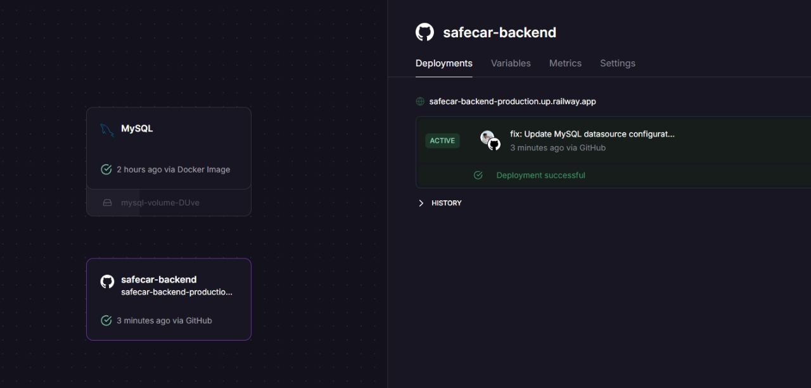

<p align="justify">
La imagen muestra a continuación la SafeCar API ejecutándose correctamente en el entorno de despliegue, evidenciando que los endpoints expuestos mediante Swagger/OpenAPI han sido publicados de forma exitosa. Se observan las rutas correspondientes a los bounded contexts de IAM, Devices, Workshop, Payments e Insights, lo cual confirma que el servicio inició sin errores, que las operaciones REST están registradas adecuadamente y que la API está disponible para ser consumida por los clientes web y móvil.
</p>
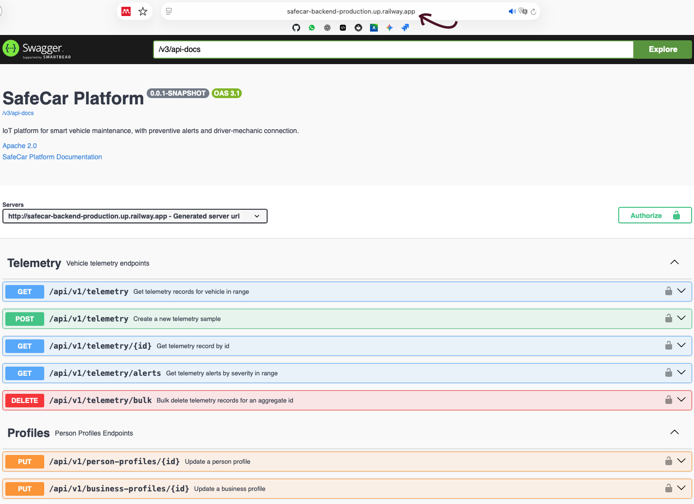

<b>Aplicación Web - Netlify</b>

<p align="justify">
La imagen que se muestra a continuación presenta la Aplicación Web desplegada en Netlify: se observa la URL pública, el estado del deploy y los registros del build (logs). Esta evidencia confirma que la Web App fue construida y publicada correctamente, está accesible públicamente y consume las APIs del Backend para mostrar datos operativos (órdenes, telemetría y alertas) a usuarios de talleres y administradores.
</p>


<b>Mobile Web Application</b>

<p align="justify">
Las imagenes que se muestra a continuación presenta la Aplicación Móvil desplegada en Firebase Hosting: se observa la URL pública, el estado del deploy y los registros del build (logs). Esta evidencia confirma que la Mobile App fue construida y publicada correctamente, está accesible públicamente y consume las APIs del Backend para mostrar datos operativos.
</p>

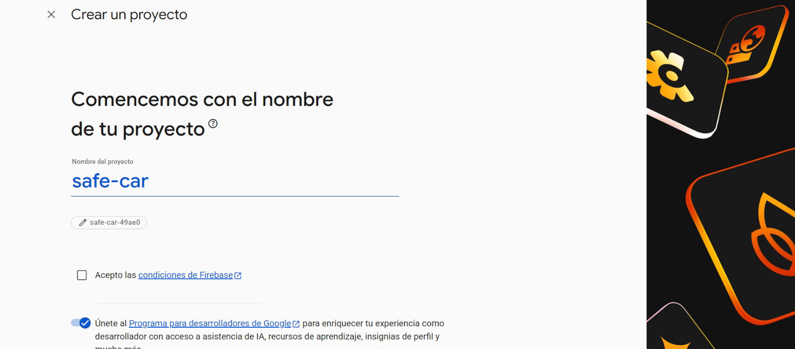
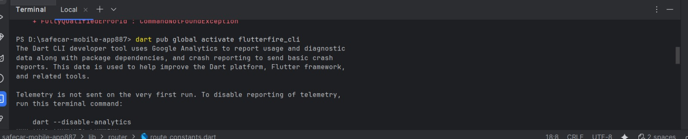
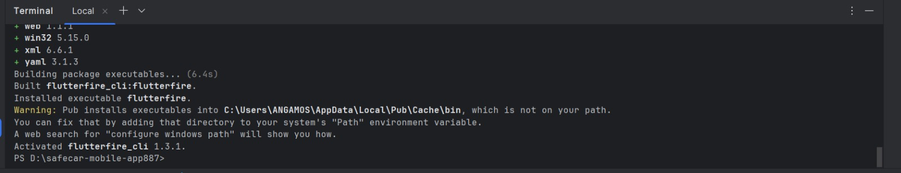

#### 6.2.2.9. Team Collaboration Insights during Sprint

<p align="justify">
Finalmente, se presentan los insights de colaboración del equipo durante el Sprint 2, basados en las métricas de contribución y actividad de los repositorios. Este análisis permite evaluar la distribución del esfuerzo y la efectividad de la comunicación técnica entre los miembros del equipo en la implementación de la arquitectura distribuida.
</p>

### 6.3.2. Sprint 3

#### 6.3.2.1. Sprint Planning 3

<p align="justify">
El Sprint 3 marca el inicio del proceso de desarrollo del servicio Edge para el proyecto SafeCar, al mismo tiempo el desarrollo de los prototipos del sistema embebido y su transmisión de datos a la plataforma.
</p>

<table width="100%">
    <tr>
        <th>Sprint #</th>
        <th>Sprint 3</th>
    </tr>
    <tr>
        <td colspan="2">Sprint Planning Background</td>
        <td></td>
    </tr>
    <tr>
        <td>Date</td>
        <td>2025-11-10</td>
    </tr>
    <tr>
        <td>Time</td>
        <td>10:20 AM</td>
    </tr>
    <tr>
        <td>Location</td>
        <td align="justify">
        La reunión fue llevada a cabo de manera virtual mediante la plataforma de Google Meet.
        </td>
    </tr>
    <tr>
        <td>Prepared By</td>
        <td>
        Zavala Quedena, Gonzalo Andre
        </td>
    </tr>
    <tr>
        <td>Attendees (to planning meeting)</td>
        <td>
        Zavala Quedena, Gonzalo Andre / Holguin Gamarra, Hardie Alfonso / Mendoza Solis, Javier Kenyi / Aguirre Rodríguez, Gustavo Jandroel / Irigoyen Matos, Javier Sharvel / Burga Loarte, Anaely Zarely
        </td>
    </tr>
    <tr>
      <td>Sprint - Review Summary</td>
      <td align="justify">
        El Sprint 2 consiguió desplegar la primera versión funcional del backend conectando las capacidades de gestión de cuentas y vehículos con la Web App, permitiendo que los usuarios se registren, inicien sesión y administren información básica de sus vehículos sobre una API unificada. Se avanzó en la definición de endpoints para citas y asociación de vehículos a talleres, y se establecieron pipelines iniciales de despliegue para el backend y la aplicación web. La aplicación móvil incorporó pantallas de autenticación y listado de vehículos, aunque aún operando en su mayoría con datos simulados. Se mantuvieron como pendientes la integración de la capa Edge para telemetría en tiempo real, la exposición de recomendaciones basadas en datos del vehículo, el ajuste de la landing a los segmentos “talleres” y “conductores” y la ausencia de pruebas automatizadas, que por capacidad y tiempos no pudieron ser abordadas en esta iteración.
      </td>
    </tr>
    <tr>
      <td>Sprint - Retrospective Summary</td>
      <td align="justify">
        En la retrospectiva del Sprint 2 el equipo reconoció mejoras respecto al primer sprint, especialmente en la adopción de GitFlow, el uso de ramas de feature y la introducción de revisiones por Pull Request, lo que redujo conflictos en <code>main</code> y facilitó el seguimiento de cambios. No obstante, se identificaron como puntos débiles la sobreestimación de la capacidad (al comprometer 86 Story Points y completar menos de lo planificado), la concentración de trabajo complejo en pocos integrantes de backend, historias excesivamente grandes que dificultaron el flujo y la imposibilidad de implementar la batería de pruebas planificada. Como mejoras accionables se acordó acotar el alcance del Sprint 3 a un flujo vertical end-to-end centrado en telemetría y recomendaciones, dividir las historias técnicas en incrementos más pequeños, proteger bloques de tiempo para la integración Edge–backend–Web/Mobile y priorizar la documentación mínima y las pruebas básicas de integración sobre nuevas funcionalidades accesorias.
      </td>
    </tr>
    <tr>
        <td colspan="2">Sprint Goal & User Stories</td>
        <td></td>
    </tr>
    <tr>
        <td>Sprint 3 Goal</td>
        <td align="justify">
          <strong>Nuestro enfoque está en</strong> habilitar el flujo end-to-end de datos telemétricos desde el sistema embebido (ESP32 y sensores) hacia el backend de SafeCar mediante el servicio Edge, para que dichos datos puedan ser consumidos por la aplicación web, la aplicación móvil y los talleres, al mismo tiempo que refinamos la web de negocio para comunicar claramente la propuesta de valor tanto a talleres mecánicos como a conductores.
          <br><br>
          <strong>Creemos que esto permite</strong> que los conductores reciban recomendaciones concretas sobre el estado de su vehículo y próximos mantenimientos basadas en datos reales, y que los talleres visualicen las lecturas telemétricas y recomendaciones asociadas a cada vehículo para acelerar el diagnóstico y la planificación de servicios. Además, brinda al equipo de desarrollo una base estable para incorporar nuevas capacidades de análisis y comunicación (por ejemplo, futuros módulos de Alerts) sin re-trabajar la integración con el hardware.
          <br><br>
          <strong>Esto se confirmará cuando</strong> al menos un dispositivo ESP32 pueda enviar lecturas de telemetría que sean recibidas por el servicio Edge, almacenadas y expuestas por el backend, y luego visibles en las interfaces de conductor y taller en no más de cinco interacciones; cuando se pueda generar al menos una recomendación de mantenimiento basada en dichos datos para un vehículo de prueba; cuando la web de negocio cuente con secciones diferenciadas para talleres y conductores (beneficios, planes y llamados a la acción); y cuando el flujo principal de telemetría y recomendaciones se ejecute con una tasa de éxito superior al 90% en pruebas manuales y de integración.
        </td>
    </tr>
    <tr>
       <td>Sprint 3 Velocity</td>
        <td align="justify">
        Basándose en el rendimiento real del Sprint 2, en el que se completaron aproximadamente 64 Story Points de los 86 comprometidos, el equipo establece una velocidad objetivo de 64 Story Points para el Sprint 3. Este ajuste refleja una planificación más realista frente a la complejidad adicional que implica integrar hardware, servicio Edge y backend, así como realizar ajustes en la Web de Negocio. Esta métrica se utilizará para validar la capacidad del equipo en un contexto donde la prioridad es completar un flujo vertical de telemetría y recomendaciones funcional, en lugar de maximizar la cantidad de historias en paralelo.
        </td>
    </tr>
    <tr>
        <td>Sum of Story Points</td>
        <td>64</td>
    </tr>
</table>


#### 6.3.2.2. Aspect Leaders and Collaborators

<p align="justify">
Para el Sprint 3, la matriz de asignación de responsabilidades se ha reconfigurado para abordar los desafíos de la integración IoT y el desarrollo Edge. Los roles de liderazgo y colaboración (LACX) se distribuyen ahora entre los componentes críticos de telemetría y seguridad en el borde, así como en el desarrollo de firmware para los sistemas embebidos, garantizando una cobertura técnica especializada para cada capa de la solución.
</p>

<table width="100%">
    <tr>
        <th>Team Member (Last Name, First Name)</th>
        <th>GitHub Username</th>
        <th>Edge IAM</th>
        <th>Edge Telemetry</th>
        <th>Edge Embedded App</th>
        <th>Cabine Embedded App</th>
    </tr>
    <tr>
        <td>Janover Gonzalo Saldaña Vela</td>
        <td>JanoverSaldana</td>
        <td align="center">L</td>
        <td align="center">C</td>
        <td align="center">-</td>
        <td align="center">C</td>
    </tr>
    <tr>
        <td>Hardie Alfonso Holguin Gamarra</td>
        <td>HOLGUINUPC</td>
        <td align="center">C</td>
        <td align="center">L</td>
        <td align="center">C</td>
        <td align="center">-</td>
    </tr>
    <tr>
        <td>Javier Kenyi Mendoza Solis</td>
        <td>Kenyi-Mendoza-Solis</td>
        <td align="center">-</td>
        <td align="center">C</td>
        <td align="center">L</td>
        <td align="center">-</td>
    </tr>
    <tr>
        <td>Javier Sharvel Irigoyen Matos</td>
        <td>sharvel-irigoyen</td>
        <td align="center">-</td>
        <td align="center">-</td>
        <td align="center">C</td>
        <td align="center">L</td>
    </tr>
    <tr>
        <td>Gustavo Jandroel Aguirre Rodríguez</td>
        <td>Jandroel</td>
        <td align="center">C</td>
        <td align="center">-</td>
        <td align="center">L</td>
        <td align="center">-</td>
    </tr>
    <tr>
        <td>Anaely Zarely Burga Loarte</td>
        <td>userxx1000</td>
        <td align="center">-</td>
        <td align="center">C</td>
        <td align="center">-</td>
        <td align="center">C</td>
    </tr>
    <tr>
        <td>Gonzalo Andre Zavala Quedena</td>
        <td>GonzaloQu3dena</td>
        <td align="center">L</td>
        <td align="center">-</td>
        <td align="center">C</td>
        <td align="center">-</td>
    </tr>
</table>


6.3.2.3. Sprint Backlog 3

6.3.2.4. Development Evidence for Sprint Review

6.3.2.5. Testing Suite Evidence for Sprint Review
<p align="justify">
Esta sección documenta la evidencia de las actividades de aseguramiento de calidad realizadas durante el Sprint 3. Se incluyen los resultados de las pruebas unitarias ejecutadas para validar los nuevos componentes del backend asegurando la robustez de los servicios críticos como autenticación y gestión de vehículos.
</p>

**Pruebas Unitarias**

<table width="100%">
  <tr>
    <td width="70%">
      Se realizaron a continuacion las pruebas unitarias respetando la arquitectura de carpetas Domain Driven Design (DDD) y los nombres de los archivos finalizando con el postfijo <code>Test</code>.
    </td>
    <td width="30%" align="right">
      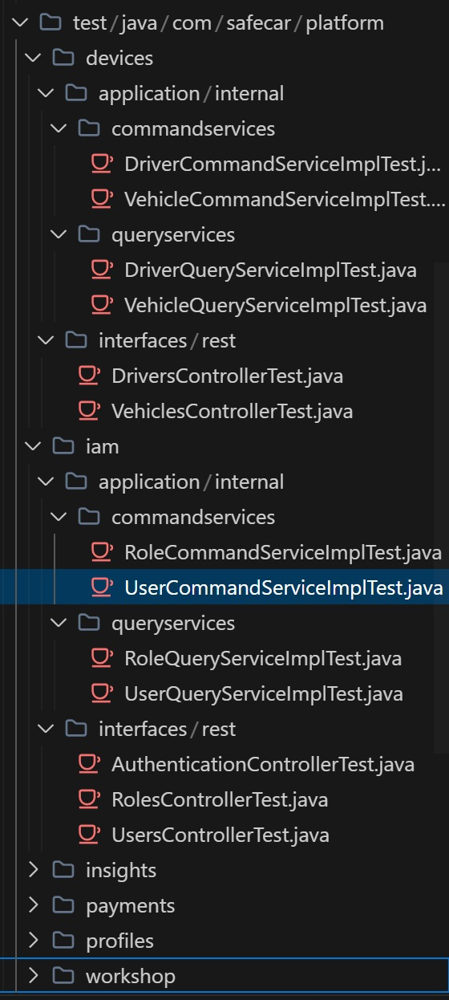
    </td>
  </tr>
</table>

<table width="100%">
  <tr>
    <th width="50%">Resultado de las Pruebas Unitarias</th>
    <th width="30%">Descripción</th>
    <th width="20%">Resultado</th>
  </tr>
  <tr>
    <td>
      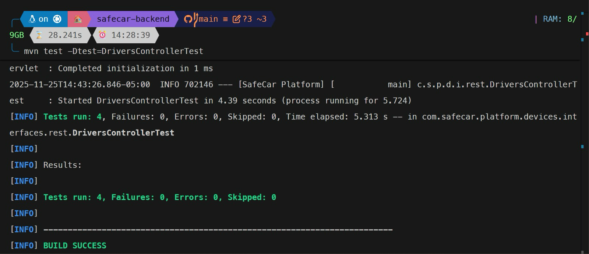
    </td>
    <td align="justify">
      Evidencia de las pruebas unitarias del controlador de Drivers, verificando la creación, actualización, listado y eliminación de conductores. Se valida que las respuestas HTTP sean correctas, que la lógica de negocio se ejecute según lo esperado y que no se produzcan errores durante la ejecución de los endpoints.
    </td>
    <td align="center">Todo los test pasaron correctamente.</td>
  </tr>
  <tr>
    <td>
      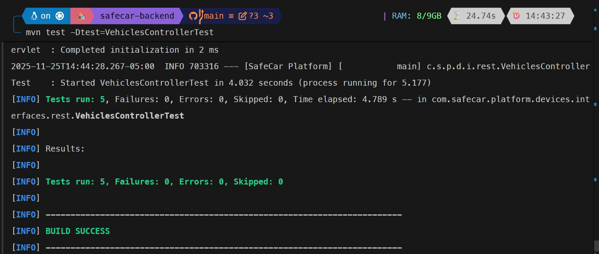
    </td>
    <td align="justify">
      Evidencia de las pruebas unitarias del controlador de Vehicles, donde se comprueba el registro, consulta y actualización de vehículos asociados a los conductores y talleres. Las pruebas aseguran que los servicios de gestión de vehículos respondan con el formato y los códigos de estado HTTP esperados.
    </td>
    <td align="center">Todo los test pasaron correctamente.</td>
  </tr>
  <tr>
    <td>
      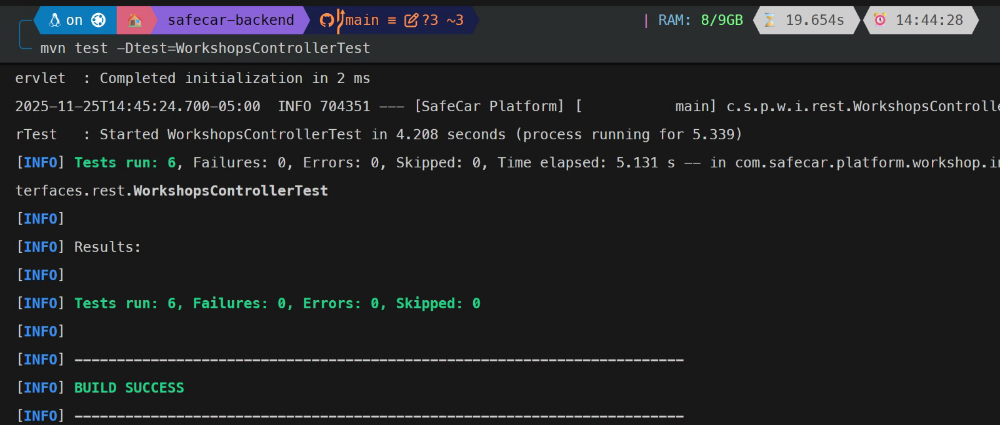
    </td>
    <td align="justify">
      Evidencia de las pruebas unitarias del controlador de Workshops, enfocadas en la creación, edición y consulta de talleres registrados en la plataforma. Se valida que las operaciones sobre talleres se procesen correctamente y que el backend mantenga la integridad de la información expuesta por los endpoints.
    </td>
    <td align="center">Todo los test pasaron correctamente.</td>
  </tr>
</table>

6.3.2.6. Execution Evidence for Sprint Review

6.3.2.7. Services Documentation Evidence for Sprint Review

6.3.2.8. Software Deployment Evidence for Sprint Review

6.3.2.9. Team Collaboration Insights during Sprint

## 6.3. Validation Interviews
### 6.3.1. Diseño de Entrevistas

<p align="justify">
En esta sección se detalla el diseño metodológico empleado para la realización de entrevistas y pruebas de validación de la solución SafeCar. El objetivo principal de estas actividades fue evaluar la usabilidad, claridad funcional y pertinencia de los módulos desarrollados tanto para el segmento de conductores (aplicación móvil) como para talleres mecánicos (interfaz web). Las entrevistas se estructuraron siguiendo buenas prácticas de investigación UX, permitiendo recopilar percepciones, dificultades, expectativas y sugerencias de los perfiles simulados que representan a los usuarios finales del sistema.
</p>

<p align="justify">
La validación se realizó en función de las funcionalidades desarrolladas, poniendo especial énfasis en los procesos críticos del flujo de interacción: registro de usuarios y vehículos, visualización de alertas, creación y gestión de citas, revisión de historial de servicios y administración de solicitudes en talleres. Las preguntas se diseñaron para comprender los comportamientos del usuario, identificar puntos de fricción y asegurar que la interfaz responda adecuadamente a las necesidades específicas de cada segmento.
</p>

---

#### Guion de Entrevistas (General)

<p align="justify">
El siguiente guion fue aplicado como marco base para todas las sesiones de validación, permitiendo mantener consistencia en la recopilación de datos. Incluye preguntas de apertura orientadas a entender el perfil digital del usuario y su familiaridad con herramientas tecnológicas.
</p>

**Preguntas de apertura:**

- ¿Cuál es tu nombre?  
- ¿En qué trabajas actualmente?  
- ¿Qué tipo de herramientas digitales usas en tu día a día?  
- ¿Te consideras usuario básico, intermedio o avanzado de apps móviles?

---

#### Preguntas Específicas – Conductores (App Móvil)

<p align="justify">
Para los conductores, el objetivo fue evaluar la claridad del flujo de la aplicación.
</p>

- ¿Qué te pareció el proceso de registrar un vehículo?  
- ¿La interfaz  es fácil de interpretar?  
- ¿El flujo para crear, reprogramar o cancelar citas fue claro?  
- ¿Hubo algo que no entendiste o que cambiarías del flujo?  
- ¿Qué es lo que más te gustó de la aplicación móvil?  
- ¿Qué crees que podemos mejorar?

---

#### Preguntas Específicas – Talleres Mecánicos (Web)

<p align="justify">
Para los talleres mecánicos, las preguntas se orientaron a validar la claridad del proceso de registro del taller, la utilidad del módulo de gestión de solicitudes, la comprensión de la información operativa, la eficiencia para asignar mecánicos y la facilidad para actualizar el estado de las citas o registrar notas adicionales.
</p>

- ¿El proceso de registro del taller fue claro?  
- ¿Cómo percibes las vistas?  
- ¿La información clave de una cita (cliente, vehículo, servicio, estado) es fácil de encontrar?  
- ¿Qué tan intuitivo es asignar un mecánico a una cita?  
- ¿El historial de servicios te parece útil para diagnosticar?  
- ¿Qué tan claro es el flujo para actualizar estados o agregar notas?  
- ¿Qué parte del sistema te resultó más útil?  
- ¿Qué mejorarías de la interfaz o los textos?

### 6.3.2. Registro de Entrevistas
### 6.3.3. Evaluación según heurísticas

## 6.4. Video About-the-Product

## Anexos 
### Anexo A. GitHub Repositories
Link de la organización MetaSoft: https://github.com/MetaSoft-IOT

<table>
    <tr>
        <th>Repository</th>
        <th>Link to Repository</th>
        <th>Descripción</th>
    </tr>
    <tr>
        <td>SafeCar-report</td>
        <td>https://github.com/metasoft-iot/upc-pre-202520-1asi0572-3479-MetaSoft-report</td>
        <td>Reporte final y documentación completa del proyecto SafeCar.</td>
    </tr>
    <tr>
        <td>SafeCar-backend</td>
        <td>https://github.com/metasoft-iot/safecar-backend</td>
        <td>Repositorio del backend y de la infraestructura para el desarrollo de SafeCar.</td>
    </tr>
    <tr>
        <td>SafeCar-web-app</td>
        <td>https://github.com/metasoft-iot/upc-1asi0572-2520-3479-iot-safecar-web-application-frontend</td>
        <td>Repositorio principal con el código fuente de la aplicación SafeCar.</td>
    </tr>
    <tr>
        <td>SafeCar-landing-page</td>
        <td>https://github.com/metasoft-iot/safecar-landing-page</td>
        <td>Landing Page de SafeCar.</td>
    </tr>
    <tr>
        <td>SafeCar-mobile-app</td>
        <td>https://github.com/metasoft-iot/safecar-mobile-app</td>
        <td>Repositorio principal con el código fuente de la aplicación móvil SafeCar.</td>
    </tr>
    <tr>
        <td>SafeCar-edge-service</td>
        <td>https://github.com/metasoft-iot/safecar-edge-service</td>
        <td>Repositorio del servicio edge para la recolección de datos telemétricos.</td>
    </tr>
</table>

### Anexo B. Videos de Exposiciones

<table>
    <tr>
        <th>Video</th>
        <th>Link to Video</th>
        <th>Descripción</th>
    </tr>
    <tr>
        <td>TB1</td>
        <td>https://upcedupe-my.sharepoint.com/:v:/g/personal/u202113656_upc_edu_pe/EX_2Lc6LkChFo1czg6Gtx84B4EMW3EkCYI47C5Ld27FTiQ?nav=eyJyZWZlcnJhbEluZm8iOnsicmVmZXJyYWxBcHAiOiJTdHJlYW1XZWJBcHAiLCJyZWZlcnJhbFZpZXciOiJTaGFyZURpYWxvZy1MaW5rIiwicmVmZXJyYWxBcHBQbGF0Zm9ybSI6IldlYiIsInJlZmVycmFsTW9kZSI6InZpZXcifX0%3D&e=QZmwoR</td>
        <td>Video explicativo del proyecto SafeCar para la primera entrega del proyecto</td>
    </tr>
    <tr>
        <td>TP</td>
        <td></td>
        <td>Video explicativo del proyecto SafeCar para la segunda entrega del proyecto</td>
    </tr>
    <tr>
        <td>TB2</td>
        <td></td>
        <td>Video explicativo del proyecto SafeCar para la tercera entrega del proyecto</td>
    </tr>
</table>

# Bibliografía

1. ResearchGate. (2023). A comprehensive cost-benefit analysis of preventive maintenance versus corrective maintenance: Assessing the financial impact and operational benefits in engineering. Recuperado de https://www.researchgate.net/publication/389501396_A_Comprehensive_Cost-Benefit_Analysis_of_Preventive_Maintenance_Versus_Corrective_Maintenance_Assessing_the_Financial_Impact_and_Operational_Benefits_in_Engineering
2. UpKeep Technologies. (2022). Maintenance statistics you need to know. Recuperado de https://upkeep.com/learning/maintenance-statistics/
3. National Center for Biotechnology Information (PMC). (2022). Predictive maintenance: A comprehensive review. Recuperado de https://pmc.ncbi.nlm.nih.gov/articles/PMC9890517/
4. ClickMaintain Fleet. (2024). Preventive maintenance vs reactive maintenance analysis. Recuperado de https://www.clickmaint.com/blog/preventive-maintenance-vs-reactive-maintenance-analysis
5. SimplyFleet. (2025). The truth about vehicle mileage & repair costs. Recuperado de https://www.simplyfleet.app/blog/vehicle-mileage-vs-repair-costs
6. Banco Interamericano de Desarrollo (BID). (2022). Estudios sobre movilidad urbana y parque vehicular en Latinoamérica. Recuperado de https://www.iadb.org/es
7. Deloitte. (2023). Global Automotive Consumer Study. Recuperado de https://www2.deloitte.com/global/en/pages/consumer-industrial-products/articles/automotive-consumer-study.html
8. Statista. (2023). Latin America: ride-hailing and delivery market growth. Recuperado de https://www.statista.com
9. Asociación Automotriz del Perú (AAP) & INEI. (2023, marzo 3). El 11.64% de hogares en el Perú poseen un vehículo. <span>Andina .pe.</span> Recuperado de https://andina.pe/agencia/noticia-el-1164-hogares-todo-peru-poseen-un-auto-o-camioneta-987911.aspx
10. Asociación Automotriz del Perú (AAP). (2021). Más de 70,000 talleres mecánicos necesitan capacitación en nuevas tecnologías. Recuperado de https://aap.org.pe/aap-mas-de-70000-talleres-mecanicos-necesitan-capacitacion-en-nuevas-tecnologias
11. TechSenati. (2022). Talleres automotrices en el Perú: condiciones actuales y necesidad de capacitación tecnológica. Recuperado de https://techsenati.edu.pe/talleres-automotrices-en-el-peru-cuales-son-sus-condiciones-actuales-y-por-que-necesitan-mayor-capacitacion-tecnologica
