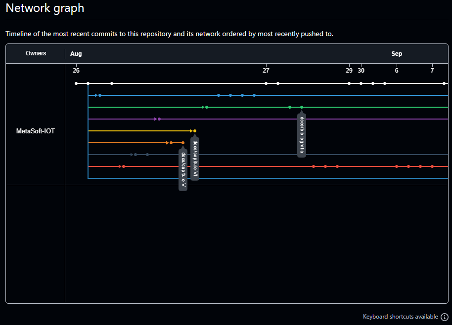
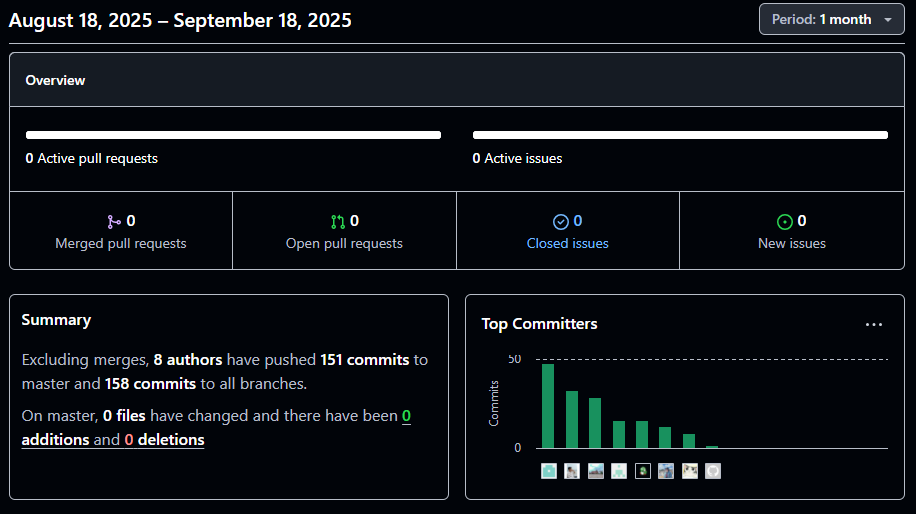
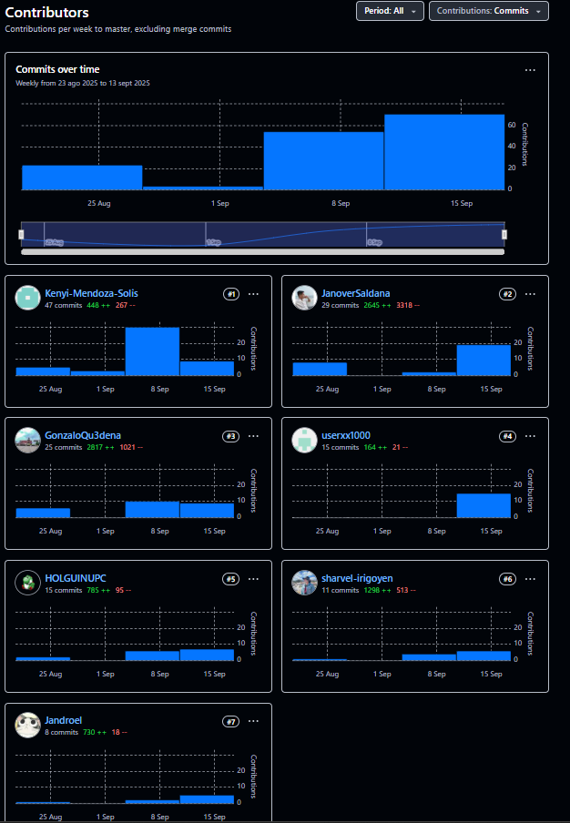

# Universidad Peruana de Ciencias Aplicadas
### Ingeniería de Software
### Curso: Desarrollo de Soluciones IOT (1ASI0572) - 3479

---

## "Informe de Trabajo Final"

# "Informe de Trabajo Final"
## Docente: Angel Augusto Velasquez Nuñez
## Startup: MetaSoft
## Producto: SafeCar

---

## Relación de Integrantes

| **Nombre Completo** | **Código de Estudiante** |
|---------------------|---------------------------|
| **Janover Gonzalo Saldaña Vela** | U20201B510 |
| **Hardie Alfonso Holguin Gamarra** | U202220250 |
| **Javier Kenyi Mendoza Solis** | U201824550 |
| **Gustavo Jandroel Aguirre Rodríguez** | U202124162 |
| **Javier Sharvel Irigoyen Matos** | U20221D156 |
| **Gonzalo Andre Zavala Quedena** | U202113656 |
| **Anaely Zarely Burga Loarte** | U202118264 |

UPC - 2520
---

 

## Registro de Versiones del Informe

<table>
    <thead>
        <tr>
            <th>Versión</th>
            <th>Fecha</th>
            <th>Autor</th>
            <th>Descripción de Modificación</th>
        </tr>
    </thead>
    <tbody>
        <!-- Fila 1-->
        <tr>
            <td>1.0</td>
            <td>03/09/2025</td>
            <td>Janover Gonzalo Saldaña Vela</td>
            <td>Facilitación y documentación inicial del taller de Event Storming, identificando los principales eventos y contextos del sistema.</td>
        </tr>
        <!-- Fila 2-->
        <tr>
            <td>1.1</td>
            <td>04/09/2025</td>
            <td>Hardie Alfonso Holguin Gamarra</td>
            <td>Participación activa en el mapeo de eventos clave y propuesta de mejoras en la segmentación de contextos.</td>
        </tr>
        <!-- Fila 3-->
        <tr>
            <td>1.2</td>
            <td>05/09/2025</td>
            <td>Gonzalo Andre Zavala Quedena</td>
            <td>Colaboración en la identificación de eventos y refinamiento de los límites de contexto durante el Event Storming.</td>
        </tr>
        <!-- Fila 4-->
        <tr>
            <td>1.3</td>
            <td>06/09/2025</td>
            <td>Javier Kenyi Mendoza Solis</td>
            <td>Aporte de ideas para la definición de eventos y sugerencias para la integración de los contextos descubiertos.</td>
        </tr>
        <!-- Fila 5-->
        <tr>
            <td>1.4</td>
            <td>07/09/2025</td>
            <td>Gustavo Jandroel Aguirre Rodríguez</td>
            <td>Apoyo en la organización visual del taller y registro de los eventos principales identificados.</td>
        </tr>
        <!-- Fila 6-->
        <tr>
            <td>1.5</td>
            <td>08/09/2025</td>
            <td>Javier Sharvel Irigoyen Matos</td>
            <td>Colaboración en la priorización de eventos y discusión sobre posibles mejoras en los flujos del sistema.</td>
        </tr>
        <!-- Fila 7-->
        <tr>
            <td>1.6</td>
            <td>09/09/2025</td>
            <td>Anaely</td>
            <td>Participación en la lluvia de ideas y aporte en la definición de eventos relevantes para el sistema.</td>
        </tr>
        <!-- Fila 8-->
        <tr>
            <td>1.7</td>
            <td>10/09/2025</td>
            <td>Janover Gonzalo Saldaña Vela</td>
            <td>Modelado de flujos de mensajes entre dominios y elaboración de los primeros Bounded Context Canvases.</td>
        </tr>
        <!-- Fila 9-->
        <tr>
            <td>1.8</td>
            <td>11/09/2025</td>
            <td>Hardie Alfonso Holguin Gamarra</td>
            <td>Refinamiento de los flujos de mensajes y validación de la coherencia entre los contextos definidos.</td>
        </tr>
        <!-- Fila 10-->
        <tr>
            <td>1.9</td>
            <td>12/09/2025</td>
            <td>Gonzalo Andre Zavala Quedena</td>
            <td>Apoyo en la documentación de los flujos de mensajes y revisión de los Bounded Context Canvases.</td>
        </tr>
        <!-- Fila 11-->
        <tr>
            <td>1.10</td>
            <td>13/09/2025</td>
            <td>Javier Kenyi Mendoza Solis</td>
            <td>Discusión y ajuste de los límites de contexto, asegurando la correcta separación de responsabilidades.</td>
        </tr>
        <!-- Fila 12-->
        <tr>
            <td>1.11</td>
            <td>13/09/2025</td>
            <td>Gustavo Jandroel Aguirre Rodríguez</td>
            <td>Validación de los modelos de contexto y sugerencias para optimizar la comunicación entre dominios.</td>
        </tr>
        <!-- Fila 13-->
        <tr>
            <td>1.12</td>
            <td>13/09/2025</td>
            <td>Javier Sharvel Irigoyen Matos</td>
            <td>Colaboración en la revisión final de los Bounded Context Canvases y aportes en la documentación.</td>
        </tr>
        <!-- Fila 14-->
        <tr>
            <td>1.13</td>
            <td>13/09/2025</td>
            <td>Anaely</td>
            <td>Participación en la consolidación de los contextos y revisión de los flujos de mensajes.</td>
        </tr>
        <!-- Fila 15-->
        <tr>
            <td>1.14</td>
            <td>13/09/2025</td>
            <td>Janover Gonzalo Saldaña Vela</td>
            <td>Coordinación del taller de Big Picture EventStorming y desarrollo del glosario de lenguaje ubicuo.</td>
        </tr>
        <!-- Fila 16-->
        <tr>
            <td>1.15</td>
            <td>13/09/2025</td>
            <td>Hardie Alfonso Holguin Gamarra</td>
            <td>Colaboración en la definición de términos clave y validación del lenguaje ubicuo con el equipo.</td>
        </tr>
        <!-- Fila 17-->
        <tr>
            <td>1.16</td>
            <td>13/09/2025</td>
            <td>Gonzalo Andre Zavala Quedena</td>
            <td>Apoyo en la elaboración del glosario y discusión sobre la alineación conceptual del equipo.</td>
        </tr>
        <!-- Fila 18-->
        <tr>
            <td>1.17</td>
            <td>13/09/2025</td>
            <td>Javier Kenyi Mendoza Solis</td>
            <td>Revisión y aportes en la definición de términos y conceptos del lenguaje ubicuo.</td>
        </tr>
        <!-- Fila 19-->
        <tr>
            <td>1.18</td>
            <td>13/09/2025</td>
            <td>Gustavo Jandroel Aguirre Rodríguez</td>
            <td>Participación en la validación del lenguaje ubicuo y sugerencias para su aplicación en el proyecto.</td>
        </tr>
        <!-- Fila 20-->
        <tr>
            <td>1.19</td>
            <td>13/09/2025</td>
            <td>Javier Sharvel Irigoyen Matos</td>
            <td>Colaboración en la integración del lenguaje ubicuo en la documentación del proyecto.</td>
        </tr>
        <!-- Fila 21-->
        <tr>
            <td>1.20</td>
            <td>13/09/2025</td>
            <td>Anaely</td>
            <td>Apoyo en la revisión final del glosario y aportes en la comunicación del equipo.</td>
        </tr>
        <!-- Fila 22-->
        <tr>
            <td>1.21</td>
            <td>13/09/2025</td>
            <td>Gonzalo Andre Zavala Quedena</td>
            <td>Redacción y estructuración completa del Capítulo I, incluyendo perfiles y segmentos objetivo.</td>
        </tr>
        <!-- Fila 23-->
        <tr>
            <td>1.22</td>
            <td>13/09/2025</td>
            <td>Gonzalo Andre Zavala Quedena</td>
            <td>Elaboración de User Personas para el Capítulo III, detallando arquetipos y necesidades de usuarios.</td>
        </tr>
        <!-- Fila 24-->
        <tr>
            <td>1.23</td>
            <td>13/09/2025</td>
            <td>Hardie Alfonso Holguin Gamarra</td>
            <td>Definición de problemáticas y supuestos en el proceso Lean UX, aportando ideas para el canvas.</td>
        </tr>
        <!-- Fila 25-->
        <tr>
            <td>1.24</td>
            <td>13/09/2025</td>
            <td>Javier Kenyi Mendoza Solis</td>
            <td>Análisis de competidores y redacción del apartado de estrategias frente a la competencia.</td>
        </tr>
        <!-- Fila 26-->
        <tr>
            <td>1.25</td>
            <td>13/09/2025</td>
            <td>Gonzalo Andre Zavala Quedena</td>
            <td>Diseño de la guía de entrevistas para la recolección de información de usuarios.</td>
        </tr>
        <!-- Fila 27-->
        <tr>
            <td>1.26</td>
            <td>13/09/2025</td>
            <td>Hardie Alfonso Holguin Gamarra</td>
            <td>Registro y sistematización de las entrevistas realizadas a usuarios clave.</td>
        </tr>
        <!-- Fila 28-->
        <tr>
            <td>1.27</td>
            <td>13/09/2025</td>
            <td>Javier Kenyi Mendoza Solis</td>
            <td>Documentación de hallazgos y aprendizajes obtenidos en las entrevistas con usuarios.</td>
        </tr>
        <!-- Fila 29-->
        <tr>
            <td>1.28</td>
            <td>13/09/2025</td>
            <td>Javier Sharvel Irigoyen Matos</td>
            <td>Colaboración en el registro y análisis de entrevistas, aportando perspectivas adicionales.</td>
        </tr>
        <!-- Fila 30-->
        <tr>
            <td>1.29</td>
            <td>13/09/2025</td>
            <td>Anaely</td>
            <td>Desarrollo de segmentos objetivo y apoyo en la elaboración del empathy mapping.</td>
        </tr>
        <!-- Fila 31-->
        <tr>
            <td>1.30</td>
            <td>15/09/2025</td>
            <td>Gonzalo Andre Zavala Quedena</td>
            <td>Elaboración de los diagramas de arquitectura de software a nivel de contenedores y contexto, asegurando claridad en la visión del sistema.</td>
        </tr>
        <!-- Fila 32-->
        <tr>
            <td>1.31</td>
            <td>15/09/2025</td>
            <td>Gustavo Jandroel Aguirre Rodríguez</td>
            <td>Desarrollo del diagrama de landscape del sistema, integrando los principales componentes tecnológicos.</td>
        </tr>
        <!-- Fila 33-->
        <tr>
            <td>1.32</td>
            <td>13/09/2025</td>
            <td>Hardie Alfonso Holguin Gamarra</td>
            <td>Diseño y documentación del Impact Mapping para alinear objetivos y funcionalidades del sistema.</td>
        </tr>
        <!-- Fila 34-->
        <tr>
            <td>1.33</td>
            <td>13/09/2025</td>
            <td>Janover Gonzalo Saldaña Vela</td>
            <td>Coordinación y consolidación del Product Backlog, integrando los aportes de todo el equipo.</td>
        </tr>
        <!-- Fila 35-->
        <tr>
            <td>2.0</td>
            <td></td>
            <td></td>
            <td></td>
        </tr>
    </tbody>
</table>

## Project Report Collaboration Insights

**URL del repositorio para el reporte del proyecto:** Enlace al repositorio:  
https://github.com/MetaSoft-IOT/upc-pre-202520-1asi0572-3479-MetaSoft-report

Github Collaboration Insights proporciona un cronograma que muestra las principales ramas y los procesos de fusión que han ocurrido. Todas las ramas se han generado siguiendo los principios de GitFlow, lo que garantiza una organización efectiva al utilizar un sistema de control de versiones.

* Janover Gonzalo Saldaña Vela (JanoverSaldana)
* Hardie Alfonso Holguin Gamarra (HOLGUINUPC)
* Javier Kenyi Mendoza Solis (Kenyi-Mendoza-Solis)
* Gustavo Jandroel Aguirre Rodríguez  (Jandroel)
* Javier Sharvel Irigoyen Matos (sharvel-irigoyen)
* Anaely Burga Loarte (userxx1000)

Se dividieron las siguientes ramas para la colaboración en el proyecto:

* master
* chapter-I
* chapter-II
* chapter-III
* chapter-IV
* chapter-V
* develop
* annexes
* release-v1.0

### ENTREGABLE TB1

A continuación se presentan los gráficos de colaboración de los integrantes del equipo en el repositorio de nuestro primer sprint. Estos gráficos ofrecen una representación visual de la cantidad de contribuciones realizadas por cada miembro del equipo, junto con la fecha en que se llevaron a cabo. Además, se presenta información sobre la cantidad de líneas de código que se han modificado en cada uno de los commits.

**Gráficos de colaboración de los integrantes del equipo**

<<<<<<< HEAD

=======

### ENTREGABLE TRABAJO PARCIAL (TP)

A continuación se presentan los gráficos de colaboración de los integrantes del equipo en el
repositorio de nuestro segundo sprint. Estos gráficos ofrecen una representación visual de la cantidad
de contribuciones realizadas por cada miembro del equipo, junto con la fecha en que se llevaron a
cabo. Además, se presenta información sobre la cantidad de líneas de código que se han modificado
en cada uno de los commits.

>>>>>>> develop

## Tabla de Contenido

### **Capítulo I: Introducción**
**1.1. Startup Profile**  
1.1.1. Descripción de la Startup  
1.1.2. Perfiles de integrantes del equipo  
**1.2. Solution Profile**  
1.2.1. Antecedentes y problemática  
1.2.2. Lean UX Process  
 1.2.2.1. Lean UX Problem Statements  
 1.2.2.2. Lean UX Assumptions  
 1.2.2.3. Lean UX Hypothesis Statements  
 1.2.2.4. Lean UX Canvas  
**1.3. Segmentos objetivo**

### **Capítulo II: Requirements Elicitation & Analysis**
**2.1. Competidores**  
2.1.1. Análisis competitivo  
2.1.2. Estrategias y tácticas frente a competidores  
**2.2. Entrevistas**  
2.2.1. Diseño de entrevistas  
2.2.2. Registro de entrevistas  
2.2.3. Análisis de entrevistas  
**2.3. Needfinding**  
2.3.1. User Personas  
2.3.2. User Task Matrix  
2.3.3. User Journey Mapping  
2.3.4. Empathy Mapping  
**2.4. Big Picture EventStorming**  
**2.5. Ubiquitous Language**

### **Capítulo III: Requirements Specification**
**3.1. User Stories**  
**3.2. Impact Mapping**  
**3.3. Product Backlog**

### **Capítulo IV: Solution Software Design**
**4.1. Strategic-Level Domain-Driven Design**  
4.1.1. Design-Level EventStorming  
 4.1.1.1. Candidate Context Discovery  
 4.1.1.2. Domain Message Flows Modeling  
 4.1.1.3. Bounded Context Canvases  
4.1.2. Context Mapping  
4.1.3. Software Architecture  
 4.1.3.1. Software Architecture System Landscape Diagram  
 4.1.3.2. Software Architecture Context Level Diagrams  
 4.1.3.3. Software Architecture Container Level Diagrams  
 4.1.3.4. Software Architecture Deployment Diagrams  
**4.2. Tactical-Level Domain-Driven Design**  
4.2.X. Bounded Context: \<Bounded Context Name\>  
 4.2.X.1. Domain Layer  
 4.2.X.2. Interface Layer  
 4.2.X.3. Application Layer  
 4.2.X.4. Infrastructure Layer  
 4.2.X.5. Bounded Context Software Architecture Component Level Diagrams  
 4.2.X.6. Bounded Context Software Architecture Code Level Diagrams  
  4.2.X.6.1. Bounded Context Domain Layer Class Diagrams  
  4.2.X.6.2. Bounded Context Database Design Diagram  

### **Capítulo V: Solution UI/UX Design**
**5.1. Style Guidelines**  
5.1.1. General Style Guidelines  
5.1.2. Web, Mobile and IoT Style Guidelines  
**5.2. Information Architecture**  
5.2.1. Organization Systems  
5.2.2. Labeling Systems  
5.2.3. SEO Tags and Meta Tags  
5.2.4. Searching Systems  
5.2.5. Navigation Systems  
**5.3. Landing Page UI Design**  
5.3.1. Landing Page Wireframe  
5.3.2. Landing Page Mock-up  
**5.4. Applications UX/UI Design**  
5.4.1. Applications Wireframes  
5.4.2. Applications Wireflow Diagrams  
5.4.3. Applications Mock-ups  
5.4.4. Applications User Flow Diagrams  
**5.5. Applications Prototyping**

### **Capítulo VI: Product Implementation, Validation & Deployment**
**6.1. Software Configuration Management**  
6.1.1. Software Development Environment Configuration  
6.1.2. Source Code Management  
6.1.3. Source Code Style Guide & Conventions  
6.1.4. Software Deployment Configuration  
**6.2. Landing Page, Services & Applications Implementation**  
6.2.X. Sprint n  
 6.2.X.1. Sprint Planning n  
 6.2.X.2. Aspect Leaders and Collaborators  
 6.2.X.3. Sprint Backlog n  
 6.2.X.4. Development Evidence for Sprint Review  
 6.2.X.5. Testing Suite Evidence for Sprint Review  
 6.2.X.6. Execution Evidence for Sprint Review  
 6.2.X.7. Services Documentation Evidence for Sprint Review  
 6.2.X.8. Software Deployment Evidence for Sprint Review  
 6.2.X.9. Team Collaboration Insights during Sprint  
**6.3. Validation Interviews**  
6.3.1. Diseño de Entrevistas  
6.3.2. Registro de Entrevistas  
6.3.3. Evaluaciones según heurísticas  
**6.4. Video About-the-Product**

### **Secciones Finales**
**Conclusiones**  
**Conclusiones y recomendaciones**  
**Video About-the-Team**  
**Bibliografía**  
**Anexos**

## Student Outcome

La capacidad de funcionar efectivamente en un equipo cuyos miembros juntos proporcionan liderazgo, crean un entorno de colaboración e inclusivo, establecen objetivos, planifican tareas y cumplen objetivos. En el siguiente cuadro se describe las acciones realizadas y enunciados de conclusiones por parte del grupo, que permiten sustentar el haber alcanzado el logro del <b>ABET – EAC - Student Outcome 5.</b>

<table>
<thead>
<tr>
    <th style="text-align: center; width: 20%;"><strong>Criterio Específico</strong></th>
    <th style="text-align: center; width: 60%;"><strong>Acciones Realizadas</strong></th>
    <th style="text-align: center; width: 20%;"><strong>Conclusiones</strong></th>
</tr>
</thead>
<tbody>
<!-- ======================================= Criterio Específico 01 ======================================= -->
<tr>
    <td style="text-align: center; vertical-align: top;"><strong>Trabaja en equipo para proporcionar liderazgo en forma conjunta</strong></td>
    <td style="text-align: left; padding: 15px;">
        <!-- TB1 Section -->
        

            <h4 style="color: #2c3e50; margin-bottom: 10px;">Entregable TB1</h4>
            
<strong>Janover Gonzalo Saldaña Vela:</strong> Me encargué de la facilitación y documentación inicial del taller de Event Storming, identificando los principales eventos y contextos del sistema SafeCar. Posteriormente, dirigí el modelado de flujos de mensajes entre dominios y la elaboración de los primeros Bounded Context Canvases, asegurando la coherencia conceptual del proyecto. Además, coordiné el taller de Big Picture EventStorming y desarrollé el glosario de lenguaje ubicuo, estableciendo una terminología común para el equipo. Finalmente, consolidé el Product Backlog integrando los aportes de todos los miembros, garantizando la alineación entre los requisitos del usuario y la arquitectura del sistema.

            
<strong>Hardie Alfonso Holguin Gamarra:</strong> Realicé y ejecuté la entrevista del segmento talleres, documentando las respuestas del entrevistado y a partir de esta información elaboré la User Persona correspondiente y definí sus User Stories, asegurando la representación precisa de sus necesidades. Asimismo, participé en la construcción del Capítulo IV, III y II, y la sección Bounded Context Device Management, donde adapté y consolidé los contextos delimitados en base a SafeCar. Con estas actividades aseguré la coherencia entre los hallazgos de usuario y el diseño estratégico del sistema, contribuyendo al entendimiento del dominio como en la arquitectura planteada.

            
<strong>Javier Kenyi Mendoza Solis:</strong> Realicé y ejecuté la entrevista del segmento conductor con vehículo propio, documentando las respuestas del entrevistado y a partir de esta información elaboré la User Persona correspondiente y definí sus User Stories, asegurando la representación precisa de sus necesidades. Asimismo, participé en la construcción del Capítulo IV, desarrollando la sección Domain Message Flows Modeling, donde diseñé los flujos de mensajes de dominio para reflejar los procesos centrales de solicitud y gestión de mantenimientos, y la sección Bounded Context Canvases, donde adapté y consolidé los contextos delimitados de SafeCar. Con estas actividades aseguré la coherencia entre los hallazgos de usuario y el diseño estratégico del sistema, contribuyendo al entendimiento del dominio como en la arquitectura planteada.

            
<strong>Gustavo Jandroel Aguirre Rodríguez:</strong> Realicé y ejecuté la entrevista a un conductor con vehículo propio, sistematizando sus respuestas para identificar patrones de uso y necesidades relevantes. También participé activamente en el Big Picture Event Storming, donde contribuí a la identificación de eventos clave y a la definición colaborativa de los procesos centrales. Posteriormente, desarrollé el Ubiquitous Language, asegurando una terminología común entre el equipo y los dominios modelados. Además, elaboré los Bounded Context Canvases correspondientes a Workshop Operations y Admin and Billing, garantizando la correcta delimitación de responsabilidades y flujos en dichos contextos. Con estas actividades, aporté al liderazgo compartido del equipo, asegurando la coherencia entre la información recopilada, la visión estratégica y la arquitectura planteada.

            
<strong>Javier Sharvel Irigoyen Matos:</strong> Me encargué de la elaboración de los 9 <em>Bounded Context Canvases</em> del sistema SafeCar y diseñé en detalle el bounded context de <em>Driver Engagement</em>. Realicé entrevistas a conductores para levantar necesidades y comportamientos clave; a partir de ello, redacté historias de usuario con criterios de aceptación orientados a la gestión de citas (programación, reprogramación, confirmación y cierre), asegurando trazabilidad con el lenguaje ubicuo y el <em>context mapping</em>. Trabajé en equipo para proporcionar liderazgo de forma conjunta, facilitando decisiones arquitectónicas y la integración entre dominios, y garantizando la coherencia funcional con los objetivos del negocio.

            
<strong>Gonzalo Andre Zavala Quedena:</strong> Me encargué de la identificación y refinamiento de eventos, la documentación de los flujos de mensajes, la revisión y consolidación de los Bounded Context Canvases, la redacción y estructuración completa del Capítulo I (incluyendo perfiles y segmentos objetivo), la elaboración de User Personas para el Capítulo III, el diseño de la guía de entrevistas para usuarios y la elaboración de los diagramas de arquitectura de software a nivel de contenedores y contexto, asegurando claridad y cohesión en la visión del sistema.

        

        <!-- TP Section -->
        

            <h4 style="color: #2c3e50; margin-bottom: 10px;">Entregable TP</h4>
            
<strong>Janover Gonzalo Saldaña Vela:</strong> Me encargué del desarrollo del Capítulo VI "Product Implementation, Validation & Deployment", coordinando la implementación del Software Configuration Management y la documentación completa del Sprint 1. Dirigí la planificación del primer sprint, establecí la matriz de responsabilidades (LACX) para los aspectos del proyecto, y coordiné el Sprint Backlog con 49 tareas distribuidas entre los miembros del equipo. Además, me encargué de la implementación de los sistemas de autenticación y gestión de usuarios en la aplicación web durante el Sprint 1, asegurando la integración coherente entre los módulos de seguridad, historial de servicios y solicitudes de mantenimiento, estableciendo las bases técnicas para el desarrollo colaborativo del sistema SafeCar.

            
<strong>Hardie Alfonso Holguin Gamarra:</strong> Colaboré significativamente en el desarrollo del Capítulo V "Solution UI/UX Design", apoyando en la definición de elementos de seguridad y autenticación dentro de los wireframes y mockups del sistema SafeCar. Trabajé en conjunto con otros miembros del equipo en la creación de flujos de usuario relacionados con el login, registro y gestión de perfiles, asegurando que los aspectos de seguridad estuvieran bien integrados en la experiencia de usuario. Además, contribuí en la revisión y validación de los style guidelines y patrones de diseño propuestos por el equipo, aportando perspectivas sobre usabilidad y accesibilidad que complementaron el trabajo de diseño durante el Sprint 1.

            
<strong>Javier Kenyi Mendoza Solis:</strong> Me encargué del desarrollo de componentes clave del Capítulo V "Solution UI/UX Design", contribuyendo al diseño de la arquitectura de información y los sistemas de navegación de SafeCar. Participé activamente en la definición de wireframes y mockups para las aplicaciones, asegurando la coherencia visual y funcional entre los diferentes módulos del sistema. Además, aporté al refinamiento de las guidelines de estilo y la documentación de patrones de diseño, estableciendo estándares claros para la experiencia de usuario que facilitaron la implementación posterior en el Sprint 1, garantizando la alineación entre el diseño propuesto y las funcionalidades desarrolladas.

            
<strong>Gustavo Jandroel Aguirre Rodríguez:</strong> Me encargué del desarrollo de elementos fundamentales del Capítulo V "Solution UI/UX Design", enfocándome en la creación de wireframes, mockups y prototipos para la Landing Page y aplicaciones del sistema SafeCar. Dirigí la definición de los style guidelines generales y específicos para web, estableciendo la paleta de colores, tipografía y componentes reutilizables que aseguran consistencia visual. Además, coordiné las correcciones del Capítulo III, refinando el registro y análisis de entrevistas para mejorar la calidad de los insights de usuario, lo que permitió validar y ajustar las decisiones de diseño tomadas, garantizando que la experiencia de usuario propuesta responda efectivamente a las necesidades identificadas en la investigación.

            
<strong>Javier Sharvel Irigoyen Matos:</strong> Me encargué del desarrollo integral del Capítulo V "Solution UI/UX Design", coordinando la creación de wireframes, wireflow diagrams y mockups para todas las aplicaciones del sistema SafeCar. Dirigí el diseño de los user flow diagrams que mapean las interacciones clave de conductores y talleres, asegurando flujos intuitivos para la gestión de citas y servicios de mantenimiento. Además, me encargué del proceso de applications prototyping, creando prototipos interactivos que validan la experiencia de usuario propuesta y facilitan la comunicación de requisitos al equipo de desarrollo. Mi trabajo estableció los fundamentos visuales y de interacción que guiaron la implementación del Sprint 1, garantizando coherencia entre el diseño conceptual y la implementación técnica.

            
<strong>Gonzalo Andre Zavala Quedena:</strong> Me encargué del desarrollo técnico del Capítulo VI "Product Implementation, Validation & Deployment", coordinando la configuración completa del entorno de desarrollo y la implementación del Software Configuration Management. Dirigí la definición de las convenciones de código, el workflow de GitFlow, y la configuración de despliegue para todos los productos de SafeCar (Landing Page, Backend y WebApp). Además, me encargué de la implementación técnica del primer Sprint, coordinando el desarrollo de la Landing Page con soporte de internacionalización, sistemas de navegación responsivos, y la integración de componentes Vue.js con Options API durante el Sprint 1. Mi trabajo técnico aseguró la coherencia entre la arquitectura propuesta, las prácticas de desarrollo establecidas y la implementación funcional del sistema SafeCar en su primera iteración.

            
<strong>Anaely Zarely Burga Loarte:</strong> Contribuí significativamente al desarrollo del Capítulo V "Solution UI/UX Design", apoyando activamente en la creación de los style guidelines y la arquitectura de información del sistema SafeCar. Participé en el diseño de sistemas de organización y etiquetado que facilitan la navegabilidad y usabilidad de las aplicaciones, colaborando en el establecimiento de estándares claros para la presentación de contenido. Además, aporté al desarrollo de elementos de diseño para la Landing Page, contribuyendo con wireframes y mockups que definen la estructura visual y funcional de la página de inicio, asegurando que la propuesta de valor de SafeCar se comunique efectivamente a los usuarios potenciales y estableciendo bases sólidas para la implementación posterior del Sprint 1.

        

    </td>
    <td style="text-align: left; vertical-align: top; padding: 15px;">
        

            <h5 style="color: #e74c3c; margin-bottom: 8px;">TB1:</h5>
            
Durante el desarrollo del TB1, el equipo demostró una colaboración efectiva, distribuyendo roles y responsabilidades de manera equitativa. Destacó la gestión de versiones, la integración de aportes y la planificación conjunta, lo que permitió mantener la coherencia y calidad del entregable. El liderazgo compartido, la comunicación constante y la organización de tareas fueron claves para alcanzar los objetivos propuestos.
        

        

            <h5 style="color: #e74c3c; margin-bottom: 8px;">TP:</h5>
            
Durante el desarrollo del TP, el equipo consolidó su capacidad de liderazgo compartido, destacando en la implementación técnica del Capítulo VI y el diseño integral del Capítulo V. La coordinación entre el diseño UX/UI y la implementación técnica demostró madurez en la gestión de proyectos, mientras que la distribución equilibrada de responsabilidades entre configuration management, sprint planning, y desarrollo de interfaces aseguró la calidad y coherencia del sistema SafeCar implementado.

        

    </td>
</tr>
<!-- ======================================= Criterio Específico 02 ======================================= -->
<tr>
    <td style="text-align: center; vertical-align: top;"><strong>Crea un entorno colaborativo e inclusivo, establece metas planifica tareas y cumple objetivos.</strong></td>
    <td style="text-align: left; padding: 15px;">
        <!-- TB1 Section -->
        

            <h4 style="color: #2c3e50; margin-bottom: 10px;">Entregable TB1</h4>
            
<strong>Janover Gonzalo Saldaña Vela:</strong> Promoví un entorno colaborativo e inclusivo mediante la facilitación de talleres de Event Storming, donde aseguré la participación activa de todos los miembros del equipo. Establecí metas claras para cada fase del proyecto, planifiqué las tareas de modelado de dominios y flujos de mensajes, y cumplí los objetivos de documentación y consolidación del Product Backlog. Mi liderazgo en la coordinación del Big Picture EventStorming y el desarrollo del lenguaje ubicuo facilitó la comunicación efectiva entre los miembros, creando un marco común de entendimiento que fortaleció la cohesión del equipo.

            
<strong>Hardie Alfonso Holguin Gamarra:</strong> Colaboré activamente en el desarrollo del Bounded Context Security del Capítulo IV, trabajando en conjunto con el equipo para definir los aspectos de seguridad y autenticación del sistema SafeCar. Participé en la elaboración de los Domain Message Flows relacionados con la gestión de identidad y control de acceso, asegurando la integración coherente con otros contextos delimitados. Además, apoyé en la validación y revisión de los Bounded Context Canvases de otros miembros del equipo, contribuyendo con perspectivas adicionales sobre la arquitectura del sistema y facilitando la alineación conceptual entre todos los contextos definidos.

            
<strong>Javier Kenyi Mendoza Solis:</strong> Asumí un rol central en la recopilación, análisis y transformación de información clave, garantizando la alineación entre las necesidades de los usuarios y el diseño del sistema. Contribuí activamente a la construcción de entregables estratégicos, promoviendo la claridad conceptual, la coherencia metodológica y la calidad en la documentación generada, fortaleciendo así la visión y el avance del proyecto SafeCar.

            
<strong>Gustavo Jandroel Aguirre Rodríguez:</strong> Promoví un entorno colaborativo mediante la conducción de entrevistas y la integración de los hallazgos al trabajo grupal. Mi participación en el Big Picture Event Storming impulsó la discusión y alineación del equipo, lo que permitió una comprensión conjunta de los eventos que estructuran el dominio. Asimismo, al desarrollar el Ubiquitous Language, facilité un marco terminológico claro que fortaleció la comunicación y evitó ambigüedades entre los miembros. Finalmente, al elaborar los Bounded Contexts de Workshop Operations y Admin and Billing, contribuí a la planificación ordenada de tareas y a la definición precisa de objetivos en dichos módulos, asegurando la calidad y consistencia del avance del proyecto SafeCar.

            
<strong>Javier Sharvel Irigoyen Matos:</strong> Creé un entorno colaborativo e inclusivo facilitando espacios de trabajo donde todas las voces fueron consideradas; establecí metas claras por iteración (definir 9 <em>Bounded Context Canvases</em>, profundizar <em>Driver Engagement</em>, y cerrar historias de usuario con criterios de aceptación para la gestión de citas) y planifiqué las tareas de modelado, entrevistas a conductores, redacción de historias y validación del lenguaje ubicuo. Coordiné en conjunto con el equipo la priorización y los entregables, removiendo bloqueos y promoviendo acuerdos; como resultado, cumplimos los objetivos trazados: canvases consistentes, un BC de Driver Engagement listo para implementación y un set de historias alineadas al <em>context mapping</em> y a las necesidades reales de programación/reprogramación/confirmación de citas.

            
<strong>Gonzalo Andre Zavala Quedena:</strong> Asumí un rol central en la planificación, coordinación y ejecución de tareas clave, promoviendo la colaboración y comunicación entre los miembros. Me encargué de la integración de aportes, la estructuración de entregables, la elaboración de perfiles y segmentos objetivo, la documentación de procesos y la generación de artefactos fundamentales para el avance del equipo, asegurando el cumplimiento de los objetivos y la calidad del trabajo final.

        

        <!-- TP Section -->
        

            <h4 style="color: #2c3e50; margin-bottom: 10px;">Entregable TP</h4>
            
<strong>Janover Gonzalo Saldaña Vela:</strong> Creé un entorno colaborativo e inclusivo durante el desarrollo del Capítulo VI, estableciendo métodos de trabajo claros y facilitando la comunicación efectiva entre todos los miembros del equipo. Planifiqué las tareas del Sprint 1 de manera detallada, distribuyendo 49 tareas específicas entre los colaboradores según sus fortalezas y estableciendo la matriz LACX para garantizar responsabilidades claras. Cumplí objetivos ambiciosos al coordinar la implementación completa de los sistemas de autenticación, registro y gestión de perfiles de usuario, asegurando que cada módulo funcionara de manera integrada y que el equipo mantuviera un ritmo de desarrollo consistente y de alta calidad.

            
<strong>Hardie Alfonso Holguin Gamarra:</strong> Contribuí a crear un entorno colaborativo durante el desarrollo del Capítulo V, participando activamente en sesiones de trabajo grupales y facilitando la comunicación entre los miembros del equipo de diseño. Apoyé en la planificación sistemática de tareas relacionadas con la seguridad y autenticación del sistema, estableciendo metas claras para la integración de elementos de seguridad en la experiencia de usuario. Cumplí objetivos específicos al colaborar en la validación de wireframes y mockups, asegurando que los flujos de autenticación y registro fueran intuitivos y seguros, contribuyendo así al establecimiento de bases sólidas para la implementación del Sprint 1 y facilitando el trabajo colaborativo efectivo entre las áreas de diseño y desarrollo.

            
<strong>Javier Kenyi Mendoza Solis:</strong> Creé un ambiente de trabajo inclusivo durante el desarrollo del Capítulo V, promoviendo la participación activa de todos los miembros en las decisiones de diseño y estableciendo procesos colaborativos para la revisión de wireframes y mockups. Planifiqué las tareas de arquitectura de información de manera sistemática, definiendo entregables específicos para sistemas de navegación, organización y búsqueda que faciliten la usabilidad del sistema SafeCar. Cumplí objetivos de diseño establecidos al entregar documentación completa de patrones de interacción y guidelines que sirvieron como base sólida para la implementación técnica del Sprint 1, asegurando coherencia entre la experiencia de usuario diseñada y la funcionalidad implementada.

            
<strong>Gustavo Jandroel Aguirre Rodríguez:</strong> Promoví un entorno colaborativo e inclusivo durante el desarrollo del Capítulo V, facilitando sesiones de trabajo donde todos los miembros pudieron contribuir con ideas y feedback sobre los diseños propuestos. Establecí metas claras para la creación de wireframes, mockups y style guidelines, planificando iteraciones de diseño que permitieron refinar progresivamente la propuesta visual de SafeCar. Además, al coordinar las correcciones del Capítulo III, creé un marco de trabajo sistemático para mejorar la calidad de las entrevistas y análisis de usuario. Cumplí objetivos ambiciosos al entregar un sistema de diseño coherente y funcional, junto con insights de usuario refinados que validaron las decisiones tomadas, asegurando que el producto final responda efectivamente a las necesidades identificadas.

            
<strong>Javier Sharvel Irigoyen Matos:</strong> Creé un entorno colaborativo e inclusivo durante el desarrollo integral del Capítulo V, facilitando talleres de diseño donde todos los miembros del equipo pudieron contribuir con perspectivas valiosas sobre la experiencia de usuario. Establecí metas específicas y medibles para cada fase del diseño: wireframes detallados, wireflow diagrams completos, mockups de alta fidelidad y prototipos interactivos funcionales. Planifiqué las tareas de prototipado de manera iterativa, asegurando ciclos de feedback constantes que mejoraran la calidad del diseño. Cumplí objetivos complejos al entregar prototipos interactivos completamente funcionales que validaron los flujos de usuario para gestión de citas y servicios, proporcionando al equipo de desarrollo especificaciones claras y probadas que facilitaron la implementación exitosa del Sprint 1.

            
<strong>Gonzalo Andre Zavala Quedena:</strong> Creé un entorno colaborativo e inclusivo durante el desarrollo del Capítulo VI, estableciendo estándares de trabajo claros y facilitando la integración de aportes de todos los miembros del equipo en la configuración técnica del proyecto. Planifiqué meticulosamente las tareas de Software Configuration Management, definiendo objetivos específicos para la configuración del entorno de desarrollo, implementación de GitFlow, y establecimiento de convenciones de código que aseguraran la calidad y mantenibilidad del sistema. Cumplí objetivos técnicos complejos al coordinar la implementación exitosa del Sprint 1, integrando tecnologías como Vue.js con Options API, sistemas de internacionalización, y configuración de despliegue, mientras mantenía la coherencia entre todos los productos de SafeCar y facilitaba el trabajo colaborativo efectivo del equipo de desarrollo.

            
<strong>Anaely Zarely Burga Loarte:</strong> Contribuí activamente a crear un entorno colaborativo e inclusivo durante el desarrollo del Capítulo V, participando equitativamente en las decisiones de diseño y apoyando en el establecimiento de procesos de retroalimentación constructiva. Colaboré en la planificación de las tareas de style guidelines y arquitectura de información de manera sistemática, apoyando en las metas establecidas para sistemas de organización, etiquetado y presentación de contenido que mejoren la experiencia de usuario. Cumplí objetivos de diseño asignados al contribuir con wireframes y mockups para la Landing Page, junto con elementos de sistemas de información que facilitaron la navegación intuitiva del sistema SafeCar durante el Sprint 1, asegurando que la propuesta de valor se comunique efectivamente y estableciendo bases sólidas para el desarrollo posterior del equipo.

        

    </td>
    <td style="text-align: left; vertical-align: top; padding: 15px;">
        

            <h5 style="color: #e74c3c; margin-bottom: 8px;">TB1:</h5>
            
Durante el desarrollo del TB1, el equipo demostró una colaboración efectiva, distribuyendo roles y responsabilidades de manera equitativa. Destacó la gestión de versiones, la integración de aportes y la planificación conjunta, lo que permitió mantener la coherencia y calidad del entregable. El liderazgo compartido, la comunicación constante y la organización de tareas fueron claves para alcanzar los objetivos propuestos.

        

        

            <h5 style="color: #e74c3c; margin-bottom: 8px;">TP:</h5>
            
Durante el desarrollo del TP, el equipo demostró excelencia en la creación de entornos colaborativos e inclusivos, destacando en la planificación sistemática de tareas complejas y el cumplimiento exitoso de objetivos ambiciosos. La integración efectiva entre el diseño UX/UI del Capítulo V y la implementación técnica del Capítulo VI evidenció la madurez del equipo en gestión de proyectos multidisciplinarios. La distribución equilibrada de responsabilidades, los procesos de feedback iterativo y la coordinación entre diferentes áreas de expertise resultaron en entregables de alta calidad que establecieron bases sólidas para el sistema SafeCar.

        

    </td>
</tr>
</tbody>
</table>
