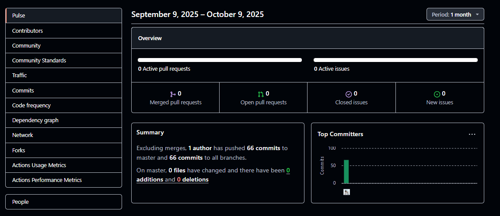

# Capítulo VI: Product Implementation, Validation & Deployment

## 6.1. Software Configuration Management

<p align="justify">
En esta sección el equipo MetaSoft establece las decisiones y convenciones fundamentales que permitirán mantener la consistencia durante todo el ciclo de vida del proyecto SafeCar. Se definen los estándares para la gestión del código fuente, configuración del entorno de desarrollo y despliegue de la solución, asegurando que todos los miembros del equipo trabajen bajo las mismas especificaciones y buenas prácticas de la industria.
</p>

### 6.1.1. Software Development Environment Configuration

<p align="justify">
En esta sección el equipo especifica, describe e indica los nombres de productos, el propósito de uso en el proyecto, la ruta de referencia (para software basado en modelos SaaS) o ruta de descarga (para productos que se ejecutan en el computador del miembro del equipo) de cada uno de los productos de software que deben utilizar los miembros del equipo para colaborar en el ciclo de vida de los productos digitales que forman la solución SafeCar. Se consideran todas las actividades de Project Management, Requirements Management, Product UX/UI Design, Software Development, Software Deployment y Software Documentation.
</p>

A continuación se detalla el **entorno de desarrollo** para SafeCar, indicando producto, propósito y ruta de acceso (SaaS o descarga). Todo el equipo debe instalar/usar estas herramientas para garantizar consistencia.

<table width="100%">
  <thead>
    <tr>
      <th>Categoría</th>
      <th>Producto</th>
      <th>Propósito en el proyecto</th>
      <th>Tipo</th>
      <th>Ruta de referencia / Descarga</th>
    </tr>
  </thead>
  <tbody>
    <tr>
      <td>Project Management</td>
      <td>Trello</td>
      <td>Gestión de backlog, Sprints, board Kanban, Definition of Done</td>
      <td>SaaS</td>
      <td><a href="https://trello.com/" target="_blank" rel="noopener noreferrer">https://trello.com/</a></td>
    </tr>
    <tr>
      <td>Requirements</td>
      <td>Google Docs / Sheets</td>
      <td>Redacción de requisitos, matrices, trazabilidad</td>
      <td>SaaS</td>
      <td><a href="https://docs.google.com/" target="_blank" rel="noopener noreferrer">https://docs.google.com/</a></td>
    </tr>
    <tr>
      <td>UX/UI Design</td>
      <td>Figma</td>
      <td>Wireframes, mockups, prototipos, handoff</td>
      <td>SaaS</td>
      <td><a href="https://www.figma.com/" target="_blank" rel="noopener noreferrer">https://www.figma.com/</a></td>
    </tr>
    <tr>
      <td>Repos &amp; CI</td>
      <td>GitHub</td>
      <td>Repositorios, PRs, Issues</td>
      <td>SaaS</td>
      <td><a href="https://github.com/" target="_blank" rel="noopener noreferrer">https://github.com/</a></td>
    </tr>
    <tr>
      <td>Editor</td>
      <td>Visual Studio Code</td>
      <td>Editor principal (HTML, JS, Tailwind, Vue)</td>
      <td>Desktop</td>
      <td><a href="https://code.visualstudio.com/" target="_blank" rel="noopener noreferrer">https://code.visualstudio.com/</a></td>
    </tr>
    <tr>
      <td>API Testing</td>
      <td>Postman</td>
      <td>Colecciones para pruebas de endpoints</td>
      <td>Desktop/SaaS</td>
      <td><a href="https://www.postman.com/" target="_blank" rel="noopener noreferrer">https://www.postman.com/</a></td>
    </tr>
    <tr>
      <td>Frontend Tooling</td>
      <td>Node.js (LTS) &amp; npm</td>
      <td>Construcción, scripts, Vue CLI, Vite</td>
      <td>Desktop</td>
      <td><a href="https://nodejs.org/" target="_blank" rel="noopener noreferrer">https://nodejs.org/</a></td>
    </tr>
    <tr>
      <td>CSS Framework</td>
      <td>Tailwind CSS</td>
      <td>Estilos utility-first de la Landing Page y WebApp</td>
      <td>NPM</td>
      <td><a href="https://tailwindcss.com/" target="_blank" rel="noopener noreferrer">https://tailwindcss.com/</a></td>
    </tr>
    <tr>
      <td>Navegadores</td>
      <td>Chrome / Edge</td>
      <td>Pruebas y DevTools</td>
      <td>Desktop</td>
      <td><a href="https://www.google.com/chrome/" target="_blank" rel="noopener noreferrer">https://www.google.com/chrome/</a></td>
    </tr>
    <tr>
      <td>Software Documentation</td>
      <td>Markdown</td>
      <td>Documentación técnica, README, guías de contribución</td>
      <td>Texto plano</td>
      <td><a href="https://daringfireball.net/projects/markdown/" target="_blank" rel="noopener noreferrer">https://daringfireball.net/projects/markdown/</a></td>
    </tr>
    <tr>
      <td>Comunicación</td>
      <td>Google Meet</td>
      <td>Reuniones de sincronización</td>
      <td>SaaS</td>
      <td><a href="https://meet.google.com/" target="_blank" rel="noopener noreferrer">https://meet.google.com/</a></td>
    </tr>
  </tbody>
</table>

**Extensiones VS Code recomendadas**: ESLint, Prettier, Tailwind CSS IntelliSense, Vue Language Features (Volar), GitHub Pull Requests & Issues.

### 6.1.2. Source Code Management

<p align="justify">
En esta sección el equipo establece los medios y esquema de organización que aplicará para el seguimiento de modificaciones utilizando GitHub como plataforma y sistema de control de versiones. Se incluyen los URLs de los repositorios para cada producto: Landing Page, Web Services y Frontend Web Applications. Cada repositorio contiene el código fuente del proyecto y la documentación técnica correspondiente.
</p>

Los repositorios de código fuente del proyecto SafeCar se encuentran organizados en la organización GitHub **MetaSoft‑IoT**:

<table width="100%">
  <thead>
    <tr>
      <th>Producto</th>
      <th>Tecnologías</th>
      <th>Repositorio GitHub</th>
    </tr>
  </thead>
  <tbody>
    <tr>
      <td>Landing Page</td>
      <td>HTML + Tailwind CSS</td>
      <td><a href="https://github.com/MetaSoft-IOT/safecar-landing-page" target="_blank" rel="noopener noreferrer">upc-pre-202520-1asi0572-3479-MetaSoft-Landing</a></td>
    </tr>
    <tr>
      <td>Backend</td>
      <td>Spring Boot + Java</td>
      <td><a href="https://github.com/MetaSoft-IOT/safecar-backend" target="_blank" rel="noopener noreferrer">upc-pre-202520-1asi0572-3479-MetaSoft-Backend</a></td>
    </tr>
    <tr>
      <td>Web Application</td>
      <td>Vue.js + JavaScript</td>
      <td><a href="https://github.com/MetaSoft-IOT/upc-1asi0572-2520-3479-iot-safecar-web-application-frontend" target="_blank" rel="noopener noreferrer">upc-pre-202520-1asi0572-3479-MetaSoft-WebApp</a></td>
    </tr>
  </tbody>
</table>

> **Nota (Sprint 1):** Durante el **primer sprint** todo el trabajo se realizó **directamente en `main`** (hotfixes incluidos), con revisiones por PR y QA manual, a fin de acelerar el baseline (landing + skeleton web). A partir del **Sprint 2** se activará **GitFlow completo** para aislar desarrollo y lanzamientos.

**Implementación de GitFlow Workflow**

El equipo implementa GitFlow como workflow de control de versiones siguiendo el modelo de Vincent Driessen:

- **Ramas principales**: 
  - `main` (producción): Contiene el código estable y listo para producción
  - `develop` (integración): Rama de desarrollo donde se integran todas las features

- **Ramas de soporte**: 
  - `feature/<scope-resumen>`: Para desarrollo de nuevas funcionalidades
  - `release/<version>`: Para preparación de nuevas versiones
  - `hotfix/<ticket|short>`: Para correcciones urgentes en producción

- **Convenciones de nombres**:
  - Features: `feature/i18n-toggle`, `feature/navbar-accessibility`, `feature/user-authentication`
  - Releases: `release/1.1.0`, `release/2.0.0`
  - Hotfixes: `hotfix/fix-lang-selector-null`, `hotfix/security-patch`

**Reglas de PR**
- Base: `develop` (o `main` solo para `hotfix/*`).
- Requisitos: build OK, lint OK, ≥1 reviewer, squash & merge.
- Commits: seguir **Conventional Commits**.

**Versionado semántico (SemVer)**
- Formato: `MAJOR.MINOR.PATCH` (ej.: `v1.0.0`).
- Tag en Git: cada release estable en `main` debe etiquetarse (`v1.0.0`).

**Conventional Commits (ejemplos)**
```
feat(i18n): add language toggle button in header
fix(nav): prevent anchor jump on mobile menu toggle
docs(readme): add deployment steps for GitHub Pages
refactor(ui): extract card component for pricing plans
chore(ci): add actions/setup-node to build workflow
```

### 6.1.3. Source Code Style Guide & Coding Conventions

<p align="justify">
En esta sección el equipo explica e indica las referencias que adoptará para nombrar elementos y programar en los lenguajes utilizados en la solución SafeCar (HTML, CSS, JavaScript, TypeScript, Java, así como Gherkin para los archivos .feature). Para todos los lenguajes se aplica la nomenclatura en inglés, adoptando convenciones estándares para coding que garanticen la legibilidad, mantenibilidad y consistencia del código a lo largo del proyecto.
</p>

**Idioma**: todo el **código, nombres y comentarios** en **inglés**.

**HTML**
- Semántico (`<header>`, `<nav>`, `<section>`, `<footer>`), indentación 2 espacios.
- Atributos de accesibilidad: `alt`, `aria-*`, `role` cuando aplique.
- Clases en **kebab-case**.

**CSS – TailwindCSS**
- Enfoque **utility‑first**; evitar CSS custom excepto tokens globales.
- Orden sugerido en atributos de clase: display/layout → spacing → sizing → typography → color → effects → responsive.
- Reutilización vía **component classes** o `@apply` solo si es necesario.

**JavaScript (ES6+)**
- `const`/`let`, arrow functions, template literals; evitar variables globales.
- **Naming**: camelCase para funciones/variables; PascalCase para constructores.
- Guía: [Google JavaScript Style Guide].

**JavaScript / Vue**
- Guía: [Vue 3 Style Guide]. Nombres de archivos en kebab-case: `user-profile.vue`.
- Componentes en PascalCase; Options API utilizada; validación de props con PropTypes cuando sea necesario.

**Java / Spring Boot**
- Guía: [Google Java Style Guide]. Paquetes en `lowercase`, clases en PascalCase.
- Capas: `api` (controllers), `application`, `domain`, `infrastructure` (Clean Architecture/DDD alineado a bounded contexts).

**Gherkin (.feature)**
- Estructura: `Feature`, `Scenario`, `Given/When/Then`; pasos en inglés, claros y testables.

**Lint & Format**
- **ESLint + Prettier** para JS; hooks con **Husky** (pre-commit: `lint --fix` y `format`).

_Referencias:_ HTML Style Guide and Coding Conventions; Google HTML/CSS Style Guide; Vue 3 Style Guide; Google Java Style Guide; Google JavaScript Style Guide; Spring Boot Features; Gherkin Conventions for Readable Specifications.

### 6.1.4. Software Deployment Configuration

<p align="justify">
En esta sección el equipo especifica la configuración del despliegue de la solución SafeCar, incluyendo los pasos necesarios para que, a partir de los repositorios de código fuente, se pueda lograr el despliegue o publicación satisfactorio de cada uno de los productos digitales en la solución (Landing Page, Web Services, Web Applications). La estrategia de despliegue garantiza la disponibilidad, escalabilidad y mantenibilidad de todos los componentes del sistema.
</p>

**Landing Page (GitHub Pages)**
1) `main` actualizado con `/dist` (según build local) o con fuentes estáticas.
2) En **Settings → Pages**: Source = `Deploy from a branch` utilizando rama `main`.
3) **Despliegue**: archivos estáticos se publican automáticamente desde la rama principal.
4) Verificación: URL pública activa + chequeo de recursos (`/assets/*`).

**Web Application Vue (configuración para despliegue futuro)**
- **Estrategia**: contenedores Docker con despliegue manual gestionado.
- **Build**: `npm run build` (Vite) → `docker build -t safecar-web:$(git rev-parse --short HEAD) .`
- **Env (placeholders)**: `VITE_API_BASE_URL`, `VITE_AUTH_ISSUER`, `VITE_SENTRY_DSN`.
- **Staging**: deploy automático al hacer merge a `develop`.
- **Producción**: release desde `release/*` → tag SemVer → deploy a `main`.

**Web Services (Spring Boot)**
- **Estrategia**: contenedores Docker + deployment en cloud provider.
- **Build**: `mvn clean package` → `docker build -t safecar-api:$(git rev-parse --short HEAD) .`
- **Env**: `SPRING_PROFILES_ACTIVE`, `DATABASE_URL`, `JWT_SECRET`.

**Checklist de despliegue (general)**
- [ ] Variables de entorno definidas y almacenadas como **GitHub Secrets**.
- [ ] Pipeline con jobs: `build` → `security-scan` → `deploy`.
- [ ] Verificación tras el deploy (status 200, assets, i18n, navegación básica).

> **Nota**: La Landing Page utiliza **TailwindCSS** y está **desplegada en GitHub Pages**. La aplicación web Vue utiliza **Vite** como build tool y **Options API** para la estructura de componentes. Los Web Services Spring Boot siguen arquitectura de capas con controladores REST. La configuración completa se implementará según los entornos definidos.

## 6.2. Landing Page, Services & Applications Implementation

### 6.2.1. Sprint 1
#### 6.2.1.1. Sprint Planning 1

<p align="justify">
El Sprint 1 marca el inicio del proceso de desarrollo del proyecto, estableciendo las bases fundamentales y los flujos de trabajo del equipo. Durante este primer ciclo se valida la arquitectura propuesta y se implementan las funcionalidades core que servirán como cimiento para las iteraciones posteriores del desarrollo.
</p>

<table width="100%">
    <tr>
        <th>Sprint #</th>
        <th>Sprint 1</th>
    </tr>
    <tr>
        <td colspan="2">Sprint Planning Background</td>
        <td></td>
    </tr>
    <tr>
        <td>Date</td>
        <td>2025-09-16</td>
    </tr>
    <tr>
        <td>Time</td>
        <td>08:38 AM</td>
    </tr>
    <tr>
        <td>Location</td>
        <td>
        La reunión fue llevada a cabo de manera virtual mediante la plataforma de Google Meet
        </td>
    </tr>
    <tr>
        <td>Prepared By</td>
        <td>
        Zavala Quedena, Gonzalo Andre
        </td>
    </tr>
    <tr>
        <td>Attendees (to planning meeting)</td>
        <td>
        Saldaña Vela, Janover Gonzalo / Holguin Gamarra, Hardie Alfonso / Mendoza Solis, Javier Kenyi / Aguirre Rodríguez, Gustavo Jandroel / Irigoyen Matos, Javier Sharvel / Zavala Quedena, Gonzalo Andre / Burga Loarte, Anaely Zarely
        </td>
    </tr>
    <tr>
      <td>Sprint - Review Summary</td>
      <td align="justify">
          Este es el primer Sprint del proyecto, por lo que no existe un Sprint anterior para revisar. El equipo se encuentra en la fase inicial de desarrollo, estableciendo las bases del producto y definiendo los procesos de trabajo colaborativo.
      </td>
    </tr>
    <tr>
      <td>Sprint - Retrospective Summary</td>
      <td align="justify">
        Al ser el primer Sprint del proyecto, no existe una retrospectiva previa para analizar. Sin embargo, el equipo estableció los fundamentos para futuras retrospectivas: se acordó implementar reuniones de retrospectiva al final de cada sprint, se definieron los canales de comunicación para feedback continuo, y se establecieron las métricas básicas de seguimiento. El equipo también acordó las herramientas de colaboración (GitHub, Google Meet, Trello) y las prácticas de desarrollo que servirán como baseline para evaluar mejoras en sprints posteriores.
      </td>
    </tr>
    <tr>
        <td colspan="2">Sprint Goal & User Stories</td>
        <td></td>
    </tr>
    <tr>
        <td>Sprint 1 Goal</td>
        <td align="justify">
        Nuestro enfoque está en ofrecer una primera versión completamente funcional del entorno visual e interactivo de SafeCar, que incluye la landing page y los principales módulos de la aplicación web: historial de servicio, solicitud de servicio mecánico, e interfaces de inicio de sesión y registro. 
        <br><br>
        Creemos que esto permite validar la experiencia integral del usuario (conductores y mecánicos de taller) y la coherencia de los flujos principales del sistema, incluso utilizando datos simulados mientras se desarrolla la integración con el backend.
        <br><br>
        Esto se confirmará cuando los usuarios puedan navegar por la landing page, registrarse o iniciar sesión, y gestionar solicitudes e historiales de servicio con una interacción fluida y coherente en el entorno de pruebas.
        </td>
    </tr>
    <tr>
       <td>Sprint 1 Velocity</td>
        <td align="justify">
        Se establece una velocidad inicial de 23 Story Points, correspondiente a la capacidad total comprometida por el equipo durante la planificación del Sprint 1. Esta métrica servirá como referencia base para medir el rendimiento y ajustar la capacidad del equipo en los siguientes Sprints.
        </td>
    </tr>
    <tr>
        <td>Sum of Story Points</td>
        <td>23</td>
    </tr>
</table>


#### 6.2.1.2. Aspect Leaders and Collaborators

<p align="justify">
Durante el Sprint 1, el equipo organizó el trabajo en ocho aspectos principales que abarcan el desarrollo de la Landing Page y las funcionalidades core de la aplicación web. La matriz de liderazgo y colaboración (LACX) define claramente las responsabilidades de cada miembro, designando líderes (L) y colaboradores (C) para cada aspecto, facilitando la coordinación efectiva del trabajo durante el sprint.
</p>

<table width="100%">
    <tr>
        <th>Team Member (Last Name, First Name)</th>
        <th>GitHub Username</th>
        <th>A1 – Landing Navigation & CTA (L) / Collaborator (C)</th>
        <th>A2 – Internationalization & Locale (L) / Collaborator (C)</th>
        <th>A3 – Pricing Plans & Accessibility (L) / Collaborator (C)</th>
        <th>A4 – Social Links & Footer (L) / Collaborator (C)</th>
        <th>A5 – Responsive Design (L) / Collaborator (C)</th>
        <th>A6 – Security & Identity Management (L) / Collaborator (C)</th>
        <th>A7 – Service History Management (L) / Collaborator (C)</th>
        <th>A8 – Service Request Management (L) / Collaborator (C)</th>
    </tr>
    <tr>
        <td>Janover Gonzalo Saldaña Vela</td>
        <td>JanoverSaldana</td>
        <td>-</td>
        <td>-</td>
        <td>-</td>
        <td>-</td>
        <td>-</td>
        <td>A6 – Security & Identity Management (L)</td>
        <td>A7 – Service History Management (L)</td>
        <td>A8 – Service Request Management (L)</td>
    </tr>
    <tr>
        <td>Hardie Alfonso Holguin Gamarra</td>
        <td>HOLGUINUPC</td>
        <td>A1 – Landing Navigation & CTA (C)</td>
        <td>A2 – Internationalization & Locale (C)</td>
        <td>A3 – Pricing Plans & Accessibility (C)</td>
        <td>-</td>
        <td>A5 – Responsive Design (C)</td>
        <td>A6 – Security & Identity Management (C)</td>
        <td>-</td>
        <td>-</td>
    </tr>
    <tr>
        <td>Javier Kenyi Mendoza Solis</td>
        <td>Kenyi-Mendoza-Solis</td>
        <td>A1 – Landing Navigation & CTA (C)</td>
        <td>A2 – Internationalization & Locale (C)</td>
        <td>-</td>
        <td>-</td>
        <td>A5 – Responsive Design (C)</td>
        <td>A6 – Security & Identity Management (C)</td>
        <td>-</td>
        <td>-</td>
    </tr>
    <tr>
        <td>Gustavo Jandroel Aguirre Rodríguez</td>
        <td>Jandroel</td>
        <td>A1 – Landing Navigation & CTA (C)</td>
        <td>-</td>
        <td>A3 – Pricing Plans & Accessibility (C)</td>
        <td>A4 – Social Links & Footer (L)</td>
        <td>A5 – Responsive Design (C)</td>
        <td>-</td>
        <td>-</td>
        <td>-</td>
    </tr>
    <tr>
        <td>Javier Sharvel Irigoyen Matos</td>
        <td>sharvel-irigoyen</td>
        <td>A1 – Landing Navigation & CTA (C)</td>
        <td>A2 – Internationalization & Locale (C)</td>
        <td>-</td>
        <td>A4 – Social Links & Footer (C)</td>
        <td>-</td>
        <td>A6 – Security & Identity Management (C)</td>
        <td>-</td>
        <td>-</td>
    </tr>
    <tr>
        <td>Gonzalo Andre Zavala Quedena</td>
        <td>GonzaloQu3dena</td>
        <td>A1 – Landing Navigation & CTA (L)</td>
        <td>A2 – Internationalization & Locale (L)</td>
        <td>A3 – Pricing Plans & Accessibility (L)</td>
        <td>-</td>
        <td>A5 – Responsive Design (L)</td>
        <td>-</td>
        <td>-</td>
        <td>-</td>
    </tr>
    <tr>
        <td>Anaely Zarely Burga Loarte</td>
        <td>userxx1000</td>
        <td>A1 – Landing Navigation & CTA (C)</td>
        <td>A2 – Internationalization & Locale (C)</td>
        <td>A3 – Pricing Plans & Accessibility (C)</td>
        <td>A4 – Social Links & Footer (C)</td>
        <td>-</td>
        <td>-</td>
        <td>-</td>
        <td>-</td>
    </tr>
</table>

#### 6.2.1.3. Sprint Backlog 1

<p align="justify">

</p>

<table width="100%">
    <tr>
        <th colspan="2">Sprint #</th>
        <th colspan="6">Sprint 1</th>
    </tr>
    <tr>
        <td colspan="2">User Story</td>
        <td colspan="6">Work-Item / Task</td>
    </tr>
    <tr>
        <td>Id</td>
        <td>Title</td>
        <td>Id</td>
        <td>Title</td>
        <td>Description</td>
        <td>Estimation (Hours)</td>
        <td>Assigned To</td>
        <td>Status (To-do / In-Process / To-Review / Done)</td>
    </tr>
    <tr>
        <td rowspan="6">US101</td>
        <td rowspan="6">Como visitante deseo desplazarme entre las secciones de la landing page para encontrar la información sobre de SafeCar de forma rápida</td>
        <td>T1</td>
        <td rowspan="6">Navegación mediante el navbar de la Landing Page</td>
        <td>
            Implementar navbar opciones de redirección a las secciones (home, features, plans, testimonials y contact) de la Landing Page
        </td>
        <td>1</td>
        <td>Gonzalo Quedena</td>
        <td>Done</td>
    </tr>
    <tr>
        <td>T2</td>
        <td>
            Redirección a sección "Features" desde el navbar de la Landing Page
        </td>
        <td>1</td>
        <td>Gonzalo Quedena</td>
        <td>Done</td>
    </tr>
    <tr>
        <td>T3</td>
        <td>
           Redirección a sección "Hero" al hacer click en opción "home" desde el navbar de la Landing Page
        </td>
        <td>1</td>
        <td>Gonzalo Quedena</td>
        <td>Done</td>
    </tr>
    <tr>
        <td>T4</td>
        <td>
            Redirección a sección "Testimonials" al hacer click en la opción "testimonials"  desde el navbar de la Landing Page
        </td>
        <td>1</td>
        <td>Gonzalo Quedena</td>
        <td>Done</td>
    </tr>
    <tr>
        <td>T5</td>
        <td>
            Redirección a sección "Contact" al hacer click en la opción "contact" desde el navbar de la Landing Page
        </td>
        <td>1</td>
        <td>Gonzalo Quedena</td>
        <td>Done</td>
    </tr>
    <tr>
        <td>T6</td>
        <td>
            Redirección a sección "Plans" al hacer click en la opción "plans" desde el navbar de la Landing Page
        </td>
        <td>1</td>
        <td>Gonzalo Quedena</td>
        <td>Done</td>
    </tr>
    <tr>
        <td rowspan="2">US102</td>
        <td rowspan="2">Como visitante deseo un acceso visible hacia la aplicación para continuar con el uso del servicio cuando lo decida</td>
        <td>T7</td>
        <td rowspan="2">Implementación del botón call-to-action de la Landing Page</td>
        <td>
            Implementar UI del botón call-to-action en sección Hero de Landing Page
        </td>
        <td>1</td>
        <td>Gonzalo Quedena</td>
        <td>Done</td>
    </tr>
    <tr>
        <td>T8</td>
        <td>
            Implementación de la redirección del botón call-to-action en la Landing Page
        </td>
        <td>1</td>
        <td>Gonzalo Quedena</td>
        <td>Done</td>
    </tr>
    <tr>
        <td rowspan="5">US103</td>
        <td rowspan="5">Como visitante deseo cambiar el idioma de la página para leer la información en el idioma que prefiera</td>
        <td>T9</td>
        <td rowspan="5">Soporte de internacionalización de la Landing Page</td>
        <td>
            Configurar archivo de internacionalización (i18n) para la Landing Page con texto en idioma Español
        </td>
        <td>1</td>
        <td>Gonzalo Quedena</td>
        <td>Done</td>
    </tr>
    <tr>
        <td>T10</td>
        <td>
            Configurar archivo de internacionalización (i18n) para la Landing Page con texto en idioma Inglés
        </td>
        <td>1</td>
        <td>Gonzalo Quedena</td>
        <td>Done</td>
    </tr>
    <tr>
        <td>T11</td>
        <td>
            Guardar la preferencia de idioma (en localStorage o cookies) para mantener persistencia en la Landing Page
        </td>
        <td>1</td>
        <td>Gonzalo Quedena</td>
        <td>Done</td>
    </tr>
    <tr>
        <td>T12</td>
        <td>
            Implementar selector de idioma para posterior (i18n)
        </td>
        <td>1</td>
        <td>Gonzalo Quedena</td>
        <td>Done</td>
    </tr>
    <tr>
        <td>T13</td>
        <td>
           Implementación de internacionalización (i18n)
        </td>
        <td>1</td>
        <td>Gonzalo Quedena</td>
        <td>Done</td>
    </tr>
    <tr>
        <td rowspan="7">US104</td>
        <td rowspan="7">Como visitante deseo ver claramente los planes y precios de SafeCar para evaluar cuál se ajusta mejor a mis necesidades</td>
        <td>T14</td>
        <td rowspan="7">Accesibilidad a Planes de la Landing Page</td>
        <td>
            Implementar UI de sección de Planes con plan Estándar en Landing Page
        </td>
        <td>1</td>
        <td>Gonzalo Quedena</td>
        <td>Done</td>
    </tr>
    <tr>
        <td>T15</td>
        <td>
           Implementar UI de sección de Planes con plan Premium en Landing Page
        </td>
        <td>1</td>
        <td>Gonzalo Quedena</td>
        <td>Done</td>
    </tr>
    <tr>
        <td>T16</td>
        <td>
          Implementar UI de sección de Planes con plan Básico en Landing Page
        </td>
        <td>1</td>
        <td>Gonzalo Quedena</td>
        <td>Done</td>
    </tr>
    <tr>
        <td>T17</td>
        <td>
           Implementar accesibilidad de secciones de la Landing Page mediante etiquetas alternativas.
        </td>
        <td>1</td>
        <td>Gonzalo Quedena</td>
        <td>Done</td>
    </tr>
    <tr>
        <td>T18</td>
        <td>
           Implementar accesibilidad de secciones de la Landing Page mediante lectura por lectores de pantalla
        </td>
        <td>1</td>
        <td>Gonzalo Quedena</td>
        <td>Done</td>
    </tr>
    <tr>
        <td>T19</td>
        <td>
            Redireccionar al proceso de compra luego de click en "Select" de algún plan mostrado en sección "Plans" de la Landing Page
        </td>
        <td>1</td>
        <td>Gonzalo Quedena</td>
        <td>Done</td>
    </tr>
    <tr>
        <td>T20</td>
        <td>
            Botones por plan "Select" en la UI de la Landing page
        </td>
        <td>1</td>
        <td>Gonzalo Quedena</td>
        <td>Done</td>
    </tr>
    <tr>
        <td rowspan="2">US109</td>
        <td rowspan="2">Como visitante deseo acceder a las redes sociales oficiales desde el pie de página para seguir las novedades de SafeCar</td>
        <td>T21</td>
        <td rowspan="2">Accesibilidad redes sociales de SafeCar desde Landing Page</td>
        <td>
            Implementar redirección a las redes oficiales de SafeCar (Facebook, Instagram,  X)
        </td>
        <td>1</td>
        <td>Gonzalo Quedena</td>
        <td>Done</td>
    </tr>
    <tr>
        <td>T22</td>
        <td>
            Implementar redirección de redes sociales en una nueva pestaña
        </td>
        <td>1</td>
        <td>Gonzalo Quedena</td>
        <td>Done</td>
    </tr>
    <tr>
        <td rowspan="2">US110</td>
        <td rowspan="2">Como visitante deseo que la página se vea bien en cualquier dispositivo para acceder cómodamente desde cualquier lugar</td>
        <td>T23</td>
        <td rowspan="2">Responsividad de la Landing Page</td>
        <td>
            Implementación responsive de la Landing Page
        </td>
        <td>2</td>
        <td>Gonzalo Quedena</td>
        <td>Done</td>
    </tr>
    <tr>
        <td>T24</td>
        <td>
            Implementación responsive de la aplicación web
        </td>
        <td>2</td>
        <td>Gonzalo Quedena</td>
        <td>Done</td>
    </tr>
    <tr>
        <td rowspan="6">US201</td>
        <td rowspan="6">Como usuario registrado deseo iniciar sesión con mis credenciales para acceder a mis datos y funcionalidades</td>
        <td>T25</td>
        <td rowspan="6">Inicio de sesión de usuario en la Aplicación Web</td>
        <td>
           UI para el SignIn del usuario con los campos (email + password)
        </td>
        <td>2</td>
        <td>Janover Saldaña</td>
        <td>Done</td>
    </tr>
    <tr>
        <td>T26</td>
        <td>
           Mostrar mensaje de éxito (Datos correctamente ingresados) en UI de SignIn de la Aplicación Web
        </td>
        <td>2</td>
        <td>Janover Saldaña</td>
        <td>Done</td>
    </tr>
    <tr>
        <td>T27</td>
        <td>
           Redireccionar UI "Home" de la Aplicación Web luego del SignIn del usuario
        </td>
        <td>1</td>
        <td>Janover Saldaña</td>
        <td>Done</td>
    </tr>
    <tr>
        <td>T28</td>
        <td>
           Mostrar mensaje de error (Contraseña inválida del usuario existente) en UI de SignIn de la Aplicación Web
        </td>
        <td>2</td>
        <td>Janover Saldaña</td>
        <td>Done</td>
    </tr>
    <tr>
        <td>T29</td>
        <td>
           Servidor valida credenciales de email y contraseña para SignIn
        </td>
        <td>2</td>
        <td>Gonzalo Quedena</td>
        <td>Done</td>
    </tr>
    <tr>
        <td>T30</td>
        <td>
           Mostrar mensaje de error (Usuario no registrado con ese correo) en UI de SignIn
        </td>
        <td>2</td>
        <td>Janover Saldaña</td>
        <td>Done</td>
    </tr>
    <tr>
        <td rowspan="9">US202</td>
        <td rowspan="9">Como nuevo usuario deseo registrarme con mis datos básicos para crear una cuenta en SafeCar y comenzar a usar el sistema</td>
        <td>T31</td>
        <td rowspan="9">Registro de usuario en la Aplicación Web</td>
        <td>
           UI para el SignUp de usuario  (Nombres, Apellidos, Correo, Teléfono, Contraseña)
        </td>
        <td>3</td>
        <td>Janover Saldaña</td>
        <td>Done</td>
    </tr>
    <tr>
        <td>T32</td>
        <td>
           Mostrar mensajes de error de validación de los campos nombre, apellidos, teléfono
        </td>
        <td>2</td>
        <td>Janover Saldaña</td>
        <td>Done</td>
    </tr>
    <tr>
        <td>T33</td>
        <td>
           Mostrar mensajes de error (email existente / formato inválido) en UI para SignUp
        </td>
        <td>2</td>
        <td>Janover Saldaña</td>
        <td>Done</td>
    </tr>
    <tr>
        <td>T34</td>
        <td>
           Mostrar mensajes de error (Requerimientos de contraseña inválida) en UI de SignUp
        </td>
        <td>2</td>
        <td>Janover Saldaña</td>
        <td>Done</td>
    </tr>
    <tr>
        <td>T35</td>
        <td>
           Servidor valida campo nombre y apellido que solo sean caracteres y máximo 50 caracteres cada uno
        </td>
        <td>2</td>
        <td>Gonzalo Quedena</td>
        <td>Done</td>
    </tr>
    <tr>
        <td>T36</td>
        <td>
           Mostrar mensaje de éxito al registrarse (Se registró correctamente) y redirección a SignIn
        </td>
        <td>2</td>
        <td>Janover Saldaña</td>
        <td>Done</td>
    </tr>
     <tr>
        <td>T37</td>
        <td>
           Servidor valida contraseña de usuario segura (+8 caracteres, >= 1 simbolo)
        </td>
        <td>1</td>
        <td>Gonzalo Quedena</td>
        <td>Done</td>
    </tr>
    <tr>
        <td>T38</td>
        <td>
           Servidor verifica unicidad de email al momento de realizar SignUp
        </td>
        <td>1</td>
        <td>Gonzalo Quedena</td>
        <td>Done</td>
    </tr>
    <tr>
        <td>T39</td>
        <td>
           Servidor valida teléfono de usuario (solo dígitos, máx. 9)
        </td>
        <td>1</td>
        <td>Gonzalo Quedena</td>
        <td>Done</td>
    </tr>
    <tr>
        <td rowspan="4">US204</td>
        <td rowspan="4">Como usuario autenticado deseo cerrar sesión de manera segura para proteger mi cuenta cuando termino de usar el sistema</td>
        <td>T40</td>
        <td rowspan="4">Cierre de sesión de usuario en la Aplicación Web</td>
        <td>
          Botón de "Sign Out" en la UI del perfil de usuario y cierre de sesión
        </td>
        <td>3</td>
        <td>Janover Saldaña</td>
        <td>Done</td>
    </tr>
    <tr>
        <td>T41</td>
        <td>
           Redirección a la UI de SignIn luego de hacer SignOut
        </td>
        <td>1</td>
        <td>Janover Saldaña</td>
        <td>Done</td>
    </tr>
    <tr>
        <td>T42</td>
        <td>
           Mostrar mensaje de confirmación en la UI después de cerrar sesión
        </td>
        <td>2</td>
        <td>Janover Saldaña</td>
        <td>Done</td>
    </tr>
    <tr>
        <td>T43</td>
        <td>
           Eliminar token de autenticación en LocalStorage para que el usuario no acceda después de cerrar sesión
        </td>
        <td>3</td>
        <td>Gonzalo Quedena</td>
        <td>Done</td>
    </tr>
    <tr>
        <td rowspan="6">US206</td>
        <td rowspan="6">Como usuario deseo modificar mis credenciales básicas de perfil para mantener mi información al día</td>
        <td>T44</td>
        <td rowspan="6"></td>
        <td>
          Servidor guarda cambios de credenciales modificadas del perfil y UI muestra mensaje de confirmación
        </td>
        <td>3</td>
        <td>Gonzalo Quedena</td>
        <td>Done</td>
    </tr>
    <tr>
        <td>T45</td>
        <td>
           Ver nombre, teléfono, entre otros datos personales desde UI luego de edición
        </td>
        <td>2</td>
        <td>Gonzalo Quedena</td>
        <td>Done</td>
    </tr>
    <tr>
        <td>T46</td>
        <td>
           Botón "Editar" para los campos nombre, teléfono (campos obligatorios) desde la Aplicación Web
        </td>
        <td>2</td>
        <td>Gonzalo Quedena</td>
        <td>Done</td>
    </tr>
    <tr>
        <td>T47</td>
        <td>
            Implementar UI de formulario en Aplicación Web para edición de credenciales (nombre, apellido, correo, contraseña, etc)
        </td>
        <td>2</td>
        <td>Gonzalo Quedena</td>
        <td>Done</td>
    </tr>
    <tr>
        <td>T48</td>
        <td>
            Mostrar mensaje de error cuando los datos editados no cumplan con el formato (teléfono, correo o nombre inválido) en la UI de la Aplicación Web
        </td>
        <td>2</td>
        <td>Gonzalo Quedena</td>
        <td>Done</td>
    </tr>
    <tr>
        <td>T49</td>
        <td>
            Mostrar mensajes de confirmación o error en la UI de Aplicación Web según el resultado de la actualización
        </td>
        <td>2</td>
        <td>Gonzalo Quedena</td>
        <td>Done</td>
    </tr>
</table>


### Sprint 1 — *SafeCar*

El **Sprint 1** del proyecto **SafeCar** se centró en establecer las bases de la experiencia de usuario (UX) y las funcionalidades iniciales de acceso, priorizando la usabilidad y el flujo de autenticación del sistema.

---


#### 6.2.1.4. Development Evidence for Sprint Review

<p align="justify">
Durante el Sprint 1, el equipo realizó avances significativos en la implementación de los productos de la solución SafeCar, abarcando tanto la Landing Page como las funcionalidades principales de la aplicación web. Los principales logros incluyen la implementación completa de la navegación y componentes de la Landing Page, el desarrollo de los sistemas de autenticación y registro de usuarios, y la creación de las interfaces para la gestión de perfiles. La tabla a continuación presenta el registro detallado de commits realizados en cada repositorio, documentando el progreso de desarrollo y las contribuciones de cada miembro del equipo durante este primer sprint.
</p>

<table width="100%">
  <tr>
    <th>Repository</th>
    <th>Branch</th>
    <th>Commit Id</th>
    <th>Commit Message</th>
    <th>Commit Message Body</th>
    <th>Commit on (Date)</th>
  </tr>

  <!-- Commits by GonzaloQu3dena -->
  <tr>
    <td>SafeCar-landingPage</td>
    <td>main</td>
    <td>a91c7de</td>
    <td>Initial commit</td>
    <td>Commit inicial del proyecto SafeCar Landing Page.</td>
    <td>31/08/2025</td>
  </tr>
  <tr>
    <td>SafeCar-landingPage</td>
    <td>main</td>
    <td>c4e18fa</td>
    <td>chore: initial commit</td>
    <td>Configuración inicial del repositorio, estructura base y dependencias iniciales.</td>
    <td>01/09/2025</td>
  </tr>
  <tr>
    <td>SafeCar-landingPage</td>
    <td>main</td>
    <td>e72b1c9</td>
    <td>chore(img): add safecar logo</td>
    <td>Se agrega el logotipo de SafeCar como recurso de imagen.</td>
    <td>01/09/2025</td>
  </tr>
  <tr>
    <td>SafeCar-landingPage</td>
    <td>main</td>
    <td>f29a63b</td>
    <td>build(css): compile Tailwind v4 in GH Actions</td>
    <td>Configura compilación automática de TailwindCSS v4 en GitHub Actions.</td>
    <td>01/09/2025</td>
  </tr>
  <tr>
    <td>SafeCar-landingPage</td>
    <td>main</td>
    <td>bd81f5a</td>
    <td>chore: update npm scripts for tailwind workflow</td>
    <td>Actualiza scripts npm para integrar el flujo de trabajo con Tailwind.</td>
    <td>01/09/2025</td>
  </tr>
  <tr>
    <td>SafeCar-landingPage</td>
    <td>main</td>
    <td>9ce4d22</td>
    <td>refactor(nav-menu): move menu logic to clean up the HTML</td>
    <td>Refactoriza la lógica del menú de navegación para mejorar la organización del código HTML.</td>
    <td>01/09/2025</td>
  </tr>
  <tr>
    <td>SafeCar-landingPage</td>
    <td>main</td>
    <td>b6d9a4c</td>
    <td>feat(index): add i18n implementation</td>
    <td>Se implementa la internacionalización (i18n) en la página principal.</td>
    <td>01/09/2025</td>
  </tr>
  <tr>
    <td>SafeCar-landingPage</td>
    <td>main</td>
    <td>d45a2b7</td>
    <td>feat(i18n): add i18n resources</td>
    <td>Se agregan los recursos de traducción para i18n (archivos de idioma).</td>
    <td>01/09/2025</td>
  </tr>
  <tr>
    <td>SafeCar-landingPage</td>
    <td>main</td>
    <td>e91c8fe</td>
    <td>refactor(index): set default language to English</td>
    <td>Define el inglés como idioma predeterminado del sitio.</td>
    <td>01/09/2025</td>
  </tr>
  <tr>
    <td>SafeCar-landingPage</td>
    <td>main</td>
    <td>f71b6c4</td>
    <td>feat(index): add footer and link sections</td>
    <td>Agrega el footer y las secciones de enlaces al sitio principal.</td>
    <td>01/09/2025</td>
  </tr>
  <tr>
    <td>SafeCar-landingPage</td>
    <td>main</td>
    <td>c28a1fd</td>
    <td>feat(index): add section about the team</td>
    <td>Implementa la sección “Sobre el equipo” en la landing page.</td>
    <td>01/09/2025</td>
  </tr>
  <tr>
    <td>SafeCar-landingPage</td>
    <td>main</td>
    <td>d57e3b2</td>
    <td>feat(index): add section about the app</td>
    <td>Agrega la sección informativa sobre la aplicación SafeCar.</td>
    <td>01/09/2025</td>
  </tr>
  <tr>
    <td>SafeCar-landingPage</td>
    <td>main</td>
    <td>e62d9f8</td>
    <td>feat(index): add contact section</td>
    <td>Implementa la sección de contacto con formulario y enlaces.</td>
    <td>01/09/2025</td>
  </tr>
  <tr>
    <td>SafeCar-landingPage</td>
    <td>main</td>
    <td>f93a5dc</td>
    <td>feat(index): add plans and testimonials section</td>
    <td>Agrega las secciones de planes y testimonios a la landing page.</td>
    <td>01/09/2025</td>
  </tr>
  <tr>
    <td>SafeCar-landingPage</td>
    <td>main</td>
    <td>a12e48b</td>
    <td>feat(index): add benefits section</td>
    <td>Agrega la sección de beneficios destacados de la aplicación.</td>
    <td>01/09/2025</td>
  </tr>
  <tr>
    <td>SafeCar-landingPage</td>
    <td>main</td>
    <td>b71d2a9</td>
    <td>feat(index): add header and hero sections</td>
    <td>Implementa el encabezado y la sección hero principal del sitio.</td>
    <td>01/09/2025</td>
  </tr>
  <tr>
    <td>SafeCar-landingPage</td>
    <td>main</td>
    <td>c84f1e3</td>
    <td>style: add Nunito font and custom theme colors to tailwind config</td>
    <td>Agrega la fuente Nunito y define colores personalizados en Tailwind.</td>
    <td>01/09/2025</td>
  </tr>
  <tr>
    <td>SafeCar-landingPage</td>
    <td>main</td>
    <td>d19b3f5</td>
    <td>chore: add burger and close svg resources</td>
    <td>Se añaden los íconos SVG de menú hamburguesa y cierre.</td>
    <td>01/09/2025</td>
  </tr>

  <!-- Commits by JanoverSaldana -->
  <tr>
    <td>SafeCar-frontend</td>
    <td>main</td>
    <td>e23f7c1</td>
    <td>feat(favicon): remove old favicon and add new icon asset</td>
    <td>Se elimina el favicon anterior y se agrega un nuevo ícono representativo de SafeCar.</td>
    <td>08/10/2025</td>
  </tr>
  <tr>
    <td>SafeCar-frontend</td>
    <td>main</td>
    <td>f91a3b7</td>
    <td>feat(router): add route for vehicle detail management component</td>
    <td>Se agrega una nueva ruta al router para el componente de gestión de detalles del vehículo.</td>
    <td>08/10/2025</td>
  </tr>
  <tr>
    <td>SafeCar-frontend</td>
    <td>main</td>
    <td>a56e2d4</td>
    <td>feat(vehicle-api): add methods for create, update, delete, and telemetry retrieval</td>
    <td>Implementa los métodos CRUD y de obtención de telemetría en VehicleApiService.</td>
    <td>08/10/2025</td>
  </tr>
  <tr>
    <td>SafeCar-frontend</td>
    <td>main</td>
    <td>b37f9a8</td>
    <td>fix(iot-device): update signal strength and data frequency parameter descriptions</td>
    <td>Actualiza las descripciones de los parámetros de intensidad de señal y frecuencia de datos.</td>
    <td>08/10/2025</td>
  </tr>
  <tr>
    <td>SafeCar-frontend</td>
    <td>main</td>
    <td>c44d8f6</td>
    <td>feat(vehicle-management): add localization for vehicle management</td>
    <td>Se añaden traducciones y localización completa del módulo de gestión de vehículos.</td>
    <td>08/10/2025</td>
  </tr>
  <tr>
    <td>SafeCar-frontend</td>
    <td>main</td>
    <td>d82c7a9</td>
    <td>feat(main): add PrimeVue Message and TabView components</td>
    <td>Agrega componentes Message y TabView, además del registro del Tooltip directive en PrimeVue.</td>
    <td>08/10/2025</td>
  </tr>
  <tr>
    <td>SafeCar-frontend</td>
    <td>main</td>
    <td>e99b5d3</td>
    <td>feat(vehicle-detail): enhance vehicle detail component</td>
    <td>Mejora la UI y el manejo de datos del componente de detalles del vehículo.</td>
    <td>08/10/2025</td>
  </tr>
  <tr>
    <td>SafeCar-frontend</td>
    <td>main</td>
    <td>f12e4a7</td>
    <td>feat(vehicle-analytics-detail): refactor analytics detail component</td>
    <td>Refactoriza el componente de detalle analítico para mejorar rendimiento y estructura visual.</td>
    <td>08/10/2025</td>
  </tr>
  <tr>
    <td>SafeCar-frontend</td>
    <td>main</td>
    <td>a64d3b5</td>
    <td>feat(vehicle-telemetry-detail): refactor telemetry detail component</td>
    <td>Mejora el componente de detalle de telemetría con UI optimizada y mejor gestión de datos.</td>
    <td>08/10/2025</td>
  </tr>
  <tr>
    <td>SafeCar-frontend</td>
    <td>main</td>
    <td>b19a6e8</td>
    <td>feat(vehicle-detail-management): implement vehicle detail management with tabbed interface</td>
    <td>Implementa el módulo de gestión de detalle de vehículos con interfaz tabulada y conexión API.</td>
    <td>08/10/2025</td>
  </tr>
  <tr>
    <td>SafeCar-frontend</td>
    <td>main</td>
    <td>c75e1d9</td>
    <td>feat(vehicle-management): enhance vehicle management component</td>
    <td>Agrega filtros avanzados y mejora la manipulación de datos del componente de gestión vehicular.</td>
    <td>08/10/2025</td>
  </tr>
  <tr>
    <td>SafeCar-frontend</td>
    <td>main</td>
    <td>d13f9a4</td>
    <td>feat(service-history): add initial service history component</td>
    <td>Se agrega el componente y servicio inicial de historial de mantenimiento.</td>
    <td>08/10/2025</td>
  </tr>
</table>


#### 6.2.1.5. Testing Suite Evidence for Sprint Review

<p align="justify">
Esta sección documenta las pruebas automatizadas del sprint, incluyendo Unit Tests para componentes individuales, Integration Tests para la comunicación entre módulos, y Acceptance Tests BDD con archivos .feature en Gherkin que validen las User Stories implementadas.
</p>

<p align="justify">
Durante el Sprint 1, el desarrollo se concentró en establecer la arquitectura fundamental y las funcionalidades principales de SafeCar, por lo que <strong>no se implementaron pruebas automatizadas</strong>. Esta decisión permitió al equipo enfocar recursos en crear un producto base funcional que los stakeholders pudieran evaluar, dejando la suite de testing para iteraciones posteriores donde el sistema esté más consolidado.
</p>

<p align="justify">
La implementación de pruebas automatizadas está planificada para el Sprint 2, cuando se establecerá una estrategia integral de testing que asegure la calidad del código y la validación continua de los requisitos del sistema.
</p>


#### 6.2.1.6. Execution Evidence for Sprint Review

<p align="justify">
El Sprint 1 logró establecer la base funcional completa del proyecto SafeCar, implementando una Landing Page responsive con soporte bilingüe (español/inglés) y los módulos principales de la aplicación web. Se desarrollaron funcionalidades integrales desde la autenticación de usuarios hasta la gestión avanzada de vehículos con capacidades IoT.
</p>

<p align="justify">
Las vistas implementadas abarcan login y registro de usuarios, gestión de citas de mantenimiento con detalles, seguimiento del historial de reparaciones vehiculares, y un sistema completo de gestión de vehículos que incluye telemetría en tiempo real, análisis de datos operacionales e información de dispositivos IoT integrados.
</p>

<p align="justify">
A continuación se presentan capturas de pantalla de las principales vistas desarrolladas, demostrando la calidad visual y funcional lograda en cada componente del sistema.
</p>

**Principales vistas implementadas:**

- **Landing Page:** Página principal with navegación, secciones informativas, planes y contacto

  <div align="center">
    
    <p><em>Figura 1: Sección Hero de la Landing Page con navegación principal y call-to-action</em></p>
  </div>

  <div align="center">
    
    <p><em>Figura 2: Sección de beneficios destacando las características principales del sistema</em></p>
  </div>

  <div align="center">
    
    <p><em>Figura 3: Sección informativa sobre la aplicación SafeCar</em></p>
  </div>

  <div align="center">
    
    <p><em>Figura 4: Sección de planes y precios con opciones de suscripción</em></p>
  </div>

  <div align="center">
    
    <p><em>Figura 5: Sección de testimonios de usuarios</em></p>
  </div>

  <div align="center">
    
    <p><em>Figura 6: Sección de contacto con formulario y información de contacto</em></p>
  </div>

  <div align="center">
    
    <p><em>Figura 7: Sección sobre el equipo de desarrollo MetaSoft</em></p>
  </div>

- **Autenticación:** Formularios de login y registro de usuarios

  <div align="center">
    
    <p><em>Figura 8: Interfaz de inicio de sesión de la aplicación web SafeCar</em></p>
  </div>

  <div align="center">
    
    <p><em>Figura 9: Interfaz de registro de usuarios de la aplicación web SafeCar</em></p>
  </div>

- **Gestión de Citas:** Interfaces para programación, visualización y detalles de citas de mantenimiento

  <div align="center">
    
    <p><em>Figura 10: Módulo de gestión de citas de mantenimiento</em></p>
  </div>

  <div align="center">
    
    <p><em>Figura 11: Vista detallada de cita de mantenimiento</em></p>
  </div>

- **Historial de Reparaciones:** Módulo de seguimiento y consulta del historial vehicular

  <div align="center">
    
    <p><em>Figura 12: Módulo de historial de reparaciones vehiculares</em></p>
  </div>

- **Gestión de Vehículos:** Panel principal de administración de vehículos

  <div align="center">
    
    <p><em>Figura 13: Panel de gestión de vehículos</em></p>
  </div>

  <div align="center">
    
    <p><em>Figura 14: Vista detallada de vehículo con información completa</em></p>
  </div>

- **Telemetría Vehicular:** Visualización en tiempo real de datos del vehículo

  <div align="center">
    
    <p><em>Figura 15: Dashboard de telemetría vehicular en tiempo real</em></p>
  </div>

- **Análisis de Datos:** Dashboard con métricas y análisis operacionales

  <div align="center">
    
    <p><em>Figura 16: Dashboard de análisis de datos operacionales</em></p>
  </div>

- **Dashboard en Desarrollo:** Panel principal de la aplicación web

  <div align="center">
    
    <p><em>Figura 17: Dashboard principal en desarrollo de la aplicación web</em></p>
  </div>

<p align="justify">
<strong>Video demostrativo:</strong> Para una comprensión integral del trabajo realizado, se ha preparado un video que ilustra la navegación completa a través de las funcionalidades implementadas, mostrando los flujos de usuario desde la Landing Page hasta las principales operaciones dentro de la aplicación web.
</p>

<div align="center">
  
  <p><em>Figura 18: Vista previa del video demostrativo del Sprint 1 mostrando las funcionalidades implementadas</em></p>
</div>

**Enlace al video de demostración:** [https://youtu.be/bzoLGLyBfWk](https://youtu.be/bzoLGLyBfWk)

#### 6.2.1.7. Services Documentation Evidence for Sprint Review

<p align="justify">
Durante el Sprint 1, el desarrollo se enfocó en la implementación y despliegue de dos componentes principales: la Landing Page y la aplicación web. En términos de servicios web, se establecieron los endpoints básicos necesarios para soportar estas dos aplicaciones, priorizando la funcionalidad esencial para demostrar la viabilidad del sistema SafeCar.
</p>

<p align="justify">
Los logros alcanzados incluyen la configuración de endpoints que permiten el acceso directo a la Landing Page y a la aplicación web, estableciendo la infraestructura base para la navegación entre ambos componentes del sistema. Esta aproximación permite a los usuarios acceder seamlessly desde la presentación del producto hasta las funcionalidades principales de la aplicación.
</p>

**Endpoints implementados durante el Sprint 1:**

<table width="100%">
  <thead>
    <tr>
      <th>Componente</th>
      <th>Verbo HTTP</th>
      <th>Sintaxis de Llamada</th>
      <th>Descripción</th>
      <th>Ejemplo de Response</th>
      <th>Estado</th>
    </tr>
  </thead>
  <tbody>
    <tr>
      <td>Landing Page</td>
      <td>GET</td>
      <td>https://metasoft-iot.github.io/safecar-landing-page/</td>
      <td>
        Sitio Web principal (Landing Page)<br>
      </td>
      <td>
        HTML completo de la Landing Page<br>
        con soporte i18n y navegación<br>
        responsiva
      </td>
      <td>Desplegado</td>
    </tr>
    <tr>
      <td>Web Application</td>
      <td>GET</td>
      <td>https://safecar-v1.netlify.app/</td>
      <td>
        Aplicación web principal de SafeCar<br>
        Redirige a login si no autenticado
      </td>
      <td>
        SPA (Single Page Application)<br>
        con rutas internas para:<br>
        /login, /register, /dashboard,<br>
        /vehicles, /appointments
      </td>
      <td>Desplegado</td>
    </tr>
  </tbody>
</table>


**Repositorios:**
- **URL del repositorio Landing Page:** [https://github.com/MetaSoft-IOT/safecar-landing-page](https://github.com/MetaSoft-IOT/safecar-landing-page)
- **URL del repositorio Web Application:** [https://github.com/MetaSoft-IOT/upc-pre-202520-1asi0572-3479-SafeCar-Frontend](https://github.com/MetaSoft-IOT/upc-pre-202520-1asi0572-3479-SafeCar-Frontend)


#### 6.2.1.8. Software Deployment Evidence for Sprint Review

<p align="justify">
El despliegue durante el Sprint 1 materializó el trabajo desarrollado en productos accesibles para usuarios reales. La estrategia se centró en utilizar plataformas reconocidas por su confiabilidad, permitiendo concentrar esfuerzos en la calidad del producto más que en la complejidad de infraestructura.
</p>

<p align="justify">
Se desplegaron ambos componentes en plataformas específicas según sus características: GitHub Pages para la Landing Page (sitio estático) y Netlify para la aplicación web Vue.js (SPA con routing dinámico). GitHub Pages proporcionó integración directa con el repositorio, HTTPS automático y CDN global, mientras que Netlify ofreció capacidades avanzadas para aplicaciones JavaScript modernas, incluyendo manejo apropiado del Vue Router y preview deployments.
</p>

**Evidencias de Despliegue**

**Landing Page - GitHub Pages:**

<div align="center">
  
  <p><em>Figura 18: Configuración y despliegue de la Landing Page en GitHub Pages</em></p>
</div>

**Aplicación Web - Netlify:**

<div align="center">
  
  <p><em>Figura 19: Configuración y despliegue de la aplicación web en Netlify</em></p>
</div>


<p align="justify">
El despliegue exitoso establece una base sólida para el desarrollo continuo, con integración automatizada que permitirá futuras actualizaciones sin fricción, manteniendo el enfoque del equipo en el desarrollo de nuevas funcionalidades. Las evidencias visuales del proceso y las URLs de acceso se encuentran documentadas en la correspondiente sección de Services Documentation.
</p>


#### 6.2.1.9. Team Collaboration Insights during Sprint

<p align="justify">
Durante el Sprint 1, el equipo MetaSoft implementó una estrategia de colaboración distribuida, coordinando el desarrollo de tres productos principales: Landing Page (liderada por Gonzalo Zavala), aplicación web (liderada por Janover Saldaña), e infraestructura de despliegue (coordinación conjunta). Esta metodología garantizó la participación activa de todos los miembros en múltiples áreas, distribuyendo el conocimiento del proyecto y fortaleciendo la capacidad colectiva del equipo.
</p>

**Analíticos de Colaboración en GitHub**

<p align="justify">
Los datos extraídos de GitHub proporcionan una perspectiva cuantitativa de la colaboración del equipo, revelando patrones de contribución, frecuencia de commits, y distribución del trabajo a lo largo del sprint. Los analíticos de Pulse y Contributors de ambos repositorios confirman la participación equilibrada de todos los miembros y demuestran la efectividad de la metodología de trabajo colaborativo adoptada.
</p>

**Repositorio Landing Page - Analíticos de Pulse y Contributors**

**GitHub Pulse - Actividad del Repositorio:**

<figure align="center">
  
  <figcaption><strong>Figura 20.</strong> Analíticos de Pulse del repositorio Landing Page mostrando la actividad de commits, pull requests y colaboradores durante el Sprint 1.</figcaption>
</figure>

**Contributors - Participación del Equipo:**

<figure align="center">
  
  <figcaption><strong>Figura 21.</strong> Analíticos de Contributors del repositorio Landing Page detallando las contribuciones individuales por miembro del equipo, incluyendo commits y líneas de código modificadas.</figcaption>
</figure>

**Repositorio Web Application - Analíticos de Pulse y Contributors**

**GitHub Pulse - Actividad del Repositorio:**

<figure align="center">
  
  <figcaption><strong>Figura 22.</strong> Analíticos de Pulse del repositorio Web Application mostrando la frecuencia de actividad, distribución temporal de commits y participación activa del equipo durante el sprint.</figcaption>
</figure>

**Contributors - Participación del Equipo:**

<figure align="center">
  
  <figcaption><strong>Figura 23.</strong> Analíticos de Contributors del repositorio Web Application evidenciando las contribuciones específicas de cada miembro, incluyendo commits realizados y volumen de código desarrollado.</figcaption>
</figure>

**Insights Específicos por Repositorio:**

- **Landing Page:** Los analíticos muestran liderazgo claro de Gonzalo Quedena con contribuciones sustanciales, respaldado por participación activa de todo el equipo en diferentes componentes de la interfaz y funcionalidades.

- **Web Application:** La actividad de commits evidencia el liderazgo técnico de Janover Saldaña en la implementación de sistemas complejos, con colaboración significativa del equipo en componentes de autenticación y gestión de datos.</p>

**Lecciones Aprendidas y Proyecciones:**

Los analíticos también revelan oportunidades de mejora para futuros sprints, particularmente en términos de balancear mejor la carga de trabajo entre todos los miembros y establecer puntos de sincronización más frecuentes para componentes que requieren integración estrecha. La experiencia positiva del Sprint 1 establece una base sólida para escalar la colaboración en iteraciones futuras con mayor complejidad técnica.

### Herramientas y Procesos de Colaboración

**Plataformas Utilizadas:**
- **GitHub:** Control de versiones, seguimiento de issues, y revisión de código
- **Google Meet:** Reuniones de sincronización y planificación
- **Trello:** Gestión del backlog y seguimiento de tareas
- **Visual Studio Code:** Desarrollo colaborativo con extensiones de integración

### 6.2.2. Sprint 2
#### 6.2.2.1. Sprint Planning 2

<p align="justify">
El Sprint 2 representa una evolución significativa del proyecto SafeCar, enfocándose en el refinamiento y expansión de las funcionalidades establecidas durante el Sprint 1. Este ciclo se centra en implementar correcciones críticas basadas en el feedback del Sprint Review, expandir la cobertura de segmentos objetivo, y avanzar hacia un ecosistema completo que incluye backend y aplicación móvil. La iteración busca consolidar la experiencia de usuario y establecer la infraestructura necesaria para escalar el sistema hacia una solución integral de gestión vehicular.
</p>

<table width="100%">
    <tr>
        <th>Sprint #</th>
        <th>Sprint 2</th>
    </tr>
    <tr>
        <td colspan="2">Sprint Planning Background</td>
        <td></td>
    </tr>
    <tr>
        <td>Date</td>
        <td>2025-10-14</td>
    </tr>
    <tr>
        <td>Time</td>
        <td>09:15 AM</td>
    </tr>
    <tr>
        <td>Location</td>
        <td align="justify">
        La reunión de planificación del Sprint 2 fue realizada de manera presencial en las instalaciones de UPC, con participación híbrida mediante Google Meet para miembros remotos
        </td>
    </tr>
    <tr>
        <td>Prepared By</td>
        <td>
        Saldaña Vela, Janover Gonzalo
        </td>
    </tr>
    <tr>
        <td>Attendees (to planning meeting)</td>
        <td>
        Saldaña Vela, Janover Gonzalo / Holguin Gamarra, Hardie Alfonso / Mendoza Solis, Javier Kenyi / Aguirre Rodríguez, Gustavo Jandroel / Irigoyen Matos, Javier Sharvel / Zavala Quedena, Gonzalo Andre / Burga Loarte, Anaely Zarely
        </td>
    </tr>
    <tr>
      <td>Sprint 1 - Review Summary</td>
      <td align="justify">
        El Sprint 1 consiguió desplegar la Web de Negocio (landing page) y la Aplicación Web con las funcionalidades core de gestión vehicular, lo que permitió validar los flujos principales de UX e interacción (registro, inicio de sesión, navegación y pantallas clave). No se integró backend durante esta iteración; los flujos funcionan con datos locales o simulados. A nivel de producto se entregó una landing bilingüe y responsive, navegación y secciones informativas; la Web App incluye UI para registro, login, gestión de vehículos, órdenes de servicio y agendamiento básico. El equipo resaltó como puntos fuertes la velocidad para alcanzar un baseline visual sólido y la claridad en la arquitectura inicial; como riesgos identificados señalaron el trabajo directo en main, concentración de commits en pocos miembros, y la ausencia de pruebas automatizadas. El Product Owner valoró positivamente la calidad visual y la validación temprana de la experiencia, pero pidió mayor integración entre componentes (backend), mejor segmentación de la landing para usuarios/mecánicos, correcciones de localización y terminología (p. ej. "History" → "Service Orders"), y priorizar pruebas y despliegues controlados. Las acciones acordadas fueron activar GitFlow y protección de ramas, definir Definition of Done que incluya revisión de código y tests, planificar la integración de backend en el próximo sprint y redistribuir capacidad para balancear la carga de trabajo.
      </td>
    </tr> <tr>
        <td>Sprint 1 - Retrospective Summary</td>
        <td align="justify">
          <p>Durante el primer sprint solo se logró el despliegue de la Landing Page y de la aplicación web con las funciones core de negocio sin integrar la autenticación, trabajando con datos locales y sin consumos de servicios externos; esto permitió validar visualmente la interfaz y los flujos básicos, sin embargo la forma de trabajo mostró debilidades que impactaron la ejecución, especialmente la organización del tiempo ya que varios integrantes atendieron otros desarrollos paralelos provocando retrasos y reasignaciones, el trabajo directo en <code>main</code> en lugar de usar ramas de feature generó conflictos y hotfixes que consumieron tiempo de revisión, y la fricción al integrar cambios; como mejoras accionables proponemos adoptar GitFlow y proteger las ramas principales con PRs obligatorios y plantilla de revisión, definir la capacidad realista de cada integrante y registrar la disponibilidad en el board para evitar solapamientos, establecer un daily de 15 minutos enfocado en bloqueos con un facilitador de sprint que haga seguimiento, introducir una Definition of Done que incluya revisión de código y programar una retrospectiva formal al cierre del Sprint 2 con responsables asignados para cada acción y métricas de verificación.</p>
        </td>
    </tr>
    <tr>
        <td colspan="2">Sprint Goal & User Stories</td>
        <td></td>
    </tr>
    <tr>
        <td>Sprint 2 Goal</td>
        <td align="justify">
          <strong>Nuestro enfoque está en</strong> habilitar que conductores y mecánicos gestionen sus cuentas, vehículos y mantenimientos dentro del ecosistema SafeCar, incorporando el registro, inicio de sesión, actualización de perfil, vinculación de vehículos, recepción de alertas en tiempo real y programación de citas, además de ampliar las capacidades para que el equipo de desarrollo pueda integrar estas funcionalidades en las aplicaciones web y móvil mediante los servicios implementados.
          <br><br>
          <strong>Creemos que esto permite</strong> ofrecer a los conductores una experiencia más fluida para mantener actualizada la información de sus vehículos, recibir notificaciones oportunas y solicitar mantenimiento sin depender de intermediarios, mientras que los mecánicos obtienen una mejor organización de su carga de trabajo, confirmación de citas y acceso a datos operacionales reales. Asimismo, brinda al equipo de desarrollo oportunidades para implementar más funcionalidades relacionadas con cuentas, vehículos y citas sobre una base consistente.
          <br><br>
          <strong>Esto se confirmará cuando</strong> los usuarios puedan registrarse e iniciar sesión en no más de tres pasos, vincular su vehículo al sistema en menos de dos minutos y gestionar o modificar citas en no más de cinco interacciones; y cuando el equipo de desarrollo pueda implementar nuevas funcionalidades utilizando los servicios desarrollados sin requerir intervención adicional del backend, logrando flujos principales con una tasa de éxito superior al 90% y una disponibilidad mínima del 95% durante el sprint.
        </td>
    </tr>
    <tr>
       <td>Sprint 2 Velocity</td>
        <td align="justify">
        Basándose en el rendimiento del Sprint 1 (23 Story Points completados), el equipo establece una velocidad objetivo de 86 Story Points para el Sprint 2. Este incremento del 274% refleja la expansión significativa del alcance del proyecto hacia múltiples plataformas (web, móvil, backend), la mayor experiencia del equipo, y la infraestructura establecida durante el primer sprint. Esta métrica permitirá evaluar la capacidad real del equipo en un contexto de desarrollo más complejo y multidimensional.
        </td>
    </tr>
    <tr>
        <td>Sum of Story Points</td>
        <td>86</td>
    </tr>
</table>

#### 6.2.2.2. Aspect Leaders and Collaborators

<p align="justify">
Para el Sprint 2, el equipo organizó el trabajo bajo un enfoque de Domain-Driven Design, donde cada Bounded Context se implementa siguiendo los principios de autonomía de dominio y especialización técnica. La matriz de liderazgo y colaboración (LACX) define claramente las responsabilidades por Bounded Context, asegurando que cada contexto acotado mantenga su integridad conceptual mientras permite la colaboración efectiva entre miembros del equipo.
</p>

<table width="100%">
    <tr>
        <th>Team Member (Last Name, First Name)</th>
        <th>GitHub Username</th>
        <th>Device Management BC (L/C)</th>
        <th>Workshop Operations and Telemetry Processing BC (L/C)</th>
        <th>Communication BC (L/C)</th>
        <th>Analytics and Recommendations BC (L/C)</th>
        <th>Subscription and Payments BC (L/C)</th>
        <th>IAM BC (L/C)</th>
        <th>Landing Page Improvements (L/C)</th>
        <th>UX/UI Design (L/C)</th>
    </tr>
    <tr>
        <td>Janover Gonzalo Saldaña Vela</td>
        <td>JanoverSaldana</td>
        <td align="center">L</td>
        <td align="center">C</td>
        <td align="center">-</td>
        <td align="center">C</td>
        <td align="center">-</td>
        <td align="center">-</td>
        <td align="center">-</td>
        <td align="center">-</td>
    </tr>
    <tr>
        <td>Hardie Alfonso Holguin Gamarra</td>
        <td>HOLGUINUPC</td>
        <td align="center">C</td>
        <td align="center">L</td>
        <td align="center">-</td>
        <td align="center">-</td>
        <td align="center">-</td>
        <td align="center">C</td>
        <td align="center">L</td>
        <td align="center">-</td>
    </tr>
    <tr>
        <td>Javier Kenyi Mendoza Solis</td>
        <td>Kenyi-Mendoza-Solis</td>
        <td align="center">-</td>
        <td align="center">-</td>
        <td align="center">L</td>
        <td align="center">-</td>
        <td align="center">C</td>
        <td align="center">-</td>
        <td align="center">-</td>
        <td align="center">L</td>
    </tr>
    <tr>
        <td>Javier Sharvel Irigoyen Matos</td>
        <td>sharvel-irigoyen</td>
        <td align="center">-</td>
        <td align="center">C</td>
        <td align="center">-</td>
        <td align="center">L</td>
        <td align="center">-</td>
        <td align="center">-</td>
        <td align="center">C</td>
        <td align="center">-</td>
    </tr>
    <tr>
        <td>Gustavo Jandroel Aguirre Rodríguez</td>
        <td>Jandroel</td>
        <td align="center">C</td>
        <td align="center">-</td>
        <td align="center">-</td>
        <td align="center">-</td>
        <td align="center">L</td>
        <td align="center">-</td>
        <td align="center">-</td>
        <td align="center">-</td>
    </tr>
    <tr>
        <td>Anaely Zarely Burga Loarte</td>
        <td>userxx1000</td>
        <td align="center">-</td>
        <td align="center">-</td>
        <td align="center">C</td>
        <td align="center">-</td>
        <td align="center">C</td>
        <td align="center">-</td>
        <td align="center">-</td>
        <td align="center">C</td>
    </tr>
    <tr>
        <td>Gonzalo Andre Zavala Quedena</td>
        <td>GonzaloQu3dena</td>
        <td align="center">-</td>
        <td align="center">C</td>
        <td align="center">-</td>
        <td align="center">-</td>
        <td align="center">-</td>
        <td align="center">L</td>
        <td align="center">-</td>
        <td align="center">-</td>
    </tr>
</table>

#### 6.2.2.3. Sprint Backlog 2
<p align="justify">

</p>

<table width="100%">
    <tr>
        <th colspan="2">Sprint #</th>
        <th colspan="6">Sprint 2</th>
    </tr>
    <tr>
        <td colspan="2">User Story</td>
        <td colspan="6">Work-Item / Task</td>
    </tr>
    <tr>
        <td>Id</td>
        <td>Title</td>
        <td>Id</td>
        <td>Title</td>
        <td>Description</td>
        <td>Estimation (Hours)</td>
        <td>Assigned To</td>
        <td>Status (To-do / In-Process / To-Review / Done)</td>
    </tr>
    <tr>
        <td rowspan="9">TS101</td>
        <td rowspan="9">Como desarrollador, deseo registrar un conductor a través de la API, para que el sistema pueda gestionar dinámicamente las cuentas de los conductores y los registros de autenticación.</td>
        <td>T1</td>
        <td>Implementar interfaz UserCommandService.</td>
        <td>Implementar interfaz UserCommandService que encapsule los handlers donde cada uno como argumento reciba el command creado.</td>
        <td></td>
        <td>GQ</td>
        <td>To-do</td>
    </tr>
    <tr>
        <td>T2</td>
        <td>Implementar UserCommandServiceImpl.</td>
        <td>Implementar UserCommandServiceImpl quien implementa los handlers de la interfaz UserCommandService.</td>
        <td></td>
        <td>GQ</td>
        <td>To-do</td>
    </tr>
    <tr>
        <td>T3</td>
        <td>Implementar endpoint POST /api/v1/signup.</td>
        <td>Implementar endpoint POST /api/v1/signup para registro de conductor.</td>
        <td></td>
        <td>GQ</td>
        <td>To-do</td>
    </tr>
    <tr>
        <td>T4</td>
        <td>Validar unicidad de email.</td>
        <td>Validar unicidad de email en el registro de conductor.</td>
        <td></td>
        <td>GQ</td>
        <td>To-do</td>
    </tr>
    <tr>
        <td>T5</td>
        <td>Crear Aggregate "User".</td>
        <td>Crear Aggregate "User" con los campos email, password y rol de conductor.</td>
        <td></td>
        <td>GQ</td>
        <td>To-do</td>
    </tr>
    <tr>
        <td>T6</td>
        <td>Crear valueobject para Email.</td>
        <td>Crear valueobject para la propiedad Email.</td>
        <td></td>
        <td>GQ</td>
        <td>To-do</td>
    </tr>
    <tr>
        <td>T7</td>
        <td>Implementar valueobject Role.</td>
        <td>Implementar valueobject Role como enum expresando los roles del negocio.</td>
        <td></td>
        <td>GQ</td>
        <td>To-do</td>
    </tr>
    <tr>
        <td>T8</td>
        <td>Implementar entidad Roles.</td>
        <td>Implementar entidad Roles para tabla de evaluación.</td>
        <td></td>
        <td>GQ</td>
        <td>To-do</td>
    </tr>
    <tr>
        <td>T9</td>
        <td>Implementar comando SignUpUserCommand.</td>
        <td>Implementar comando SignUpUserCommand para registro de usuario.</td>
        <td></td>
        <td>GQ</td>
        <td>To-do</td>
    </tr>
    <tr>
        <td rowspan="4">US105</td>
        <td rowspan="4">Como visitante deseo leer opiniones de usuarios sobre SafeCar para confiar en la plataforma antes de registrarme.</td>
        <td>T10</td>
        <td>Crear el mockup de la sección o página donde se mostrarán las opiniones.</td>
        <td>Crear el mockup de la sección o página donde se mostrarán las opiniones. Debe incluir elementos como la foto/iniciales del usuario, su nombre, la calificación y el texto de la opinión.</td>
        <td></td>
        <td>AB</td>
        <td>To-do</td>
    </tr>
    <tr>
        <td>T11</td>
        <td>Implementar forma sencilla de navegar entre opiniones.</td>
        <td>Si hay muchas opiniones, implementar una forma sencilla de navegar entre ellas o un mecanismo que muestre una selección aleatoria o las mejor valoradas.</td>
        <td></td>
        <td>AB</td>
        <td>To-do</td>
    </tr>
    <tr>
        <td>T12</td>
        <td>Implementar visualización de calificación global promedio.</td>
        <td>Implementar una visualización destacada que muestre la calificación global promedio basada en todas las opiniones.</td>
        <td></td>
        <td>AB</td>
        <td>To-do</td>
    </tr>
    <tr>
        <td>T13</td>
        <td>Configurar permisos de la página para usuarios sin registrar.</td>
        <td>Configurar los permisos de la página para que el contenido sea accesible a usuarios sin registrar, cumpliendo con el objetivo de la historia de usuario.</td>
        <td></td>
        <td>&ndash;</td>
        <td>To-do</td>
    </tr>
    <tr>
        <td rowspan="4">US108</td>
        <td rowspan="4">Como visitante deseo enviar mis datos de contacto y un mensaje desde la Web de Negocio para recibir más información o resolver dudas.</td>
        <td>T14</td>
        <td>Diseñar mockup del formulario de contacto.</td>
        <td>Diseñar mockup del formulario de contacto de la Web de Negocio incluyendo campos obligatorios para: Nombre, Correo Electrónico, Teléfono y un área para el Mensaje.</td>
        <td></td>
        <td>AB</td>
        <td>To-do</td>
    </tr>
    <tr>
        <td>T15</td>
        <td>Implementar la sección de contacto en Web de Negocio.</td>
        <td>Implementar la sección de contacto en Web de Negocio basado en mockup.</td>
        <td></td>
        <td>&ndash;</td>
        <td>To-do</td>
    </tr>
    <tr>
        <td>T16</td>
        <td>Implementar reglas de validación para campos.</td>
        <td>Implementar reglas de validación para asegurar que los campos: nombre, email y mensaje, tengan un formato correcto y no estén vacíos.</td>
        <td></td>
        <td>AB</td>
        <td>To-do</td>
    </tr>
    <tr>
        <td>T17</td>
        <td>Mostrar mensaje de envío exitoso.</td>
        <td>Mostrar mensaje envío de datos de Contacto exitoso en la Web de Negocio.</td>
        <td></td>
        <td>AB</td>
        <td>To-do</td>
    </tr>
     <tr>
        <td>US112</td>
        <td>Como visitante deseo que la Aplicación Web se vea bien en cualquier dispositivo para acceder comodamente</td>
        <td>T18</td>
        <td>Implementación responsive de la aplicación web</td>
        <td>Implementación responsive de la aplicación web</td>
        <td></td>
        <td>GQ</td>
        <td>To-do</td>
    </tr>
    <tr>
        <td rowspan="6">US201</td>
        <td rowspan="6">Como conductor, deseo iniciar sesión con mis credenciales registradas en la aplicación móvil, para empezar con el monitoreo de mis vehículos.</td>
        <td>T19</td>
        <td>Implementar navegación post-login (móvil).</td>
        <td>Implementar la navegación de éxito post-login en la aplicación móvil. Al recibir los tokens, guardarlos y navegar a la pantalla de monitoreo de vehículos.</td>
        <td></td>
        <td>&ndash;</td>
        <td>To-do</td>
    </tr>
    <tr>
        <td>T20</td>
        <td>Implementar lógica "mantener sesión activa" (móvil).</td>
        <td>Implementar la lógica de "mantener sesión activa" en la aplicación móvil, incluyendo el almacenamiento seguro del refresh token si la opción es seleccionada.</td>
        <td></td>
        <td>&ndash;</td>
        <td>To-do</td>
    </tr>
    <tr>
        <td>T21</td>
        <td>Diseñar mockup de pantalla "Iniciar sesión" (móvil).</td>
        <td>Diseñar mockup de la pantalla "Iniciar sesión (SignIn)" de la aplicación móvil. Debe incluir los campos: correo electrónico, contraseña y la opción de "mantener sesión activa".</td>
        <td></td>
        <td>AB</td>
        <td>To-do</td>
    </tr>
    <tr>
        <td>T22</td>
        <td>Implementar pantalla "Iniciar sesión" (móvil).</td>
        <td>Implementar la pantalla "Iniciar sesión (SignIn)" en la aplicación móvil (componente visual). Crear el componente con los campos de entrada y el botón, basándose en el diseño.</td>
        <td></td>
        <td>JS</td>
        <td>To-do</td>
    </tr>
    <tr>
        <td>T23</td>
        <td>Implementar manejo visual de errores (móvil).</td>
        <td>Implementar el manejo visual de errores por credenciales inválidas en la aplicación móvil. Mostrar el mensaje de error de forma clara al recibir la respuesta de credenciales incorrectas del backend.</td>
        <td></td>
        <td>GQ</td>
        <td>To-do</td>
    </tr>
    <tr>
        <td>T24</td>
        <td>Implementar manejo visual de errores (móvil).</td>
        <td>Implementar el manejo visual de errores por credenciales inválidas. Mostrar el mensaje de error de forma clara al recibir la respuesta de credenciales inválidas del backend.</td>
        <td></td>
        <td>GQ</td>
        <td>To-do</td>
    </tr>
    <tr>
        <td rowspan="5">US202</td>
        <td rowspan="5">Como conductor, deseo registrarme en la aplicación móvil, para que pueda comenzar con el inicio de sesión.</td>
        <td>T25</td>
        <td>Diseñar mockup "Registro (SignUp)" (móvil).</td>
        <td>Diseñar mockup de la pantalla "Registro (SignUp)" de la aplicación móvil. Debe incluir los campos: nombre, correo electrónico y contraseña.</td>
        <td></td>
        <td>AB</td>
        <td>To-do</td>
    </tr>
    <tr>
        <td>T26</td>
        <td>Implementar pantalla "Registro (SignUp)" (móvil).</td>
        <td>Implementar la pantalla "Registro (SignUp)" en la aplicación móvil (componente visual). Crear el componente móvil con los campos de entrada y el botón de regi...</td>
        <td></td>
        <td>JS</td>
        <td>To-do</td>
    </tr>
    <tr>
        <td>T27</td>
        <td>Implementar lógica de registro (SignUp) (móvil).</td>
        <td>Implementar la lógica de registro (SignUp) en la aplicación móvil, incluyendo validación de formato local de los campos y la llamada a la API de registro, y manejo de los estados de carga y error.</td>
        <td></td>
        <td>GQ</td>
        <td>To-do</td>
    </tr>
    <tr>
        <td>T28</td>
        <td>Implementar navegación post-registro (móvil).</td>
        <td>Implementar la navegación de éxito post-registro en la aplicación móvil. Al recibir una confirmación de registro exitoso del backend, navegar automáticamente a la pantalla de Login (o al inicio de sesión automático).</td>
        <td></td>
        <td>GQ</td>
        <td>To-do</td>
    </tr>
    <tr>
        <td>T29</td>
        <td>Implementar manejo de errores de API de registro (móvil).</td>
        <td>Implementar el manejo de errores de la API de registro en la aplicación móvil. Mostrar un mensaje al usuario si el correo electrónico ya está registrado u otro error de negocio devuelto por el backend.</td>
        <td></td>
        <td>GQ</td>
        <td>To-do</td>
    </tr>
    <tr>
        <td rowspan="4">US203</td>
        <td rowspan="4">Como conductor, deseo restablecer mi contraseña desde la aplicación móvil, para que pueda recuperar el acceso a mi cuenta cuando haya olvidado mis credenciales.</td>
        <td>T30</td>
        <td>Diseñar mockup "Olvidé mi contraseña" (móvil).</td>
        <td>Diseñar mockup de la pantalla "Olvidé mi contraseña" (solicitud de correo) de la aplicación móvil. Debe incluir el formulario con el campo de entrada del correo electrónico y el botón de envío.</td>
        <td></td>
        <td>P</td>
        <td>To-do</td>
    </tr>
    <tr>
        <td>T31</td>
        <td>Implementar pantalla "Olvidé mi contraseña" (móvil).</td>
        <td>Implementar la pantalla "Olvidé mi contraseña" (solicitud de correo) en la aplicación móvil. Crear el componente móvil con el campo de entrada y el botón de envío.</td>
        <td></td>
        <td>P</td>
        <td>To-do</td>
    </tr>
    <tr>
        <td>T32</td>
        <td>Implementar lógica de solicitud de enlace (móvil).</td>
        <td>Implementar la lógica de solicitud de enlace de recuperación en la aplicación móvil, incluyendo la validación de formato del email y la llamada a la API para solicitar el enlace, manejando los estados de carga y error.</td>
        <td></td>
        <td>P</td>
        <td>To-do</td>
    </tr>
    <tr>
        <td>T33</td>
        <td>Implementar lógica de deep link (móvil).</td>
        <td>Implementar la lógica de deep link en la aplicación móvil. Al abrir la app con el deep link, validar el token recibido en el backend y, si es válido, navegar al formulario de nueva contraseña.</td>
        <td></td>
        <td>AB</td>
        <td>To-do</td>
    </tr>
    <tr>
        <td rowspan="5">US204</td>
        <td rowspan="5">Como conductor, deseo cerrar sesión en la aplicación móvil para proteger mi cuenta cuando termino de usar la aplicación.</td>
        <td>T34</td>
        <td>Implementar botón "Cerrar Sesión" (móvil).</td>
        <td>Implementar el botón "Cerrar Sesión" en la aplicación móvil (dentro de pantalla de Perfil).</td>
        <td></td>
        <td>JS</td>
        <td>To-do</td>
    </tr>
    <tr>
        <td>T35</td>
        <td>Implementar modal de confirmación (móvil).</td>
        <td>Implementar el modal de confirmación "¿Estás seguro que deseas cerrar sesión?" antes de finalizar la sesión.</td>
        <td></td>
        <td>JS</td>
        <td>To-do</td>
    </tr>
    <tr>
        <td>T36</td>
        <td>Implementar lógica de cierre de sesión (móvil).</td>
        <td>Implementar la lógica completa de cierre de sesión seguro en la aplicación móvil.</td>
        <td></td>
        <td>JS</td>
        <td>To-do</td>
    </tr>
    <tr>
        <td>T37</td>
        <td>Añadir eliminación de tokens (móvil).</td>
        <td>Añadir la eliminación de tokens de sesión del almacenamiento local del dispositivo móvil (al completar el cierre).</td>
        <td></td>
        <td>JS</td>
        <td>To-do</td>
    </tr>
    <tr>
        <td>T38</td>
        <td>Navegar a pantalla de Login (móvil).</td>
        <td>Navegar a la pantalla de Login al completar exitosamente el proceso de cierre de sesión.</td>
        <td></td>
        <td>JS</td>
        <td>To-do</td>
    </tr>
    <tr>
        <td rowspan="4">US205</td>
        <td rowspan="4">Como mecánico de taller, deseo mantener mi sesión activa en la aplicación web luego de estar inactivo, para evitar constantes inicios de sesión.</td>
        <td>T39</td>
        <td>Implementar opción "Mantener sesión activa" (web).</td>
        <td>Implementar la opción "Mantener sesión activa" (checkbox) en la página de login de la aplicación web.</td>
        <td></td>
        <td>JS</td>
        <td>To-do</td>
    </tr>
    <tr>
        <td>T40</td>
        <td>Implementar lógica de verificación de sesión (web).</td>
        <td>Implementar la lógica de verificación de sesión al cargar la aplicación web (verificar la existencia y validez de la sesión/token).</td>
        <td></td>
        <td>JS</td>
        <td>To-do</td>
    </tr>
    <tr>
        <td>T41</td>
        <td>Implementar renovación de sesión (web).</td>
        <td>Implementar la renovación de sesión en la aplicación web. Usar el refresh token almacenado para obtener un nuevo access token de forma transparente al cargar la aplicación.</td>
        <td></td>
        <td>JS</td>
        <td>To-do</td>
    </tr>
    <tr>
        <td>T42</td>
        <td>Implementar almacenamiento seguro de refresh token (web).</td>
        <td>Implementar el almacenamiento seguro del refresh token en el navegador al iniciar sesión con la opción "mantener activa".</td>
        <td></td>
        <td>&ndash;</td>
        <td>To-do</td>
    </tr>
    <tr>
        <td rowspan="4">US206</td>
        <td rowspan="4">Como conductor, deseo modificar mi perfil (nombre, apellido, contraseña) en la aplicación móvil para mantener mi información al día.</td>
        <td>T43</td>
        <td>Implementar la lógica de carga de datos del perfil.</td>
        <td>Implementar la lógica de carga de datos del perfil en la aplicación móvil. Al cargar la página, recuperar y mostrar los datos del perfil del conductor desde la API.</td>
        <td></td>
        <td>&ndash;</td>
        <td>To-do</td>
    </tr>
    <tr>
        <td>T44</td>
        <td>Diseñar mockup "Editar Perfil" (móvil).</td>
        <td>Diseñar mockup de la pantalla "Editar Perfil" de la aplicación móvil. Debe mostrar los campos actuales y el formulario de edición.</td>
        <td></td>
        <td>JS</td>
        <td>To-do</td>
    </tr>
    <tr>
        <td>T45</td>
        <td>Implementar pantalla "Editar Perfil" (móvil).</td>
        <td>Implementar la pantalla "Editar Perfil" (Componente Visual). Crear el componente móvil con los campos de perfil y los botones de guardar/cancelar.</td>
        <td></td>
        <td>JS</td>
        <td>To-do</td>
    </tr>
    <tr>
        <td>T46</td>
        <td>Implementar validaciones de formato (móvil).</td>
        <td>Implementar las validaciones de formato de campos de perfil del conductor (ej., campos obligatorios) antes del envío a la API.</td>
        <td></td>
        <td>JS</td>
        <td>To-do</td>
    </tr>
    <tr>
        <td rowspan="3">US207</td>
        <td rowspan="3">Como mecánico de taller, deseo registrarme en la aplicación web, para que pueda con el inicio de sesión.</td>
        <td>T47</td>
        <td>Diseñar mockup "Registro (SignUp)" (web).</td>
        <td>Diseñar mockup de la página "Registro (SignUp)" de la aplicación web. Debe incluir los campos: nombre, correo electrónico y contraseña.</td>
        <td></td>
        <td>GQ</td>
        <td>To-do</td>
    </tr>
    <tr>
        <td>T48</td>
        <td>Implementar página "Registro (SignUp)" (web).</td>
        <td>Implementar la página "Registro (SignUp)" en la aplicación web (componente visual). Crear el componente web con los campos de entrada y el botón de registro.</td>
        <td></td>
        <td>GQ</td>
        <td>To-do</td>
    </tr>
    <tr>
        <td>T49</td>
        <td>Implementar lógica de registro (SignUp) (web).</td>
        <td>Implementar la lógica de registro (SignUp) en la aplicación web, incluyendo validación de formato local de los campos y la llamada a la API de registro, y manejo de los estados de carga y error.</td>
        <td></td>
        <td>GQ</td>
        <td>To-do</td>
    </tr>
    <tr>
        <td rowspan="5">US208</td>
        <td rowspan="5">Como mecánico de taller, deseo iniciar sesión con mis credenciales registradas en la aplicación web, para empezar con la gestión de mis clientes y sus vehículos.</td>
        <td>T50</td>
        <td>Implementar mensaje de error (web).</td>
        <td>Implementar mensaje de error durante SignIn por credenciales inválidas en la aplicación web. Mostrar el mensaje de error de forma clara al recibir la respuesta del backend.</td>
        <td></td>
        <td>&ndash;</td>
        <td>To-do</td>
    </tr>
    <tr>
        <td>T51</td>
        <td>Implementar lógica "mantener sesión activa" (web).</td>
        <td>Implementar la lógica de "mantener sesión activa" en la aplicación web. Incluye el almacenamiento seguro del refresh token si la opción es seleccionada.</td>
        <td></td>
        <td>&ndash;</td>
        <td>To-do</td>
    </tr>
    <tr>
        <td>T52</td>
        <td>Diseñar mockup "Iniciar sesión (SignIn)" (web).</td>
        <td>Diseñar mockup de la página "Iniciar sesión (SignIn)" de la aplicación web. Debe incluir los campos: correo electrónico, contraseña y la opción de "mantener sesión activa".</td>
        <td></td>
        <td>AB</td>
        <td>To-do</td>
    </tr>
    <tr>
        <td>T53</td>
        <td>Implementar página "Iniciar sesión (SignIn)" (web).</td>
        <td>Implementar la página "Iniciar sesión (SignIn)" en la aplicación web (componente visual). Crear el componente web con los campos de entrada y el botón, basándose en el diseño.</td>
        <td></td>
        <td>GQ</td>
        <td>To-do</td>
    </tr>
    <tr>
        <td>T54</td>
        <td>Implementar lógica de inicio de sesión (web).</td>
        <td>Implementar la lógica de inicio de sesión (SignIn) en la aplicación web, incluyendo validación de formato local de los campos y la llamada a la API de autenticación.</td>
        <td></td>
        <td>GQ</td>
        <td>To-do</td>
    </tr>
    <tr>
        <td rowspan="6">US209</td>
        <td rowspan="6">Como conductor, deseo restablecer mi contraseña desde la aplicación móvil, para que pueda mantener la seguridad de mi cuenta de forma proactiva.</td>
        <td>T55</td>
        <td>Diseñar mockup "Cambio de contraseña" (móvil).</td>
        <td>Diseñar mockup de la pantalla "Cambio de contraseña" de la aplicación móvil. Debe incluir los tres campos de entrada: contraseña actual, nueva contraseña y confirmar nueva contraseña.</td>
        <td></td>
        <td>GQ</td>
        <td>To-do</td>
    </tr>
    <tr>
        <td>T56</td>
        <td>Implementar pantalla "Cambio de contraseña" (móvil).</td>
        <td>Implementar la pantalla "Cambio de contraseña" en la aplicación móvil. Crear el componente móvil con sus tres campos y validaciones de formato locales.</td>
        <td></td>
        <td>GQ</td>
        <td>To-do</td>
    </tr>
    <tr>
        <td>T57</td>
        <td>Implementar lógica de envío (móvil).</td>
        <td>Implementar la lógica de envío para el cambio de contraseña en la aplicación móvil, incluyendo validación de coincidencia de la nueva contraseña y envío de la solicitud al endpoint del backend.</td>
        <td></td>
        <td>GQ</td>
        <td>To-do</td>
    </tr>
    <tr>
        <td>T58</td>
        <td>Implementar manejo visual de errores (móvil).</td>
        <td>Implementar el manejo visual de errores en la aplicación móvil. Mostrar un mensaje de error si el backend informa que la "contraseña actual" es incorrecta o que la nueva contraseña no cumple con los requisitos.</td>
        <td></td>
        <td>GQ</td>
        <td>To-do</td>
    </tr>
    <tr>
        <td>T59</td>
        <td>Implementar confirmación de éxito (móvil).</td>
        <td>Implementar la confirmación de éxito en la aplicación móvil. Al recibir la confirmación de éxito del backend, mostrar un mensaje de éxito y redirigir a la pantalla de perfil o configuración.</td>
        <td></td>
        <td>GQ</td>
        <td>To-do</td>
    </tr>
    <tr>
        <td>T60</td>
        <td>Implementar invalidación de token (móvil).</td>
        <td>Implementar la invalidación y eliminación del token de sesión móvil después de un cambio de contraseña exitoso, forzando al conductor a iniciar sesión con la nueva contraseña.</td>
        <td></td>
        <td>GQ</td>
        <td>To-do</td>
    </tr>
    <tr>
        <td rowspan="4">US210</td>
        <td rowspan="4">Como mecánico de taller, deseo cerrar sesión en la aplicación web para proteger mi cuenta cuando termino de usar la aplicación.</td>
        <td>T61</td>
        <td>Implementar botón "Cerrar Sesión" (web).</td>
        <td>Implementar el botón "Cerrar Sesión" en la aplicación web (dentro de pantalla de Perfil).</td>
        <td></td>
        <td>GQ</td>
        <td>To-do</td>
    </tr>
    <tr>
        <td>T62</td>
        <td>Implementar lógica de cierre de sesión (web).</td>
        <td>Implementar la lógica completa de cierre de sesión seguro en la aplicación web.</td>
        <td></td>
        <td>GQ</td>
        <td>To-do</td>
    </tr>
    <tr>
        <td>T63</td>
        <td>Añadir eliminación de tokens (web).</td>
        <td>Añadir la eliminación de tokens de sesión (JWT y refresh) del almacenamiento local del navegador.</td>
        <td></td>
        <td>GQ</td>
        <td>To-do</td>
    </tr>
    <tr>
        <td>T64</td>
        <td>Navegar a página de Login (web).</td>
        <td>Navegar a la página de Login al completar exitosamente el proceso de cierre de sesión.</td>
        <td></td>
        <td>GQ</td>
        <td>To-do</td>
    </tr>
    <tr>
        <td rowspan="4">US211</td>
        <td rowspan="4">Como mecánico de taller, deseo modificar mi perfil (nombre, apellido, contraseña) en la aplicación web para mantener mi información al día.</td>
        <td>T65</td>
        <td>Implementar pantalla "Editar Perfil" (web).</td>
        <td>Implementar la pantalla "Editar Perfil" (Componente Visual). Crear el componente web con los campos de perfil y los botones de guardar/cancelar.</td>
        <td></td>
        <td>&ndash;</td>
        <td>To-do</td>
    </tr>
    <tr>
        <td>T66</td>
        <td>Implementar lógica de carga de datos (web).</td>
        <td>Implementar la lógica de carga de datos del perfil en la aplicación web. Al cargar la página, recuperar y mostrar los datos del perfil del mecánico desde la API.</td>
        <td></td>
        <td>&ndash;</td>
        <td>To-do</td>
    </tr>
    <tr>
        <td>T67</td>
        <td>Implementar validaciones de formato (web).</td>
        <td>Implementar las validaciones de formato de campos de perfil del mecánico (ej., campos obligatorios) antes del envío a la API.</td>
        <td></td>
        <td>&ndash;</td>
        <td>To-do</td>
    </tr>
    <tr>
        <td>T68</td>
        <td>Diseñar mockup "Editar Perfil" (web).</td>
        <td>Diseñar mockup de la página "Editar Perfil" de la aplicación web. Debe mostrar el formulario con los campos actuales del mecánico y el formulario de edición.</td>
        <td></td>
        <td>&ndash;</td>
        <td>To-do</td>
    </tr>
    <tr>
        <td rowspan="3">US301</td>
        <td rowspan="3">Como conductor, deseo recibir alertas en el móvil cuando el sistema detecta problemas, para actuar de inmediato y evitar daños mayores.</td>
        <td>T69</td>
        <td>Diseñar el mockup de las notificaciones emergentes.</td>
        <td>Diseñar el mockup de las notificaciones emergentes y visuales de alertas en la aplicación móvil, diferenciando tipos de alerta (crítica, preventiva, informativa).</td>
        <td></td>
        <td>JS</td>
        <td>To-do</td>
    </tr>
    <tr>
        <td>T70</td>
        <td>Implementar la lógica de recepción y manejo de alertas.</td>
        <td>Implementar la lógica de recepción y manejo de alertas en la aplicación móvil mediante Firebase Cloud Messaging (FCM).</td>
        <td></td>
        <td>JS</td>
        <td>To-do</td>
    </tr>
    <tr>
        <td>T71</td>
        <td>Implementar la visualización en tiempo real.</td>
        <td>Implementar la visualización en tiempo real de alertas recibidas, actualizando el estado en la interfaz móvil.</td>
        <td></td>
        <td>JS</td>
        <td>To-do</td>
    </tr>
    <tr>
        <td rowspan="5">US302</td>
        <td rowspan="5">Como conductor, deseo revisar el reporte de alertas recibidas, para entender patrones de fallas y planificar mantenimientos.</td>
        <td>T72</td>
        <td>Mostrar mensaje "No hay alertas registradas".</td>
        <td>Mostrar mensaje "No hay alertas registradas" cuando la lista esté vacía en la UI de la Aplicación Móvil.</td>
        <td></td>
        <td>GA</td>
        <td>To-do</td>
    </tr>
    <tr>
        <td>T73</td>
        <td>Mostrar detalle de la alerta seleccionada.</td>
        <td>Mostrar detalle de la alerta seleccionada en la UI de la Aplicación Móvil.</td>
        <td></td>
        <td>GA</td>
        <td>To-do</td>
    </tr>
    <tr>
        <td>T74</td>
        <td>Diseñar el mockup de la pantalla "Historial de alertas".</td>
        <td>Diseñar el mockup de la pantalla "Historial de alertas" en la aplicación móvil, mostrando tipo de alerta, fecha, severidad e icono asociado.</td>
        <td></td>
        <td>JS</td>
        <td>To-do</td>
    </tr>
    <tr>
        <td>T75</td>
        <td>Implementar la pantalla "Historial de alertas".</td>
        <td>Implementar la pantalla "Historial de alertas" en la aplicación móvil, utilizando scroll dinámico para listar alertas registradas.</td>
        <td></td>
        <td>JS</td>
        <td>To-do</td>
    </tr>
    <tr>
        <td>T76</td>
        <td>Implementar la lógica de carga y visualización.</td>
        <td>Implementar la lógica de carga y visualización de alertas almacenadas localmente, asegurando persistencia temporal mediante SQLite en la aplicacióm móvil.</td>
        <td></td>
        <td>JS</td>
        <td>To-do</td>
    </tr>
    <tr>
        <td rowspan="3">US303</td>
        <td rowspan="3">Como conductor, deseo definir mis preferencias de notificaciones, para recibir solo las alertas relevantes en la aplicación móvil.</td>
        <td>T77</td>
        <td>Diseñar el mockup de la pantalla "Configuración de notificaciones".</td>
        <td>Diseñar el mockup de la pantalla "Configuración de notificaciones", incluyendo interruptores o switches por tipo de alerta (crítica, preventiva, general).</td>
        <td></td>
        <td>JS</td>
        <td>To-do</td>
    </tr>
    <tr>
        <td>T78</td>
        <td>Implementar la interfaz de configuración.</td>
        <td>Implementar la interfaz de configuración en la aplicación móvil (componente visual), con switches y guardado automático del estado.</td>
        <td></td>
        <td>JS</td>
        <td>To-do</td>
    </tr>
    <tr>
        <td>T79</td>
        <td>Implementar la funcionalidad para guardar las preferencias.</td>
        <td>Implementar la funcionalidad para guardar las preferencias de notificaciones del usuario en la aplicación móvil.</td>
        <td></td>
        <td>JS</td>
        <td>To-do</td>
    </tr>
    <tr>
        <td rowspan="2">US304</td>
        <td rowspan="2">Como conductor, deseo ver en la aplicación móvil el diagnóstico de mi vehículo, para conocer su estado actual y tomar decisiones rápidas.</td>
        <td>T80</td>
        <td>Diseñar mockup "Diagnóstico del Vehículo" (móvil).</td>
        <td>Diseñar el mockup de la pantalla "Diagnóstico del Vehículo" de la aplicación móvil. Debe mostrar indicadores visuales (tarjetas o iconos) con el estado de batería, motor, frenos, neumáticos y otros sensores relevantes.</td>
        <td></td>
        <td>P</td>
        <td>To-do</td>
    </tr>
    <tr>
        <td>T81</td>
        <td>Implementar interfaz de diagnóstico (móvil).</td>
        <td>Implementar la interfaz de diagnóstico en la aplicación móvil (componente visual). Incluir gráficos, colores e iconos diferenciados por estado (normal, advertencia, crítico).</td>
        <td></td>
        <td>P</td>
        <td>To-do</td>
    </tr>
    <tr>
        <td rowspan="3">US401</td>
        <td rowspan="3">Como conductor, deseo ver el historial de mantenimientos en la aplicación, para analizar la frecuencia y costos de mis reparaciones.</td>
        <td>T82</td>
        <td>Diseñar pantalla "Historial de Mantenimientos" (móvil).</td>
        <td>Diseñar en la aplicación móvil la pantalla de "Historial de Mantenimientos" que presente los registros con fecha, servicio realizado y costo, utilizando la información del bounded context Workshop Operations.</td>
        <td></td>
        <td>P</td>
        <td>To-do</td>
    </tr>
    <tr>
        <td>T83</td>
        <td>Implementar botón "Filtrar" (móvil).</td>
        <td>Implementar el botón "Filtrar" en el listado de mantenimientos con las opciones para ordenar por fecha y tipo de servicio.</td>
        <td></td>
        <td>P</td>
        <td>To-do</td>
    </tr>
    <tr>
        <td>T84</td>
        <td>Desarrollar pantalla "Sin registros" (móvil).</td>
        <td>Desarrollar la pantalla de "Sin registros" con su respectivo mensaje en el caso de que no exista registro alguno.</td>
        <td></td>
        <td>P</td>
        <td>To-do</td>
    </tr>
    <tr>
        <td rowspan="3">US402</td>
        <td rowspan="3">Como conductor, deseo recibir recordatorios de próximos mantenimientos, para no olvidar servicios importantes de mi vehículo.</td>
        <td>T85</td>
        <td>Diseñar el mockup de la sección "Recordatorios".</td>
        <td>Diseñar el mockup de la sección "Recordatorios" en la aplicación móvil. Debe incluir fechas de mantenimiento estimadas, kilometraje y opciones para activar o desactivar alertas.</td>
        <td></td>
        <td>&ndash;</td>
        <td>To-do</td>
    </tr>
    <tr>
        <td>T86</td>
        <td>Implementar la lógica de notificaciones locales y push.</td>
        <td>Implementar la lógica de notificaciones locales y push (Firebase Cloud Messaging) en la aplicación móvil para el envío de recordatorios.</td>
        <td></td>
        <td>&ndash;</td>
        <td>To-do</td>
    </tr>
    <tr>
        <td>T87</td>
        <td>Implementar la funcionalidad para registrar, listar y eliminar.</td>
        <td>Implementar la funcionalidad para registrar, listar y eliminar recordatorios de mantenimiento en la aplicación móvil, asegurando que el usuario pueda gestionarlos desde la interfaz.</td>
        <td></td>
        <td>&ndash;</td>
        <td>To-do</td>
    </tr>
    <tr>
        <td rowspan="3">US601</td>
        <td rowspan="3">Como mecánico de taller, deseo visualizar la agenda en vista diaria y semanal, para organizar el trabajo del equipo.</td>
        <td>T88</td>
        <td>Crear la interfaz de calendario (vista diaria).</td>
        <td>Crear la interfaz de calendario que muestre las citas/órdenes de servicio en un formato de línea de tiempo por horas (8:00 a 18:00) para el día seleccionado.</td>
        <td></td>
        <td>AB</td>
        <td>To-do</td>
    </tr>
    <tr>
        <td>T89</td>
        <td>Crear la interfaz de calendario (vista semanal).</td>
        <td>Crear la interfaz de calendario que muestre los 7 días de la semana en columnas, visualizando la carga de trabajo y disponibilidad de un vistazo general.</td>
        <td></td>
        <td>AB</td>
        <td>To-do</td>
    </tr>
    <tr>
        <td>T90</td>
        <td>Desarrollar los botones para cambiar entre vistas.</td>
        <td>Desarrollar los botones para cambiar entre las vistas Diaria y Semanal, además de flechas para navegar al día/semana anterior y siguiente.</td>
        <td></td>
        <td>AB</td>
        <td>To-do</td>
    </tr>
    <tr>
        <td rowspan="3">US609</td>
        <td rowspan="3">Como mecánico de taller, deseo ver cantidad total de citas por estado, para tener una vista rápida de la carga de trabajo.</td>
        <td>T91</td>
        <td>Identificar y listar estados relevantes.</td>
        <td>Identificar y listar solo los estados relevantes para la carga de trabajo activa del mecánico.</td>
        <td></td>
        <td>AB</td>
        <td>To-do</td>
    </tr>
    <tr>
        <td>T92</td>
        <td>Confirmar acceso por rol.</td>
        <td>Confirmar que solo los usuarios con el rol de "Mecánico de Taller" puedan acceder a esta vista de carga de trabajo.</td>
        <td></td>
        <td>AB</td>
        <td>To-do</td>
    </tr>
    <tr>
        <td>T93</td>
        <td>Configurar actualización dinámica.</td>
        <td>Configurar el componente para que los conteos se actualicen dinámicamente o con una frecuencia alta para reflejar los cambios de estado.</td>
        <td></td>
        <td>AB</td>
        <td>To-do</td>
    </tr>
    <tr>
        <td rowspan="6">US701</td>
        <td rowspan="6">Como conductor, deseo registrar uno de mis vehículos, para asociarlos a diagnósticos y mantenimientos.</td>
        <td>T94</td>
        <td>Diseñar la vista de registro de vehículo.</td>
        <td>Diseñar en la aplicación móvil la vista de registro de vehículo con campos como placa, marca, modelo y año, siguiendo las reglas de validación definidas por el bounded context Device Management.</td>
        <td></td>
        <td>JS</td>
        <td>To-do</td>
    </tr>
    <tr>
        <td>T95</td>
        <td>Implementar el formulario de registro.</td>
        <td>Implementar el formulario de registro en la app móvil para capturar los datos del vehículo y validarlos antes de enviarlos, mostrando mensajes claros ante errores o campos vacíos.</td>
        <td></td>
        <td>JS</td>
        <td>To-do</td>
    </tr>
    <tr>
        <td>T96</td>
        <td>Implementar validación de placa duplicada.</td>
        <td>Implementar en la aplicación móvil la validación de placa duplicada, mostrando un mensaje flotante que indique "La placa XXXXXX ya está registrada" cuando el usuario intente volver a registrarla.</td>
        <td></td>
        <td>JS</td>
        <td>To-do</td>
    </tr>
    <tr>
        <td>T97</td>
        <td>Mostrar mensaje de éxito al registrar.</td>
        <td>Mostrar mensaje de éxito al registrar el vehículo correctamente en la Aplicación Móvil.</td>
        <td></td>
        <td>GA</td>
        <td>To-do</td>
    </tr>
    <tr>
        <td>T98</td>
        <td>Mostrar mensaje de error si la placa ya está registrada.</td>
        <td>Mostrar mensaje de error si la placa ya está registrada en la UI de la Aplicación Móvil.</td>
        <td></td>
        <td>GA</td>
        <td>To-do</td>
    </tr>
    <tr>
        <td>T99</td>
        <td>Redirigir UI a la lista de vehículos.</td>
        <td>Redirigir UI a la lista de vehículos tras registro exitoso en la Aplicación Móvil.</td>
        <td></td>
        <td>GA</td>
        <td>To-do</td>
    </tr>
    <tr>
        <td rowspan="3">US702</td>
        <td rowspan="3">Como conductor, deseo editar la información de mis vehículos o eliminarlos, para mantener mi registro actualizado.</td>
        <td>T100</td>
        <td>Diseñar vista para editar vehículo (móvil).</td>
        <td>Diseñar en la aplicación móvil la vista para editar la información de un vehículo, permitiendo modificar campos como placa, marca, modelo y año, siguiendo las reglas de validación definidas por el BC Device Management.</td>
        <td></td>
        <td>JS</td>
        <td>To-do</td>
    </tr>
    <tr>
        <td>T101</td>
        <td>Diseñar acción de eliminar vehículo (móvil).</td>
        <td>Diseñar en la aplicación móvil la acción de eliminar un vehículo, incluyendo un mensaje de confirmación antes de realizar la acción y la desvinculación automática de citas futuras.</td>
        <td></td>
        <td>JS</td>
        <td>To-do</td>
    </tr>
    <tr>
        <td>T102</td>
        <td>Implementar mensajes flotantes (móvil).</td>
        <td>Implementar en la aplicación móvil los mensajes flotantes que confirmen al usuario que las acciones de editar o eliminar un vehículo se han realizado correctamente.</td>
        <td></td>
        <td>JS</td>
        <td>To-do</td>
    </tr>
    <tr>
        <td rowspan="4">US703</td>
        <td rowspan="4">Como conductor, deseo ver una lista de mis vehículos registrados, para seleccionar con cuál trabajar.</td>
        <td>T103</td>
        <td>Implementar la actualización automática de la lista.</td>
        <td>Implementar la actualización automática de la lista en la aplicación móvil después de registrar, editar o eliminar un vehículo.</td>
        <td></td>
        <td>GA</td>
        <td>To-do</td>
    </tr>
    <tr>
        <td>T104</td>
        <td>Diseñar la vista principal "Mis vehículos".</td>
        <td>Diseñar en la aplicación móvil la vista principal "Mis vehículos" que muestre una lista de los vehículos registrados con su placa, marca y modelo.</td>
        <td></td>
        <td>JS</td>
        <td>To-do</td>
    </tr>
    <tr>
        <td>T105</td>
        <td>Implementar mensaje "Sin vehículos".</td>
        <td>Implementar en la vista "Mis vehículos" el mensaje "Sin vehículos" indicando que no tiene vehículos registrados en caso de que no exista registro alguno.</td>
        <td></td>
        <td>JS</td>
        <td>To-do</td>
    </tr>
    <tr>
        <td>T106</td>
        <td>Implementar opción de invitar a registrar.</td>
        <td>Implementar en el mensaje de "Sin vehículos" la opción que invite al usuario a realizar su primer registro redirigiendo a la vista correspondiente del bounded context Device Management.</td>
        <td></td>
        <td>JS</td>
        <td>To-do</td>
    </tr>
    <tr>
        <td rowspan="3">US704</td>
        <td rowspan="3">Como conductor, deseo vincular el dispositivo IoT a un vehículo específico para que los diagnósticos y alertas correspondan al auto correcto.</td>
        <td>T107</td>
        <td>Diseñar vista para vincular IoT.</td>
        <td>Diseñar en la aplicación móvil la vista para vincular un dispositivo IoT a un vehículo, incluyendo el campo para ingresar el código del dispositivo según las reglas del bounded context Device Management.</td>
        <td></td>
        <td>JS</td>
        <td>To-do</td>
    </tr>
    <tr>
        <td>T108</td>
        <td>Implementar mensaje de confirmación.</td>
        <td>Implementar en la aplicación móvil el mensaje de confirmación que se muestra cuando el dispositivo IoT se asocia correctamente al vehículo.</td>
        <td></td>
        <td>JS</td>
        <td>To-do</td>
    </tr>
    <tr>
        <td>T109</td>
        <td>Implementar mensaje de error.</td>
        <td>Implementar en la aplicación móvil el mensaje de error que se muestra cuando el dispositivo IoT ya está vinculado a otro vehículo.</td>
        <td></td>
        <td>JS</td>
        <td>To-do</td>
    </tr>
    <tr>
        <td rowspan="3">US801</td>
        <td rowspan="3">Como conductor, deseo ver mi taller asignado y sus horarios compatibles, para elegir una fecha y hora.</td>
        <td>T110</td>
        <td>Diseñar vista "Mi Taller".</td>
        <td>Diseñar en la aplicación móvil la vista "Mi Taller" mostrando nombre, dirección, teléfono y datos básicos del taller asignado.</td>
        <td></td>
        <td>JS</td>
        <td>To-do</td>
    </tr>
    <tr>
        <td>T111</td>
        <td>Implementar visualización de horarios.</td>
        <td>Implementar en la aplicación móvil la visualización de horarios compatibles del taller según la fecha seleccionada obtenidos desde el bounded context Workshop Operations and Telemetry Processing.</td>
        <td></td>
        <td>JS</td>
        <td>To-do</td>
    </tr>
    <tr>
        <td>T112</td>
        <td>Implementar mensaje "Sin horarios compatibles".</td>
        <td>Implementar en la app móvil el mensaje "Sin horarios disponibles" con la opción de elegir otra fecha cuando no existan cupos activos.</td>
        <td></td>
        <td>JS</td>
        <td>To-do</td>
    </tr>
    <tr>
        <td rowspan="3">US802</td>
        <td rowspan="3">Como conductor, deseo solicitar una cita, para agendar la atención en mi taller asignado.</td>
        <td>T113</td>
        <td>Diseñar vista "Nueva Cita".</td>
        <td>Diseñar en la aplicación móvil la vista "Nueva Cita" con campos de fecha, hora y tipo de servicio.</td>
        <td></td>
        <td>JS</td>
        <td>To-do</td>
    </tr>
    <tr>
        <td>T114</td>
        <td>Implementar formulario móvil.</td>
        <td>Implementar el formulario móvil con validación de campos obligatorios (fecha, hora y servicio) dentro del bounded context Workshop Operations and Telemetry Processing.</td>
        <td></td>
        <td>JS</td>
        <td>To-do</td>
    </tr>
    <tr>
        <td>T115</td>
        <td>Habilitar creación de cita.</td>
        <td>Habilitar en la app móvil la creación de una cita y mostrar confirmación visual al usuario una vez registrada exitosamente.</td>
        <td></td>
        <td>JS</td>
        <td>To-do</td>
    </tr>
    <tr>
        <td rowspan="3">US803</td>
        <td rowspan="3">Como conductor, deseo consultar el estado y detalles de mi cita, para mantenerme informado.</td>
        <td>T116</td>
        <td>Diseñar vista "Mis Citas".</td>
        <td>Diseñar la vista "Mis Citas" con listado de citas y sus estados (Solicitada, Aprobada, Cancelada) de la Aplicación Móvil.</td>
        <td></td>
        <td>JS</td>
        <td>To-do</td>
    </tr>
    <tr>
        <td>T117</td>
        <td>Implementar navegación.</td>
        <td>Implementar la navegación en la app móvil para visualizar la información completa de una cita seleccionada (fecha, hora, servicio, notas).</td>
        <td></td>
        <td>JS</td>
        <td>To-do</td>
    </tr>
    <tr>
        <td>T118</td>
        <td>Desarrollar función pull-to-refresh.</td>
        <td>Desarrollar la función de actualización manual (pull-to-refresh) en la vista de citas dentro del bounded context Workshop Operations and Telemetry Processing.</td>
        <td></td>
        <td>JS</td>
        <td>To-do</td>
    </tr>
    <tr>
        <td rowspan="3">US804</td>
        <td rowspan="3">Como conductor, deseo proponer un nuevo horario para mi cita aprobada, para organizarme y optimizar mi tiempo mejor.</td>
        <td>T119</td>
        <td>Diseñar vista "Reprogramar Cita".</td>
        <td>Diseñar en la aplicación móvil la vista "Reprogramar Cita" con un calendario interactivo para seleccionar nueva fecha y hora desde el bounded context Workshop Operations and Telemetry Processing.</td>
        <td></td>
        <td>JS</td>
        <td>To-do</td>
    </tr>
    <tr>
        <td>T120</td>
        <td>Implementar cambio de estado visual.</td>
        <td>Implementar la vista en la cual al enviar la solicitud de cambio, la cita previamente "Aprobada" cambie su estado visual a color amarillo con el mensaje "En revisión" hasta recibir respuesta del taller.</td>
        <td></td>
        <td>JS</td>
        <td>To-do</td>
    </tr>
    <tr>
        <td>T121</td>
        <td>Implementar nueva vista de estado.</td>
        <td>Implementar la nueva vista indicando el cambio de la cita si el taller aprueba la reprogramación, mostrar color verde con el mensaje "Aprobada" o si la rechaza, mostrar color rojo con el mensaje "Rechazada".</td>
        <td></td>
        <td>&ndash;</td>
        <td>To-do</td>
    </tr>
    <tr>
        <td rowspan="3">US805</td>
        <td rowspan="3">Como conductor, deseo poder cancelar una cita, para liberar el horario si no podré asistir.</td>
        <td>T122</td>
        <td>Diseñar opción "Cancelar cita".</td>
        <td>Diseñar en la aplicación móvil la opción "Cancelar cita" visible junto al estado actual de cada cita dentro del bounded context Workshop Operations and Telemetry Processing.</td>
        <td></td>
        <td>JS</td>
        <td>To-do</td>
    </tr>
    <tr>
        <td>T123</td>
        <td>Implementar acción de cancelación.</td>
        <td>Implementar en la app móvil la acción de cancelación que, tras la confirmación del usuario, cambie el estado visual de la cita a rojo con el texto "Cancelada" y permita registrar un motivo opcional.</td>
        <td></td>
        <td>JS</td>
        <td>To-do</td>
    </tr>
    <tr>
        <td>T124</td>
        <td>Mostrar alerta informativa.</td>
        <td>Mostrar en la aplicación una alerta informativa que advierta al conductor sobre posibles penalidades cuando intente cancelar una cita con menos de 15 minutos de anticipación.</td>
        <td></td>
        <td>JS</td>
        <td>To-do</td>
    </tr>
    <tr>
        <td rowspan="3">US806</td>
        <td rowspan="3">Como conductor, deseo recibir recordatorios antes de mi cita, para no olvidarla.</td>
        <td>T125</td>
        <td>Diseñar el mockup de la notificación emergente.</td>
        <td>Diseñar el mockup de la notificación emergente tipo alarma en la aplicación móvil, que avise al conductor con antelación antes de la cita programada.</td>
        <td></td>
        <td>JS</td>
        <td>To-do</td>
    </tr>
    <tr>
        <td>T126</td>
        <td>Implementar la lógica de recordatorios automáticos.</td>
        <td>Implementar en la aplicación móvil la lógica de recordatorios automáticos, configurando notificaciones locales y push que se activen 24 horas y 1 hora antes de la cita aprobada.</td>
        <td></td>
        <td>JS</td>
        <td>To-do</td>
    </tr>
    <tr>
        <td>T127</td>
        <td>Agregar opción en ajustes para activar/desactivar recordatorios.</td>
        <td>Agregar en la app móvil una opción en ajustes para que el conductor pueda activar o desactivar los recordatorios automáticos, gestionado desde el bounded context Workshop Operations and Telemetry Processing.</td>
        <td></td>
        <td>JS</td>
        <td>To-do</td>
    </tr>
    <tr>
        <td rowspan="4">US807</td>
        <td rowspan="4">Como conductor, deseo adjuntar fotos y una nota al solicitar o editar la cita, para describir el problema del vehículo.</td>
        <td>T128</td>
        <td>Implementar etiqueta de contador de caracteres.</td>
        <td>Implementar una pequeña etiqueta debajo del campo de texto de la nota que muestre al conductor cuántos caracteres ha escrito y cuántos le quedan. Esto mejora la experiencia de usuario y gestiona las expectativas de longitud.</td>
        <td></td>
        <td>AB</td>
        <td>To-do</td>
    </tr>
    <tr>
        <td>T129</td>
        <td>Diseñar vista para adjuntar/escribir.</td>
        <td>Diseñar en la aplicación móvil la vista donde el conductor pueda adjuntar hasta tres fotos y escribir una nota al crear o editar una cita.</td>
        <td></td>
        <td>JS</td>
        <td>To-do</td>
    </tr>
    <tr>
        <td>T130</td>
        <td>Implementar botón "Adjuntar multimedia".</td>
        <td>Implementar en la app móvil un botón o texto interactivo con la etiqueta "Adjuntar multimedia" que permita seleccionar imágenes desde la galería o cámara, dentro del bounded context Workshop Operations and Telemetry Processing.</td>
        <td></td>
        <td>JS</td>
        <td>To-do</td>
    </tr>
    <tr>
        <td>T131</td>
        <td>Habilitar vista de fotos y notas guardadas.</td>
        <td>Habilitar la vista de las fotos y notas guardadas en la pantalla de información de una cita, permitiendo al conductor revisar los archivos adjuntos desde el bounded context Workshop Operations and Telemetry Processing.</td>
        <td></td>
        <td>&ndash;</td>
        <td>To-do</td>
    </tr>
    <tr>
        <td rowspan="2">US904</td>
        <td rowspan="2">Como mecánico de taller, deseo finalizar la orden de servicio y generar un reporte técnico, para documentar el trabajo realizado y notificar que el vehículo está listo.</td>
        <td>T132</td>
        <td>Cambiar estado de orden y registrar hora.</td>
        <td>Al guardar los datos del reporte, cambiar automáticamente el estado de la Orden "En Taller" a "Listo para Entrega" y registrar la fecha y hora de finalización.</td>
        <td></td>
        <td>AB</td>
        <td>To-do</td>
    </tr>
    <tr>
        <td>T133</td>
        <td>Mostrar enlace para descargar reporte.</td>
        <td>Mostrar un enlace en el detalle de la orden finalizada que permita descargar el Reporte generado, asegurando su fácil acceso para el personal y el cliente.</td>
        <td></td>
        <td>AB</td>
        <td>To-do</td>
    </tr>
    <tr>
        <td rowspan="4">US1001</td>
        <td rowspan="4">Como conductor, deseo ver un dashboard principal con los indicadores clave de mi vehículo, para tener un resumen rápido de su estado.</td>
        <td>T134</td>
        <td>Diseñar vista del dashboard.</td>
        <td>Diseñar la vista del dashboard en la aplicación móvil dentro del bounded context Analytics and Recommendations.</td>
        <td></td>
        <td>JS</td>
        <td>To-do</td>
    </tr>
    <tr>
        <td>T135</td>
        <td>Implementar visualización de datos.</td>
        <td>Implementar la visualización móvil de datos de salud del vehículo obtenidos desde el bounded context Analytics and Recommendations.</td>
        <td></td>
        <td>JS</td>
        <td>To-do</td>
    </tr>
    <tr>
        <td>T136</td>
        <td>Añadir opción de actualización.</td>
        <td>Añadir opción de actualización del dashboard móvil para obtener la información más reciente del vehículo desde el bounded context Analytics and Recommendations.</td>
        <td></td>
        <td>JS</td>
        <td>To-do</td>
    </tr>
    <tr>
        <td>T137</td>
        <td>Mostrar mensaje de error.</td>
        <td>Mostrar mensaje de error si no hay datos disponibles en la Aplicación Móvil.</td>
        <td></td>
        <td>GA</td>
        <td>To-do</td>
    </tr>
    <tr>
        <td rowspan="3">US1003</td>
        <td rowspan="3">Como conductor, deseo ver un reporte sobre mis hábitos de conducción para identificar áreas de mejora y conducir de forma más segura y eficiente.</td>
        <td>T138</td>
        <td>Diseñar vista móvil de hábitos de conducción.</td>
        <td>Diseñar la vista móvil para mostrar los hábitos de conducción con visualización del puntaje y métricas clave (aceleraciones, frenadas, giros, velocidad) basados en los datos del BC Analytics and Recommendations.</td>
        <td></td>
        <td>AB</td>
        <td>To-do</td>
    </tr>
    <tr>
        <td>T139</td>
        <td>Implementar gráficos de barras.</td>
        <td>Implementar en la vista móvil mediante gráficos de barras los resultados que reflejen el comportamiento del conductor.</td>
        <td></td>
        <td>AB</td>
        <td>To-do</td>
    </tr>
    <tr>
        <td>T140</td>
        <td>Incorporar opción de filtrar y actualizar.</td>
        <td>Incorporar en la aplicación móvil la opción para filtrar y actualizar los gráficos según el periodo seleccionado (Últimos 7 días, mes, trimestre).</td>
        <td></td>
        <td>AB</td>
        <td>To-do</td>
    </tr>
</table>


#### 6.2.2.4. Development Evidence for Sprint Review
<p align="justify">
Durante el Sprint 1, el equipo realizó avances significativos en la implementación de los productos de la solución SafeCar, abarcando tanto la Landing Page como las funcionalidades principales de la aplicación web. Los principales logros incluyen la implementación completa de la navegación y componentes de la Landing Page, el desarrollo de los sistemas de autenticación y registro de usuarios, y la creación de las interfaces para la gestión de perfiles. La tabla a continuación presenta el registro detallado de commits realizados en cada repositorio, documentando el progreso de desarrollo y las contribuciones de cada miembro del equipo durante este primer sprint.
</p>

<table width="100%">
  <tr>
    <th>Repository</th>
    <th>Branch</th>
    <th>Commit Id</th>
    <th>Commit Message</th>
    <th>Commit Message Body</th>
    <th>Commit on (Date)</th>
  </tr>

  <tr>
    <td>safecar-mobile-app</td>
    <td>feature/devices</td>
    <td>95f4eb8</td>
    <td>feat(vehicle-management): implementation of the Vehicles view</td>
    <td>Adds the main UI for the vehicle management screen, including the list view and basic components.</td>
    <td>12/11/2025</td>
  </tr>
  <tr>
    <td>safecar-mobile-app</td>
    <td>feature/profiles</td>
    <td>e03f19d</td>
    <td>refactor(shared): remove MainLayout widget</td>
    <td>Removes the old MainLayout widget, which is being replaced by a more modular approach in presentation/pages.</td>
    <td>12/11/2025</td>
  </tr>
  <tr>
    <td>safecar-mobile-app</td>
    <td>feature/profiles</td>
    <td>6439ebd</td>
    <td>refactor(shared): move main_layout to presentation/pages</td>
    <td>Relocates the main layout files to the new presentation/pages directory to align with the new DDD folder structure.</td>
    <td>12/11/2025</td>
  </tr>
  <tr>
    <td>safecar-mobile-app</td>
    <td>feature/workshopOps</td>
    <td>20d3640</td>
    <td>refactor(router): extract workshop routes to dedicated module</td>
    <td>Creates a separate routing module for workshop-related features to improve modularity and lazy loading.</td>
    <td>12/11/2025</td>
  </tr>
  <tr>
    <td>SafeCar-backend</td>
    <td>feature/payments</td>
    <td>29bdfa5</td>
    <td>docs: update readme width payments info.</td>
    <td>Updates the project README file to include information about the new payments module and API endpoints.</td>
    <td>12/11/2025</td>
  </tr>
  <tr>
    <td>SafeCar-backend</td>
    <td>feature/payments</td>
    <td>b1e443f</td>
    <td>refactor(payments): update impl to adhere to domain-driven design.</td>
    <td>Refactors the payments service implementation to better align with Domain-Driven Design principles.</td>
    <td>12/11/2025</td>
  </tr>
  <tr>
    <td>SafeCar-backend</td>
    <td>feature/payments</td>
    <td>6211bee</td>
    <td>docs: add swagger documentation to payments controllers and update readme.</td>
    <td>Adds detailed Swagger/OpenAPI documentation to all endpoints in the Payments controller.</td>
    <td>12/11/2025</td>
  </tr>
  <tr>
    <td>SafeCar-backend</td>
    <td>feature/payments</td>
    <td>e6ee704</td>
    <td>merge: feature/payments into develop.</td>
    <td>Merges the payments feature branch into the main develop branch after successful review.</td>
    <td>12/11/2025</td>
  </tr>
  <tr>
    <td>SafeCar-backend</td>
    <td>feature/workshopOps</td>
    <td>1e1d0c0</td>
    <td>docs: update readme documentation.</td>
    <td>General updates to the README documentation for the workshop module.</td>
    <td>12/11/2025</td>
  </tr>
  <tr>
    <td>SafeCar-backend</td>
    <td>feature/workshopOps</td>
    <td>b3d0156</td>
    <td>feat: improve the overall implementation of appointment management.</td>
    <td>Improves the appointment management implementation, including logic for creation and status updates.</td>
    <td>12/11/2025</td>
  </tr>

  <tr>
    <td>SafeCar-backend</td>
    <td>feature/workshopOps</td>
    <td>147b3f6</td>
    <td>refactor(workshop): update path endpoint to mechanics.</td>
    <td>Changes the API endpoint from /workshop to /mechanics for better clarity and REST conventions.</td>
    <td>11/11/2025</td>
  </tr>
  <tr>
    <td>SafeCar-backend</td>
    <td>feature/profiles</td>
    <td>1f6c021</td>
    <td>refactor: update profiles, workshop and devices bcs.</td>
    <td>Performs a general refactor across Profiles, Workshop, and Devices bounded contexts to align interfaces.</td>
    <td>11/11/2025</td>
  </tr>

  <tr>
    <td>safecar-mobile-app</td>
    <td>feature/profiles</td>
    <td>9ec1265</td>
    <td>chore: update imports to new structure</td>
    <td>Updates all file imports across the mobile application to match the new Clean Architecture and DDD directory structure.</td>
    <td>10/11/2025</td>
  </tr>
  <tr>
    <td>safecar-mobile-app</td>
    <td>feature/workshopOps</td>
    <td>1c51432</td>
    <td>feat(workshop): add Workshop bounded context</td>
    <td>Initializes the new Workshop bounded context in the mobile app, including data, domain, and presentation layers.</td>
    <td>10/11/2025</td>
  </tr>
  <tr>
    <td>safecar-mobile-app</td>
    <td>feature/profiles</td>
    <td>0533a9d</td>
    <td>feat(shared): add reusable UI components</td>
    <td>Adds a set of common, reusable widgets like buttons and text fields to the shared UI library.</td>
    <td>10/11/2025</td>
  </tr>
  <tr>
    <td>safecar-mobile-app</td>
    <td>feature/profiles</td>
    <td>3c6b39d</td>
    <td>feat(theme): add comprehensive design system</td>
    <td>Implements the full Material 3 design system, including color palettes, typography, and component styles.</td>
    <td>10/11/2025</td>
  </tr>
  <tr>
    <td>safecar-mobile-app</td>
    <td>feature/profiles</td>
    <td>e04c664</td>
    <td>feat(router): add DDD-based routing system</td>
    <td>Establishes the main GoRouter configuration, organizing routes by feature and bounded context.</td>
    <td>10/11/2025</td>
  </tr>
  <tr>
    <td>safecar-mobile-app</td>
    <td>feature/profiles</td>
    <td>972a470</td>
    <td>refactor: remove old Clean Architecture structure</td>
    <td>Deletes the previous folder structure to fully adopt the new DDD-based layout.</td>
    <td>10/11/2025</td>
  </tr>

  <tr>
    <td>safecar-mobile-app</td>
    <td>feature/workshopOps</td>
    <td>d78af0c</td>
    <td>feat: remove unused screens and router, add .gitkeep files for directory structure</td>
    <td>Cleans up the project by deleting deprecated screens and router files. Adds .gitkeep files to empty directories.</td>
    <td>09/11/2025</td>
  </tr>
  <tr>
    <td>safecar-mobile-app</td>
    <td>feature/workshopOps</td>
    <td>925671d</td>
    <td>feat(appointment): add reschedule appointment page</td>
    <td>Creates the UI and logic for the "Reschedule Appointment" screen.</td>
    <td>09/11/2025</td>
  </tr>
  <tr>
    <td>safecar-mobile-app</td>
    <td>feature/workshopOps</td>
    <td>4057948</td>
    <td>feat(appointment): add details and create pages</td>
    <td>Adds the "Appointment Details" and "Create Appointment" pages to the workshop module.</td>
    <td>09/11/2025</td>
  </tr>
  <tr>
    <td>safecar-mobile-app</td>
    <td>feature/workshopOps</td>
    <td>12bd309</td>
    <td>feat(appointment): add main appointment page with FAB</td>
    <td>Implements the main "My Appointments" list view and adds a Floating Action Button for creation.</td>
    <td>09/11/2025</td>
  </tr>
  <tr>
    <td>safecar-mobile-app</td>
    <td>feature/workshopOps</td>
    <td>e6f27a7</td>
    <td>feat(appointment): add reusable form field widgets</td>
    <td>Creates reusable form widgets (e.g., date picker) for the appointment creation process.</td>
    <td>09/11/2025</td>
  </tr>
  <tr>
    <td>safecar-mobile-app</td>
    <td>feature/workshopOps</td>
    <td>2d745d6</td>
    <td>feat(appointment): add empty state widget</td>
    <td>Adds a reusable widget to display when the user has no appointments.</td>
    <td>09/11/2025</td>
  </tr>
  <tr>
    <td>safecar-mobile-app</td>
    <td>feature/workshopOps</td>
    <td>c60f1ad</td>
    <td>feat(appointment): add appointment list widget</td>
    <td>Creates the main list widget responsible for rendering appointment cards.</td>
    <td>09/11/2025</td>
  </tr>
  <tr>
    <td>safecar-mobile-app</td>
    <td>feature/workshopOps</td>
    <td>766f16c</td>
    <td>feat(appointment): add appointment filter bar widget</td>
    <td>Implements a filter bar (e.g., All, Pending, Confirmed) for the appointments list.</td>
    <td>09/11/2025</td>
  </tr>
  <tr>
    <td>safecar-mobile-app</td>
    <td>feature/workshopOps</td>
    <td>caf539a</td>
    <td>feat(appointment): add mock appointment data with filters</td>
    <td>Adds mock data and implements filter logic in the appointment service.</td>
    <td>09/11/2025</td>
  </tr>
  <tr>
    <td>safecar-mobile-app</td>
    <td>feature/workshopOps</td>
    <td>7d6a495</td>
    <td>feat(appointment): add AppointmentModel and status enum</td>
    <td>Defines the core data model for an Appointment and an enum for its status.</td>
    <td>09/11/2025</td>
  </tr>
  <tr>
    <td>safecar-mobile-app</td>
    <td>feature/profiles</td>
    <td>2d1f06d</td>
    <td>feat(pages): add 404 not found page</td>
    <td>Adds a "404 Not Found" page to handle unknown routes gracefully.</td>
    <td>09/11/2025</td>
  </tr>
  <tr>
    <td>safecar-mobile-app</td>
    <td>feature/profiles</td>
    <td>20d3788</td>
    <td>feat(widgets): add bottom navigation and main layout</td>
    <td>Implements the main application layout with a persistent bottom navigation bar.</td>
    <td>09/11/2025</td>
  </tr>
  <tr>
    <td>safecar-mobile-app</td>
    <td>feature/alerts</td>
    <td>b04426f</td>
    <td>feat(widgets): add generic ConfirmationDialog with 5 types</td>
    <td>Creates a reusable confirmation dialog widget with different types (e.g., success, error, warning).</td>
    <td>09/11/2025</td>
  </tr>
  <tr>
    <td>safecar-mobile-app</td>
    <td>feature/profiles</td>
    <td>8c42f16</td>
    <td>feat(widgets): add reusable CustomAppBar component</td>
    <td>Creates a standardized CustomAppBar widget to be used across all screens.</td>
    <td>09/11/2025</td>
  </tr>
  <tr>
    <td>safecar-mobile-app</td>
    <td>feature/profiles</td>
    <td>e06b325</td>
    <td>feat(router): configure GoRouter with nested routes</td>
    <td>Sets up the initial GoRouter configuration using nested routes (ShellRoutes) for the main layout.</td>
    <td>09/11/2025</td>
  </tr>
  <tr>
    <td>safecar-mobile-app</td>
    <td>feature/profiles</td>
    <td>7c16739</td>
    <td>feat(router): add navigation and params helpers</td>
    <td>Adds helper classes for type-safe navigation and parameter passing.</td>
    <td>09/11/2025</td>
  </tr>
  <tr>
    <td>safecar-mobile-app</td>
    <td>feature/profiles</td>
    <td>23854ef</td>
    <td>feat(router): add route constants and navigation model</td>
    <td>Defines string constants for all route paths and a navigation model.</td>
    <td>09/11/2025</td>
  </tr>
  <tr>
    <td>safecar-mobile-app</td>
    <td>feature/profiles</td>
    <td>530f6f3</td>
    <td>feat(theme): configure Material Design 3 theme</td>
    <td>Configures the Flutter app to use the Material Design 3 (M3) theme.</td>
    <td>09/11/2025</td>
  </tr>
  <tr>
    <td>safecar-mobile-app</td>
    <td>feature/profiles</td>
    <td>1d996a6</td>
    <td>feat(theme): add Material Design 3 typography system</td>
    <td>Defines the app-wide typography based on the Material 3 type scale.</td>
    <td>09/11/2025</td>
  </tr>
  <tr>
    <td>safecar-mobile-app</td>
    <td>feature/profiles</td>
    <td>a9e7df1</td>
    <td>feat(theme): add SafeCar brand color palette</td>
    <td>Adds the custom SafeCar brand colors to the application's theme.</td>
    <td>09/11/2025</td>
  </tr>
  <tr>
    <td>SafeCar-frontend</td>
    <td>feature/payments</td>
    <td>cf2d7f1</td>
    <td>update form</td>
    <td>General updates to the styling and layout of the main user form.</td>
    <td>09/11/2025</td>
  </tr>
  <tr>
    <td>SafeCar-frontend</td>
    <td>feature/payments</td>
    <td>f54ce2a</td>
    <td>fix: payment form</td>
    <td>Corrects validation issues and improves user feedback on the credit card payment form.</td>
    <td>09/11/2025</td>
  </tr>

  <tr>
    <td>SafeCar-backend</td>
    <td>feature/workshopOps</td>
    <td>3164af4</td>
    <td>docs(workshop): improve appointments controller documentation.</td>
    <td>Adds detailed Swagger/OpenAPI documentation to all endpoints in the Appointments controller.</td>
    <td>08/11/2025</td>
  </tr>
  <tr>
    <td>SafeCar-backend</td>
    <td>feature/devices</td>
    <td>a1ed495</td>
    <td>feat(devices): improve vehicles controller implementation.</td>
    <td>Refactors the Vehicles controller for better readability and adds error handling for vehicle creation.</td>
    <td>08/11/2025</td>
  </tr>
  <tr>
    <td>SafeCar-backend</td>
    <td>feature/devices</td>
    <td>f124683</td>
    <td>feat(vehicles): add event to update the number of vehicles upon creation.</td>
    <td>Implements a domain event publisher that fires when a new vehicle is created, allowing other services to react.</td>
    <td>08/11/2025</td>
  </tr>
  <tr>
    <td>SafeCar-backend</td>
    <td>feature/devices</td>
    <td>b1ccb43</td>
    <td>refactor(devices): rename command to update total driver vehicles and search by driver-id.</td>
    <td>Renames the UpdateVehicleTotal command for clarity and adjusts the query to search by driver ID.</td>
    <td>08/11/2025</td>
  </tr>
  <tr>
    <td>SafeCar-backend</td>
    <td>feature/profiles</td>
    <td>143686a</td>
    <td>fix: add profile record by role.</td>
    <td>Fixes a bug where a new profile record was not being created automatically when a user was assigned a new role.</td>
    <td>08/11/2025</td>
  </tr>
  <tr>
    <td>SafeCar-frontend</td>
    <td>feature/payments</td>
    <td>283a36b</td>
    <td>vue stripe</td>
    <td>Initial integration of Vue Stripe elements for payment processing.</td>
    <td>08/11/2025</td>
  </tr>

  <tr>
    <td>safecar-mobile-app</td>
    <td>feature/profiles</td>
    <td>9ca2bd5</td>
    <td>chore: remove comments</td>
    <td>Removes unnecessary commented-out code and explanatory comments.</td>
    <td>06/11/2025</td>
  </tr>
  <tr>
    <td>safecar-mobile-app</td>
    <td>feature/profiles</td>
    <td>bcb2bee</td>
    <td>chore(iam): add generated files for iam models</td>
    <td>Adds auto-generated files (e.g., .g.dart) for Freezed/JsonSerializable models in the IAM module.</td>
    <td>06/11/2025</td>
  </tr>
  <tr>
    <td>safecar-mobile-app</td>
    <td>feature/devices</td>
    <td>5708510</td>
    <td>refactor(vehicles): move add vehicle screen</td>
    <td>Relocates the "Add Vehicle" screen to its own feature folder within the devices module.</td>
    <td>06/11/2025</td>
  </tr>
  <tr>
    <td>safecar-mobile-app</td>
    <td>feature/profiles</td>
    <td>6dd4446</td>
    <td>refactor(router): implement auth-aware routing</td>
    <td>Updates GoRouter to check authentication state, redirecting unauthenticated users to the login screen.</td>
    <td>06/11/2025</td>
  </tr>
  <tr>
    <td>safecar-mobile-app</td>
    <td>feature/profiles</td>
    <td>fddd908</td>
    <td>feat(iam): add AuthBloc for handling authentication state</td>
    <td>Implements the main BLoC for managing user authentication state (authenticated, unauthenticated, loading).</td>
    <td>06/11/2025</td>
  </tr>
  <tr>
    <td>safecar-mobile-app</td>
    <td>feature/profiles</td>
    <td>20061ee</td>
    <td>feat(iam): add AuthCredentials entity</td>
    <td>Defines the domain entity for AuthCredentials, holding username and password.</td>
    <td>06/11/2025</td>
  </tr>
  <tr>
    <td>safecar-mobile-app</td>
    <td>feature/profiles</td>
    <td>f724074</td>
    <td>feat(iam): add AuthEvents for login, registration, and logout</td>
    <td>Defines the BLoC events for the authentication process (e.g., LoginRequested, LogoutRequested).</td>
    <td>06/11/2025</td>
  </tr>
  <tr>
    <td>safecar-mobile-app</td>
    <td>feature/profiles</td>
    <td>0ad191e</td>
    <td>feat(iam): add AuthRemoteDataSource for authentication</td>
    <td>Implements the data source responsible for making HTTP calls to the backend for auth endpoints.</td>
    <td>06/11/2025</td>
  </tr>
  <tr>
    <td>safecar-mobile-app</td>
    <td>feature/profiles</td>
    <td>4de7a0d</td>
    <td>feat(iam): add AuthRepository abstract class</td>
    <td>Defines the abstract interface (contract) for the authentication repository.</td>
    <td>06/11/2025</td>
  </tr>
  <tr>
    <td>safecar-mobile-app</td>
    <td>feature/profiles</td>
    <td>e002585</td>
    <td>feat(iam): add AuthRepository implementation</td>
    <td>Implements the AuthRepository, connecting the remote data source to the domain logic.</td>
    <td>06/11/2025</td>
  </tr>
  <tr>
    <td>safecar-mobile-app</td>
    <td>feature/profiles</td>
    <td>3b6037f</td>
    <td>feat(iam): add AuthState for authentication bloc</td>
    <td>Defines the BLoC states for the authentication process (e.g., Authenticated, Unauthenticated, Loading).</td>
    <td>06/11/2025</td>
  </tr>
  <tr>
    <td>safecar-mobile-app</td>
    <td>feature/insights</td>
    <td>92f73f2</td>
    <td>refactor(dashboard): move dashboard screen and integrate auth</td>
    <td>Moves the dashboard screen to its new folder and connects it to the AuthBloc to show/hide content based on auth state.</td>
    <td>06/11/2025</td>
  </tr>
  <tr>
    <td>safecar-mobile-app</td>
    <td>feature/profiles</td>
    <td>9e73fc6</td>
    <td>feat(iam): add DioClient for HTTP requests</td>
    <td>Sets up a singleton DioClient for managing all HTTP network requests and interceptors.</td>
    <td>06/11/2025</td>
  </tr>
  <tr>
    <td>safecar-mobile-app</td>
    <td>feature/profiles</td>
    <td>31f1f0b</td>
    <td>feat(iam): add LoginRequestModel</td>
    <td>Defines the data transfer object (DTO) for sending login requests to the API.</td>
    <td>06/11/2025</td>
  </tr>
  <tr>
    <td>safecar-mobile-app</td>
    <td>feature/profiles</td>
    <td>caf6f66</td>
    <td>feat(iam): add LoginResponseModel</td>
    <td>Defines the data transfer object (DTO) for receiving login responses (e.g., tokens) from the API.</td>
    <td>06/11/2025</td>
  </tr>
  <tr>
    <td>safecar-mobile-app</td>
    <td>feature/profiles</td>
    <td>cd9fdbb</td>
    <td>refactor(iam): move login screen and connect to AuthBloc</td>
    <td>Relocates the login screen to its new feature folder and integrates it with the AuthBloc for state management.</td>
    <td>06/11/2025</td>
  </tr>
  <tr>
    <td>safecar-mobile-app</td>
    <td>feature/profiles</td>
    <td>bfa01fc</td>
    <td>feat(iam): add LoginUseCase</td>
    <td>Implements the domain-level UseCase for handling the business logic of user login.</td>
    <td>06/11/2025</td>
  </tr>
  <tr>
    <td>safecar-mobile-app</td>
    <td>feature/profiles</td>
    <td>bde61c6</td>
    <td>feat(iam): add LogoutUseCase</td>
    <td>Implements the domain-level UseCase for handling the business logic of user logout.</td>
    <td>06/11/2025</td>
  </tr>
  <tr>
    <td>safecar-mobile-app</td>
    <td>feature/profiles</td>
    <td>44755fa</td>
    <td>feat(iam): set up BLoC and Repository providers</td>
    <td>Configures the BLoC and Repository providers at the top of the widget tree for dependency injection.</td>
    <td>06/11/2025</td>
  </tr>
  <tr>
    <td>safecar-mobile-app</td>
    <td>feature/devices</td>
    <td>c2126bd</td>
    <td>refactor(vehicles): move my vehicles screen</td>
    <td>Relocates the "My Vehicles" screen to its new feature folder to align with the DDD structure.</td>
    <td>06/11/2025</td>
  </tr>
  <tr>
    <td>safecar-mobile-app</td>
    <td>feature/profiles</td>
    <td>37e9721</td>
    <td>feat(deps): add core dependencies for networking, state, and serialization</td>
    <td>Adds essential dependencies like dio, flutter_bloc, and json_serializable to pubspec.yaml.</td>
    <td>06/11/2025</td>
  </tr>
  <tr>
    <td>safecar-mobile-app</td>
    <td>feature/profiles</td>
    <td>a07f045</td>
    <td>feat(iam): add RegisterRequestModel</td>
    <td>Defines the data transfer object (DTO) for sending registration requests to the API.</td>
    <td>06/11/2025</td>
  </tr>
  <tr>
    <td>safecar-mobile-app</td>
    <td>feature/profiles</td>
    <td>e0a4fed</td>
    <td>feat(iam): add RegisterResponseModel</td>
    <td>Defines the data transfer object (DTO) for receiving registration responses from the API.</td>
    <td>06/11/2025</td>
  </tr>
  <tr>
    <td>safecar-mobile-app</td>
    <td>feature/profiles</td>
    <td>2ad01f0</td>
    <td>feat(iam): add navigation to login screen upon successful registration,</td>
    <td>Implements navigation to the login screen after a user successfully registers.</td>
    <td>06/11/2025</td>
  </tr>
  <tr>
    <td>safecar-mobile-app</td>
    <td>feature/profiles</td>
    <td>be37b03</td>
    <td>feat(iam): add RegisterUseCase</td>
    <td>Implements the domain-level UseCase for handling the business logic of user registration.</td>
    <td>06/11/2025</td>
  </tr>
  <tr>
    <td>safecar-mobile-app</td>
    <td>feature/profiles</td>
    <td>e07c184</td>
    <td>feat(iam): add SessionService to manage authentication tokens</td>
    <td>Creates a service to securely store and retrieve user authentication tokens from device storage.</td>
    <td>06/11/2025</td>
  </tr>
  <tr>
    <td>safecar-mobile-app</td>
    <td>feature/devices</td>
    <td>a8c8279</td>
    <td>refactor(vehicles): move vehicle details screen</td>
    <td>Relocates the "Vehicle Details" screen to its new feature folder.</td>
    <td>06/11/2025</td>
  </tr>
  <tr>
    <td>SafeCar-backend</td>
    <td>feature/payments</td>
    <td>6399cdc</td>
    <td>feat(payments): Stripe integration (squashed clean history)</td>
    <td>Adds all necessary services, controllers, and configuration for integrating the Stripe payment gateway.</td>
    <td>06/11/2025</td>
  </tr>
  <tr>
    <td>SafeCar-backend</td>
    <td>feature/profiles</td>
    <td>6779797</td>
    <td>refactor(profiles): partial impl of endpoints correction.</td>
    <td>Corrects HTTP methods and request/response DTOs for several endpoints in the Profiles bounded context.</td>
    <td>06/11/2025</td>
  </tr>
  <tr>
    <td>SafeCar-backend</td>
    <td>feature/profiles</td>
    <td>99663d9</td>
    <td>fix(iam): resolve authentication error by loading token via email instead of username.</td>
    <td>Fixes a critical authentication bug where the token was loaded by username instead of the unique email address.</td>
    <td>06/11/2025</td>
  </tr>
  <tr>
    <td>SafeCar-backend</td>
    <td>feature/profiles</td>
    <td>5bebac5</td>
    <td>refactor: restructure rest endpoints and update based on suggestions.</td>
    <td>General refactoring of REST API endpoints based on team review feedback to improve consistency.</td>
    <td>06/11/2025</td>
  </tr>

  <tr>
    <td>safecar-mobile-app</td>
    <td>feature/profiles</td>
    <td>f35af3b</td>
    <td>feat: added initial pages</td>
    <td>Adds the initial placeholder pages for the main sections of the mobile app (Home, Profile, etc.).</td>
    <td>05/11/2025</td>
  </tr>
  <tr>
    <td>SafeCar-backend</td>
    <td>feature/workshopOps</td>
    <td>1483816</td>
    <td>chore: remove unused acl workshop-ops impl.</td>
    <td>Deletes deprecated code related to the old ACL implementation for the workshop operations module.</td>
    <td>05/11/2025</td>
  </tr>

  <tr>
    <td>SafeCar-backend</td>
    <td>feature/devices</td>
    <td>bdcea4b</td>
    <td>feat(workshopOps): add repository for vehicle telemetry.</td>
    <td>Implements the JPA repository interface for persisting and querying vehicle telemetry data.</td>
    <td>04/11/2025</td>
  </tr>
  <tr>
    <td>SafeCar-backend</td>
    <td>feature/devices</td>
    <td>fbaeaad</td>
    <td>feat(workshopOps): add command and query domain contracts for vehicle telemetry.</td>
    <td>Defines the domain-level interfaces for vehicle telemetry commands (CQS).</td>
    <td>04/11/2025</td>
  </tr>
  <tr>
    <td>SafeCar-backend</td>
    <td>feature/devices</td>
    <td>c4c2968</td>
    <td>feat(workshopOps): add domain commands, queries and events from vehicle telemetry.</td>
    <td>Implements the specific command/query objects and domain events for vehicle telemetry.</td>
    <td>04/11/2025</td>
  </tr>
  <tr>
    <td>SafeCar-backend</td>
    <td>feature/devices</td>
    <td>49d197a</td>
    <td>feat(workshopOps): add telemetry record entity.</td>
    <td>Defines the TelemetryRecord JPA entity for storing individual data points.</td>
    <td>04/11/2025</td>
  </tr>
  <tr>
    <td>SafeCar-backend</td>
    <td>feature/devices</td>
    <td>5cd7e66</td>
    <td>feat(workshopOps): add vehicle telemetry aggregate.</td>
    <td>Creates the VehicleTelemetry aggregate root to manage the telemetry data lifecycle.</td>
    <td>04/11/2025</td>
  </tr>
  <tr>
    <td>SafeCar-backend</td>
    <td>feature/workshopOps</td>
    <td>831d1af</td>
    <td>feat(workshopOps): add controller for workshop operation.</td>
    <td>Adds the main REST controller for handling workshop operation requests.</td>
    <td>04/11/2025</td>
  </tr>
  <tr>
    <td>SafeCar-backend</td>
    <td>feature/workshopOps</td>
    <td>37c2e83</td>
    <td>feat(workshopOps): add resources (dtos) and transforms for workshop operation.</td>
    <td>Adds DTOs and Assemblers for workshop operations API requests and responses.</td>
    <td>04/11/2025</td>
  </tr>
  <tr>
    <td>SafeCar-backend</td>
    <td>feature/workshopOps</td>
    <td>9bc7768</td>
    <td>feat(workshopOps): add commandservice and queryservice impl for workshop operation.</td>
    <td>Implements the CQS services for workshop operations.</td>
    <td>04/11/2025</td>
  </tr>
  <tr>
    <td>SafeCar-backend</td>
    <td>feature/workshopOps</td>
    <td>569f195</td>
    <td>feat(workshopOps): add service bay and workshop operation repositories.</td>
    <td>Adds JPA repositories for ServiceBay and WorkshopOperation entities.</td>
    <td>04/11/2025</td>
  </tr>
  <tr>
    <td>SafeCar-backend</td>
    <td>feature/workshopOps</td>
    <td>da543a5</td>
    <td>feat(workshopOps): add command and query domain contracts for workshop operation.</td>
    <td>Defines the domain-level interfaces for workshop operation CQS.</td>
    <td>04/11/2025</td>
  </tr>
  <tr>
    <td>SafeCar-backend</td>
    <td>feature/workshopOps</td>
    <td>a7a068c</td>
    <td>feat(workshopOps): add domain commands, queries and events from workshop operation.</td>
    <td>Implements the specific command/query objects and domain events for workshop operations.</td>
    <td>04/11/2025</td>
  </tr>
  <tr>
    <td>SafeCar-backend</td>
    <td>feature/workshopOps</td>
    <td>822090c</td>
    <td>feat(workshopOps): add service bay entity.</td>
    <td>Defines the ServiceBay JPA entity.</td>
    <td>04/11/2025</td>
  </tr>
  <tr>
    <td>SafeCar-backend</td>
    <td>feature/workshopOps</td>
    <td>c104e57</td>
    <td>feat(workshopOps): add workshop operation aggregate.</td>
    <td>Creates the WorkshopOperation aggregate root.</td>
    <td>04/11/2025</td>
  </tr>
  <tr>
    <td>SafeCar-backend</td>
    <td>feature/workshopOps</td>
    <td>23f8a69</td>
    <td>chore: change the name of bc from workshopOps to workshop.</td>
    <td>Renames the bounded context from 'workshopOps' to 'workshop' for brevity.</td>
    <td>04/11/2025</td>
  </tr>
  <tr>
    <td>SafeCar-backend</td>
    <td>feature/profiles</td>
    <td>2332dc6</td>
    <td>docs: update readme documentation.</td>
    <td>Updates the main README file with new information about project setup and architecture.</td>
    <td>04/11/2025</td>
  </tr>
  <tr>
    <td>SafeCar-backend</td>
    <td>feature/devices</td>
    <td>123d8fd</td>
    <td>refactor(devices): add full impl of external profile service.</td>
    <td>Implements the external profile service used by the devices context to fetch driver data.</td>
    <td>04/11/2025</td>
  </tr>
  <tr>
    <td>SafeCar-backend</td>
    <td>feature/workshopOps</td>
    <td>8202852</td>
    <td>feat: integrate functionalities between bcs devices and workshopOps.</td>
    <td>Integrates the Devices and WorkshopOps bounded contexts.</td>
    <td>04/11/2025</td>
  </tr>
  <tr>
    <td>SafeCar-backend</td>
    <td>feature/workshopOps</td>
    <td>bb94140</td>
    <td>merge: integrate workshopOps bounded context with conflict resolution.</td>
    <td>Merges the workshopOps integration branch and resolves conflicts.</td>
    <td>04/11/2025</td>
  </tr>
  <tr>
    <td>SafeCar-backend</td>
    <td>feature/profiles</td>
    <td>2355f5a</td>
    <td>fix: increase role name column length to prevent truncation errors.</td>
    <td>Increases the 'name' column length in the 'roles' table to 100 characters.</td>
    <td>04/11/2025</td>
  </tr>
  <tr>
    <td>SafeCar-backend</td>
    <td>feature/profiles</td>
    <td>e58a2b4</td>
    <td>merge: integrate devices and profiles bounded contexts while preserving IAM</td>
    <td>Merges the devices and profiles integration, ensuring the IAM context remains consistent.</td>
    <td>04/11/2025</td>
  </tr>
  <tr>
    <td>SafeCar-backend</td>
    <td>feature/profiles</td>
    <td>d0839a0</td>
    <td>refactor: complete impl of bcs for profiles and devices.</td>
    <td>Completes the implementation of the bounded contexts for profiles and devices.</td>
    <td>04/11/2025</td>
  </tr>
  <tr>
    <td>SafeCar-backend</td>
    <td>feature/profiles</td>
    <td>d6ef9d0</td>
    <td>refactor: update the root aggregate id to long data type.</td>
    <td>Changes the data type of all aggregate root IDs from UUID to Long for better database performance.</td>
    <td>04/11/2025</td>
  </tr>
  <tr>
    <td>SafeCar-backend</td>
    <td>feature/profiles</td>
    <td>0bc709e</td>
    <td>docs: update readme documentation.</td>
    <td>Updates the README file with new API endpoint documentation.</td>
    <td>04/11/2025</td>
  </tr>
  <tr>
    <td>SafeCar-backend</td>
    <td>feature/workshopOps</td>
    <td>0d62424</td>
    <td>feat(workshopOps): implement workhopops context facade.</td>
    <td>Implements the main facade for the WorkshopOps bounded context.</td>
    <td>04/11/2025</td>
  </tr>
  <tr>
    <td>SafeCar-backend</td>
    <td>feature/workshopOps</td>
    <td>8a240f5</td>
    <td>feat(workshopOps): implement domain event handlers for aggregate lifecycle.</td>
    <td>Adds domain event handlers for workshop aggregate lifecycle events (e.g., created, updated).</td>
    <td>04/11/2025</td>
  </tr>
  <tr>
    <td>SafeCar-backend</td>
    <td>feature/workshopOps</td>
    <td>fcf720a</td>
    <td>feat(workshopOps): implement external iam service and integrate acl pattern.</td>
    <td>Implements the external IAM service and ACL pattern for cross-context communication.</td>
    <td>04/11/2025</td>
  </tr>
  <tr>
    <td>SafeCar-backend</td>
    <td>feature/profiles</td>
    <td>045db7e</td>
    <td>feat(iam): implement context facade for acl pattern.</td>
    <td>Implements the facade for the IAM context, providing a simplified ACL interface for other bounded contexts.</td>
    <td>04/11/2025</td>
  </tr>
  <tr>
    <td>SafeCar-backend</td>
    <td>feature/devices</td>
    <td>3a01e6d</td>
    <td>feat(workshopOps): add telemetry controller.</td>
    <td>Adds the REST controller for handling vehicle telemetry data ingestion.</td>
    <td>04/11/2025</td>
  </tr>
  <tr>
    <td>SafeCar-backend</td>
    <td>feature/devices</td>
    <td>f3f6280</td>
    <td>feat(workshopOps): add resources (dtos) and transforms for vehicle telemetry.</td>
    <td>Adds DTOs and Assemblers for the vehicle telemetry API.</td>
    <td>04/11/2025</td>
  </tr>
  <tr>
    <td>SafeCar-backend</td>
    <td>feature/devices</td>
    <td>1df94e1</td>
    <td>feat(workshopOps): add commandservice and queryservice impl for vehicle telemetry.</td>
    <td>Implements the CQS services for managing vehicle telemetry.</td>
    <td>04/11/2025</td>
  </tr>

  <tr>
    <td>SafeCar-backend</td>
    <td>feature/workshopOps</td>
    <td>e5658fe</td>
    <td>feat(workshopOps): link appointments to work orders; forward workshop id in controller.</td>
    <td>Updates the controller to link appointments to work orders and forward the workshop ID.</td>
    <td>03/11/2025</td>
  </tr>
  <tr>
    <td>SafeCar-backend</td>
    <td>feature/workshopOps</td>
    <td>df873cb</td>
    <td>feat(workshopOps): add controller for workshop appointment.</td>
    <td>Adds the REST controller for managing workshop appointments.</td>
    <td>03/11/2025</td>
  </tr>
  <tr>
    <td>SafeCar-backend</td>
    <td>feature/workshopOps</td>
    <td>625a7c7</td>
    <td>feat(workshopOps): add resources (dtos) and transforms for workshop order.</td>
    <td>Adds DTOs and Assemblers for the workshop order API.</td>
    <td>03/11/2025</td>
  </tr>
  <tr>
    <td>SafeCar-backend</td>
    <td>feature/workshopOps</td>
    <td>553ac6c</td>
    <td>feat(workshopOps): add commandservice and queryservice impl for workshop order.</td>
    <td>Implements the CQS services for managing workshop orders.</td>
    <td>03/11/2025</td>
  </tr>
  <tr>
    <td>SafeCar-backend</td>
    <td>feature/workshopOps</td>
    <td>8e0a397</td>
    <td>feat(workshopOps): add repository for workshop order.</td>
    <td>Adds the JPA repository for the WorkshopOrder entity.</td>
    <td>03/11/2025</td>
  </tr>
  <tr>
    <td>SafeCar-backend</td>
    <td>feature/workshopOps</td>
    <td>c665357</td>
    <td>feat(workshopOps): add command and query domain contracts for workshop order.</td>
    <td>Defines the domain-level interfaces for workshop order CQS.</td>
    <td>03/11/2025</td>
  </tr>
  <tr>
    <td>SafeCar-backend</td>
    <td>feature/workshopOps</td>
    <td>6ca5917</td>
    <td>feat(workshopOps): add domain commands, queries and events from workshop order.</td>
    <td>Implements the specific command/query objects and domain events for workshop orders.</td>
    <td>03/11/2025</td>
  </tr>
  <tr>
    <td>SafeCar-backend</td>
    <td>feature/workshopOps</td>
    <td>61a99be</td>
    <td>feat(workshopOps): add workshop order aggregate.</td>
    <td>Creates the WorkshopOrder aggregate root to manage the work order lifecycle.</td>
    <td>03/11/2025</td>
  </tr>
  <tr>
    <td>SafeCar-backend</td>
    <td>feature/workshopOps</td>
    <td>36c35b1</td>
    <td>feat(workshopOps): add work order status value object.</td>
    <td>Creates a WorkOrderStatus value object (e.g., PENDING, IN_PROGRESS, COMPLETED).</td>
    <td>03/11/2025</td>
  </tr>
  <tr>
    <td>SafeCar-backend</td>
    <td>feature/workshopOps</td>
    <td>4de69df</td>
    <td>chore(workshopOps): remove unused files.</td>
    <td>Deletes unused files from the workshopOps module.</td>
    <td>03/11/2025</td>
  </tr>
  <tr>
    <td>SafeCar-backend</td>
    <td>feature/workshopOps</td>
    <td>4853e07</td>
    <td>refactor(workshopOps): improve controller for workshop appointment.</td>
    <td>Refactors the workshop appointment controller for better readability and error handling.</td>
    <td>03/11/2025</td>
  </tr>
  <tr>
    <td>SafeCar-backend</td>
    <td>feature/workshopOps</td>
    <td>b56f2be</td>
    <td>feat(workshopOps): improve transforms (dtos) for workshop appointment.</td>
    <td>Improves the DTOs and Assemblers for workshop appointments.</td>
    <td>03/11/2025</td>
  </tr>
  <tr>
    <td>SafeCar-backend</td>
    <td>feature/workshopOps</td>
    <td>3aaf144</td>
    <td>refactor(workshopOps): improve resources (dtos) for workshop appointment.</td>
    <td>Refactors the DTOs for workshop appointments based on team feedback.</td>
    <td>03/11/2025</td>
  </tr>
  <tr>
    <td>SafeCar-backend</td>
    <td>feature/workshopOps</td>
    <td>3d9a800</td>
    <td>refactor(workshopOps): improve commandservice and queryservice impl for workshop appointment.</td>
    <td>Improves the CQS implementation for workshop appointments.</td>
    <td>03/11/2025</td>
  </tr>
  <tr>
    <td>SafeCar-backend</td>
    <td>feature/workshopOps</td>
    <td>56395e4</td>
    <td>refactor(workshopOps): improve repository for workshop appointment.</td>
    <td>Optimizes the JPA repository for workshop appointments with custom queries.</td>
    <td>03/11/2025</td>
  </tr>
  <tr>
    <td>SafeCar-backend</td>
    <td>feature/workshopOps</td>
    <td>9ddc0af</td>
    <td>refactor(workshopOps): add command and query domain contracts for workshop appointment and rename it.</td>
    <td>Renames and refactors the domain contracts for workshop appointments.</td>
    <td>03/11/2025</td>
  </tr>
  <tr>
    <td>SafeCar-backend</td>
    <td>feature/workshopOps</td>
    <td>64d8a21</td>
    <td>feat(workshopOps): add domain events for workshop appointments.</td>
    <td>Adds domain events for workshop appointment lifecycle (e.g., AppointmentCreated).</td>
    <td>03/11/2025</td>
  </tr>
  <tr>
    <td>SafeCar-backend</td>
    <td>feature/workshopOps</td>
    <td>ba9c2c1</td>
    <td>feat(workshopOps): add domain commands and queries for workshop appointments.</td>
    <td>Implements the CQS commands and queries for workshop appointments.</td>
    <td>03/11/2025</td>
  </tr>
  <tr>
    <td>SafeCar-backend</td>
    <td>feature/workshopOps</td>
    <td>62e0591</td>
    <td>feat(workshopOps): add domain appointment-note entity.</td>
    <td>Adds the AppointmentNote entity, part of the Appointment aggregate.</td>
    <td>03/11/2025</td>
  </tr>
  <tr>
    <td>SafeCar-backend</td>
    <td>feature/workshopOps</td>
    <td>65c0843</td>
    <td>feat(workshopOps): add domain value objects.</td>
    <td>Adds various value objects for the workshop domain (e.g., AppointmentTime).</td>
    <td>03/11/2025</td>
  </tr>
  <tr>
    <td>SafeCar-backend</td>
    <td>feature/workshopOps</td>
    <td>e451337</td>
    <td>refactor(workshopOps): replace appointment aggregate with workshopAppointment.</td>
    <td>Renames the Appointment aggregate to WorkshopAppointment for clarity.</td>
    <td>03/11/2025</td>
  </tr>
  <tr>
    <td>SafeCar-backend</td>
    <td>feature/profiles</td>
    <td>6f558fc</td>
    <td>refactor: change shared aggregate root id type from uuid to long.</td>
    <td>Changes the base aggregate root ID type from UUID to Long across all contexts.</td>
    <td>03/11/2025</td>
  </tr>
  <tr>
    <td>SafeCar-backend</td>
    <td>feature/workshopOps</td>
    <td>9e93d01</td>
    <td>feat(workshopOps): integrate appointments into the bc workshopsOps.</td>
    <td>Integrates the appointments feature into the main WorkshopOps bounded context.</td>
    <td>03/11/2025</td>
  </tr>

  <tr>
    <td>SafeCar-backend</td>
    <td>feature/workshopOps</td>
    <td>e6de136</td>
    <td>docs(appointments): add centralized module documentation</td>
    <td>Adds a README file to the appointments module explaining its purpose, domain model, and API endpoints.</td>
    <td>02/11/2025</td>
  </tr>
  <tr>
    <td>SafeCar-backend</td>
    <td>feature/workshopOps</td>
    <td>bc69aae</td>
    <td>feat(appointments): add Anti-Corruption Layer (ACL) with facade and DTOs for cross-context integration</td>
    <td>Implements an ACL to protect the appointments domain from external context changes, using DTOs and a facade.</td>
    <td>02/11/2025</td>
  </tr>
  <tr>
    <td>SafeCar-backend</td>
    <td>feature/workshopOps</td>
    <td>b72a780</td>
    <td>feat(appointments): add REST controller with 14 endpoints</td>
    <td>Implements the main REST controller for appointments, exposing 14 endpoints for CRUD and state management.</td>
    <td>02/11/2025</td>
  </tr>
  <tr>
    <td>SafeCar-backend</td>
    <td>feature/workshopOps</td>
    <td>9159990</td>
    <td>feat(appointments): add assemblers for domain-REST transformation</td>
    <td>Adds resource assemblers (transformers) to convert between domain entities and REST DTOs.</td>
    <td>02/11/2025</td>
  </tr>
  <tr>
    <td>SafeCar-backend</td>
    <td>feature/workshopOps</td>
    <td>6f3d310</td>
    <td>feat(appointments): add REST resources (DTOs) for API request/response</td>
    <td>Defines all DTOs (Data Transfer Objects) used for API requests and responses in the appointments module.</td>
    <td>02/11/2025</td>
  </tr>
  <tr>
    <td>SafeCar-backend</td>
    <td>feature/workshopOps</td>
    <td>54391e7</td>
    <td>feat(appointments): add JPA repository with custom query methods</td>
    <td>Implements the JPA repository for the Appointment aggregate, including custom query methods.</td>
    <td>02/11/2025</td>
  </tr>
  <tr>
    <td>SafeCar-backend</td>
    <td>feature/workshopOps</td>
    <td>6960899</td>
    <td>feat(appointments): implement command and query service handlers in application layer</td>
    <td>Implements the application service handlers for all appointment-related commands and queries (CQS).</td>
    <td>02/11/2025</td>
  </tr>
  <tr>
    <td>SafeCar-backend</td>
    <td>feature/alerts</td>
    <td>6fa7790</td>
    <td>feat(appointments): add custom domain exceptions for error handling</td>
    <td>Introduces custom exception classes (e.g., AppointmentConflictException) to provide clearer domain-specific error feedback.</td>
    <td>02/11/2025</td>
  </tr>
  <tr>
    <td>SafeCar-backend</td>
    <td>feature/workshopOps</td>
    <td>816f0fe</td>
    <td>feat(appointments): add domain services interfaces for command and query handling</td>
    <td>Defines the domain service interfaces (contracts) for the command and query sides (CQS).</td>
    <td>02/11/2025</td>
  </tr>
  <tr>
    <td>SafeCar-backend</td>
    <td>feature/workshopOps</td>
    <td>d055516</td>
    <td>feat(appointments): add 5 queries for CQRS pattern</td>
    <td>Defines 5 query objects for the appointments module (e.g., GetAppointmentByIdQuery).</td>
    <td>02/11/2025</td>
  </tr>
  <tr>
    <td>SafeCar-backend</td>
    <td>feature/workshopOps</td>
    <td>17359d6</td>
    <td>feat(appointments): add 9 commands for CQRS pattern</td>
    <td>Defines 9 command objects for the appointments module (e.g., CreateAppointmentCommand, CancelAppointmentCommand).</td>
    <td>02/11/2025</td>
  </tr>
  <tr>
    <td>SafeCar-backend</td>
    <td>feature/workshopOps</td>
    <td>1deb228</td>
    <td>feat(appointments): add domain model with Appointment aggregate and AppointmentNote entity</td>
    <td>Implements the core domain model for the Appointment aggregate root and its child AppointmentNote entity.</td>
    <td>02/11/2025</td>
  </tr>
  <tr>
    <td>SafeCar-backend</td>
    <td>feature/profiles</td>
    <td>c86021a</td>
    <td>fix(config): change Java version from 25 to 21 (LTS)</td>
    <td>Downgrades the project's Java version to 21 (LTS) for compatibility with deployment environments.</td>
    <td>02/11/2025</td>
  </tr>
  <tr>
    <td>SafeCar-frontend</td>
    <td>feature/payments</td>
    <td>cd9e280</td>
    <td>feat(subscriptions): add subscription overview page and improve i18n integration</td>
    <td>Creates the new subscription management page and integrates i18n localization for all text.</td>
    <td>02/11/2025</td>
  </tr>
  <tr>
    <td>SafeCar-frontend</td>
    <td>feature/payments</td>
    <td>32c4e6d</td>
    <td>feat: payments</td>
    <td>Initial feature commit for the payments module, setting up services and basic components.</td>
    <td>02/11/2025</td>
  </tr>

  <tr>
    <td>SafeCar-backend</td>
    <td>feature/profiles</td>
    <td>62a6e9e</td>
    <td>feat: added ExternalProfileService</td>
    <td>Adds a service interface for fetching profile data from external systems.</td>
    <td>30/10/2025</td>
  </tr>
  <tr>
    <td>SafeCar-backend</td>
    <td>feature/profiles</td>
    <td>0fc8dae</td>
    <td>feat: updated file's names</td>
    <td>Renames several files in the IAM context to better reflect their purpose (e.g., User to IamUser).</td>
    <td>30/10/2025</td>
  </tr>
  <tr>
    <td>SafeCar-backend</td>
    <td>feature/profiles</td>
    <td>88d7de9</td>
    <td>feat: files deleted</td>
    <td>Deletes obsolete files as part of the IAM context refactoring.</td>
    <td>30/10/2025</td>
  </tr>
  <tr>
    <td>SafeCar-backend</td>
    <td>feature/profiles</td>
    <td>df5c6c5</td>
    <td>feat: added UserResourceFromEntityAssembler</td>
    <td>Adds an assembler to convert the User entity to a UserResource DTO.</td>
    <td>30/10/2025</td>
  </tr>
  <tr>
    <td>SafeCar-backend</td>
    <td>feature/profiles</td>
    <td>368d04d</td>
    <td>feat: added UserResourceFromEntityAssembler</td>
    <td>(Duplicate commit) Adds an assembler to convert the User entity to a UserResource DTO.</td>
    <td>30/10/2025</td>
  </tr>
  <tr>
    <td>SafeCar-backend</td>
    <td>feature/profiles</td>
    <td>9f00a33</td>
    <td>feat: added UserResource</td>
    <td>Defines the UserResource DTO for API responses.</td>
    <td>30/10/2025</td>
  </tr>
  <tr>
    <td>SafeCar-backend</td>
    <td>feature/profiles</td>
    <td>4f4658d</td>
    <td>feat: added UserRepository</td>
    <td>Implements the JPA repository for the User entity.</td>
    <td>30/10/2025</td>
  </tr>
  <tr>
    <td>SafeCar-backend</td>
    <td>feature/profiles</td>
    <td>586466c</td>
    <td>feat: added UserQueryServiceImpl</td>
    <td>Implements the UserQueryService for handling user-related queries (CQS).</td>
    <td>30/10/2025</td>
  </tr>
  <tr>
    <td>SafeCar-backend</td>
    <td>feature/profiles</td>
    <td>4888604</td>
    <td>feat: added UserQueryService</td>
    <td>Defines the UserQueryService interface.</td>
    <td>30/10/2025</td>
  </tr>
  <tr>
    <td>SafeCar-backend</td>
    <td>feature/profiles</td>
    <td>2a616af</td>
    <td>feat: added UsernamePasswordAuthenticationTokenBuilder</td>
    <td>Adds a builder class for creating Spring Security authentication tokens.</td>
    <td>30/10/2025</td>
  </tr>
  <tr>
    <td>SafeCar-backend</td>
    <td>feature/profiles</td>
    <td>f08c9ab</td>
    <td>feat: added UserDetailsServiceImpl</td>
    <td>Implements Spring Security's UserDetailsService to load user data for authentication.</td>
    <td>30/10/2025</td>
  </tr>
  <tr>
    <td>SafeCar-backend</td>
    <td>feature/profiles</td>
    <td>2f8aeb</td>
    <td>feat: added UserDetailsImpl</td>
    <td>Implements Spring Security's UserDetails interface, wrapping the User entity.</td>
    <td>30/10/2025</td>
  </tr>
  <tr>
    <td>SafeCar-backend</td>
    <td>feature/profiles</td>
    <td>e0d20cd</td>
    <td>feat: added UserContextFacadeImpl</td>
    <td>Implements the facade for the User context.</td>
    <td>30/10/2025</td>
  </tr>
  <tr>
    <td>SafeCar-backend</td>
    <td>feature/profiles</td>
    <td>48b6f38</td>
    <td>feat: added UserCommandServiceImpl</td>
    <td>Implements the UserCommandService for handling user-related commands (CQS).</td>
    <td>30/10/2025</td>
  </tr>
  <tr>
    <td>SafeCar-backend</td>
    <td>feature/profiles</td>
    <td>cef4e58</td>
    <td>feat: added UserCommandService</td>
    <td>Defines the UserCommandService interface.</td>
    <td>30/10/2025</td>
  </tr>
  <tr>
    <td>SafeCar-backend</td>
    <td>feature/profiles</td>
    <td>b9e5283</td>
    <td>feat: added User</td>
    <td>Adds the core User entity for the IAM context.</td>
    <td>30/10/2025</td>
  </tr>
  <tr>
    <td>SafeCar-backend</td>
    <td>feature/profiles</td>
    <td>fdc9875</td>
    <td>feat: added UnauthorizedRequestHandleEntryPoint</td>
    <td>Implements the Spring Security AuthenticationEntryPoint to handle 401 Unauthorized errors.</td>
    <td>30/10/2025</td>
  </tr>
  <tr>
    <td>SafeCar-backend</td>
    <td>feature/profiles</td>
    <td>50c6870</td>
    <td>feat: added TokenServiceImpl</td>
    <td>Implements the TokenService for generating and validating JWTs.</td>
    <td>30/10/2025</td>
  </tr>
  <tr>
    <td>SafeCar-backend</td>
    <td>feature/profiles</td>
    <td>d6102a8</td>
    <td>feat: added TokenService</td>
    <td>Defines the TokenService interface for JWT operations.</td>
    <td>30/10/2025</td>
  </tr>
  <tr>
    <td>SafeCar-backend</td>
    <td>feature/profiles</td>
    <td>66030ce</td>
    <td>feat: added SignUpWorkshopResource</td>
    <td>Adds the DTO resource for workshop sign-up requests.</td>
    <td>30/10/2025</td>
  </tr>
  <tr>
    <td>SafeCar-backend</td>
    <td>feature/profiles</td>
    <td>cc3df8b</td>
    <td>feat: added SignUpWorkshopCommandFromResourceAssembler</td>
    <td>Adds an assembler to convert the SignUpWorkshopResource DTO to a SignUpWorkshopCommand.</td>
    <td>30/10/2025</td>
  </tr>
  <tr>
    <td>SafeCar-backend</td>
    <td>feature/profiles</td>
    <td>80b224c</td>
    <td>feat: added SignUpWorkshopCommand</td>
    <td>Introduces the command object to handle workshop sign-up requests within the IAM bounded context.</td>
    <td>30/10/2025</td>
  </tr>
  <tr>
    <td>SafeCar-backend</td>
    <td>feature/profiles</td>
    <td>43b5ce0</td>
    <td>feat: added SignUpDriverResource</td>
    <td>Adds the DTO resource for driver sign-up requests.</td>
    <td>30/10/2025</td>
  </tr>
  <tr>
    <td>SafeCar-backend</td>
    <td>feature/profiles</td>
    <td>b9fc70d</td>
    <td>feat: added SignUpDriverCommandFromResourceAssembler</td>
    <td>Adds an assembler to convert the SignUpDriverResource DTO to a SignUpDriverCommand.</td>
    <td>30/10/2025</td>
  </tr>
  <tr>
    <td>SafeCar-backend</td>
    <td>feature/profiles</td>
    <td>9960d13</td>
    <td>feat: added SignUpDriverCommand</td>
    <td>Introduces the command object to handle driver sign-up requests within the IAM bounded context.</td>
    <td>30/10/2025</td>
  </tr>
  <tr>
    <td>SafeCar-backend</td>
    <td>feature/profiles</td>
    <td>a373bed</td>
    <td>feat: added SignUpCommand</td>
    <td>Adds the base SignUpCommand object.</td>
    <td>30/10/2025</td>
  </tr>
  <tr>
    <td>SafeCar-backend</td>
    <td>feature/profiles</td>
    <td>1d1f065</td>
    <td>feat: added SignInCommandFromResourceAssembler</td>
    <td>Adds an assembler to convert the SignInResource DTO to a SignInCommand.</td>
    <td>30/10/2025</td>
  </tr>
  <tr>
    <td>SafeCar-backend</td>
    <td>feature/profiles</td>
    <td>d28dea2</td>
    <td>feat: added SignInCommand</td>
    <td>Adds the command object for handling user sign-in requests.</td>
    <td>30/10/2025</td>
  </tr>
  <tr>
    <td>SafeCar-backend</td>
    <td>feature/profiles</td>
    <td>3fe223d</td>
    <td>feat: added RolesController</td>
    <td>Adds the REST controller for managing user roles.</td>
    <td>30/10/2025</td>
  </tr>
  <tr>
    <td>SafeCar-backend</td>
    <td>feature/profiles</td>
    <td>e13c86d</td>
    <td>feat: added Roles</td>
    <td>Adds the Role entity and Erole enum (e.g., ROLE_DRIVER, ROLE_WORKSHOP).</td>
    <td>30/10/2025</td>
  </tr>
  <tr>
    <td>SafeCar-backend</td>
    <td>feature/profiles</td>
    <td>5217edb</td>
    <td>feat: added RoleResourceFromEntityAssembler</td>
    <td>Adds an assembler to convert the Role entity to a RoleResource DTO.</td>
    <td>30/10/2025</td>
  </tr>
  <tr>
    <td>SafeCar-backend</td>
    <td>feature/profiles</td>
    <td>3332fa4</td>
    <td>feat: added RoleRepository</td>
    <td>Implements the JPA repository for the Role entity.</td>
    <td>30/10/2025</td>
  </tr>
  <tr>
    <td>SafeCar-backend</td>
    <td>feature/profiles</td>
    <td>450762e</td>
    <td>feat: added RoleQueryServiceImpl</td>
    <td>Implements the RoleQueryService for fetching role data.</td>
    <td>30/10/2025</td>
  </tr>
  <tr>
    <td>SafeCar-backend</td>
    <td>feature/profiles</td>
    <td>b4a6abf</td>
    <td>feat: added RoleQueryService</td>
    <td>Defines the RoleQueryService interface.</td>
    <td>30/10/2025</td>
  </tr>
  <tr>
    <td>SafeCar-backend</td>
    <td>feature/profiles</td>
    <td>486288a</td>
    <td>feat: added RoleCommandServiceImpl</td>
    <td>Implements the RoleCommandService (e.g., for creating roles).</td>
    <td>30/10/2025</td>
  </tr>
  <tr>
    <td>SafeCar-backend</td>
    <td>feature/profiles</td>
    <td>178f04</td>
    <td>feat: added Role</td>
    <td>(Duplicate) Adds the Role entity.</td>
    <td>30/10/2025</td>
  </tr>
  <tr>
    <td>SafeCar-backend</td>
    <td>feature/profiles</td>
    <td>2fa9f9d</td>
    <td>feat: added ProfilesContextFacade</td>
    <td>Adds the main facade for the Profiles bounded context.</td>
    <td>30/10/2025</td>
  </tr>
  <tr>
    <td>SafeCar-backend</td>
    <td>feature/profiles</td>
    <td>e41ed00</td>
    <td>feat: added ProfileController</td>
    <td>Adds the REST controller for managing user profiles.</td>
    <td>30/10/2025</td>
  </tr>
  <tr>
    <td>SafeCar-backend</td>
    <td>feature/profiles</td>
    <td>b264204</td>
    <td>feat: added ProfileContextFacadeImpl</td>
    <td>Implements the facade for the Profiles bounded context.</td>
    <td>30/10/2025</td>
  </tr>
  <tr>
    <td>SafeCar-backend</td>
    <td>feature/profiles</td>
    <td>aadf5e</td>
    <td>feat: added UsersController</td>
    <td>Adds the main REST controller for user-related actions (e.g., sign-in, sign-up).</td>
    <td>30/10/2025</td>
  </tr>
  <tr>
    <td>SafeCar-backend</td>
    <td>feature/profiles</td>
    <td>34c0331</td>
    <td>feat: added WebSecurityConfiguration</td>
    <td>Implements the main Spring Security configuration, defining filter chains, JWT handling, and public/private routes.</td>
    <td>30/10/2025</td>
  </tr>
  <tr>
    <td>SafeCar-backend</td>
    <td>feature/profiles</td>
    <td>e097d14</td>
    <td>feat: added MechanicCommandService</td>
    <td>Defines the command service interface for the Mechanic profile.</td>
    <td>30/10/2025</td>
  </tr>
  <tr>
    <td>SafeCar-backend</td>
    <td>feature/profiles</td>
    <td>00e22a0</td>
    <td>feat: added HashingService</td>
    <td>Adds a service for password hashing (e.g., BCrypt).</td>
    <td>30/10/2025</td>
  </tr>
  <tr>
    <td>SafeCar-backend</td>
    <td>feature/profiles</td>
    <td>a9d6da4</td>
    <td>feat: added GetUserByUsernameQuery</td>
    <td>Adds a CQRS query object to fetch a user by their username.</td>
    <td>30/10/2025</td>
  </tr>
  <tr>
    <td>SafeCar-backend</td>
    <td>feature/profiles</td>
    <td>f14da23</td>
    <td>feat: added GetUserByIdQuery</td>
    <td>Adds a CQRS query object to fetch a user by their ID.</td>
    <td>30/10/2025</td>
  </tr>
  <tr>
    <td>SafeCar-backend</td>
    <td>feature/profiles</td>
    <td>543e497</td>
    <td>feat: added GetRoleByNameQuery</td>
    <td>Adds a CQRS query object to fetch a role by its name.</td>
    <td>30/10/2025</td>
  </tr>
  <tr>
    <td>SafeCar-backend</td>
    <td>feature/profiles</td>
    <td>0a4d622</td>
    <td>feat: added GetMechanicByUserIdAsyncQuery</td>
    <td>Adds an asynchronous query to fetch a mechanic profile by its associated user ID.</td>
    <td>30/10/2025</td>
  </tr>
  <tr>
    <td>SafeCar-backend</td>
    <td>feature/profiles</td>
    <td>bd3144d</td>
    <td>feat: added GetDriverByUserIdAsyncQuery</td>
    <td>Adds an asynchronous query to fetch a driver profile by its associated user ID.</td>
    <td>30/10/2025</td>
  </tr>

  <tr>
    <td>safecar-mobile-app</td>
    <td>feature/profiles</td>
    <td>d90a543</td>
    <td>chore(deps): update dependencies.</td>
    <td>Updates all Flutter and Dart dependencies in pubspec.yaml to their latest compatible versions.</td>
    <td>28/10/2025</td>
  </tr>
  <tr>
    <td>safecar-mobile-app</td>
    <td>feature/profiles</td>
    <td>f1db60c</td>
    <td>chore: initial commit.</td>
    <td>Initial commit of the SafeCar mobile application, based on the Flutter project template.</td>
    <td>28/10/2025</td>
  </tr>

  <tr>
    <td>SafeCar-backend</td>
    <td>feature/profiles</td>
    <td>a68ec18</td>
    <td>feat: added UserContextFacade</td>
    <td>Creates a facade for the User context to simplify interactions for other parts of the system.</td>
    <td>26/10/2025</td>
  </tr>
  <tr>
    <td>SafeCar-backend</td>
    <td>feature/profiles</td>
    <td>2f3b844</td>
    <td>feat: added UserRepository</td>
    <td>(Duplicate) Implements the JPA repository for the User entity.</td>
    <td>26/10/2025</td>
  </tr>
  <tr>
    <td>SafeCar-backend</td>
    <td>feature/profiles</td>
    <td>3fc1bd8</td>
    <td>feat: added UserQueryServiceImpl</td>
    <td>(Duplicate) Implements the UserQueryService.</td>
    <td>26/10/2025</td>
  </tr>
  <tr>
    <td>SafeCar-backend</td>
    <td>feature/profiles</td>
    <td>67a5f87</td>
    <td>feat: added UserQueryService</td>
    <td>(Duplicate) Defines the UserQueryService interface.</td>
    <td>26/10/2025</td>
  </tr>
  <tr>
    <td>SafeCar-backend</td>
    <td>feature/profiles</td>
    <td>3d0b941</td>
    <td>feat: added ProfileContextFacadeImpl</td>
    <td>(Duplicate) Implements the facade for the Profiles bounded context.</td>
    <td>26/10/2025</td>
  </tr>
  <tr>
    <td>SafeCar-backend</td>
    <td>feature/profiles</td>
    <td>a103824</td>
    <td>feat: added ExternalProfileService</td>
    <td>(Duplicate) Adds a service interface for fetching external profile data.</td>
    <td>26/10/2025</td>
  </tr>
  <tr>
    <td>SafeCar-backend</td>
    <td>feature/profiles</td>
    <td>cf0f7cd</td>
    <td>feat: added GetUserByIdQuery</td>
    <td>(Duplicate) Adds a CQRS query object to fetch a user by their ID.</td>
    <td>26/10/2025</td>
  </tr>
  <tr>
    <td>SafeCar-backend</td>
    <td>feature/profiles</td>
    <td>033982e</td>
    <td>feat: added CheckUserByIdQuery</td>
    <td>Adds a query to check for the existence of a user by their ID.</td>
    <td>26/10/2025</td>
  </tr>
  <tr>
    <td>SafeCar-backend</td>
    <td>feature/profiles</td>
    <td>7c97899</td>
    <td>feat: added UserContextFacadeImpl</td>
    <td>(Duplicate) Implements the facade for the User context.</td>
    <td>26/10/2025</td>
  </tr>
  <tr>
    <td>SafeCar-backend</td>
    <td>feature/profiles</td>
    <td>6f6e6a8</td>
    <td>feat: added ProfileController</td>
    <td>(Duplicate) Adds the REST controller for managing user profiles.</td>
    <td>26/10/2025</td>
  </tr>
  <tr>
    <td>SafeCar-backend</td>
    <td>feature/profiles</td>
    <td>84867eb</td>
    <td>feat: added ProfileContextFacadeImpl</td>
    <td>(Duplicate) Implements the facade for the Profiles bounded context.</td>
    <td>26/10/2025</td>
  </tr>
  <tr>
    <td>SafeCar-backend</td>
    <td>feature/profiles</td>
    <td>50171bb</td>
    <td>feat: added MechanicResourceFromEntityAssembler</td>
    <td>Adds an assembler to convert the Mechanic entity to a MechanicResource DTO.</td>
    <td>26/10/2025</td>
  </tr>
  <tr>
    <td>SafeCar-backend</td>
    <td>feature/profiles</td>
    <td>2f4d0d8</td>
    <td>feat: added MechanicResource</td>
    <td>Defines the MechanicResource DTO for API responses.</td>
    <td>26/10/2025</td>
  </tr>
  <tr>
    <td>SafeCar-backend</td>
    <td>feature/profiles</td>
    <td>29dd023</td>
    <td>feat: added MechanicRepository</td>
    <td>Implements the JPA repository for the Mechanic entity.</td>
    <td>26/10/2025</td>
  </tr>
  <tr>
    <td>SafeCar-backend</td>
    <td>feature/profiles</td>
    <td>e1ef83a</td>
    <td>feat: added MechanicQueryServiceImpl</td>
    <td>Implements the query service for the Mechanic profile.</td>
    <td>26/10/2025</td>
  </tr>
  <tr>
    <td>SafeCar-backend</td>
    <td>feature/profiles</td>
    <td>b20240f</td>
    <td>feat: added MechanicQueryService</td>
    <td>Defines the query service interface for the Mechanic profile.</td>
    <td>26/10/2025</td>
  </tr>
  <tr>
    <td>SafeCar-backend</td>
    <td>feature/profiles</td>
    <td>e4fe2a2</td>
    <td>feat: added MechanicCommandServiceImpl</td>
    <td>Implements the command service for the Mechanic profile.</td>
    <td>26/10/2025</td>
  </tr>
  <tr>
    <td>SafeCar-backend</td>
    <td>feature/profiles</td>
    <td>a0da4e2</td>
    <td>feat: added MechanicCommandService</td>
    <td>(Duplicate) Defines the command service interface for the Mechanic profile.</td>
    <td>26/10/2025</td>
  </tr>
  <tr>
    <td>SafeCar-backend</td>
    <td>feature/profiles</td>
    <td>6eaf159</td>
    <td>feat: added GetMechanicByUserIdAsyncQuery</td>
    <td>(Duplicate) Adds an async query to fetch a mechanic by user ID.</td>
    <td>26/10/2025</td>
  </tr>
  <tr>
    <td>SafeCar-backend</td>
    <td>feature/profiles</td>
    <td>1d6cc0f</td>
    <td>feat: added GetDriverByUserIdAsyncQuery</td>
    <td>(Duplicate) Adds an async query to fetch a driver by user ID.</td>
    <td>26/10/2025</td>
  </tr>
  <tr>
    <td>SafeCar-backend</td>
    <td>feature/profiles</td>
    <td>0e3b59b</td>
    <td>feat: added ExternalUserService</td>
    <td>Defines a service interface for interacting with an external user service.</td>
    <td>26/10/2025</td>
  </tr>
  <tr>
    <td>SafeCar-backend</td>
    <td>feature/profiles</td>
    <td>81a123e</td>
    <td>feat: added DriverResourceFromEntityAssembler</td>
    <td>Adds an assembler to convert the Driver entity to a DriverResource DTO.</td>
    <td>26/10/2025</td>
  </tr>
  <tr>
    <td>SafeCar-backend</td>
    <td>feature/profiles</td>
    <td>ee1677b</td>
    <td>feat: added DriverResource</td>
    <td>Defines the DriverResource DTO for API responses.</td>
    <td>26/10/2025</td>
  </tr>
  <tr>
    <td>SafeCar-backend</td>
    <td>feature/profiles</td>
    <td>1378a7e</td>
    <td>feat: added DriverRepository</td>
    <td>Implements the JPA repository for the Driver entity.</td>
    <td>26/10/2025</td>
  </tr>
  <tr>
    <td>SafeCar-backend</td>
    <td>feature/profiles</td>
    <td>e60b5f2</td>
    <td>feat: added DriverQueryServiceImpl</td>
    <td>Implements the query service for the Driver profile.</td>
    <td>26/10/2025</td>
  </tr>
  <tr>
    <td>SafeCar-backend</td>
    <td>feature/profiles</td>
    <td>1dd3682</td>
    <td>feat: added DriverQueryService</td>
    <td>Defines the query service interface for the Driver profile.</td>
    <td>26/10/2025</td>
  </tr>
  <tr>
    <td>SafeCar-backend</td>
    <td>feature/profiles</td>
    <td>1e5134a</td>
    <td>feat: added DriverCommandServiceImpl</td>
    <td>Implements the command service for the Driver profile.</td>
    <td>26/10/2025</td>
  </tr>
  <tr>
    <td>SafeCar-backend</td>
    <td>feature/profiles</td>
    <td>d2a0ae0</td>
    <td>feat: added DriverCommandService</td>
    <td>Defines the command service interface for the Driver profile.</td>
    <td>26/10/2025</td>
  </tr>
  <tr>
    <td>SafeCar-backend</td>
    <td>feature/profiles</td>
    <td>fa38f23</td>
    <td>feat: added CreateMechanicCommand</td>
    <td>Adds the command object for creating a new mechanic profile.</td>
    <td>26/10/2025</td>
  </tr>
  <tr>
    <td>SafeCar-backend</td>
    <td>feature/profiles</td>
    <td>a864f85</td>
    <td>feat: added CreateDriverCommand</td>
    <td>Adds the command object for creating a new driver profile.</td>
    <td>26/10/2025</td>
  </tr>
  <tr>
    <td>SafeCar-backend</td>
    <td>feature/profiles</td>
    <td>e0aa7e4</td>
    <td>feat: added ProfilesContextFacade</td>
    <td>(Duplicate) Adds the main facade for the Profiles bounded context.</td>
    <td>26/10/2025</td>
  </tr>
  <tr>
    <td>SafeCar-backend</td>
    <td>feature/profiles</td>
    <td>22b58c8</td>
    <td>feat: added phone value object</td>
    <td>Creates a Phone value object for type safety and validation of phone numbers.</td>
    <td>26/10/2025</td>
  </tr>
  <tr>
    <td>SafeCar-backend</td>
    <td>feature/profiles</td>
    <td>df329e2</td>
    <td>feat: added ruc value object</td>
    <td>Creates a RUC value object for type safety and validation of RUC numbers.</td>
    <td>26/10/2025</td>
  </tr>
  <tr>
    <td>SafeCar-backend</td>
    <td>feature/profiles</td>
    <td>da02695</td>
    <td>feat: added dni value object</td>
    <td>Creates a DNI value object for type safety and validation of DNI numbers.</td>
    <td>26/10/2025</td>
  </tr>
  <tr>
    <td>SafeCar-backend</td>
    <td>feature/profiles</td>
    <td>6b63aac</td>
    <td>feat: added driver profile</td>
    <td>Adds the core Driver entity (profile).</td>
    <td>26/10/2025</td>
  </tr>
  <tr>
    <td>SafeCar-backend</td>
    <td>feature/profiles</td>
    <td>e65b5be</td>
    <td>feat: added mechanic profile</td>
    <td>Adds the core Mechanic entity (profile).</td>
    <td>26/10/2025</td>
  </tr>
  <tr>
    <td>SafeCar-backend</td>
    <td>feature/devices</td>
    <td>2b5c547</td>
    <td>feat: update VehiclesController</td>
    <td>Updates the Vehicles REST controller with new endpoints for vehicle management.</td>
    <td>26/10/2025</td>
  </tr>
  <tr>
    <td>SafeCar-backend</td>
    <td>feature/devices</td>
    <td>6de4bbf</td>
    <td>feat: update VehicleResourceFromEntityAssembler</td>
    <td>Updates the assembler to include new fields from the Vehicle entity.</td>
    <td>26/10/2025</td>
  </tr>
  <tr>
    <td>SafeCar-backend</td>
    <td>feature/devices</td>
    <td>2d0f85d</td>
    <td>feat: update VehicleResource</td>
    <td>Updates the VehicleResource DTO with new fields.</td>
    <td>26/10/2025</td>
  </tr>
  <tr>
    <td>SafeCar-backend</td>
    <td>feature/devices</td>
    <td>43e7e9e</td>
    <td>feat: update VehicleRepository</td>
    <td>Updates the VehicleRepository with new custom queries.</td>
    <td>26/10/2025</td>
  </tr>
  <tr>
    <td>SafeCar-backend</td>
    <td>feature/devices</td>
    <td>414d38c</td>
    <td>feat: update VehicleQueryServiceImpl</td>
    <td>Updates the vehicle query service with new query handlers.</td>
    <td>26/10/2025</td>
  </tr>
  <tr>
    <td>SafeCar-backend</td>
    <td>feature/devices</td>
    <td>9f9b33b</td>
    <td>feat: update VehicleQueryService</td>
    <td>Updates the vehicle query service interface.</td>
    <td>26/10/2025</td>
  </tr>
  <tr>
    <td>SafeCar-backend</td>
    <td>feature/devices</td>
    <td>1fb2b34</td>
    <td>feat: update VehicleCommandServiceImpl</td>
    <td>Updates the vehicle command service with new command handlers.</td>
    <td>26/10/2025</td>
  </tr>
  <tr>
    <td>SafeCar-backend</td>
    <td>feature/devices</td>
    <td>48767eb</td>
    <td>feat: update VehicleCommandService</td>
    <td>Updates the vehicle command service interface.</td>
    <td>26/10/2025</td>
  </tr>
  <tr>
    <td>SafeCar-backend</td>
    <td>feature/devices</td>
    <td>a7c09d2</td>
    <td>feat: update vehicle aggregate</td>
    <td>Refactors the Vehicle aggregate root to include new business logic and properties.</td>
    <td>26/10/2025</td>
  </tr>
  <tr>
    <td>SafeCar-backend</td>
    <td>feature/devices</td>
    <td>1761637</td>
    <td>feat: added UpdateVehicleResource</td>
    <td>Adds the DTO resource for vehicle update requests.</td>
    <td>26/10/2025</td>
  </tr>
  <tr>
    <td>SafeCar-backend</td>
    <td>feature/devices</td>
    <td>fb3c033</td>
    <td>feat: added UpdateVehicleCommandFromResourceAssembler</td>
    <td>Adds an assembler to convert the UpdateVehicleResource DTO to an UpdateVehicleCommand.</td>
    <td>26/10/2025</td>
  </tr>
  <tr>
    <td>SafeCar-backend</td>
    <td>feature/devices</td>
    <td>24692da</td>
    <td>feat: added UpdateVehicleCommand</td>
    <td>Adds the command object for handling vehicle update requests.</td>
    <td>26/10/2025</td>
  </tr>
  <tr>
    <td>SafeCar-backend</td>
    <td>feature/devices</td>
    <td>2864d19</td>
    <td>feat: added GetVehicleByIdQuery</td>
    <td>Adds a CQRS query object to fetch a vehicle by its ID.</td>
    <td>26/10/2025</td>
  </tr>
  <tr>
    <td>SafeCar-backend</td>
    <td>feature/devices</td>
    <td>d4e788e</td>
    <td>feat: added DeleteVehicleResource</td>
    <td>Adds the DTO resource for vehicle delete requests.</td>
    <td>26/10/2025</td>
  </tr>
  <tr>
    <td>SafeCar-backend</td>
    <td>feature/devices</td>
    <td>9aed7fa</td>
    <td>feat: added DeleteVehicleCommandFromResourceAssembler</td>
    <td>Adds an assembler to convert the DeleteVehicleResource DTO to a DeleteVehicleCommand.</td>
    <td>26/10/2025</td>
  </tr>
  <tr>
    <td>SafeCar-backend</td>
    <td>feature/devices</td>
    <td>97d1b24</td>
    <td>feat: added DeleteVehicleCommand</td>
    <td>Adds the command object for handling vehicle delete requests.</td>
    <td>26/10/2025</td>
  </tr>
  <tr>
    <td>SafeCar-backend</td>
    <td>feature/devices</td>
    <td>a5d1b4b</td>
    <td>feat: added CreateVehicleResource</td>
    <td>Adds the DTO resource for vehicle creation requests.</td>
    <td>26/10/2025</td>
  </tr>
  <tr>
    <td>SafeCar-backend</td>
    <td>feature/devices</td>
    <td>f93f7b5</td>
    <td>feat: added vehicle command assembler</td>
    <td>Adds the base command assembler for vehicle-related commands.</td>
    <td>26/10/2025</td>
  </tr>

  <tr>
    <td>SafeCar-backend</td>
    <td>feature/devices</td>
    <td>88b4b8c</td>
    <td>feat: added vehicles queries</td>
    <td>Implements CQRS queries for fetching vehicle data, such as GetVehicleByIdQuery.</td>
    <td>25/10/2025</td>
  </tr>
  <tr>
    <td>SafeCar-backend</td>
    <td>feature/devices</td>
    <td>1a38f43</td>
    <td>feat: added delete method to command</td>
    <td>Adds the DeleteVehicle command and handler to the vehicle command service.</td>
    <td>25/10/2025</td>
  </tr>
  <tr>
    <td>SafeCar-backend</td>
    <td>feature/devices</td>
    <td>f8afb9d</td>
    <td>feat: added method update to command</td>
    <td>Adds the UpdateVehicle command and handler to the vehicle command service.</td>
    <td>25/10/2025</td>
  </tr>
  <tr>
    <td>SafeCar-backend</td>
    <td>feature/devices</td>
    <td>8586748</td>
    <td>feat: added implementation of vehicle command service</td>
    <td>Implements the VehicleCommandService for handling CQS commands.</td>
    <td>25/10/2025</td>
  </tr>
  <tr>
    <td>SafeCar-backend</td>
    <td>feature/devices</td>
    <td>d37eb42</td>
    <td>feat: added vehicle command service</td>
    <td>Defines the VehicleCommandService interface.</td>
    <td>25/10/2025</td>
  </tr>
  <tr>
    <td>SafeCar-backend</td>
    <td>feature/devices</td>
    <td>cfaa46d</td>
    <td>feat: updated vehicle aggregate</td>
    <td>Updates the Vehicle aggregate root with new properties.</td>
    <td>25/10/2025</td>
  </tr>
  <tr>
    <td>SafeCar-backend</td>
    <td>feature/devices</td>
    <td>7ab52c7</td>
    <td>feat: added Vehicle Repository</td>
    <td>Implements the JPA repository for the Vehicle entity.</td>
    <td>25/10/2025</td>
  </tr>
  <tr>
    <td>SafeCar-backend</td>
    <td>feature/devices</td>
    <td>2a2d290</td>
    <td>feat: added CreateVehicleCommand</td>
    <td>Adds the command object for handling vehicle creation requests.</td>
    <td>25/10/2025</td>
  </tr>
  <tr>
    <td>SafeCar-backend</td>
    <td>feature/devices</td>
    <td>f1403c2</td>
    <td>feat: added aggregate vehicle</td>
    <td>Initial commit for the Vehicle aggregate root.</td>
    <td>25/10/2025</td>
  </tr>
  <tr>
    <td>SafeCar-backend</td>
    <td>feature/devices</td>
    <td>c129492</td>
    <td>feat(): added driverid valueobject</td>
    <td>Creates a new DriverId value object to ensure type safety and validation for driver identifiers.</td>
    <td>25/10/2025</td>
  </tr>

  <tr>
    <td>SafeCar-backend</td>
    <td>feature/profiles</td>
    <td>6ebfabd</td>
    <td>fix: enable jpa auditing to avoid null audit fields.</td>
    <td>Configures JPA auditing (@EnableJpaAuditing) to automatically populate 'createdAt' and 'updatedAt' fields, fixing null value errors.</td>
    <td>23/10/2025</td>
  </tr>
  <tr>
    <td>SafeCar-backend</td>
    <td>feature/profiles</td>
    <td>515de8f</td>
    <td>feat(iam): add full implementation of bounded context.</td>
    <td>Implements all core services, repositories, and controllers for the Identity and Access Management (IAM) bounded context.</td>
    <td>23/10/2025</td>
  </tr>
  <tr>
    <td>SafeCar-backend</td>
    <td>feature/profiles</td>
    <td>5a42364</td>
    <td>feat(shared): add shared resources.</td>
    <td>Creates a shared module for common resources like base DTOs, exception handlers, and configuration properties.</td>
    <td>23/10/2025</td>
  </tr>
  <tr>
    <td>SafeCar-backend</td>
    <td>feature/profiles</td>
    <td>34a7f61</td>
    <td>feat(props): add properties for jwt support.</td>
    <td>Adds configuration properties (e.g., secret, expiration) to application.properties for JWT generation and validation.</td>
    <td>23/10/2025</td>
  </tr>

  <tr>
    <td>SafeCar-frontend</td>
    <td>feature/devices</td>
    <td>fc6d234</td>
    <td>refactor(vehicle-detail): clean up code formatting and streamline vehicle detail loading logic</td>
    <td>Formats the code in the vehicle-detail component and optimizes the data loading logic for better performance.</td>
    <td>10/10/2025</td>
  </tr>
  <tr>
    <td>SafeCar-frontend</td>
    <td>feature/devices</td>
    <td>56c57c0</td>
    <td>refactor(vehicle): streamline vehicle detail loading and remove unused API methods</td>
    <td>Simplifies the vehicle detail loading process and removes several unused API methods from the service.</td>
    <td>10/10/2025</td>
  </tr>
  <tr>
    <td>SafeCar-frontend</td>
    <td>feature/profiles</td>
    <td>eca98ab</td>
    <td>fix(i18n): switch to non-legacy mode and update email placeholders in localization files</td>
    <td>Updates the Vue i18n configuration to disable legacy mode and updates email-related keys in localization files.</td>
    <td>10/10/2025</td>
  </tr>
  <tr>
    <td>SafeCar-frontend</td>
    <td>feature/profiles</td>
    <td>89bc3fb</td>
    <td>fix(i18n): revert to legacy mode for Vue i18n configuration</td>
    <td>Reverts the i18n configuration back to legacy mode to resolve compatibility issues with certain Vue components.</td>
    <td>10/10/2025</td>
  </tr>
  <tr>
    <td>SafeCar-frontend</td>
    <td>feature/profiles</td>
    <td>346310b</td>
    <td>fix: Update build scripts for production and enhance Vite configuration</td>
    <td>Updates the package.json build scripts for production and enhances the Vite configuration for better optimization.</td>
    <td>10/10/2025</td>
  </tr>
  <tr>
    <td>SafeCar-frontend</td>
    <td>feature/profiles</td>
    <td>d889ae8</td>
    <td>docs: Update README.md to reflect project name and enhance project description and features</td>
    <td>Updates the README file with the correct project name and adds more details about project features.</td>
    <td>10/10/2025</td>
  </tr>

  <tr>
    <td>SafeCar-frontend</td>
    <td>feature/profiles</td>
    <td>68c76de</td>
    <td>fix: Fixed user registration path.</td>
    <td>Corrects the API endpoint path used for the user registration form submission.</td>
    <td>09/10/2025</td>
  </tr>
  <tr>
    <td>SafeCar-frontend</td>
    <td>feature/profiles</td>
    <td>0318b5e</td>
    <td>fix: Fixed user registration path.</td>
    <td>(Duplicate commit message) Corrects the API endpoint path used for the user registration form submission.</td>
    <td>09/10/2025</td>
  </tr>
</table>

#### 6.2.2.5. Testing Suite Evidence for Sprint Review

#### 6.2.2.6. Execution Evidence for Sprint Review

<p align="justify">
Durante el Sprint 2 se concentró el esfuerzo de desarrollo en la consolidación del backend de SafeCar, implementando y refinando los Bounded Contexts de IAM, Devices, Workshop, Payments e Insights. Los commits realizados en el repositorio del backend abarcan integración entre contextos, correcciones de autenticación, refactorización hacia un modelo alineado con Domain-Driven Design, documentación de servicios REST (Swagger) e integración con la pasarela de pagos Stripe. La siguiente tabla resume la evidencia de desarrollo del backend, tomando como referencia los commits más relevantes del sprint.
</p>

<b>Backend Services (SafeCar API)</b>

<table width="100%">
  <thead>
    <tr>
      <th>Repository</th>
      <th>Branch</th>
      <th>Commit Id</th>
      <th>Commit Message</th>
      <th>Commit Message Body</th>
      <th>Commited on (Date)</th>
    </tr>
  </thead>
  <tbody>
    <tr>
      <td>SafeCar-backend</td>
      <td>develop</td>
      <td>e4463cf</td>
      <td>chore(conflicts): resolve merge conflicts</td>
      <td>Resolución de conflictos de merge entre ramas de trabajo para consolidar los cambios del sprint en la rama <code>develop</code>.</td>
      <td>12/11/2025</td>
    </tr>
    <tr>
      <td>SafeCar-backend</td>
      <td>develop</td>
      <td>1b6c083</td>
      <td>feat(payments): extract authenticated userid and fix JWT principal resolution for payments</td>
      <td>Ajuste de la resolución del principal JWT y extracción del userId autenticado para que el BC Payments opere siempre con el usuario correcto.</td>
      <td>12/11/2025</td>
    </tr>
    <tr>
      <td>SafeCar-backend</td>
      <td>develop</td>
      <td>7986b15</td>
      <td>docs: update readme documentation.</td>
      <td>Actualización del README del backend con instrucciones de uso y despliegue alineadas a los cambios del BC Payments.</td>
      <td>12/11/2025</td>
    </tr>
    <tr>
      <td>SafeCar-backend</td>
      <td>develop</td>
      <td>29dfda5</td>
      <td>docs: update readme width payments info.</td>
      <td>Ampliación de la documentación con información específica de los endpoints de pagos y su configuración.</td>
      <td>11/11/2025</td>
    </tr>
    <tr>
      <td>SafeCar-backend</td>
      <td>develop</td>
      <td>b1e443f</td>
      <td>refactor(payments): update impl to adhere to domain-driven design.</td>
      <td>Refactorización del módulo de pagos para respetar agregados, entidades y value objects según los lineamientos de Domain-Driven Design.</td>
      <td>11/11/2025</td>
    </tr>
    <tr>
      <td>SafeCar-backend</td>
      <td>develop</td>
      <td>6211bae</td>
      <td>docs: add swagger documentation to payments controllers and update readme.</td>
      <td>Incorporación de anotaciones Swagger en los controladores de Payments y actualización de la documentación técnica.</td>
      <td>11/11/2025</td>
    </tr>
    <tr>
      <td>SafeCar-backend</td>
      <td>develop</td>
      <td>e6ea704</td>
      <td>merge: feature/payments into develop.</td>
      <td>Merge de la rama <code>feature/payments</code> hacia <code>develop</code> consolidando la primera versión funcional del BC Payments.</td>
      <td>11/11/2025</td>
    </tr>
    <tr>
      <td>SafeCar-backend</td>
      <td>develop</td>
      <td>1a1d0c0</td>
      <td>docs: update readme documentation.</td>
      <td>Nuevas instrucciones en README relativas a la ejecución de los microservicios de SafeCar y su integración con Payments.</td>
      <td>11/11/2025</td>
    </tr>
    <tr>
      <td>SafeCar-backend</td>
      <td>develop</td>
      <td>b3dc156</td>
      <td>feat: improve the overall implementation of appointment management.</td>
      <td>Mejoras en el manejo de órdenes y citas de servicio dentro del BC Workshop para soportar flujos más completos de agendamiento.</td>
      <td>11/11/2025</td>
    </tr>
    <tr>
      <td>SafeCar-backend</td>
      <td>develop</td>
      <td>01519e2</td>
      <td>feat(insights): introduce vehicle insights</td>
      <td>Creación del BC Insights para exponer indicadores y métricas relacionadas a vehículos a partir de la telemetría procesada.</td>
      <td>09/11/2025</td>
    </tr>
    <tr>
      <td>SafeCar-backend</td>
      <td>develop</td>
      <td>31d4af4</td>
      <td>docs(workshop): improve appointments controller documentation.</td>
      <td>Mejora de la documentación del controlador de citas del BC Workshop, detallando parámetros y respuestas de los endpoints.</td>
      <td>08/11/2025</td>
    </tr>
    <tr>
      <td>SafeCar-backend</td>
      <td>develop</td>
      <td>a1ed495</td>
      <td>feat(devices): improve vehicles controller implementation.</td>
      <td>Extensión del controlador de vehículos en el BC Devices para soportar nuevas operaciones de gestión.</td>
      <td>08/11/2025</td>
    </tr>
    <tr>
      <td>SafeCar-backend</td>
      <td>develop</td>
      <td>f124663</td>
      <td>feat(vehicles): add event to update the number of vehicles upon creation.</td>
      <td>Emisión de un evento de dominio al crear un vehículo para mantener actualizado el conteo total asociado al conductor.</td>
      <td>08/11/2025</td>
    </tr>
    <tr>
      <td>SafeCar-backend</td>
      <td>develop</td>
      <td>b1ccb43</td>
      <td>refactor(devices): rename command to update total driver vehicles and search by driver-id.</td>
      <td>Refactor de comandos en Devices para aclarar su intención y habilitar consultas por identificador de conductor.</td>
      <td>08/11/2025</td>
    </tr>
    <tr>
      <td>SafeCar-backend</td>
      <td>develop</td>
      <td>143688a</td>
      <td>fix: add profile record by role.</td>
      <td>Corrección en la creación de perfiles para garantizar el registro adecuado según el rol del usuario.</td>
      <td>08/11/2025</td>
    </tr>
    <tr>
      <td>SafeCar-backend</td>
      <td>develop</td>
      <td>6399cdc</td>
      <td>feat(payments): Stripe integration (squashed clean history)</td>
      <td>Integración del BC Payments con la pasarela de pagos Stripe, consolidando el historial en un único commit limpio.</td>
      <td>06/11/2025</td>
    </tr>
    <tr>
      <td>SafeCar-backend</td>
      <td>develop</td>
      <td>6779797</td>
      <td>refactor(profiles): partial impl of endpoints correction.</td>
      <td>Refactor parcial de los endpoints de Profiles para corregir contratos y alinear respuestas a lo esperado por los clientes.</td>
      <td>06/11/2025</td>
    </tr>
    <tr>
      <td>SafeCar-backend</td>
      <td>develop</td>
      <td>99663d9</td>
      <td>fix(iam): resolve authentication error by loading token via email instead of username.</td>
      <td>Solución de errores de autenticación en el BC IAM cargando el token con base en el correo electrónico del usuario.</td>
      <td>06/11/2025</td>
    </tr>
    <tr>
      <td>SafeCar-backend</td>
      <td>develop</td>
      <td>5bebec5</td>
      <td>refactor: restructure rest endpoints and update based on suggestions.</td>
      <td>Reestructuración general de endpoints REST para mejorar consistencia, nombres y rutas según feedback recibido.</td>
      <td>06/11/2025</td>
    </tr>
    <tr>
      <td>SafeCar-backend</td>
      <td>develop</td>
      <td>23f8a69</td>
      <td>chore: change the name of bc from workshopOps to workshop.</td>
      <td>Actualización del nombre del bounded context de <code>WorkshopOps</code> a <code>Workshop</code> en código y configuración.</td>
      <td>05/11/2025</td>
    </tr>
    <tr>
      <td>SafeCar-backend</td>
      <td>develop</td>
      <td>2332dc6</td>
      <td>docs: update readme documentation.</td>
      <td>Actualización del README del backend para reflejar el nuevo nombre del BC Workshop y sus responsabilidades.</td>
      <td>05/11/2025</td>
    </tr>
    <tr>
      <td>SafeCar-backend</td>
      <td>develop</td>
      <td>123d5fd</td>
      <td>refactor(devices): add full impl of external profile service.</td>
      <td>Implementación completa del servicio externo de perfiles en el BC Devices para enriquecer la información de vehículos.</td>
      <td>05/11/2025</td>
    </tr>
    <tr>
      <td>SafeCar-backend</td>
      <td>develop</td>
      <td>8202852</td>
      <td>feat: integrate functionalities between bcs devices and workshopOps.</td>
      <td>Integración de funcionalidades entre los BCs Devices y Workshop para compartir datos de vehículos en citas y órdenes.</td>
      <td>05/11/2025</td>
    </tr>
    <tr>
      <td>SafeCar-backend</td>
      <td>develop</td>
      <td>b894140</td>
      <td>merge: integrate workshopOps bounded context with conflict resolution.</td>
      <td>Merge de la rama de Workshop con resolución de conflictos para consolidar la nueva lógica de operaciones de taller.</td>
      <td>05/11/2025</td>
    </tr>
    <tr>
      <td>SafeCar-backend</td>
      <td>develop</td>
      <td>2355f5a</td>
      <td>fix: increase role name column length to prevent truncation errors.</td>
      <td>Ajuste del tamaño de la columna de nombre de rol en base de datos para evitar recortes de información.</td>
      <td>05/11/2025</td>
    </tr>
    <tr>
      <td>SafeCar-backend</td>
      <td>develop</td>
      <td>e58a2b4</td>
      <td>merge: integrate devices and profiles bounded contexts while preserving IAM</td>
      <td>Integración de los BCs Devices y Profiles, garantizando que las reglas de IAM se mantengan consistentes.</td>
      <td>05/11/2025</td>
    </tr>
    <tr>
      <td>SafeCar-backend</td>
      <td>develop</td>
      <td>d0839a0</td>
      <td>refactor: complete impl of bcs for profiles and devices.</td>
      <td>Refactor y finalización de la implementación de los BCs Profiles y Devices para alinearlos con el modelo de dominio.</td>
      <td>05/11/2025</td>
    </tr>
    <tr>
      <td>SafeCar-backend</td>
      <td>develop</td>
      <td>d6ef9d0</td>
      <td>refactor: update the root aggregate id to long data type.</td>
      <td>Actualización del tipo de dato del identificador de agregado raíz a <code>Long</code> para soportar un mayor número de registros.</td>
      <td>05/11/2025</td>
    </tr>
    <tr>
      <td>SafeCar-backend</td>
      <td>develop</td>
      <td>0bc709e</td>
      <td>docs: update readme documentation.</td>
      <td>Revisión general del README del backend con los nuevos BCs y sus endpoints principales.</td>
      <td>05/11/2025</td>
    </tr>
    <tr>
      <td>SafeCar-backend</td>
      <td>develop</td>
      <td>0d62424</td>
      <td>feat(workshopOps): implement workshopOps context facade.</td>
      <td>Implementación de la fachada del contexto Workshop para exponer operaciones de taller de forma cohesionada a otros BCs.</td>
      <td>05/11/2025</td>
    </tr>
  </tbody>
</table>

<b>Frontend Web Application</b>

<table width="100%">
  <thead>
    <tr>
      <th>Repository</th>
      <th>Branch</th>
      <th>Commit Id</th>
      <th>Commit Message</th>
      <th>Commit Message Body</th>
      <th>Commited on (Date)</th>
    </tr>
  </thead>
  <tbody>
    <tr>
      <td>SafeCar-frontend</td>
      <td>main</td>
      <td>fc6d234</td>
      <td>refactor(vehicle-detail): clean up code formatting and streamline vehicle detail loading logic</td>
      <td>Se optimiza la carga de datos del detalle vehicular, eliminando código innecesario y mejorando la legibilidad del componente.</td>
      <td>10/10/2025</td>
    </tr>
    <tr>
      <td>SafeCar-frontend</td>
      <td>main</td>
      <td>56cd7cb</td>
      <td>refactor(vehicle): streamline vehicle detail loading and remove unused API methods</td>
      <td>Se eliminan métodos obsoletos del API service y se simplifica la obtención de detalles vehiculares.</td>
      <td>10/10/2025</td>
    </tr>
    <tr>
      <td>SafeCar-frontend</td>
      <td>main</td>
      <td>ece98eb</td>
      <td>fix(i18n): switch to non-legacy mode and update email placeholders in localization files</td>
      <td>Cambio a modo no-legacy de Vue I18n y actualización de placeholders en archivos de localización.</td>
      <td>10/10/2025</td>
    </tr>
    <tr>
      <td>SafeCar-frontend</td>
      <td>main</td>
      <td>89bc3fb</td>
      <td>fix(i18n): revert to legacy mode for Vue I18n configuration</td>
      <td>Reversión necesaria para mantener compatibilidad con componentes dependientes del modo legacy.</td>
      <td>10/10/2025</td>
    </tr>
    <tr>
      <td>SafeCar-frontend</td>
      <td>main</td>
      <td>344310b</td>
      <td>fix: update build scripts for production and enhance Vite configuration</td>
      <td>Mejoras al build productivo, agregando configuraciones avanzadas para Vite y optimización de recursos.</td>
      <td>10/10/2025</td>
    </tr>
    <tr>
      <td>SafeCar-frontend</td>
      <td>main</td>
      <td>db89ae8</td>
      <td>docs: update README.md to reflect project name and enhance project description and features</td>
      <td>Actualización del README incluyendo descripción mejorada y alineación al nombre oficial del proyecto.</td>
      <td>10/10/2025</td>
    </tr>
    <tr>
      <td>SafeCar-frontend</td>
      <td>main</td>
      <td>68d76de</td>
      <td>fix: Fixed user registration path.</td>
      <td>Se corrige la ruta de registro de usuarios para evitar errores de navegación y estados inconsistente.</td>
      <td>09/10/2025</td>
    </tr>
    <tr>
      <td>SafeCar-frontend</td>
      <td>main</td>
      <td>03f8b5e</td>
      <td>fix: Fixed user registration path.</td>
      <td>Corrección adicional a la ruta de registro para asegurar el funcionamiento continuo del flujo de alta de usuarios.</td>
      <td>09/10/2025</td>
    </tr>
    <tr>
      <td>SafeCar-frontend</td>
      <td>main</td>
      <td>ba228d7</td>
      <td>feat(favicon): remove old favicon and add new icon asset</td>
      <td>Reemplazo del favicon antiguo por un nuevo recurso visual acorde a la identidad de SafeCar.</td>
      <td>08/10/2025</td>
    </tr>
    <tr>
      <td>SafeCar-frontend</td>
      <td>main</td>
      <td>5d38dd6</td>
      <td>feat(router): add route for vehicle detail management component</td>
      <td>Agrega la ruta necesaria para acceder a la gestión detallada de vehículos en la aplicación.</td>
      <td>08/10/2025</td>
    </tr>
    <tr>
      <td>SafeCar-frontend</td>
      <td>main</td>
      <td>174e62c</td>
      <td>feat(vehicle-api): add methods for create, update, delete, and telemetry retrieval in VehicleApiService</td>
      <td>Implementación del servicio API completo para CRUD vehicular y obtención de telemetría.</td>
      <td>08/10/2025</td>
    </tr>
    <tr>
      <td>SafeCar-frontend</td>
      <td>main</td>
      <td>ddcf392</td>
      <td>fix(iot-device): update signal strength and data frequency parameter descriptions for clarity</td>
      <td>Se aclara la descripción de parámetros de intensidad de señal y frecuencia de datos de los dispositivos IoT.</td>
      <td>08/10/2025</td>
    </tr>
    <tr>
      <td>SafeCar-frontend</td>
      <td>main</td>
      <td>68e1d45</td>
      <td>feat(vehicle-management): add localization for vehicle management</td>
      <td>Traducciones completas en inglés y español para componentes de gestión vehicular.</td>
      <td>08/10/2025</td>
    </tr>
    <tr>
      <td>SafeCar-frontend</td>
      <td>main</td>
      <td>54ded1a</td>
      <td>feat(main): add PrimeVue Message and TabView components, and register Tooltip directive</td>
      <td>Integración de nuevos componentes UI esenciales para la navegación y mensajes informativos.</td>
      <td>08/10/2025</td>
    </tr>
    <tr>
      <td>SafeCar-frontend</td>
      <td>main</td>
      <td>7e451ef</td>
      <td>feat(vehicle-detail): enhance vehicle detail component</td>
      <td>Mejoras al componente de detalle vehicular incluyendo error states y estructura UI optimizada.</td>
      <td>08/10/2025</td>
    </tr>
    <tr>
      <td>SafeCar-frontend</td>
      <td>main</td>
      <td>fe9ebb0</td>
      <td>feat(vehicle-analytics-detail): refactor analytics detail component</td>
      <td>Refactor del componente de analítica vehicular para mejorar estructura, rendimiento y claridad visual.</td>
      <td>08/10/2025</td>
    </tr>
    <tr>
      <td>SafeCar-frontend</td>
      <td>main</td>
      <td>2d8bbfd</td>
      <td>feat(vehicle-telemetry-detail): refactor telemetry detail component</td>
      <td>Optimización del componente de telemetría vehicular con manejo de datos mejorado.</td>
      <td>08/10/2025</td>
    </tr>
    <tr>
      <td>SafeCar-frontend</td>
      <td>main</td>
      <td>81b2d63</td>
      <td>feat(vehicle-detail-management): implement vehicle detail management with tabbed interface</td>
      <td>Implementación del módulo completo de gestión de detalles con UI por pestañas.</td>
      <td>08/10/2025</td>
    </tr>
    <tr>
      <td>SafeCar-frontend</td>
      <td>main</td>
      <td>07d99c5</td>
      <td>feat(vehicle-management): enhance vehicle management component</td>
      <td>Mejoras en filtros, manejo de datos y experiencia del módulo de gestión vehicular.</td>
      <td>08/10/2025</td>
    </tr>
    <tr>
      <td>SafeCar-frontend</td>
      <td>main</td>
      <td>91bfec8</td>
      <td>feat(service-history): add initial service history component and service files</td>
      <td>Primer versión del historial de servicios con estructura base y llamadas API necesarias.</td>
      <td>08/10/2025</td>
    </tr>
    <tr>
      <td>SafeCar-frontend</td>
      <td>main</td>
      <td>a33d5dc</td>
      <td>feat(vehicle-entity): add Vehicle entity model</td>
      <td>Modelo de entidad vehicular añadido para estructurar la información y facilitar integraciones.</td>
      <td>08/10/2025</td>
    </tr>
    <tr>
      <td>SafeCar-frontend</td>
      <td>main</td>
      <td>f20a771</td>
      <td>feat(vehicle-api): implement VehicleApiService</td>
      <td>Implementación inicial del servicio de datos vehiculares para consultas desde la UI.</td>
      <td>08/10/2025</td>
    </tr>
    <tr>
      <td>SafeCar-frontend</td>
      <td>main</td>
      <td>f9ada6d</td>
      <td>feat(vehicle-detail-management): create initial structure</td>
      <td>Estructura base del módulo de detalle vehicular en la aplicación web.</td>
      <td>08/10/2025</td>
    </tr>
    <tr>
      <td>SafeCar-frontend</td>
      <td>main</td>
      <td>6d5f1b8</td>
      <td>feat(vehicle-management): add vehicle detail and telemetry components</td>
      <td>Agrega componentes esenciales de telemetría y detalle vehicular.</td>
      <td>08/10/2025</td>
    </tr>
    <tr>
      <td>SafeCar-frontend</td>
      <td>main</td>
      <td>af9c4ad</td>
      <td>feat(sidebar): add vehicle management link</td>
      <td>Enlace de gestión vehicular añadido al menú lateral de navegación.</td>
      <td>08/10/2025</td>
    </tr>
    <tr>
      <td>SafeCar-frontend</td>
      <td>main</td>
      <td>e0b1afc</td>
      <td>feat(vehicle-management): implement component with filtering options</td>
      <td>Implementación completa del módulo con filtros avanzados.</td>
      <td>08/10/2025</td>
    </tr>
    <tr>
      <td>SafeCar-frontend</td>
      <td>main</td>
      <td>5fd1927</td>
      <td>feat(router): add vehicle management route</td>
      <td>Ruta registrada para permitir acceso directo al módulo de vehículos.</td>
      <td>08/10/2025</td>
    </tr>
    <tr>
      <td>SafeCar-frontend</td>
      <td>main</td>
      <td>afb0f7e</td>
      <td>feat(toolbar): implement language switcher</td>
      <td>Selector de idioma para alternar entre inglés y español.</td>
      <td>08/10/2025</td>
    </tr>
    <tr>
      <td>SafeCar-frontend</td>
      <td>main</td>
      <td>32076cf</td>
      <td>feat(toolbar): add language switch</td>
      <td>Refinamiento del componente de cambio de idioma en la barra superior.</td>
      <td>08/10/2025</td>
    </tr>
    <tr>
      <td>SafeCar-frontend</td>
      <td>main</td>
      <td>f951cb5</td>
      <td>feat(sidebar): implement i18n for menu items</td>
      <td>Traducciones para los elementos del menú lateral.</td>
      <td>08/10/2025</td>
    </tr>
    <tr>
      <td>SafeCar-frontend</td>
      <td>main</td>
      <td>7faccea</td>
      <td>feat(sidebar): add menu items for appointments and history</td>
      <td>Se agregan accesos directos para citas e historial desde el menú lateral.</td>
      <td>08/10/2025</td>
    </tr>
    <tr>
      <td>SafeCar-frontend</td>
      <td>main</td>
      <td>26fa504</td>
      <td>feat(appointment-detail): implement i18n for status options</td>
      <td>Soporte multilenguaje para estados, mensajes y pasos del proceso de citas.</td>
      <td>08/10/2025</td>
    </tr>
  </tbody>
</table>

<b>Frontend Mobile Application</b>

<table width="100%">
  <thead>
    <tr>
      <th>Repository</th>
      <th>Branch</th>
      <th>Commit Id</th>
      <th>Commit Message</th>
      <th>Commit Message Body</th>
      <th>Commited on (Date)</th>
    </tr>
  </thead>
  <tbody>
    <tr>
      <td>SafeCar-mobile-app</td>
      <td>develop</td>
      <td>323dbad</td>
      <td>refactor(workshop/presentation): reorganize appointment views into pages and move router/helpers; add infrastructure READMEs</td>
      <td>Se reorganizan las vistas de citas en páginas independientes, se extraen helpers de routing y se añaden READMEs de infraestructura para la aplicación móvil.</td>
      <td>12/11/2025</td>
    </tr>
    <tr>
      <td>SafeCar-mobile-app</td>
      <td>develop</td>
      <td>5c8f55d</td>
      <td>refactor(workshop): move Appointment model to entities and update imports</td>
      <td>El modelo <code>Appointment</code> se mueve al paquete de entidades y se actualizan los imports para alinearlo con la estructura DDD.</td>
      <td>12/11/2025</td>
    </tr>
    <tr>
      <td>SafeCar-mobile-app</td>
      <td>develop</td>
      <td>a8bb405</td>
      <td>refactor: update shared widget imports</td>
      <td>Actualización de imports de widgets compartidos para reflejar la nueva organización de módulos.</td>
      <td>12/11/2025</td>
    </tr>
    <tr>
      <td>SafeCar-mobile-app</td>
      <td>develop</td>
      <td>4c16863</td>
      <td>refactor: move widgets to shared/presentation</td>
      <td>Se trasladan widgets reutilizables a los paquetes <code>shared</code> y <code>presentation</code> para mejorar la modularidad.</td>
      <td>12/11/2025</td>
    </tr>
    <tr>
      <td>SafeCar-mobile-app</td>
      <td>develop</td>
      <td>3cfd3bb</td>
      <td>refactor: clean router exports</td>
      <td>Limpieza de exports del router, exponiendo únicamente las rutas y helpers necesarios.</td>
      <td>12/11/2025</td>
    </tr>
    <tr>
      <td>SafeCar-mobile-app</td>
      <td>develop</td>
      <td>bc1dda1</td>
      <td>chore: remove unused router helpers</td>
      <td>Eliminación de helpers de navegación no utilizados para reducir código muerto.</td>
      <td>12/11/2025</td>
    </tr>
    <tr>
      <td>SafeCar-mobile-app</td>
      <td>develop</td>
      <td>e52f19d</td>
      <td>refactor(shared): remove MainLayout widget</td>
      <td>Se retira el widget <code>MainLayout</code> en favor de una estructura de layouts más flexible.</td>
      <td>12/11/2025</td>
    </tr>
    <tr>
      <td>SafeCar-mobile-app</td>
      <td>develop</td>
      <td>6425ebd</td>
      <td>refactor(shared): move main_layout to presentation/pages</td>
      <td>Reubicación del layout principal al módulo de páginas de presentación para mejorar la separación de responsabilidades.</td>
      <td>12/11/2025</td>
    </tr>
    <tr>
      <td>SafeCar-mobile-app</td>
      <td>develop</td>
      <td>2cd3e40</td>
      <td>refactor(router): extract workshop routes to dedicated module</td>
      <td>Se extraen las rutas del módulo Workshop a un archivo dedicado, facilitando el mantenimiento del sistema de navegación.</td>
      <td>12/11/2025</td>
    </tr>
    <tr>
      <td>SafeCar-mobile-app</td>
      <td>develop</td>
      <td>9ec1265</td>
      <td>chore: update imports to new structure</td>
      <td>Actualización general de imports en la app móvil para alinearlos con la nueva estructura de carpetas.</td>
      <td>10/11/2025</td>
    </tr>
    <tr>
      <td>SafeCar-mobile-app</td>
      <td>develop</td>
      <td>1c51432</td>
      <td>feat(workshop): add Workshop bounded context</td>
      <td>Se añade el bounded context Workshop en la aplicación móvil para gestionar vistas y lógica asociada a citas.</td>
      <td>10/11/2025</td>
    </tr>
    <tr>
      <td>SafeCar-mobile-app</td>
      <td>develop</td>
      <td>0533e9d</td>
      <td>feat(shared): add reusable UI components</td>
      <td>Creación de componentes de UI reutilizables en el módulo <code>shared</code> para un diseño consistente.</td>
      <td>10/11/2025</td>
    </tr>
    <tr>
      <td>SafeCar-mobile-app</td>
      <td>develop</td>
      <td>3cdb38d</td>
      <td>feat(theme): add comprehensive design system</td>
      <td>Definición de un sistema de diseño completo que estandariza colores, tipografías y componentes base.</td>
      <td>10/11/2025</td>
    </tr>
    <tr>
      <td>SafeCar-mobile-app</td>
      <td>develop</td>
      <td>c04c664</td>
      <td>feat(router): add DDD-based routing system</td>
      <td>Implementación de un sistema de rutas basado en bounded contexts para reflejar la estructura DDD de la solución.</td>
      <td>10/11/2025</td>
    </tr>
    <tr>
      <td>SafeCar-mobile-app</td>
      <td>develop</td>
      <td>972a470</td>
      <td>refactor: remove old Clean Architecture structure</td>
      <td>Se elimina la estructura anterior de Clean Architecture para migrar a la organización basada en DDD.</td>
      <td>10/11/2025</td>
    </tr>
    <tr>
      <td>SafeCar-mobile-app</td>
      <td>develop</td>
      <td>d78af0c</td>
      <td>feat: remove unused screens and router, add .gitkeep files for directory structure</td>
      <td>Se eliminan pantallas y routers obsoletos y se añaden archivos <code>.gitkeep</code> para preservar la estructura de directorios.</td>
      <td>09/11/2025</td>
    </tr>
    <tr>
      <td>SafeCar-mobile-app</td>
      <td>develop</td>
      <td>925671d</td>
      <td>feat(appointment): add reschedule appointment page</td>
      <td>Implementación de la pantalla para reprogramar citas de mantenimiento desde la app móvil.</td>
      <td>09/11/2025</td>
    </tr>
    <tr>
      <td>SafeCar-mobile-app</td>
      <td>develop</td>
      <td>4097948</td>
      <td>feat(appointment): add details and create pages</td>
      <td>Se agregan las vistas de detalle y creación de citas, incluyendo su navegación básica.</td>
      <td>09/11/2025</td>
    </tr>
    <tr>
      <td>SafeCar-mobile-app</td>
      <td>develop</td>
      <td>12bd309</td>
      <td>feat(appointment): add main appointment page with FAB</td>
      <td>Creación de la pantalla principal de citas con un botón flotante de acción (FAB) para nuevas solicitudes.</td>
      <td>09/11/2025</td>
    </tr>
    <tr>
      <td>SafeCar-mobile-app</td>
      <td>develop</td>
      <td>e6f27a7</td>
      <td>feat(appointment): add reusable form field widgets</td>
      <td>Se añaden widgets de formulario reutilizables para capturar datos de citas.</td>
      <td>09/11/2025</td>
    </tr>
    <tr>
      <td>SafeCar-mobile-app</td>
      <td>develop</td>
      <td>2d74506</td>
      <td>feat(appointment): add empty state widget</td>
      <td>Implementación de un widget de estado vacío para cuando el usuario no tiene citas registradas.</td>
      <td>09/11/2025</td>
    </tr>
    <tr>
      <td>SafeCar-mobile-app</td>
      <td>develop</td>
      <td>766f15c</td>
      <td>feat(appointment): add appointment filter bar widget</td>
      <td>Se agrega un widget de barra de filtros para segmentar las citas según estado o fecha.</td>
      <td>09/11/2025</td>
    </tr>
    <tr>
      <td>SafeCar-mobile-app</td>
      <td>develop</td>
      <td>c4f539a</td>
      <td>feat(appointment): add mock appointment data with filters</td>
      <td>Configuración de datos mock de citas con soporte para filtros, facilitando pruebas en desarrollo.</td>
      <td>09/11/2025</td>
    </tr>
    <tr>
      <td>SafeCar-mobile-app</td>
      <td>develop</td>
      <td>7e6a495</td>
      <td>feat(appointment): add AppointmentModel and status enum</td>
      <td>Creación del modelo <code>AppointmentModel</code> y del enum de estados para tipar adecuadamente las citas.</td>
      <td>09/11/2025</td>
    </tr>
    <tr>
      <td>SafeCar-mobile-app</td>
      <td>develop</td>
      <td>2d1108d</td>
      <td>feat(pages): add 404 not found page</td>
      <td>Se añade una pantalla 404 para manejar rutas no encontradas dentro de la navegación móvil.</td>
      <td>09/11/2025</td>
    </tr>
    <tr>
      <td>SafeCar-mobile-app</td>
      <td>develop</td>
      <td>20d3788</td>
      <td>feat(widgets): add bottom navigation and main layout</td>
      <td>Implementación de la navegación inferior y layout principal que estructura las pantallas clave de la app.</td>
      <td>09/11/2025</td>
    </tr>
  </tbody>
</table>

#### 6.2.2.7. Services Documentation Evidence for Sprint Review

#### 6.2.2.8. Software Deployment Evidence for Sprint Review

<b>Backend Services (SafeCar API)</b>

<p align="justify">
La imagen presenta a continuación el servicio desplegado en la plataforma Railway, mostrando el estado activo de la instancia, los logs de ejecución y la URL pública generada por el entorno cloud. Esta evidencia confirma que el backend fue correctamente construido, empaquetado y publicado en Railway, quedando operativo para las pruebas integradas realizadas durante el Sprint.
</p>


<p align="justify">
La imagen muestra a continuación la SafeCar API ejecutándose correctamente en el entorno de despliegue, evidenciando que los endpoints expuestos mediante Swagger/OpenAPI han sido publicados de forma exitosa. Se observan las rutas correspondientes a los bounded contexts de IAM, Devices, Workshop, Payments e Insights, lo cual confirma que el servicio inició sin errores, que las operaciones REST están registradas adecuadamente y que la API está disponible para ser consumida por los clientes web y móvil.
</p>


<b>Aplicación Web - Netlify</b>

<p align="justify">
La imagen que se muestra a continuación presenta la Aplicación Web desplegada en Netlify: se observa la URL pública, el estado del deploy y los registros del build (logs). Esta evidencia confirma que la Web App fue construida y publicada correctamente, está accesible públicamente y consume las APIs del Backend para mostrar datos operativos (órdenes, telemetría y alertas) a usuarios de talleres y administradores.
</p>


<b>Mobile Web Application</b>

#### 6.2.2.9. Team Collaboration Insights during Sprint

## 6.3. Validation Interviews
### 6.3.1. Diseño de Entrevistas

<p align="justify">
En esta sección se detalla el diseño metodológico empleado para la realización de entrevistas y pruebas de validación de la solución SafeCar. El objetivo principal de estas actividades fue evaluar la usabilidad, claridad funcional y pertinencia de los módulos desarrollados tanto para el segmento de conductores (aplicación móvil) como para talleres mecánicos (interfaz web). Las entrevistas se estructuraron siguiendo buenas prácticas de investigación UX, permitiendo recopilar percepciones, dificultades, expectativas y sugerencias de los perfiles simulados que representan a los usuarios finales del sistema.
</p>

<p align="justify">
La validación se realizó en función de las funcionalidades desarrolladas, poniendo especial énfasis en los procesos críticos del flujo de interacción: registro de usuarios y vehículos, visualización de alertas, creación y gestión de citas, revisión de historial de servicios y administración de solicitudes en talleres. Las preguntas se diseñaron para comprender los comportamientos del usuario, identificar puntos de fricción y asegurar que la interfaz responda adecuadamente a las necesidades específicas de cada segmento.
</p>

---

#### Guion de Entrevistas (General)

<p align="justify">
El siguiente guion fue aplicado como marco base para todas las sesiones de validación, permitiendo mantener consistencia en la recopilación de datos. Incluye preguntas de apertura orientadas a entender el perfil digital del usuario y su familiaridad con herramientas tecnológicas.
</p>

**Preguntas de apertura:**

- ¿Cuál es tu nombre?  
- ¿En qué trabajas actualmente?  
- ¿Qué tipo de herramientas digitales usas en tu día a día?  
- ¿Te consideras usuario básico, intermedio o avanzado de apps móviles?

---

#### Preguntas Específicas – Conductores (App Móvil)

<p align="justify">
Para los conductores, el objetivo fue evaluar la claridad del flujo de la aplicación.
</p>

- ¿Qué te pareció el proceso de registrar un vehículo?  
- ¿La interfaz  es fácil de interpretar?  
- ¿El flujo para crear, reprogramar o cancelar citas fue claro?  
- ¿Hubo algo que no entendiste o que cambiarías del flujo?  
- ¿Qué es lo que más te gustó de la aplicación móvil?  
- ¿Qué crees que podemos mejorar?

---

#### Preguntas Específicas – Talleres Mecánicos (Web)

<p align="justify">
Para los talleres mecánicos, las preguntas se orientaron a validar la claridad del proceso de registro del taller, la utilidad del módulo de gestión de solicitudes, la comprensión de la información operativa, la eficiencia para asignar mecánicos y la facilidad para actualizar el estado de las citas o registrar notas adicionales.
</p>

- ¿El proceso de registro del taller fue claro?  
- ¿Cómo percibes las vistas?  
- ¿La información clave de una cita (cliente, vehículo, servicio, estado) es fácil de encontrar?  
- ¿Qué tan intuitivo es asignar un mecánico a una cita?  
- ¿El historial de servicios te parece útil para diagnosticar?  
- ¿Qué tan claro es el flujo para actualizar estados o agregar notas?  
- ¿Qué parte del sistema te resultó más útil?  
- ¿Qué mejorarías de la interfaz o los textos?

### 6.3.2. Registro de Entrevistas

Segmento: Conductores

## Entrevista 1

**Nombre:** Katherin Gutierrez Rodriguez  
**Edad:** 23 años  
**Distrito:** Lince  
**URL del video:** https://shorturl.at/oWSkN  
**Duración:** 08:42  
**Inicio de la entrevista:** 1:38 min - 8:42 min  

<div align="center" style="margin-top: 20px;">
</div>

**Resumen:**  
La entrevistada, Katherin Gutierrez Rodriguez, comenta que la aplicación SafeCar le parece una propuesta útil y bien diseñada para conductores que desean mantener un control claro de su vehículo. Señala que la interfaz es intuitiva, fácil de usar y que no tuvo dificultades al navegar por las pantallas principales. Menciona que el proceso para registrar un vehículo le resultó simple y comprensible, ya que los campos están bien organizados y la aplicación guía adecuadamente al usuario.

Asimismo, indica que los flujos para crear, reprogramar o cancelar citas le parecieron claros y directos, y que no encontró pasos confusos durante estas acciones. Considera acertado que la app muestre información detallada del vehículo, incluyendo alertas cuando corresponde, pues esto ayuda al usuario a mantener su auto en buen estado y evitar problemas mayores.

## Entrevista 2

**Nombre:** Juan  
**Edad:**  
**Distrito:** 
**URL del video:** 
**Duración:**  
**Inicio de la entrevista:** 

<div align="center" style="margin-top: 20px;">
</div>

**Resumen:**  
Juan, el entrevistado, es un conductor particular que también ofrece servicios de movilidad y se considera un usuario intermedio de apps móviles porque emplea a diario herramientas como Google Maps, WhatsApp, aplicaciones bancarias y de movilidad. Dijo que le resultó fácil y claro registrar el vehículo y que la interfaz en general es intuitiva y fácil de navegar. Si bien sugirió que los botones fueran más prominentes y que se mostraran mensajes de confirmación más visibles, encontró claro el procedimiento para hacer, reprogramar y cancelar citas. Señaló que las alertas del vehículo son el rasgo más útil, ya que le asisten en recordar los mantenimientos. Además, manifestó que mejoraría la información sobre los talleres al añadir fotos o detalles. Por último, señaló que sí utilizaría la aplicación y sugirió que se incorporaran recordatorios o promociones.

## Entrevista 3

**Nombre:** Shirley Alva Perez  
**Edad:** 20 años  
**Distrito:** San Isidro  
**URL del video:** https://shorturl.at/LKV5A  
**Duración:** 08:35  
**Inicio de la entrevista:** 1:15 min - 8:35 min  

<div align="center" style="margin-top: 20px;">
</div>

**Resumen:**  
La entrevistada expresa que la aplicación SafeCar le parece una herramienta útil y bien enfocada en las necesidades reales de los conductores. Destaca que la interfaz es intuitiva y fácil de interpretar, permitiéndole entender rápidamente cada sección sin necesidad de explicaciones adicionales. Señala que el proceso para registrar un vehículo fue claro y sencillo, ya que los campos obligatorios están bien distribuidos y la app ofrece una guía natural durante el flujo.

Del mismo modo, comenta que las funcionalidades relacionadas con la creación, reprogramación y cancelación de citas funcionan de manera fluida. Percibe estos flujos como directos y organizados, y menciona que no encontró pasos confusos ni redundantes. Además, considera especialmente valioso que la aplicación muestre información detallada del vehículo y que cuente con alertas visibles, ya que esto le permite anticiparse a posibles problemas y mantener su auto en mejores condiciones.


### 6.3.3. Evaluación según heurísticas

## 6.4. Video About-the-Product

